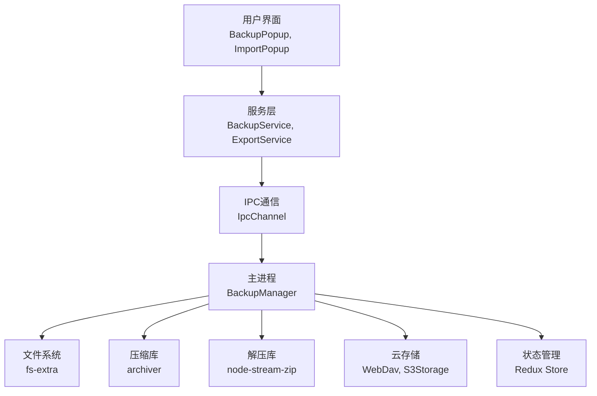
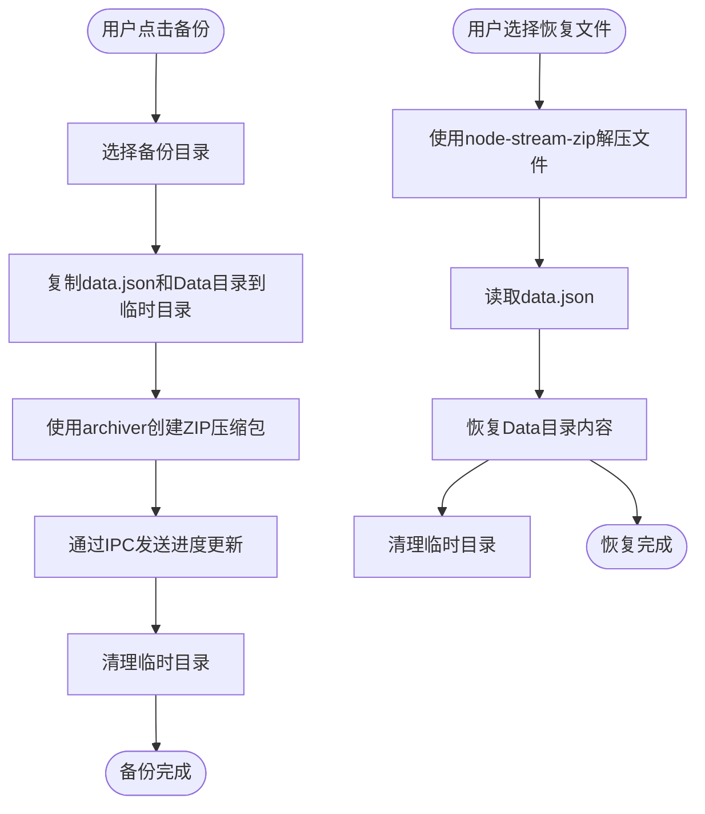
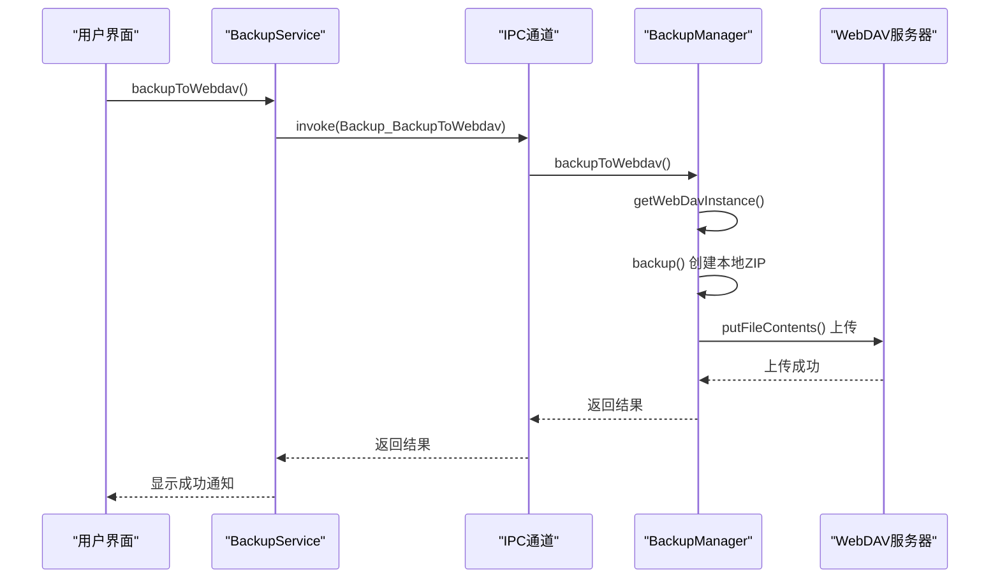
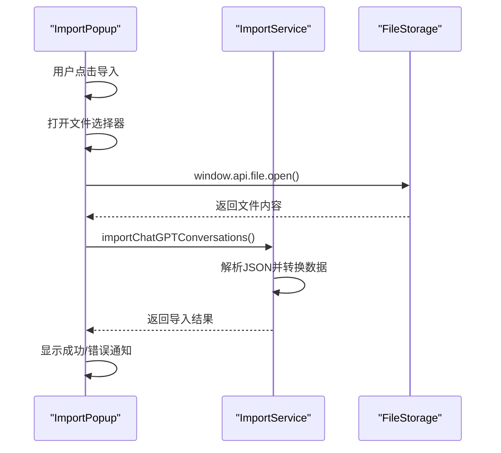
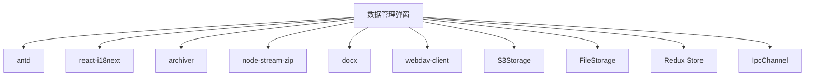

# 数据管理弹窗

<cite>
**本文档引用的文件**   
- [BackupService.ts](file://src/renderer/src/services/BackupService.ts)
- [BackupManager.ts](file://src/main/services/BackupManager.ts)
- [ExportService.ts](file://src/main/services/ExportService.ts)
- [ImportPopup.tsx](file://src/renderer/src/components/Popups/ImportPopup.tsx)
- [LocalBackupModals.tsx](file://src/renderer/src/components/LocalBackupModals.tsx)
- [WebdavModals.tsx](file://src/renderer/src/components/WebdavModals.tsx)
- [S3Modals.tsx](file://src/renderer/src/components/S3Modals.tsx)
- [IpcChannel.ts](file://packages/shared/IpcChannel.ts)
- [backup.ts](file://src/renderer/src/store/backup.ts)
</cite>

## 目录
1. [简介](#简介)
2. [核心组件](#核心组件)
3. [架构概述](#架构概述)
4. [详细组件分析](#详细组件分析)
5. [依赖分析](#依赖分析)
6. [性能考虑](#性能考虑)
7. [故障排除指南](#故障排除指南)
8. [结论](#结论)

## 简介
数据管理弹窗是Cherry Studio应用中用于处理数据备份、导入、恢复和导出等关键操作的核心用户界面组件。该系统设计旨在为用户提供安全、可靠且易于使用的数据管理功能，支持多种存储后端（包括本地目录、WebDAV和S3兼容存储）。弹窗通过清晰的进度显示、错误处理和用户反馈机制，确保用户能够直观地了解操作状态并及时响应潜在问题。本技术文档将全面阐述这些弹窗的设计原理和实现细节。

## 核心组件

数据管理弹窗系统由多个核心组件构成，包括用于备份的`BackupPopup`、用于从ChatGPT导入对话的`ImportPopup`，以及用于与不同云存储服务交互的`LocalBackupModals`、`WebdavModals`和`S3Modals`。这些组件通过`BackupService`和`ExportService`等后端服务进行通信，实现数据的持久化和传输。前端组件利用Ant Design的Modal和Progress组件构建用户界面，并通过IPC（进程间通信）与主进程的`BackupManager`进行交互。状态管理通过Redux store中的`backup` slice来维护同步状态和错误信息。

**Section sources**
- [BackupPopup.tsx](file://src/renderer/src/components/Popups/BackupPopup.tsx#L1-L116)
- [ImportPopup.tsx](file://src/renderer/src/components/Popups/ImportPopup.tsx#L1-L142)
- [LocalBackupModals.tsx](file://src/renderer/src/components/LocalBackupModals.tsx#L1-L50)
- [WebdavModals.tsx](file://src/renderer/src/components/WebdavModals.tsx#L39-L87)
- [S3Modals.tsx](file://src/renderer/src/components/S3Modals.tsx#L1-L257)

## 架构概述

数据管理弹窗的架构遵循清晰的分层模式，将用户界面、业务逻辑和数据访问层分离。前端组件（如`BackupPopup`）负责渲染UI和处理用户交互。`BackupService`作为中间层，封装了与主进程通信的复杂性，并提供了高级API。主进程中的`BackupManager`类是核心业务逻辑的执行者，它协调文件系统操作、压缩/解压、以及与外部存储服务（如WebDAV和S3）的通信。整个流程通过Electron的IPC机制连接，确保了渲染进程和主进程之间的安全数据交换。

**Diagram sources **
- [BackupService.ts](file://src/renderer/src/services/BackupService.ts#L1-L1080)
- [BackupManager.ts](file://src/main/services/BackupManager.ts#L1-L773)

## 详细组件分析

### 备份与恢复流程分析

备份与恢复是数据管理的核心功能。当用户触发备份时，`BackupPopup`组件会调用`BackupService`中的`backup`函数。该函数通过IPC调用主进程`BackupManager`的`backup`方法。`BackupManager`首先将应用数据（如`data.json`和`Data`目录）复制到临时目录，然后使用`archiver`库创建一个ZIP压缩包。在压缩过程中，会通过`BackupProgress` IPC通道向渲染进程发送进度更新，以在UI上显示进度条。恢复过程则相反，`restore`方法使用`node-stream-zip`库解压文件，并将数据写回应用的用户数据目录。

#### 备份与恢复流程图

**Diagram sources **
- [BackupService.ts](file://src/renderer/src/services/BackupService.ts#L65-L107)
- [BackupManager.ts](file://src/main/services/BackupManager.ts#L193-L351)

### 云存储集成分析

系统支持将备份文件存储到WebDAV和S3兼容的云存储服务。`BackupService`提供了`backupToWebdav`和`backupToS3`等高级API。这些API同样通过IPC调用`BackupManager`中的对应方法。`BackupManager`内部使用`getWebDavInstance`和`getS3Storage`方法来获取或复用已配置的客户端实例，以提高效率。上传时，可以选择流式传输（streaming）或一次性读取整个文件，以适应不同的网络环境和性能要求。对于WebDAV，使用`webdav-client`库；对于S3，则使用自定义的`S3Storage`类。

#### 云存储备份序列图

**Diagram sources **
- [BackupService.ts](file://src/renderer/src/services/BackupService.ts#L141-L297)
- [BackupManager.ts](file://src/main/services/BackupManager.ts#L425-L451)
- [IpcChannel.ts](file://packages/shared/IpcChannel.ts#L211-L214)

### 导入与导出功能分析

除了备份恢复，系统还提供了导入和导出功能。`ImportPopup`组件专门用于从ChatGPT导出的JSON文件中导入对话历史。用户选择文件后，`importChatGPTConversations`服务函数会解析JSON内容，并将其转换为应用内部的数据结构。导出功能则通过`ExportService`实现，目前支持将Markdown内容导出为Word文档（.docx格式）。`ExportService`使用`docx`库将Markdown解析为文档元素，并生成一个可下载的Word文件。

#### 导入功能序列图

**Diagram sources **
- [ImportPopup.tsx](file://src/renderer/src/components/Popups/ImportPopup.tsx#L1-L142)
- [ExportService.ts](file://src/main/services/ExportService.ts#L1-L409)

## 依赖分析

数据管理弹窗系统依赖于多个关键的第三方库和内部服务。前端依赖`antd`进行UI构建，`react-i18next`进行国际化。核心功能依赖于`archiver`进行文件压缩，`node-stream-zip`进行高效解压，以及`docx`库生成Word文档。云存储集成依赖`webdav-client`库。内部服务方面，`BackupManager`依赖`S3Storage`类与S3服务通信，并通过`FileStorage`服务进行文件读写。状态管理依赖Redux，通过`backup` slice存储同步状态。所有跨进程通信都通过定义在`IpcChannel`中的常量进行。

**Diagram sources **
- [package.json](file://package.json)
- [BackupManager.ts](file://src/main/services/BackupManager.ts#L1-L773)

## 性能考虑

系统在设计时充分考虑了大文件处理和性能优化。备份过程中，使用流式API进行文件读写和压缩，避免将整个大文件加载到内存中，从而有效管理内存使用。`BackupManager`中的`copyDirWithProgress`方法会先计算总文件数，然后在复制过程中按文件数而非字节数报告进度，以减少UI更新频率。对于云存储上传，提供了`disableStream`选项，允许在不稳定的网络环境下使用更可靠的非流式上传。自动备份功能实现了重试机制和指数退避算法，以应对临时的网络故障。此外，`BackupManager`会缓存S3和WebDAV的客户端实例，避免重复建立连接的开销。

## 故障排除指南

系统内置了全面的错误处理和用户反馈机制。所有关键操作都包裹在try-catch块中，错误会被记录到日志文件中，并通过`window.toast`向用户显示友好的错误消息。例如，在`backupToWebdav`函数中，如果上传失败，会记录错误日志，并通过`NotificationService`发送系统通知。对于文件操作，`BackupManager`实现了`setWritableRecursive`方法，以解决Windows系统上常见的文件权限问题。在自动备份失败时，系统会进行多次重试，并在最终失败后弹出错误对话框。用户可以通过查看日志文件（通常位于应用的用户数据目录中）来获取更详细的错误信息。

**Section sources**
- [BackupService.ts](file://src/renderer/src/services/BackupService.ts#L141-L297)
- [BackupManager.ts](file://src/main/services/BackupManager.ts#L64-L109)
- [LoggerService.ts](file://src/main/services/LoggerService.ts#L252-L309)

## 结论

Cherry Studio的数据管理弹窗系统是一个功能全面、设计精良的解决方案。它通过清晰的分层架构、健壮的错误处理和对大文件的优化处理，为用户提供了可靠的数据保护和迁移能力。系统支持多种存储后端，并通过直观的UI和实时进度反馈提升了用户体验。最佳实践包括定期进行手动备份、配置自动备份以防止数据丢失，以及在导入大型数据集前确保有足够的磁盘空间。未来可以考虑增加更多导出格式（如PDF）和更细粒度的备份选项。