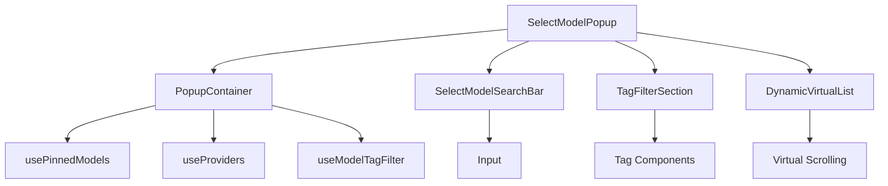
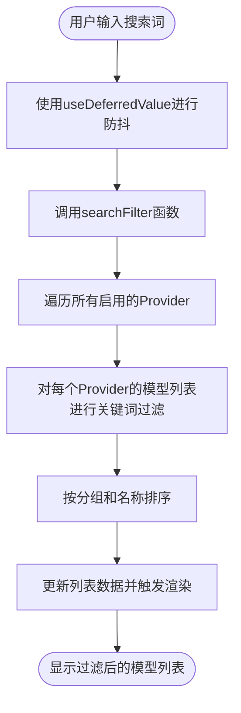
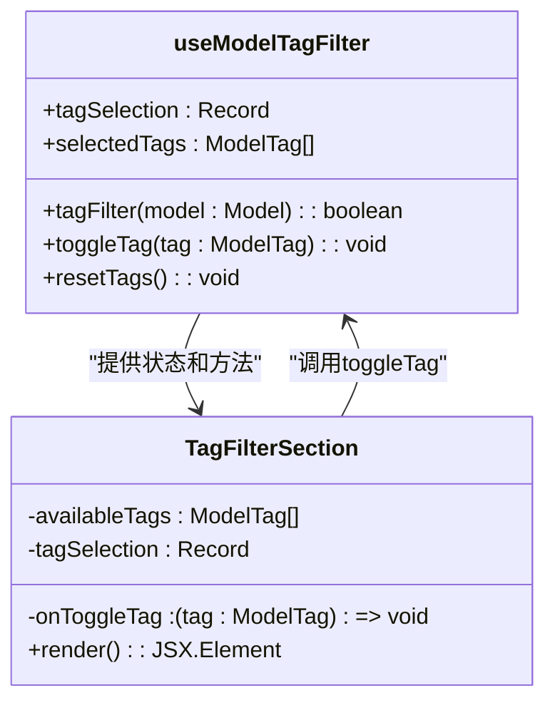
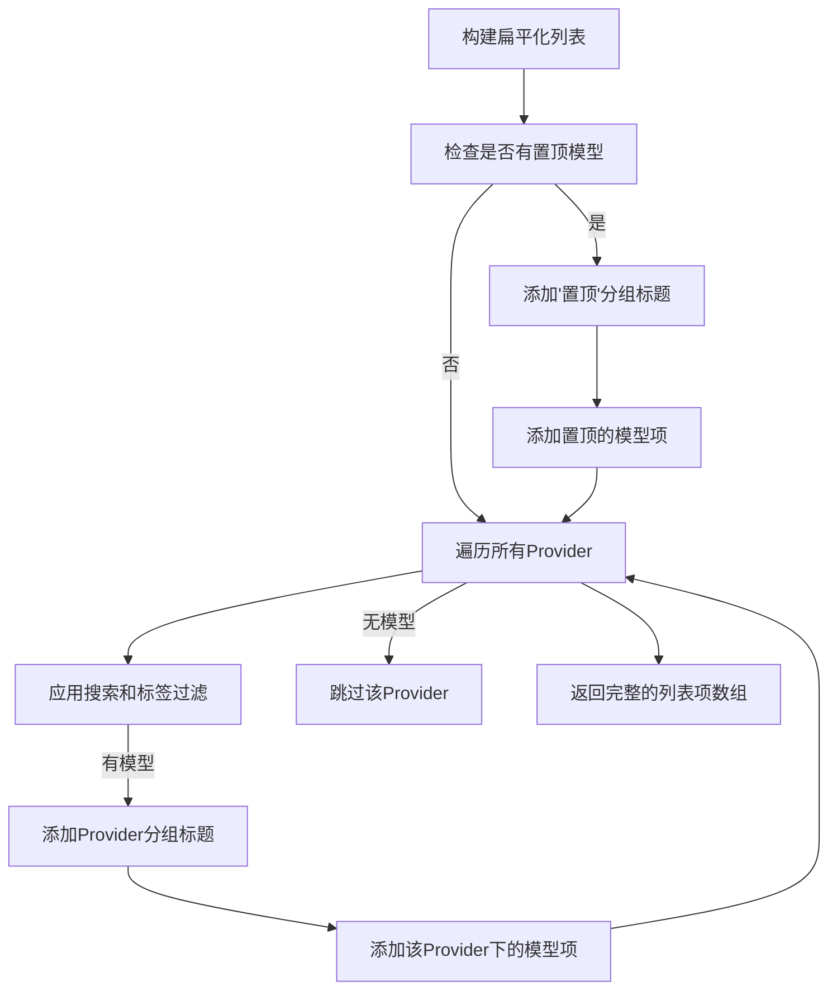
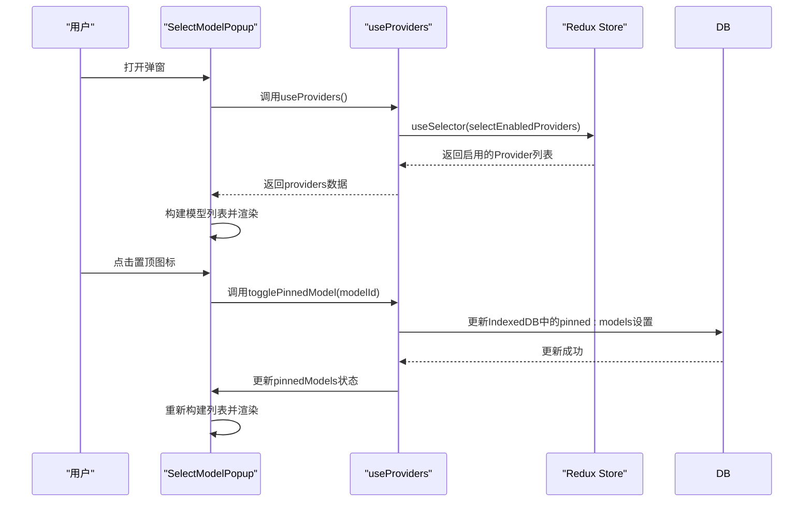

# 模型选择弹窗

<cite>
**本文档引用的文件**  
- [popup.tsx](file://src/renderer/src/components/Popups/SelectModelPopup/popup.tsx)
- [TagFilterSection.tsx](file://src/renderer/src/components/Popups/SelectModelPopup/TagFilterSection.tsx)
- [searchbar.tsx](file://src/renderer/src/components/Popups/SelectModelPopup/searchbar.tsx)
- [filters.ts](file://src/renderer/src/components/Popups/SelectModelPopup/filters.ts)
- [types.ts](file://src/renderer/src/components/Popups/SelectModelPopup/types.ts)
- [usePinnedModels.ts](file://src/renderer/src/hooks/usePinnedModels.ts)
- [useProvider.ts](file://src/renderer/src/hooks/useProvider.ts)
- [ModelService.ts](file://src/renderer/src/services/ModelService.ts)
</cite>

## 目录
1. [简介](#简介)
2. [核心架构设计](#核心架构设计)
3. [搜索过滤机制](#搜索过滤机制)
4. [标签筛选功能](#标签筛选功能)
5. [模型分组展示](#模型分组展示)
6. [状态管理与Redux集成](#状态管理与redux集成)
7. [虚拟滚动性能优化](#虚拟滚动性能优化)
8. [调用方式与参数配置](#调用方式与参数配置)
9. [最佳实践与性能建议](#最佳实践与性能建议)

## 简介

模型选择弹窗（SelectModelPopup）是Cherry Studio应用中的核心UI组件，为用户提供直观、高效的AI模型选择界面。该组件广泛应用于创建助手、会话设置等关键场景，支持搜索过滤、标签筛选、模型分组和置顶功能，旨在帮助用户在大量可用模型中快速定位和选择最适合的模型。

本技术文档将深入解析SelectModelPopup组件的架构设计、核心功能实现机制、与AI模型服务的集成方式以及性能优化策略，为开发者提供全面的技术参考。

## 核心架构设计

SelectModelPopup组件采用模块化、分层的架构设计，由多个高内聚、低耦合的子组件和Hook构成，确保了代码的可维护性和可扩展性。



**架构图源**
- [popup.tsx](file://src/renderer/src/components/Popups/SelectModelPopup/popup.tsx)
- [searchbar.tsx](file://src/renderer/src/components/Popups/SelectModelPopup/searchbar.tsx)
- [TagFilterSection.tsx](file://src/renderer/src/components/Popups/SelectModelPopup/TagFilterSection.tsx)

**本节源**
- [popup.tsx](file://src/renderer/src/components/Popups/SelectModelPopup/popup.tsx)

### 组件构成

1.  **主容器 (PopupContainer)**: 作为核心逻辑的承载者，负责管理弹窗状态、整合数据流、处理用户交互，并协调各个子组件的工作。
2.  **搜索栏 (SelectModelSearchBar)**: 提供文本输入功能，支持实时搜索和过滤模型列表。
3.  **标签筛选区 (TagFilterSection)**: 展示可用的模型标签（如视觉、推理、函数调用等），允许用户通过点击标签进行多维度筛选。
4.  **虚拟滚动列表 (DynamicVirtualList)**: 用于高效渲染大型模型列表，仅渲染可视区域内的项目，显著提升性能。
5.  **自定义Hook**: 包括`usePinnedModels`、`useProviders`和`useModelTagFilter`，用于封装和复用状态逻辑。

## 搜索过滤机制

搜索过滤功能允许用户通过输入关键词快速定位目标模型，其核心实现位于`popup.tsx`文件中。



**流程图源**
- [popup.tsx](file://src/renderer/src/components/Popups/SelectModelPopup/popup.tsx#L88-L100)

**本节源**
- [popup.tsx](file://src/renderer/src/components/Popups/SelectModelPopup/popup.tsx#L88-L100)
- [searchbar.tsx](file://src/renderer/src/components/Popups/SelectModelPopup/searchbar.tsx)

### 实现细节

1.  **防抖处理**: 使用React的`useDeferredValue` Hook对搜索输入进行防抖，避免在用户快速输入时频繁触发昂贵的过滤和渲染操作，提升响应速度。
2.  **过滤逻辑**: `searchFilter`回调函数是过滤的核心。它接收一个`Provider`对象，然后调用`filterModelsByKeywords`工具函数，根据用户输入的`searchText`对`provider.models`数组进行过滤。
3.  **排序**: 过滤后的模型列表会按照`group`和`name`字段进行排序，确保列表的展示具有逻辑性。
4.  **动态更新**: 整个过滤过程由`useMemo`包裹，确保只有当`searchText`或`providers`发生变化时，才会重新计算过滤结果，优化了性能。

## 标签筛选功能

标签筛选功能为用户提供了一种基于模型能力的多维度筛选方式，其实现由`TagFilterSection`组件和`useModelTagFilter` Hook共同完成。



**类图源**
- [filters.ts](file://src/renderer/src/components/Popups/SelectModelPopup/filters.ts)
- [TagFilterSection.tsx](file://src/renderer/src/components/Popups/SelectModelPopup/TagFilterSection.tsx)

**本节源**
- [filters.ts](file://src/renderer/src/components/Popups/SelectModelPopup/filters.ts)
- [TagFilterSection.tsx](file://src/renderer/src/components/Popups/SelectModelPopup/TagFilterSection.tsx)

### 实现细节

1.  **状态管理**: `useModelTagFilter` Hook内部维护一个`tagSelection`对象，记录每个标签的选中状态（`true`/`false`）。
2.  **筛选逻辑**: `tagFilter`函数是筛选的核心。当有标签被选中时，它会检查目标模型是否满足所有被选中标签的条件。筛选逻辑采用“与”（AND）关系，即模型必须同时具备所有选中的标签才能被显示。
3.  **标签映射**: `TagFilterSection`组件通过`tagComponents`对象将`ModelTag`枚举值映射到具体的UI标签组件（如`VisionTag`, `ReasoningTag`等），实现了UI的动态渲染。
4.  **可用标签计算**: `availableTags`列表是动态计算的，它遍历所有启用的Provider及其模型，通过`getModelTags`工具函数分析出当前环境下实际存在的标签，避免显示无意义的空标签。

## 模型分组展示

模型分组展示功能将模型按其所属的Provider进行逻辑分组，使列表结构更清晰。此外，还支持“置顶模型”分组，方便用户快速访问常用模型。



**流程图源**
- [popup.tsx](file://src/renderer/src/components/Popups/SelectModelPopup/popup.tsx#L139-L208)

**本节源**
- [popup.tsx](file://src/renderer/src/components/Popups/SelectModelPopup/popup.tsx#L139-L208)

### 实现细节

1.  **扁平化数据结构**: 列表数据被构建成一个扁平的`FlatListItem`数组，其中包含两种类型：`group`（分组标题）和`model`（模型项）。这种结构便于虚拟滚动列表的统一渲染。
2.  **置顶模型**: 置顶模型存储在IndexedDB数据库中（通过`usePinnedModels` Hook管理）。当无搜索文本时，系统会优先将置顶模型组成一个独立的分组（"pinned-group"）展示在列表顶部。
3.  **Provider分组**: 对于每个启用的Provider，如果其过滤后的模型列表不为空，则会添加一个以Provider名称为标题的分组，并将符合条件的模型项添加到该分组下。
4.  **分组操作**: 每个Provider分组标题右侧都提供了一个“设置”图标，用户点击后可直接跳转到该Provider的设置页面，提升了用户体验。

## 状态管理与Redux集成

SelectModelPopup组件的状态管理遵循清晰的分层原则，与Redux Store紧密集成，确保了应用状态的一致性和可预测性。



**序列图源**
- [popup.tsx](file://src/renderer/src/components/Popups/SelectModelPopup/popup.tsx)
- [useProvider.ts](file://src/renderer/src/hooks/useProvider.ts)
- [usePinnedModels.ts](file://src/renderer/src/hooks/usePinnedModels.ts)

**本节源**
- [useProvider.ts](file://src/renderer/src/hooks/useProvider.ts)
- [usePinnedModels.ts](file://src/renderer/src/hooks/usePinnedModels.ts)
- [popup.tsx](file://src/renderer/src/components/Popups/SelectModelPopup/popup.tsx)

### 集成方式

1.  **获取Provider数据**: `useProviders` Hook使用`useAppSelector`从Redux Store的`llm.providers`状态中选择所有已启用的Provider。它通过`createSelector`创建了一个记忆化的选择器，避免不必要的重渲染。
2.  **获取置顶模型**: `usePinnedModels` Hook负责管理置顶模型的状态。它从Redux Store关联的IndexedDB数据库中读取`pinned:models`设置，并将状态暴露给组件。当用户操作置顶时，它会通过`db.settings.put`更新数据库，并同步更新本地状态。
3.  **单向数据流**: 组件本身不直接修改Redux Store或数据库，而是通过调用Hook提供的方法（如`togglePinnedModel`）来触发状态变更，遵循了React和Redux的单向数据流原则。

## 虚拟滚动性能优化

为了应对可能包含数百个模型的大型列表，SelectModelPopup采用了虚拟滚动技术，极大地提升了渲染性能和用户体验。

**本节源**
- [popup.tsx](file://src/renderer/src/components/Popups/SelectModelPopup/popup.tsx#L437-L450)

### 实现策略

1.  **DynamicVirtualList组件**: 该组件是虚拟滚动的核心。它只渲染当前可视区域内的列表项，当用户滚动时，动态地更新渲染的项目，避免了渲染整个DOM树的开销。
2.  **性能关键参数**:
    *   `listHeight`: 根据`listItems`的长度和`ITEM_HEIGHT`动态计算，但最大不超过`PAGE_SIZE * ITEM_HEIGHT`，确保列表高度不会无限增长。
    *   `overscan`: 设置为5，意味着在可视区域的上方和下方各多渲染5个项目，以保证快速滚动时的流畅性。
    *   `scrollPaddingStart`: 设置为`ITEM_HEIGHT`，为粘性分组标题预留空间。
3.  **粘性分组**: `isSticky`函数标记了`group`类型的列表项，使得分组标题在滚动时可以固定在列表顶部，提升了可读性。
4.  **键盘导航优化**: 在处理键盘事件（如上下箭头）时，通过`listRef.current?.scrollToIndex`精确控制滚动位置，确保焦点项始终可见。

## 调用方式与参数配置

SelectModelPopup是一个静态类，通过`show`方法以Promise的形式被调用，使用方式简洁明了。

### 调用示例

```typescript
// 在创建助手的场景下调用
const selectedModel = await SelectModelPopup.show({
  model: currentAssistant.model, // 预选中的模型
  filter: (model) => model.type === 'chat', // 只显示聊天模型
  showTagFilter: true // 显示标签筛选区
});

if (selectedModel) {
  // 用户选择了模型，执行后续逻辑
  updateAssistantModel(selectedModel);
} else {
  // 用户取消了选择
  console.log('Model selection cancelled');
}
```

**本节源**
- [popup.tsx](file://src/renderer/src/components/Popups/SelectModelPopup/popup.tsx#L593-L604)

### 参数说明

| 参数 | 类型 | 必需 | 描述 |
| :--- | :--- | :--- | :--- |
| `model` | `Model` | 否 | 指定初始选中的模型，用于高亮显示。 |
| `filter` | `(model: Model) => boolean` | 否 | 基础过滤函数，用于在弹窗打开前对模型列表进行预筛选。 |
| `showTagFilter` | `boolean` | 否 | 控制是否显示标签筛选区域，默认为`true`。 |

## 最佳实践与性能建议

为了确保SelectModelPopup组件在各种场景下都能提供最佳性能和用户体验，建议遵循以下最佳实践：

1.  **合理使用基础过滤**: 在调用`show`方法时，应尽可能使用`filter`参数进行预筛选。例如，在创建文本助手时，只显示`type`为`text`的模型，可以显著减少需要渲染的模型数量。
2.  **避免过度复杂的标签筛选**: 虽然标签筛选功能强大，但应避免同时选中过多标签，因为这会增加`tagFilter`函数的计算复杂度。目前的筛选逻辑是“与”关系，选中标签越多，匹配的模型越少。
3.  **谨慎使用置顶功能**: 置顶模型会增加列表构建的复杂度，尤其是在无搜索文本时。建议用户将最常用的5-10个模型置顶即可。
4.  **监控Provider数量**: 应用中启用的Provider越多，需要处理的模型数据就越多。应定期审查和管理Provider列表，禁用不常用的Provider以优化性能。
5.  **利用防抖机制**: 组件内部已通过`useDeferredValue`实现了搜索输入的防抖，开发者无需在调用层面额外处理，但应理解其工作原理，避免在其他地方引入不必要的性能瓶颈。