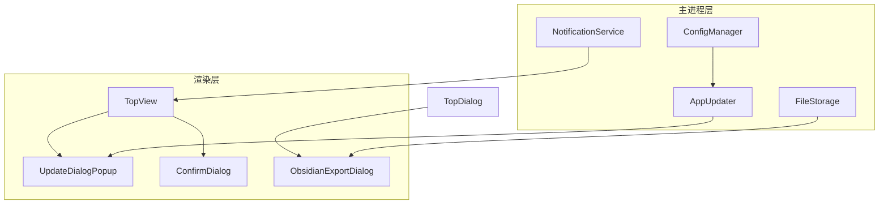
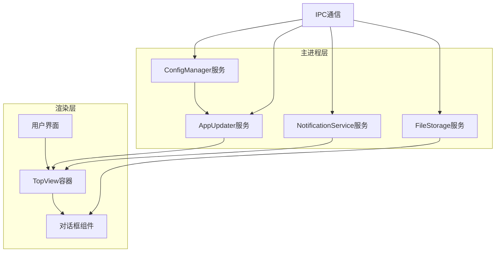
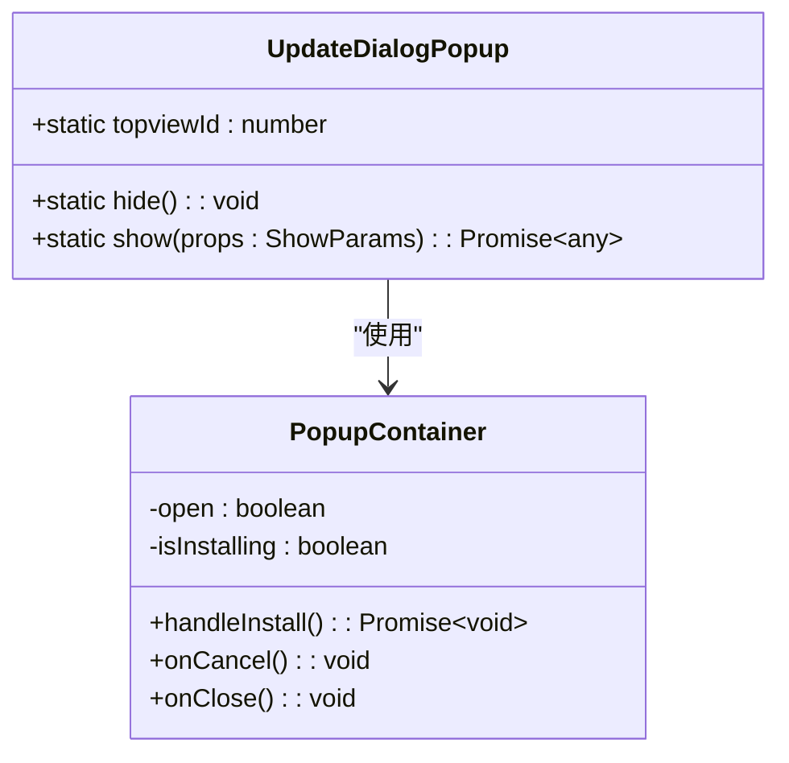
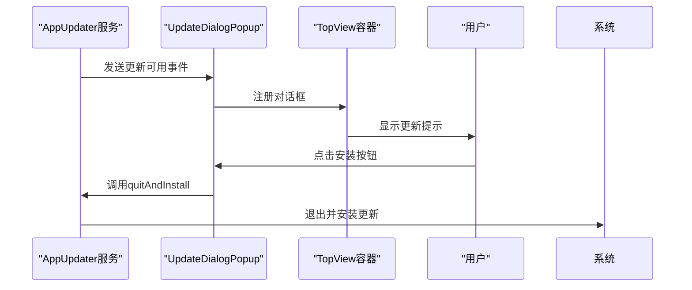
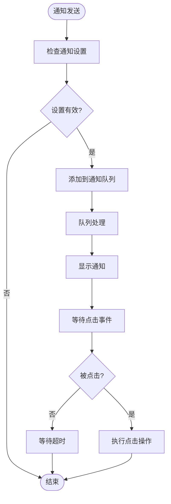
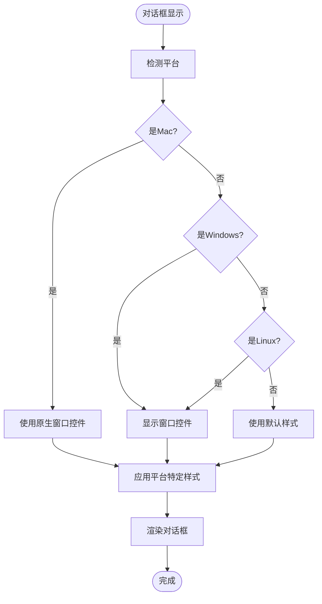
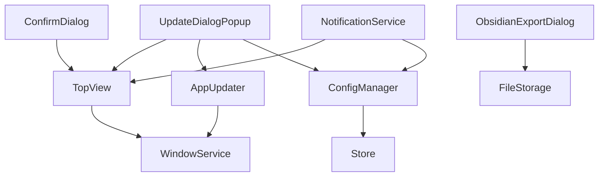

# 系统对话框

<cite>
**本文档中引用的文件**  
- [UpdateDialogPopup.tsx](file://src/renderer/src/components/Popups/UpdateDialogPopup.tsx)
- [AppUpdater.ts](file://src/main/services/AppUpdater.ts)
- [ConfigManager.ts](file://src/main/services/ConfigManager.ts)
- [TopView/index.tsx](file://src/renderer/src/components/TopView/index.tsx)
- [NotificationService.ts](file://src/main/services/NotificationService.ts)
- [NotificationService.ts](file://src/renderer/src/services/NotificationService.ts)
- [NotificationQueue.ts](file://src/renderer/src/queue/NotificationQueue.ts)
- [NotificationProvider.tsx](file://src/renderer/src/context/NotificationProvider.tsx)
- [constant.ts](file://src/main/constant.ts)
- [FileStorage.ts](file://src/main/services/FileStorage.ts)
- [WindowControls/index.tsx](file://src/renderer/src/components/WindowControls/index.tsx)
- [ObsidianExportDialog.tsx](file://src/renderer/src/components/ObsidianExportDialog.tsx)
- [ConfirmDialog.tsx](file://src/renderer/src/components/ConfirmDialog.tsx)
</cite>

## 目录
1. [简介](#简介)
2. [项目结构](#项目结构)
3. [核心组件](#核心组件)
4. [架构概述](#架构概述)
5. [详细组件分析](#详细组件分析)
6. [依赖分析](#依赖分析)
7. [性能考虑](#性能考虑)
8. [故障排除指南](#故障排除指南)
9. [结论](#结论)

## 简介
本系统对话框文档深入分析了Cherry Studio应用程序中的系统级对话框实现，重点关注版本更新提示、隐私政策展示和用户信息管理等场景。文档详细描述了对话框的全局注册机制、优先级管理和平行弹窗处理策略，以及与AppUpdater、ConfigManager等系统服务的集成方式。同时，文档还涵盖了无障碍访问实现细节，包括键盘导航、屏幕阅读器支持和高对比度模式，并提供了针对不同操作系统（Windows、Mac、Linux）的原生对话框集成指导和兼容性解决方案。

## 项目结构
Cherry Studio的对话框系统采用分层架构设计，主要分为渲染层（renderer）和主进程层（main）。渲染层负责对话框的UI展示和用户交互，而主进程层处理系统级操作和原生功能集成。对话框组件主要位于`src/renderer/src/components/`目录下，其中`Popups`子目录包含各种系统对话框实现。主进程服务位于`src/main/services/`目录，负责与操作系统交互和管理应用状态。

**图表来源**
- [UpdateDialogPopup.tsx](file://src/renderer/src/components/Popups/UpdateDialogPopup.tsx)
- [AppUpdater.ts](file://src/main/services/AppUpdater.ts)
- [ConfigManager.ts](file://src/main/services/ConfigManager.ts)
- [TopView/index.tsx](file://src/renderer/src/components/TopView/index.tsx)

**本节来源**
- [UpdateDialogPopup.tsx](file://src/renderer/src/components/Popups/UpdateDialogPopup.tsx)
- [AppUpdater.ts](file://src/main/services/AppUpdater.ts)
- [ConfigManager.ts](file://src/main/services/ConfigManager.ts)
- [TopView/index.tsx](file://src/renderer/src/components/TopView/index.tsx)

## 核心组件
系统对话框的核心组件包括UpdateDialogPopup、TopView容器、NotificationService和ConfigManager。这些组件协同工作，实现了统一的对话框管理和用户体验。UpdateDialogPopup负责版本更新提示的展示和交互，TopView容器提供全局对话框注册和管理机制，NotificationService处理系统通知的发送和接收，ConfigManager则管理应用配置和用户偏好设置。

**本节来源**
- [UpdateDialogPopup.tsx](file://src/renderer/src/components/Popups/UpdateDialogPopup.tsx)
- [TopView/index.tsx](file://src/renderer/src/components/TopView/index.tsx)
- [NotificationService.ts](file://src/main/services/NotificationService.ts)
- [ConfigManager.ts](file://src/main/services/ConfigManager.ts)

## 架构概述
系统对话框的架构设计遵循分层和解耦原则，确保了组件的可维护性和可扩展性。渲染层和主进程层通过Electron的IPC（进程间通信）机制进行交互，实现了安全的跨进程通信。对话框的展示和管理通过TopView容器实现全局注册，确保了对话框的统一管理和优先级控制。通知系统采用队列机制，确保了通知的有序处理和显示。

**图表来源**
- [UpdateDialogPopup.tsx](file://src/renderer/src/components/Popups/UpdateDialogPopup.tsx)
- [AppUpdater.ts](file://src/main/services/AppUpdater.ts)
- [ConfigManager.ts](file://src/main/services/ConfigManager.ts)
- [TopView/index.tsx](file://src/renderer/src/components/TopView/index.tsx)
- [NotificationService.ts](file://src/main/services/NotificationService.ts)
- [FileStorage.ts](file://src/main/services/FileStorage.ts)

## 详细组件分析
### UpdateDialogPopup分析
UpdateDialogPopup是版本更新提示对话框的核心实现，负责向用户展示新版本信息和更新选项。该组件通过TopView容器进行全局注册和管理，确保了对话框的统一展示和优先级控制。对话框的展示和隐藏通过静态方法实现，提供了简洁的API接口。

#### 对象导向组件

**图表来源**
- [UpdateDialogPopup.tsx](file://src/renderer/src/components/Popups/UpdateDialogPopup.tsx)

#### API/服务组件

**图表来源**
- [UpdateDialogPopup.tsx](file://src/renderer/src/components/Popups/UpdateDialogPopup.tsx)
- [AppUpdater.ts](file://src/main/services/AppUpdater.ts)
- [TopView/index.tsx](file://src/renderer/src/components/TopView/index.tsx)

**本节来源**
- [UpdateDialogPopup.tsx](file://src/renderer/src/components/Popups/UpdateDialogPopup.tsx)
- [AppUpdater.ts](file://src/main/services/AppUpdater.ts)
- [TopView/index.tsx](file://src/renderer/src/components/TopView/index.tsx)

### 通知系统分析
通知系统是系统对话框的重要组成部分，负责向用户传递重要信息和状态更新。系统采用队列机制管理通知，确保了通知的有序处理和显示。通知服务分为渲染层和主进程层两个部分，通过IPC机制进行通信。

#### 复杂逻辑组件

**图表来源**
- [NotificationService.ts](file://src/main/services/NotificationService.ts)
- [NotificationService.ts](file://src/renderer/src/services/NotificationService.ts)
- [NotificationQueue.ts](file://src/renderer/src/queue/NotificationQueue.ts)

**本节来源**
- [NotificationService.ts](file://src/main/services/NotificationService.ts)
- [NotificationService.ts](file://src/renderer/src/services/NotificationService.ts)
- [NotificationQueue.ts](file://src/renderer/src/queue/NotificationQueue.ts)

### 跨平台兼容性分析
系统对话框在不同操作系统上的表现需要保持一致，同时充分利用各平台的原生特性。通过条件编译和平台检测，系统能够根据运行环境调整对话框的行为和外观。

#### 复杂逻辑组件

**图表来源**
- [WindowControls/index.tsx](file://src/renderer/src/components/WindowControls/index.tsx)
- [constant.ts](file://src/main/constant.ts)

**本节来源**
- [WindowControls/index.tsx](file://src/renderer/src/components/WindowControls/index.tsx)
- [constant.ts](file://src/main/constant.ts)

## 依赖分析
系统对话框的实现依赖于多个核心服务和组件，这些依赖关系确保了对话框功能的完整性和一致性。主要依赖包括AppUpdater服务、ConfigManager服务、NotificationService服务和TopView容器。这些服务通过明确的接口进行交互，实现了松耦合的设计。

**图表来源**
- [UpdateDialogPopup.tsx](file://src/renderer/src/components/Popups/UpdateDialogPopup.tsx)
- [AppUpdater.ts](file://src/main/services/AppUpdater.ts)
- [ConfigManager.ts](file://src/main/services/ConfigManager.ts)
- [TopView/index.tsx](file://src/renderer/src/components/TopView/index.tsx)
- [NotificationService.ts](file://src/main/services/NotificationService.ts)
- [FileStorage.ts](file://src/main/services/FileStorage.ts)

**本节来源**
- [UpdateDialogPopup.tsx](file://src/renderer/src/components/Popups/UpdateDialogPopup.tsx)
- [AppUpdater.ts](file://src/main/services/AppUpdater.ts)
- [ConfigManager.ts](file://src/main/services/ConfigManager.ts)
- [TopView/index.tsx](file://src/renderer/src/components/TopView/index.tsx)
- [NotificationService.ts](file://src/main/services/NotificationService.ts)
- [FileStorage.ts](file://src/main/services/FileStorage.ts)

## 性能考虑
系统对话框的性能优化主要集中在减少资源消耗、提高响应速度和优化用户体验。通过使用轻量级的UI组件、优化渲染性能和合理管理内存，系统确保了对话框的流畅运行。同时，通过异步加载和延迟初始化，系统减少了启动时间和内存占用。

## 故障排除指南
当系统对话框出现问题时，可以按照以下步骤进行排查：
1. 检查主进程和渲染进程之间的IPC通信是否正常
2. 验证TopView容器是否正确注册和管理对话框
3. 检查相关服务（如AppUpdater、ConfigManager）是否正常运行
4. 查看日志文件以获取详细的错误信息

**本节来源**
- [UpdateDialogPopup.tsx](file://src/renderer/src/components/Popups/UpdateDialogPopup.tsx)
- [AppUpdater.ts](file://src/main/services/AppUpdater.ts)
- [ConfigManager.ts](file://src/main/services/ConfigManager.ts)
- [TopView/index.tsx](file://src/renderer/src/components/TopView/index.tsx)

## 结论
Cherry Studio的系统对话框设计充分考虑了用户体验、可维护性和跨平台兼容性。通过分层架构和松耦合设计，系统实现了灵活的对话框管理和一致的用户体验。未来可以进一步优化对话框的动画效果和响应速度，提升整体用户体验。