# 图像工具Hook详细实现文档

<cite>
**本文档中引用的文件**
- [useImageTools.tsx](file://src/renderer/src/components/ActionTools/hooks/useImageTools.tsx)
- [useImageTools.test.tsx](file://src/renderer/src/components/ActionTools/__tests__/useImageTools.test.tsx)
- [ImagePreviewService.ts](file://src/renderer/src/services/ImagePreviewService.ts)
- [image.ts](file://src/renderer/src/utils/image.ts)
- [useRichEditor.ts](file://src/renderer/src/components/RichEditor/useRichEditor.ts)
- [ImagePreviewLayout.tsx](file://src/renderer/src/components/Preview/ImagePreviewLayout.tsx)
- [ImageToolbar.tsx](file://src/renderer/src/components/Preview/ImageToolbar.tsx)
</cite>

## 目录
1. [简介](#简介)
2. [项目结构](#项目结构)
3. [核心组件](#核心组件)
4. [架构概览](#架构概览)
5. [详细组件分析](#详细组件分析)
6. [依赖关系分析](#依赖关系分析)
7. [性能考虑](#性能考虑)
8. [故障排除指南](#故障排除指南)
9. [结论](#结论)

## 简介

useImageTools Hook是一个功能强大的图像处理工具集合，专为React应用程序设计，提供了完整的图像操作功能。该Hook集成了图像缩放、平移、复制、下载和预览等核心功能，特别适用于SVG图像的处理和展示。

该Hook的设计理念是提供一个统一的接口来处理各种图像操作需求，同时保持高性能和良好的用户体验。它支持拖拽平移、滚轮缩放、多种格式转换（PNG/SVG），以及与文件系统的深度集成。

## 项目结构

useImageTools Hook位于Cherry Studio项目的组件工具模块中，其文件组织结构如下：

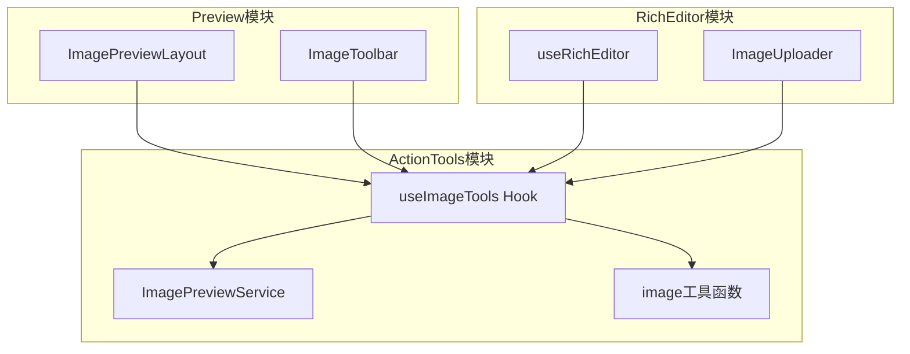

**图表来源**
- [useImageTools.tsx](file://src/renderer/src/components/ActionTools/hooks/useImageTools.tsx#L1-L294)
- [ImagePreviewService.ts](file://src/renderer/src/services/ImagePreviewService.ts#L1-L88)

**章节来源**
- [useImageTools.tsx](file://src/renderer/src/components/ActionTools/hooks/useImageTools.tsx#L1-L294)
- [ImagePreviewLayout.tsx](file://src/renderer/src/components/Preview/ImagePreviewLayout.tsx#L1-L61)

## 核心组件

### useImageTools Hook

useImageTools是一个高度封装的自定义Hook，提供以下核心功能：

#### 主要功能特性
- **图像变换控制**：支持平移（pan）和缩放（zoom）操作
- **交互式操作**：支持拖拽平移和滚轮缩放
- **多格式处理**：支持PNG和SVG格式的图像处理
- **剪贴板集成**：提供图像复制到剪贴板功能
- **下载功能**：支持PNG和SVG格式的图像下载
- **预览服务**：集成图像预览对话框功能

#### 核心API接口

```typescript
interface ImageToolsAPI {
  pan: (dx: number, dy: number, absolute?: boolean) => void
  zoom: (delta: number, absolute?: boolean) => void
  copy: () => Promise<void>
  download: (format: 'svg' | 'png') => Promise<void>
  dialog: () => Promise<void>
  getCurrentTransform: () => TransformState
}
```

**章节来源**
- [useImageTools.tsx](file://src/renderer/src/components/ActionTools/hooks/useImageTools.tsx#L16-L293)

## 架构概览

useImageTools Hook采用模块化架构设计，各功能模块职责明确，相互协作：

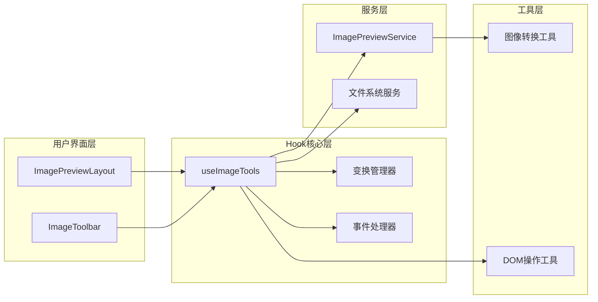

**图表来源**
- [useImageTools.tsx](file://src/renderer/src/components/ActionTools/hooks/useImageTools.tsx#L1-L294)
- [ImagePreviewService.ts](file://src/renderer/src/services/ImagePreviewService.ts#L1-L88)

## 详细组件分析

### 图像变换系统

#### 平移（Pan）功能

平移功能允许用户在图像上进行拖拽操作，支持相对和绝对定位模式：

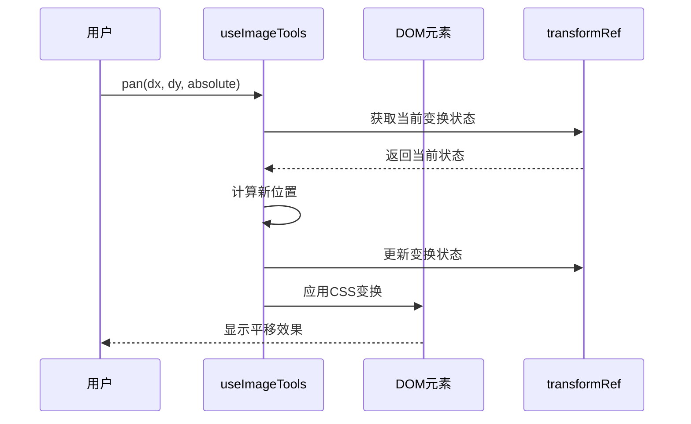

**图表来源**
- [useImageTools.tsx](file://src/renderer/src/components/ActionTools/hooks/useImageTools.tsx#L87-L99)

#### 缩放（Zoom）功能

缩放功能提供灵活的图像放大缩小能力，支持动态范围限制：

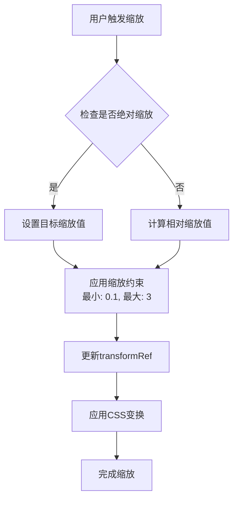

**图表来源**
- [useImageTools.tsx](file://src/renderer/src/components/ActionTools/hooks/useImageTools.tsx#L168-L179)

**章节来源**
- [useImageTools.tsx](file://src/renderer/src/components/ActionTools/hooks/useImageTools.tsx#L87-L179)

### 交互式操作支持

#### 拖拽平移实现

拖拽功能通过事件监听器实现，提供流畅的用户体验：

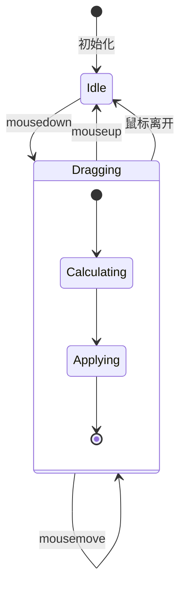

**图表来源**
- [useImageTools.tsx](file://src/renderer/src/components/ActionTools/hooks/useImageTools.tsx#L102-L162)

#### 滚轮缩放支持

滚轮缩放功能结合Ctrl/Cmd键检测，提供精确的缩放控制：

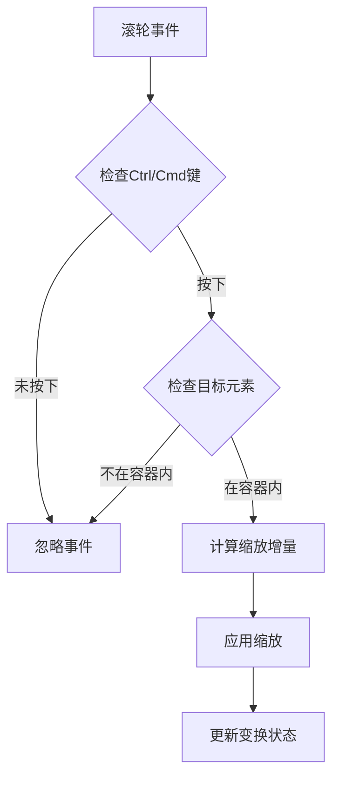

**图表来源**
- [useImageTools.tsx](file://src/renderer/src/components/ActionTools/hooks/useImageTools.tsx#L182-L200)

**章节来源**
- [useImageTools.tsx](file://src/renderer/src/components/ActionTools/hooks/useImageTools.tsx#L102-L200)

### 图像处理功能

#### 复制到剪贴板

复制功能将SVG元素转换为PNG格式后复制到系统剪贴板：

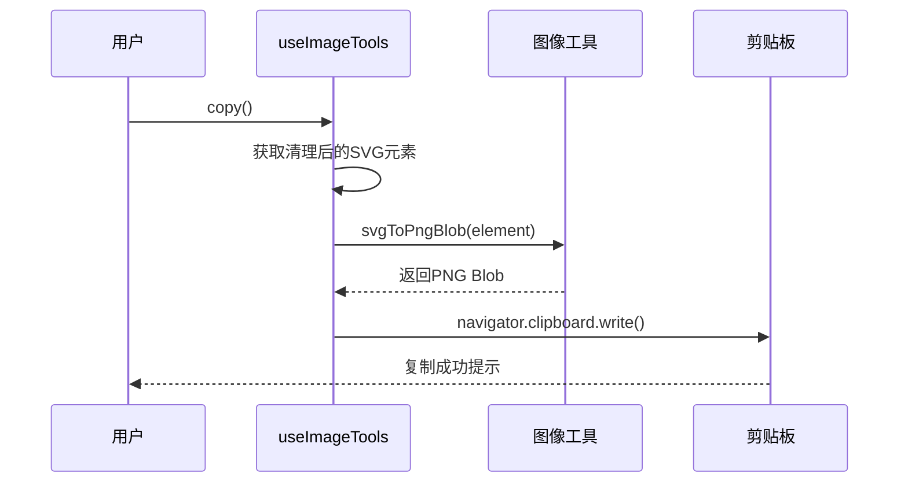

**图表来源**
- [useImageTools.tsx](file://src/renderer/src/components/ActionTools/hooks/useImageTools.tsx#L207-L219)

#### 下载功能

下载功能支持PNG和SVG两种格式，提供灵活的文件保存选项：

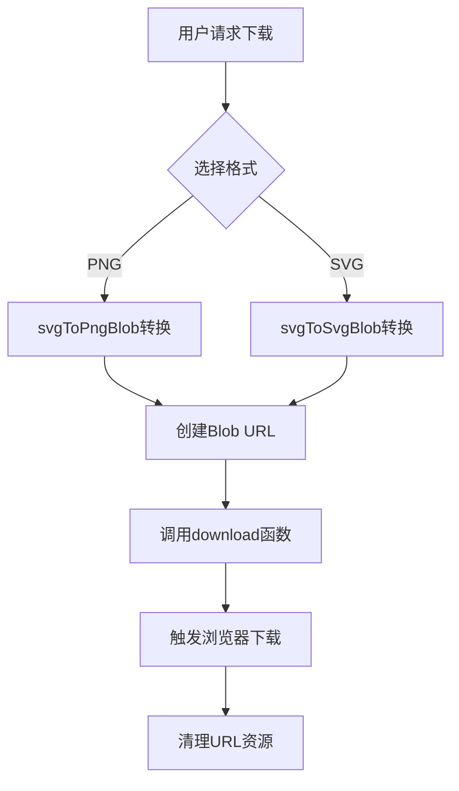

**图表来源**
- [useImageTools.tsx](file://src/renderer/src/components/ActionTools/hooks/useImageTools.tsx#L226-L249)

**章节来源**
- [useImageTools.tsx](file://src/renderer/src/components/ActionTools/hooks/useImageTools.tsx#L207-L249)

### 预览服务集成

#### ImagePreviewService

预览服务提供了统一的图像预览接口，支持多种输入类型：

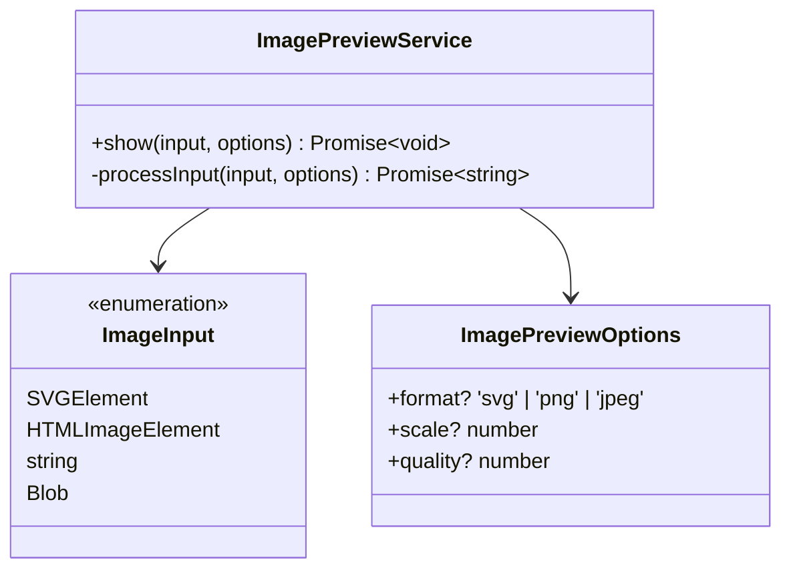

**图表来源**
- [ImagePreviewService.ts](file://src/renderer/src/services/ImagePreviewService.ts#L8-L14)
- [ImagePreviewService.ts](file://src/renderer/src/services/ImagePreviewService.ts#L20-L88)

**章节来源**
- [ImagePreviewService.ts](file://src/renderer/src/services/ImagePreviewService.ts#L1-L88)

## 依赖关系分析

### 核心依赖关系

useImageTools Hook的依赖关系体现了清晰的分层架构：

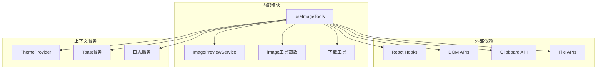

**图表来源**
- [useImageTools.tsx](file://src/renderer/src/components/ActionTools/hooks/useImageTools.tsx#L1-L9)

### 文件系统集成

Hook与文件系统的交互通过多个服务层实现：

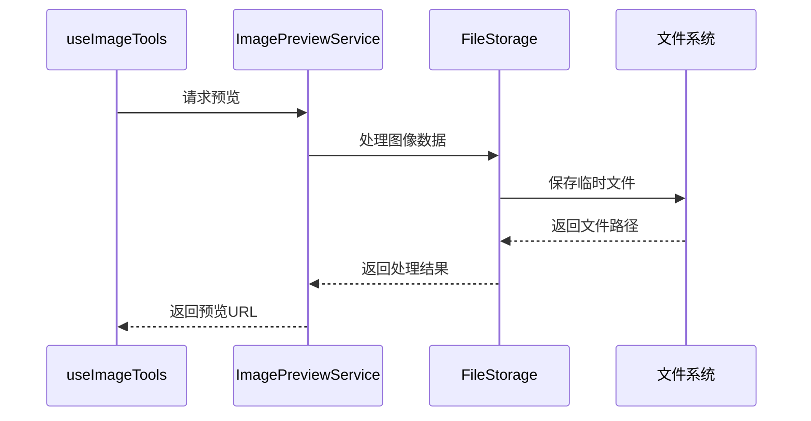

**图表来源**
- [ImagePreviewService.ts](file://src/renderer/src/services/ImagePreviewService.ts#L26-L58)

**章节来源**
- [useImageTools.tsx](file://src/renderer/src/components/ActionTools/hooks/useImageTools.tsx#L1-L9)
- [ImagePreviewService.ts](file://src/renderer/src/services/ImagePreviewService.ts#L1-L88)

## 性能考虑

### 大文件处理优化

针对大文件处理，Hook采用了多种优化策略：

#### 1. 变换状态管理
- 使用ref存储变换状态，避免频繁的重新渲染
- 实现了变换状态的缓存和复用机制
- 支持变换状态的批量更新

#### 2. DOM操作优化
- 使用CSS变换而非直接修改样式属性
- 实现了变换矩阵的高效计算
- 避免不必要的DOM查询和重排

#### 3. 内存管理
- 及时清理创建的URL对象
- 实现了事件监听器的自动清理
- 支持主题切换时的状态重置

### 错误处理机制

Hook实现了完善的错误处理和恢复机制：

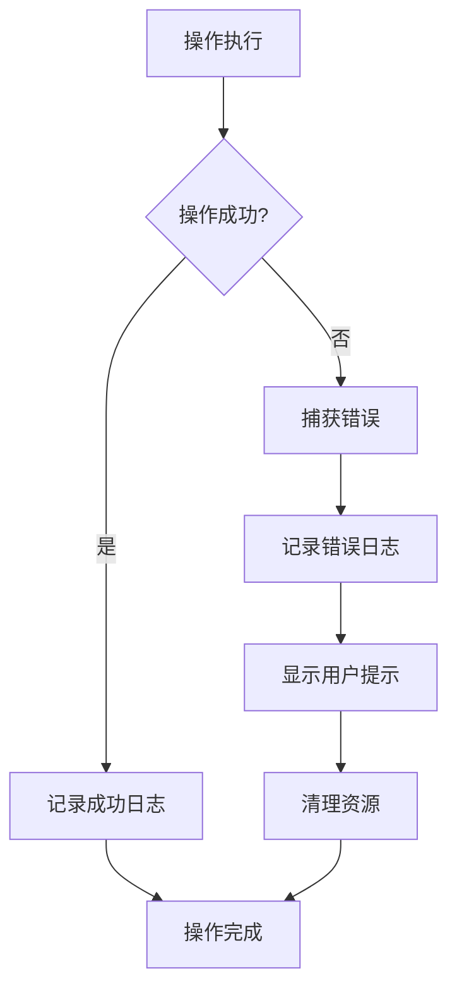

**章节来源**
- [useImageTools.tsx](file://src/renderer/src/components/ActionTools/hooks/useImageTools.tsx#L215-L219)
- [useImageTools.tsx](file://src/renderer/src/components/ActionTools/hooks/useImageTools.tsx#L245-L249)

## 故障排除指南

### 常见问题及解决方案

#### 1. 图像无法正确显示
**问题描述**：SVG图像在预览中显示异常
**解决方案**：
- 检查SVG元素的选择器配置
- 验证图像格式支持
- 确认DOM结构正确性

#### 2. 拖拽功能失效
**问题描述**：拖拽平移功能无法正常使用
**解决方案**：
- 确认`enableDrag`选项已启用
- 检查容器元素的事件监听器
- 验证鼠标事件的传播状态

#### 3. 复制功能失败
**问题描述**：图像复制到剪贴板失败
**解决方案**：
- 检查浏览器的剪贴板权限
- 验证SVG到PNG的转换过程
- 确认浏览器兼容性

#### 4. 下载功能异常
**问题描述**：图像下载功能无法正常工作
**解决方案**：
- 检查文件格式支持
- 验证Blob对象的创建
- 确认下载链接的有效性

**章节来源**
- [useImageTools.test.tsx](file://src/renderer/src/components/ActionTools/__tests__/useImageTools.test.tsx#L331-L374)

## 结论

useImageTools Hook是一个功能完备、设计精良的图像处理工具集合。它成功地将复杂的图像操作功能封装成简洁易用的API接口，同时保持了良好的性能和用户体验。

### 主要优势

1. **功能完整性**：涵盖了图像处理的各个方面，从基本的缩放平移到高级的格式转换
2. **用户体验**：提供了直观的交互方式，如拖拽和平移操作
3. **性能优化**：采用了多种优化策略，确保大文件处理的流畅性
4. **错误处理**：实现了完善的错误处理和恢复机制
5. **可扩展性**：模块化的架构设计便于功能扩展和维护

### 最佳实践建议

1. **合理配置选项**：根据具体使用场景调整`enableDrag`和`enableWheelZoom`选项
2. **及时清理资源**：确保在组件卸载时正确清理事件监听器
3. **错误边界处理**：在使用Hook的组件中添加适当的错误边界
4. **性能监控**：对于大量图像处理场景，建议添加性能监控机制

该Hook为Cherry Studio项目提供了强大的图像处理能力，是现代Web应用中图像工具实现的优秀范例。