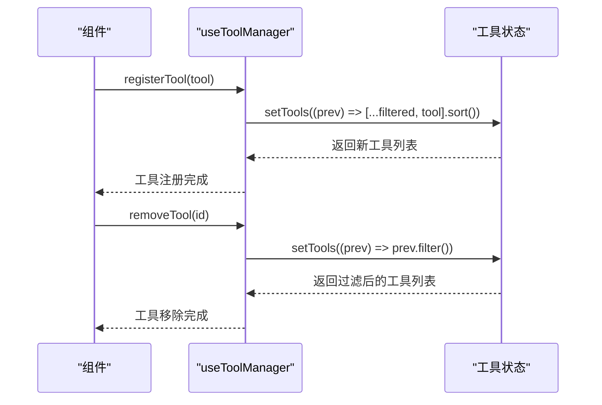
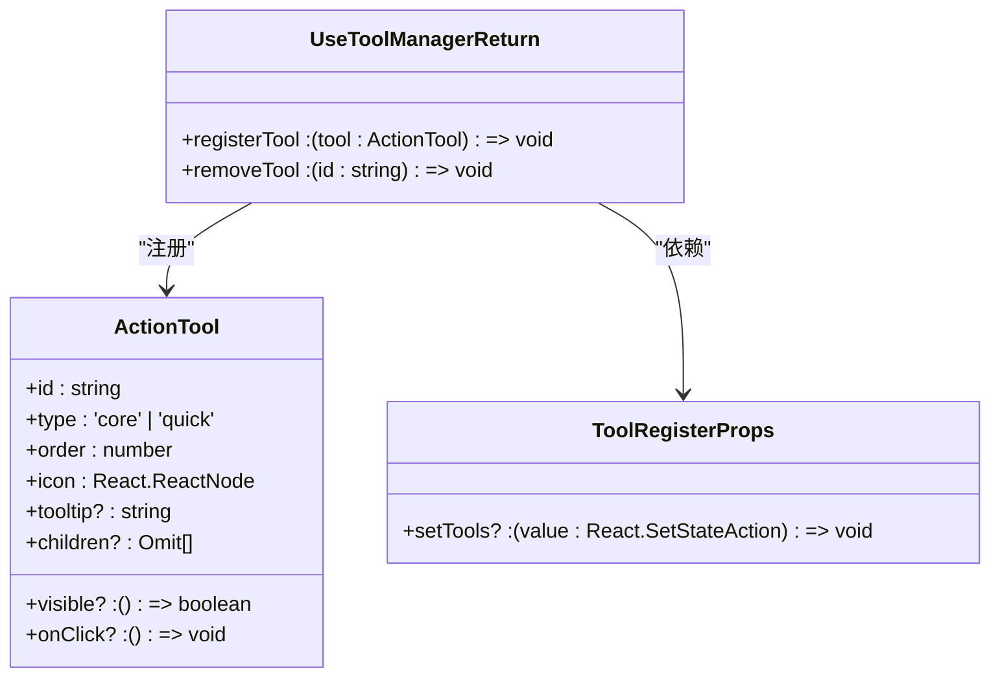
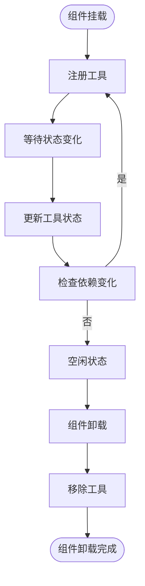
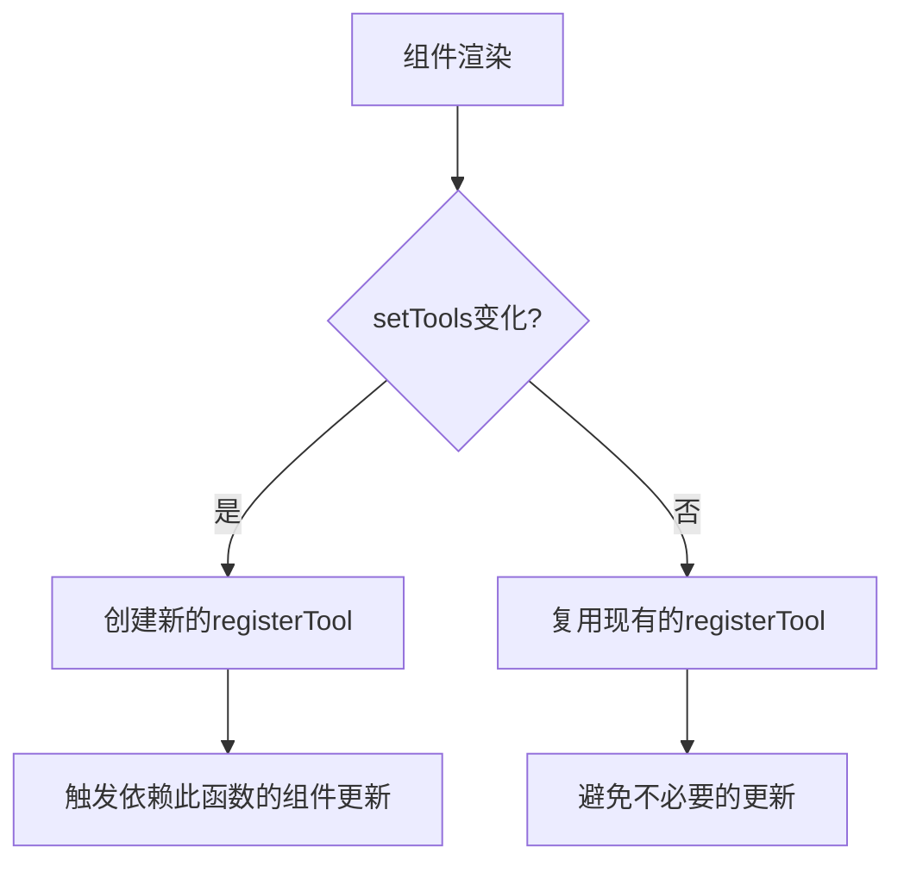

# 工具管理器Hook

<cite>
**本文档引用的文件**  
- [useToolManager.ts](file://src/renderer/src/components/ActionTools/hooks/useToolManager.ts)
- [types.ts](file://src/renderer/src/components/ActionTools/types.ts)
- [useRunTool.tsx](file://src/renderer/src/components/CodeToolbar/hooks/useRunTool.tsx)
- [useCopyTool.tsx](file://src/renderer/src/components/CodeToolbar/hooks/useCopyTool.tsx)
- [useDownloadTool.tsx](file://src/renderer/src/components/CodeToolbar/hooks/useDownloadTool.tsx)
- [useToolManager.test.ts](file://src/renderer/src/components/ActionTools/__tests__/useToolManager.test.ts)
</cite>

## 目录
1. [简介](#简介)
2. [核心机制](#核心机制)
3. [工具注册表数据结构](#工具注册表数据结构)
4. [状态同步机制](#状态同步机制)
5. [使用示例](#使用示例)
6. [性能优化策略](#性能优化策略)
7. [调试指南](#调试指南)
8. [总结](#总结)

## 简介
`useToolManager` 是一个React Hook，用于管理UI工具栏中工具的动态注册、排序和移除。它提供了一套简洁的API来管理工具集合，支持工具的动态添加、更新和删除，并自动维护工具的显示顺序。该Hook被广泛应用于代码编辑器工具栏、输入栏等需要动态管理操作工具的场景。

**Section sources**
- [useToolManager.ts](file://src/renderer/src/components/ActionTools/hooks/useToolManager.ts#L1-L26)

## 核心机制

### 工具注册与更新
`useToolManager` 提供了 `registerTool` 方法用于注册新工具或更新现有工具。当注册一个工具时，如果已存在相同ID的工具，则会替换原有工具，确保每个工具ID的唯一性。注册过程中，工具列表会根据 `order` 属性进行降序排列，order值越大的工具在界面中越靠左显示。

工具注册采用 `useCallback` 进行记忆化处理，避免在组件重新渲染时创建新的函数实例，从而提高性能。`registerTool` 的依赖数组仅包含 `setTools`，这意味着只有当 `setTools` 函数发生变化时，`registerTool` 才会重新创建。

### 工具移除
`removeTool` 方法用于从工具列表中移除指定ID的工具。该方法同样使用 `useCallback` 进行记忆化，通过过滤操作创建新的工具数组，符合React的不可变性原则。移除操作不会影响其他工具的顺序和状态。

**Diagram sources**
- [useToolManager.ts](file://src/renderer/src/components/ActionTools/hooks/useToolManager.ts#L7-L25)

**Section sources**
- [useToolManager.ts](file://src/renderer/src/components/ActionTools/hooks/useToolManager.ts#L5-L26)

## 工具注册表数据结构

### ActionTool 接口
`ActionTool` 接口定义了工具的基本结构，包含以下核心属性：

| 属性 | 类型 | 描述 |
|------|------|------|
| id | string | 工具的唯一标识符 |
| type | 'core' \| 'quick' | 工具类型，区分核心工具和快捷工具 |
| order | number | 显示顺序，数值越大越靠左 |
| icon | React.ReactNode | 工具的显示图标 |
| tooltip | string? | 鼠标悬停时的提示文本 |
| visible | () => boolean? | 工具的可见性条件函数 |
| onClick | () => void? | 点击工具时的回调函数 |
| children | Omit<ActionTool, 'children'>[]? | 子工具数组，用于构建下拉菜单 |

### 工具注册参数
`ToolRegisterProps` 接口定义了工具注册所需的参数，主要包含一个可选的 `setTools` 函数，用于更新父组件的工具状态。

**Diagram sources**
- [types.ts](file://src/renderer/src/components/ActionTools/types.ts#L4-L34)

**Section sources**
- [types.ts](file://src/renderer/src/components/ActionTools/types.ts#L1-L34)

## 状态同步机制

### 状态更新流程
`useToolManager` 通过传入的 `setTools` 函数与父组件进行状态同步。当调用 `registerTool` 或 `removeTool` 时，Hook会通过 `setTools` 的函数式更新模式来修改工具列表。这种模式确保了状态更新基于最新的状态值，避免了由于闭包导致的状态不一致问题。

在注册工具时，首先过滤掉ID相同的现有工具，然后将新工具添加到列表末尾，最后根据 `order` 属性进行降序排序。这种实现确保了工具列表的有序性和唯一性。

### 边界情况处理
`useToolManager` 对多种边界情况进行妥善处理：
- 当 `setTools` 未提供时，`registerTool` 和 `removeTool` 不会抛出错误，而是安全地执行空操作
- 移除不存在的工具ID时，不会影响现有工具列表
- 工具注册时自动处理重复ID，新工具会覆盖旧工具

这些设计使得 `useToolManager` 具有良好的容错性和健壮性，能够在各种使用场景下稳定工作。

**Section sources**
- [useToolManager.ts](file://src/renderer/src/components/ActionTools/hooks/useToolManager.ts#L9-L25)
- [useToolManager.test.ts](file://src/renderer/src/components/ActionTools/__tests__/useToolManager.test.ts#L101-L110)

## 使用示例

### 基本使用模式
在组件中使用 `useToolManager` 的典型模式是将其与 `useEffect` 结合，在组件挂载时注册工具，在卸载时移除工具：

**Diagram sources**
- [useRunTool.tsx](file://src/renderer/src/components/CodeToolbar/hooks/useRunTool.tsx#L15-L32)

### 具体实现示例
以下是几个实际使用 `useToolManager` 的具体示例：

#### 运行工具 (Run Tool)
`useRunTool` Hook用于管理代码块的运行功能。它根据运行状态动态更新工具图标，运行时显示加载动画，空闲时显示播放图标。当组件卸载时，自动移除注册的工具。

**Section sources**
- [useRunTool.tsx](file://src/renderer/src/components/CodeToolbar/hooks/useRunTool.tsx#L1-L32)

#### 复制工具 (Copy Tool)
`useCopyTool` 实现了复制功能，包含源码复制和图片复制两个子功能。它使用 `useTemporaryValue` Hook在复制成功后短暂显示勾选图标，提供视觉反馈。根据预览组件的可用性，动态决定是否显示图片复制功能。

**Section sources**
- [useCopyTool.tsx](file://src/renderer/src/components/CodeToolbar/hooks/useCopyTool.tsx#L1-L91)

#### 下载工具 (Download Tool)
`useDownloadTool` 根据上下文提供不同的下载选项。当预览组件可用时，显示包含多种格式（源码、SVG、PNG）的下拉菜单；否则仅显示基本的下载功能。这种条件性功能展示体现了 `useToolManager` 的灵活性。

**Section sources**
- [useDownloadTool.tsx](file://src/renderer/src/components/CodeToolbar/hooks/useDownloadTool.tsx#L1-L63)

## 性能优化策略

### Memoization（记忆化）
`useToolManager` 充分利用了React的 `useCallback` Hook对 `registerTool` 和 `removeTool` 方法进行记忆化处理。这确保了在组件重新渲染时，这些方法的引用保持不变，避免了不必要的子组件重新渲染。

**Diagram sources**
- [useToolManager.ts](file://src/renderer/src/components/ActionTools/hooks/useToolManager.ts#L7-L25)

### 依赖追踪
`useCallback` 的依赖数组仅包含 `setTools`，这是经过精心设计的优化。由于 `registerTool` 和 `removeTool` 的逻辑不依赖于外部状态，仅当状态更新函数发生变化时才需要重新创建，这种最小化的依赖追踪大大减少了函数重新创建的频率。

### 批量状态更新
工具注册和移除操作都采用函数式状态更新模式，确保状态更新基于最新的状态值。同时，排序操作在单次状态更新中完成，避免了多次状态更新导致的性能问题和潜在的状态不一致。

**Section sources**
- [useToolManager.ts](file://src/renderer/src/components/ActionTools/hooks/useToolManager.ts#L7-L25)

## 调试指南

### 常见问题及解决方案

#### 状态不一致问题
**现象**：工具列表未按预期更新或排序不正确。
**原因**：可能是由于 `setTools` 函数的闭包问题，或在错误的时机调用注册/移除方法。
**解决方案**：
1. 确保在 `useEffect` 的依赖数组中包含所有影响工具状态的变量
2. 使用函数式更新模式确保基于最新状态进行操作
3. 检查 `order` 值是否正确设置

#### 工具重复注册
**现象**：同一工具被多次注册，导致界面显示异常。
**原因**：`useEffect` 未正确清理，或在组件渲染过程中多次调用注册方法。
**解决方案**：
1. 在 `useEffect` 中返回清理函数，确保组件卸载时移除工具
2. 确保注册逻辑只在依赖变化时执行
3. 利用 `useToolManager` 的ID去重机制，确保相同ID的工具被正确替换

#### 性能问题
**现象**：工具栏更新导致界面卡顿。
**原因**：频繁的状态更新或未正确记忆化回调函数。
**解决方案**：
1. 检查 `useCallback` 的依赖数组是否正确
2. 避免在渲染过程中直接调用 `registerTool`
3. 使用 `React.memo` 包装工具栏组件，避免不必要的重新渲染

### 调试技巧
1. 使用React DevTools检查组件的重新渲染频率
2. 在 `setTools` 更新时添加日志，跟踪状态变化
3. 利用 `useToolManager` 的测试用例作为参考，验证预期行为

**Section sources**
- [useToolManager.test.ts](file://src/renderer/src/components/ActionTools/__tests__/useToolManager.test.ts#L1-L217)

## 总结
`useToolManager` 是一个精心设计的React Hook，提供了简洁而强大的工具管理功能。通过合理的状态管理、性能优化和边界情况处理，它为动态UI组件的开发提供了可靠的基础。其核心优势在于：
- **简洁的API**：仅提供 `registerTool` 和 `removeTool` 两个方法，易于理解和使用
- **自动排序**：基于 `order` 属性自动维护工具显示顺序
- **ID去重**：确保工具ID的唯一性，新工具自动替换旧工具
- **健壮性**：对各种边界情况进行妥善处理，提高系统的稳定性
- **性能优化**：通过记忆化和最小化依赖追踪，确保高性能

该Hook的设计模式可作为其他状态管理Hook的参考，体现了React Hooks在复杂状态管理场景下的强大能力。