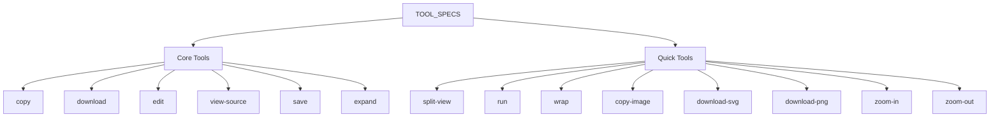
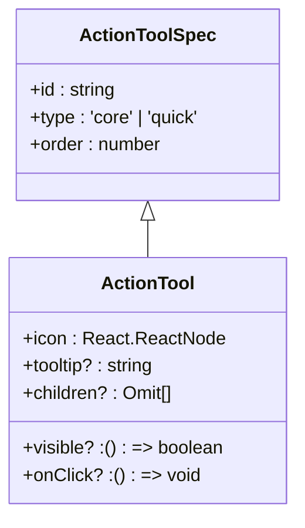
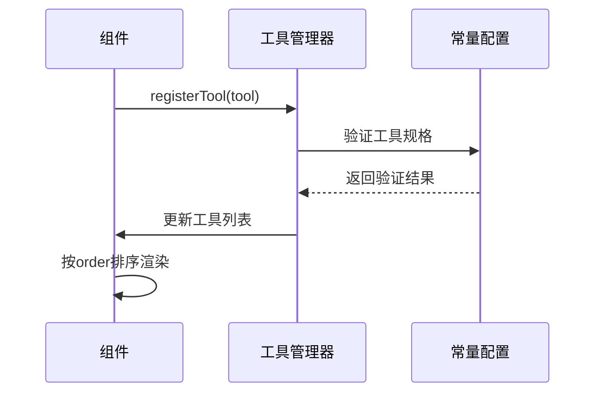
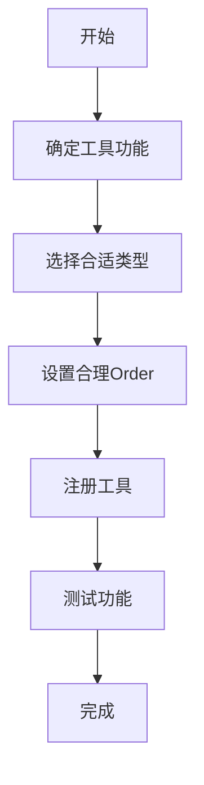

# 操作工具常量配置

<cite>
**本文档引用的文件**  
- [constants.ts](file://src/renderer/src/components/ActionTools/constants.ts)
- [types.ts](file://src/renderer/src/components/ActionTools/types.ts)
- [useToolManager.ts](file://src/renderer/src/components/ActionTools/hooks/useToolManager.ts)
- [useImageTools.tsx](file://src/renderer/src/components/ActionTools/hooks/useImageTools.tsx)
- [view.tsx](file://src/renderer/src/components/CodeBlockView/view.tsx)
</cite>

## 目录
1. [引言](#引言)
2. [核心常量定义](#核心常量定义)
3. [工具类型与状态枚举](#工具类型与状态枚举)
4. [配置参数详解](#配置参数详解)
5. [常量使用场景与作用范围](#常量使用场景与作用范围)
6. [常量值含义与可选范围](#常量值含义与可选范围)
7. [修改常量的影响分析](#修改常量的影响分析)
8. [最佳实践](#最佳实践)
9. [常见问题排查与解决方案](#常见问题排查与解决方案)
10. [结论](#结论)

## 引言

操作工具组件（ActionTools）是Cherry Studio中用于管理用户界面交互工具的核心模块。该模块通过预定义的常量配置来统一管理各种工具的类型、显示顺序和行为特征。本参考文档系统性地列出并解释ActionTools模块中定义的所有常量，包括工具类型标识、状态枚举和配置参数，为开发者提供完整的配置参考。

**Section sources**
- [constants.ts](file://src/renderer/src/components/ActionTools/constants.ts#L1-L77)
- [types.ts](file://src/renderer/src/components/ActionTools/types.ts#L1-L34)

## 核心常量定义

ActionTools模块的核心常量主要定义在`constants.ts`文件中，通过`TOOL_SPECS`对象集中管理所有工具的基本规格。这些常量构成了工具系统的配置基础。

**Diagram sources**
- [constants.ts](file://src/renderer/src/components/ActionTools/constants.ts#L3-L75)

**Section sources**
- [constants.ts](file://src/renderer/src/components/ActionTools/constants.ts#L1-L77)

## 工具类型与状态枚举

工具类型通过字符串字面量类型进行严格定义，确保类型安全和代码可维护性。

**Diagram sources**
- [types.ts](file://src/renderer/src/components/ActionTools/types.ts#L4-L27)

**Section sources**
- [types.ts](file://src/renderer/src/components/ActionTools/types.ts#L1-L34)

## 配置参数详解

### 工具规格参数

| 参数 | 类型 | 描述 | 默认值 |
|------|------|------|--------|
| id | string | 工具的唯一标识符 | 无 |
| type | 'core' \| 'quick' | 工具类型，区分核心工具和快速工具 | 无 |
| order | number | 显示顺序，数值越小越靠右 | 无 |

### 工具管理参数

| 参数 | 类型 | 描述 | 默认值 |
|------|------|------|--------|
| setTools | (value: React.SetStateAction\<ActionTool[]\>) => void | 工具状态更新函数 | undefined |

**Section sources**
- [types.ts](file://src/renderer/src/components/ActionTools/types.ts#L4-L34)
- [useToolManager.ts](file://src/renderer/src/components/ActionTools/hooks/useToolManager.ts#L5-L26)

## 常量使用场景与作用范围

### 使用场景

1. **工具注册**：在组件初始化时注册特定工具
2. **工具管理**：动态添加、移除或更新工具
3. **UI渲染**：根据工具类型和顺序渲染工具栏
4. **权限控制**：基于工具类型实现不同的访问控制

### 作用范围

- **组件级**：单个UI组件内部的工具管理
- **模块级**：跨多个组件的工具协调
- **应用级**：全局工具配置和状态管理

**Diagram sources**
- [useToolManager.ts](file://src/renderer/src/components/ActionTools/hooks/useToolManager.ts#L5-L26)
- [constants.ts](file://src/renderer/src/components/ActionTools/constants.ts#L3-L75)

**Section sources**
- [useToolManager.ts](file://src/renderer/src/components/ActionTools/hooks/useToolManager.ts#L1-L27)
- [constants.ts](file://src/renderer/src/components/ActionTools/constants.ts#L1-L77)

## 常量值含义与可选范围

### 工具类型值

- **'core'**：核心工具，通常为基本功能操作
- **'quick'**：快速工具，通常为快捷操作或视图控制

### Order值范围

- **1-10**：最右侧优先位置
- **11-20**：右侧常规位置
- **21-30**：中间位置
- **31-40**：左侧常规位置
- **41+**：最左侧位置

### 特殊值约定

- **order: 10**：下载工具的基准位置
- **order: 11**：复制工具的基准位置
- **order: 12**：编辑和查看源码工具的基准位置
- **order: 20**：展开和自动换行工具的基准位置

**Section sources**
- [constants.ts](file://src/renderer/src/components/ActionTools/constants.ts#L3-L75)

## 修改常量的影响分析

### 修改工具类型的影响

- **功能分类变化**：可能影响工具的分组和显示逻辑
- **样式变化**：不同类型的工具可能有不同的视觉样式
- **权限变化**：某些操作可能对特定类型工具有特殊限制

### 修改Order值的影响

- **UI布局变化**：工具在工具栏中的相对位置发生变化
- **用户体验影响**：常用工具的位置变化可能影响操作效率
- **响应式布局**：在小屏幕设备上可能影响工具的可见性

### 修改ID值的影响

- **引用失效**：所有通过ID引用该工具的代码将失效
- **状态丢失**：用户自定义的工具配置可能丢失
- **国际化问题**：相关翻译文本的键名需要同步更新

**Section sources**
- [constants.ts](file://src/renderer/src/components/ActionTools/constants.ts#L3-L75)
- [useToolManager.ts](file://src/renderer/src/components/ActionTools/hooks/useToolManager.ts#L9-L11)

## 最佳实践

### 安全扩展自定义工具类型

1. **遵循命名规范**：使用小写字母和连字符
2. **避免ID冲突**：确保自定义ID的唯一性
3. **合理设置Order**：根据工具的重要性和使用频率设置合适的顺序

**Diagram sources**
- [useToolManager.ts](file://src/renderer/src/components/ActionTools/hooks/useToolManager.ts#L7-L13)

### 常量使用建议

1. **优先使用预定义常量**：避免硬编码值
2. **保持类型一致性**：确保所有工具遵循相同的接口定义
3. **合理组织工具顺序**：根据用户操作习惯优化工具布局
4. **考虑响应式设计**：在不同屏幕尺寸下测试工具显示效果

**Section sources**
- [constants.ts](file://src/renderer/src/components/ActionTools/constants.ts#L3-L75)
- [useToolManager.ts](file://src/renderer/src/components/ActionTools/hooks/useToolManager.ts#L5-L26)

## 常见问题排查与解决方案

### 工具不显示问题

**可能原因**：
- 工具ID重复
- Order值设置不当
- visible条件不满足

**解决方案**：
1. 检查工具ID是否唯一
2. 验证Order值是否在合理范围内
3. 调试visible函数的返回值

### 工具点击无效问题

**可能原因**：
- onClick事件未正确绑定
- 工具被禁用
- 权限不足

**解决方案**：
1. 检查onClick函数定义
2. 验证工具的启用状态
3. 确认用户权限设置

### 工具顺序错乱问题

**可能原因**：
- 多个组件同时注册工具
- 排序逻辑错误
- 异步加载导致顺序不确定

**解决方案**：
1. 确保工具注册的顺序一致性
2. 检查排序算法实现
3. 使用同步方式加载关键工具

**Section sources**
- [useToolManager.ts](file://src/renderer/src/components/ActionTools/hooks/useToolManager.ts#L9-L11)
- [view.tsx](file://src/renderer/src/components/CodeBlockView/view.tsx#L88-L233)

## 结论

ActionTools模块的常量配置为Cherry Studio提供了灵活而强大的工具管理能力。通过系统化的常量定义和严格的类型约束，确保了工具系统的可维护性和扩展性。开发者在使用这些常量时，应遵循最佳实践，合理配置工具参数，以提供最佳的用户体验。对于自定义扩展，建议在充分理解现有配置的基础上进行安全的扩展，避免破坏系统的稳定性。