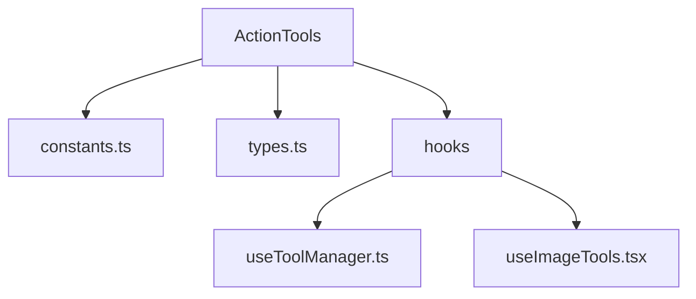
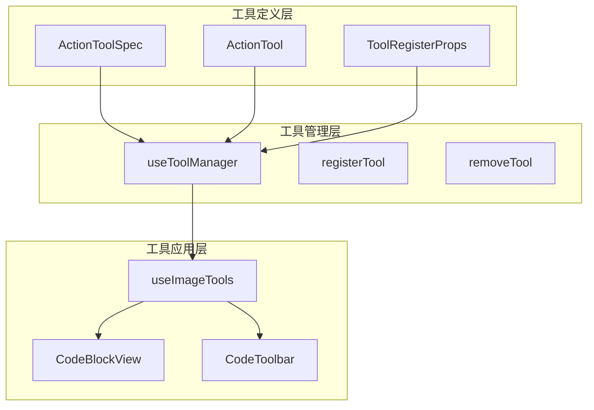
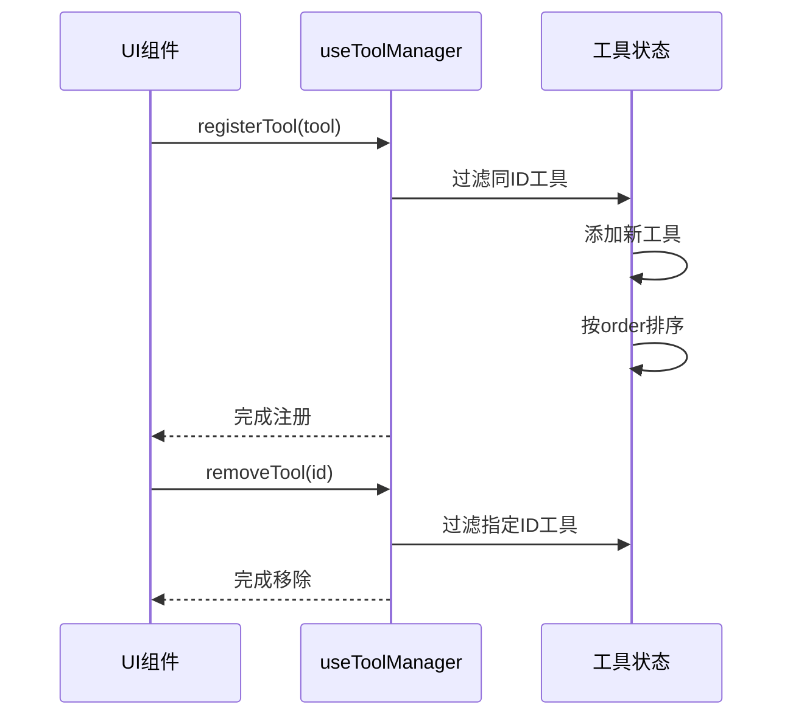
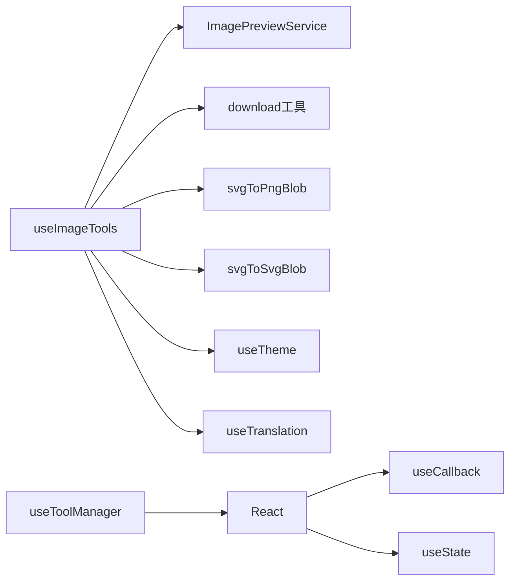

# 操作工具组件

<cite>
**本文档引用的文件**  
- [useToolManager.ts](file://src/renderer/src/components/ActionTools/hooks/useToolManager.ts)
- [useImageTools.tsx](file://src/renderer/src/components/ActionTools/hooks/useImageTools.tsx)
- [types.ts](file://src/renderer/src/components/ActionTools/types.ts)
- [constants.ts](file://src/renderer/src/components/ActionTools/constants.ts)
- [CodeBlockView/view.tsx](file://src/renderer/src/components/CodeBlockView/view.tsx)
- [CodeToolbar/hooks/useCopyTool.tsx](file://src/renderer/src/components/CodeToolbar/hooks/useCopyTool.tsx)
</cite>

## 目录
1. [简介](#简介)
2. [项目结构](#项目结构)
3. [核心组件](#核心组件)
4. [架构概述](#架构概述)
5. [详细组件分析](#详细组件分析)
6. [依赖分析](#依赖分析)
7. [性能考虑](#性能考虑)
8. [故障排除指南](#故障排除指南)
9. [结论](#结论)

## 简介
本文档详细描述了Cherry Studio中的操作工具组件，重点介绍useToolManager和useImageTools两个核心Hook的工作机制。文档涵盖了组件的props、状态管理、事件处理流程，以及如何在对话界面中集成和使用这些操作工具。同时解释了工具管理器的注册机制和工具调用流程，并提供了自定义操作工具的扩展方法和最佳实践。

## 项目结构
操作工具组件位于`src/renderer/src/components/ActionTools`目录下，主要包含hooks、types和constants等子目录和文件。该组件通过React Hooks提供可复用的工具管理功能，支持图像处理、工具注册和状态管理等核心功能。



**图源**  
- [constants.ts](file://src/renderer/src/components/ActionTools/constants.ts)
- [types.ts](file://src/renderer/src/components/ActionTools/types.ts)
- [useToolManager.ts](file://src/renderer/src/components/ActionTools/hooks/useToolManager.ts)
- [useImageTools.tsx](file://src/renderer/src/components/ActionTools/hooks/useImageTools.tsx)

**本节来源**  
- [src/renderer/src/components/ActionTools](file://src/renderer/src/components/ActionTools)

## 核心组件
操作工具组件的核心是useToolManager和useImageTools两个Hook。useToolManager负责工具的注册和管理，而useImageTools提供图像处理功能，包括缩放、平移、复制和下载等操作。这些组件通过TypeScript接口定义了清晰的API契约，确保类型安全和代码可维护性。

**本节来源**  
- [useToolManager.ts](file://src/renderer/src/components/ActionTools/hooks/useToolManager.ts)
- [useImageTools.tsx](file://src/renderer/src/components/ActionTools/hooks/useImageTools.tsx)
- [types.ts](file://src/renderer/src/components/ActionTools/types.ts)

## 架构概述
操作工具组件采用模块化架构设计，通过分离关注点实现高内聚低耦合。组件架构分为三个主要层次：工具定义层、工具管理层和工具应用层。工具定义层通过ActionTool接口描述工具的元数据，工具管理层提供工具注册和管理功能，工具应用层则在具体UI组件中使用这些工具。



**图源**  
- [types.ts](file://src/renderer/src/components/ActionTools/types.ts)
- [useToolManager.ts](file://src/renderer/src/components/ActionTools/hooks/useToolManager.ts)
- [useImageTools.tsx](file://src/renderer/src/components/ActionTools/hooks/useImageTools.tsx)

## 详细组件分析

### useToolManager分析
useToolManager是一个自定义Hook，用于管理操作工具的注册和移除。它通过useState和useCallback Hooks实现高效的工具管理功能。

#### 工具管理机制


**图源**  
- [useToolManager.ts](file://src/renderer/src/components/ActionTools/hooks/useToolManager.ts)

**本节来源**  
- [useToolManager.ts](file://src/renderer/src/components/ActionTools/hooks/useToolManager.ts)

### useImageTools分析
useImageTools是一个功能丰富的自定义Hook，提供图像处理工具集，包括缩放、平移、复制和下载等功能。

#### 图像工具工作机制
```mermaid
flowchart TD
Start([初始化]) --> 创建Ref["创建transformRef"]
创建Ref --> 注册事件["注册拖拽和滚轮事件"]
注册事件 --> 提供API["提供zoom、pan、copy等API"]
子图1[缩放功能] {
Zoom["zoom(delta)"] --> 计算新比例["计算新缩放比例"]
计算新比例 --> 更新Ref["更新transformRef.scale"]
更新Ref --> 应用变换["applyTransform()"]
}
子图2[平移功能] {
Pan["pan(dx,dy)"] --> 获取当前位置["getCurrentPosition()"]
获取当前位置 --> 计算新位置["计算新坐标"]
计算新位置 --> 更新Ref["更新transformRef.x/y"]
更新Ref --> 应用变换
}
子图3[复制功能] {
Copy["copy()"] --> 获取纯净元素["getCleanImgElement()"]
获取纯净元素 --> 转换为PNG["svgToPngBlob()"]
转换为PNG --> 复制到剪贴板["navigator.clipboard.write()"]
}
应用变换 --> End([完成])
```

**图源**  
- [useImageTools.tsx](file://src/renderer/src/components/ActionTools/hooks/useImageTools.tsx)

**本节来源**  
- [useImageTools.tsx](file://src/renderer/src/components/ActionTools/hooks/useImageTools.tsx)

## 依赖分析
操作工具组件依赖于多个外部服务和工具，形成了清晰的依赖关系网络。



**图源**  
- [useImageTools.tsx](file://src/renderer/src/components/ActionTools/hooks/useImageTools.tsx)
- [useToolManager.ts](file://src/renderer/src/components/ActionTools/hooks/useToolManager.ts)

**本节来源**  
- [useImageTools.tsx](file://src/renderer/src/components/ActionTools/hooks/useImageTools.tsx)
- [useToolManager.ts](file://src/renderer/src/components/ActionTools/hooks/useToolManager.ts)

## 性能考虑
操作工具组件在设计时充分考虑了性能优化，通过多种技术手段确保高效运行。

1. **事件处理优化**：使用useCallback记忆化事件处理函数，避免不必要的重新渲染
2. **变换状态管理**：使用ref存储变换状态，避免频繁的状态更新
3. **资源清理**：在组件卸载时及时清理事件监听器，防止内存泄漏
4. **批处理操作**：对连续的变换操作进行批处理，减少DOM操作次数

**本节来源**  
- [useImageTools.tsx](file://src/renderer/src/components/ActionTools/hooks/useImageTools.tsx)
- [useToolManager.ts](file://src/renderer/src/components/ActionTools/hooks/useToolManager.ts)

## 故障排除指南
### 常见问题及解决方案

| 问题现象 | 可能原因 | 解决方案 |
|---------|--------|--------|
| 工具无法注册 | setTools未正确传递 | 检查父组件是否提供了setTools回调 |
| 图像无法复制 | 浏览器权限限制 | 确保在安全上下文中运行，检查clipboard API权限 |
| 缩放功能失效 | 滚轮事件被阻止 | 检查是否正确处理了ctrl/meta键组合 |
| 拖拽卡顿 | 频繁的状态更新 | 确保只在拖拽结束时更新ref状态 |

### 状态同步问题
当遇到工具状态不同步问题时，建议检查以下几点：
1. 确认useToolManager的setTools回调是否正确传递
2. 检查工具注册时的order值是否合理
3. 验证组件重新渲染时是否正确保留了工具状态

**本节来源**  
- [useToolManager.ts](file://src/renderer/src/components/ActionTools/hooks/useToolManager.ts)
- [useImageTools.tsx](file://src/renderer/src/components/ActionTools/hooks/useImageTools.tsx)

## 结论
操作工具组件通过精心设计的Hook架构，为Cherry Studio提供了灵活且强大的工具管理能力。useToolManager和useImageTools两个核心Hook不仅实现了各自的功能，还通过清晰的API设计支持了组件的可扩展性和可维护性。该组件的设计模式可作为其他功能模块的参考实现，体现了React Hooks在复杂状态管理场景下的优势。