# 操作工具组件架构

<cite>
**本文档引用的文件**
- [types.ts](file://src/renderer/src/components/ActionTools/types.ts)
- [useToolManager.ts](file://src/renderer/src/components/ActionTools/hooks/useToolManager.ts)
- [constants.ts](file://src/renderer/src/components/ActionTools/constants.ts)
- [useImageTools.tsx](file://src/renderer/src/components/ActionTools/hooks/useImageTools.tsx)
- [button.tsx](file://src/renderer/src/components/CodeToolbar/button.tsx)
- [toolbar.tsx](file://src/renderer/src/components/CodeToolbar/toolbar.tsx)
- [useCopyTool.tsx](file://src/renderer/src/components/CodeToolbar/hooks/useCopyTool.tsx)
- [useDownloadTool.tsx](file://src/renderer/src/components/CodeToolbar/hooks/useDownloadTool.tsx)
</cite>

## 目录
1. [简介](#简介)
2. [组件模块划分](#组件模块划分)
3. [核心数据结构](#核心数据结构)
4. [组合模式集成机制](#组合模式集成机制)
5. [上下文状态共享](#上下文状态共享)
6. [初始化流程与生命周期](#初始化流程与生命周期)
7. [架构交互关系](#架构交互关系)
8. [可扩展性设计](#可扩展性设计)
9. [总结](#总结)

## 简介
操作工具组件（ActionTools）是Cherry Studio中的核心UI功能模块，负责管理代码块、预览区域等界面元素的各种操作工具。该组件采用组合模式设计，支持核心工具和快捷工具的分类管理，并通过工具管理器实现动态注册与状态共享。组件架构设计注重可扩展性和复用性，为不同场景下的工具集成提供了统一的解决方案。

## 组件模块划分

操作工具组件采用模块化设计，主要包含以下几个核心模块：

- **类型定义模块**：定义工具的基本数据结构和接口规范
- **工具管理模块**：提供工具注册、注销和状态管理功能
- **常量配置模块**：存储预定义工具的规格信息
- **功能实现模块**：包含具体工具功能的实现逻辑

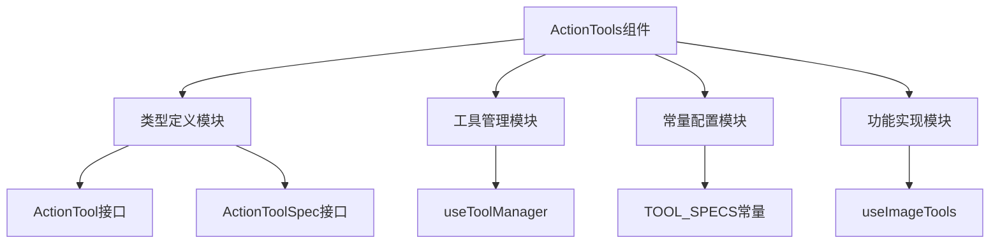

**组件模块来源**
- [types.ts](file://src/renderer/src/components/ActionTools/types.ts)
- [useToolManager.ts](file://src/renderer/src/components/ActionTools/hooks/useToolManager.ts)
- [constants.ts](file://src/renderer/src/components/ActionTools/constants.ts)
- [useImageTools.tsx](file://src/renderer/src/components/ActionTools/hooks/useImageTools.tsx)

## 核心数据结构

操作工具组件的核心数据结构定义了工具的基本属性和行为规范。

### 工具规格接口
`ActionToolSpec`接口定义了工具的基本规格，包含唯一标识符、工具类型和显示顺序三个核心属性。

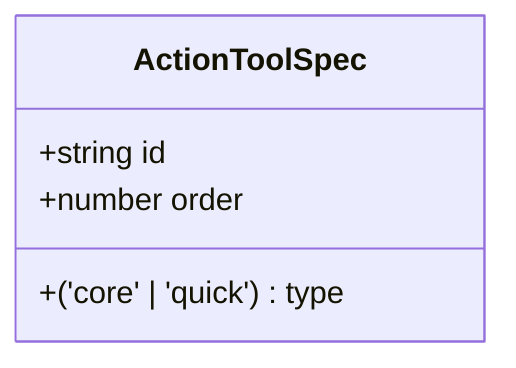

**数据结构来源**
- [types.ts](file://src/renderer/src/components/ActionTools/types.ts#L3-L7)

### 工具定义接口
`ActionTool`接口继承自`ActionToolSpec`，扩展了工具的可视化和交互属性，包括图标、提示文本、显示条件、点击事件和子工具等。

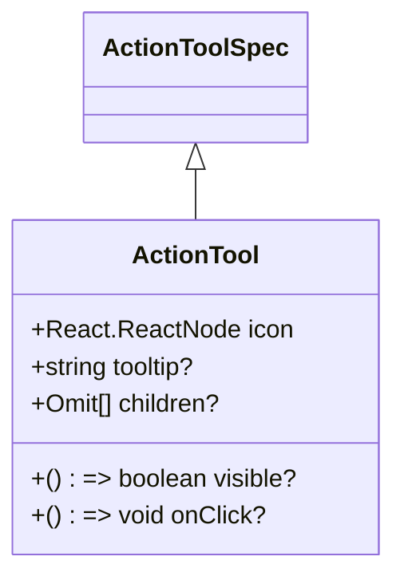

**数据结构来源**
- [types.ts](file://src/renderer/src/components/ActionTools/types.ts#L20-L26)

### 工具注册属性
`ToolRegisterProps`接口定义了子组件向父组件注册工具所需的属性，主要包含工具状态设置函数。

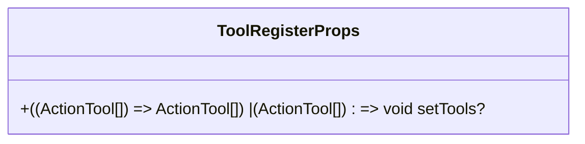

**数据结构来源**
- [types.ts](file://src/renderer/src/components/ActionTools/types.ts#L30-L32)

## 组合模式集成机制

操作工具组件通过组合模式实现了灵活的工具集成机制，支持工具的嵌套和动态组合。

### 工具类型分类
组件将工具分为两种类型：
- **核心工具（core）**：基础功能工具，始终显示
- **快捷工具（quick）**：辅助功能工具，通过"更多"按钮聚合显示

### 工具规格常量
组件通过`TOOL_SPECS`常量定义了所有预设工具的规格信息，包括ID、类型和显示顺序。

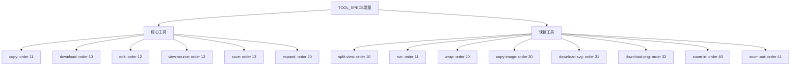

**组合模式来源**
- [constants.ts](file://src/renderer/src/components/ActionTools/constants.ts#L2-L75)

### 工具渲染逻辑
工具栏组件根据工具类型和数量动态调整渲染策略：
- 当快捷工具数量为1时，直接显示该工具
- 当快捷工具数量大于1时，通过下拉菜单聚合显示
- 核心工具始终直接显示

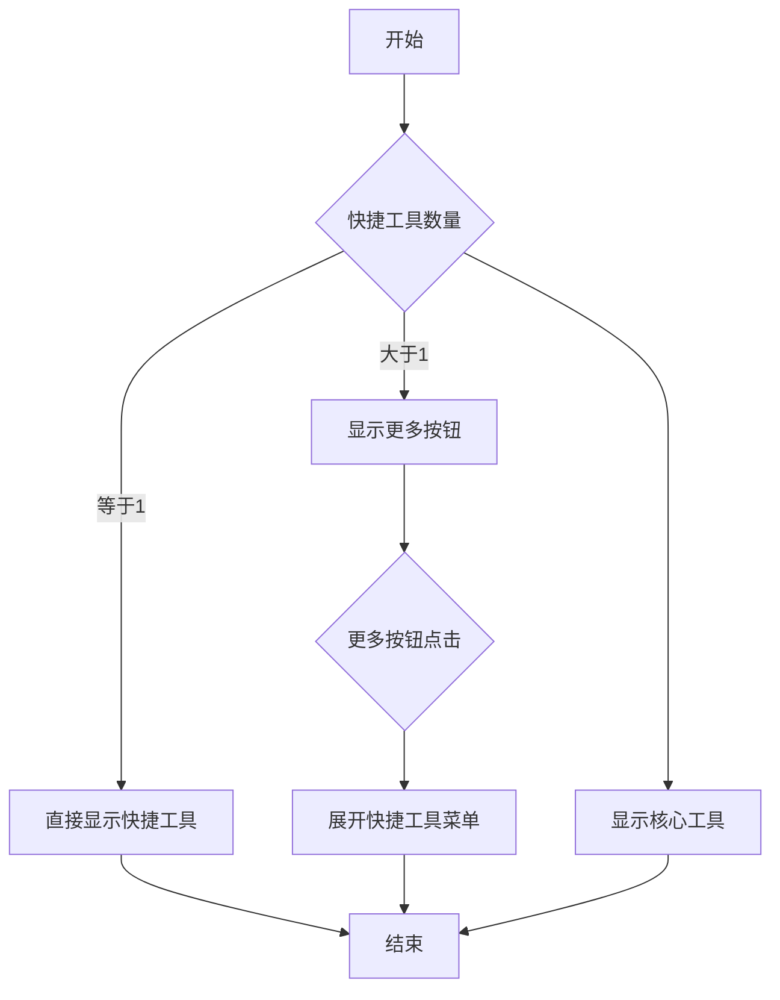

**渲染逻辑来源**
- [toolbar.tsx](file://src/renderer/src/components/CodeToolbar/toolbar.tsx#L12-L53)

## 上下文状态共享

操作工具组件通过工具管理器实现了跨组件的状态共享和协调。

### 工具管理器
`useToolManager` Hook提供了工具注册和注销的核心功能，通过回调函数实现状态更新。

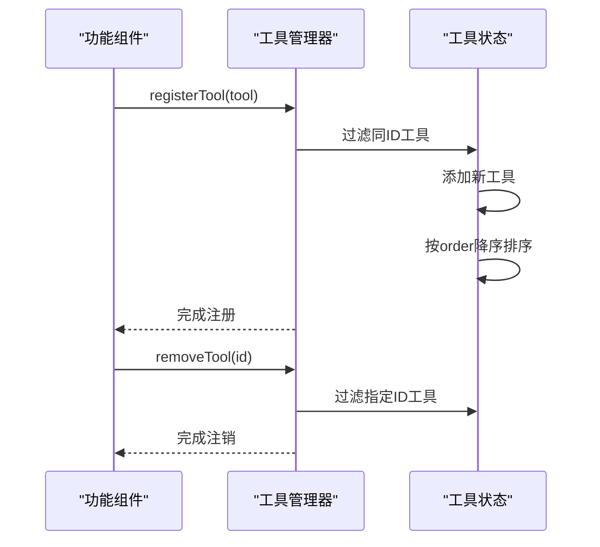

**状态共享来源**
- [useToolManager.ts](file://src/renderer/src/components/ActionTools/hooks/useToolManager.ts#L5-L25)

### 工具注册流程
工具注册流程确保了工具的唯一性和有序性：
1. 接收新工具定义
2. 过滤已存在的同ID工具
3. 添加新工具到工具列表
4. 按order属性降序排序

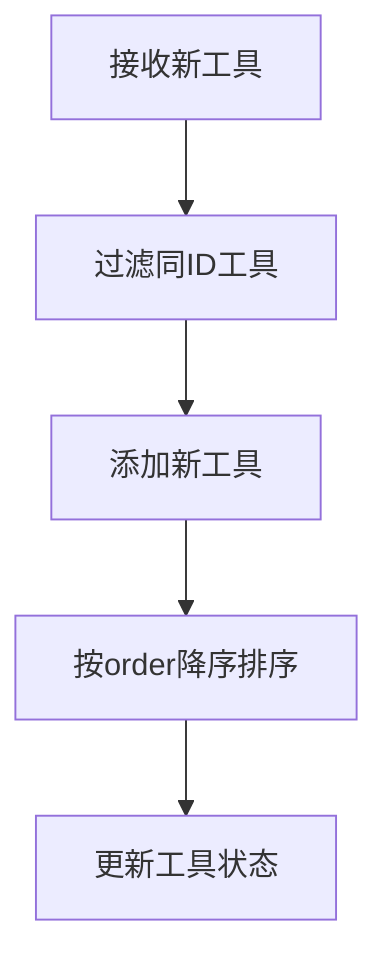

## 初始化流程与生命周期

操作工具组件的初始化和生命周期管理通过React Hook机制实现。

### 组件初始化
工具相关组件在初始化时通过useEffect Hook注册自身工具，并在组件卸载时自动注销。

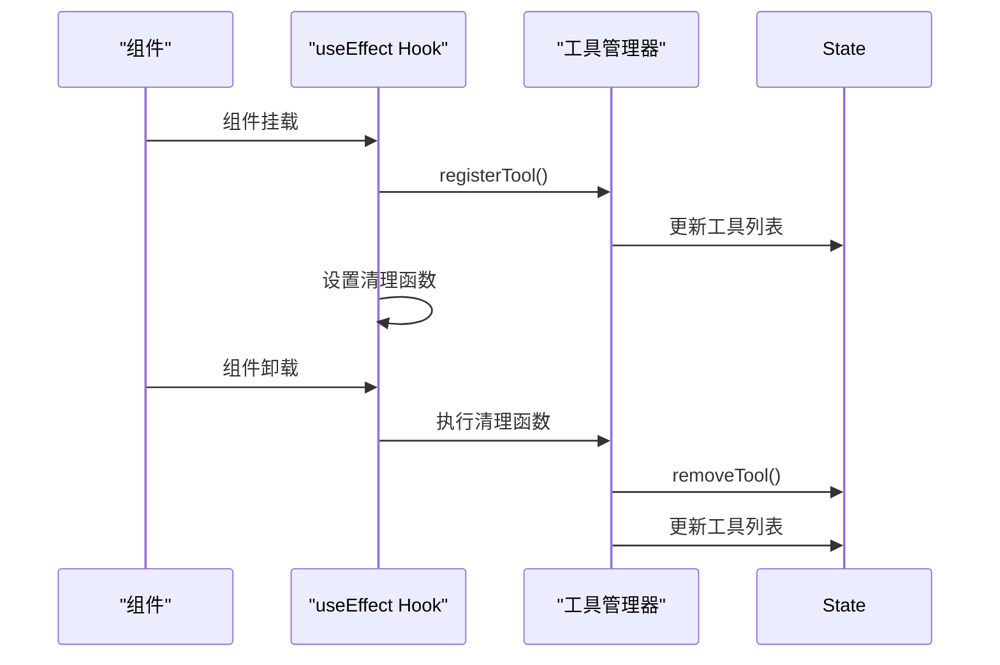

**生命周期来源**
- [useCopyTool.tsx](file://src/renderer/src/components/CodeToolbar/hooks/useCopyTool.tsx#L74-L77)
- [useDownloadTool.tsx](file://src/renderer/src/components/CodeToolbar/hooks/useDownloadTool.tsx#L60)

### 工具状态管理
组件通过useState和useEffect的组合实现工具状态的响应式管理，确保工具列表的实时更新。

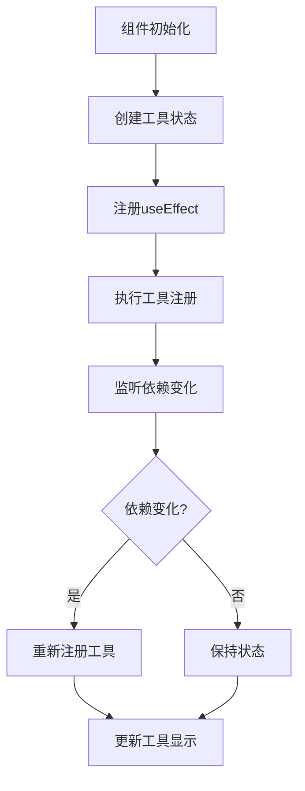

## 架构交互关系

操作工具组件与对话界面和状态管理系统的交互关系体现了其在整体架构中的位置和作用。

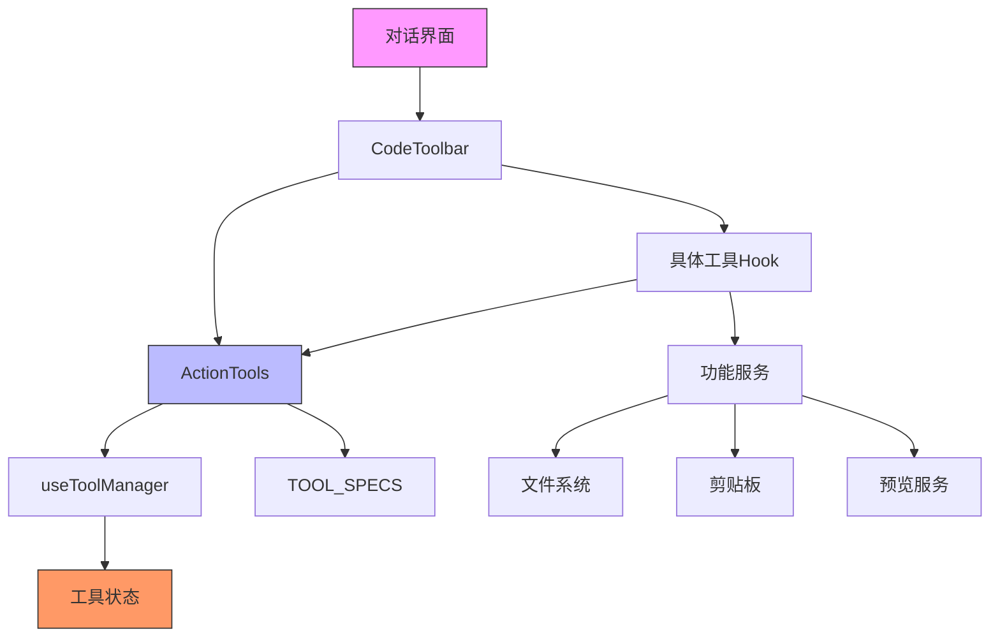

**架构交互来源**
- [toolbar.tsx](file://src/renderer/src/components/CodeToolbar/toolbar.tsx)
- [useCopyTool.tsx](file://src/renderer/src/components/CodeToolbar/hooks/useCopyTool.tsx)
- [useDownloadTool.tsx](file://src/renderer/src/components/CodeToolbar/hooks/useDownloadTool.tsx)

## 可扩展性设计

操作工具组件的可扩展性设计体现在插件化工具集成机制上。

### 插件化集成
组件通过标准化的接口和Hook机制支持插件化工具集成，新工具可以通过实现标准接口并使用工具管理器注册来集成到系统中。

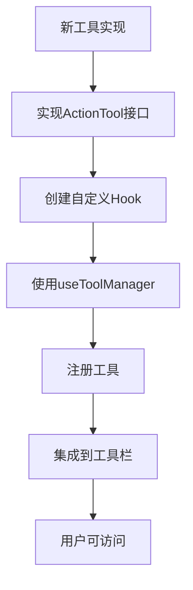

### 动态注册机制
动态注册机制允许在运行时添加或移除工具，支持功能的按需加载和动态配置。

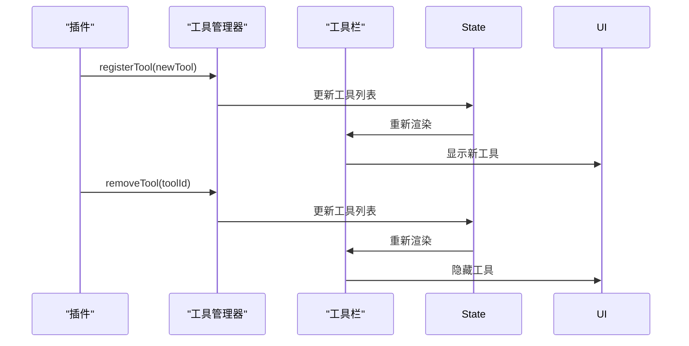

**可扩展性来源**
- [useToolManager.ts](file://src/renderer/src/components/ActionTools/hooks/useToolManager.ts)
- [useCopyTool.tsx](file://src/renderer/src/components/CodeToolbar/hooks/useCopyTool.tsx)

## 总结
操作工具组件通过精心设计的架构实现了功能的模块化、状态的统一管理和界面的灵活扩展。组件采用组合模式组织工具，通过工具管理器协调状态，利用React Hook机制管理生命周期，为Cherry Studio提供了强大而灵活的操作工具支持。其可扩展的设计使得新功能的集成变得简单高效，为系统的持续演进奠定了坚实的基础。