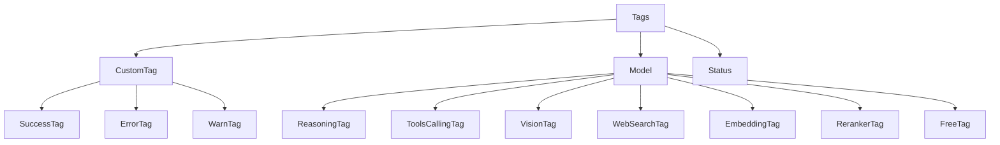
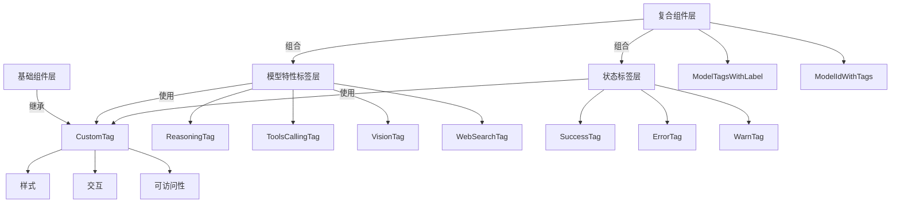
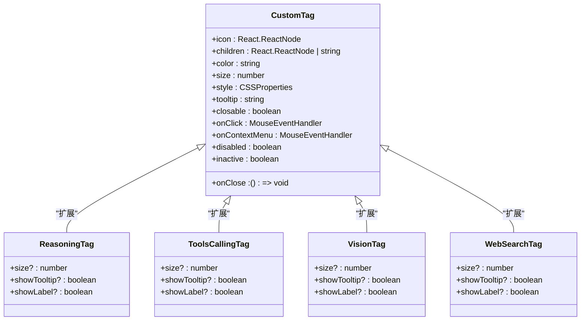
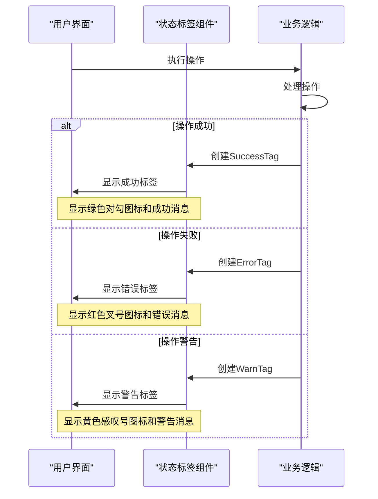
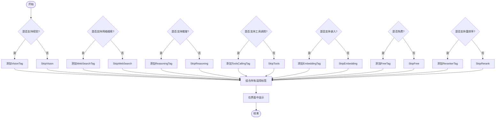
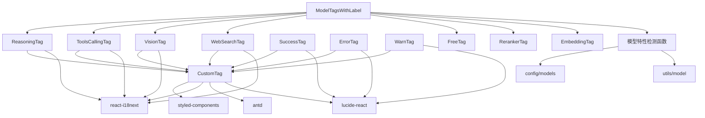

# 标签组件

<cite>
**本文档引用的文件**
- [ReasoningTag.tsx](file://src/renderer/src/components/Tags/Model/ReasoningTag.tsx)
- [ToolsCallingTag.tsx](file://src/renderer/src/components/Tags/Model/ToolsCallingTag.tsx)
- [VisionTag.tsx](file://src/renderer/src/components/Tags/Model/VisionTag.tsx)
- [WebSearchTag.tsx](file://src/renderer/src/components/Tags/Model/WebSearchTag.tsx)
- [SuccessTag.tsx](file://src/renderer/src/components/Tags/SuccessTag.tsx)
- [ErrorTag.tsx](file://src/renderer/src/components/Tags/ErrorTag.tsx)
- [WarnTag.tsx](file://src/renderer/src/components/Tags/WarnTag.tsx)
- [CustomTag.tsx](file://src/renderer/src/components/Tags/CustomTag.tsx)
- [ModelTagsWithLabel.tsx](file://src/renderer/src/components/ModelTagsWithLabel.tsx)
- [ModelIdWithTags.tsx](file://src/renderer/src/components/ModelIdWithTags.tsx)
- [filters.test.ts](file://src/renderer/src/components/Popups/SelectModelPopup/__tests__/filters.test.ts)
</cite>

## 目录
1. [简介](#简介)
2. [项目结构](#项目结构)
3. [核心组件](#核心组件)
4. [架构概述](#架构概述)
5. [详细组件分析](#详细组件分析)
6. [依赖分析](#依赖分析)
7. [性能考虑](#性能考虑)
8. [故障排除指南](#故障排除指南)
9. [结论](#结论)

## 简介
Cherry Studio标签组件系统为AI助手提供了一套完整的视觉标识解决方案，包括模型特性标签和状态标签两大类别。模型特性标签如ReasoningTag、ToolsCallingTag、VisionTag和WebSearchTag用于标识AI模型的能力特征，而SuccessTag、ErrorTag和WarnTag等状态标签则用于反馈操作结果。该系统通过可复用的CustomTag基础组件构建，支持国际化、响应式布局和交互行为，广泛应用于模型选择、对话界面和配置管理等场景。

## 项目结构
标签组件系统主要位于`src/renderer/src/components/Tags`目录下，采用模块化设计。核心结构包括基础标签组件和特定用途的标签组件。

**图示来源**
- [CustomTag.tsx](file://src/renderer/src/components/Tags/CustomTag.tsx)
- [Model目录](file://src/renderer/src/components/Tags/Model/)
- [状态标签文件](file://src/renderer/src/components/Tags/SuccessTag.tsx)

**本节来源**
- [项目结构信息](file://src/renderer/src/components/Tags/)

## 核心组件
标签组件系统的核心是CustomTag组件，它提供了统一的样式、交互和可扩展性基础。所有特定标签都基于CustomTag构建，通过传递不同的属性（如颜色、图标和文本）来实现多样化的视觉效果。系统支持模型能力检测集成，能够根据模型特性动态显示相应的标签，并提供过滤和选择功能。

**本节来源**
- [CustomTag.tsx](file://src/renderer/src/components/Tags/CustomTag.tsx)
- [ModelTagsWithLabel.tsx](file://src/renderer/src/components/ModelTagsWithLabel.tsx)

## 架构概述
标签组件系统采用分层架构设计，从基础组件到复合组件形成清晰的层次结构。基础层的CustomTag负责处理通用的样式、交互和可访问性，中间层的模型特性标签封装了特定能力的视觉表示，顶层的复合组件如ModelTagsWithLabel则负责根据模型特性组合显示多个标签。

**图示来源**
- [CustomTag.tsx](file://src/renderer/src/components/Tags/CustomTag.tsx)
- [各标签组件文件](file://src/renderer/src/components/Tags/Model/)
- [ModelTagsWithLabel.tsx](file://src/renderer/src/components/ModelTagsWithLabel.tsx)

## 详细组件分析

### 模型特性标签分析
模型特性标签用于标识AI模型的不同能力特征，帮助用户快速识别模型功能。这些标签通过颜色编码和图标设计实现直观的视觉区分。

#### 模型特性标签类图

**图示来源**
- [CustomTag.tsx](file://src/renderer/src/components/Tags/CustomTag.tsx)
- [ReasoningTag.tsx](file://src/renderer/src/components/Tags/Model/ReasoningTag.tsx)
- [ToolsCallingTag.tsx](file://src/renderer/src/components/Tags/Model/ToolsCallingTag.tsx)
- [VisionTag.tsx](file://src/renderer/src/components/Tags/Model/VisionTag.tsx)
- [WebSearchTag.tsx](file://src/renderer/src/components/Tags/Model/WebSearchTag.tsx)

**本节来源**
- [各模型标签组件文件](file://src/renderer/src/components/Tags/Model/)
- [CustomTag.tsx](file://src/renderer/src/components/Tags/CustomTag.tsx)

### 状态标签分析
状态标签用于反馈系统操作的结果状态，提供清晰的视觉提示。这些标签在用户交互、操作结果和系统通知等场景中发挥重要作用。

#### 状态标签序列图

**图示来源**
- [SuccessTag.tsx](file://src/renderer/src/components/Tags/SuccessTag.tsx)
- [ErrorTag.tsx](file://src/renderer/src/components/Tags/ErrorTag.tsx)
- [WarnTag.tsx](file://src/renderer/src/components/Tags/WarnTag.tsx)

**本节来源**
- [状态标签组件文件](file://src/renderer/src/components/Tags/SuccessTag.tsx)
- [状态标签组件文件](file://src/renderer/src/components/Tags/ErrorTag.tsx)
- [状态标签组件文件](file://src/renderer/src/components/Tags/WarnTag.tsx)

### 标签使用场景分析
标签组件在Cherry Studio中有多种使用场景，最典型的是在模型选择和显示界面中组合使用多个标签来全面描述模型特性。

#### 模型标签组合流程图

**图示来源**
- [ModelTagsWithLabel.tsx](file://src/renderer/src/components/ModelTagsWithLabel.tsx)
- [模型特性检测函数](file://src/renderer/config/models)

**本节来源**
- [ModelTagsWithLabel.tsx](file://src/renderer/src/components/ModelTagsWithLabel.tsx)
- [ModelIdWithTags.tsx](file://src/renderer/src/components/ModelIdWithTags.tsx)

## 依赖分析
标签组件系统与其他模块有明确的依赖关系，形成了完整的功能集成。

**图示来源**
- [CustomTag.tsx](file://src/renderer/src/components/Tags/CustomTag.tsx)
- [各标签组件文件](file://src/renderer/src/components/Tags/Model/)
- [ModelTagsWithLabel.tsx](file://src/renderer/src/components/ModelTagsWithLabel.tsx)
- [config/models](file://src/renderer/config/models)

**本节来源**
- [CustomTag.tsx](file://src/renderer/src/components/Tags/CustomTag.tsx)
- [ModelTagsWithLabel.tsx](file://src/renderer/src/components/ModelTagsWithLabel.tsx)
- [config/models](file://src/renderer/config/models)

## 性能考虑
标签组件系统在设计时考虑了性能优化，通过React的memo化和useMemo钩子避免不必要的重新渲染。CustomTag组件使用memo进行记忆化处理，确保只有在props变化时才重新渲染。ModelTagsWithLabel组件使用useLayoutEffect和ResizeObserver来响应容器尺寸变化，动态调整标签显示策略，避免在小空间中显示过多文本导致布局问题。

**本节来源**
- [CustomTag.tsx](file://src/renderer/src/components/Tags/CustomTag.tsx)
- [ModelTagsWithLabel.tsx](file://src/renderer/src/components/ModelTagsWithLabel.tsx)

## 故障排除指南
当标签组件出现问题时，可以参考以下常见问题和解决方案：

1. **标签不显示**：检查模型对象是否包含正确的特性标志，确认模型特性检测函数是否正确识别了模型能力。
2. **样式错乱**：检查styled-components是否正确加载，确认CSS变量是否在当前主题中定义。
3. **国际化文本缺失**：检查i18n配置是否包含对应的语言资源文件，确认翻译键是否正确。
4. **交互无响应**：检查onClick等事件处理器是否正确传递，确认组件未被设置为disabled状态。

**本节来源**
- [CustomTag.tsx](file://src/renderer/src/components/Tags/CustomTag.tsx)
- [ModelTagsWithLabel.tsx](file://src/renderer/src/components/ModelTagsWithLabel.tsx)

## 结论
Cherry Studio的标签组件系统提供了一套完整、灵活且可扩展的视觉标识解决方案。通过基础组件CustomTag的抽象，系统实现了代码复用和样式统一。模型特性标签和状态标签的设计充分考虑了用户体验，通过颜色、图标和文本的组合提供直观的信息传达。系统与模型能力检测机制紧密集成，能够动态适应不同的模型配置。整体架构清晰，层次分明，既满足了当前需求，又为未来的扩展提供了良好的基础。