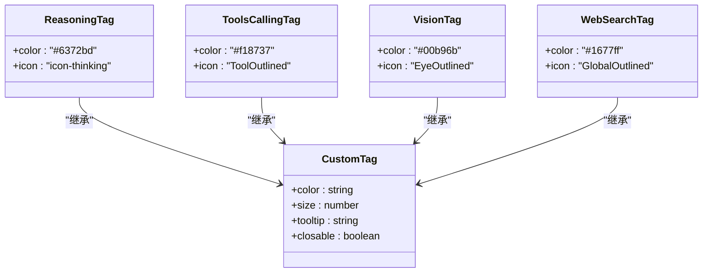
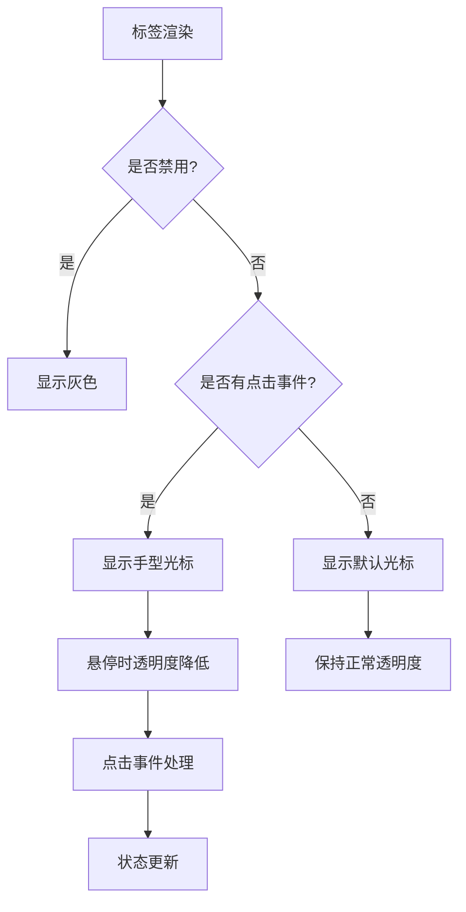
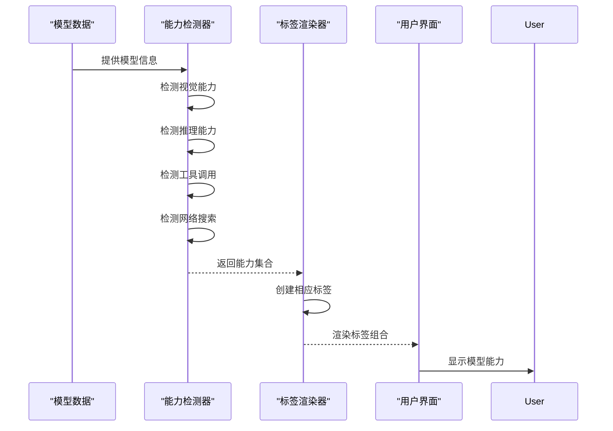
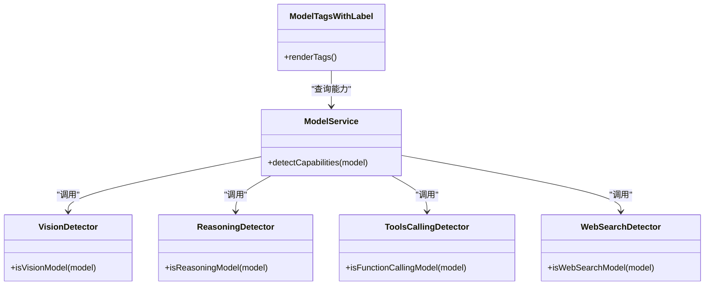
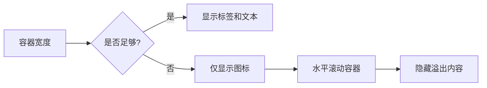
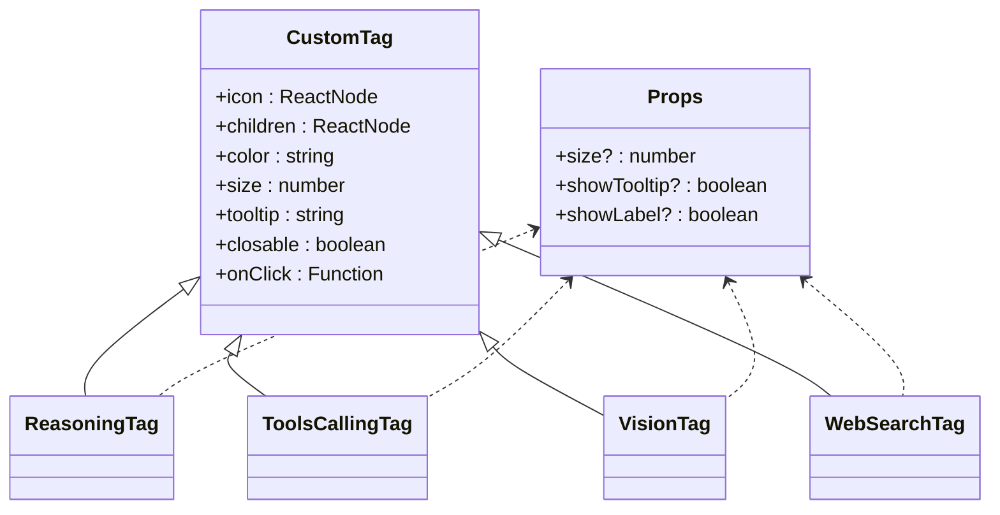

# 模型特性标签

<cite>
**本文档引用的文件**
- [ReasoningTag.tsx](file://src/renderer/src/components/Tags/Model/ReasoningTag.tsx)
- [ToolsCallingTag.tsx](file://src/renderer/src/components/Tags/Model/ToolsCallingTag.tsx)
- [VisionTag.tsx](file://src/renderer/src/components/Tags/Model/VisionTag.tsx)
- [WebSearchTag.tsx](file://src/renderer/src/components/Tags/Model/WebSearchTag.tsx)
- [CustomTag.tsx](file://src/renderer/src/components/Tags/CustomTag.tsx)
- [ModelTagsWithLabel.tsx](file://src/renderer/src/components/ModelTagsWithLabel.tsx)
- [vision.ts](file://src/renderer/src/config/models/vision.ts)
- [reasoning.ts](file://src/renderer/src/config/models/reasoning.ts)
- [tooluse.ts](file://src/renderer/src/config/models/tooluse.ts)
- [websearch.ts](file://src/renderer/src/config/models/websearch.ts)
- [model.ts](file://src/renderer/src/utils/model.ts)
</cite>

## 目录
1. [引言](#引言)
2. [核心组件分析](#核心组件分析)
3. [视觉设计与样式](#视觉设计与样式)
4. [标签用途与应用场景](#标签用途与应用场景)
5. [模型能力检测系统集成](#模型能力检测系统集成)
6. [响应式设计与可访问性](#响应式设计与可访问性)
7. [代码实现示例](#代码实现示例)
8. [结论](#结论)

## 引言
Cherry Studio中的模型特性标签系统为用户提供了直观的视觉标识，用于展示AI模型的各种能力特性。这些标签包括ReasoningTag（推理能力）、ToolsCallingTag（工具调用）、VisionTag（视觉能力）和WebSearchTag（网络搜索），通过颜色、图标和动画效果的组合，帮助用户快速识别模型的功能。本文档详细描述了这些标签的设计、实现和集成机制。

## 核心组件分析

### ReasoningTag（推理能力标签）
ReasoningTag用于标识支持复杂推理能力的AI模型。该标签使用深蓝色调（#6372bd）作为主色，配合"icon-thinking"图标字体，传达深度思考的概念。标签支持可配置的大小、工具提示和标签文本显示。

**组件源码分析**
- 使用`CustomTag`作为基础组件，继承其样式和交互功能
- 通过`useTranslation`钩子实现国际化文本支持
- 支持`size`、`showTooltip`和`showLabel`等属性配置

### ToolsCallingTag（工具调用标签）
ToolsCallingTag标识支持工具调用功能的模型，允许AI通过API调用外部工具。该标签采用橙色（#f18737）作为主色调，配合Ant Design的`ToolOutlined`图标，清晰传达工具集成的概念。

**组件源码分析**
- 基于`CustomTag`组件构建，保持一致的UI风格
- 图标大小随标签尺寸动态调整
- 支持工具提示和标签文本的条件渲染

### VisionTag（视觉能力标签）
VisionTag用于标识支持图像识别和视觉理解能力的模型。该标签使用绿色（#00b96b）作为主色，配合Ant Design的`EyeOutlined`图标，直观表示视觉功能。

**组件源码分析**
- 实现了响应式图标大小调整
- 支持多语言环境下的文本显示
- 继承了`CustomTag`的完整交互功能

### WebSearchTag（网络搜索标签）
WebSearchTag标识支持实时网络搜索能力的模型。该标签采用蓝色（#1677ff）作为主色，配合Ant Design的`GlobalOutlined`图标，表示互联网连接能力。

**组件源码分析**
- 与其他标签保持一致的API设计
- 支持动态尺寸和状态控制
- 集成国际化文本支持

**Section sources**
- [ReasoningTag.tsx](file://src/renderer/src/components/Tags/Model/ReasoningTag.tsx)
- [ToolsCallingTag.tsx](file://src/renderer/src/components/Tags/Model/ToolsCallingTag.tsx)
- [VisionTag.tsx](file://src/renderer/src/components/Tags/Model/VisionTag.tsx)
- [WebSearchTag.tsx](file://src/renderer/src/components/Tags/Model/WebSearchTag.tsx)

## 视觉设计与样式

### 颜色方案
各标签采用特定的颜色编码系统，确保视觉识别的一致性：

**Diagram sources**
- [ReasoningTag.tsx](file://src/renderer/src/components/Tags/Model/ReasoningTag.tsx)
- [ToolsCallingTag.tsx](file://src/renderer/src/components/Tags/Model/ToolsCallingTag.tsx)
- [VisionTag.tsx](file://src/renderer/src/components/Tags/Model/VisionTag.tsx)
- [WebSearchTag.tsx](file://src/renderer/src/components/Tags/Model/WebSearchTag.tsx)
- [CustomTag.tsx](file://src/renderer/src/components/Tags/CustomTag.tsx)

### 图标使用
标签系统采用混合图标方案：
- **Ant Design图标**：用于VisionTag、ToolsCallingTag和WebSearchTag，确保图标质量和一致性
- **自定义图标字体**：用于ReasoningTag的"icon-thinking"，提供独特的视觉识别

### 动画效果
标签组件实现了以下交互动画：
- **悬停效果**：鼠标悬停时标签透明度降低至0.8，提供视觉反馈
- **过渡动画**：所有状态变化均采用0.2秒的平滑过渡
- **关闭动画**：可关闭标签的关闭图标悬停时有背景色变化动画

**Diagram sources**
- [CustomTag.tsx](file://src/renderer/src/components/Tags/CustomTag.tsx)

## 标签用途与应用场景

### AI助手配置界面
在AI助手配置界面中，模型特性标签用于：
- **模型选择**：帮助用户快速识别模型能力
- **能力过滤**：支持按标签筛选模型
- **配置提示**：根据标签显示相应的配置选项

### 对话界面
在对话界面中，标签提供以下功能：
- **能力指示**：显示当前模型支持的功能
- **交互引导**：提示用户可以使用特定功能
- **状态反馈**：在功能激活时提供视觉确认

### 标签组合显示
系统支持多个标签的组合显示，通过`ModelTagsWithLabel`组件实现：

**Diagram sources**
- [ModelTagsWithLabel.tsx](file://src/renderer/src/components/ModelTagsWithLabel.tsx)

**Section sources**
- [ModelTagsWithLabel.tsx](file://src/renderer/src/components/ModelTagsWithLabel.tsx)

## 模型能力检测系统集成

### 能力检测机制
标签系统与模型能力检测系统深度集成，通过以下方式自动显示相应标签：

**Diagram sources**
- [vision.ts](file://src/renderer/src/config/models/vision.ts)
- [reasoning.ts](file://src/renderer/src/config/models/reasoning.ts)
- [tooluse.ts](file://src/renderer/src/config/models/tooluse.ts)
- [websearch.ts](file://src/renderer/src/config/models/websearch.ts)

### 检测逻辑实现
各能力检测器采用正则表达式和模型ID模式匹配：

- **视觉能力检测**：基于模型ID中的关键词如"vision"、"gpt-4o"等
- **推理能力检测**：识别"o1"、"reasoning"、"thinking"等模式
- **工具调用检测**：匹配"gpt-4o"、"claude"、"qwen"等支持工具调用的模型
- **网络搜索检测**：识别"gpt-4o-search"、"sonar"等特定模型ID

### 用户覆盖机制
系统支持用户手动覆盖自动检测结果，通过模型的`capabilities`字段中的`isUserSelected`属性实现。

**Section sources**
- [vision.ts](file://src/renderer/src/config/models/vision.ts)
- [reasoning.ts](file://src/renderer/src/config/models/reasoning.ts)
- [tooluse.ts](file://src/renderer/src/config/models/tooluse.ts)
- [websearch.ts](file://src/renderer/src/config/models/websearch.ts)

## 响应式设计与可访问性

### 响应式行为
标签系统实现了完整的响应式设计：

**Diagram sources**
- [ModelTagsWithLabel.tsx](file://src/renderer/src/components/ModelTagsWithLabel.tsx)

### 可访问性最佳实践
系统遵循以下可访问性原则：
- **键盘导航**：支持Tab键导航和Enter/Space键激活
- **屏幕阅读器支持**：通过ARIA标签提供语义信息
- **颜色对比度**：确保文本与背景的对比度符合WCAG标准
- **焦点管理**：清晰的焦点指示器

### 国际化支持
所有标签文本通过`useTranslation`钩子实现国际化，支持多语言环境下的正确显示。

**Section sources**
- [ModelTagsWithLabel.tsx](file://src/renderer/src/components/ModelTagsWithLabel.tsx)

## 代码实现示例

### 基础标签组件
标签系统采用组合模式，`CustomTag`作为基础组件：

**Diagram sources**
- [CustomTag.tsx](file://src/renderer/src/components/Tags/CustomTag.tsx)

### 属性配置
各标签支持统一的属性接口：

| 属性 | 类型 | 默认值 | 描述 |
|------|------|--------|------|
| size | number | 12 | 标签尺寸 |
| showTooltip | boolean | true | 是否显示工具提示 |
| showLabel | boolean | true | 是否显示标签文本 |
| color | string | - | 标签主色 |
| icon | ReactNode | - | 标签图标 |

### 使用示例
标签组件在`ModelTagsWithLabel`中被组合使用，根据模型能力自动渲染相应的标签集合。

**Section sources**
- [CustomTag.tsx](file://src/renderer/src/components/Tags/CustomTag.tsx)
- [model.ts](file://src/renderer/src/utils/model.ts)

## 结论
Cherry Studio的模型特性标签系统通过统一的设计语言和智能的集成机制，为用户提供了一种直观、高效的方式来理解和使用AI模型的各种能力。系统的模块化设计、响应式特性和可访问性考虑，确保了在各种使用场景下的良好用户体验。