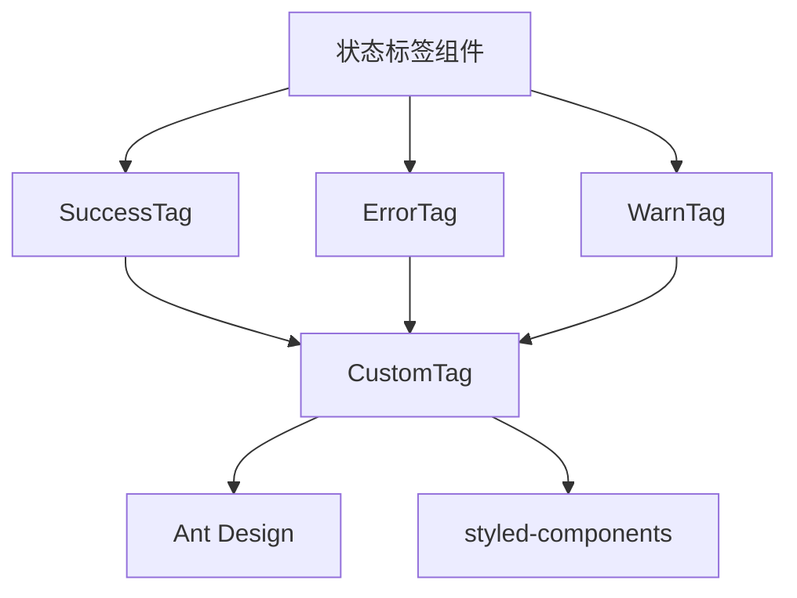
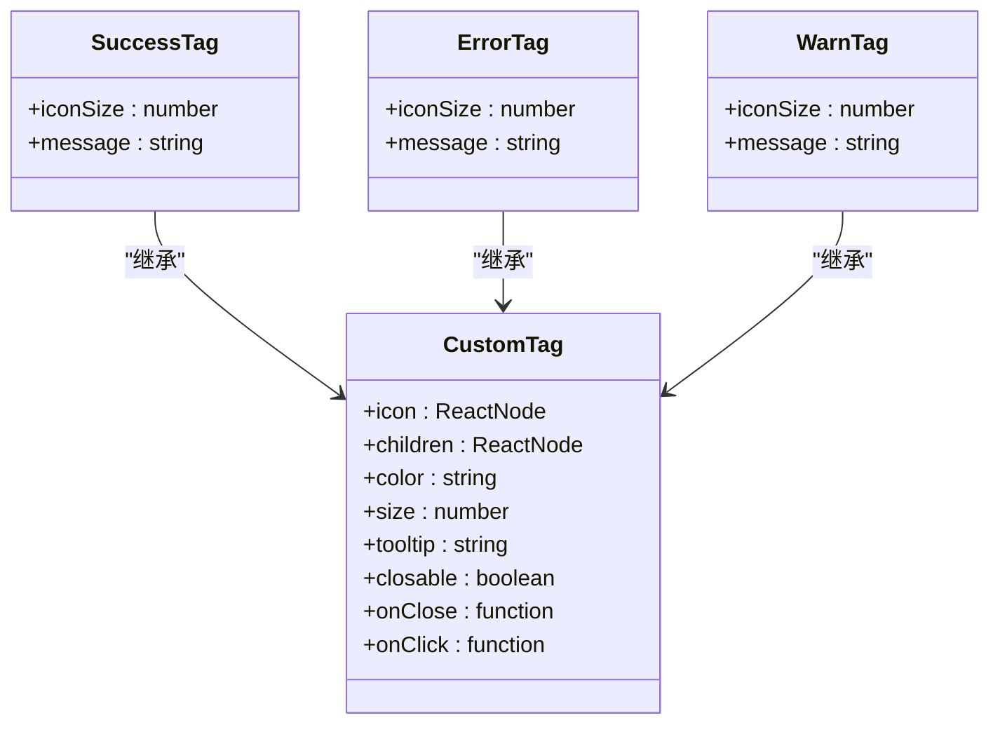
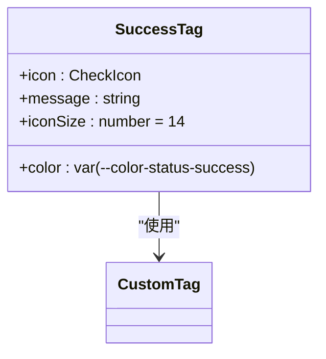
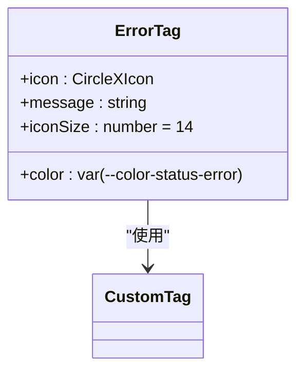
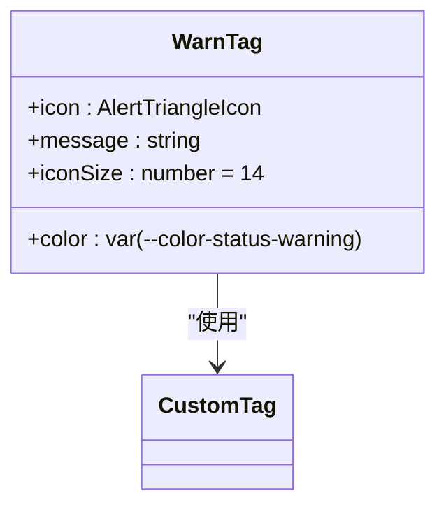
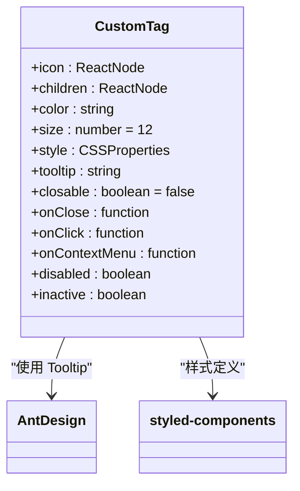
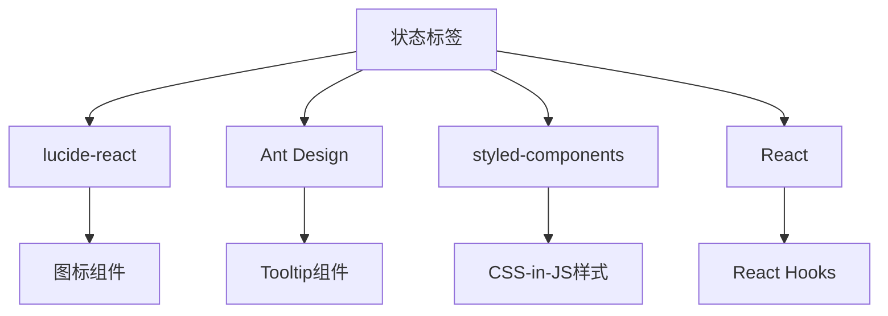

# 状态标签

<cite>
**本文档引用的文件**  
- [SuccessTag.tsx](file://src/renderer/src/components/Tags/SuccessTag.tsx)
- [ErrorTag.tsx](file://src/renderer/src/components/Tags/ErrorTag.tsx)
- [WarnTag.tsx](file://src/renderer/src/components/Tags/WarnTag.tsx)
- [CustomTag.tsx](file://src/renderer/src/components/Tags/CustomTag.tsx)
- [color.css](file://src/renderer/src/assets/styles/color.css)
- [OcrImageSettings.tsx](file://src/renderer/src/pages/settings/DocProcessSettings/OcrImageSettings.tsx)
- [OcrSystemSettings.tsx](file://src/renderer/src/pages/settings/DocProcessSettings/OcrSystemSettings.tsx)
- [HealthStatusIndicator.tsx](file://src/renderer/src/components/HealthStatusIndicator/indicator.tsx)
- [useHealthStatus.tsx](file://src/renderer/src/components/HealthStatusIndicator/useHealthStatus.tsx)
- [types.ts](file://src/renderer/src/components/HealthStatusIndicator/types.ts)
- [healthCheck.ts](file://src/renderer/src/types/healthCheck.ts)
</cite>

## 目录
1. [简介](#简介)
2. [项目结构](#项目结构)
3. [核心组件](#核心组件)
4. [架构概述](#架构概述)
5. [详细组件分析](#详细组件分析)
6. [依赖分析](#依赖分析)
7. [性能考虑](#性能考虑)
8. [故障排除指南](#故障排除指南)
9. [结论](#结论)

## 简介
本文档详细描述了Cherry Studio中的状态标签组件，包括SuccessTag、ErrorTag和WarnTag。这些标签用于在用户界面中传达操作结果和系统状态，通过颜色编码、图标设计和语义化信息帮助用户快速理解当前状态。文档涵盖了视觉样式、使用场景、实现细节以及可访问性考虑。

## 项目结构
状态标签组件位于`src/renderer/src/components/Tags/`目录下，作为UI组件库的一部分。这些组件依赖于全局样式变量和Ant Design等第三方UI库，通过模块化设计实现复用性。

**图示来源**
- [SuccessTag.tsx](file://src/renderer/src/components/Tags/SuccessTag.tsx)
- [ErrorTag.tsx](file://src/renderer/src/components/Tags/ErrorTag.tsx)
- [WarnTag.tsx](file://src/renderer/src/components/Tags/WarnTag.tsx)
- [CustomTag.tsx](file://src/renderer/src/components/Tags/CustomTag.tsx)

**本节来源**
- [Tags](file://src/renderer/src/components/Tags/)

## 核心组件
状态标签组件包括三种主要类型：SuccessTag（成功状态）、ErrorTag（错误状态）和WarnTag（警告状态）。每种标签都封装了特定的视觉样式和语义含义，通过统一的CustomTag基类实现样式一致性。

**本节来源**
- [SuccessTag.tsx](file://src/renderer/src/components/Tags/SuccessTag.tsx#L1-L17)
- [ErrorTag.tsx](file://src/renderer/src/components/Tags/ErrorTag.tsx#L1-L17)
- [WarnTag.tsx](file://src/renderer/src/components/Tags/WarnTag.tsx#L1-L19)

## 架构概述
状态标签采用分层架构设计，上层为具体的状态标签组件（SuccessTag、ErrorTag、WarnTag），底层为通用的CustomTag组件。这种设计实现了样式和行为的集中管理，同时保持了扩展性。

**图示来源**
- [CustomTag.tsx](file://src/renderer/src/components/Tags/CustomTag.tsx#L7-L20)
- [SuccessTag.tsx](file://src/renderer/src/components/Tags/SuccessTag.tsx#L5-L8)
- [ErrorTag.tsx](file://src/renderer/src/components/Tags/ErrorTag.tsx#L5-L8)
- [WarnTag.tsx](file://src/renderer/src/components/Tags/WarnTag.tsx#L5-L8)

## 详细组件分析

### 成功标签分析
SuccessTag用于表示操作成功或系统正常的状态，通常在API调用成功、配置验证通过或系统健康检查正常时使用。

#### 视觉样式

**图示来源**
- [SuccessTag.tsx](file://src/renderer/src/components/Tags/SuccessTag.tsx#L10-L15)
- [color.css](file://src/renderer/src/assets/styles/color.css#L68)

**本节来源**
- [SuccessTag.tsx](file://src/renderer/src/components/Tags/SuccessTag.tsx#L1-L17)

### 错误标签分析
ErrorTag用于表示操作失败或系统异常的状态，通常在API调用失败、配置错误或系统健康检查失败时使用。

#### 视觉样式

**图示来源**
- [ErrorTag.tsx](file://src/renderer/src/components/Tags/ErrorTag.tsx#L10-L15)
- [color.css](file://src/renderer/src/assets/styles/color.css#L69)

**本节来源**
- [ErrorTag.tsx](file://src/renderer/src/components/Tags/ErrorTag.tsx#L1-L17)

### 警告标签分析
WarnTag用于表示需要注意但非致命的状态，通常在系统配置需要调整或存在潜在问题时使用。

#### 视觉样式

**图示来源**
- [WarnTag.tsx](file://src/renderer/src/components/Tags/WarnTag.tsx#L10-L17)
- [color.css](file://src/renderer/src/assets/styles/color.css#L70)

**本节来源**
- [WarnTag.tsx](file://src/renderer/src/components/Tags/WarnTag.tsx#L1-L19)

### 通用标签组件分析
CustomTag是所有状态标签的基类组件，提供了统一的样式和交互行为。

#### 实现细节

**图示来源**
- [CustomTag.tsx](file://src/renderer/src/components/Tags/CustomTag.tsx#L7-L20)
- [CustomTag.tsx](file://src/renderer/src/components/Tags/CustomTag.tsx#L77-L122)

**本节来源**
- [CustomTag.tsx](file://src/renderer/src/components/Tags/CustomTag.tsx#L1-L122)

## 依赖分析
状态标签组件依赖于多个外部库和内部模块，形成了清晰的依赖关系。

**图示来源**
- [SuccessTag.tsx](file://src/renderer/src/components/Tags/SuccessTag.tsx#L1)
- [ErrorTag.tsx](file://src/renderer/src/components/Tags/ErrorTag.tsx#L1)
- [WarnTag.tsx](file://src/renderer/src/components/Tags/WarnTag.tsx#L1)
- [CustomTag.tsx](file://src/renderer/src/components/Tags/CustomTag.tsx#L1-L5)

**本节来源**
- [package.json](file://package.json)

## 性能考虑
状态标签组件通过React.memo进行性能优化，避免不必要的重新渲染。组件采用轻量级设计，仅包含必要的DOM元素和样式。

## 故障排除指南
当状态标签显示异常时，应检查以下方面：
- 确保颜色变量在CSS中正确定义
- 检查图标库是否正确导入
- 验证消息文本是否正确传递
- 确认主题模式是否影响颜色显示

**本节来源**
- [color.css](file://src/renderer/src/assets/styles/color.css)
- [useUserTheme.tsx](file://src/renderer/src/hooks/useUserTheme.ts)

## 结论
Cherry Studio的状态标签组件通过统一的设计系统提供了清晰的状态反馈机制。三种状态标签（SuccessTag、ErrorTag、WarnTag）分别对应不同的语义场景，帮助用户快速理解系统状态。组件采用模块化设计，既保证了样式一致性，又提供了良好的扩展性。