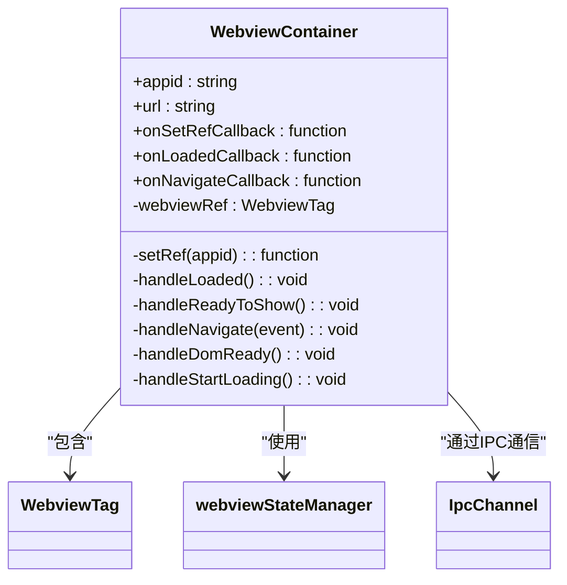
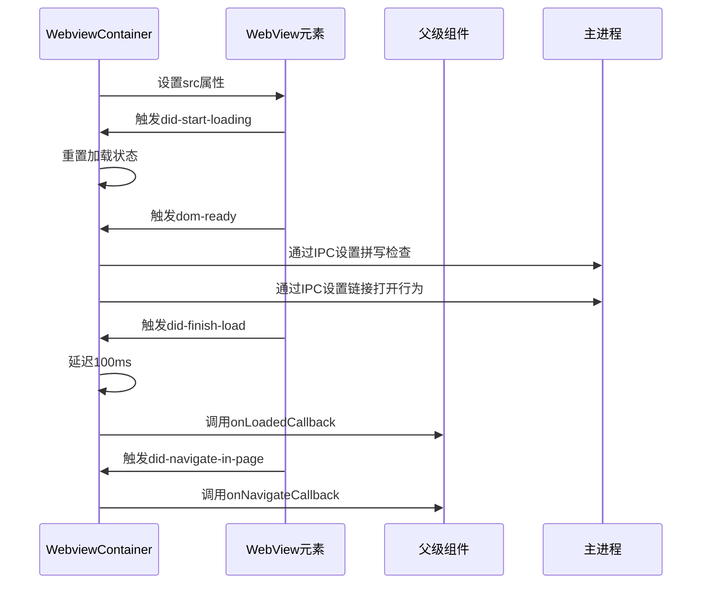
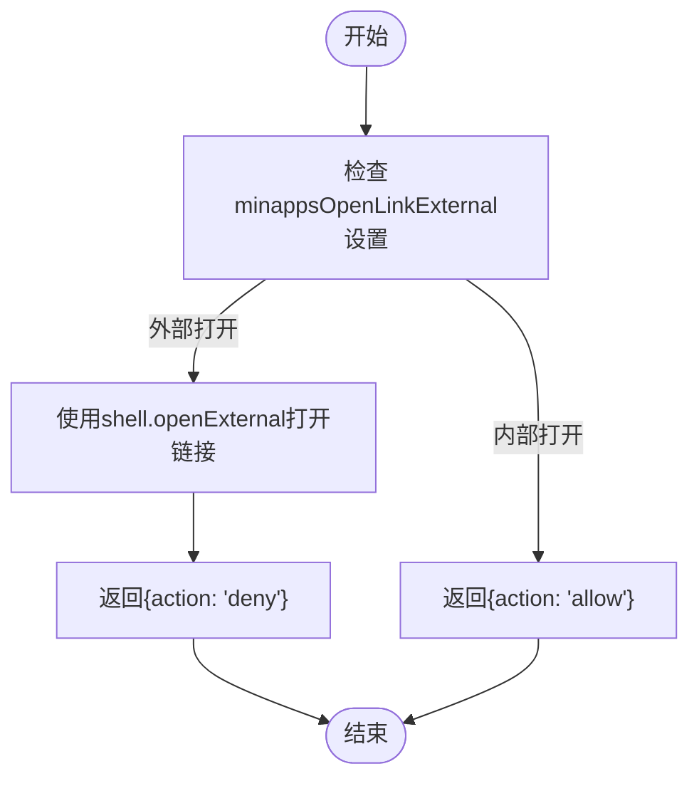
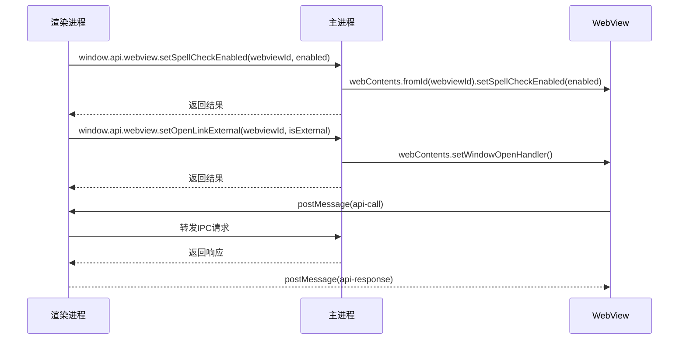
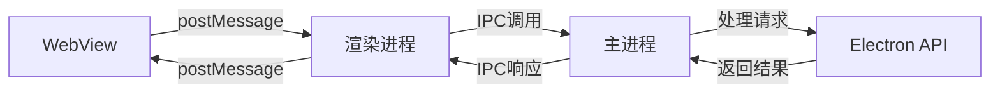
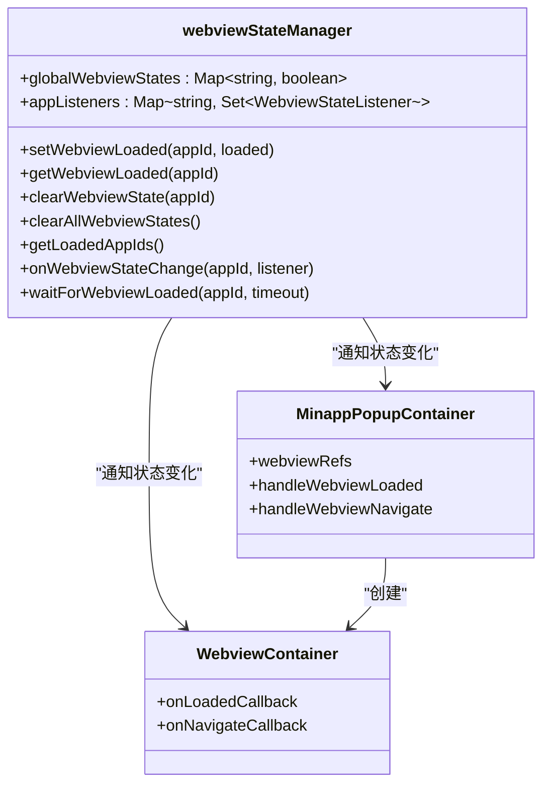
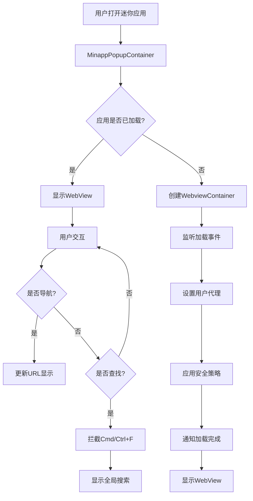

# WebView集成容器

<cite>
**本文档引用的文件**  
- [WebviewContainer.tsx](file://src/renderer/src/components/MinApp/WebviewContainer.tsx)
- [WebviewService.ts](file://src/main/services/WebviewService.ts)
- [IpcChannel.ts](file://packages/shared/IpcChannel.ts)
- [MinappPopupContainer.tsx](file://src/renderer/src/components/MinApp/MinappPopupContainer.tsx)
- [webviewStateManager.ts](file://src/renderer/src/utils/webviewStateManager.ts)
- [useBridge.ts](file://src/renderer/src/hooks/useBridge.ts)
</cite>

## 目录
1. [引言](#引言)
2. [核心职责](#核心职责)
3. [URL加载与导航控制](#url加载与导航控制)
4. [安全策略实施](#安全策略实施)
5. [跨域通信处理](#跨域通信处理)
6. [IPC通信机制](#ipc通信机制)
7. [资源隔离与内存管理](#资源隔离与内存管理)
8. [实际应用示例](#实际应用示例)
9. [结论](#结论)

## 引言

WebViewContainer组件是Cherry Studio应用中的关键组件，负责在Electron桌面应用中嵌入和管理外部Web应用。该组件作为WebView的宿主，提供了完整的生命周期管理、安全控制和跨进程通信能力。通过精心设计的架构，它实现了外部Web内容与本地应用的无缝集成，同时确保了系统的安全性和性能。

**Section sources**
- [WebviewContainer.tsx](file://src/renderer/src/components/MinApp/WebviewContainer.tsx#L8-L12)

## 核心职责

WebViewContainer组件的核心职责是作为WebView元素的容器，管理其生命周期和行为。该组件采用React的memo化技术，确保在状态变化时能够高效地重用组件实例，从而实现"保持活动"（keepalive）的功能。每个WebView实例都与特定的迷你应用（MinApp）关联，通过唯一的appid进行标识和管理。

组件的主要功能包括：URL加载、导航事件监听、加载状态管理、安全策略应用和跨域通信处理。它通过回调函数与父组件进行通信，通知加载完成、导航变更等重要事件。这种设计模式使得WebViewContainer成为一个高度可复用的通用组件，可以被集成到不同的UI容器中，如弹出窗口或标签页。

**Diagram sources**
- [WebviewContainer.tsx](file://src/renderer/src/components/MinApp/WebviewContainer.tsx#L13-L150)

**Section sources**
- [WebviewContainer.tsx](file://src/renderer/src/components/MinApp/WebviewContainer.tsx#L8-L12)

## URL加载与导航控制

WebViewContainer组件通过Electron的webview标签实现URL加载和导航控制。在组件挂载时，它会监听一系列关键的生命周期事件，包括'did-start-loading'、'dom-ready'、'did-finish-load'和'ready-to-show'。这些事件的监听确保了组件能够精确地跟踪页面加载的各个阶段。

URL加载是通过直接设置webview元素的src属性来实现的。当组件的url属性发生变化时，useEffect钩子会触发，将新的URL赋值给webview的src属性，从而启动加载过程。为了确保用户体验，组件在加载完成后会延迟100毫秒再触发onLoadedCallback，以确保页面内容已经完全渲染和可见。

导航控制通过监听'did-navigate-in-page'事件实现。每当用户在WebView内部进行导航（如点击链接或执行JavaScript跳转），组件都会通过onNavigateCallback通知父组件新的URL。这使得父组件能够更新UI中的地址显示，或者根据导航目标执行特定的业务逻辑。

**Diagram sources**
- [WebviewContainer.tsx](file://src/renderer/src/components/MinApp/WebviewContainer.tsx#L43-L107)

**Section sources**
- [WebviewContainer.tsx](file://src/renderer/src/components/MinApp/WebviewContainer.tsx#L43-L107)

## 安全策略实施

WebViewContainer组件实施了多层次的安全策略，以保护应用和用户数据的安全。首先，通过使用持久化分区"persist:webview"，组件为所有WebView实例创建了一个独立的会话环境。这个分区确保了不同WebView之间的数据隔离，防止跨应用的数据泄露。

在用户代理（User-Agent）管理方面，组件通过WebviewService在主进程中移除了"CherryStudio"和"Electron"标识，以减少指纹识别的风险。对于Google应用，组件会使用特定的用户代理字符串，以确保与Google服务的兼容性。

链接打开行为是另一个重要的安全控制点。组件通过setOpenLinkExternal IPC调用，根据用户设置决定链接是在WebView内部打开还是在外部浏览器中打开。当设置为外部打开时，组件会拦截所有链接点击事件，使用shell.openExternal在默认浏览器中打开链接，同时阻止WebView内部的导航，从而防止潜在的钓鱼攻击。

**Diagram sources**
- [WebviewService.ts](file://src/main/services/WebviewService.ts#L27-L38)
- [WebviewContainer.tsx](file://src/renderer/src/components/MinApp/WebviewContainer.tsx#L139)

**Section sources**
- [WebviewService.ts](file://src/main/services/WebviewService.ts#L27-L38)
- [WebviewContainer.tsx](file://src/renderer/src/components/MinApp/WebviewContainer.tsx#L139)

## 跨域通信处理

WebViewContainer组件通过Electron的IPC机制实现了安全的跨域通信。组件利用window.api对象作为通信桥梁，将渲染进程的请求转发到主进程。这种设计模式遵循了Electron的安全最佳实践，避免了直接在WebView中暴露Node.js API。

在主进程中，WebviewService注册了相应的IPC处理器，处理来自WebView的请求。例如，当需要设置拼写检查或链接打开行为时，渲染进程会通过window.api.webview.setSpellCheckEnabled或window.api.webview.setOpenLinkExternal发送请求，主进程接收到请求后，通过webContents API应用相应的设置。

为了进一步增强安全性，组件在设置用户代理时采用了条件策略。对于Google应用，使用完整的用户代理字符串以确保功能正常；对于其他应用，则使用简化后的用户代理，减少了潜在的安全风险。此外，组件还通过useBridge钩子监听message事件，实现了双向通信能力，允许主进程向渲染进程发送通知和数据。

**Diagram sources**
- [WebviewService.ts](file://src/main/services/WebviewService.ts#L27-L38)
- [useBridge.ts](file://src/renderer/src/hooks/useBridge.ts#L3-L51)
- [IpcChannel.ts](file://packages/shared/IpcChannel.ts#L55-L57)

**Section sources**
- [WebviewService.ts](file://src/main/services/WebviewService.ts#L27-L38)
- [useBridge.ts](file://src/renderer/src/hooks/useBridge.ts#L3-L51)

## IPC通信机制

WebViewContainer组件与Electron主进程之间的IPC通信机制是其功能实现的核心。通信主要通过预定义的IPC通道进行，这些通道在IpcChannel枚举中定义，确保了类型安全和代码可维护性。主要的通信通道包括Webview_SetOpenLinkExternal和Webview_SetSpellCheckEnabled，分别用于控制链接打开行为和拼写检查功能。

消息拦截和转发逻辑在useBridge钩子中实现。该钩子在组件挂载时注册message事件监听器，拦截来自WebView的API调用请求。当收到类型为'api-call'的消息时，钩子会提取方法名和参数，通过window.api对象调用相应的API方法，并将结果通过postMessage返回给WebView。这种设计模式实现了安全的双向通信，同时保持了代码的简洁性。

在主进程中，IPC处理器通过ipcMain.handle注册，接收来自渲染进程的请求。例如，setOpenLinkExternal处理器会根据传入的webviewId找到对应的webContents实例，并设置其windowOpenHandler。这种基于ID的寻址机制确保了消息能够准确地路由到目标WebView实例。

**Diagram sources**
- [IpcChannel.ts](file://packages/shared/IpcChannel.ts#L55-L57)
- [useBridge.ts](file://src/renderer/src/hooks/useBridge.ts#L3-L51)
- [WebviewService.ts](file://src/main/services/WebviewService.ts#L27-L38)

**Section sources**
- [IpcChannel.ts](file://packages/shared/IpcChannel.ts#L55-L57)
- [useBridge.ts](file://src/renderer/src/hooks/useBridge.ts#L3-L51)

## 资源隔离与内存管理

WebViewContainer组件在资源隔离和内存管理方面采用了多项优化策略。首先，通过使用独立的会话分区"persist:webview"，组件确保了WebView实例与其他应用组件的资源隔离。这个持久化分区不仅隔离了Cookie和本地存储，还隔离了缓存和数据库，防止了跨应用的数据访问。

在内存管理方面，组件采用了"保持活动"的设计模式。通过将WebView实例存储在Map结构中，并在DOM中保持其存在（通过display: none而非卸载），组件避免了频繁创建和销毁WebView实例带来的性能开销。这种设计特别适合需要快速切换多个Web应用的场景，如迷你应用弹出窗口。

webviewStateManager模块提供了全局的WebView状态管理。它维护了一个Map，记录每个WebView实例的加载状态，并提供了事件订阅机制。当WebView加载完成时，状态管理器会通知所有订阅者，确保UI能够及时更新。这种集中式状态管理避免了状态不一致的问题，同时提供了waitForWebviewLoaded等实用工具函数，简化了异步操作的处理。

**Diagram sources**
- [webviewStateManager.ts](file://src/renderer/src/utils/webviewStateManager.ts#L6-L94)
- [MinappPopupContainer.tsx](file://src/renderer/src/components/MinApp/MinappPopupContainer.tsx#L166-L167)

**Section sources**
- [webviewStateManager.ts](file://src/renderer/src/utils/webviewStateManager.ts#L6-L94)
- [MinappPopupContainer.tsx](file://src/renderer/src/components/MinApp/MinappPopupContainer.tsx#L166-L167)

## 实际应用示例

WebViewContainer组件在Cherry Studio应用中有多个实际应用示例。最典型的使用场景是在MinappPopupContainer组件中，该组件管理一个可折叠的弹出窗口，用于显示各种迷你应用。通过useMemo和React.memo的组合使用，MinappPopupContainer确保了所有WebView实例在内存中保持活动状态，即使它们当前不可见。

在实现中，MinappPopupContainer维护一个Map来存储所有WebView的引用，并通过display: none来隐藏非活动的WebView，而不是卸载它们。当用户在不同迷你应用之间切换时，组件只需改变当前WebView的显示状态，而无需重新加载页面，从而实现了近乎瞬时的切换体验。

另一个重要应用是在键盘事件处理方面。WebviewService通过attachKeyboardHandler为每个WebView实例添加键盘事件监听器，特别处理Cmd/Ctrl+F查找快捷键。当检测到查找快捷键时，事件会被拦截并转发到主应用，由主应用决定是否显示全局搜索栏。这种设计避免了WebView内部的原生查找对话框与应用UI的冲突。

**Diagram sources**
- [MinappPopupContainer.tsx](file://src/renderer/src/components/MinApp/MinappPopupContainer.tsx#L507-L522)
- [WebviewService.ts](file://src/main/services/WebviewService.ts#L41-L91)

**Section sources**
- [MinappPopupContainer.tsx](file://src/renderer/src/components/MinApp/MinappPopupContainer.tsx#L507-L522)
- [WebviewService.ts](file://src/main/services/WebviewService.ts#L41-L91)

## 结论

WebViewContainer组件是Cherry Studio应用中一个精心设计的关键组件，它成功地平衡了功能丰富性、安全性和性能。通过采用现代化的React模式和Electron最佳实践，组件实现了高效的WebView管理，为嵌入外部Web应用提供了坚实的基础。

组件的设计体现了多个优秀的工程实践：使用memoization优化性能、通过IPC实现安全的跨进程通信、采用集中式状态管理确保一致性、以及实施多层次的安全策略保护用户数据。这些设计决策共同创造了一个既强大又安全的WebView宿主环境。

未来，该组件可以进一步扩展，支持更多的WebView配置选项，如自定义CSS注入、JavaScript预加载脚本和更精细的权限控制。此外，可以考虑引入WebView池化机制，进一步优化内存使用，特别是在同时管理大量WebView实例的场景下。