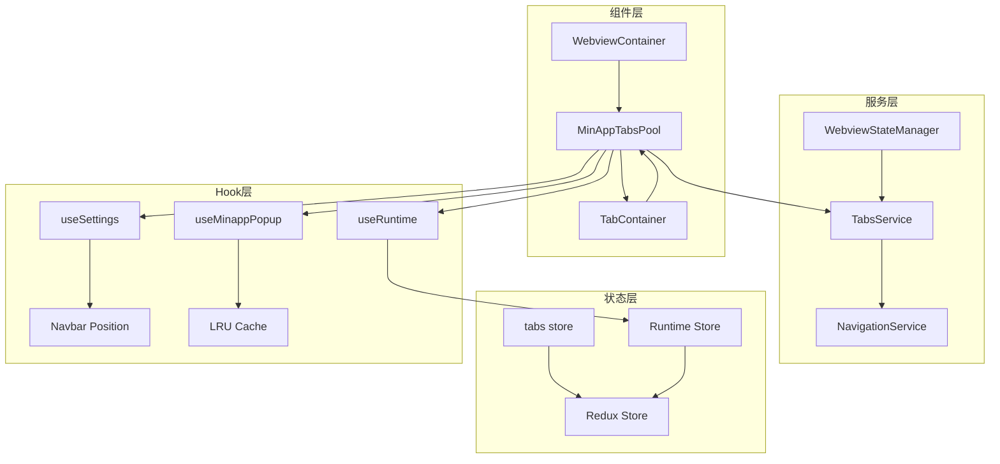
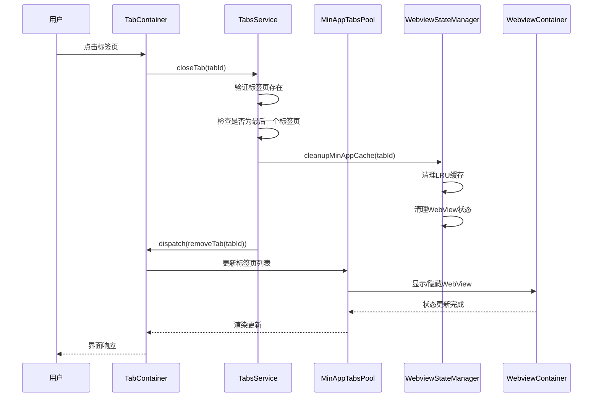
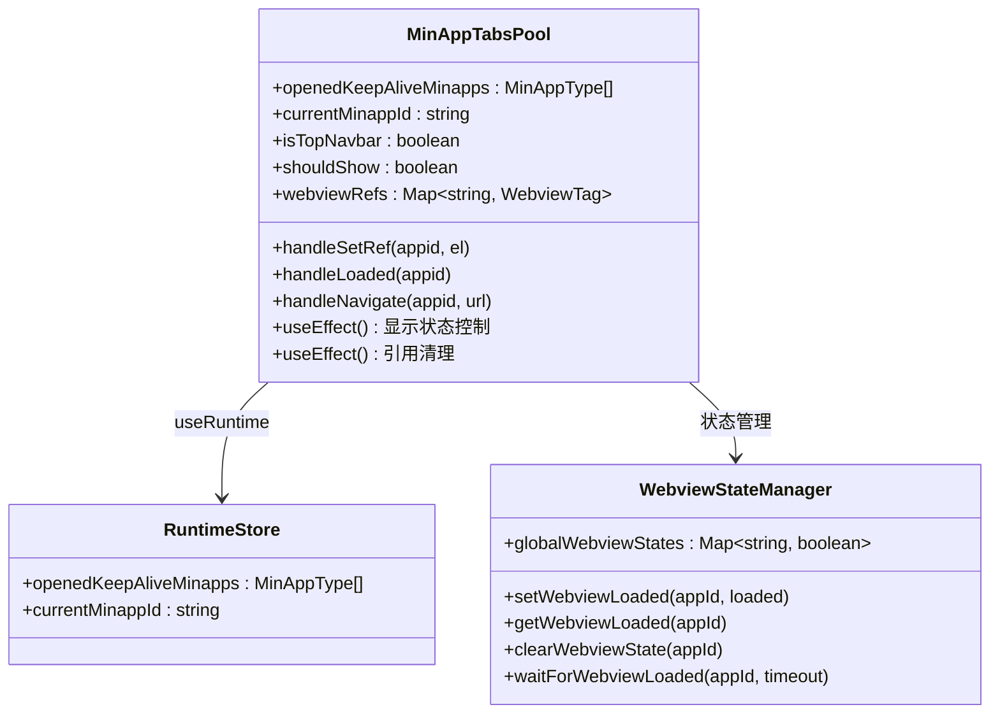
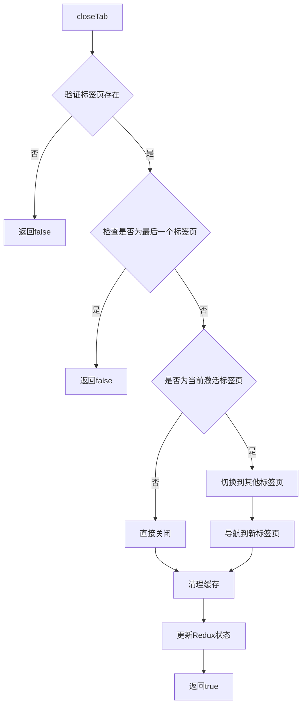
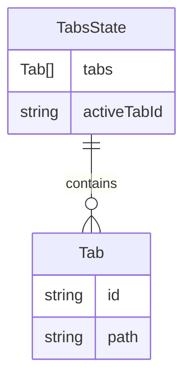
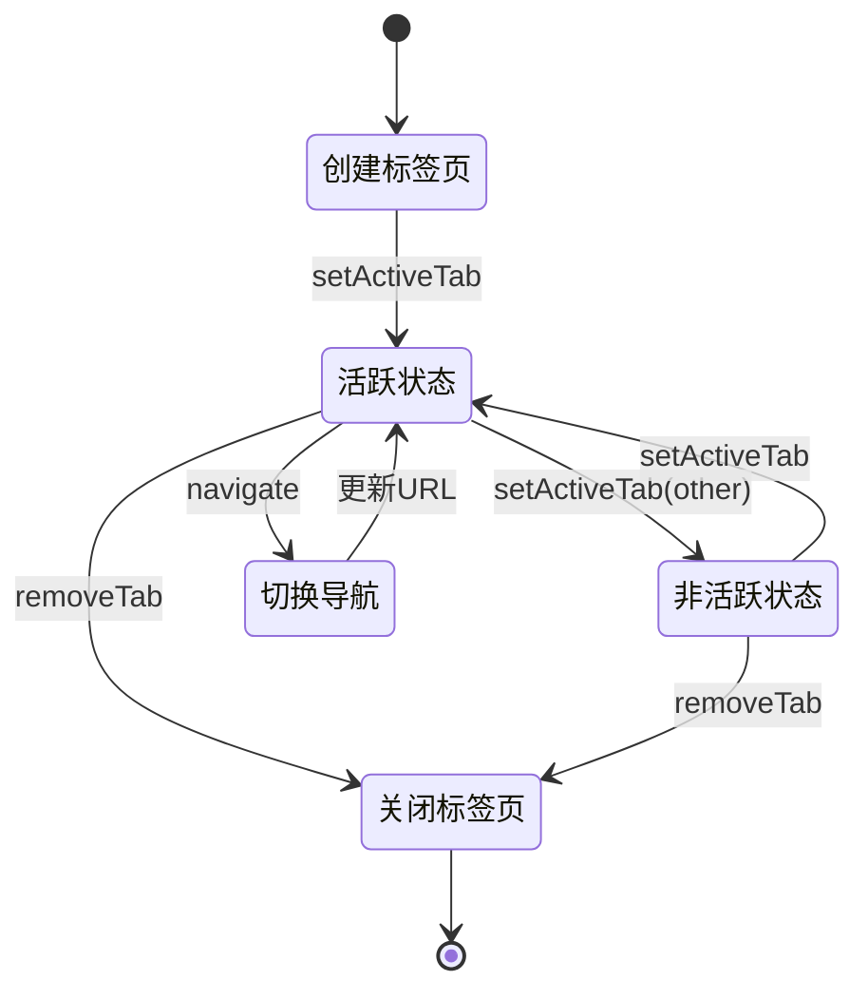

# 标签页管理

<cite>
**本文档中引用的文件**
- [MinAppTabsPool.tsx](file://src/renderer/src/components/MinApp/MinAppTabsPool.tsx)
- [TabContainer.tsx](file://src/renderer/src/components/Tab/TabContainer.tsx)
- [TabsService.ts](file://src/renderer/src/services/TabsService.ts)
- [tabs.ts](file://src/renderer/src/store/tabs.ts)
- [webviewStateManager.ts](file://src/renderer/src/utils/webviewStateManager.ts)
- [useRuntime.ts](file://src/renderer/src/hooks/useRuntime.ts)
- [useSettings.ts](file://src/renderer/src/hooks/useSettings.ts)
- [useMinappPopup.ts](file://src/renderer/src/hooks/useMinappPopup.ts)
- [index.ts](file://src/renderer/src/types/index.ts)
</cite>

## 目录
1. [简介](#简介)
2. [项目结构](#项目结构)
3. [核心组件](#核心组件)
4. [架构概览](#架构概览)
5. [详细组件分析](#详细组件分析)
6. [状态管理](#状态管理)
7. [性能优化](#性能优化)
8. [使用示例](#使用示例)
9. [故障排除指南](#故障排除指南)
10. [结论](#结论)

## 简介

MinAppTabsPool是Cherry Studio中负责管理Mini应用标签页的核心组件，它实现了标签页的创建、切换、关闭和持久化逻辑。该组件采用池化模式设计，通过WebView容器实现标签页的保活机制，支持动态管理和高性能的多标签页操作。

## 项目结构

MinAppTabsPool组件在项目中的组织结构如下：



**图表来源**
- [MinAppTabsPool.tsx](file://src/renderer/src/components/MinApp/MinAppTabsPool.tsx#L22-L115)
- [TabContainer.tsx](file://src/renderer/src/components/Tab/TabContainer.tsx#L117-L301)

## 核心组件

### MinAppTabsPool组件

MinAppTabsPool是标签页池的核心组件，负责管理所有Mini应用的WebView实例。它采用池化模式，只渲染当前活跃的应用，其余应用的WebView保持隐藏状态以节省资源。

主要特性：
- **池化管理**：维护一个WebView池，按需显示和隐藏
- **状态同步**：与全局状态保持同步，确保标签页状态一致性
- **条件渲染**：仅在顶部导航栏模式下显示
- **生命周期管理**：自动处理WebView的加载和卸载

### TabContainer组件

TabContainer是标签页容器组件，提供标签页的UI界面和交互逻辑。它负责标签页的创建、切换、关闭等操作，并与TabsService进行通信。

主要功能：
- **标签页管理**：创建、删除、切换标签页
- **图标和标题**：根据标签类型显示相应的图标和标题
- **拖拽排序**：支持标签页的拖拽重排
- **特殊标签处理**：管理设置和启动板等特殊标签页

**章节来源**
- [MinAppTabsPool.tsx](file://src/renderer/src/components/MinApp/MinAppTabsPool.tsx#L22-L115)
- [TabContainer.tsx](file://src/renderer/src/components/Tab/TabContainer.tsx#L117-L301)

## 架构概览

MinAppTabsPool的整体架构采用分层设计，各层职责明确，便于维护和扩展：



**图表来源**
- [TabsService.ts](file://src/renderer/src/services/TabsService.ts#L28-L76)
- [webviewStateManager.ts](file://src/renderer/src/utils/webviewStateManager.ts#L79-L120)

## 详细组件分析

### MinAppTabsPool组件深度分析

#### 核心状态管理

MinAppTabsPool通过多个状态钩子实现复杂的状态管理：



**图表来源**
- [MinAppTabsPool.tsx](file://src/renderer/src/components/MinApp/MinAppTabsPool.tsx#L23-L85)
- [webviewStateManager.ts](file://src/renderer/src/utils/webviewStateManager.ts#L30-L43)

#### WebView池化机制

MinAppTabsPool实现了高效的WebView池化机制：

1. **条件显示**：只有当`isTopNavbar`为true且访问/apps路由时才显示
2. **状态同步**：通过`shouldShow`变量控制WebView的可见性
3. **引用管理**：使用Map结构维护WebView的引用关系
4. **生命周期**：自动处理WebView的创建、显示、隐藏和销毁

#### 性能优化策略

- **延迟加载**：WebView仅在需要时才加载内容
- **状态保活**：通过LRU缓存机制保持应用状态
- **内存管理**：及时清理不再使用的WebView引用
- **事件隔离**：使用pointer-events属性隔离事件处理

**章节来源**
- [MinAppTabsPool.tsx](file://src/renderer/src/components/MinApp/MinAppTabsPool.tsx#L64-L85)

### TabsService服务分析

TabsService提供了标签页的业务逻辑处理能力：



**图表来源**
- [TabsService.ts](file://src/renderer/src/services/TabsService.ts#L32-L76)

#### 缓存清理机制

TabsService实现了智能的缓存清理机制：

1. **Mini应用检测**：识别是否为Mini应用标签页
2. **缓存查找**：在LRU缓存中查找对应的应用
3. **状态清理**：同时清理WebView状态和缓存条目
4. **错误处理**：优雅处理缓存缺失的情况

**章节来源**
- [TabsService.ts](file://src/renderer/src/services/TabsService.ts#L79-L102)

### 状态管理架构

#### Redux状态结构

标签页的状态通过Redux进行统一管理：



**图表来源**
- [tabs.ts](file://src/renderer/src/store/tabs.ts#L4-L12)

#### 运行时状态

MinAppTabsPool依赖运行时状态来管理Mini应用：

- **openedKeepAliveMinapps**：已打开的保活Mini应用列表
- **currentMinappId**：当前激活的Mini应用ID
- **minAppsCache**：LRU缓存实例

**章节来源**
- [useRuntime.ts](file://src/renderer/src/hooks/useRuntime.ts#L3-L5)
- [useMinappPopup.ts](file://src/renderer/src/hooks/useMinappPopup.ts#L56-L82)

## 状态管理

### 标签页状态流转

标签页的状态管理遵循严格的流程控制：



### WebView状态管理

WebView的状态通过专门的状态管理器进行控制：

#### 状态同步机制

1. **全局状态**：维护所有WebView的加载状态
2. **事件广播**：状态变化时通知所有监听者
3. **订阅管理**：提供灵活的事件订阅和取消机制
4. **超时处理**：支持异步状态等待和超时控制

#### 生命周期管理

- **初始化**：设置WebView初始状态
- **加载监控**：跟踪WebView的加载进度
- **状态更新**：实时更新WebView状态
- **清理机制**：组件卸载时清理相关状态

**章节来源**
- [webviewStateManager.ts](file://src/renderer/src/utils/webviewStateManager.ts#L12-L120)

## 性能优化

### 内存优化策略

MinAppTabsPool采用了多种内存优化策略：

1. **LRU缓存**：限制Mini应用的数量，自动淘汰最久未使用的应用
2. **延迟卸载**：WebView保持DOM结构，仅隐藏内容
3. **引用清理**：及时清理不再使用的引用和事件监听器
4. **状态压缩**：只保存必要的状态信息

### 渲染优化

- **条件渲染**：仅渲染需要显示的WebView
- **虚拟化**：对于大量标签页，考虑使用虚拟化技术
- **防抖处理**：对频繁的状态更新进行防抖处理
- **批量更新**：合并多个状态更新操作

### 网络优化

- **预加载策略**：提前加载可能需要的WebView
- **缓存机制**：利用浏览器缓存减少网络请求
- **连接复用**：复用WebView的网络连接

## 使用示例

### 基本标签页管理

以下展示了如何使用MinAppTabsPool进行基本的标签页管理：

```typescript
// 打开新的Mini应用标签页
const openNewTab = (appId: string) => {
  const tabId = `apps:${appId}`;
  const path = `/apps/${appId}`;
  
  // 检查是否已存在标签页
  if (!tabs.some(tab => tab.id === tabId)) {
    dispatch(addTab({ id: tabId, path }));
  }
  
  // 激活新标签页
  dispatch(setActiveTab(tabId));
};

// 关闭标签页
const closeCurrentTab = () => {
  if (activeTabId) {
    tabsService.closeTab(activeTabId);
  }
};
```

### 动态标签页管理

```typescript
// 动态调整标签页顺序
const reorderTabs = (newOrder: Tab[]) => {
  dispatch(setTabs(newOrder));
};

// 批量关闭标签页
const closeMultipleTabs = (tabIds: string[]) => {
  tabIds.forEach(tabId => {
    tabsService.closeTab(tabId);
  });
};
```

### 状态持久化示例

```typescript
// 保存标签页状态
const saveTabState = () => {
  const currentState = {
    tabs: tabs,
    activeTabId: activeTabId,
    timestamp: Date.now()
  };
  
  localStorage.setItem('tabState', JSON.stringify(currentState));
};

// 恢复标签页状态
const restoreTabState = () => {
  const savedState = localStorage.getItem('tabState');
  if (savedState) {
    const state = JSON.parse(savedState);
    dispatch(setTabs(state.tabs));
    dispatch(setActiveTab(state.activeTabId));
  }
};
```

## 故障排除指南

### 常见问题及解决方案

#### 标签页无法正常显示

**问题描述**：Mini应用标签页无法正确显示或加载

**可能原因**：
1. `isTopNavbar`设置不正确
2. WebView引用丢失
3. 缓存状态异常

**解决方案**：
```typescript
// 检查导航栏位置设置
const { isTopNavbar } = useNavbarPosition();
console.log('Top navbar enabled:', isTopNavbar);

// 检查WebView引用
const webviewRef = webviewRefs.current.get(appId);
if (!webviewRef) {
  console.warn('WebView reference missing for app:', appId);
}

// 重置缓存状态
clearAllWebviewStates();
```

#### 标签页关闭异常

**问题描述**：标签页关闭时出现错误或状态不一致

**诊断步骤**：
1. 检查标签页是否存在
2. 验证是否为最后一个标签页
3. 确认缓存清理是否成功

**调试代码**：
```typescript
// 调试标签页状态
const debugTabState = (tabId: string) => {
  const state = store.getState();
  const tabExists = state.tabs.tabs.some(tab => tab.id === tabId);
  const isActive = state.tabs.activeTabId === tabId;
  
  console.log('Tab debug:', {
    exists: tabExists,
    active: isActive,
    totalTabs: state.tabs.tabs.length
  });
};
```

#### 性能问题排查

**问题症状**：大量标签页时出现卡顿或内存占用过高

**优化建议**：
1. 调整LRU缓存大小
2. 实现标签页虚拟化
3. 优化状态更新频率
4. 使用Web Workers处理复杂计算

**章节来源**
- [TabsService.ts](file://src/renderer/src/services/TabsService.ts#L37-L41)
- [webviewStateManager.ts](file://src/renderer/src/utils/webviewStateManager.ts#L50-L57)

## 结论

MinAppTabsPool组件展现了现代前端应用中标签页管理的最佳实践。通过池化模式、状态管理、性能优化等多个方面的精心设计，它成功地解决了多标签页场景下的各种挑战。

### 主要优势

1. **高效性能**：通过池化和LRU缓存实现资源的最优利用
2. **状态一致性**：完善的Redux状态管理和事件广播机制
3. **用户体验**：流畅的标签页切换和智能的生命周期管理
4. **可扩展性**：模块化的架构设计便于功能扩展

### 技术亮点

- **WebView池化**：创新的WebView管理策略
- **状态保活**：智能的缓存和状态管理
- **事件驱动**：基于观察者模式的事件处理
- **性能优先**：多层次的性能优化策略

MinAppTabsPool不仅是一个功能完整的标签页管理组件，更是现代前端架构设计的优秀范例，为类似场景的开发提供了宝贵的参考价值。