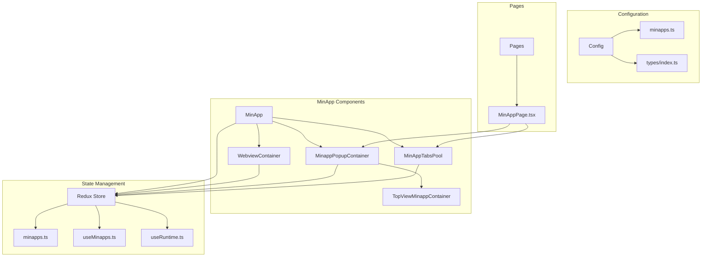
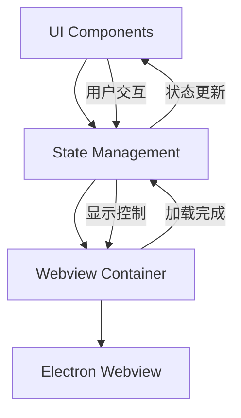
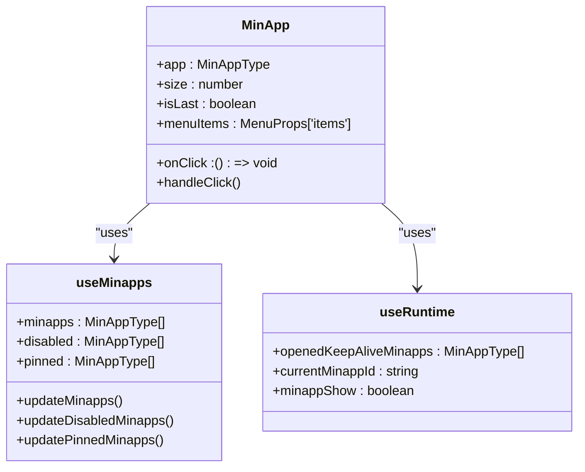
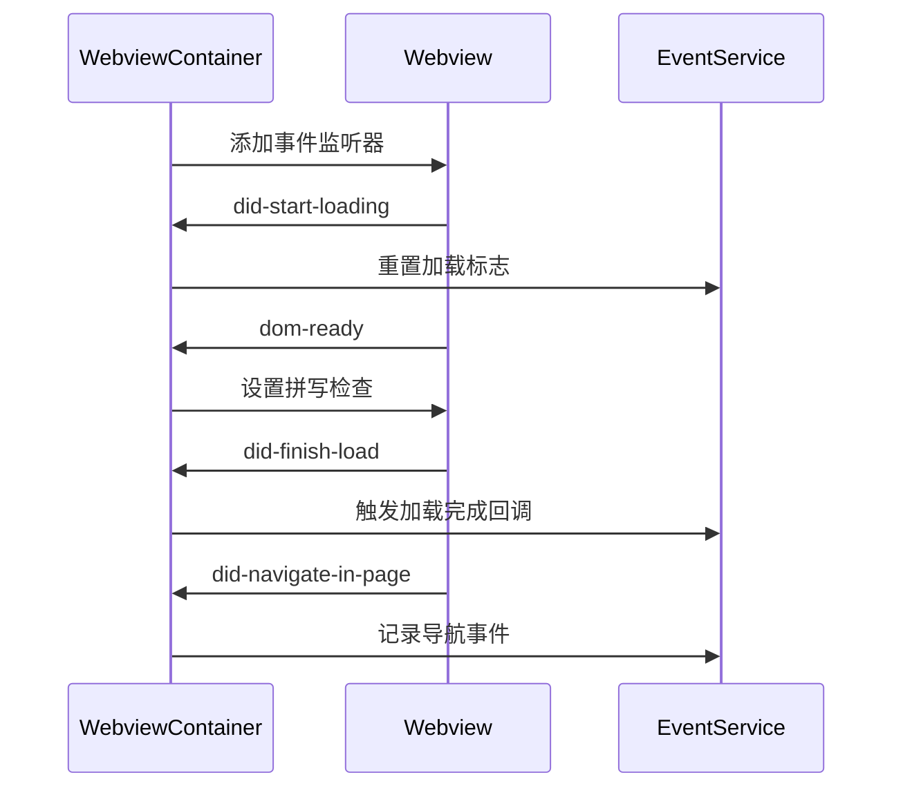
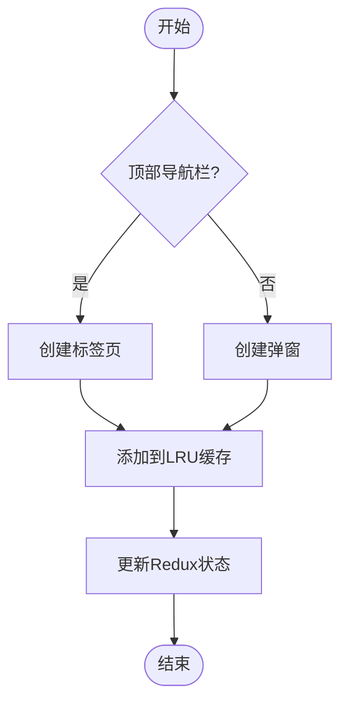
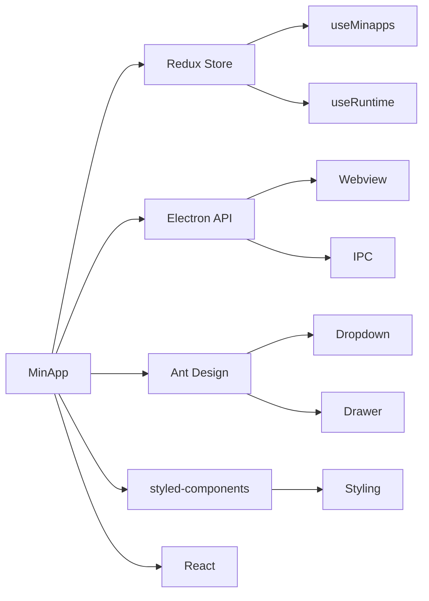

# 迷你应用核心组件

<cite>
**本文档引用的文件**   
- [MinApp.tsx](file://src/renderer/src/components/MinApp/MinApp.tsx)
- [minapps.ts](file://src/renderer/src/store/minapps.ts)
- [useMinapps.ts](file://src/renderer/src/hooks/useMinapps.ts)
- [WebviewContainer.tsx](file://src/renderer/src/components/MinApp/WebviewContainer.tsx)
- [MinappPopupContainer.tsx](file://src/renderer/src/components/MinApp/MinappPopupContainer.tsx)
- [MinAppTabsPool.tsx](file://src/renderer/src/components/MinApp/MinAppTabsPool.tsx)
- [useMinappPopup.ts](file://src/renderer/src/hooks/useMinappPopup.ts)
- [useRuntime.ts](file://src/renderer/src/hooks/useRuntime.ts)
- [minapps.ts](file://src/renderer/src/config/minapps.ts)
- [types/index.ts](file://src/renderer/src/types/index.ts)
- [MinAppPage.tsx](file://src/renderer/src/pages/minapps/MinAppPage.tsx)
- [webviewStateManager.ts](file://src/renderer/src/utils/webviewStateManager.ts)
</cite>

## 目录
1. [简介](#简介)
2. [项目结构](#项目结构)
3. [核心组件](#核心组件)
4. [架构概述](#架构概述)
5. [详细组件分析](#详细组件分析)
6. [依赖分析](#依赖分析)
7. [性能考虑](#性能考虑)
8. [故障排除指南](#故障排除指南)
9. [结论](#结论)

## 简介
本文档深入解析MinApp组件的架构设计与实现机制。MinApp作为迷你应用容器，负责管理一系列第三方应用的实例化、生命周期、状态维护和事件分发。该组件通过Redux store进行状态管理，并与WebviewContainer协作渲染实际内容。文档将详细阐述其props接口定义、内部状态结构及与Redux store的交互模式，同时提供代码示例展示如何创建和管理独立的迷你应用上下文。

## 项目结构
MinApp相关组件位于`src/renderer/src/components/MinApp/`目录下，主要包括核心的MinApp组件、Webview容器、弹窗容器和标签页池。状态管理通过Redux store在`src/renderer/src/store/minapps.ts`中定义，而应用配置和类型定义分别位于`src/renderer/src/config/minapps.ts`和`src/renderer/src/types/index.ts`中。整个架构支持两种显示模式：侧边栏弹窗模式和顶部导航标签页模式。

**Diagram sources**
- [MinApp.tsx](file://src/renderer/src/components/MinApp/MinApp.tsx)
- [WebviewContainer.tsx](file://src/renderer/src/components/MinApp/WebviewContainer.tsx)
- [MinappPopupContainer.tsx](file://src/renderer/src/components/MinApp/MinappPopupContainer.tsx)
- [MinAppTabsPool.tsx](file://src/renderer/src/components/MinApp/MinAppTabsPool.tsx)
- [minapps.ts](file://src/renderer/src/store/minapps.ts)
- [useMinapps.ts](file://src/renderer/src/hooks/useMinapps.ts)
- [useRuntime.ts](file://src/renderer/src/hooks/useRuntime.ts)
- [config/minapps.ts](file://src/renderer/src/config/minapps.ts)
- [types/index.ts](file://src/renderer/src/types/index.ts)
- [MinAppPage.tsx](file://src/renderer/src/pages/minapps/MinAppPage.tsx)

**Section sources**
- [MinApp.tsx](file://src/renderer/src/components/MinApp/MinApp.tsx)
- [WebviewContainer.tsx](file://src/renderer/src/components/MinApp/WebviewContainer.tsx)
- [MinappPopupContainer.tsx](file://src/renderer/src/components/MinApp/MinappPopupContainer.tsx)
- [MinAppTabsPool.tsx](file://src/renderer/src/components/MinApp/MinAppTabsPool.tsx)
- [minapps.ts](file://src/renderer/src/store/minapps.ts)
- [useMinapps.ts](file://src/renderer/src/hooks/useMinapps.ts)
- [useRuntime.ts](file://src/renderer/src/hooks/useRuntime.ts)
- [config/minapps.ts](file://src/renderer/src/config/minapps.ts)
- [types/index.ts](file://src/renderer/src/types/index.ts)
- [MinAppPage.tsx](file://src/renderer/src/pages/minapps/MinAppPage.tsx)

## 核心组件
MinApp组件作为迷你应用的容器，负责管理应用实例的生命周期和状态。它通过props接收应用配置，利用Redux store维护全局状态，并通过WebviewContainer渲染实际内容。组件支持两种显示模式：侧边栏弹窗模式和顶部导航标签页模式，分别由MinappPopupContainer和MinAppTabsPool管理。

**Section sources**
- [MinApp.tsx](file://src/renderer/src/components/MinApp/MinApp.tsx)
- [WebviewContainer.tsx](file://src/renderer/src/components/MinApp/WebviewContainer.tsx)
- [MinappPopupContainer.tsx](file://src/renderer/src/components/MinApp/MinappPopupContainer.tsx)
- [MinAppTabsPool.tsx](file://src/renderer/src/components/MinApp/MinAppTabsPool.tsx)

## 架构概述
MinApp组件采用分层架构设计，上层为UI组件，中层为状态管理，底层为Webview容器。UI组件负责展示应用图标和处理用户交互，状态管理通过Redux store维护应用的启用、禁用和固定状态，Webview容器负责实际内容的渲染和生命周期管理。整个架构支持两种显示模式的无缝切换。

**Diagram sources**
- [MinApp.tsx](file://src/renderer/src/components/MinApp/MinApp.tsx)
- [minapps.ts](file://src/renderer/src/store/minapps.ts)
- [WebviewContainer.tsx](file://src/renderer/src/components/MinApp/WebviewContainer.tsx)

## 详细组件分析

### MinApp组件分析
MinApp组件是迷你应用的核心容器，负责管理应用实例的生命周期和状态。它通过props接收应用配置，利用Redux store维护全局状态，并通过WebviewContainer渲染实际内容。

#### 组件接口定义
MinApp组件的props接口定义如下：

| 属性 | 类型 | 描述 |
|------|------|------|
| app | MinAppType | 应用配置对象，包含id、name、url、logo等信息 |
| onClick | () => void | 点击事件回调 |
| size | number | 图标大小，默认60 |
| isLast | boolean | 是否为最后一个应用 |

**Section sources**
- [MinApp.tsx](file://src/renderer/src/components/MinApp/MinApp.tsx)
- [types/index.ts](file://src/renderer/src/types/index.ts)

#### 状态管理
MinApp组件通过Redux store管理应用状态，包括启用、禁用和固定状态。状态管理通过useMinapps和useRuntime两个hooks实现。

**Diagram sources**
- [MinApp.tsx](file://src/renderer/src/components/MinApp/MinApp.tsx)
- [useMinapps.ts](file://src/renderer/src/hooks/useMinapps.ts)
- [useRuntime.ts](file://src/renderer/src/hooks/useRuntime.ts)

### Webview容器分析
WebviewContainer组件负责渲染迷你应用的实际内容，通过Electron的webview标签实现。

#### 生命周期管理
WebviewContainer通过useEffect钩子管理生命周期事件，包括加载完成、DOM准备和页面导航。

**Diagram sources**
- [WebviewContainer.tsx](file://src/renderer/src/components/MinApp/WebviewContainer.tsx)

### 弹窗容器分析
MinappPopupContainer组件管理迷你应用的弹窗显示，支持保持活动状态的应用实例。

#### 应用实例管理
MinappPopupContainer通过LRU缓存机制管理保持活动状态的应用实例，确保最近使用的应用保持在内存中。

**Diagram sources**
- [MinappPopupContainer.tsx](file://src/renderer/src/components/MinApp/MinappPopupContainer.tsx)
- [useMinappPopup.ts](file://src/renderer/src/hooks/useMinappPopup.ts)

## 依赖分析
MinApp组件依赖于多个核心模块，包括Redux store、Electron API、Ant Design UI组件和styled-components样式系统。这些依赖共同支持组件的功能实现和用户体验。

**Diagram sources**
- [MinApp.tsx](file://src/renderer/src/components/MinApp/MinApp.tsx)
- [minapps.ts](file://src/renderer/src/store/minapps.ts)
- [useMinapps.ts](file://src/renderer/src/hooks/useMinapps.ts)
- [useRuntime.ts](file://src/renderer/src/hooks/useRuntime.ts)
- [WebviewContainer.tsx](file://src/renderer/src/components/MinApp/WebviewContainer.tsx)

## 性能考虑
MinApp组件在多实例场景下采用多种性能优化策略。首先，通过LRU缓存机制限制同时保持活动状态的应用实例数量，避免内存过度消耗。其次，采用Webview的keep-alive机制，使已加载的应用实例在切换时无需重新加载，提升用户体验。最后，通过条件渲染和事件委托优化UI更新性能。

**Section sources**
- [useMinappPopup.ts](file://src/renderer/src/hooks/useMinappPopup.ts)
- [MinAppTabsPool.tsx](file://src/renderer/src/components/MinApp/MinAppTabsPool.tsx)
- [webviewStateManager.ts](file://src/renderer/src/utils/webviewStateManager.ts)

## 故障排除指南
当遇到MinApp组件相关问题时，可参考以下排查步骤：
1. 检查应用配置是否正确，确保id、name、url等必填字段存在
2. 验证Redux store状态是否正常，检查minapps、pinned等状态是否正确更新
3. 确认Webview事件监听器是否正常工作，特别是did-finish-load和dom-ready事件
4. 检查LRU缓存配置，确保maxKeepAliveMinapps设置合理
5. 验证Electron IPC通信是否正常，特别是拼写检查和外部链接设置

**Section sources**
- [MinApp.tsx](file://src/renderer/src/components/MinApp/MinApp.tsx)
- [WebviewContainer.tsx](file://src/renderer/src/components/MinApp/WebviewContainer.tsx)
- [useMinappPopup.ts](file://src/renderer/src/hooks/useMinappPopup.ts)
- [minapps.ts](file://src/renderer/src/store/minapps.ts)

## 结论
MinApp组件通过精心设计的架构实现了迷你应用的高效管理。其核心优势在于灵活的状态管理、高效的生命周期控制和优秀的用户体验。通过Redux store与LRU缓存的结合，组件在保持应用实例活性的同时有效控制了资源消耗。未来可进一步优化Webview的内存管理策略，并增强多实例场景下的性能表现。