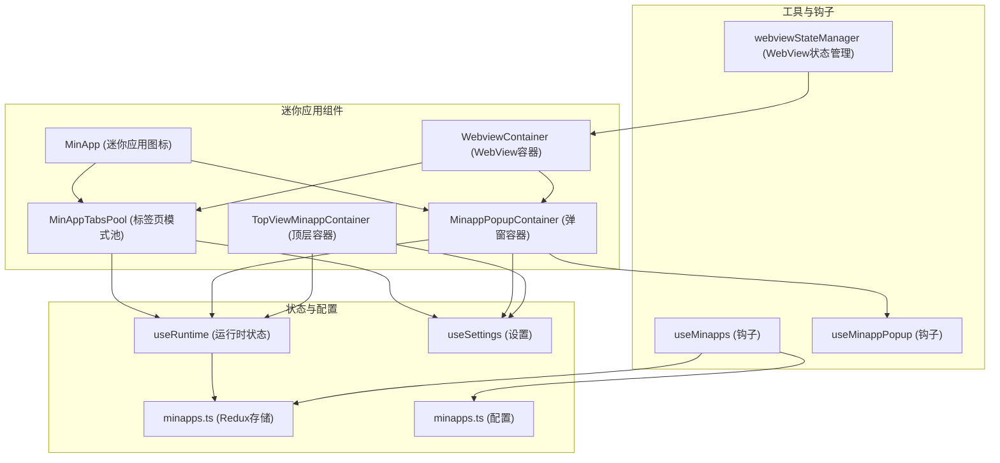
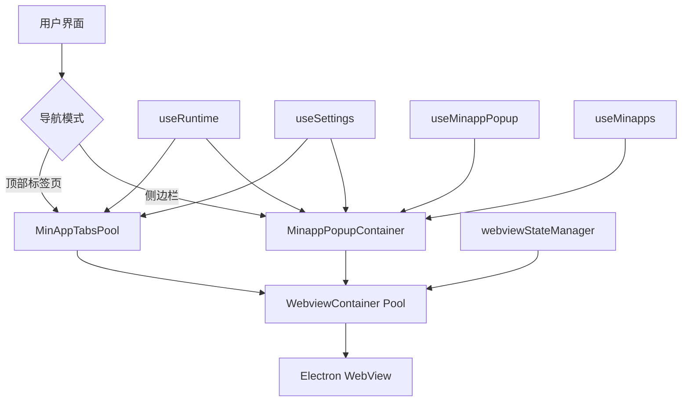
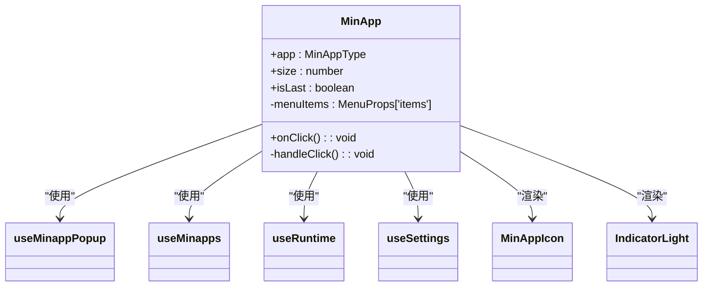
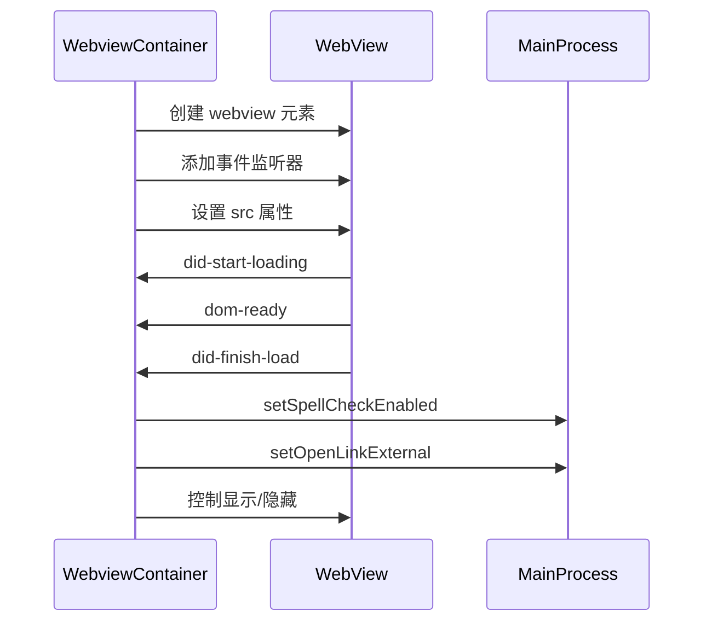
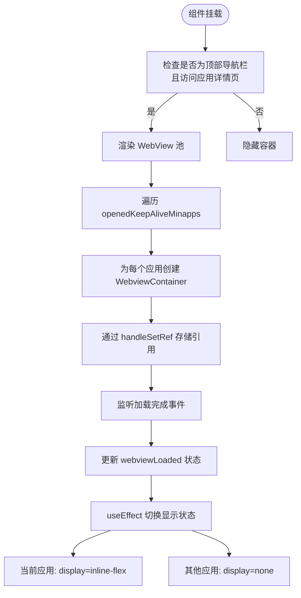
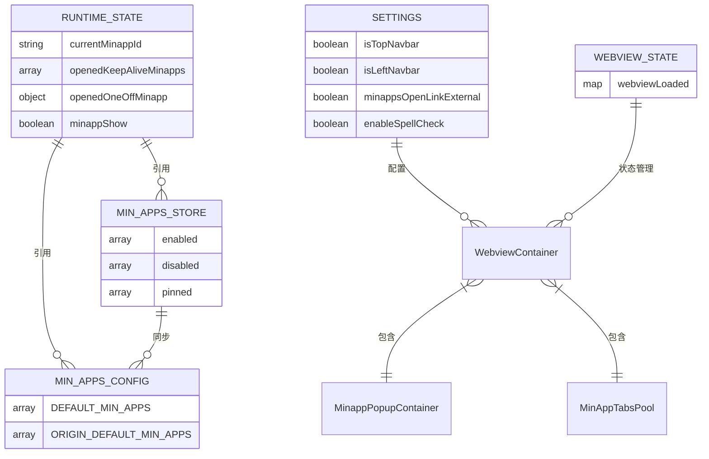

# 迷你应用组件

<cite>
**本文档引用的文件**  
- [MinApp.tsx](file://src/renderer/src/components/MinApp/MinApp.tsx)
- [WebviewContainer.tsx](file://src/renderer/src/components/MinApp/WebviewContainer.tsx)
- [MinAppTabsPool.tsx](file://src/renderer/src/components/MinApp/MinAppTabsPool.tsx)
- [TopViewMinappContainer.tsx](file://src/renderer/src/components/MinApp/TopViewMinappContainer.tsx)
- [MinappPopupContainer.tsx](file://src/renderer/src/components/MinApp/MinappPopupContainer.tsx)
- [minapps.ts](file://src/renderer/src/config/minapps.ts)
- [useMinapps.ts](file://src/renderer/src/hooks/useMinapps.ts)
- [useRuntime.ts](file://src/renderer/src/hooks/useRuntime.ts)
- [useSettings.ts](file://src/renderer/src/hooks/useSettings.ts)
- [webviewStateManager.ts](file://src/renderer/src/utils/webviewStateManager.ts)
- [minapps.ts](file://src/renderer/src/store/minapps.ts)
- [index.ts](file://src/renderer/src/types/index.ts)
</cite>

## 目录
1. [简介](#简介)
2. [项目结构](#项目结构)
3. [核心组件](#核心组件)
4. [架构概述](#架构概述)
5. [详细组件分析](#详细组件分析)
6. [依赖分析](#依赖分析)
7. [性能考虑](#性能考虑)
8. [故障排除指南](#故障排除指南)
9. [结论](#结论)

## 简介
Cherry Studio的迷你应用组件系统提供了一种在主应用内集成和管理第三方Web应用的机制。该系统支持两种主要的导航模式：侧边栏模式和顶部标签页模式，允许用户通过弹窗或标签页的方式访问各种AI服务和工具。迷你应用系统的设计重点在于保持应用状态的持久性、优化资源使用和提供流畅的用户体验。

## 项目结构
迷你应用组件主要位于`src/renderer/src/components/MinApp/`目录下，与其他相关配置和状态管理文件协同工作。系统采用React组件架构，结合Redux进行状态管理，并利用Electron的WebView功能实现Web内容的嵌入。

**Diagram sources**
- [MinApp.tsx](file://src/renderer/src/components/MinApp/MinApp.tsx)
- [WebviewContainer.tsx](file://src/renderer/src/components/MinApp/WebviewContainer.tsx)
- [MinAppTabsPool.tsx](file://src/renderer/src/components/MinApp/MinAppTabsPool.tsx)
- [MinappPopupContainer.tsx](file://src/renderer/src/components/MinApp/MinappPopupContainer.tsx)
- [TopViewMinappContainer.tsx](file://src/renderer/src/components/MinApp/TopViewMinappContainer.tsx)
- [useRuntime.ts](file://src/renderer/src/hooks/useRuntime.ts)
- [useSettings.ts](file://src/renderer/src/hooks/useSettings.ts)
- [minapps.ts](file://src/renderer/src/store/minapps.ts)
- [minapps.ts](file://src/renderer/src/config/minapps.ts)
- [webviewStateManager.ts](file://src/renderer/src/utils/webviewStateManager.ts)

**Section sources**
- [MinApp.tsx](file://src/renderer/src/components/MinApp/MinApp.tsx)
- [WebviewContainer.tsx](file://src/renderer/src/components/MinApp/WebviewContainer.tsx)
- [MinAppTabsPool.tsx](file://src/renderer/src/components/MinApp/MinAppTabsPool.tsx)
- [MinappPopupContainer.tsx](file://src/renderer/src/components/MinApp/MinappPopupContainer.tsx)
- [TopViewMinappContainer.tsx](file://src/renderer/src/components/MinApp/TopViewMinappContainer.tsx)
- [useRuntime.ts](file://src/renderer/src/hooks/useRuntime.ts)
- [useSettings.ts](file://src/renderer/src/hooks/useSettings.ts)
- [minapps.ts](file://src/renderer/src/store/minapps.ts)
- [minapps.ts](file://src/renderer/src/config/minapps.ts)
- [webviewStateManager.ts](file://src/renderer/src/utils/webviewStateManager.ts)

## 核心组件
迷你应用系统由四个核心组件构成：MinApp、WebviewContainer、MinAppTabsPool和TopViewMinappContainer。这些组件协同工作，提供了灵活的迷你应用管理机制。MinApp组件负责渲染迷你应用的图标和处理用户交互；WebviewContainer封装了Electron的WebView元素，负责加载和显示Web内容；MinAppTabsPool实现了顶部标签页模式下的应用池管理；TopViewMinappContainer则作为顶层容器，根据导航模式决定显示哪个子容器。

**Section sources**
- [MinApp.tsx](file://src/renderer/src/components/MinApp/MinApp.tsx)
- [WebviewContainer.tsx](file://src/renderer/src/components/MinApp/WebviewContainer.tsx)
- [MinAppTabsPool.tsx](file://src/renderer/src/components/MinApp/MinAppTabsPool.tsx)
- [TopViewMinappContainer.tsx](file://src/renderer/src/components/MinApp/TopViewMinappContainer.tsx)

## 架构概述
迷你应用系统的架构设计旨在支持两种不同的用户界面模式：侧边栏模式和顶部标签页模式。在侧边栏模式下，用户点击迷你应用图标会弹出一个可最小化的窗口（由MinappPopupContainer管理），该窗口包含一个WebView容器池，所有打开的应用实例都保留在内存中，通过显示/隐藏来切换。在顶部标签页模式下，系统使用MinAppTabsPool组件，在应用详情页面（/apps/:id）显示一个标签页式的WebView池，同样保持应用实例的持久性。这种双模式设计允许用户根据自己的工作习惯选择最适合的交互方式。

**Diagram sources**
- [MinappPopupContainer.tsx](file://src/renderer/src/components/MinApp/MinappPopupContainer.tsx)
- [MinAppTabsPool.tsx](file://src/renderer/src/components/MinApp/MinAppTabsPool.tsx)
- [WebviewContainer.tsx](file://src/renderer/src/components/MinApp/WebviewContainer.tsx)
- [useRuntime.ts](file://src/renderer/src/hooks/useRuntime.ts)
- [useSettings.ts](file://src/renderer/src/hooks/useSettings.ts)
- [useMinappPopup.ts](file://src/renderer/src/hooks/useMinappPopup.ts)
- [useMinapps.ts](file://src/renderer/src/hooks/useMinapps.ts)
- [webviewStateManager.ts](file://src/renderer/src/utils/webviewStateManager.ts)

## 详细组件分析

### MinApp 组件分析
MinApp组件是用户与迷你应用交互的主要入口。它渲染一个带有图标和名称的应用图标，用户可以通过点击或右键菜单来打开应用。组件根据当前的导航模式（侧边栏或顶部）决定是导航到应用页面还是打开弹窗。右键菜单提供了将应用固定到侧边栏或启动板、隐藏应用以及删除自定义应用的功能。

**Diagram sources**
- [MinApp.tsx](file://src/renderer/src/components/MinApp/MinApp.tsx)
- [useMinappPopup.ts](file://src/renderer/src/hooks/useMinappPopup.ts)
- [useMinapps.ts](file://src/renderer/src/hooks/useMinapps.ts)
- [useRuntime.ts](file://src/renderer/src/hooks/useRuntime.ts)
- [useSettings.ts](file://src/renderer/src/hooks/useSettings.ts)

**Section sources**
- [MinApp.tsx](file://src/renderer/src/components/MinApp/MinApp.tsx)

### WebviewContainer 组件分析
WebviewContainer组件是系统的核心，负责创建和管理Electron的WebView元素。它通过ref机制获取WebView的引用，并监听各种生命周期事件，如页面加载完成、DOM准备就绪和导航事件。组件使用memo进行性能优化，避免不必要的重新渲染。它还负责设置WebView的拼写检查和外部链接打开行为等配置。

**Diagram sources**
- [WebviewContainer.tsx](file://src/renderer/src/components/MinApp/WebviewContainer.tsx)

**Section sources**
- [WebviewContainer.tsx](file://src/renderer/src/components/MinApp/WebviewContainer.tsx)

### MinAppTabsPool 组件分析
MinAppTabsPool组件实现了顶部标签页模式下的迷你应用管理。它仅在用户访问`/apps/:id`路由且使用顶部导航栏时显示。组件维护一个WebView引用的Map，通过`display`属性控制当前活动应用的显示，而其他应用则被隐藏但仍保留在DOM中，从而实现状态的持久性。当应用列表发生变化时，组件会自动清理不再需要的WebView引用。

**Diagram sources**
- [MinAppTabsPool.tsx](file://src/renderer/src/components/MinApp/MinAppTabsPool.tsx)

**Section sources**
- [MinAppTabsPool.tsx](file://src/renderer/src/components/MinApp/MinAppTabsPool.tsx)

### TopViewMinappContainer 组件分析
TopViewMinappContainer是一个逻辑容器组件，负责根据当前的导航模式决定显示哪个子容器。它检查`isLeftNavbar`设置，如果为真（侧边栏模式），则渲染MinappPopupContainer；如果为假（顶部标签页模式），则不渲染任何内容，因为此时应由MinAppTabsPool负责显示应用。这种设计确保了两种模式不会同时激活，避免了UI冲突。

**Section sources**
- [TopViewMinappContainer.tsx](file://src/renderer/src/components/MinApp/TopViewMinappContainer.tsx)

## 依赖分析
迷你应用系统依赖于多个核心模块和状态。它通过`useRuntime`钩子访问全局运行时状态，包括已打开的应用列表和当前活动的应用ID。通过`useSettings`钩子获取用户设置，如导航栏位置和WebView行为配置。系统使用Redux存储（minapps.ts）来管理应用的启用、禁用和固定状态。配置文件（minapps.ts）定义了所有默认和自定义迷你应用的元数据。WebView的状态（如加载状态）通过独立的`webviewStateManager`工具进行管理，确保状态的一致性和可预测性。

**Diagram sources**
- [useRuntime.ts](file://src/renderer/src/hooks/useRuntime.ts)
- [useSettings.ts](file://src/renderer/src/hooks/useSettings.ts)
- [minapps.ts](file://src/renderer/src/store/minapps.ts)
- [minapps.ts](file://src/renderer/src/config/minapps.ts)
- [webviewStateManager.ts](file://src/renderer/src/utils/webviewStateManager.ts)
- [WebviewContainer.tsx](file://src/renderer/src/components/MinApp/WebviewContainer.tsx)
- [MinappPopupContainer.tsx](file://src/renderer/src/components/MinApp/MinappPopupContainer.tsx)
- [MinAppTabsPool.tsx](file://src/renderer/src/components/MinApp/MinAppTabsPool.tsx)

**Section sources**
- [useRuntime.ts](file://src/renderer/src/hooks/useRuntime.ts)
- [useSettings.ts](file://src/renderer/src/hooks/useSettings.ts)
- [minapps.ts](file://src/renderer/src/store/minapps.ts)
- [minapps.ts](file://src/renderer/src/config/minapps.ts)
- [webviewStateManager.ts](file://src/renderer/src/utils/webviewStateManager.ts)

## 性能考虑
迷你应用系统在设计时充分考虑了性能和资源管理。通过使用`React.memo`对WebviewContainer进行优化，避免了不必要的重新渲染。系统采用WebView池化策略，重用已创建的WebView实例而不是频繁创建和销毁，这显著减少了内存分配和垃圾回收的开销。应用状态的持久性意味着用户在切换应用时无需重新加载页面，提供了类似原生应用的体验。然而，这种设计也带来了内存使用的增加，因为所有打开的应用实例都保留在内存中。建议用户定期关闭不使用的应用以释放资源。此外，系统通过`useMemo`和`useCallback`等React钩子进一步优化了渲染性能。

## 故障排除指南
如果迷你应用无法正常加载，请首先检查网络连接和应用URL的正确性。如果WebView显示空白，尝试使用开发者工具（在开发模式下可用）检查是否有JavaScript错误。如果应用无法导航到新页面，请检查`minappsOpenLinkExternal`设置是否正确。如果应用状态没有正确持久化，请检查`useRuntime`状态是否正常更新。对于自定义应用，确保`custom-minapps.json`文件格式正确且路径无误。如果遇到样式问题，请检查应用的`bodered`和`style`配置是否符合预期。

**Section sources**
- [WebviewContainer.tsx](file://src/renderer/src/components/MinApp/WebviewContainer.tsx)
- [useRuntime.ts](file://src/renderer/src/hooks/useRuntime.ts)
- [useSettings.ts](file://src/renderer/src/hooks/useSettings.ts)
- [minapps.ts](file://src/renderer/src/config/minapps.ts)

## 结论
Cherry Studio的迷你应用组件系统提供了一个强大而灵活的框架，用于集成和管理第三方Web应用。通过精心设计的双模式架构（弹窗和标签页），系统能够适应不同的用户偏好和工作流程。核心的WebView池化和状态持久化机制确保了流畅的用户体验和高效的应用切换。系统的模块化设计和清晰的依赖关系使得其易于维护和扩展。未来可以考虑实现LRU（最近最少使用）淘汰策略来优化内存使用，或探索与主应用更深层次的集成，如数据共享和API调用。