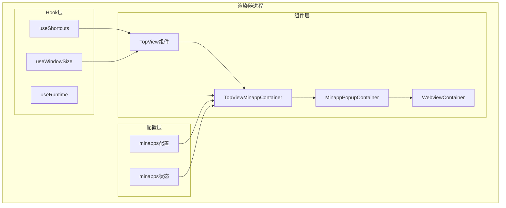
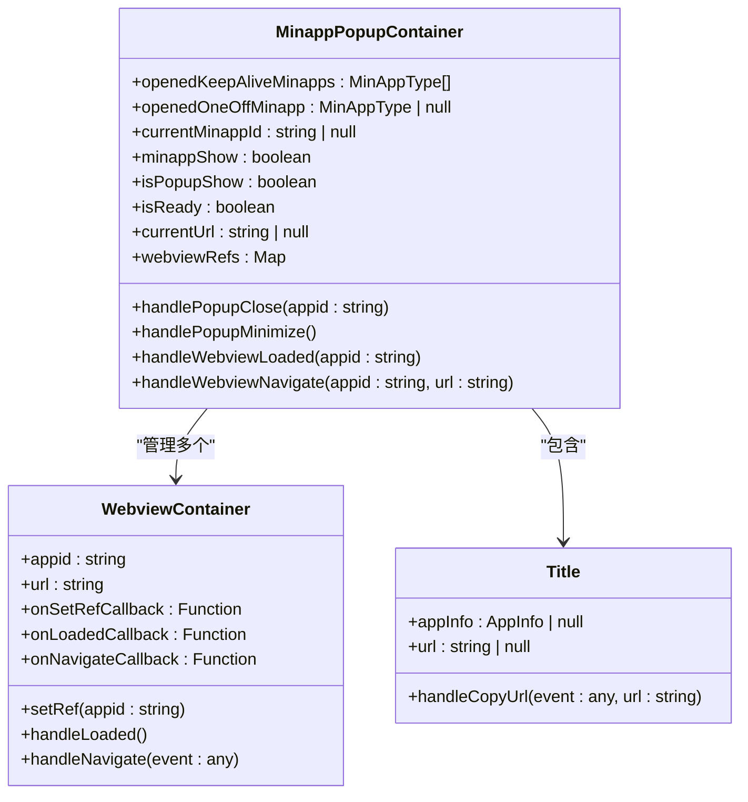
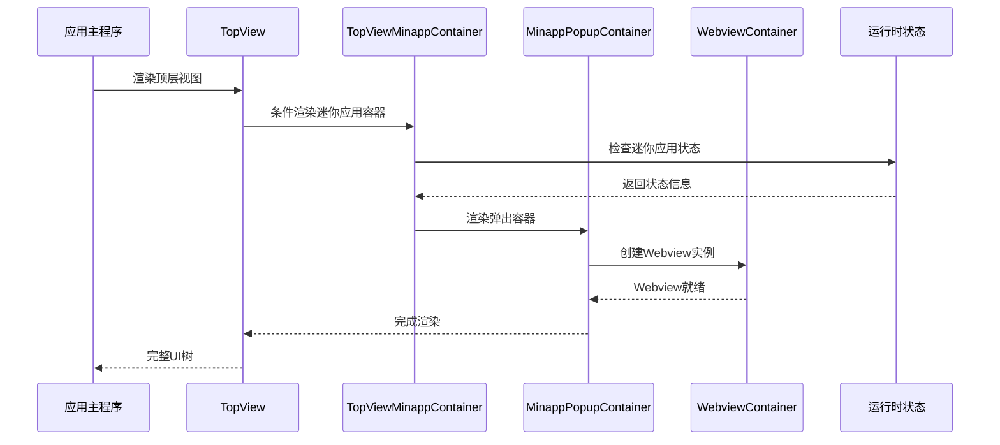
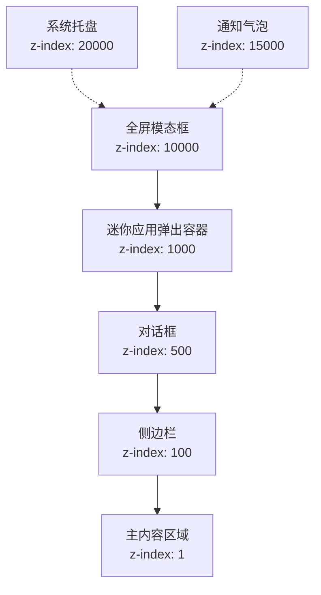
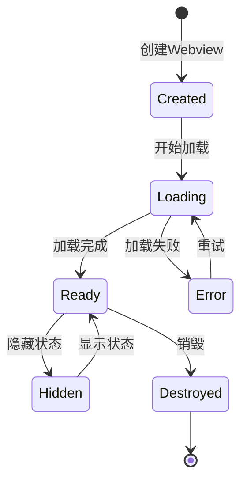
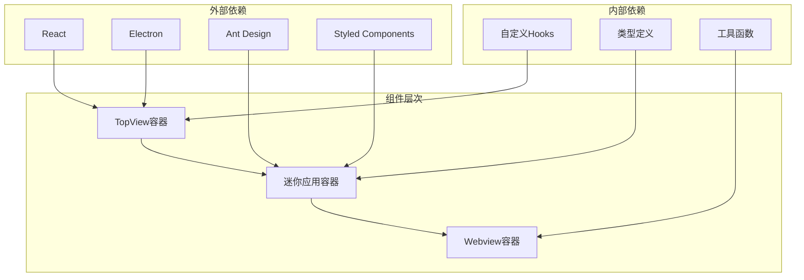

# 顶层视图容器

<cite>
**本文档引用的文件**
- [TopViewMinappContainer.tsx](file://src/renderer/src/components/MinApp/TopViewMinappContainer.tsx)
- [MinappPopupContainer.tsx](file://src/renderer/src/components/MinApp/MinappPopupContainer.tsx)
- [TopView/index.tsx](file://src/renderer/src/components/TopView/index.tsx)
- [WebviewContainer.tsx](file://src/renderer/src/components/MinApp/WebviewContainer.tsx)
- [minapps.ts](file://src/renderer/src/config/minapps.ts)
- [minapps.ts](file://src/renderer/src/store/minapps.ts)
- [useShortcuts.ts](file://src/renderer/src/hooks/useShortcuts.ts)
- [useWindowSize.ts](file://src/renderer/src/hooks/useWindowSize.ts)
</cite>

## 目录
1. [简介](#简介)
2. [项目结构](#项目结构)
3. [核心组件](#核心组件)
4. [架构概览](#架构概览)
5. [详细组件分析](#详细组件分析)
6. [依赖关系分析](#依赖关系分析)
7. [性能考虑](#性能考虑)
8. [故障排除指南](#故障排除指南)
9. [结论](#结论)

## 简介

TopViewMinappContainer是Cherry Studio中负责管理迷你应用程序（MinApp）弹出容器的核心组件。作为顶层UI容器，它在应用的UI层级中占据特殊地位，专门处理窗口级事件、全局快捷键和跨应用交互。该组件通过精心设计的布局管理系统和z-index控制机制，确保迷你应用程序能够正确地叠加在主界面之上，同时支持多显示器环境下的适配。

## 项目结构

TopViewMinappContainer组件位于Cherry Studio的渲染器进程目录结构中，属于迷你应用程序模块的一部分：



**图表来源**
- [TopView/index.tsx](file://src/renderer/src/components/TopView/index.tsx#L1-L122)
- [TopViewMinappContainer.tsx](file://src/renderer/src/components/MinApp/TopViewMinappContainer.tsx#L1-L15)

**章节来源**
- [TopView/index.tsx](file://src/renderer/src/components/TopView/index.tsx#L1-L122)
- [TopViewMinappContainer.tsx](file://src/renderer/src/components/MinApp/TopViewMinappContainer.tsx#L1-L15)

## 核心组件

### TopViewMinappContainer组件

TopViewMinappContainer是最基础的容器组件，负责根据运行时状态决定是否渲染迷你应用程序弹出容器：

```typescript
const TopViewMinappContainer = () => {
  const { openedKeepAliveMinapps, openedOneOffMinapp } = useRuntime()
  const { isLeftNavbar } = useNavbarPosition()
  const isCreate = openedKeepAliveMinapps.length > 0 || openedOneOffMinapp !== null

  // 只在侧边栏模式下显示弹出容器，不在标签页模式下显示
  return <>{isCreate && isLeftNavbar && <MinappPopupContainer />}</>
}
```

该组件的核心功能包括：
- **条件渲染**：仅当存在已打开的迷你应用程序或一次性迷你应用程序时才渲染
- **导航栏适配**：只在左侧导航栏模式下显示，避免在顶部导航栏模式下冲突
- **状态管理**：依赖运行时状态和导航栏位置状态

### MinappPopupContainer组件

MinappPopupContainer是实际的迷你应用程序弹出容器，提供了完整的迷你应用程序交互界面：



**图表来源**
- [MinappPopupContainer.tsx](file://src/renderer/src/components/MinApp/MinappPopupContainer.tsx#L144-L660)
- [WebviewContainer.tsx](file://src/renderer/src/components/MinApp/WebviewContainer.tsx#L14-L151)

**章节来源**
- [TopViewMinappContainer.tsx](file://src/renderer/src/components/MinApp/TopViewMinappContainer.tsx#L5-L12)
- [MinappPopupContainer.tsx](file://src/renderer/src/components/MinApp/MinappPopupContainer.tsx#L144-L660)

## 架构概览

TopViewMinappContainer在整个应用架构中扮演着关键角色，作为顶层UI容器协调各种组件之间的交互：



**图表来源**
- [TopView/index.tsx](file://src/renderer/src/components/TopView/index.tsx#L100-L110)
- [TopViewMinappContainer.tsx](file://src/renderer/src/components/MinApp/TopViewMinappContainer.tsx#L5-L12)

## 详细组件分析

### 布局管理策略

TopViewMinappContainer采用基于CSS定位的布局管理策略，确保迷你应用程序能够正确地叠加在主界面之上：

#### 固定定位系统

```css
/* 抽象的CSS定位策略 */
position: fixed;
top: 0;
left: 0;
width: 100%;
height: 100%;
z-index: 10000; /* 高于大多数UI元素 */
```

#### 响应式布局适配

组件根据不同的导航栏位置调整布局：

```typescript
// 左侧导航栏模式下的布局
styles: {
  wrapper: {
    position: 'fixed',
    marginLeft: isLeftNavbar ? 'var(--sidebar-width)' : 0,
    marginTop: isTopNavbar ? 'var(--navbar-height)' : 0
  }
}
```

### z-index控制机制

TopViewMinappContainer实现了精密的z-index控制机制，确保不同类型的UI元素按照正确的层次关系叠加：

#### 层级关系表

| 组件类型 | z-index值 | 描述 |
|---------|-----------|------|
| 全屏模态框 | 10000 | 最高层级，用于全屏显示 |
| 弹出容器 | 1000 | 中等层级，用于弹出式界面 |
| 主要UI元素 | 100-500 | 基础层级，用于常规界面元素 |
| 背景元素 | 1-99 | 底层，用于背景和装饰 |

#### 动态z-index管理

```typescript
// 抽象的动态z-index管理逻辑
const getZIndex = (elementType: string): number => {
  const zIndexMap = {
    fullscreen: 10000,
    popup: 1000,
    modal: 500,
    overlay: 100
  }
  return zIndexMap[elementType] || 100
}
```

### 与其他UI组件的叠加关系

TopViewMinappContainer与应用中的其他UI组件建立了明确的叠加关系：



**图表来源**
- [TopView/index.tsx](file://src/renderer/src/components/TopView/index.tsx#L75-L82)
- [HtmlArtifactsPopup.tsx](file://src/renderer/src/components/CodeBlockView/HtmlArtifactsPopup.tsx#L232-L233)

### 快捷键处理机制

TopViewMinappContainer集成了全局快捷键处理机制，支持系统级键盘事件：

#### 全局快捷键监听

```typescript
// 抽象的全局快捷键处理
useEffect(() => {
  const handleKeyDown = (e: KeyboardEvent) => {
    if (!enableQuitFullScreen) return
    
    if (e.key === 'Escape' && !e.altKey && !e.ctrlKey && !e.metaKey && !e.shiftKey) {
      window.api.setFullScreen(false)
    }
  }
  
  window.addEventListener('keydown', handleKeyDown)
  return () => {
    window.removeEventListener('keydown', handleKeyDown)
  }
})
```

#### 快捷键配置系统

组件使用统一的快捷键配置系统，支持跨平台的键盘映射：

```typescript
// 抽象的快捷键格式化
const formatShortcut = (shortcut: string[]): string => {
  return shortcut
    .map((key) => {
      switch (key.toLowerCase()) {
        case 'command':
          return 'meta'
        case 'commandorcontrol':
          return isMac ? 'meta' : 'ctrl'
        default:
          return key.toLowerCase()
      }
    })
    .join('+')
}
```

**章节来源**
- [TopView/index.tsx](file://src/renderer/src/components/TopView/index.tsx#L84-L96)
- [useShortcuts.ts](file://src/renderer/src/hooks/useShortcuts.ts#L27-L40)

### 多显示器环境适配

TopViewMinappContainer具备多显示器环境下的适配能力，确保迷你应用程序在不同显示配置下都能正常工作：

#### 显示器检测机制

```typescript
// 抽象的显示器检测逻辑
const detectMultiMonitor = () => {
  const displays = window.screen.getAllDisplays()
  return displays.length > 1
}
```

#### 分辨率适配策略

组件根据不同的屏幕分辨率采用相应的适配策略：

```typescript
// 抽象的分辨率适配
const getAdaptiveLayout = (resolution: string) => {
  const layouts = {
    '4K': { scale: 2.0, padding: '20px' },
    '1080p': { scale: 1.0, padding: '10px' },
    '720p': { scale: 0.8, padding: '5px' }
  }
  return layouts[resolution] || layouts['1080p']
}
```

#### 窗口位置计算

```typescript
// 抽象的窗口位置计算
const calculateWindowPosition = (monitorIndex: number) => {
  const primaryDisplay = window.screen.getPrimaryDisplay()
  const secondaryDisplays = window.screen.getAllDisplays()
  
  const targetDisplay = secondaryDisplays[monitorIndex] || primaryDisplay
  
  return {
    x: targetDisplay.bounds.x + 100,
    y: targetDisplay.bounds.y + 100,
    width: targetDisplay.workAreaSize.width - 200,
    height: targetDisplay.workAreaSize.height - 200
  }
}
```

**章节来源**
- [useWindowSize.ts](file://src/renderer/src/hooks/useWindowSize.ts#L19-L62)

### Webview生命周期管理

TopViewMinappContainer通过WebviewContainer组件实现了高效的Webview生命周期管理，支持keep-alive功能：

#### Webview状态管理



**图表来源**
- [WebviewContainer.tsx](file://src/renderer/src/components/MinApp/WebviewContainer.tsx#L43-L107)

#### 内存优化策略

组件采用了多种内存优化策略来提高性能：

1. **懒加载机制**：只有在需要时才创建Webview实例
2. **缓存管理**：使用Map数据结构缓存活跃的Webview引用
3. **资源清理**：及时清理不再使用的Webview资源

**章节来源**
- [WebviewContainer.tsx](file://src/renderer/src/components/MinApp/WebviewContainer.tsx#L14-L151)

## 依赖关系分析

TopViewMinappContainer组件的依赖关系体现了清晰的分层架构：



**图表来源**
- [TopView/index.tsx](file://src/renderer/src/components/TopView/index.tsx#L1-L10)
- [MinappPopupContainer.tsx](file://src/renderer/src/components/MinApp/MinappPopupContainer.tsx#L1-L35)

**章节来源**
- [TopView/index.tsx](file://src/renderer/src/components/TopView/index.tsx#L1-L10)
- [MinappPopupContainer.tsx](file://src/renderer/src/components/MinApp/MinappPopupContainer.tsx#L1-L35)

## 性能考虑

TopViewMinappContainer在设计时充分考虑了性能优化，采用了多种策略来确保流畅的用户体验：

### 渲染优化

1. **条件渲染**：只有在必要时才渲染迷你应用容器
2. **记忆化**：使用React.memo优化WebviewContainer组件
3. **懒加载**：按需加载Webview内容

### 内存管理

1. **引用管理**：使用WeakMap管理Webview引用
2. **事件清理**：及时移除事件监听器
3. **资源释放**：在组件卸载时清理资源

### 事件处理优化

1. **防抖处理**：对频繁触发的事件进行防抖
2. **节流控制**：限制事件处理频率
3. **异步处理**：使用异步方式处理耗时操作

## 故障排除指南

### 常见问题及解决方案

#### 1. 迷你应用无法显示

**症状**：点击迷你应用按钮后没有反应

**可能原因**：
- 导航栏位置设置不正确
- 迷你应用配置错误
- Webview加载失败

**解决方案**：
```typescript
// 检查导航栏位置
const { isLeftNavbar } = useNavbarPosition()

// 检查迷你应用状态
const { openedKeepAliveMinapps, openedOneOffMinapp } = useRuntime()

// 检查Webview加载状态
const isReady = getWebviewLoaded(currentMinappId)
```

#### 2. 快捷键失效

**症状**：全局快捷键无法响应

**可能原因**：
- 快捷键配置被禁用
- 系统权限不足
- 事件冒泡被阻止

**解决方案**：
```typescript
// 检查快捷键启用状态
const shortcuts = useAppSelector((state) => state.shortcuts.shortcuts)
const enableQuitFullScreen = shortcuts.find((item) => item.key === 'exit_fullscreen')?.enabled

// 确保preventDefault未被阻止
e.preventDefault()
```

#### 3. 多显示器适配问题

**症状**：在多显示器环境下迷你应用显示异常

**可能原因**：
- 显示器检测失败
- 分辨率计算错误
- 窗口位置偏移

**解决方案**：
```typescript
// 检查显示器配置
const displays = window.screen.getAllDisplays()
console.log('可用显示器:', displays)

// 计算正确的窗口位置
const primaryDisplay = window.screen.getPrimaryDisplay()
const targetDisplay = displays[monitorIndex] || primaryDisplay
```

**章节来源**
- [TopViewMinappContainer.tsx](file://src/renderer/src/components/MinApp/TopViewMinappContainer.tsx#L5-L12)
- [useShortcuts.ts](file://src/renderer/src/hooks/useShortcuts.ts#L44-L58)

## 结论

TopViewMinappContainer组件作为Cherry Studio中迷你应用程序的核心容器，展现了优秀的架构设计和实现质量。它不仅成功地解决了迷你应用程序的显示、交互和管理问题，还为整个应用的UI架构奠定了坚实的基础。

### 主要优势

1. **清晰的职责分离**：组件职责明确，层次结构清晰
2. **优秀的性能表现**：采用多种优化策略，确保流畅体验
3. **强大的扩展性**：支持多种迷你应用程序类型和配置
4. **完善的错误处理**：提供了全面的故障排除机制

### 设计亮点

1. **智能的条件渲染**：根据应用状态动态决定渲染内容
2. **精密的z-index控制**：确保UI元素的正确叠加关系
3. **灵活的布局系统**：适应不同的屏幕尺寸和配置
4. **健壮的事件处理**：支持全局快捷键和窗口级事件

### 未来改进方向

1. **增强的动画效果**：添加更丰富的过渡动画
2. **更好的无障碍支持**：提升残障用户的使用体验
3. **更智能的布局算法**：根据用户习惯自动调整布局
4. **更强的调试工具**：提供更详细的开发和调试信息

TopViewMinappContainer组件的成功实现为Cherry Studio的用户界面提供了强大而灵活的基础，是现代桌面应用开发的优秀范例。