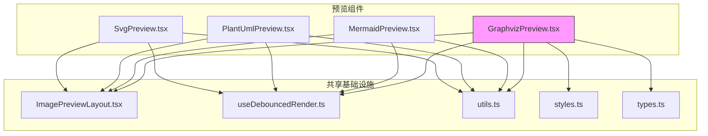
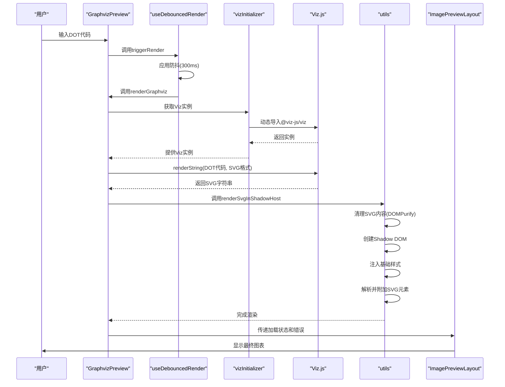
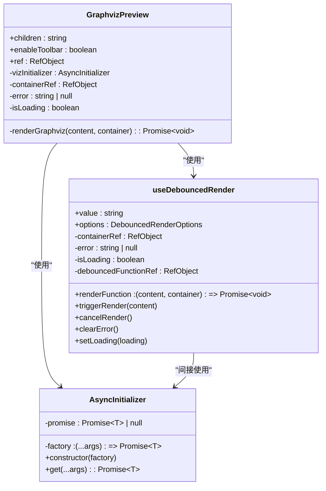
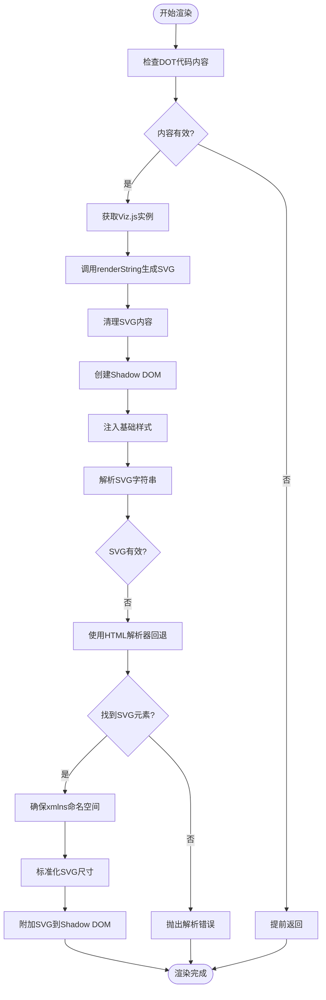

# Graphviz图表预览

<cite>
**本文档引用的文件**  
- [GraphvizPreview.tsx](file://src/renderer/src/components/Preview/GraphvizPreview.tsx)
- [ImagePreviewLayout.tsx](file://src/renderer/src/components/Preview/ImagePreviewLayout.tsx)
- [useDebouncedRender.ts](file://src/renderer/src/components/Preview/hooks/useDebouncedRender.ts)
- [utils.ts](file://src/renderer/src/components/Preview/utils.ts)
- [asyncInitializer.ts](file://src/renderer/src/utils/asyncInitializer.ts)
- [constants.ts](file://src/renderer/src/components/CodeBlockView/constants.ts)
</cite>

## 目录
1. [简介](#简介)
2. [项目结构](#项目结构)
3. [核心组件](#核心组件)
4. [架构概述](#架构概述)
5. [详细组件分析](#详细组件分析)
6. [依赖分析](#依赖分析)
7. [性能考虑](#性能考虑)
8. [故障排除指南](#故障排除指南)
9. [结论](#结论)

## 简介
本文档深入分析Cherry Studio中的Graphviz图表预览组件，涵盖其渲染引擎集成、DOT语言解析、图形布局算法以及交互式操作支持。文档详细说明了如何将Graphviz代码转换为可视化图形，并提供配置参数、布局类型选择和样式定制的代码示例。同时，记录了针对大型网络图和复杂层次结构图的性能优化策略，并探讨了扩展Graphviz功能和集成自定义布局算法的方法。

## 项目结构
Graphviz图表预览组件位于`src/renderer/src/components/Preview`目录下，是Cherry Studio中多个特殊视图预览组件之一。该组件与其他预览组件（如Mermaid、PlantUML）共享通用的渲染基础设施。



**图表来源**  
- [GraphvizPreview.tsx](file://src/renderer/src/components/Preview/GraphvizPreview.tsx)
- [ImagePreviewLayout.tsx](file://src/renderer/src/components/Preview/ImagePreviewLayout.tsx)
- [useDebouncedRender.ts](file://src/renderer/src/components/Preview/hooks/useDebouncedRender.ts)
- [utils.ts](file://src/renderer/src/components/Preview/utils.ts)

**章节来源**  
- [GraphvizPreview.tsx](file://src/renderer/src/components/Preview/GraphvizPreview.tsx)
- [ImagePreviewLayout.tsx](file://src/renderer/src/components/Preview/ImagePreviewLayout.tsx)

## 核心组件
Graphviz图表预览组件的核心功能包括：通过`@viz-js/viz`库解析DOT语言、使用防抖技术优化渲染体验、通过Shadow DOM实现样式隔离，以及提供交互式工具栏支持。

**章节来源**  
- [GraphvizPreview.tsx](file://src/renderer/src/components/Preview/GraphvizPreview.tsx)
- [useDebouncedRender.ts](file://src/renderer/src/components/Preview/hooks/useDebouncedRender.ts)
- [utils.ts](file://src/renderer/src/components/Preview/utils.ts)

## 架构概述
Graphviz图表预览组件采用分层架构，将渲染逻辑、状态管理和UI展示分离。组件通过异步初始化`viz.js`实例，使用防抖Hook管理渲染流程，并通过Shadow DOM确保样式封装。



**图表来源**  
- [GraphvizPreview.tsx](file://src/renderer/src/components/Preview/GraphvizPreview.tsx)
- [useDebouncedRender.ts](file://src/renderer/src/components/Preview/hooks/useDebouncedRender.ts)
- [asyncInitializer.ts](file://src/renderer/src/utils/asyncInitializer.ts)
- [utils.ts](file://src/renderer/src/components/Preview/utils.ts)
- [ImagePreviewLayout.tsx](file://src/renderer/src/components/Preview/ImagePreviewLayout.tsx)

## 详细组件分析

### GraphvizPreview组件分析
GraphvizPreview组件是整个预览功能的核心，负责协调DOT代码解析、SVG渲染和用户界面展示。

#### 组件结构


**图表来源**  
- [GraphvizPreview.tsx](file://src/renderer/src/components/Preview/GraphvizPreview.tsx)
- [asyncInitializer.ts](file://src/renderer/src/utils/asyncInitializer.ts)
- [useDebouncedRender.ts](file://src/renderer/src/components/Preview/hooks/useDebouncedRender.ts)

#### 渲染流程


**图表来源**  
- [GraphvizPreview.tsx](file://src/renderer/src/components/Preview/GraphvizPreview.tsx)
- [utils.ts](file://src/renderer/src/components/Preview/utils.ts)

## 依赖分析
Graphviz图表预览组件依赖于多个内部和外部库，形成了清晰的依赖关系链。

```mermaid
graph LR
GraphvizPreview --> useDebouncedRender
GraphvizPreview --> ImagePreviewLayout
GraphvizPreview --> utils
GraphvizPreview --> asyncInitializer
useDebouncedRender --> lodash
useDebouncedRender --> loggerService
utils --> DOMPurify
utils --> makeSvgSizeAdaptive
ImagePreviewLayout --> useImageTools
ImagePreviewLayout --> antd
ImagePreviewLayout --> styled-components
asyncInitializer --> @viz-js/viz
style GraphvizPreview fill:#f9f,stroke:#333
style @viz-js/viz fill:#ff0,stroke:#333
```

**图表来源**  
- [GraphvizPreview.tsx](file://src/renderer/src/components/Preview/GraphvizPreview.tsx)
- [useDebouncedRender.ts](file://src/renderer/src/components/Preview/hooks/useDebouncedRender.ts)
- [utils.ts](file://src/renderer/src/components/Preview/utils.ts)
- [asyncInitializer.ts](file://src/renderer/src/utils/asyncInitializer.ts)

## 性能考虑
Graphviz图表预览组件通过多种策略优化性能，特别是在处理大型网络图和复杂层次结构图时。

1. **防抖渲染**：使用`useDebouncedRender` Hook，设置300ms的防抖延迟，避免在用户快速输入时频繁触发昂贵的渲染操作。
2. **异步初始化**：`viz.js`库通过`AsyncInitializer`类实现按需加载，避免在组件初始化时阻塞主线程。
3. **Shadow DOM封装**：使用Shadow DOM渲染SVG，确保图表样式与应用其他部分隔离，防止样式冲突导致的重排重绘。
4. **资源清理**：在组件卸载时取消所有待处理的渲染任务，防止内存泄漏。

**章节来源**  
- [GraphvizPreview.tsx](file://src/renderer/src/components/Preview/GraphvizPreview.tsx)
- [useDebouncedRender.ts](file://src/renderer/src/components/Preview/hooks/useDebouncedRender.ts)

## 故障排除指南
当Graphviz图表预览出现问题时，可以参考以下常见问题和解决方案：

1. **图表不显示**：检查DOT代码语法是否正确，确保没有语法错误。
2. **渲染缓慢**：对于大型图表，考虑增加防抖延迟时间或优化DOT代码结构。
3. **样式冲突**：由于使用Shadow DOM，外部样式不应影响图表。如果出现问题，检查Shadow DOM的样式注入是否正常。
4. **网络问题**：`viz.js`库是本地集成的，不依赖外部网络请求，因此不会出现网络连接问题。

**章节来源**  
- [GraphvizPreview.tsx](file://src/renderer/src/components/Preview/GraphvizPreview.tsx)
- [useDebouncedRender.ts](file://src/renderer/src/components/Preview/hooks/useDebouncedRender.ts)
- [utils.ts](file://src/renderer/src/components/Preview/utils.ts)

## 结论
Cherry Studio的Graphviz图表预览组件通过精心设计的架构和优化策略，提供了高效、稳定且可交互的图表预览功能。组件利用现代前端技术如Shadow DOM和React Hooks，实现了良好的性能和用户体验。通过防抖渲染、异步初始化和样式隔离等技术，组件能够有效处理复杂的DOT代码并生成高质量的SVG图形。该设计模式也可为其他类型的图表预览组件提供参考。