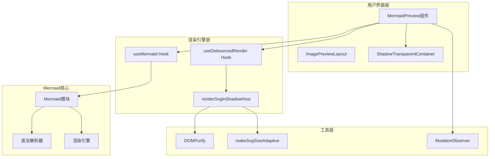
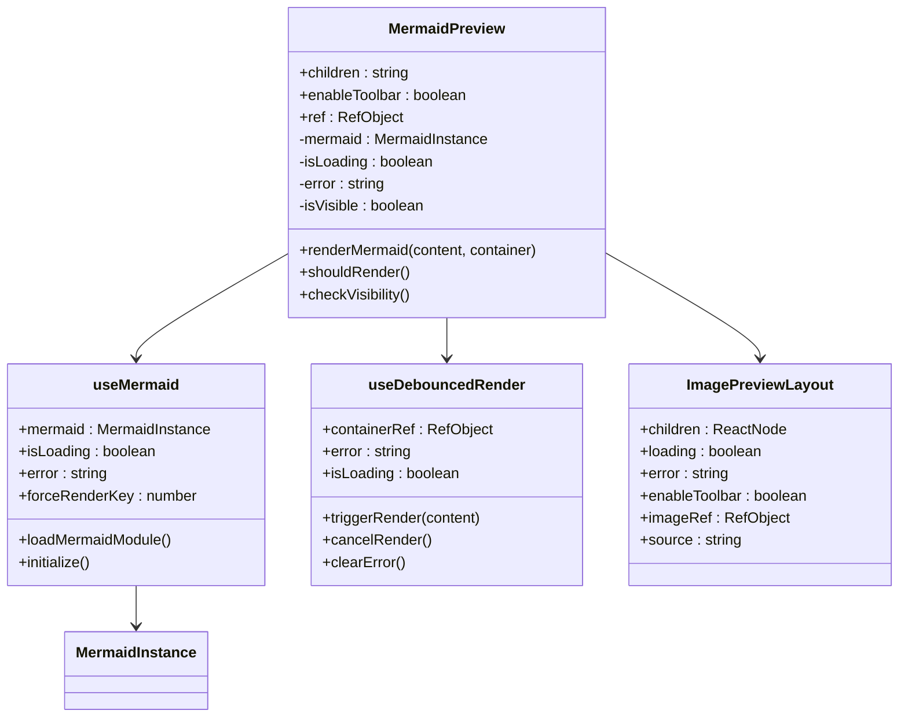
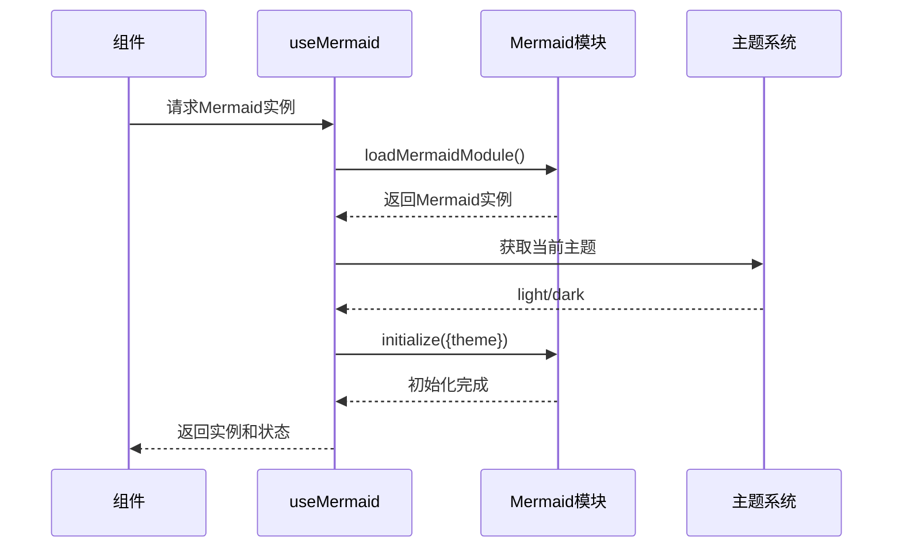
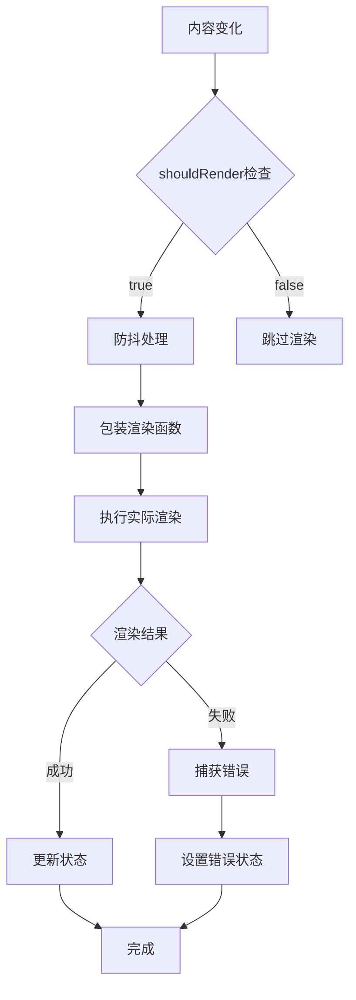
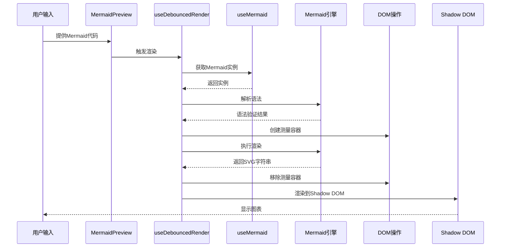
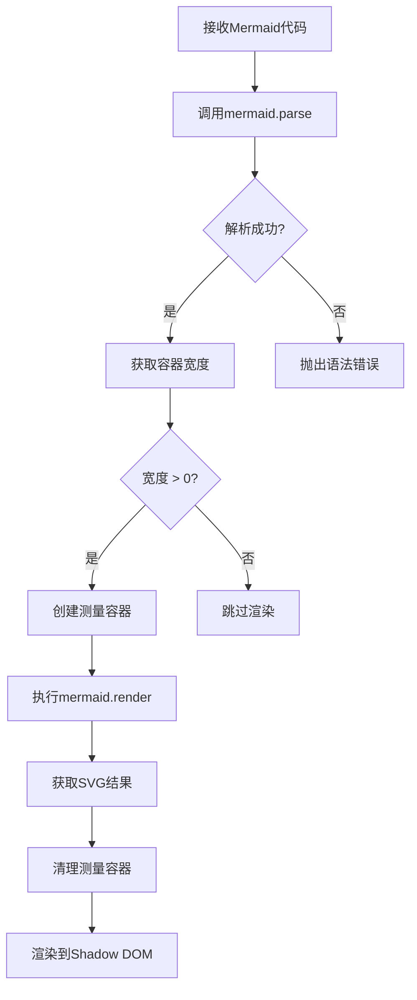
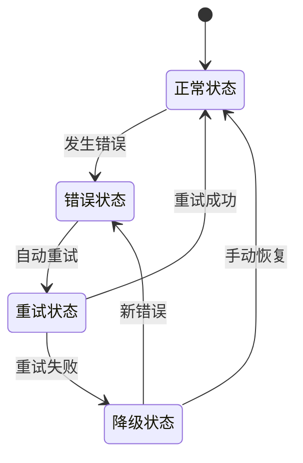
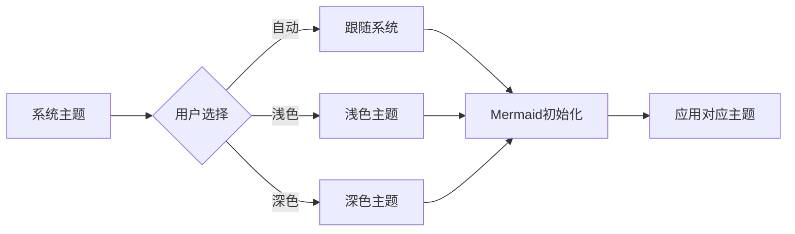
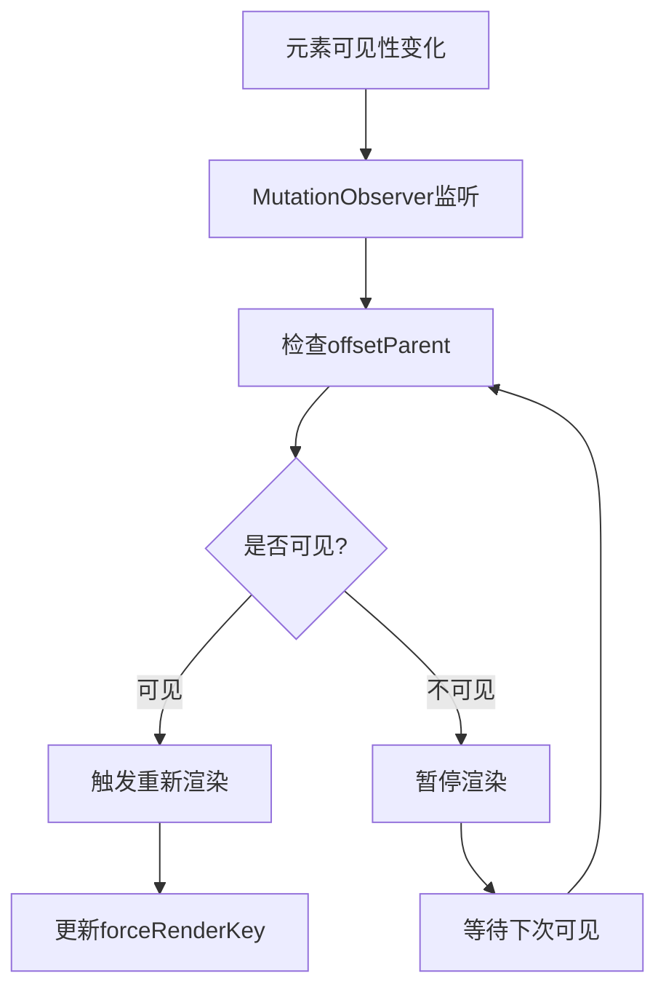
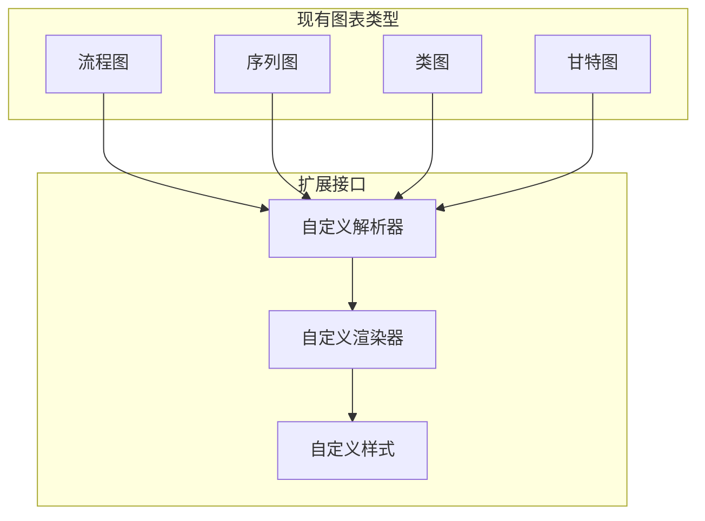

# Cherry Studio Mermaid图表预览组件技术文档

<cite>
**本文档中引用的文件**
- [MermaidPreview.tsx](file://src/renderer/src/components/Preview/MermaidPreview.tsx)
- [useMermaid.ts](file://src/renderer/src/hooks/useMermaid.ts)
- [useDebouncedRender.ts](file://src/renderer/src/components/Preview/hooks/useDebouncedRender.ts)
- [ImagePreviewLayout.tsx](file://src/renderer/src/components/Preview/ImagePreviewLayout.tsx)
- [utils.ts](file://src/renderer/src/components/Preview/utils.ts)
- [styles.ts](file://src/renderer/src/components/Preview/styles.ts)
- [MermaidPreview.test.tsx](file://src/renderer/src/components/Preview/__tests__/MermaidPreview.test.tsx)
- [utils.test.ts](file://src/renderer/src/components/Preview/__tests__/utils.test.ts)
- [package.json](file://package.json)
</cite>

## 目录
1. [概述](#概述)
2. [架构设计](#架构设计)
3. [核心组件分析](#核心组件分析)
4. [渲染流程详解](#渲染流程详解)
5. [语法解析与验证](#语法解析与验证)
6. [错误处理机制](#错误处理机制)
7. [主题与样式定制](#主题与样式定制)
8. [性能优化策略](#性能优化策略)
9. [扩展功能与集成](#扩展功能与集成)
10. [最佳实践指南](#最佳实践指南)

## 概述

Cherry Studio的Mermaid图表预览组件是一个高度优化的React组件，专门用于实时渲染和显示Mermaid图表。该组件采用现代前端架构设计，集成了防抖渲染、阴影DOM隔离、主题适配等先进特性，为用户提供流畅的图表预览体验。

### 主要特性

- **实时预览**：基于防抖机制的智能渲染
- **主题适配**：自动跟随系统或用户主题
- **阴影DOM隔离**：确保样式安全性和性能
- **错误恢复**：完善的错误处理和重试机制
- **响应式设计**：支持各种屏幕尺寸和布局

## 架构设计

### 整体架构图



**架构图来源**
- [MermaidPreview.tsx](file://src/renderer/src/components/Preview/MermaidPreview.tsx#L16-L138)
- [useDebouncedRender.ts](file://src/renderer/src/components/Preview/hooks/useDebouncedRender.ts#L51-L168)
- [useMermaid.ts](file://src/renderer/src/hooks/useMermaid.ts#L31-L78)

### 组件层次结构



**类图来源**
- [MermaidPreview.tsx](file://src/renderer/src/components/Preview/MermaidPreview.tsx#L16-L138)
- [useMermaid.ts](file://src/renderer/src/hooks/useMermaid.ts#L31-L78)
- [useDebouncedRender.ts](file://src/renderer/src/components/Preview/hooks/useDebouncedRender.ts#L51-L168)

## 核心组件分析

### MermaidPreview组件

MermaidPreview是整个图表预览系统的核心组件，负责协调各个子系统的协作。

#### 主要职责

1. **渲染协调**：管理Mermaid图表的渲染生命周期
2. **状态管理**：处理加载、错误和可见性状态
3. **性能优化**：通过防抖机制和可见性检测优化性能
4. **错误处理**：提供优雅的错误降级机制

#### 关键实现细节

- **防抖渲染**：使用300ms的防抖延迟避免频繁重绘
- **可见性检测**：监听元素可见性变化以触发重新渲染
- **阴影DOM**：确保SVG渲染的样式隔离
- **主题适配**：自动跟随系统或用户主题设置

**节来源**
- [MermaidPreview.tsx](file://src/renderer/src/components/Preview/MermaidPreview.tsx#L16-L138)

### useMermaid Hook

useMermaid Hook负责Mermaid库的初始化和管理，提供全局可用的Mermaid实例。

#### 初始化流程



**序列图来源**
- [useMermaid.ts](file://src/renderer/src/hooks/useMermaid.ts#L38-L71)

#### 单例模式实现

组件采用单例模式管理Mermaid模块，避免重复加载和内存浪费：

- **模块缓存**：首次加载后缓存Mermaid实例
- **懒加载**：按需导入，减少初始包体积
- **错误恢复**：加载失败时提供重试机制

**节来源**
- [useMermaid.ts](file://src/renderer/src/hooks/useMermaid.ts#L12-L30)

### useDebouncedRender Hook

useDebouncedRender Hook提供了智能的渲染控制机制，是性能优化的关键。

#### 防抖机制

- **默认延迟**：300ms的防抖间隔
- **手动触发**：支持外部手动触发渲染
- **取消机制**：可随时取消正在进行的渲染
- **状态管理**：完整的加载和错误状态跟踪

#### 渲染控制



**流程图来源**
- [useDebouncedRender.ts](file://src/renderer/src/components/Preview/hooks/useDebouncedRender.ts#L64-L90)

**节来源**
- [useDebouncedRender.ts](file://src/renderer/src/components/Preview/hooks/useDebouncedRender.ts#L51-L168)

## 渲染流程详解

### 完整渲染流程

Mermaid图表的渲染涉及多个步骤，每个步骤都有特定的职责和优化策略。



**序列图来源**
- [MermaidPreview.tsx](file://src/renderer/src/components/Preview/MermaidPreview.tsx#L29-L57)
- [useDebouncedRender.ts](file://src/renderer/src/components/Preview/hooks/useDebouncedRender.ts#L64-L90)

### 防抖渲染机制

防抖机制是性能优化的核心，通过以下方式提升用户体验：

1. **延迟处理**：300ms的延迟避免频繁重绘
2. **智能判断**：结合可见性状态进行渲染决策
3. **状态同步**：确保UI状态与渲染状态一致

### 阴影DOM渲染

阴影DOM渲染提供了多重优势：

- **样式隔离**：防止样式污染和冲突
- **性能优化**：减少全局样式计算
- **安全性**：增强SVG内容的安全性

**节来源**
- [MermaidPreview.tsx](file://src/renderer/src/components/Preview/MermaidPreview.tsx#L29-L57)
- [utils.ts](file://src/renderer/src/components/Preview/utils.ts#L13-L94)

## 语法解析与验证

### 语法验证流程

Mermaid图表的语法验证在渲染前进行，确保图表的正确性。



**流程图来源**
- [MermaidPreview.tsx](file://src/renderer/src/components/Preview/MermaidPreview.tsx#L30-L57)

### 错误处理策略

组件实现了多层次的错误处理机制：

1. **语法错误**：解析阶段捕获语法问题
2. **渲染错误**：渲染过程中的异常处理
3. **运行时错误**：运行时的意外情况处理
4. **降级机制**：错误时的备用方案

**节来源**
- [MermaidPreview.tsx](file://src/renderer/src/components/Preview/MermaidPreview.tsx#L30-L57)
- [useDebouncedRender.ts](file://src/renderer/src/components/Preview/hooks/useDebouncedRender.ts#L83-L87)

## 错误处理机制

### 多层错误处理

组件实现了完整的错误处理体系，确保即使出现错误也能提供良好的用户体验。

#### 错误类型分类

| 错误类型 | 处理策略 | 用户反馈 |
|---------|---------|---------|
| 语法错误 | 立即显示 | 显示具体错误信息 |
| 加载错误 | 重试机制 | 显示加载失败提示 |
| 渲染错误 | 降级处理 | 显示原始文本 |
| 运行时错误 | 异常捕获 | 记录日志并继续 |

#### 错误恢复机制



**状态图来源**
- [useDebouncedRender.ts](file://src/renderer/src/components/Preview/hooks/useDebouncedRender.ts#L83-L87)

**节来源**
- [MermaidPreview.tsx](file://src/renderer/src/components/Preview/MermaidPreview.tsx#L121-L123)
- [useDebouncedRender.ts](file://src/renderer/src/components/Preview/hooks/useDebouncedRender.ts#L83-L87)

## 主题与样式定制

### 主题适配机制

MermaidPreview组件完全支持Cherry Studio的主题系统，能够自动适配浅色和深色主题。

#### 主题配置



**流程图来源**
- [useMermaid.ts](file://src/renderer/src/hooks/useMermaid.ts#L50-L52)

#### 样式定制

组件提供了丰富的样式定制选项：

- **背景颜色**：支持透明和半透明背景
- **边框样式**：可配置的边框和圆角
- **内边距**：灵活的内边距设置
- **阴影效果**：可选的阴影和投影

**节来源**
- [useMermaid.ts](file://src/renderer/src/hooks/useMermaid.ts#L50-L52)
- [styles.ts](file://src/renderer/src/components/Preview/styles.ts#L37-L47)

## 性能优化策略

### 渲染性能优化

#### 防抖渲染

防抖机制是性能优化的核心策略：

- **延迟阈值**：300ms的合理延迟平衡响应性和性能
- **智能判断**：结合可见性状态避免不必要的渲染
- **批量处理**：将多个变更合并为一次渲染

#### 可见性检测



**流程图来源**
- [MermaidPreview.tsx](file://src/renderer/src/components/Preview/MermaidPreview.tsx#L84-L118)

#### 内存管理

- **组件卸载**：及时清理观察器和定时器
- **引用管理**：避免循环引用导致的内存泄漏
- **资源释放**：主动释放不再需要的资源

### 复杂图表优化

对于复杂的流程图和大型序列图，组件采用了特殊的优化策略：

1. **分步渲染**：将大型图表分解为多个部分
2. **懒加载**：按需加载图表的不同部分
3. **缓存机制**：缓存渲染结果避免重复计算

**节来源**
- [MermaidPreview.tsx](file://src/renderer/src/components/Preview/MermaidPreview.tsx#L84-L118)
- [useDebouncedRender.ts](file://src/renderer/src/components/Preview/hooks/useDebouncedRender.ts#L95-L106)

## 扩展功能与集成

### 自定义图表类型

虽然主要支持标准的Mermaid图表类型，但组件架构为扩展新图表类型提供了良好的基础。

#### 扩展点识别



### 第三方集成

#### 工具栏集成

组件支持与Cherry Studio的工具栏系统无缝集成：

- **缩放功能**：支持鼠标滚轮和手势缩放
- **平移功能**：拖拽平移图表视图
- **下载功能**：支持PNG和SVG格式导出
- **复制功能**：一键复制图表内容

#### 事件绑定

组件提供了完整的事件绑定机制：

- **点击事件**：支持图表元素的点击交互
- **悬停事件**：提供悬停提示和状态显示
- **键盘事件**：支持键盘导航和快捷操作

**节来源**
- [ImagePreviewLayout.tsx](file://src/renderer/src/components/Preview/ImagePreviewLayout.tsx#L31-L47)

## 最佳实践指南

### 开发建议

#### 性能考虑

1. **合理使用防抖**：根据内容变化频率调整防抖延迟
2. **避免频繁重渲染**：通过shouldRender函数控制渲染时机
3. **监控内存使用**：定期检查组件的内存占用情况

#### 错误处理

1. **优雅降级**：提供清晰的错误提示和恢复建议
2. **用户友好**：避免显示技术性的错误信息
3. **日志记录**：记录详细的错误信息便于调试

#### 主题适配

1. **测试覆盖**：确保在所有主题下都能正常工作
2. **色彩对比**：保证图表内容的可读性
3. **响应式设计**：适应不同屏幕尺寸和分辨率

### 使用示例

#### 基本用法

```typescript
// 基础图表预览
<MermaidPreview>
  graph TD
  A[开始] --> B[处理]
  B --> C[结束]
</MermaidPreview>
```

#### 高级配置

```typescript
// 启用工具栏和自定义配置
<MermaidPreview enableToolbar>
  sequenceDiagram
  participant User
  participant System
  User->>System: 请求
  System-->>User: 响应
</MermaidPreview>
```

#### 错误处理

```typescript
// 错误边界包装
<ErrorBoundary>
  <MermaidPreview>
    {mermaidCode}
  </MermaidPreview>
</ErrorBoundary>
```

**节来源**
- [MermaidPreview.tsx](file://src/renderer/src/components/Preview/MermaidPreview.tsx#L16-L138)
- [MermaidPreview.test.tsx](file://src/renderer/src/components/Preview/__tests__/MermaidPreview.test.tsx#L88-L104)

## 总结

Cherry Studio的Mermaid图表预览组件是一个功能完整、性能优异的现代化React组件。它通过精心设计的架构和优化策略，为用户提供了流畅、可靠的图表预览体验。

### 核心优势

1. **高性能渲染**：防抖机制和可见性检测确保最佳性能
2. **主题适配**：完全支持Cherry Studio的主题系统
3. **错误恢复**：完善的错误处理和降级机制
4. **样式隔离**：阴影DOM提供安全的样式环境
5. **易于扩展**：清晰的架构为功能扩展奠定基础

### 技术亮点

- **单例模式**：高效的Mermaid模块管理
- **防抖渲染**：智能的渲染控制机制
- **阴影DOM**：安全的SVG渲染环境
- **MutationObserver**：精确的可见性检测
- **错误边界**：完整的错误处理体系

该组件不仅满足了当前的功能需求，还为未来的功能扩展和技术升级预留了充足的空间，是Cherry Studio中图表预览功能的重要基础设施。