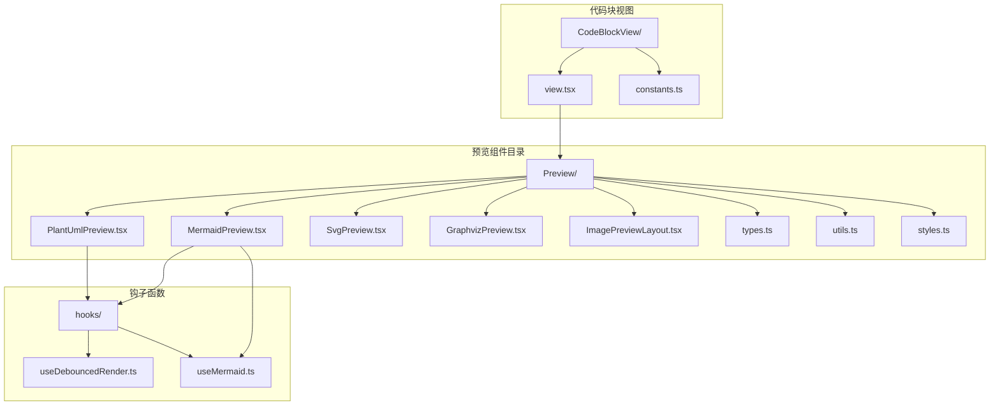
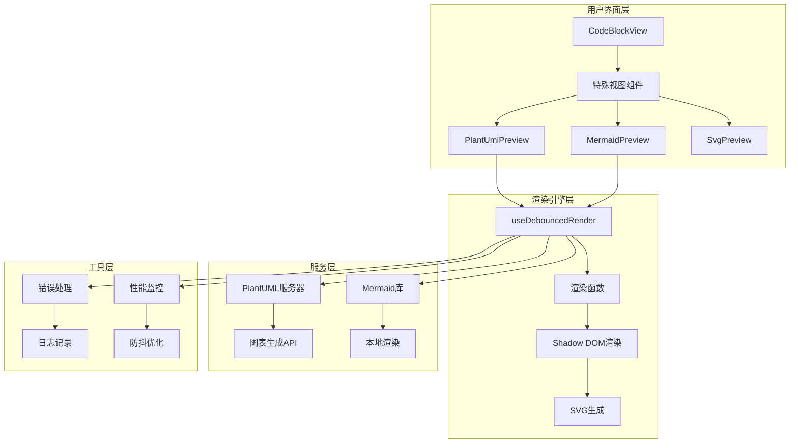
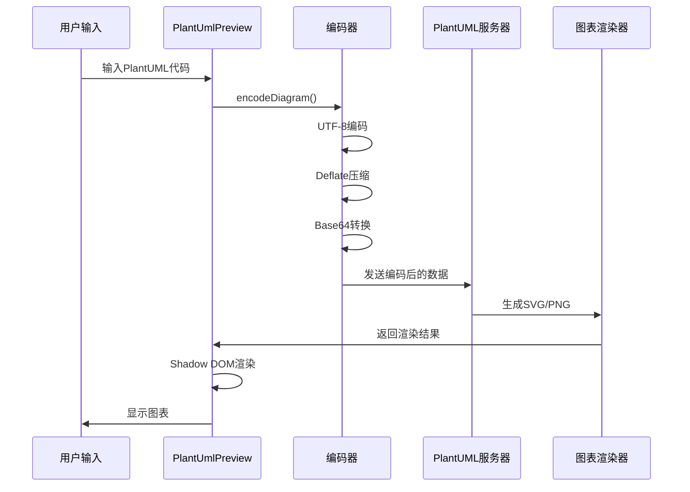
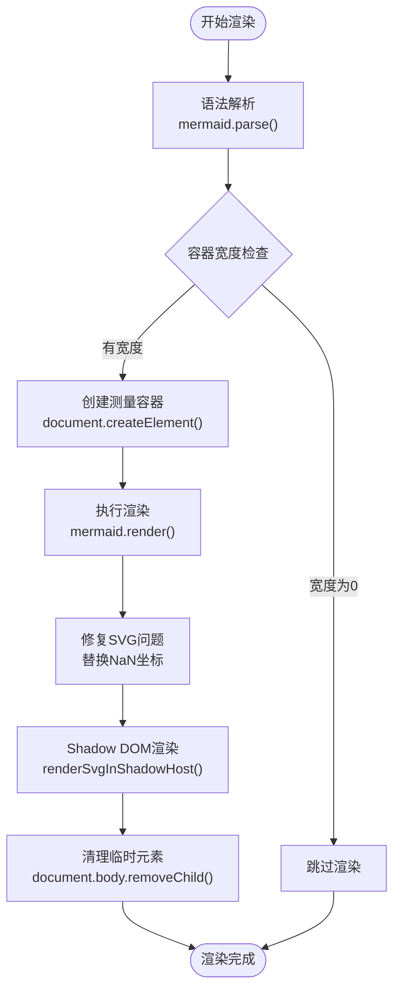
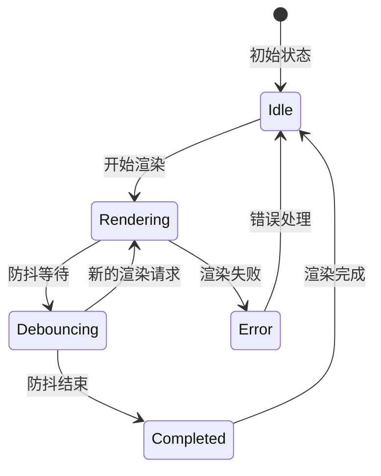
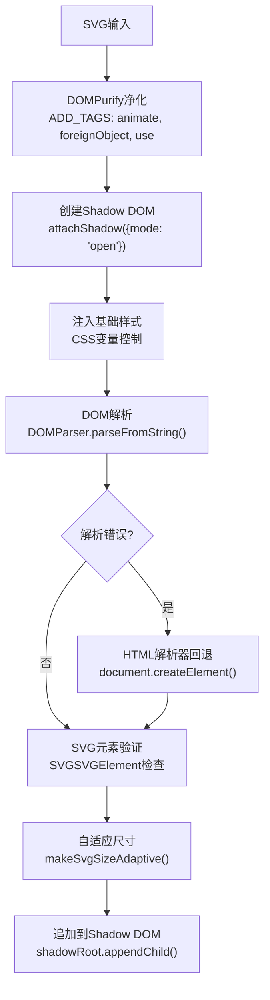
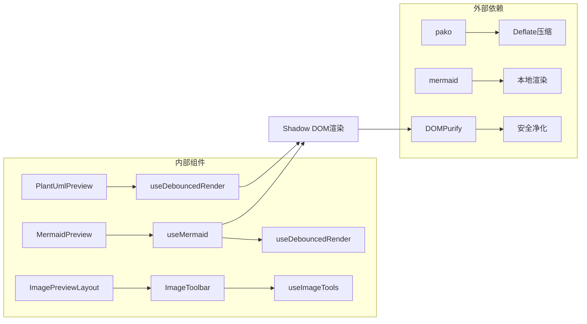

# PlantUML图表预览组件详细文档

<cite>
**本文档中引用的文件**
- [PlantUmlPreview.tsx](file://src/renderer/src/components/Preview/PlantUmlPreview.tsx)
- [MermaidPreview.tsx](file://src/renderer/src/components/Preview/MermaidPreview.tsx)
- [useMermaid.ts](file://src/renderer/src/hooks/useMermaid.ts)
- [useDebouncedRender.ts](file://src/renderer/src/components/Preview/hooks/useDebouncedRender.ts)
- [utils.ts](file://src/renderer/src/components/Preview/utils.ts)
- [ImagePreviewLayout.tsx](file://src/renderer/src/components/Preview/ImagePreviewLayout.tsx)
- [styles.ts](file://src/renderer/src/components/Preview/styles.ts)
- [types.ts](file://src/renderer/src/components/Preview/types.ts)
- [SvgPreview.tsx](file://src/renderer/src/components/Preview/SvgPreview.tsx)
- [constants.ts](file://src/renderer/src/components/CodeBlockView/constants.ts)
- [view.tsx](file://src/renderer/src/components/CodeBlockView/view.tsx)
- [PlantUmlPreview.test.tsx](file://src/renderer/src/components/Preview/__tests__/PlantUmlPreview.test.tsx)
- [MermaidPreview.test.tsx](file://src/renderer/src/components/Preview/__tests__/MermaidPreview.test.tsx)
</cite>

## 目录
1. [简介](#简介)
2. [项目结构](#项目结构)
3. [核心组件](#核心组件)
4. [架构概览](#架构概览)
5. [详细组件分析](#详细组件分析)
6. [依赖关系分析](#依赖关系分析)
7. [性能优化策略](#性能优化策略)
8. [故障排除指南](#故障排除指南)
9. [结论](#结论)

## 简介

Cherry Studio的PlantUML图表预览组件是一个强大的实时UML图表渲染系统，支持将PlantUML代码转换为各种类型的UML图表（如序列图、用例图、类图等）。该组件提供了完整的图表预览功能，包括语法验证、实时渲染、错误处理和交互式工具栏。

## 项目结构

PlantUML预览组件在Cherry Studio中的组织结构如下：



**图表来源**
- [PlantUmlPreview.tsx](file://src/renderer/src/components/Preview/PlantUmlPreview.tsx#L1-L137)
- [MermaidPreview.tsx](file://src/renderer/src/components/Preview/MermaidPreview.tsx#L1-L138)
- [useDebouncedRender.ts](file://src/renderer/src/components/Preview/hooks/useDebouncedRender.ts#L1-L168)

**章节来源**
- [constants.ts](file://src/renderer/src/components/CodeBlockView/constants.ts#L1-L17)
- [view.tsx](file://src/renderer/src/components/CodeBlockView/view.tsx#L1-L402)

## 核心组件

### PlantUML预览组件架构

PlantUML预览组件采用模块化设计，主要包含以下核心模块：

1. **编码器模块**：负责将PlantUML代码进行UTF-8编码、Deflate压缩和Base64转换
2. **渲染引擎**：通过PlantUML服务器生成SVG或PNG格式的图表
3. **防抖渲染器**：优化渲染性能，避免频繁的重新渲染
4. **阴影DOM渲染**：确保样式隔离和安全渲染
5. **错误处理机制**：提供详细的错误信息和用户友好的提示

### Mermaid预览组件架构

Mermaid预览组件专注于本地渲染，具有以下特点：

1. **语法验证**：实时验证Mermaid语法正确性
2. **动态测量**：根据容器尺寸动态调整图表大小
3. **主题适配**：支持深色和浅色主题切换
4. **可见性检测**：优化渲染性能，只在可见时渲染

**章节来源**
- [PlantUmlPreview.tsx](file://src/renderer/src/components/Preview/PlantUmlPreview.tsx#L62-L81)
- [MermaidPreview.tsx](file://src/renderer/src/components/Preview/MermaidPreview.tsx#L25-L60)

## 架构概览

PlantUML预览系统的整体架构采用分层设计：



**图表来源**
- [view.tsx](file://src/renderer/src/components/CodeBlockView/view.tsx#L272-L283)
- [PlantUmlPreview.tsx](file://src/renderer/src/components/Preview/PlantUmlPreview.tsx#L89-L108)
- [MermaidPreview.tsx](file://src/renderer/src/components/Preview/MermaidPreview.tsx#L29-L60)

## 详细组件分析

### PlantUML预览组件详细分析

#### 编码和传输流程

PlantUML预览组件实现了完整的PlantUML编码规范，支持将文本描述转换为可渲染的图表：



**图表来源**
- [PlantUmlPreview.tsx](file://src/renderer/src/components/Preview/PlantUmlPreview.tsx#L69-L81)
- [utils.ts](file://src/renderer/src/components/Preview/utils.ts#L13-L94)

#### 错误处理机制

组件提供了多层次的错误处理机制：

| 错误类型 | HTTP状态码 | 处理方式 | 用户提示 |
|---------|-----------|---------|---------|
| 网络连接失败 | - | 网络错误日志记录 | "请检查网络连接" |
| 语法错误 | 400 | 语法验证提示 | "图表渲染失败，请检查语法" |
| 服务器错误 | 500+ | 服务器状态检查 | "PlantUML服务器暂时不可用" |
| 其他错误 | 其他 | 通用错误处理 | "图表渲染失败，请稍后重试" |

**章节来源**
- [PlantUmlPreview.tsx](file://src/renderer/src/components/Preview/PlantUmlPreview.tsx#L93-L103)
- [PlantUmlPreview.test.tsx](file://src/renderer/src/components/Preview/__tests__/PlantUmlPreview.test.tsx#L105-L154)

### Mermaid预览组件详细分析

#### 动态渲染流程

Mermaid组件采用智能渲染策略，优化性能和用户体验：



**图表来源**
- [MermaidPreview.tsx](file://src/renderer/src/components/Preview/MermaidPreview.tsx#L30-L57)

#### 主题和样式系统

Mermaid组件支持动态主题切换：

| 主题模式 | 配置项 | 值 | 效果 |
|---------|-------|---|------|
| 浅色主题 | theme | 'default' | 使用默认浅色主题 |
| 深色主题 | theme | 'dark' | 使用深色主题 |
| 自动检测 | - | 基于系统主题 | 动态切换主题 |

**章节来源**
- [useMermaid.ts](file://src/renderer/src/hooks/useMermaid.ts#L50-L54)

### 防抖渲染器组件

#### 性能优化机制

防抖渲染器是整个预览系统的核心性能优化组件：



**图表来源**
- [useDebouncedRender.ts](file://src/renderer/src/components/Preview/hooks/useDebouncedRender.ts#L51-L168)

#### 配置选项

| 选项名称 | 类型 | 默认值 | 描述 |
|---------|------|-------|------|
| debounceDelay | number | 300 | 防抖延迟时间（毫秒） |
| shouldRender | () => boolean | undefined | 渲染前的条件检查函数 |

**章节来源**
- [useDebouncedRender.ts](file://src/renderer/src/components/Preview/hooks/useDebouncedRender.ts#L10-L15)

### SVG渲染工具

#### 安全渲染机制

SVG渲染工具实现了多层安全防护：



**图表来源**
- [utils.ts](file://src/renderer/src/components/Preview/utils.ts#L13-L94)

**章节来源**
- [utils.ts](file://src/renderer/src/components/Preview/utils.ts#L18-L23)
- [utils.ts](file://src/renderer/src/components/Preview/utils.ts#L56-L94)

## 依赖关系分析

### 组件间依赖关系



**图表来源**
- [PlantUmlPreview.tsx](file://src/renderer/src/components/Preview/PlantUmlPreview.tsx#L1-L10)
- [MermaidPreview.tsx](file://src/renderer/src/components/Preview/MermaidPreview.tsx#L1-L10)

### 数据流分析

预览组件的数据流向遵循单向数据流原则：

1. **输入层**：用户输入的PlantUML/Mermaid代码
2. **处理层**：编码、验证、渲染准备
3. **渲染层**：调用外部服务或本地库进行渲染
4. **输出层**：生成的SVG图表和交互工具

**章节来源**
- [types.ts](file://src/renderer/src/components/Preview/types.ts#L1-L18)

## 性能优化策略

### 渲染性能优化

#### 防抖机制

所有预览组件都采用防抖机制来优化性能：

- **默认延迟**：300毫秒
- **智能取消**：新的渲染请求会自动取消之前的渲染任务
- **内存管理**：及时清理防抖函数引用

#### 条件渲染

Mermaid组件实现了可见性检测：

```typescript
const shouldRender = useCallback(() => {
  return !isLoadingMermaid && isVisible
}, [isLoadingMermaid, isVisible])
```

#### 内存优化

- **组件缓存**：使用React.memo防止不必要的重渲染
- **事件清理**：在组件卸载时清理定时器和事件监听器
- **资源释放**：及时释放临时DOM元素

### 网络性能优化

#### PlantUML服务器优化

- **连接复用**：使用HTTP/2或连接池
- **错误重试**：实现指数退避算法
- **超时控制**：设置合理的请求超时时间

#### 缓存策略

- **编码缓存**：对相同的PlantUML代码进行缓存
- **渲染缓存**：避免重复渲染相同的图表

**章节来源**
- [useDebouncedRender.ts](file://src/renderer/src/components/Preview/hooks/useDebouncedRender.ts#L95-L106)
- [MermaidPreview.tsx](file://src/renderer/src/components/Preview/MermaidPreview.tsx#L63-L67)

## 故障排除指南

### 常见问题及解决方案

#### PlantUML相关问题

| 问题描述 | 可能原因 | 解决方案 |
|---------|---------|---------|
| 图表渲染失败 | 语法错误 | 检查PlantUML语法，参考官方文档 |
| 网络连接失败 | 服务器不可达 | 检查网络连接，尝试其他服务器 |
| 图表显示异常 | 编码问题 | 确保使用UTF-8编码 |
| 性能缓慢 | 图表过于复杂 | 优化PlantUML代码，减少节点数量 |

#### Mermaid相关问题

| 问题描述 | 可能原因 | 解决方案 |
|---------|---------|---------|
| 语法解析失败 | Mermaid语法错误 | 检查Mermaid语法，参考官方文档 |
| 主题不生效 | 初始化配置错误 | 检查useMermaid的初始化参数 |
| 渲染空白 | 容器尺寸问题 | 确保容器有有效的宽度和高度 |
| 性能问题 | 图表过大 | 优化Mermaid代码，使用分组和子图 |

### 调试技巧

#### 日志记录

组件提供了详细的日志记录功能：

```typescript
const logger = loggerService.withContext('PlantUmlPreview')
logger.warn('Network Error: Unable to connect to PlantUML server.')
```

#### 开发者工具

- **浏览器开发者工具**：检查网络请求和响应
- **React开发者工具**：调试组件状态和属性
- **性能面板**：分析渲染性能瓶颈

**章节来源**
- [PlantUmlPreview.tsx](file://src/renderer/src/components/Preview/PlantUmlPreview.tsx#L115-L122)
- [PlantUmlPreview.test.tsx](file://src/renderer/src/components/Preview/__tests__/PlantUmlPreview.test.tsx#L105-L154)

## 结论

Cherry Studio的PlantUML图表预览组件是一个功能完整、性能优化的现代化UML图表渲染系统。它通过模块化设计、智能缓存、防抖优化和安全渲染等技术手段，为用户提供了流畅的图表预览体验。

### 主要优势

1. **多格式支持**：支持PlantUML、Mermaid、SVG等多种图表格式
2. **实时预览**：提供即时的语法验证和渲染反馈
3. **性能优化**：采用防抖、缓存和条件渲染等优化策略
4. **安全可靠**：实现了多层安全防护机制
5. **易于扩展**：模块化设计便于功能扩展和定制

### 技术特色

- **Shadow DOM渲染**：确保样式隔离和安全渲染
- **智能错误处理**：提供详细的错误信息和用户指导
- **主题适配**：支持深色和浅色主题切换
- **交互工具**：提供缩放、复制、下载等实用功能

该组件为Cherry Studio的文档编写和系统设计提供了强大的可视化支持，是现代开发工具中不可或缺的重要组成部分。