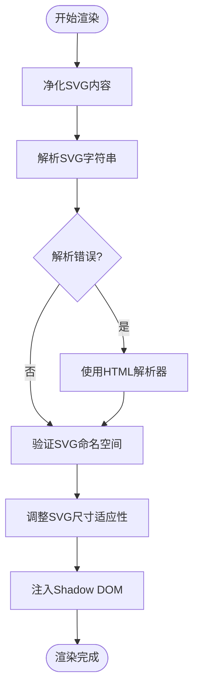
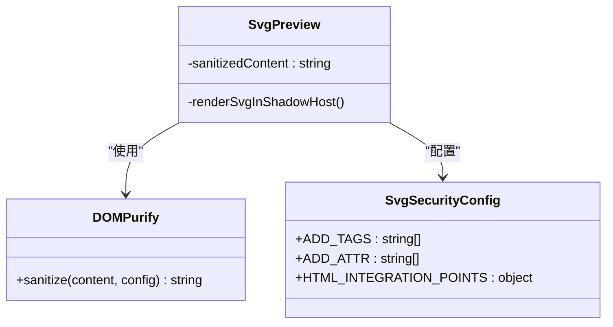
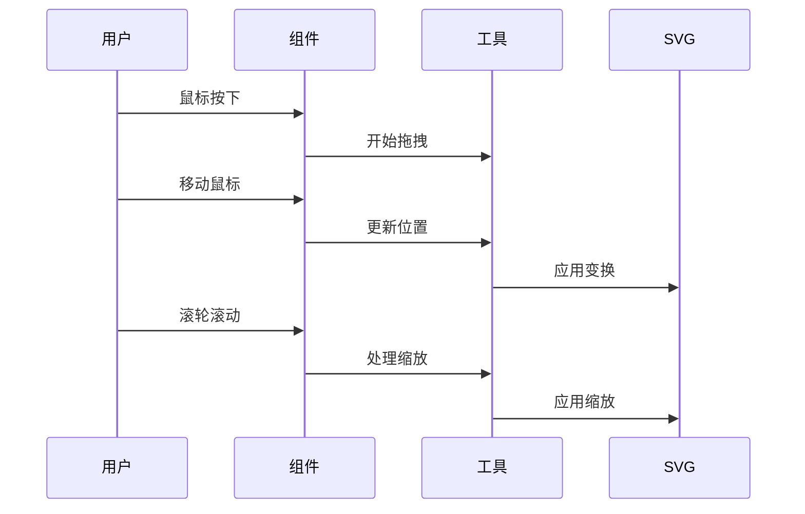
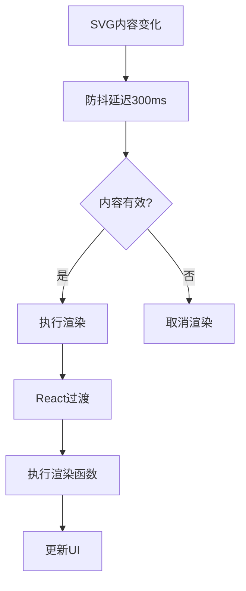
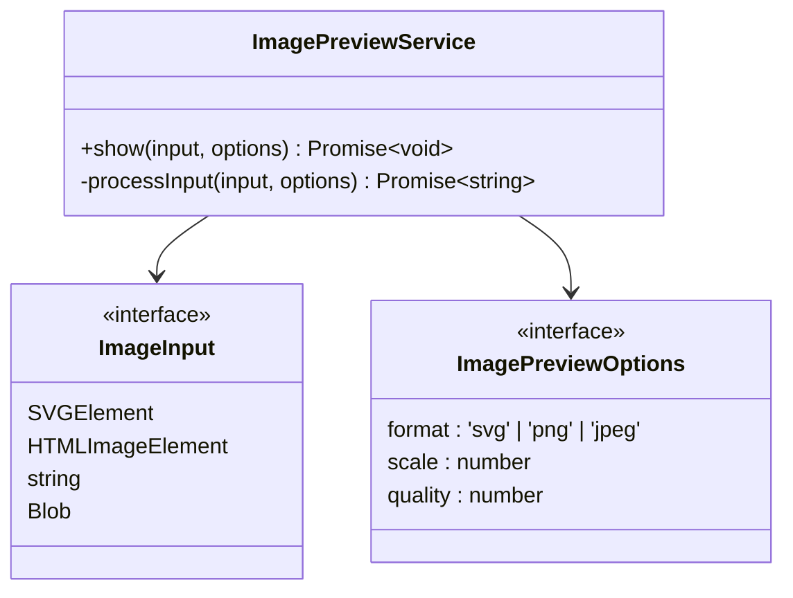

# SVG预览组件

<cite>
**本文档引用的文件**
- [SvgPreview.tsx](file://src/renderer/src/components/Preview/SvgPreview.tsx)
- [useDebouncedRender.ts](file://src/renderer/src/components/Preview/hooks/useDebouncedRender.ts)
- [utils.ts](file://src/renderer/src/components/Preview/utils.ts)
- [styles.ts](file://src/renderer/src/components/Preview/styles.ts)
- [ImagePreviewLayout.tsx](file://src/renderer/src/components/Preview/ImagePreviewLayout.tsx)
- [ImagePreviewService.ts](file://src/renderer/src/services/ImagePreviewService.ts)
- [image.ts](file://src/renderer/src/utils/image.ts)
</cite>

## 目录
1. [简介](#简介)
2. [核心组件](#核心组件)
3. [渲染机制](#渲染机制)
4. [安全防护](#安全防护)
5. [交互功能](#交互功能)
6. [性能优化](#性能优化)
7. [扩展功能](#扩展功能)
8. [API参考](#api参考)
9. [最佳实践](#最佳实践)

## 简介
SVG预览组件是Cherry Studio中用于安全渲染和展示SVG内容的核心功能模块。该组件通过Shadow DOM技术实现样式隔离，确保用户提供的SVG内容不会影响应用的整体样式。组件支持缩放、平移等交互操作，并通过防抖渲染机制优化复杂SVG的性能表现。本技术文档将深入分析组件的实现原理、安全机制和性能优化策略。

## 核心组件

SVG预览组件由多个协同工作的模块组成，包括主预览组件、渲染工具、安全净化和性能优化钩子。这些组件共同实现了安全、高效且可交互的SVG预览功能。

**Section sources**
- [SvgPreview.tsx](file://src/renderer/src/components/Preview/SvgPreview.tsx#L1-L45)
- [ImagePreviewLayout.tsx](file://src/renderer/src/components/Preview/ImagePreviewLayout.tsx#L1-L61)

## 渲染机制

SVG预览组件采用Shadow DOM技术进行渲染，确保SVG内容的样式与宿主应用完全隔离。渲染流程包括内容解析、样式封装和DOM注入三个主要阶段。

**Diagram sources**
- [utils.ts](file://src/renderer/src/components/Preview/utils.ts#L13-L94)
- [SvgPreview.tsx](file://src/renderer/src/components/Preview/SvgPreview.tsx#L21-L23)

**Section sources**
- [utils.ts](file://src/renderer/src/components/Preview/utils.ts#L13-L94)
- [SvgPreview.tsx](file://src/renderer/src/components/Preview/SvgPreview.tsx#L19-L44)

## 安全防护

SVG预览组件通过多层安全机制防止XSS攻击和其他安全威胁。主要安全措施包括DOM净化、命名空间验证和Shadow DOM隔离。

### DOM净化
组件使用DOMPurify库对SVG内容进行净化处理，只允许安全的SVG标签和属性通过。

**Diagram sources**
- [utils.ts](file://src/renderer/src/components/Preview/utils.ts#L19-L23)
- [SvgPreview.tsx](file://src/renderer/src/components/Preview/SvgPreview.tsx#L22-L23)

**Section sources**
- [utils.ts](file://src/renderer/src/components/Preview/utils.ts#L13-L94)

## 交互功能

SVG预览组件支持丰富的交互功能，包括鼠标拖拽平移、滚轮缩放和工具栏操作。这些功能通过ImageTools钩子实现，提供流畅的用户体验。

### 交互流程

**Diagram sources**
- [ImagePreviewLayout.tsx](file://src/renderer/src/components/Preview/ImagePreviewLayout.tsx#L32-L37)
- [useImageTools.ts](file://src/renderer/src/components/ActionTools/hooks/useImageTools.tsx#L1-L200)

**Section sources**
- [ImagePreviewLayout.tsx](file://src/renderer/src/components/Preview/ImagePreviewLayout.tsx#L31-L47)

## 性能优化

SVG预览组件通过useDebouncedRender钩子优化复杂SVG的渲染性能，避免频繁的重渲染操作。

### 防抖渲染机制

**Diagram sources**
- [useDebouncedRender.ts](file://src/renderer/src/components/Preview/hooks/useDebouncedRender.ts#L51-L168)
- [SvgPreview.tsx](file://src/renderer/src/components/Preview/SvgPreview.tsx#L26-L28)

**Section sources**
- [useDebouncedRender.ts](file://src/renderer/src/components/Preview/hooks/useDebouncedRender.ts#L51-L168)

## 扩展功能

SVG预览组件支持通过ImagePreviewService进行功能扩展，包括图像转换、下载和全屏预览等高级功能。

### 图像处理服务

**Diagram sources**
- [ImagePreviewService.ts](file://src/renderer/src/services/ImagePreviewService.ts#L20-L88)
- [image.ts](file://src/renderer/src/utils/image.ts#L464-L478)

**Section sources**
- [ImagePreviewService.ts](file://src/renderer/src/services/ImagePreviewService.ts#L20-L88)

## API参考

### SvgPreview组件属性
| 属性 | 类型 | 默认值 | 描述 |
|------|------|--------|------|
| children | string | 无 | SVG内容字符串 |
| enableToolbar | boolean | false | 是否显示工具栏 |
| className | string | 无 | 自定义CSS类名 |
| ref | RefObject | 无 | 引用对象 |

### 可调用方法
通过ref暴露的交互方法：
- pan(dx, dy, absolute): 平移视图
- zoom(delta, absolute): 缩放视图
- copy(): 复制SVG内容
- download(format): 下载SVG或PNG

**Section sources**
- [types.ts](file://src/renderer/src/components/Preview/types.ts#L12-L17)
- [SvgPreview.tsx](file://src/renderer/src/components/Preview/SvgPreview.tsx#L9-L14)

## 最佳实践

### 性能优化建议
1. 对于复杂SVG，确保使用防抖渲染
2. 避免在短时间内频繁更新SVG内容
3. 使用适当的缩放级别以平衡清晰度和性能

### 安全使用指南
1. 始终通过组件API渲染SVG，不要直接插入innerHTML
2. 验证用户提供的SVG内容来源
3. 定期更新DOMPurify库以获取最新的安全补丁

**Section sources**
- [useDebouncedRender.ts](file://src/renderer/src/components/Preview/hooks/useDebouncedRender.ts#L51-L168)
- [utils.ts](file://src/renderer/src/components/Preview/utils.ts#L19-L23)