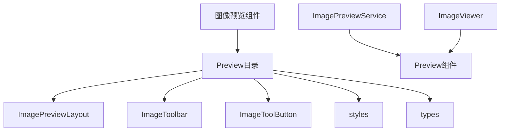
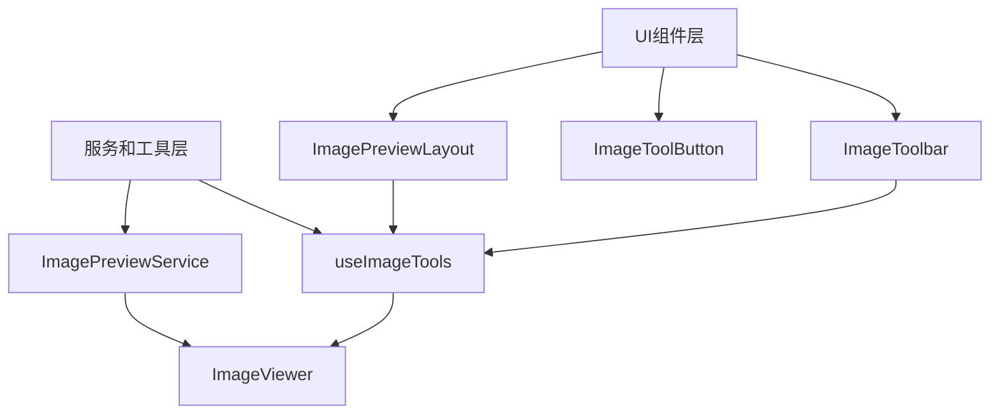
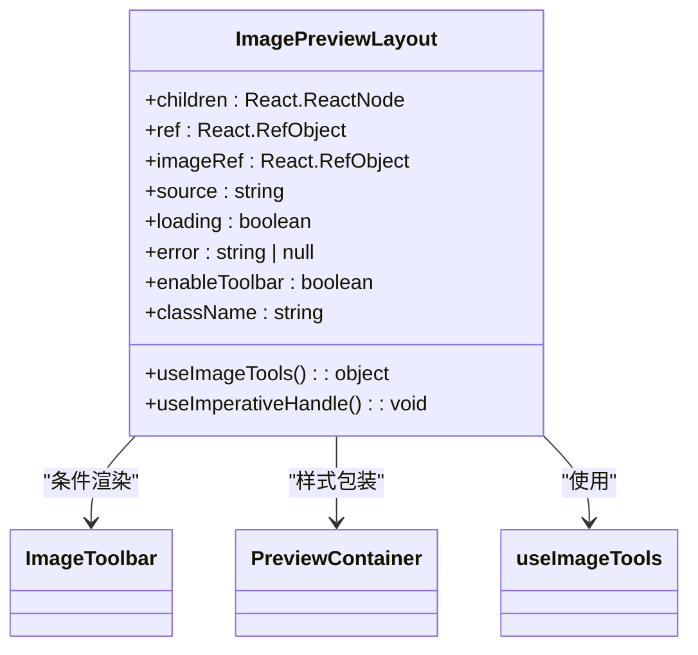
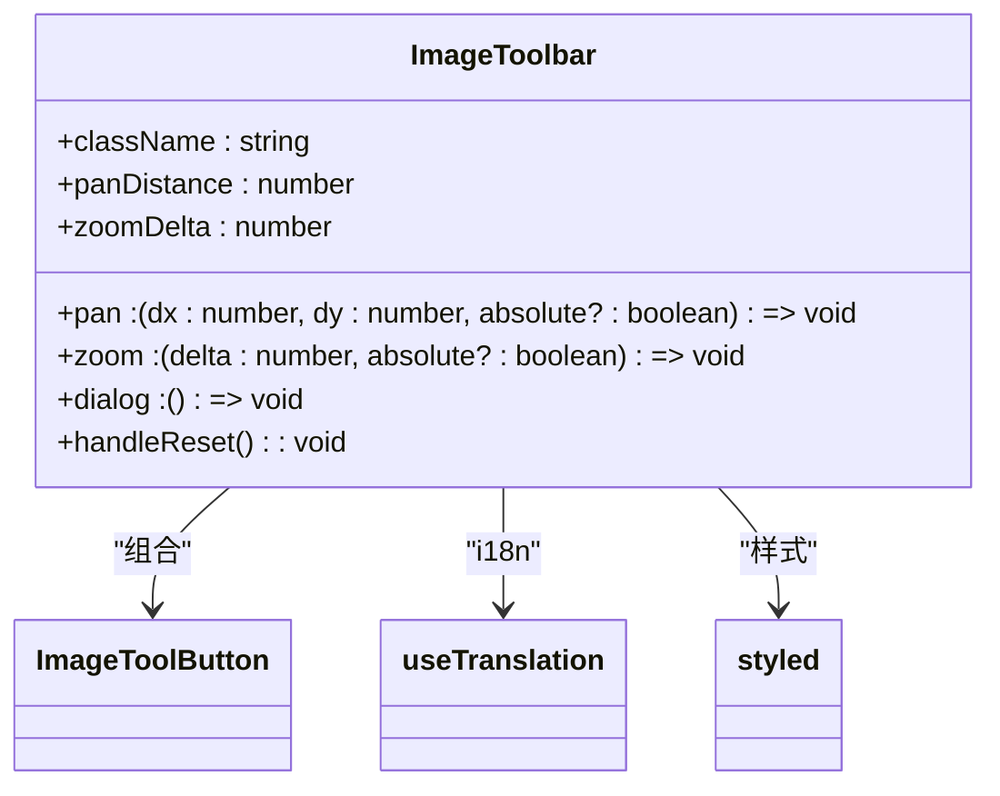
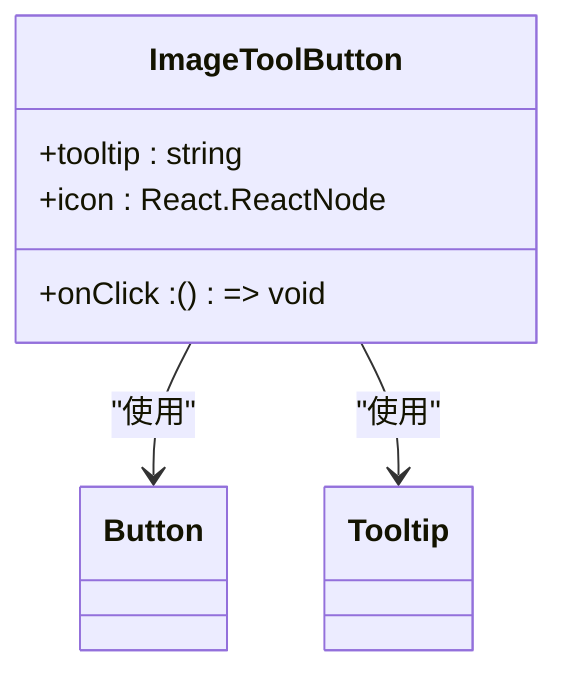
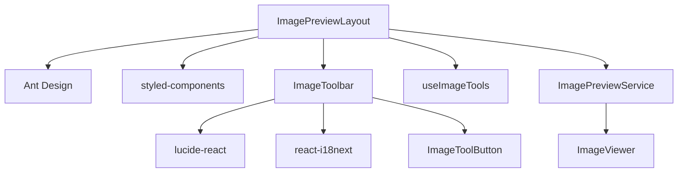

# 图像预览组件

<cite>
**本文档引用的文件**   
- [ImagePreviewLayout.tsx](file://src/renderer/src/components/Preview/ImagePreviewLayout.tsx)
- [ImageToolbar.tsx](file://src/renderer/src/components/Preview/ImageToolbar.tsx)
- [ImageToolButton.tsx](file://src/renderer/src/components/Preview/ImageToolButton.tsx)
- [ImageViewer.tsx](file://src/renderer/src/components/ImageViewer.tsx)
- [ImagePreviewService.ts](file://src/renderer/src/services/ImagePreviewService.ts)
- [styles.ts](file://src/renderer/src/components/Preview/styles.ts)
- [types.ts](file://src/renderer/src/components/Preview/types.ts)
- [useImageTools.tsx](file://src/renderer/src/components/ActionTools/hooks/useImageTools.tsx)
</cite>

## 目录
1. [简介](#简介)
2. [项目结构](#项目结构)
3. [核心组件](#核心组件)
4. [架构概述](#架构概述)
5. [详细组件分析](#详细组件分析)
6. [依赖分析](#依赖分析)
7. [性能考虑](#性能考虑)
8. [故障排除指南](#故障排除指南)
9. [结论](#结论)

## 简介
本文档详细介绍了Cherry Studio中的图像预览组件，重点分析了ImagePreviewLayout组件的布局架构、响应式设计和缩放控制机制。文档还解释了图像工具栏（ImageToolbar）和工具按钮（ImageToolButton）的交互逻辑与事件处理流程。提供了处理不同格式图像预览、缩放操作和下载功能的代码示例，并记录了针对大型图像文件的懒加载和内存管理等性能优化策略。此外，文档还包括自定义图像预览样式和扩展支持新图像格式的方法。

## 项目结构
Cherry Studio的图像预览功能主要位于`src/renderer/src/components/Preview`目录下，该目录包含了实现图像预览所需的核心组件和服务。主要文件包括ImagePreviewLayout.tsx（布局容器）、ImageToolbar.tsx（工具栏组件）、ImageToolButton.tsx（工具按钮组件）和styles.ts（样式定义）。这些组件与位于`src/renderer/src/services`目录下的ImagePreviewService.ts服务协同工作，提供完整的图像预览功能。整个结构遵循React组件化设计原则，实现了关注点分离和高内聚低耦合。

**图示来源**
- [ImagePreviewLayout.tsx](file://src/renderer/src/components/Preview/ImagePreviewLayout.tsx)
- [ImageToolbar.tsx](file://src/renderer/src/components/Preview/ImageToolbar.tsx)
- [ImageToolButton.tsx](file://src/renderer/src/components/Preview/ImageToolButton.tsx)
- [ImagePreviewService.ts](file://src/renderer/src/services/ImagePreviewService.ts)

**章节来源**
- [ImagePreviewLayout.tsx](file://src/renderer/src/components/Preview/ImagePreviewLayout.tsx)
- [ImageToolbar.tsx](file://src/renderer/src/components/Preview/ImageToolbar.tsx)

## 核心组件
图像预览系统的核心组件包括ImagePreviewLayout、ImageToolbar和ImageToolButton。ImagePreviewLayout作为布局容器，负责管理图像预览的整体结构和状态，包括加载状态、错误处理和工具栏的显示控制。ImageToolbar组件提供了用户交互的工具栏，包含平移、缩放、重置和打开对话框等功能按钮。ImageToolButton是工具栏中每个按钮的基础组件，封装了按钮的样式和交互逻辑。这些组件通过useImageTools钩子与底层的图像操作逻辑进行通信，实现了用户交互与图像变换的分离。

**章节来源**
- [ImagePreviewLayout.tsx](file://src/renderer/src/components/Preview/ImagePreviewLayout.tsx)
- [ImageToolbar.tsx](file://src/renderer/src/components/Preview/ImageToolbar.tsx)
- [ImageToolButton.tsx](file://src/renderer/src/components/Preview/ImageToolButton.tsx)

## 架构概述
图像预览组件采用分层架构设计，上层为UI组件层，下层为服务和工具层。UI组件层由ImagePreviewLayout、ImageToolbar和ImageToolButton组成，负责用户界面的呈现和用户交互的捕获。服务和工具层包括ImagePreviewService和useImageTools钩子，负责图像处理、预览显示和内存管理等核心功能。这种分层设计使得UI组件可以专注于用户界面的呈现，而将复杂的图像处理逻辑交给专门的服务处理，提高了代码的可维护性和可测试性。

**图示来源**
- [ImagePreviewLayout.tsx](file://src/renderer/src/components/Preview/ImagePreviewLayout.tsx)
- [ImageToolbar.tsx](file://src/renderer/src/components/Preview/ImageToolbar.tsx)
- [ImageToolButton.tsx](file://src/renderer/src/components/Preview/ImageToolButton.tsx)
- [ImagePreviewService.ts](file://src/renderer/src/services/ImagePreviewService.ts)
- [useImageTools.tsx](file://src/renderer/src/components/ActionTools/hooks/useImageTools.tsx)

## 详细组件分析

### ImagePreviewLayout分析
ImagePreviewLayout组件作为图像预览的容器，负责协调图像显示、加载状态和工具栏的显示。它通过useImperativeHandle钩子暴露底层的图像操作方法，允许父组件直接控制图像的平移、缩放等操作。组件接收imageRef作为参数，用于获取目标图像元素的引用，从而实现对图像的直接操作。通过spinning属性控制加载状态的显示，使用PreviewContainer样式组件包裹内容，确保布局的一致性。

**图示来源**
- [ImagePreviewLayout.tsx](file://src/renderer/src/components/Preview/ImagePreviewLayout.tsx)
- [ImageToolbar.tsx](file://src/renderer/src/components/Preview/ImageToolbar.tsx)
- [styles.ts](file://src/renderer/src/components/Preview/styles.ts)

**章节来源**
- [ImagePreviewLayout.tsx](file://src/renderer/src/components/Preview/ImagePreviewLayout.tsx)

### ImageToolbar分析
ImageToolbar组件实现了图像预览的交互工具栏，提供平移、缩放和重置功能。工具栏采用绝对定位，固定在预览区域的右下角，通过CSS的hover伪类实现鼠标悬停时显示的效果。组件接收pan、zoom和dialog三个回调函数作为props，分别对应平移、缩放和打开对话框的操作。每个工具按钮通过ImageToolButton组件实现，确保了按钮样式的统一和交互的一致性。

**图示来源**
- [ImageToolbar.tsx](file://src/renderer/src/components/Preview/ImageToolbar.tsx)
- [ImageToolButton.tsx](file://src/renderer/src/components/Preview/ImageToolButton.tsx)

**章节来源**
- [ImageToolbar.tsx](file://src/renderer/src/components/Preview/ImageToolbar.tsx)

### ImageToolButton分析
ImageToolButton是一个通用的工具按钮组件，封装了按钮的基本样式和交互逻辑。它使用Ant Design的Button组件和Tooltip组件，提供圆形按钮和悬停提示功能。组件接收tooltip、icon和onClick三个props，分别对应提示文本、图标和点击回调。通过aria-label属性增强可访问性，确保屏幕阅读器用户也能理解按钮的功能。

**图示来源**
- [ImageToolButton.tsx](file://src/renderer/src/components/Preview/ImageToolButton.tsx)

**章节来源**
- [ImageToolButton.tsx](file://src/renderer/src/components/Preview/ImageToolButton.tsx)

## 依赖分析
图像预览组件依赖于多个外部库和内部服务。主要依赖包括Ant Design（UI组件）、styled-components（CSS-in-JS样式）、lucide-react（图标）和react-i18next（国际化）。内部依赖包括ImagePreviewService（图像预览服务）、useImageTools（图像操作钩子）和ImageViewer（图像查看器组件）。这些依赖关系通过模块导入的方式建立，确保了组件的松耦合和可维护性。

**图示来源**
- [ImagePreviewLayout.tsx](file://src/renderer/src/components/Preview/ImagePreviewLayout.tsx)
- [ImageToolbar.tsx](file://src/renderer/src/components/Preview/ImageToolbar.tsx)
- [ImageToolButton.tsx](file://src/renderer/src/components/Preview/ImageToolButton.tsx)
- [ImagePreviewService.ts](file://src/renderer/src/services/ImagePreviewService.ts)

**章节来源**
- [ImagePreviewLayout.tsx](file://src/renderer/src/components/Preview/ImagePreviewLayout.tsx)
- [ImageToolbar.tsx](file://src/renderer/src/components/Preview/ImageToolbar.tsx)
- [ImageToolButton.tsx](file://src/renderer/src/components/Preview/ImageToolButton.tsx)
- [ImagePreviewService.ts](file://src/renderer/src/services/ImagePreviewService.ts)

## 性能考虑
图像预览组件在处理大型图像文件时采用了多种性能优化策略。首先，通过懒加载机制，只有在用户需要预览图像时才加载图像数据，减少了初始加载时间。其次，使用Blob URL来管理图像数据，避免了重复的数据传输和内存占用。在图像缩放时，通过限制缩放范围（0.1到3倍）和使用transform属性进行CSS变换，确保了平滑的用户体验和良好的性能表现。此外，组件在预览关闭时会及时清理创建的Blob URL，防止内存泄漏。

**章节来源**
- [ImagePreviewService.ts](file://src/renderer/src/services/ImagePreviewService.ts)
- [useImageTools.tsx](file://src/renderer/src/components/ActionTools/hooks/useImageTools.tsx)

## 故障排除指南
在使用图像预览组件时可能遇到的常见问题包括图像无法加载、工具栏不显示和缩放功能失效等。对于图像无法加载的问题，应检查图像源是否有效，网络连接是否正常，以及是否有跨域限制。工具栏不显示的问题通常与enableToolbar属性的设置有关，确保该属性被正确设置为true。缩放功能失效可能是由于事件监听器未正确绑定，检查useImageTools钩子的enableWheelZoom选项是否被正确配置。

**章节来源**
- [ImagePreviewLayout.tsx](file://src/renderer/src/components/Preview/ImagePreviewLayout.tsx)
- [ImageToolbar.tsx](file://src/renderer/src/components/Preview/ImageToolbar.tsx)
- [useImageTools.tsx](file://src/renderer/src/components/ActionTools/hooks/useImageTools.tsx)

## 结论
Cherry Studio的图像预览组件通过精心设计的架构和组件化实现，提供了强大而灵活的图像预览功能。组件的分层设计和关注点分离使得代码易于维护和扩展。通过合理的性能优化策略，确保了在处理大型图像文件时的良好用户体验。未来可以通过增加更多图像格式的支持、优化移动端的交互体验和增强可访问性来进一步提升组件的功能和质量。