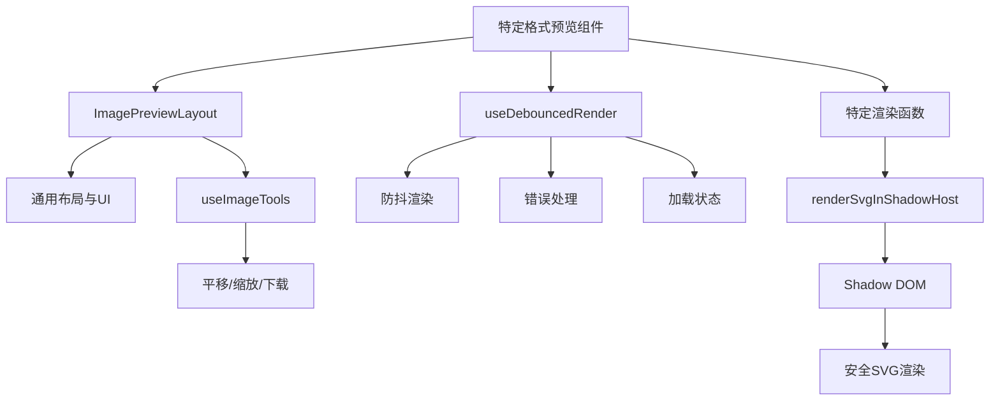
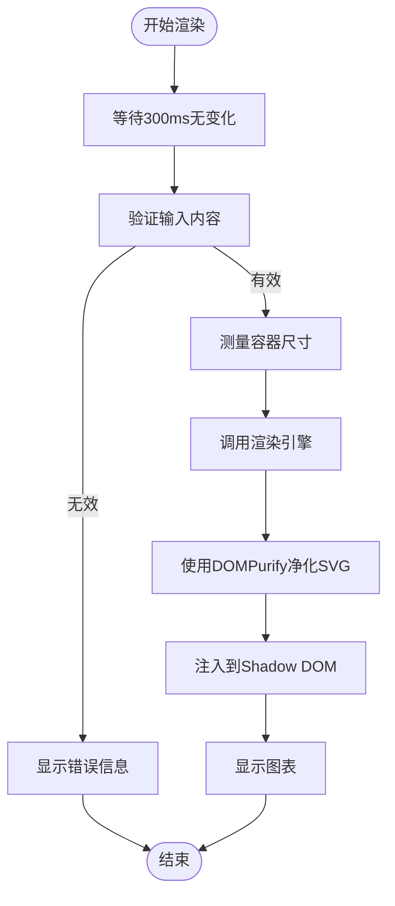

# 预览组件

<cite>
**本文档引用的文件**
- [ImagePreviewLayout.tsx](file://src/renderer/src/components/Preview/ImagePreviewLayout.tsx)
- [MermaidPreview.tsx](file://src/renderer/src/components/Preview/MermaidPreview.tsx)
- [GraphvizPreview.tsx](file://src/renderer/src/components/Preview/GraphvizPreview.tsx)
- [PlantUmlPreview.tsx](file://src/renderer/src/components/Preview/PlantUmlPreview.tsx)
- [SvgPreview.tsx](file://src/renderer/src/components/Preview/SvgPreview.tsx)
- [types.ts](file://src/renderer/src/components/Preview/types.ts)
- [styles.ts](file://src/renderer/src/components/Preview/styles.ts)
- [utils.ts](file://src/renderer/src/components/Preview/utils.ts)
- [useDebouncedRender.ts](file://src/renderer/src/components/Preview/hooks/useDebouncedRender.ts)
- [constants.ts](file://src/renderer/src/components/CodeBlockView/constants.ts)
</cite>

## 目录
1. [简介](#简介)
2. [核心组件架构](#核心组件架构)
3. [ImagePreviewLayout 组件](#imagepreviewlayout-组件)
4. [图表预览组件实现](#图表预览组件实现)
   1. [MermaidPreview](#mermaidpreview)
   2. [GraphvizPreview](#graphvizpreview)
   3. [PlantUmlPreview](#plantumlpreview)
   4. [SvgPreview](#svgpreview)
5. [渲染机制与交互功能](#渲染机制与交互功能)
6. [性能优化策略](#性能优化策略)
7. [自定义样式与扩展支持](#自定义样式与扩展支持)
8. [集成示例](#集成示例)
9. [结论](#结论)

## 简介
Cherry Studio 的预览组件系统为 AI 生成内容中的各种图表和图像提供了专业级的渲染和交互功能。本系统包含一系列专门的预览组件，包括 `ImagePreviewLayout`、`MermaidPreview`、`GraphvizPreview`、`PlantUmlPreview` 和 `SvgPreview`，它们共同构成了一个强大、灵活且用户友好的可视化解决方案。这些组件不仅能够准确地渲染复杂的图表，还提供了缩放、平移、下载等丰富的交互功能，极大地提升了用户在处理 AI 生成内容时的体验。

**本节来源**
- [ImagePreviewLayout.tsx](file://src/renderer/src/components/Preview/ImagePreviewLayout.tsx)
- [MermaidPreview.tsx](file://src/renderer/src/components/Preview/MermaidPreview.tsx)

## 核心组件架构
Cherry Studio 的预览组件采用了一种分层且可复用的架构设计。其核心思想是将通用的布局、加载、错误处理和交互逻辑与特定格式的渲染逻辑分离。

整个架构由以下几个关键部分组成：
1.  **基础预览布局 (`ImagePreviewLayout`)**：作为所有预览组件的通用容器，负责提供统一的 UI 布局、加载状态指示、错误显示以及工具栏的集成。
2.  **特定格式预览组件**：如 `MermaidPreview`、`GraphvizPreview` 等，它们专注于特定图表语言的解析和渲染，但将最终的展示和交互委托给 `ImagePreviewLayout`。
3.  **渲染逻辑抽象 (`useDebouncedRender`)**：一个自定义 Hook，它封装了防抖渲染、错误处理和加载状态管理等通用逻辑，使得各个预览组件的实现更加简洁和一致。
4.  **安全渲染 (`renderSvgInShadowHost`)**：一个核心工具函数，利用 Shadow DOM 技术安全地渲染 SVG 内容，防止样式污染和潜在的 XSS 攻击。
5.  **交互工具 (`useImageTools`)**：提供平移、缩放、复制和下载等交互功能的 Hook。

这种架构确保了代码的高内聚、低耦合，使得添加新的预览格式变得非常简单。



**图示来源**
- [ImagePreviewLayout.tsx](file://src/renderer/src/components/Preview/ImagePreviewLayout.tsx)
- [useDebouncedRender.ts](file://src/renderer/src/components/Preview/hooks/useDebouncedRender.ts)
- [utils.ts](file://src/renderer/src/components/Preview/utils.ts)

## ImagePreviewLayout 组件
`ImagePreviewLayout` 是所有预览组件的基石，它是一个通用的布局容器，为所有类型的图表和图像预览提供了一致的用户体验。

### 主要功能
- **统一容器**：通过 `PreviewContainer` 样式组件，为所有预览内容提供一个带有边框、圆角和最小高度的标准化容器。
- **加载状态**：集成 `antd` 的 `Spin` 组件，在内容加载时显示旋转图标，提升用户等待体验。
- **错误处理**：当渲染过程中发生错误时，`PreviewError` 组件会以醒目的红色边框和文字显示错误信息，帮助用户快速定位问题。
- **工具栏集成**：通过 `enableToolbar` 属性控制是否显示交互工具栏。工具栏默认隐藏，当用户将鼠标悬停在预览区域时会平滑地淡入，提供非侵入式的交互体验。
- **引用转发**：使用 `useImperativeHandle` 将底层的交互方法（如 `pan`, `zoom`, `copy`, `download`）暴露给父组件，允许外部代码直接控制预览视图。

### 技术实现
该组件通过 `useImageTools` Hook 获取所有交互功能，并通过 `ref` 将这些功能暴露出去。它接收一个 `imageRef` 来指向实际的渲染容器，并将 `children`（即实际的图表元素）放置在容器内。其设计充分体现了 React 的组合模式，将通用逻辑与具体实现分离。

**本节来源**
- [ImagePreviewLayout.tsx](file://src/renderer/src/components/Preview/ImagePreviewLayout.tsx)
- [styles.ts](file://src/renderer/src/components/Preview/styles.ts)

## 图表预览组件实现
本节将详细介绍四种主要的图表预览组件的技术实现和使用场景。

### MermaidPreview
`MermaidPreview` 组件用于渲染 Mermaid 语法定义的图表，如流程图、序列图、甘特图等。

#### 技术实现
1.  **依赖管理**：通过 `useMermaid` Hook 管理 Mermaid.js 库的异步加载和初始化。
2.  **渲染流程**：
    - **语法验证**：在渲染前调用 `mermaid.parse()` 验证语法，提前捕获错误。
    - **尺寸测量**：创建一个临时的、不可见的 DOM 元素来测量图表的宽度，确保渲染出的 SVG 能够适应容器。
    - **渲染与注入**：使用 `mermaid.render()` 生成 SVG 字符串，并通过 `renderSvgInShadowHost` 函数将其注入到 Shadow DOM 中。
    - **错误修复**：对生成的 SVG 进行后处理，修复因容器不可见导致的 `translate(undefined, NaN)` 问题。
3.  **可见性检测**：由于 Mermaid.js 在隐藏元素中渲染存在问题，该组件实现了一个 `MutationObserver` 来监听父级元素的 `class` 和 `style` 变化。当检测到组件从隐藏状态变为可见时，会触发重新渲染，确保图表正确显示。

#### 使用场景
适用于在 AI 生成的文档中嵌入流程图、类图、状态图等，以可视化的方式解释复杂逻辑或系统架构。

```mermaid
graph TD
A[用户输入Mermaid代码] --> B[useDebouncedRender]
B --> C{语法有效?}
C --> |是| D[创建临时测量容器]
D --> E[调用mermaid.render()]
E --> F[修复SVG]
F --> G[renderSvgInShadowHost]
G --> H[显示在ImagePreviewLayout]
C --> |否| I[显示语法错误]
```

**图示来源**
- [MermaidPreview.tsx](file://src/renderer/src/components/Preview/MermaidPreview.tsx)
- [useDebouncedRender.ts](file://src/renderer/src/components/Preview/hooks/useDebouncedRender.ts)

**本节来源**
- [MermaidPreview.tsx](file://src/renderer/src/components/Preview/MermaidPreview.tsx)

### GraphvizPreview
`GraphvizPreview` 组件用于渲染 DOT 语言定义的有向图和无向图。

#### 技术实现
1.  **异步初始化**：使用 `AsyncInitializer` 类来管理 `@viz-js/viz` 库的 WebAssembly 实例的异步加载和初始化，确保库只被加载一次。
2.  **直接渲染**：一旦 `viz` 实例准备就绪，`renderGraphviz` 函数会直接调用 `viz.renderString()` 方法，将 DOT 代码转换为 SVG 字符串。
3.  **安全注入**：生成的 SVG 字符串同样通过 `renderSvgInShadowHost` 函数进行安全注入。
4.  **防抖处理**：利用 `useDebouncedRender` Hook 对渲染过程进行防抖，避免在用户快速编辑时频繁触发昂贵的渲染操作。

#### 使用场景
适用于展示复杂的网络拓扑、依赖关系图、状态机等需要精确布局的图形。

**本节来源**
- [GraphvizPreview.tsx](file://src/renderer/src/components/Preview/GraphvizPreview.tsx)

### PlantUmlPreview
`PlantUmlPreview` 组件用于渲染 PlantUML 定义的图表，如 UML 类图、时序图、活动图等。

#### 技术实现
1.  **远程渲染**：与前两者不同，`PlantUmlPreview` 依赖于外部的 PlantUML 服务器（`https://www.plantuml.com/plantuml`）进行渲染。它不直接在客户端解析和绘制图表。
2.  **编码与请求**：
    - **编码**：根据 PlantUML 的规范，将图表代码进行 UTF-8 编码，然后使用 `pako` 库进行 Deflate 压缩，最后通过自定义的 `encode64` 函数转换为 URL 安全的字符串。
    - **请求**：将编码后的字符串拼接到服务器 URL 中，发起 `fetch` 请求获取 SVG 图像。
3.  **错误处理**：对 HTTP 响应进行详细检查，区分语法错误（400）、服务器错误（500+）和网络错误，并给出相应的用户友好提示。
4.  **日志记录**：使用 `loggerService` 记录网络错误，便于问题排查。

#### 使用场景
适用于需要生成标准 UML 图表的场景，特别是当客户端环境不适合运行 Java 渲染引擎时。

**本节来源**
- [PlantUmlPreview.tsx](file://src/renderer/src/components/Preview/PlantUmlPreview.tsx)

### SvgPreview
`SvgPreview` 组件用于直接渲染原始的 SVG 代码。

#### 技术实现
1.  **直接注入**：这是最简单的预览组件，其 `renderSvg` 函数直接将传入的 SVG 字符串通过 `renderSvgInShadowHost` 注入到 Shadow DOM 中。
2.  **透明容器**：使用 `ShadowTransparentContainer` 样式，其背景色为透明，允许 SVG 自身的样式（如背景）完全控制显示效果。
3.  **安全净化**：尽管是直接注入，但 `renderSvgInShadowHost` 函数内部会使用 `DOMPurify` 对 SVG 内容进行净化，允许特定的标签和属性，确保安全性。

#### 使用场景
适用于预览 AI 生成的原始 SVG 代码，或作为其他 SVG 生成器的通用预览容器。

**本节来源**
- [SvgPreview.tsx](file://src/renderer/src/components/Preview/SvgPreview.tsx)
- [styles.ts](file://src/renderer/src/components/Preview/styles.ts)

## 渲染机制与交互功能
Cherry Studio 预览组件的渲染机制和交互功能是其核心价值所在。

### 渲染机制
1.  **Shadow DOM 封装**：所有 SVG 内容都通过 `renderSvgInShadowHost` 函数渲染到 Shadow DOM 中。这确保了图表的样式不会与页面的其他部分发生冲突，实现了完美的样式隔离。
2.  **防抖渲染**：`useDebouncedRender` Hook 为所有预览组件提供了 300ms 的防抖延迟。这意味着在用户停止输入后 300ms 才会触发渲染，极大地减少了不必要的计算，提升了性能。
3.  **渐进式渲染**：结合 `React.startTransition`，渲染过程被标记为非紧急更新，允许 UI 在渲染大型图表时保持响应，避免界面卡顿。

### 交互功能
交互功能由 `useImageTools` Hook 提供，并通过 `ImageToolbar` 组件暴露给用户。
- **平移 (Pan)**：用户可以通过工具栏的箭头按钮或鼠标拖拽（如果启用）来移动图表视图。
- **缩放 (Zoom)**：用户可以通过 `+`/`-` 按钮或鼠标滚轮（如果启用）来放大或缩小图表。
- **重置 (Reset)**：一键将视图恢复到初始的平移和缩放状态。
- **复制 (Copy)**：将当前的 SVG 图像复制到剪贴板，方便用户粘贴到其他应用中。
- **下载 (Download)**：允许用户将图表以 SVG 或 PNG 格式下载到本地。



**图示来源**
- [utils.ts](file://src/renderer/src/components/Preview/utils.ts)
- [useDebouncedRender.ts](file://src/renderer/src/components/Preview/hooks/useDebouncedRender.ts)
- [ImageToolbar.tsx](file://src/renderer/src/components/Preview/ImageToolbar.tsx)

## 性能优化策略
为了确保在处理大型或复杂图表时仍能提供流畅的用户体验，Cherry Studio 采用了多项性能优化策略。

1.  **防抖 (Debouncing)**：这是最核心的优化。通过 `useDebouncedRender`，避免了在用户输入过程中频繁调用计算密集型的渲染函数，将渲染频率从“每次变化”降低到“稳定后一次”。
2.  **React 过渡 (React Transitions)**：使用 `React.startTransition` 将渲染操作标记为非紧急更新。这使得 React 可以优先处理用户界面的其他交互（如点击、输入），从而保持应用的响应性。
3.  **异步初始化**：对于 `GraphvizPreview` 和 `MermaidPreview`，其依赖的大型库（如 WebAssembly 模块）都是异步加载的。这避免了阻塞主应用的启动过程。
4.  **按需渲染**：`MermaidPreview` 中的可见性检测机制确保了只有当图表在视口中可见时才会进行渲染，避免了对隐藏图表的无谓计算。
5.  **内存管理**：`useDebouncedRender` Hook 在组件卸载时会正确地取消防抖函数并清理资源，防止内存泄漏。

这些策略共同作用，使得即使面对复杂的图表，用户也能获得流畅的编辑和预览体验。

**本节来源**
- [useDebouncedRender.ts](file://src/renderer/src/components/Preview/hooks/useDebouncedRender.ts)
- [MermaidPreview.tsx](file://src/renderer/src/components/Preview/MermaidPreview.tsx)

## 自定义样式与扩展支持
Cherry Studio 的预览组件设计具有良好的可扩展性。

### 自定义样式
- **Shadow DOM 样式**：通过 `ShadowWhiteContainer` 和 `ShadowTransparentContainer` 两种预设样式，可以控制预览容器的背景色、边框和圆角。开发者也可以创建自己的样式组件。
- **工具栏定制**：`ImageToolbar` 组件的结构清晰，可以通过修改其 JSX 或传入自定义的 `className` 来调整工具栏的布局和外观。

### 扩展支持新格式
添加一个新的预览格式非常简单，遵循以下步骤：
1.  创建一个新的组件文件（如 `NewFormatPreview.tsx`）。
2.  实现一个特定的渲染函数，该函数接收内容字符串并返回 Promise<void>。
3.  在组件内部，使用 `useDebouncedRender` Hook 来管理这个渲染函数。
4.  将渲染结果注入到一个由 `ImagePreviewLayout` 包裹的容器中。
5.  在 `components/Preview/index.ts` 中导出新组件。
6.  （可选）在 `CodeBlockView/constants.ts` 的 `SPECIAL_VIEW_COMPONENTS` 映射表中添加新的语言映射。

这种模块化的设计使得系统能够轻松地集成更多类型的可视化内容。

**本节来源**
- [index.ts](file://src/renderer/src/components/Preview/index.ts)
- [constants.ts](file://src/renderer/src/components/CodeBlockView/constants.ts)

## 集成示例
以下代码示例展示了如何将 `MermaidPreview` 组件集成到 AI 生成内容的展示流程中。

```typescript
// 假设这是从AI服务获取的响应
const aiResponse = {
  content: "graph TD\nA[开始] --> B[处理]\nB --> C{成功?}\nC -->|是| D[结束]\nC -->|否| B",
  language: "mermaid"
};

// 在React组件中使用
const AiContentDisplay = () => {
  // 根据语言选择对应的预览组件
  const PreviewComponent = SPECIAL_VIEW_COMPONENTS[aiResponse.language] || null;

  if (!PreviewComponent) {
    // 如果是普通文本，直接显示
    return <div>{aiResponse.content}</div>;
  }

  return (
    <div className="ai-content-block">
      <h3>AI 生成的流程图</h3>
      <PreviewComponent enableToolbar={true}>
        {aiResponse.content}
      </PreviewComponent>
    </div>
  );
};
```

此示例利用了 `SPECIAL_VIEW_COMPONENTS` 映射表，根据 AI 响应中的语言类型动态选择正确的预览组件，实现了无缝集成。

**本节来源**
- [constants.ts](file://src/renderer/src/components/CodeBlockView/constants.ts)
- [MermaidPreview.tsx](file://src/renderer/src/components/Preview/MermaidPreview.tsx)

## 结论
Cherry Studio 的预览组件系统是一个设计精良、功能强大且性能优异的解决方案。它通过分层架构将通用逻辑与特定实现分离，利用 Shadow DOM 确保了渲染的安全性和样式隔离，并通过防抖和 React 过渡等技术优化了用户体验。无论是 Mermaid、Graphviz 还是 PlantUML，这些组件都为 AI 生成内容的可视化提供了坚实的基础。其模块化的设计也使得未来扩展支持更多格式变得轻而易举，为构建一个全面的 AI 内容展示平台奠定了坚实的基础。