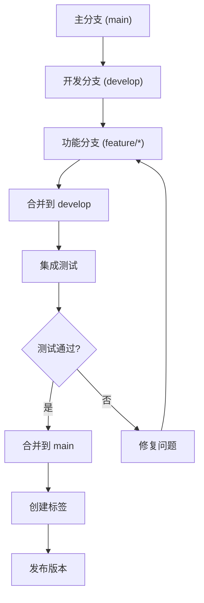
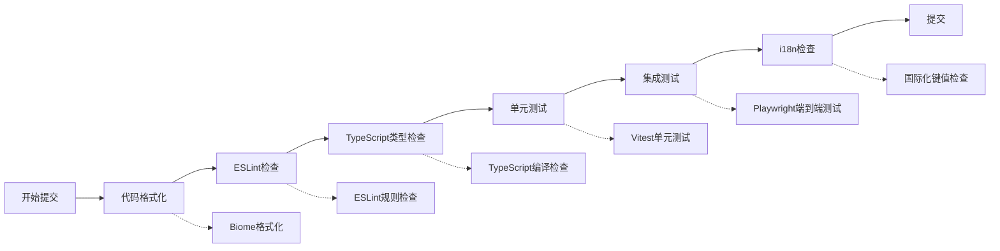

# Cherry Studio代码提交最佳实践

<cite>
**本文档引用的文件**
- [CONTRIBUTING.md](file://CONTRIBUTING.md)
- [package.json](file://package.json)
- [eslint.config.mjs](file://eslint.config.mjs)
- [vitest.config.ts](file://vitest.config.ts)
- [playwright.config.ts](file://playwright.config.ts)
- [electron.vite.config.ts](file://electron.vite.config.ts)
- [CLAUDE.md](file://CLAUDE.md)
- [scripts/update-languages.ts](file://scripts/update-languages.ts)
</cite>

## 目录
1. [概述](#概述)
2. [提交信息规范](#提交信息规范)
3. [分支管理策略](#分支管理策略)
4. [签署提交的重要性](#签署提交的重要性)
5. [代码提交前检查清单](#代码提交前检查清单)
6. [代码质量保证](#代码质量保证)
7. [自动化工具配置](#自动化工具配置)
8. [最佳实践总结](#最佳实践总结)

## 概述

Cherry Studio作为一个大型的Electron应用程序，采用现代化的开发工作流程和严格的代码质量标准。本指南详细介绍了项目中的代码提交最佳实践，包括约定式提交、分支管理、代码质量检查和团队协作规范。

## 提交信息规范

### 约定式提交（Conventional Commits）

Cherry Studio强烈推荐使用约定式提交规范，这有助于：
- 自动生成变更日志
- 自动版本控制
- 更清晰的代码历史记录

#### 提交消息格式

```
<类型>[可选范围]: <描述>

[可选正文]

[可选脚注]
```

#### 类型标识符

| 类型 | 描述 | 示例 |
|------|------|------|
| `feat` | 新功能 | `feat: 添加多语言支持` |
| `fix` | 错误修复 | `fix: 修复聊天界面崩溃问题` |
| `docs` | 文档更新 | `docs: 更新API文档` |
| `style` | 代码格式调整 | `style: 格式化CSS样式` |
| `refactor` | 代码重构 | `refactor: 优化内存管理` |
| `test` | 测试相关 | `test: 添加单元测试覆盖` |
| `chore` | 构建过程或辅助工具变动 | `chore: 更新依赖版本` |

#### 提交示例

```bash
# 功能提交
git commit -m "feat: 添加图片OCR识别功能

- 集成Tesseract.js库
- 实现图片上传预处理
- 添加错误处理机制

Closes #1234"

# 修复提交
git commit -m "fix: 修复文件保存路径问题

- 修正路径解析逻辑
- 添加路径验证
- 更新相关测试用例

Resolves #5678"

# 文档提交
git commit -m "docs: 更新开发者指南

- 添加新API使用示例
- 更新架构图
- 完善贡献指南

Related to #9101"
```

**章节来源**
- [CONTRIBUTING.md](file://CONTRIBUTING.md#L48-L59)
- [CLAUDE.md](file://CLAUDE.md#L13-L14)

## 分支管理策略

### 功能分支命名规范

Cherry Studio采用Git Flow分支管理模式，功能分支遵循以下命名规范：

#### 分支类型和命名模式

| 分支类型 | 命名模式 | 示例 | 用途 |
|----------|----------|------|------|
| 功能分支 | `feature/<功能描述>` | `feature/chat-enhancements` | 开发新功能 |
| 修复分支 | `fix/<问题描述>` | `fix/chat-crash-bug` | 修复已知问题 |
| 热修复分支 | `hotfix/<紧急修复>` | `hotfix/security-patch` | 紧急安全修复 |
| 发布分支 | `release/<版本号>` | `release/v1.8.0` | 版本发布准备 |
| 支持分支 | `support/<版本号>` | `support/v1.7.x` | 长期支持维护 |

#### 分支生命周期



### 合并策略

1. **功能分支合并**：使用squash合并以保持主分支整洁
2. **热修复分支**：直接合并到主分支和开发分支
3. **发布分支**：合并到主分支和开发分支

## 签署提交的重要性

### 签署提交的作用

Cherry Studio要求所有贡献者签署其提交，这是法律合规性和项目治理的重要组成部分。

#### 签署提交的好处

- **法律合规**：确保贡献者拥有合法的版权授权
- **责任追溯**：明确代码贡献者的身份
- **项目治理**：维护项目的开源许可证合规性

#### 如何签署提交

```bash
# 方法1：使用 --signoff 参数
git commit --signoff -m "你的提交消息"

# 方法2：手动添加签名
git commit -m "你的提交消息
Signed-off-by: 你的姓名 <你的邮箱>"
```

#### 签署提交示例

```bash
git commit --signoff -m "feat: 添加新的AI模型支持

- 集成OpenAI GPT-4 Turbo模型
- 更新模型配置文件
- 添加相应的测试用例

Signed-off-by: 张三 <zhangsan@example.com>"
```

**章节来源**
- [CONTRIBUTING.md](file://CONTRIBUTING.md#L48-L59)

## 代码提交前检查清单

### 自动化检查流程

Cherry Studio配置了完整的自动化检查流程，在代码提交前自动执行多项质量检查。

#### 检查清单



#### 详细检查步骤

1. **代码格式化**
   ```bash
   # 运行格式化工具
   yarn format
   
   # 检查格式化状态
   yarn format:check
   ```

2. **代码质量检查**
   ```bash
   # 运行ESLint和Biome检查
   yarn lint
   
   # 单独运行ESLint
   yarn test:lint
   ```

3. **类型检查**
   ```bash
   # TypeScript类型检查
   yarn typecheck
   
   # 分别检查主进程和渲染进程
   yarn typecheck:node
   yarn typecheck:web
   ```

4. **测试执行**
   ```bash
   # 运行所有测试
   yarn test
   
   # 运行特定测试
   yarn test:main      # 主进程测试
   yarn test:renderer  # 渲染进程测试
   yarn test:aicore    # AI核心包测试
   yarn test:e2e       # 端到端测试
   ```

5. **国际化检查**
   ```bash
   # 检查国际化文件
   yarn check:i18n
   
   # 自动翻译缺失的键值
   yarn auto:i18n
   ```

**章节来源**
- [package.json](file://package.json#L71-L76)
- [eslint.config.mjs](file://eslint.config.mjs#L1-L139)
- [vitest.config.ts](file://vitest.config.ts#L1-L96)

## 代码质量保证

### ESLint配置

Cherry Studio使用严格的ESLint配置来确保代码质量和一致性。

#### 核心规则配置

| 规则类别 | 关键规则 | 描述 |
|----------|----------|------|
| 导入管理 | `simple-import-sort/imports` | 统一导入语句排序 |
| 未使用导入 | `unused-imports/no-unused-imports` | 移除未使用的导入 |
| React Hooks | `react-hooks/rules-of-hooks` | 正确使用React Hooks |
| TypeScript | `@typescript-eslint/no-explicit-any` | 避免使用any类型 |
| 日志规范 | 自定义规则 | 使用统一的LoggerService |

#### 代码风格规范

```javascript
// 推荐的导入顺序
import React from 'react';
import { useState } from 'react';
import PropTypes from 'prop-types';

import { Button, Typography } from 'antd';
import styled from 'styled-components';

import { useStore } from '@/hooks/useStore';
import { logger } from '@/services/LoggerService';

import { CONFIG } from '@/constants/config';
import { THEME } from '@/constants/theme';
```

### 测试覆盖率要求

Cherry Studio对测试覆盖率有明确的要求：

#### 覆盖率目标

| 测试类型 | 最低覆盖率 | 目标覆盖率 |
|----------|------------|------------|
| 主进程测试 | 80% | 90% |
| 渲染进程测试 | 75% | 85% |
| AI核心包测试 | 85% | 95% |
| 整体项目 | 70% | 80% |

#### 测试执行命令

```bash
# 运行覆盖率报告
yarn test:coverage

# 更新快照测试
yarn test:update

# 监视模式测试
yarn test:watch
```

**章节来源**
- [eslint.config.mjs](file://eslint.config.mjs#L1-L139)
- [vitest.config.ts](file://vitest.config.ts#L65-L85)

## 自动化工具配置

### Husky Git钩子

Cherry Studio使用Husky配置Git钩子，在提交前自动执行检查。

#### 配置文件结构

```javascript
// .husky/pre-commit
#!/usr/bin/env sh
. "$(dirname -- "$0")/_/husky.sh"

# 执行lint-staged
npx lint-staged
```

#### lint-staged配置

```javascript
// package.json中的配置
{
  "lint-staged": {
    "*.{js,jsx,ts,tsx,cjs,mjs,cts,mts}": [
      "biome format --write --no-errors-on-unmatched",
      "eslint --fix"
    ],
    "*.{json,yml,yaml,css,html}": [
      "biome format --write --no-errors-on-unmatched"
    ]
  }
}
```

### Biome代码格式化

Cherry Studio采用Biome作为主要的代码格式化工具：

#### 格式化配置

```bash
# 格式化单个文件
yarn biome format --write src/main/services/ApiServerService.ts

# 检查格式化状态
yarn biome format src/main/services/ApiServerService.ts

# 格式化整个项目
yarn format
```

#### Biome优势

- **高性能**：比Prettier快20倍
- **ESLint兼容**：支持ESLint规则
- **TypeScript原生**：内置TypeScript支持
- **零配置**：开箱即用

**章节来源**
- [package.json](file://package.json#L420-L428)
- [scripts/update-languages.ts](file://scripts/update-languages.ts#L78-L90)

## 最佳实践总结

### 提交前完整检查

在准备提交代码之前，请确保完成以下检查：

1. **代码质量检查**
   - [ ] 运行 `yarn lint` 检查代码风格
   - [ ] 运行 `yarn typecheck` 确保类型安全
   - [ ] 运行 `yarn format:check` 验证格式化

2. **功能测试**
   - [ ] 运行 `yarn test` 确保现有功能正常
   - [ ] 添加必要的单元测试
   - [ ] 运行 `yarn test:coverage` 检查覆盖率

3. **国际化检查**
   - [ ] 运行 `yarn check:i18n` 检查翻译完整性
   - [ ] 添加缺失的翻译键值

4. **提交准备**
   - [ ] 使用约定式提交格式
   - [ ] 签署提交 (`--signoff`)
   - [ ] 编写清晰的提交消息

### 团队协作建议

1. **小步快跑**：每次提交应该小而专注
2. **及时同步**：定期从主分支拉取最新代码
3. **代码审查**：积极参与Pull Request审查
4. **文档更新**：修改代码时同步更新相关文档

### 常见问题解决

1. **提交被拒绝**
   - 检查ESLint错误并修复
   - 确认代码格式化正确
   - 验证测试通过

2. **CI失败**
   - 查看CI日志定位问题
   - 在本地重现并修复
   - 重新推送修复后的提交

3. **冲突解决**
   - 优先解决功能冲突
   - 保留业务逻辑完整性
   - 确保测试覆盖冲突部分

通过遵循这些最佳实践，您可以为Cherry Studio项目贡献高质量的代码，同时提高团队协作效率和项目稳定性。