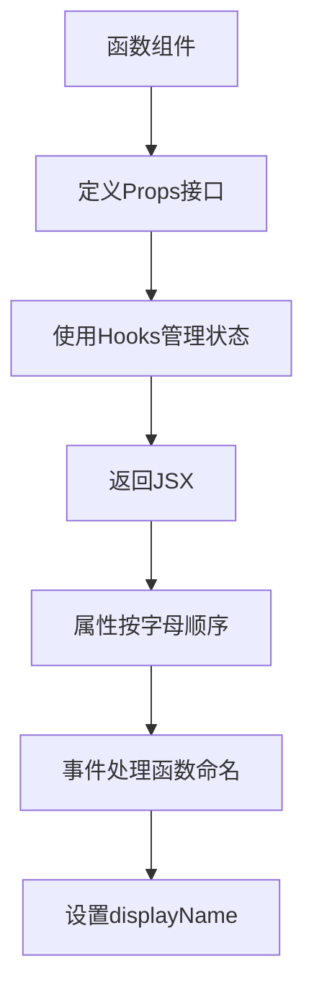

# 代码风格与规范

<cite>
**本文档中引用的文件**
- [eslint.config.mjs](file://eslint.config.mjs)
- [tsconfig.json](file://tsconfig.json)
- [tsconfig.node.json](file://tsconfig.node.json)
- [tsconfig.web.json](file://tsconfig.web.json)
- [package.json](file://package.json)
- [App.tsx](file://src/renderer/src/App.tsx)
- [CodeEditor/index.tsx](file://src/renderer/src/components/CodeEditor/index.tsx)
- [useStore.ts](file://src/renderer/src/hooks/useStore.ts)
- [chat.ts](file://src/renderer/src/types/chat.ts)
- [ApiService.ts](file://src/renderer/src/services/ApiService.ts)
- [utils/index.ts](file://src/renderer/src/utils/index.ts)
</cite>

## 目录
1. [简介](#简介)
2. [TypeScript配置规范](#typescript配置规范)
3. [ESLint代码检查规范](#eslint代码检查规范)
4. [命名约定](#命名约定)
5. [模块导入导出规范](#模块导入导出规范)
6. [React组件开发最佳实践](#react组件开发最佳实践)
7. [代码格式化规范](#代码格式化规范)
8. [类型定义规范](#类型定义规范)
9. [代码可读性与一致性](#代码可读性与一致性)
10. [工具与自动化](#工具与自动化)

## 简介

Cherry Studio项目采用TypeScript和React技术栈，遵循严格的代码风格与规范，以确保代码的可读性、一致性和可维护性。本规范基于项目中的ESLint和TypeScript配置，详细说明JavaScript/TypeScript的编码标准，包括命名约定、代码格式化、类型定义、模块导入导出等规则。同时，提供React组件开发的最佳实践，如函数组件与Hooks的使用、JSX编写规范。通过统一的代码风格，确保团队协作的高效性。

**Section sources**
- [package.json](file://package.json#L1-L430)
- [App.tsx](file://src/renderer/src/App.tsx#L1-L56)

## TypeScript配置规范

Cherry Studio项目采用模块化的TypeScript配置，通过多个配置文件来管理不同环境的编译选项。项目根目录下的`tsconfig.json`文件作为主配置文件，引用了`tsconfig.node.json`和`tsconfig.web.json`两个子配置文件，分别用于Node.js环境和Web环境的类型检查。

在`tsconfig.json`中，配置了`"experimentalDecorators": true`和`"emitDecoratorMetadata": true`，支持装饰器语法，这对于使用某些框架和库（如TypeORM）是必要的。同时，`"useDefineForClassFields": true`确保类字段的初始化行为符合ES2022规范。

`tsconfig.node.json`和`tsconfig.web.json`都继承自`@electron-toolkit/tsconfig`包提供的基础配置，并根据项目需求进行了扩展。两个配置文件都启用了装饰器支持，并通过`"paths"`配置了路径别名，如`@renderer/*`映射到`src/renderer/src/*`，提高了模块导入的可读性和可维护性。

**Section sources**
- [tsconfig.json](file://tsconfig.json#L1-L22)
- [tsconfig.node.json](file://tsconfig.node.json#L1-L36)
- [tsconfig.web.json](file://tsconfig.web.json#L1-L39)

## ESLint代码检查规范

Cherry Studio项目使用ESLint进行代码静态分析和风格检查。`eslint.config.mjs`文件定义了项目的ESLint配置，整合了多个插件和配置集，包括`@electron-toolkit/eslint-config-ts`、`@eslint-react/eslint-plugin`和`react-hooks`等。

配置中启用了`simple-import-sort`插件，强制要求导入语句按字母顺序排序，提高了代码的可读性。`unused-imports`插件用于检测和报告未使用的导入，确保代码的整洁性。`import-zod`插件则鼓励使用Zod进行类型验证。

特别值得注意的是，项目配置了自定义规则来禁止使用`console`语句，强制开发者使用统一的`LoggerService`进行日志记录。这确保了日志输出的一致性和可管理性。同时，配置了i18n插件，禁止在`t()`函数中使用模板字符串，以避免国际化文本的渲染问题。

**Section sources**
- [eslint.config.mjs](file://eslint.config.mjs#L1-L139)
- [package.json](file://package.json#L281-L286)

## 命名约定

Cherry Studio项目遵循一致的命名约定，以提高代码的可读性和可维护性。变量和函数名采用驼峰式命名法（camelCase），如`fetchChatCompletion`和`checkApiProvider`。常量和枚举值采用大写字母和下划线命名法（UPPER_CASE），如`ChunkType`。

类型和接口名采用帕斯卡命名法（PascalCase），如`CodeEditorProps`和`AiSdkMiddlewareConfig`。React组件名也采用帕斯卡命名法，并以`.tsx`为扩展名，如`App.tsx`和`CodeEditor.tsx`。

在类型定义中，布尔类型的属性通常以`is`、`has`或`can`等前缀开头，如`isPromptToolUse`和`hasApiKey`，使代码意图更加明确。

**Section sources**
- [CodeEditor/index.tsx](file://src/renderer/src/components/CodeEditor/index.tsx#L1-L281)
- [ApiService.ts](file://src/renderer/src/services/ApiService.ts#L1-L520)
- [chat.ts](file://src/renderer/src/types/chat.ts#L1-L21)

## 模块导入导出规范

Cherry Studio项目采用ES6模块语法进行模块导入和导出。导入语句按以下顺序分组：标准库、第三方库、路径别名、相对路径。每个组之间用空行分隔，提高了代码的可读性。

路径别名被广泛使用，如`@renderer/*`、`@main/*`和`@shared/*`，这些别名在`tsconfig.json`中定义，避免了复杂的相对路径。例如，`import { useSettings } from '@renderer/hooks/useSettings'`比`import { useSettings } from '../../../hooks/useSettings'`更加清晰和稳定。

组件和工具函数通常使用默认导出，而类型和常量则使用命名导出。例如，`export default App`和`export interface CodeEditorProps`。这种约定使得导入语句更加简洁，同时保持了类型的可访问性。

**Section sources**
- [App.tsx](file://src/renderer/src/App.tsx#L1-L56)
- [CodeEditor/index.tsx](file://src/renderer/src/components/CodeEditor/index.tsx#L1-L281)
- [tsconfig.json](file://tsconfig.json#L1-L22)

## React组件开发最佳实践

Cherry Studio项目采用函数组件和Hooks作为React开发的主要模式。组件通常定义为函数，并使用TypeScript接口定义props类型。例如，`CodeEditor`组件的props通过`CodeEditorProps`接口进行类型约束。

组件内部使用各种React Hooks，如`useState`、`useEffect`、`useRef`和`useCallback`，以管理状态、副作用和性能优化。自定义Hooks被广泛使用，如`useSettings`和`useStore`，将可复用的逻辑封装起来，提高了代码的可维护性。

JSX编写遵循严格的规范，标签属性按字母顺序排列，多行JSX使用括号包裹。事件处理函数通常以`handle`或`on`开头，如`onChange`和`onBlur`。组件的displayName被显式设置，便于调试和性能分析。

**Diagram sources**
- [App.tsx](file://src/renderer/src/App.tsx#L1-L56)
- [CodeEditor/index.tsx](file://src/renderer/src/components/CodeEditor/index.tsx#L1-L281)
- [useStore.ts](file://src/renderer/src/hooks/useStore.ts#L1-L47)

**Section sources**
- [App.tsx](file://src/renderer/src/App.tsx#L1-L56)
- [CodeEditor/index.tsx](file://src/renderer/src/components/CodeEditor/index.tsx#L1-L281)
- [useStore.ts](file://src/renderer/src/hooks/useStore.ts#L1-L47)

## 代码格式化规范

Cherry Studio项目使用Biome工具进行代码格式化，确保代码风格的一致性。Biome的配置集成在`package.json`的`lint-staged`脚本中，每次提交代码时都会自动运行格式化。

代码缩进使用4个空格，行宽限制为120个字符。字符串使用单引号，除非需要在字符串中包含单引号。对象字面量的属性之间使用逗号分隔，最后一个属性后也添加逗号，便于版本控制和代码生成。

函数参数和箭头函数的参数在多行时，每个参数独占一行，并进行适当的缩进。条件表达式和循环语句的代码块必须使用大括号包裹，即使只有一行代码。

**Section sources**
- [package.json](file://package.json#L420-L428)
- [CodeEditor/index.tsx](file://src/renderer/src/components/CodeEditor/index.tsx#L1-L281)

## 类型定义规范

Cherry Studio项目充分利用TypeScript的类型系统，确保代码的类型安全。类型定义文件通常放在`types`目录下，如`src/renderer/src/types/chat.ts`。复杂的类型使用接口（interface）定义，而简单的类型别名使用type关键字。

联合类型和交叉类型被广泛使用，以表示复杂的类型关系。例如，`InputBarToolType`是一个字符串字面量类型的联合，表示输入栏工具的类型。泛型被用于创建可复用的类型，如`uniqueObjectArray<T>`函数。

类型断言被谨慎使用，通常只在必要时通过`as`关键字进行。`@ts-ignore`注释被严格限制，仅在无法避免的类型错误时使用，并附带详细的注释说明原因。

**Section sources**
- [chat.ts](file://src/renderer/src/types/chat.ts#L1-L21)
- [utils/index.ts](file://src/renderer/src/utils/index.ts#L1-L225)
- [ApiService.ts](file://src/renderer/src/services/ApiService.ts#L1-L520)

## 代码可读性与一致性

Cherry Studio项目高度重视代码的可读性和一致性。所有函数和类都有详细的JSDoc注释，描述其功能、参数和返回值。注释使用中文编写，确保团队成员都能理解。

代码结构遵循单一职责原则，每个文件和函数都有明确的职责。复杂的逻辑被分解为多个小函数，每个函数只做一件事。错误处理被统一管理，使用try-catch块捕获异步操作的错误，并通过日志服务记录。

常量和配置被集中管理，避免硬编码。例如，API端点和UI常量被定义在专门的配置文件中，便于维护和修改。这种做法提高了代码的可维护性和可测试性。

**Section sources**
- [ApiService.ts](file://src/renderer/src/services/ApiService.ts#L1-L520)
- [utils/index.ts](file://src/renderer/src/utils/index.ts#L1-L225)

## 工具与自动化

Cherry Studio项目通过一系列工具和自动化脚本确保代码质量和开发效率。`package.json`中的`scripts`字段定义了各种任务，如`build`、`test`、`lint`和`format`。

`lint`脚本结合了`oxlint`和`eslint`，进行全面的代码检查和自动修复。`format`脚本使用`biome`进行代码格式化。`test`脚本运行Vitest进行单元测试，`test:e2e`脚本使用Playwright进行端到端测试。

Git钩子通过`husky`和`lint-staged`配置，确保每次提交的代码都经过格式化和检查。这防止了低质量的代码进入版本控制系统，维护了代码库的健康。

**Section sources**
- [package.json](file://package.json#L27-L82)
- [eslint.config.mjs](file://eslint.config.mjs#L1-L139)