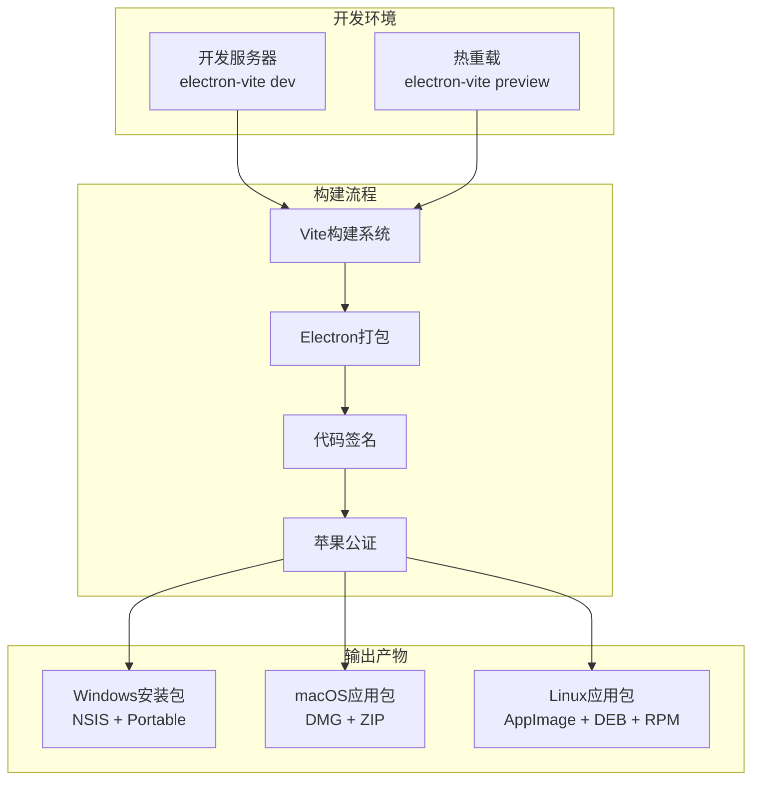
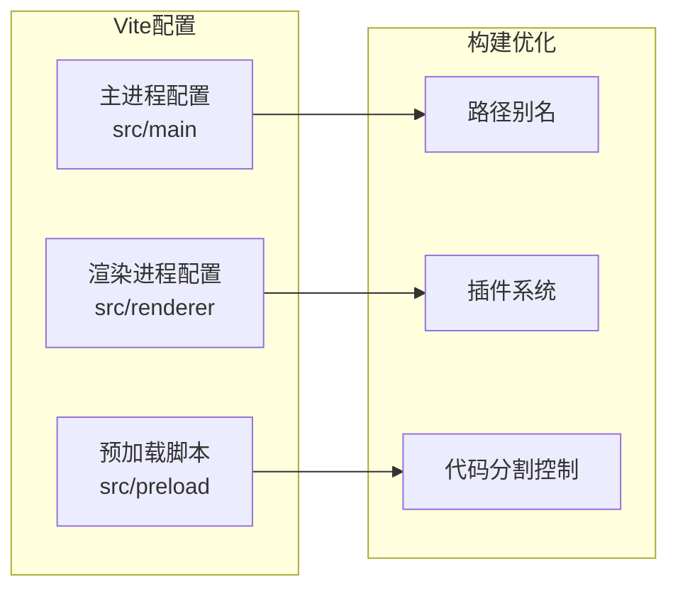
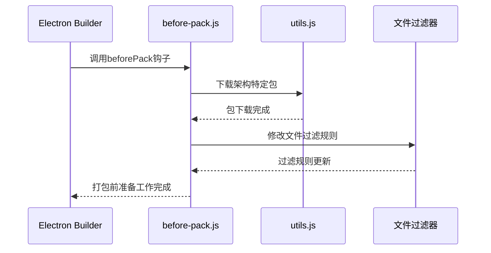
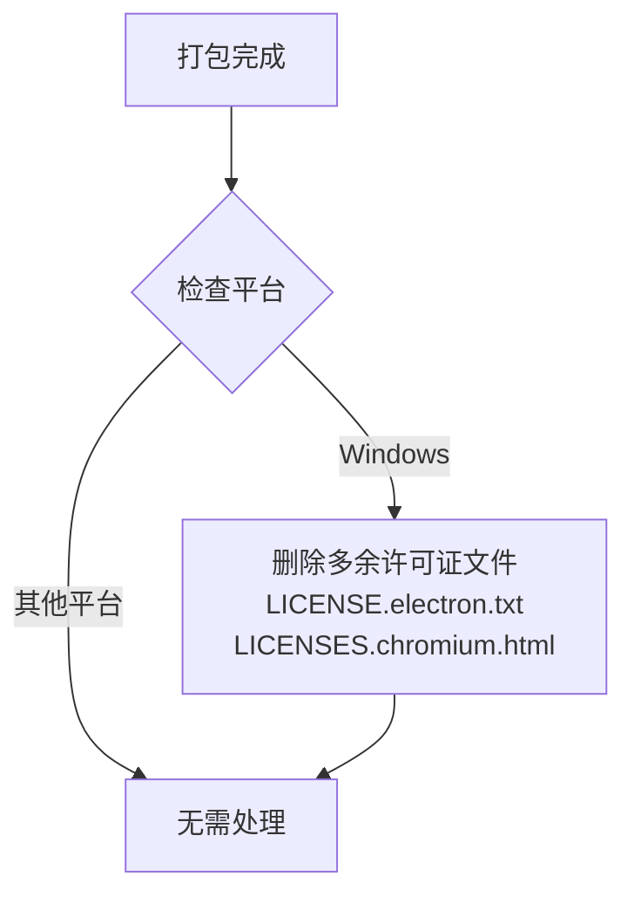
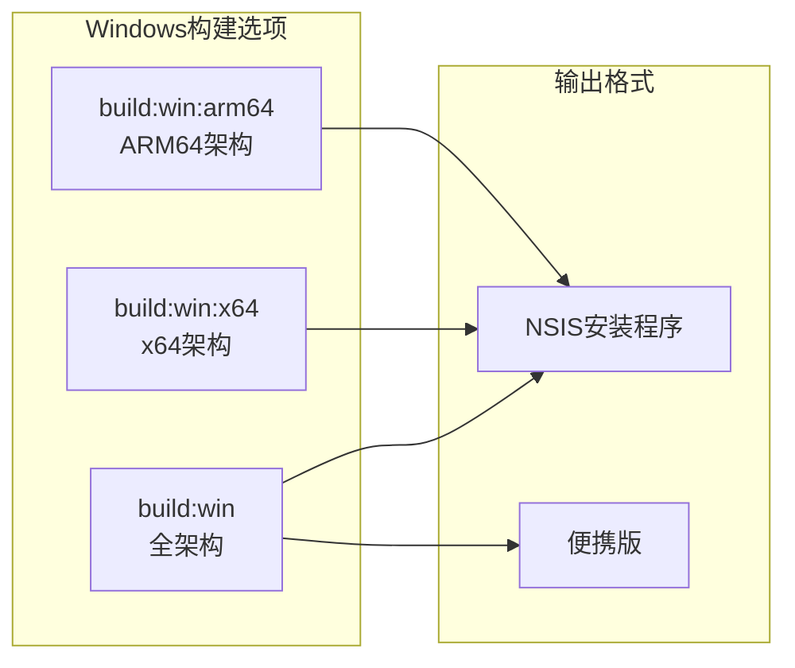
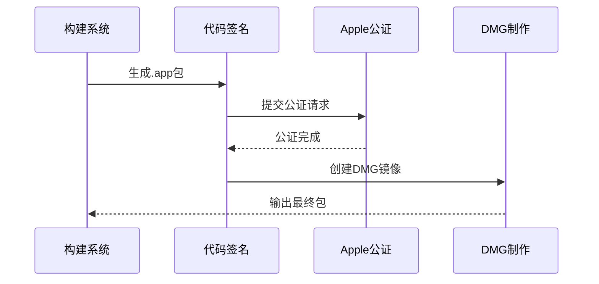
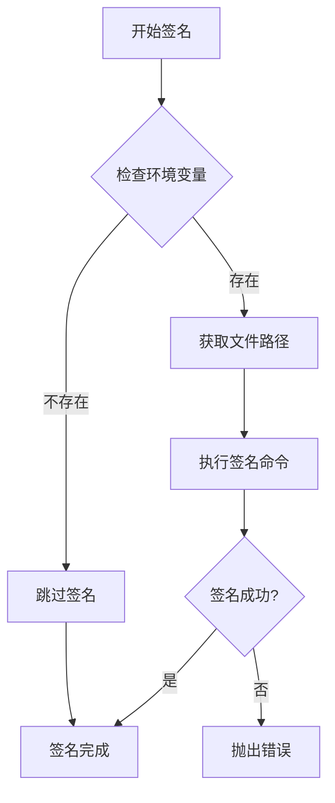
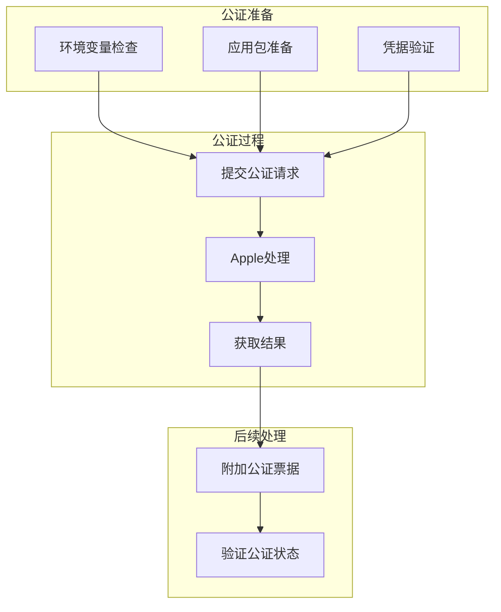
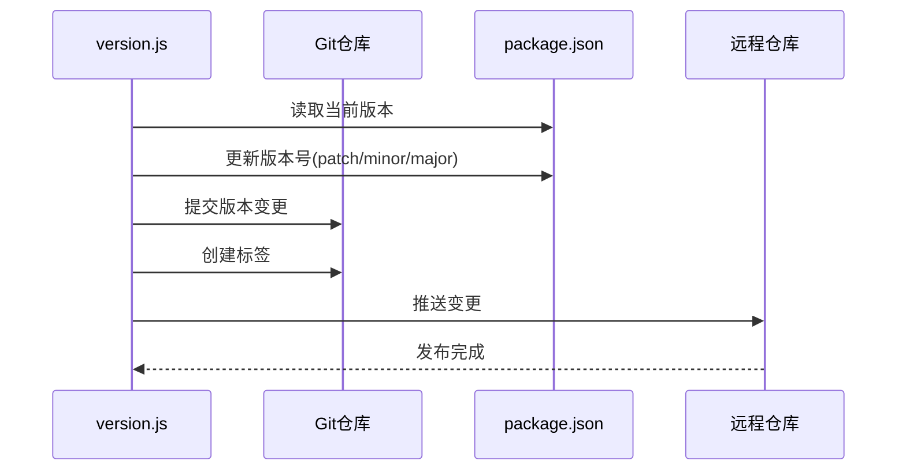
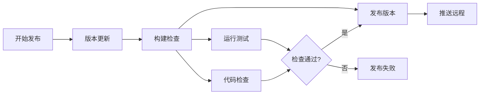

# 构建与打包流程

<cite>
**本文档中引用的文件**
- [package.json](file://package.json)
- [electron-builder.yml](file://electron-builder.yml)
- [electron.vite.config.ts](file://electron.vite.config.ts)
- [scripts/before-pack.js](file://scripts/before-pack.js)
- [scripts/after-pack.js](file://scripts/after-pack.js)
- [scripts/notarize.js](file://scripts/notarize.js)
- [scripts/win-sign.js](file://scripts/win-sign.js)
- [scripts/artifact-build-completed.js](file://scripts/artifact-build-completed.js)
- [scripts/utils.js](file://scripts/utils.js)
- [scripts/version.js](file://scripts/version.js)
- [dev-app-update.yml](file://dev-app-update.yml)
</cite>

## 目录
1. [项目概述](#项目概述)
2. [构建架构概览](#构建架构概览)
3. [Vite构建系统](#vite构建系统)
4. [Electron Builder配置](#electron-builder配置)
5. [构建脚本详解](#构建脚本详解)
6. [平台特定构建](#平台特定构建)
7. [代码签名与公证](#代码签名与公证)
8. [版本管理与发布](#版本管理与发布)
9. [常见问题排查](#常见问题排查)
10. [最佳实践建议](#最佳实践建议)

## 项目概述

Cherry Studio是一个基于Electron框架的跨平台桌面应用程序，采用现代化的前端技术栈构建。项目使用Vite作为主要的构建工具，结合Electron Builder实现跨平台应用打包，支持Windows、macOS和Linux三大主流操作系统。

### 技术栈特点
- **主进程**：TypeScript + Electron
- **渲染进程**：React + TypeScript + TailwindCSS
- **构建工具**：Vite + Rollup
- **打包工具**：Electron Builder
- **依赖管理**：Yarn Workspaces

## 构建架构概览

Cherry Studio采用了模块化的构建架构，将主进程、渲染进程和预加载脚本分别进行构建和优化。



**图表来源**
- [electron.vite.config.ts](file://electron.vite.config.ts#L18-L130)
- [package.json](file://package.json#L27-L82)

**章节来源**
- [package.json](file://package.json#L1-L430)
- [electron.vite.config.ts](file://electron.vite.config.ts#L1-L130)

## Vite构建系统

### 配置结构

Vite构建系统为Cherry Studio提供了高效的开发体验和优化的生产构建。配置分为三个主要部分：主进程、渲染进程和预加载脚本。



**图表来源**
- [electron.vite.config.ts](file://electron.vite.config.ts#L18-L130)

### 主进程构建配置

主进程构建采用了特殊的配置策略，禁用了代码分割以确保单文件打包：

- **代码分割禁用**：通过设置`manualChunks: undefined`和`inlineDynamicImports: true`实现
- **外部依赖处理**：排除`bufferutil`、`utf-8-validate`等二进制依赖
- **源码映射**：仅在开发环境启用

### 渲染进程构建配置

渲染进程构建支持多页面应用架构：

- **多入口点**：支持主窗口、迷你窗口、选择工具栏等多个HTML入口
- **样式处理**：集成TailwindCSS和styled-components
- **开发工具**：在开发环境启用CodeInspectorPlugin

### 预加载脚本配置

预加载脚本保持简洁，专注于IPC通信安全：

- **React支持**：启用装饰器语法
- **依赖外部化**：避免不必要的依赖打包

**章节来源**
- [electron.vite.config.ts](file://electron.vite.config.ts#L18-L130)

## Electron Builder配置

### 基础配置

Electron Builder负责将Vite构建的资源打包成各平台的原生应用包。配置文件包含了完整的打包规则和平台特定设置。

```mermaid
graph TB
subgraph "基础配置"
AppID[应用标识符<br/>com.kangfenmao.CherryStudio]
Product[产品名称<br/>Cherry Studio]
Version[版本管理]
end
subgraph "文件过滤"
Include[包含规则<br/>**/*]
Exclude[排除规则<br/>!**/{.vscode,.yarn}]
end
subgraph "平台配置"
Windows[Windows配置<br/>NSIS + Portable]
MacOS[macOS配置<br/>DMG + ZIP]
Linux[Linux配置<br/>AppImage + DEB + RPM]
end
AppID --> Windows
Product --> MacOS
Version --> Linux
Include --> Exclude
```

**图表来源**
- [electron-builder.yml](file://electron-builder.yml#L1-L242)

### 文件过滤规则

构建过程中严格控制打包内容，确保最终应用包的体积最小化：

- **包含所有必要文件**：`**/*`确保核心功能文件被包含
- **排除开发工具**：`.vscode`、`.yarn`等开发相关目录
- **排除源码文件**：`src`、`scripts`等源码目录
- **排除构建缓存**：各种临时文件和缓存目录

### 平台特定配置

#### Windows配置
- **安装方式**：支持NSIS安装程序和便携版
- **可执行文件名**：`Cherry Studio.exe`
- **代码签名**：集成Windows代码签名脚本

#### macOS配置
- **公证支持**：配置Apple公证流程
- **权限声明**：相机、麦克风、文档访问权限
- **包格式**：支持DMG和ZIP两种格式

#### Linux配置
- **多种格式**：AppImage、DEB、RPM
- **桌面集成**：自动生成.desktop文件
- **包管理器兼容**：支持主流Linux发行版

**章节来源**
- [electron-builder.yml](file://electron-builder.yml#L1-L242)

## 构建脚本详解

### before-pack.js - 打包前处理

before-pack脚本是构建流程中的关键环节，负责在打包前进行架构特定的依赖处理和文件过滤调整。



**图表来源**
- [scripts/before-pack.js](file://scripts/before-pack.js#L47-L106)

#### 核心功能
1. **架构特定包下载**：根据目标平台下载对应的二进制依赖
2. **文件过滤规则调整**：排除不匹配架构的文件
3. **Claude Code插件优化**：只保留当前架构所需的ripgrep二进制文件

#### 支持的架构
- **ARM64**：支持macOS、Windows、Linux的ARM64架构
- **X64**：支持所有平台的标准x64架构

### after-pack.js - 打包后处理

after-pack脚本在打包完成后执行清理工作：



**图表来源**
- [scripts/after-pack.js](file://scripts/after-pack.js#L4-L11)

### artifact-build-completed.js - 构件完成处理

该脚本处理构建产物的文件名规范化：

- **空格替换**：将文件名中的空格替换为连字符
- **文件重命名**：确保构建产物符合发布要求
- **错误处理**：优雅处理重命名过程中的异常

**章节来源**
- [scripts/before-pack.js](file://scripts/before-pack.js#L1-L106)
- [scripts/after-pack.js](file://scripts/after-pack.js#L1-L11)
- [scripts/artifact-build-completed.js](file://scripts/artifact-build-completed.js#L1-L19)

## 平台特定构建

### Windows构建流程

Windows平台支持多种安装方式和架构：



**图表来源**
- [package.json](file://package.json#L34-L36)

#### 代码签名流程
1. **环境检查**：验证WIN_SIGN环境变量
2. **签名命令**：使用signtool进行数字签名
3. **时间戳**：添加Comodo CA时间戳
4. **证书类型**：SHA256算法，使用个人证书

### macOS构建流程

macOS构建包含复杂的公证流程：



**图表来源**
- [scripts/notarize.js](file://scripts/notarize.js#L4-L26)

#### 公证配置要求
- **Apple ID**：必须设置APPLE_ID环境变量
- **应用专用密码**：APPLE_APP_SPECIFIC_PASSWORD
- **团队ID**：APPLE_TEAM_ID
- **Bundle ID**：com.kangfenmao.CherryStudio

### Linux构建流程

Linux平台支持三种主流包格式：

| 包格式 | 适用发行版 | 特点 |
|--------|------------|------|
| AppImage | 所有Linux发行版 | 自包含，无需安装 |
| DEB | Debian/Ubuntu系列 | 系统集成度高 |
| RPM | Red Hat/SUSE系列 | 企业级支持 |

**章节来源**
- [package.json](file://package.json#L37-L41)
- [scripts/notarize.js](file://scripts/notarize.js#L1-L26)

## 代码签名与公证

### Windows代码签名

Windows平台的代码签名通过专门的脚本实现自动化：



**图表来源**
- [scripts/win-sign.js](file://scripts/win-sign.js#L3-L20)

#### 签名参数说明
- **算法**：SHA256
- **时间戳**：timestamp.comodoca.com
- **证书类型**：个人证书(/a)
- **详细模式**：/v显示详细信息

### macOS公证流程

macOS公证是Apple强制要求的安全措施：



**图表来源**
- [scripts/notarize.js](file://scripts/notarize.js#L4-L26)

#### 必需环境变量
- **APPLE_ID**：Apple开发者账号邮箱
- **APPLE_APP_SPECIFIC_PASSWORD**：应用专用密码
- **APPLE_TEAM_ID**：开发者团队ID

**章节来源**
- [scripts/win-sign.js](file://scripts/win-sign.js#L1-L20)
- [scripts/notarize.js](file://scripts/notarize.js#L1-L26)

## 版本管理与发布

### 版本控制流程

Cherry Studio使用统一的版本管理脚本来维护版本一致性：



**图表来源**
- [scripts/version.js](file://scripts/version.js#L1-L41)

#### 版本类型支持
- **patch**：补丁版本，用于小bug修复
- **minor**：次版本，用于新功能添加
- **major**：主版本，用于重大架构变更

### 自动化发布流程

发布流程集成了版本管理、构建和部署：



**图表来源**
- [package.json](file://package.json#L43-L44)

**章节来源**
- [scripts/version.js](file://scripts/version.js#L1-L41)
- [package.json](file://package.json#L43-L44)

## 常见问题排查

### 构建失败问题

#### 1. 依赖下载失败
**症状**：before-pack脚本中下载架构特定包失败
**解决方案**：
- 检查网络连接和npm registry配置
- 验证目标架构是否在支持列表中
- 清理node_modules重新安装

#### 2. 代码签名失败
**症状**：Windows签名或macOS公证失败
**解决方案**：
- 验证签名证书的有效性
- 检查Apple开发者账号状态
- 确认环境变量配置正确

#### 3. 构建产物损坏
**症状**：生成的应用无法正常启动
**解决方案**：
- 检查文件过滤规则是否过于严格
- 验证资源文件是否完整包含
- 确认平台特定配置正确

### 性能优化建议

#### 1. 构建速度优化
- 使用增量构建减少重复编译
- 合理配置缓存策略
- 并行处理多个平台构建

#### 2. 应用包大小优化
- 启用代码压缩和混淆
- 移除未使用的依赖
- 优化静态资源大小

#### 3. 打包质量保证
- 定期更新Electron版本
- 监控构建日志中的警告信息
- 测试不同平台的兼容性

## 最佳实践建议

### 开发阶段
1. **使用开发构建**：`npm run dev`进行快速开发迭代
2. **热重载调试**：利用electron-vite的热重载功能
3. **类型检查**：定期运行`npm run typecheck`确保类型安全

### 构建阶段
1. **环境隔离**：使用不同的环境变量配置
2. **构建验证**：在正式构建前运行`npm run build:check`
3. **签名准备**：提前准备好代码签名证书

### 发布阶段
1. **版本管理**：使用标准化的版本号格式
2. **发布测试**：在多个平台上测试构建产物
3. **文档同步**：确保发布说明与实际功能一致

### 维护阶段
1. **定期更新**：及时更新依赖和Electron版本
2. **监控反馈**：关注用户反馈和崩溃报告
3. **持续改进**：根据使用情况优化构建流程

通过遵循这些最佳实践，可以确保Cherry Studio的构建和打包流程稳定可靠，为用户提供高质量的桌面应用体验。