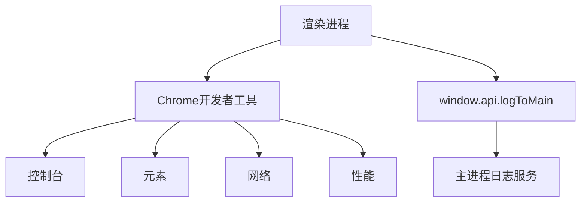
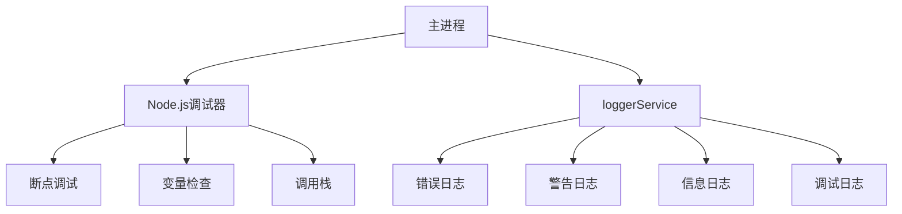
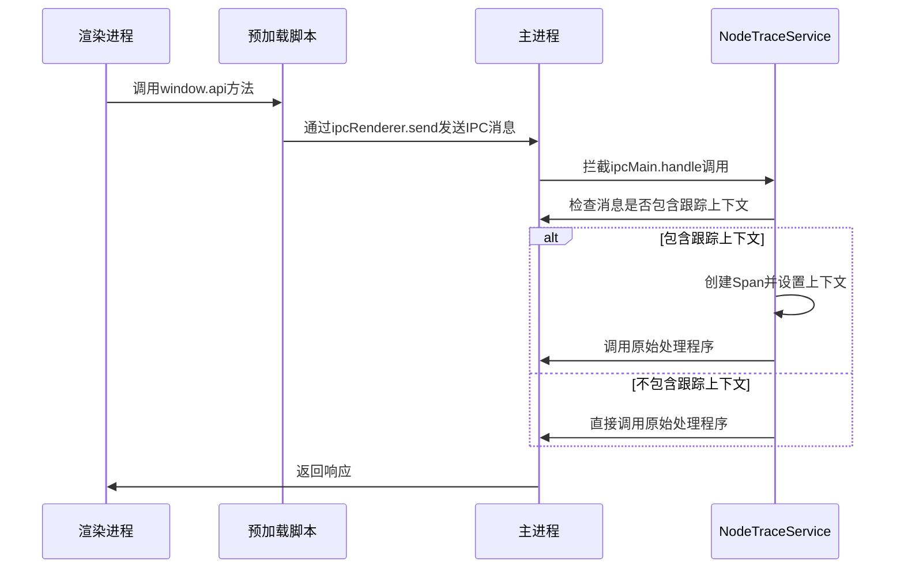
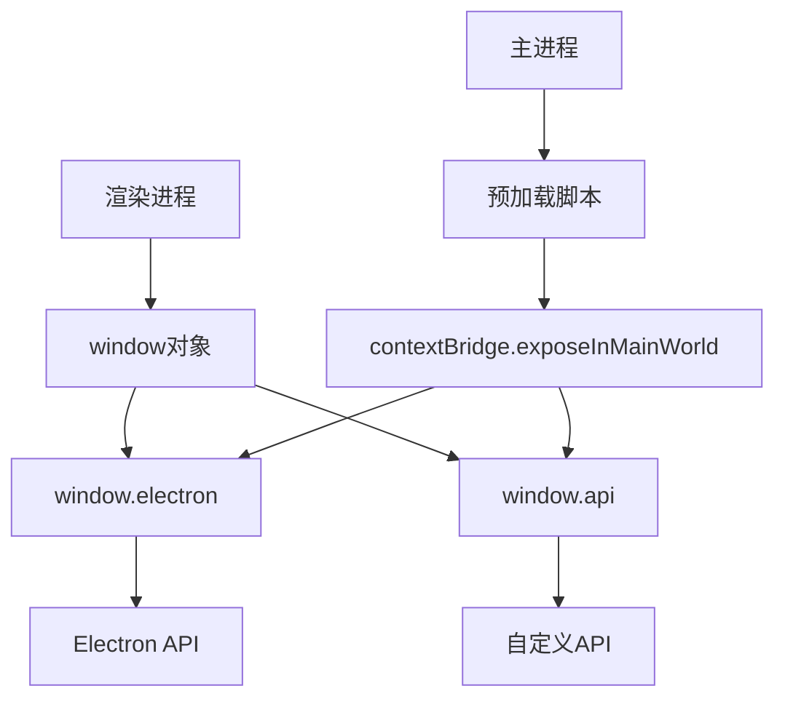
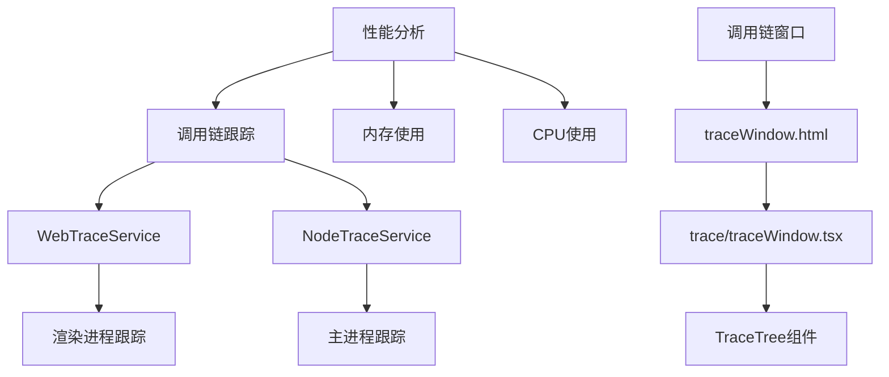
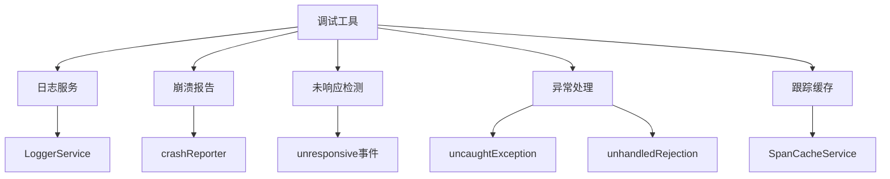

# 调试技巧

<cite>
**本文档引用的文件**
- [IpcChannel.ts](file://packages/shared/IpcChannel.ts)
- [ipc.ts](file://src/main/ipc.ts)
- [NodeTraceService.ts](file://src/main/services/NodeTraceService.ts)
- [LoggerService.ts](file://src/main/services/LoggerService.ts)
- [LoggerService.ts](file://src/renderer/src/services/LoggerService.ts)
- [preload/index.ts](file://src/preload/index.ts)
- [preload.d.ts](file://src/preload/preload.d.ts)
- [electron.vite.config.ts](file://electron.vite.config.ts)
- [traceWindow.html](file://src/renderer/traceWindow.html)
- [WebTraceService.ts](file://src/renderer/src/services/WebTraceService.ts)
- [trace/traceWindow.tsx](file://src/renderer/src/trace/traceWindow.tsx)
- [trace/pages/TraceTree.tsx](file://src/renderer/src/trace/pages/TraceTree.tsx)
- [SpanCacheService.ts](file://src/main/services/SpanCacheService.ts)
</cite>

## 目录
1. [简介](#简介)
2. [渲染进程调试](#渲染进程调试)
3. [主进程调试](#主进程调试)
4. [IPC通信调试](#ipc通信调试)
5. [预加载脚本和上下文隔离调试](#预加载脚本和上下文隔离调试)
6. [性能分析和内存泄漏检测](#性能分析和内存泄漏检测)
7. [实用调试工具和技巧](#实用调试工具和技巧)
8. [结论](#结论)

## 简介
Cherry Studio是一个基于Electron框架的桌面应用程序，采用主进程和渲染进程分离的架构。本指南将详细介绍如何调试Cherry Studio的各个组件，包括使用Chrome开发者工具调试渲染进程、使用Node.js调试器调试主进程、调试IPC（进程间通信）机制、预加载脚本和上下文隔离问题，以及性能分析和内存泄漏检测的方法。

**Section sources**
- [electron.vite.config.ts](file://electron.vite.config.ts#L1-L130)

## 渲染进程调试
Cherry Studio的渲染进程基于React框架构建，可以使用Chrome开发者工具进行调试。在开发模式下，可以通过以下步骤启动调试：

1. 启动Cherry Studio应用
2. 按F12或右键选择"检查"打开开发者工具
3. 使用开发者工具的各个面板进行调试

Cherry Studio在开发模式下集成了CodeInspectorPlugin，支持代码变更时的热重载和实时调试。开发者工具中的控制台会显示渲染进程的日志信息，这些日志通过`window.api`接口发送到主进程。

**Diagram sources**
- [LoggerService.ts](file://src/renderer/src/services/LoggerService.ts#L164-L222)
- [preload/index.ts](file://src/preload/index.ts#L578-L593)

**Section sources**
- [LoggerService.ts](file://src/renderer/src/services/LoggerService.ts#L164-L222)
- [preload/index.ts](file://src/preload/index.ts#L578-L593)

## 主进程调试
主进程是Electron应用的核心，负责管理窗口、系统集成和与操作系统交互。调试主进程需要使用Node.js调试器。

Cherry Studio的主进程调试配置在`electron.vite.config.ts`文件中，开发模式下会自动启用源码映射(sourcemap)。可以通过以下方式调试主进程：

1. 在VS Code中配置launch.json，使用Node.js调试器连接到主进程
2. 使用`console.log`或`loggerService`输出调试信息
3. 监听主进程的异常和未处理的Promise拒绝

主进程中的`LoggerService`提供了详细的日志记录功能，包括错误、警告、信息和调试级别。日志信息会根据配置的级别进行过滤和输出。

**Diagram sources**
- [LoggerService.ts](file://src/main/services/LoggerService.ts#L311-L360)
- [electron.vite.config.ts](file://electron.vite.config.ts#L43-L44)

**Section sources**
- [LoggerService.ts](file://src/main/services/LoggerService.ts#L311-L360)
- [index.ts](file://src/main/index.ts#L101-L112)

## IPC通信调试
IPC（进程间通信）是Electron应用中主进程和渲染进程通信的核心机制。Cherry Studio使用自定义的IPC通道进行通信，这些通道在`IpcChannel.ts`文件中定义。

调试IPC通信的关键是监听和检查消息传递。Cherry Studio在`NodeTraceService.ts`中实现了IPC消息的跟踪功能，通过包装`ipcMain.handle`方法来捕获和处理IPC消息。当IPC消息包含跟踪上下文时，系统会创建相应的Span并记录到跟踪缓存中。

**Diagram sources**
- [IpcChannel.ts](file://packages/shared/IpcChannel.ts)
- [ipc.ts](file://src/main/ipc.ts#L1073-L1083)
- [NodeTraceService.ts](file://src/main/services/NodeTraceService.ts#L33-L46)

**Section sources**
- [IpcChannel.ts](file://packages/shared/IpcChannel.ts)
- [ipc.ts](file://src/main/ipc.ts#L1073-L1083)
- [NodeTraceService.ts](file://src/main/services/NodeTraceService.ts#L33-L46)

## 预加载脚本和上下文隔离调试
预加载脚本是连接渲染进程和主进程的桥梁，负责暴露Electron API给渲染进程。Cherry Studio的预加载脚本位于`src/preload/index.ts`，使用`contextBridge.exposeInMainWorld`方法将API暴露给渲染进程。

上下文隔离是Electron的安全特性，它将渲染进程的JavaScript环境与预加载脚本的环境隔离。调试预加载脚本和上下文隔离问题时需要注意：

1. 确保通过`contextBridge`暴露的API是安全的
2. 处理上下文隔离导致的类型错误
3. 调试预加载脚本中的异常

**Diagram sources**
- [preload/index.ts](file://src/preload/index.ts#L578-L593)
- [preload.d.ts](file://src/preload/preload.d.ts)

**Section sources**
- [preload/index.ts](file://src/preload/index.ts#L578-L593)
- [preload.d.ts](file://src/preload/preload.d.ts)

## 性能分析和内存泄漏检测
Cherry Studio提供了多种性能分析和内存泄漏检测工具。核心是基于OpenTelemetry的跟踪系统，可以在调用链窗口中查看详细的性能数据。

调用链窗口通过`openTraceWindow`函数打开，显示特定主题和跟踪ID的性能数据。系统使用`WebTraceService`和`NodeTraceService`分别跟踪渲染进程和主进程的性能数据。

**Diagram sources**
- [NodeTraceService.ts](file://src/main/services/NodeTraceService.ts#L52-L122)
- [traceWindow.html](file://src/renderer/traceWindow.html)
- [WebTraceService.ts](file://src/renderer/src/services/WebTraceService.ts)
- [trace/traceWindow.tsx](file://src/renderer/src/trace/traceWindow.tsx)

**Section sources**
- [NodeTraceService.ts](file://src/main/services/NodeTraceService.ts#L52-L122)
- [traceWindow.html](file://src/renderer/traceWindow.html)
- [WebTraceService.ts](file://src/renderer/src/services/WebTraceService.ts)

## 实用调试工具和技巧
Cherry Studio集成了多种实用的调试工具和技巧：

1. **日志服务**：主进程和渲染进程都有独立的`LoggerService`，支持不同级别的日志记录
2. **崩溃报告**：使用`crashReporter`收集本地崩溃报告
3. **未响应检测**：监听`webContents`的`unresponsive`事件，收集JavaScript调用栈
4. **异常处理**：在生产模式下全局处理未捕获的异常和未处理的Promise拒绝
5. **跟踪缓存**：使用`SpanCacheService`缓存跟踪数据，支持开发者模式下的性能分析

**Diagram sources**
- [LoggerService.ts](file://src/main/services/LoggerService.ts)
- [index.ts](file://src/main/index.ts#L41-L98)
- [SpanCacheService.ts](file://src/main/services/SpanCacheService.ts)

**Section sources**
- [LoggerService.ts](file://src/main/services/LoggerService.ts)
- [index.ts](file://src/main/index.ts#L41-L98)
- [SpanCacheService.ts](file://src/main/services/SpanCacheService.ts)

## 结论
Cherry Studio提供了全面的调试支持，包括渲染进程调试、主进程调试、IPC通信调试、预加载脚本和上下文隔离调试，以及性能分析和内存泄漏检测。通过合理使用这些工具和技巧，开发者可以快速定位和解决各种问题，提高开发效率和应用质量。