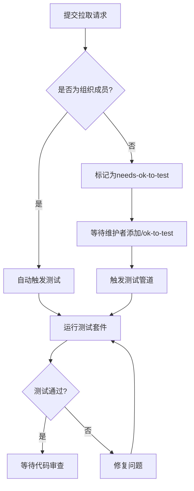
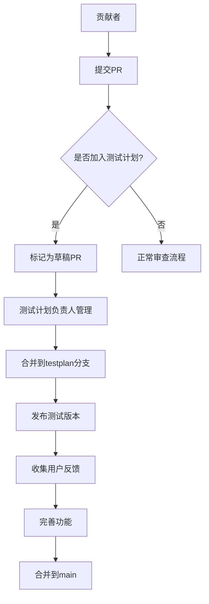

# 贡献流程

<cite>
**本文档引用的文件**  
- [CONTRIBUTING.md](file://CONTRIBUTING.md)
- [README.md](file://README.md)
- [docs/zh/guides/branching-strategy.md](file://docs/zh/guides/branching-strategy.md)
- [docs/zh/guides/development.md](file://docs/zh/guides/development.md)
- [docs/zh/guides/test-plan.md](file://docs/zh/guides/test-plan.md)
- [package.json](file://package.json)
- [CODE_OF_CONDUCT.md](file://CODE_OF_CONDUCT.md)
</cite>

## 目录
1. [简介](#简介)
2. [如何参与贡献](#如何参与贡献)
3. [开始贡献](#开始贡献)
4. [拉取请求流程](#拉取请求流程)
5. [代码审查与合并](#代码审查与合并)
6. [自动化测试机制](#自动化测试机制)
7. [社区互动与产品设计](#社区互动与产品设计)
8. [文档编写与维护](#文档编写与维护)
9. [法律合规要求](#法律合规要求)
10. [最佳实践建议](#最佳实践建议)

## 简介

Cherry Studio 是一个开源的AI桌面客户端，致力于为开发者和用户提供强大的多模型支持与智能交互体验。本项目欢迎来自全球开发者的贡献，无论是代码改进、功能开发、文档完善还是社区支持。本文档详细说明了参与项目贡献的完整流程，帮助新贡献者快速上手并有效参与。

**Section sources**
- [README.md](file://README.md#L1-L326)
- [CONTRIBUTING.md](file://CONTRIBUTING.md#L1-L99)

## 如何参与贡献

Cherry Studio 提供了多种方式供开发者参与项目共建：

- **代码贡献**：开发新功能或优化现有代码，确保符合编码规范并通过所有测试。
- **缺陷修复**：发现并修复软件中的bug，提交修复方案。
- **问题维护**：协助管理GitHub上的问题，包括分类、标记和协助解决。
- **产品设计**：参与产品设计讨论，提升用户体验和界面设计。
- **文档编写**：改进用户手册、API文档和开发者指南。
- **社区维护**：参与社区讨论，解答用户疑问，促进社区活跃度。
- **推广使用**：通过博客、社交媒体等渠道宣传Cherry Studio，吸引更多用户和开发者。

**Section sources**
- [CONTRIBUTING.md](file://CONTRIBUTING.md#L7-L24)
- [README.md](file://README.md#L166-L177)

## 开始贡献

对于初次参与项目的开发者，建议从以下途径入手：

### 从简单问题开始

推荐从标记为 `good-first-issue`、`help-wanted` 或 `kind/bug` 的问题开始。这些标签标识了适合新贡献者的问题，有助于快速熟悉代码库。

### 开发环境搭建

根据[开发者指南](docs/zh/guides/development.md)，设置开发环境：
1. 安装 Node.js v22.x.x
2. 启用 Yarn：`corepack enable` 和 `corepack prepare yarn@4.9.1 --activate`
3. 安装依赖：`yarn install`
4. 复制环境变量文件：`copy .env.example .env`
5. 启动开发服务器：`yarn dev`

### 临时限制

目前项目**暂不接受**涉及Redux数据模型或IndexedDB模式变更的功能拉取请求。核心团队正在专注于架构更新，此类贡献将在v2.0.0版本发布后重新开放。

**Section sources**
- [CONTRIBUTING.md](file://CONTRIBUTING.md#L29-L88)
- [docs/zh/guides/development.md](file://docs/zh/guides/development.md#L1-L74)

## 拉取请求流程

### 分支策略

Cherry Studio 采用结构化分支策略：
- `main`：主开发分支，禁止直接提交
- `release/*`：发布分支，仅接受bug修复和文档更新
- 功能分支：`feature/issue-number-brief-description`
- 修复分支：`fix/issue-number-brief-description`
- 文档分支：`docs/brief-description`

### 创建拉取请求

1. Fork 仓库并克隆到本地
2. 创建新分支进行修改
3. 提交更改并推送到远程分支
4. 在GitHub上创建拉取请求，描述更改内容和原因

### 草稿PR的使用

建议将未完成的PR创建为**草稿拉取请求**（Draft Pull Request）。这样做可以：
- 节省CI资源（草稿PR跳过CI）
- 明确表示PR尚未准备好审查
- 允许早期讨论和方向确认

**Section sources**
- [docs/zh/guides/branching-strategy.md](file://docs/zh/guides/branching-strategy.md#L1-L74)
- [CONTRIBUTING.md](file://CONTRIBUTING.md#L41-L44)

## 代码审查与合并

维护者会尽快审查代码并提供建设性反馈。如果在审查过程中遇到困难或感觉PR未得到足够关注，可通过问题评论或社区渠道联系团队。

拉取请求需要包含相关测试，功能若无测试则视为不存在。所有测试均可在本地运行，无需依赖CI。审查通过后，维护者将合并代码。

**Section sources**
- [CONTRIBUTING.md](file://CONTRIBUTING.md#L57-L59)
- [CONTRIBUTING.md](file://CONTRIBUTING.md#L33-L35)

## 自动化测试机制

自动化测试在拉取请求中扮演重要角色：
- 组织成员开启的PR会自动触发测试（草稿PR除外）
- 新贡献者开启的PR最初会标记为 `needs-ok-to-test` 且不自动测试
- 待组织成员添加 `/ok-to-test` 指令后，测试管道才会被创建

项目使用Vitest进行测试，可通过 `yarn test` 命令运行所有测试，`yarn test:coverage` 生成覆盖率报告。



**Diagram sources**
- [CONTRIBUTING.md](file://CONTRIBUTING.md#L37-L39)
- [package.json](file://package.json#L62-L69)

## 社区互动与产品设计

Cherry Studio 鼓励开发者参与产品设计讨论，共同提升用户体验。社区互动渠道包括：
- GitHub Issues：反馈问题和建议
- Telegram群组：实时交流
- Discord服务器：深度讨论
- QQ群：中文用户交流

开发者可通过这些渠道参与设计讨论，提出改进建议，或协助解答其他用户的问题。

**Section sources**
- [README.md](file://README.md#L68-L69)
- [CONTRIBUTING.md](file://CONTRIBUTING.md#L17-L21)

## 文档编写与维护

文档贡献是项目发展的重要组成部分。贡献者可以：
- 改进用户手册和使用指南
- 完善API文档
- 编写开发者教程
- 翻译多语言文档

文档文件位于 `docs/` 目录下，采用Markdown格式。对于文档更新，建议创建 `docs/brief-description` 格式的分支。

**Section sources**
- [CONTRIBUTING.md](file://CONTRIBUTING.md#L19-L20)
- [README.md](file://README.md#L37)

## 法律合规要求

为确保项目合法合规，每位贡献者必须通过签署提交（sign-off）来确认其有权合法贡献代码。签署提交表明贡献者遵守项目许可协议。

生成签署提交的命令如下：
```
git commit --signoff -m "您的提交信息"
```

此要求确保所有贡献都符合AGPL-3.0许可证的规定。

**Section sources**
- [CONTRIBUTING.md](file://CONTRIBUTING.md#L46-L55)
- [README.md](file://README.md#L292-L296)

## 最佳实践建议

### 测试先行

在开发新功能时，应同时考虑可测试性。所有功能都应有相应的单元测试和功能测试覆盖。

### 及时沟通

在提交PR前，建议先与开发者沟通，讨论实现方案或寻求帮助，避免重复工作。

### 遵守行为准则

所有参与者必须遵守[行为准则](CODE_OF_CONDUCT.md)，营造开放、包容的社区环境。禁止骚扰、歧视性言论和不专业行为。

### 参与测试计划

贡献者可参与测试计划，帮助提供更稳定的应用体验。测试计划分为RC版（预览版）和Beta版（测试版）通道。



**Diagram sources**
- [docs/zh/guides/test-plan.md](file://docs/zh/guides/test-plan.md#L1-L102)
- [CONTRIBUTING.md](file://CONTRIBUTING.md#L61-L63)