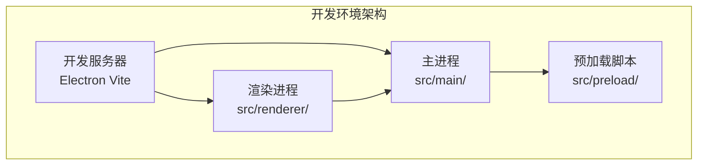
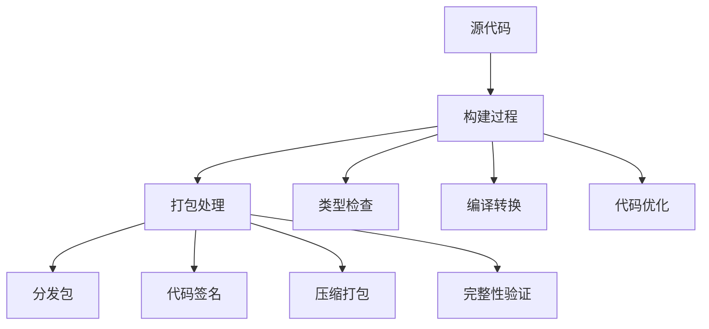
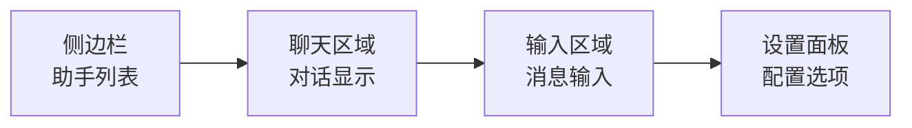
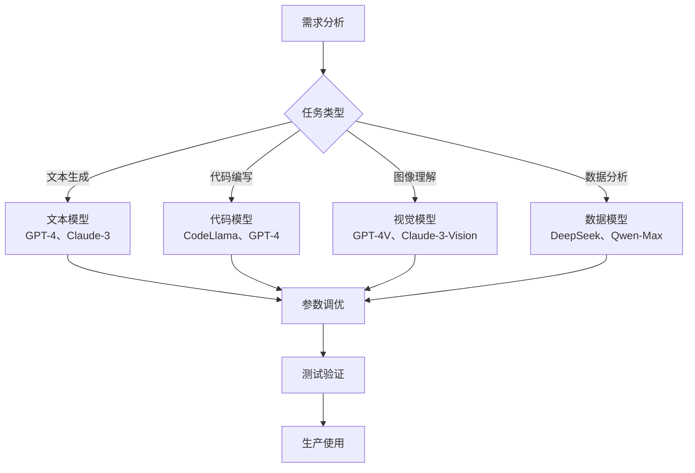
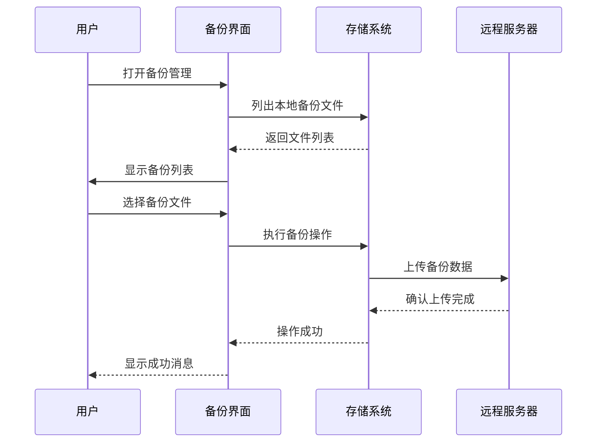

# Cherry Studio 快速开始指南

<cite>
**本文档引用的文件**
- [package.json](file://package.json)
- [README.md](file://README.md)
- [electron.vite.config.ts](file://electron.vite.config.ts)
- [electron-builder.yml](file://electron-builder.yml)
- [src/main/index.ts](file://src/main/index.ts)
- [src/renderer/src/entryPoint.tsx](file://src/renderer/src/entryPoint.tsx)
- [src/renderer/src/config/providers.ts](file://src/renderer/src/config/providers.ts)
- [src/renderer/src/config/models/index.ts](file://src/renderer/src/config/models/index.ts)
- [src/renderer/src/components/LocalBackupManager.tsx](file://src/renderer/src/components/LocalBackupManager.tsx)
</cite>

## 目录
1. [简介](#简介)
2. [系统要求](#系统要求)
3. [克隆项目](#克隆项目)
4. [安装依赖](#安装依赖)
5. [启动开发环境](#启动开发环境)
6. [构建和打包](#构建和打包)
7. [基本使用](#基本使用)
8. [AI模型配置](#ai模型配置)
9. [备份与恢复](#备份与恢复)
10. [故障排除](#故障排除)

## 简介

Cherry Studio 是一个功能强大的桌面AI助手客户端，支持多个LLM提供商，可在Windows、Mac和Linux平台上运行。本指南将帮助您快速上手Cherry Studio，从项目克隆到日常使用。

### 核心特性
- **多样化的LLM提供商支持**：OpenAI、Gemini、Anthropic等主流云服务
- **AI助手与对话**：300+预配置AI助手，支持自定义助手创建
- **文档与数据处理**：支持文本、图片、Office、PDF等多种格式
- **实用工具集成**：全局搜索、话题管理系统、AI翻译等
- **跨平台支持**：Windows、Mac、Linux全平台兼容

## 系统要求

### 基础要求
- **操作系统**：Windows 10+、macOS 10.15+、Linux (Ubuntu 18.04+)
- **内存**：至少4GB RAM（推荐8GB以上）
- **存储空间**：至少2GB可用磁盘空间
- **Node.js**：版本22.0.0或更高

### 推荐配置
- **处理器**：Intel i5或AMD Ryzen 5及以上
- **内存**：8GB RAM或更多
- **显卡**：支持OpenGL的图形卡（用于硬件加速）

## 克隆项目

### 使用Git克隆

```bash
# 克隆主仓库
git clone https://github.com/CherryHQ/cherry-studio.git
cd cherry-studio

# 或使用SSH（如果已配置）
git clone git@github.com:CherryHQ/cherry-studio.git
cd cherry-studio
```

### 验证克隆成功

```bash
# 检查项目结构
ls -la

# 查看项目版本
npm version
```

**章节来源**
- [package.json](file://package.json#L1-L430)

## 安装依赖

Cherry Studio使用yarn作为包管理器，支持工作区（workspaces）管理。

### 使用yarn安装

```bash
# 安装所有依赖
yarn install

# 或使用npm（不推荐）
npm install
```

### 包管理器选择

项目配置了两种包管理器：
- **推荐**：yarn 4.9.1（默认）
- **备用**：npm（兼容模式）

### 依赖管理策略

项目采用工作区架构，主要包位于`packages/`目录下：
- `packages/aiCore/`：AI核心功能
- `packages/ai-sdk-provider/`：AI SDK提供者
- `packages/mcp-trace/`：MCP追踪功能
- `packages/extension-table-plus/`：表格扩展

**章节来源**
- [package.json](file://package.json#L12-L26)

## 启动开发环境

### 开发服务器启动

Cherry Studio使用Electron Vite进行开发，支持热重载和实时调试。

```bash
# 启动开发环境
yarn dev

# 或使用npm
npm run dev
```

### 开发环境特性

- **热重载**：修改代码后自动刷新
- **开发者工具**：内置React和Redux开发者工具
- **源码映射**：完整的调试支持

### 调试模式

```bash
# 启动调试模式
yarn debug

# 在浏览器中访问：http://localhost:9222
```

### 主进程与渲染进程



**图表来源**
- [electron.vite.config.ts](file://electron.vite.config.ts#L18-L130)
- [src/main/index.ts](file://src/main/index.ts#L1-L257)
- [src/renderer/src/entryPoint.tsx](file://src/renderer/src/entryPoint.tsx#L1-L11)

### 构建配置

开发环境使用以下配置：
- **主进程**：支持CommonJS模块
- **渲染进程**：React + TypeScript
- **预加载脚本**：类型安全的IPC通信

**章节来源**
- [electron.vite.config.ts](file://electron.vite.config.ts#L18-L130)

## 构建和打包

### 构建应用程序

```bash
# 类型检查
yarn typecheck

# 生产环境构建
yarn build
```

### 平台特定构建

#### Windows构建
```bash
# 所有Windows平台
yarn build:win

# 仅x64架构
yarn build:win:x64

# 仅ARM64架构  
yarn build:win:arm64
```

#### macOS构建
```bash
# 所有macOS平台
yarn build:mac

# 仅Intel芯片
yarn build:mac:x64

# 仅Apple Silicon
yarn build:mac:arm64
```

#### Linux构建
```bash
# 所有Linux平台
yarn build:linux

# 仅x64架构
yarn build:linux:x64

# 仅ARM64架构
yarn build:linux:arm64
```

### 构建输出

构建完成后，安装包位于`dist/`目录：
- **Windows**：`Cherry Studio-{version}-{arch}.exe`
- **macOS**：`Cherry Studio-{version}-{arch}.dmg`
- **Linux**：`Cherry Studio-{version}-{arch}.AppImage`

### 打包配置



**图表来源**
- [electron-builder.yml](file://electron-builder.yml#L75-L120)

**章节来源**
- [package.json](file://package.json#L27-L42)
- [electron-builder.yml](file://electron-builder.yml#L1-L242)

## 基本使用

### 启动应用程序

首次启动后，您将看到Cherry Studio的主界面。

### 创建第一个对话

1. **选择AI助手**：点击左侧侧边栏的助手列表
2. **输入消息**：在底部输入框中键入您的问题
3. **发送消息**：按下回车键或点击发送按钮

### 基本界面导航



### 对话管理

- **新建对话**：点击"+"按钮或使用快捷键
- **保存对话**：系统自动保存，也可手动导出
- **删除对话**：右键点击对话标题进行删除

### 设置配置

通过设置面板可以：
- 配置AI提供商密钥
- 设置默认模型参数
- 自定义界面主题
- 管理本地备份

**章节来源**
- [src/renderer/src/config/providers.ts](file://src/renderer/src/config/providers.ts#L1-L800)

## AI模型配置

### 支持的AI提供商

Cherry Studio支持超过50个AI提供商：

| 提供商类别 | 支持的提供商 |
|-----------|-------------|
| **云服务提供商** | OpenAI、Gemini、Anthropic、Azure OpenAI |
| **国内服务商** | 百度文心一言、阿里通义千问、智谱AI、月之暗面 |
| **开源社区** | Ollama、LM Studio、Hugging Face |
| **专业服务** | AWS Bedrock、Google Vertex AI、Groq |

### 配置AI提供商

#### 1. 获取API密钥
- 访问各提供商官网注册账号
- 在控制台生成API密钥
- 复制密钥字符串

#### 2. 配置提供商
```typescript
// 示例：配置OpenAI提供商
const openaiProvider = {
  id: 'openai',
  name: 'OpenAI',
  type: 'openai',
  apiKey: 'your-api-key-here',
  apiHost: 'https://api.openai.com',
  models: ['gpt-4', 'gpt-3.5-turbo']
}
```

#### 3. 验证连接
- 在设置中测试API密钥有效性
- 检查可用模型列表
- 测试对话功能

### 模型选择指南



### 本地模型部署

对于隐私敏感场景，可部署本地模型：

#### Ollama部署
```bash
# 安装Ollama
curl -fsSL https://ollama.ai/install.sh | sh

# 下载模型
ollama pull llama2
ollama pull codellama
ollama pull mistral
```

#### LM Studio部署
1. 下载并安装LM Studio
2. 在应用中下载所需模型
3. Cherry Studio自动检测本地服务

**章节来源**
- [src/renderer/src/config/providers.ts](file://src/renderer/src/config/providers.ts#L65-L700)
- [src/renderer/src/config/models/index.ts](file://src/renderer/src/config/models/index.ts#L1-L11)

## 备份与恢复

### 数据备份策略

Cherry Studio提供多种数据备份方式：

#### 本地备份
- **位置**：默认在应用数据目录
- **格式**：JSON格式的完整数据集
- **频率**：自动定期备份

#### WebDAV备份
- **协议**：支持WebDAV协议的云存储
- **配置**：FTP、Nextcloud、ownCloud等
- **同步**：自动同步最新数据

### 备份管理界面



**图表来源**
- [src/renderer/src/components/LocalBackupManager.tsx](file://src/renderer/src/components/LocalBackupManager.tsx#L1-L159)

### 备份操作步骤

#### 创建本地备份
1. 打开设置面板
2. 选择"数据备份"选项
3. 点击"创建备份"按钮
4. 选择保存位置和文件名
5. 等待备份完成

#### 恢复数据
1. 打开备份管理界面
2. 选择要恢复的备份文件
3. 点击"恢复"按钮
4. 确认恢复操作
5. 应用重启生效

#### WebDAV同步
1. 配置WebDAV服务器地址
2. 输入认证信息
3. 选择同步文件夹
4. 启动自动同步

### 数据恢复最佳实践

- **定期备份**：建议每天自动备份
- **多地存放**：同时保存本地和云端备份
- **测试恢复**：定期测试备份文件的可恢复性
- **版本管理**：保留多个历史备份版本

**章节来源**
- [src/renderer/src/components/LocalBackupManager.tsx](file://src/renderer/src/components/LocalBackupManager.tsx#L22-L159)

## 故障排除

### 常见问题及解决方案

#### 1. 启动失败
**症状**：应用程序无法正常启动
**解决方法**：
```bash
# 清理缓存
yarn cache clean

# 重新安装依赖
rm -rf node_modules
yarn install

# 清理Electron缓存
rm -rf ~/Library/Application\ Support/CherryStudio
```

#### 2. API连接失败
**症状**：无法连接到AI提供商
**解决方法**：
- 检查网络连接
- 验证API密钥有效性
- 确认提供商服务状态
- 检查防火墙设置

#### 3. 性能问题
**症状**：响应缓慢或界面卡顿
**解决方法**：
- 关闭不必要的对话标签
- 减少并发请求数量
- 清理应用缓存
- 升级硬件配置

#### 4. 模型加载失败
**症状**：本地模型无法加载
**解决方法**：
- 检查模型文件完整性
- 验证本地服务运行状态
- 重新下载模型文件
- 检查系统资源占用

### 日志查看

```bash
# 查看主进程日志
yarn dev

# 查看详细错误信息
DEBUG=electron:* yarn dev
```

### 获取帮助

- **官方文档**：https://docs.cherry-ai.com
- **GitHub Issues**：提交bug报告和功能请求
- **社区支持**：加入Telegram群组或Discord服务器
- **企业支持**：联系bd@cherry-ai.com获取商业支持

### 系统要求验证

```bash
# 检查Node.js版本
node --version

# 检查yarn版本
yarn --version

# 检查系统架构
uname -a
```

通过本指南，您应该能够顺利安装、配置和使用Cherry Studio。如遇到任何问题，请参考官方文档或寻求社区帮助。