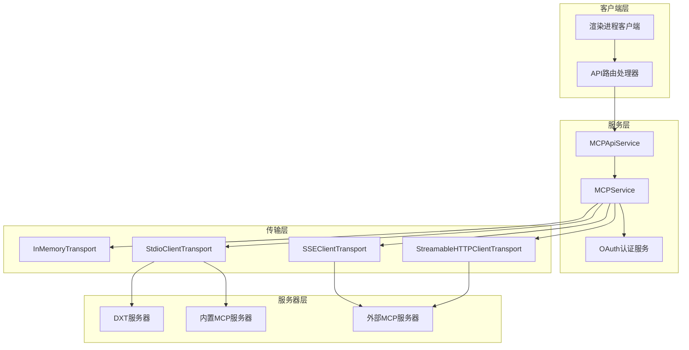
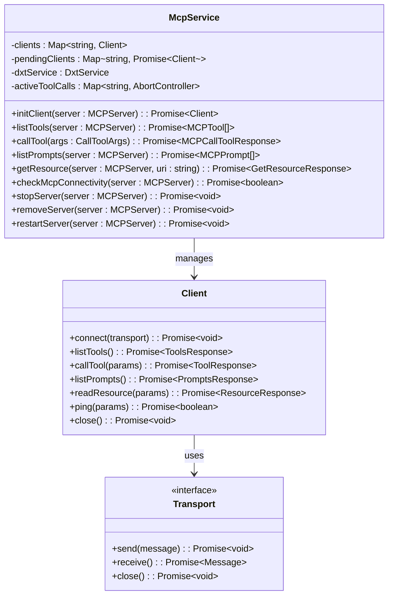
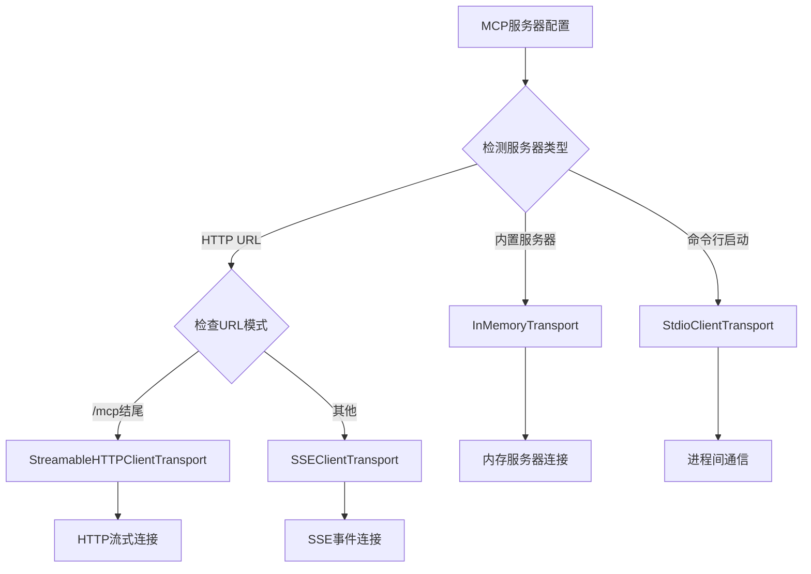
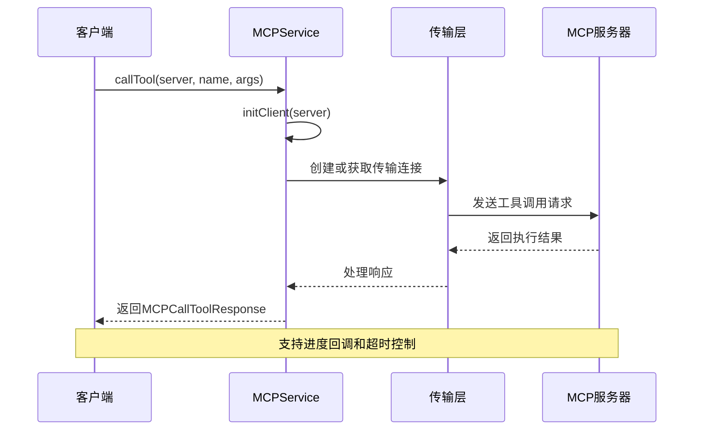
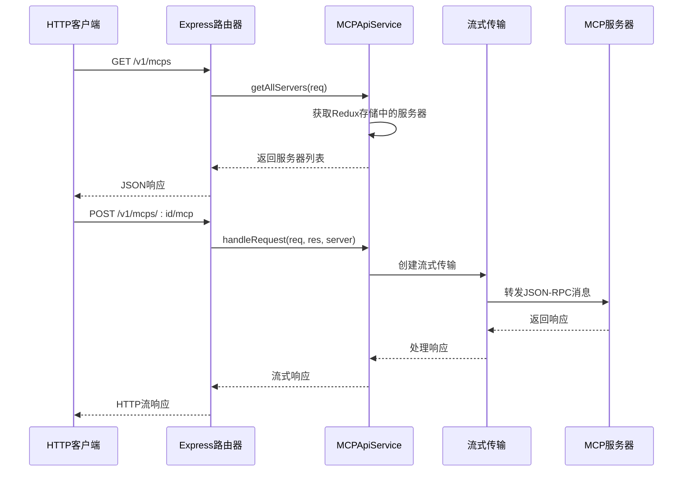
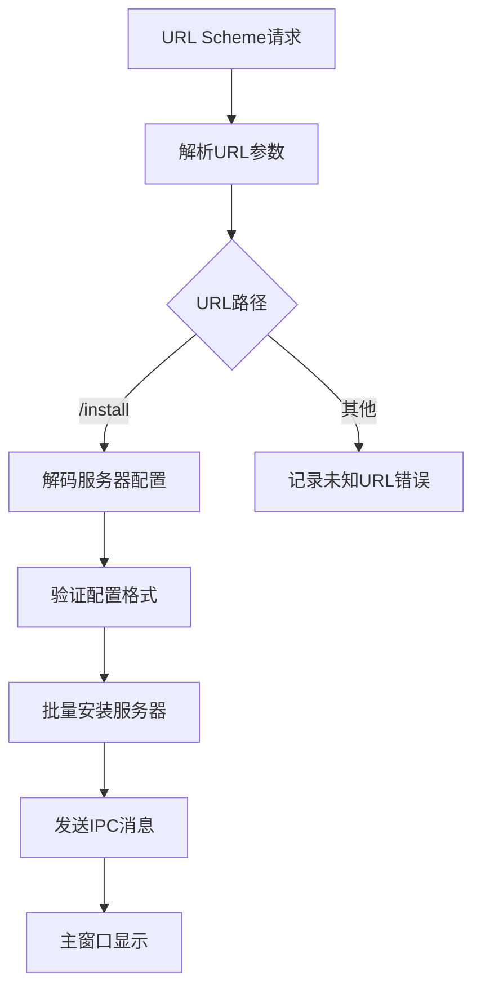
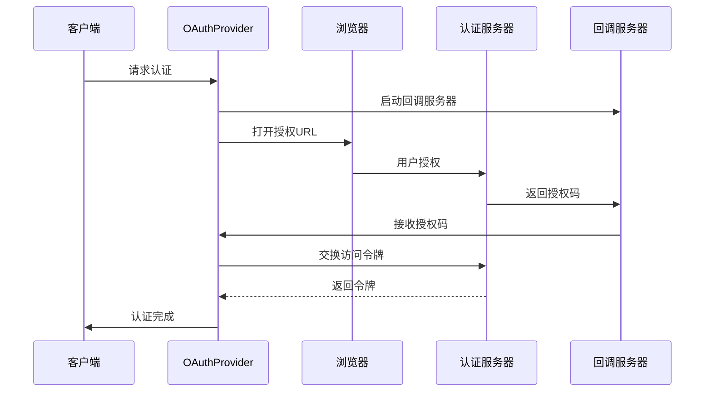
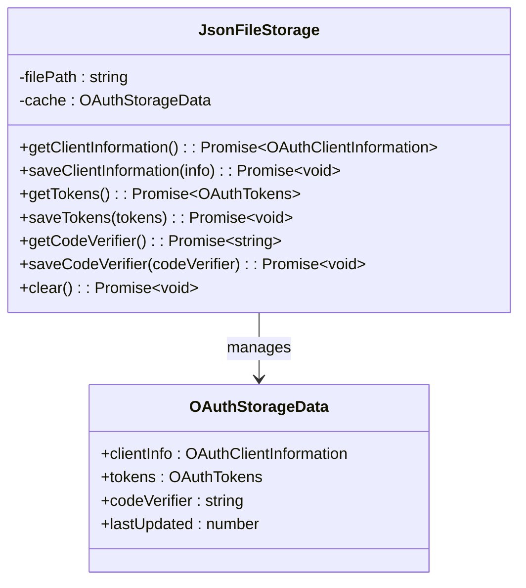
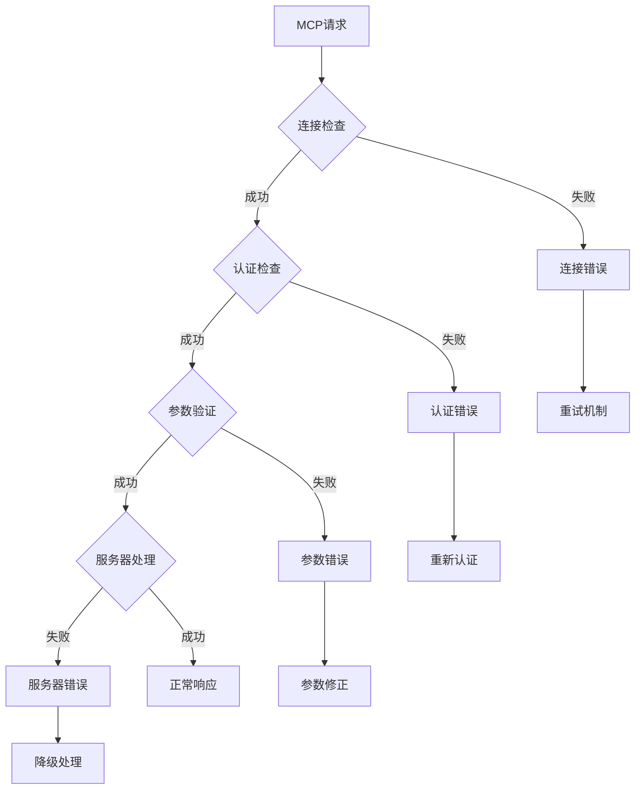
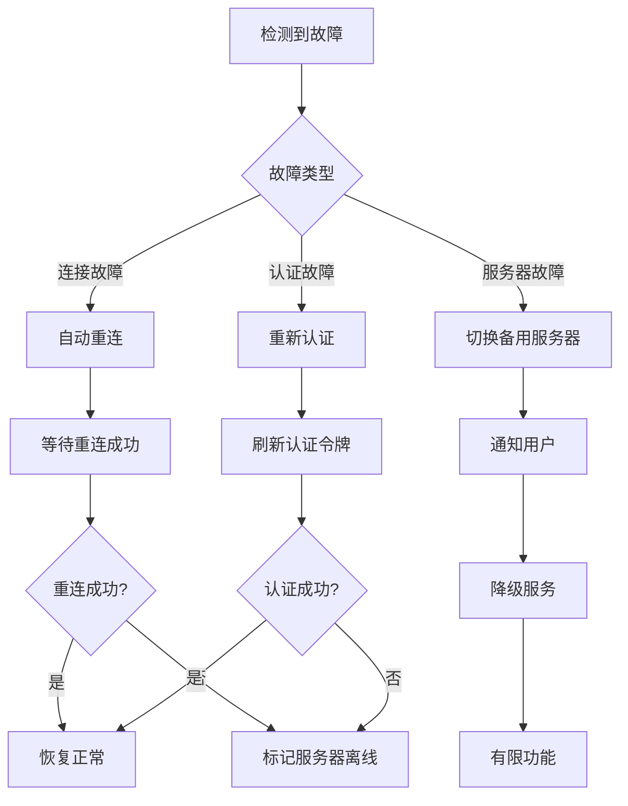

# MCP API集成

<cite>
**本文档引用的文件**
- [MCPService.ts](file://src/main/services/MCPService.ts)
- [mcp.ts](file://src/main/apiServer/services/mcp.ts)
- [mcp.ts](file://src/main/apiServer/routes/mcp.ts)
- [fetch.ts](file://src/main/mcpServers/fetch.ts)
- [factory.ts](file://src/main/mcpServers/factory.ts)
- [mcp-install.ts](file://src/main/services/urlschema/mcp-install.ts)
- [provider.ts](file://src/main/services/mcp/oauth/provider.ts)
- [storage.ts](file://src/main/services/mcp/oauth/storage.ts)
- [memory.ts](file://src/main/mcpServers/memory.ts)
- [filesystem.ts](file://src/main/mcpServers/filesystem.ts)
- [mcp.ts](file://src/renderer/src/types/mcp.ts)
</cite>

## 目录
1. [简介](#简介)
2. [系统架构概览](#系统架构概览)
3. [核心组件分析](#核心组件分析)
4. [MCPService.ts公共API接口](#mcpservicets公共api接口)
5. [HTTP请求处理机制](#http请求处理机制)
6. [URL方案安装支持](#url方案安装支持)
7. [认证与安全机制](#认证与安全机制)
8. [客户端集成指南](#客户端集成指南)
9. [错误处理与监控](#错误处理与监控)
10. [最佳实践与优化](#最佳实践与优化)
11. [故障排除指南](#故障排除指南)

## 简介

Cherry Studio提供了完整的Model Context Protocol (MCP) API集成功能，允许开发者轻松集成外部MCP服务到应用程序中。该系统支持多种传输协议（HTTP、SSE、STDIO），提供统一的API接口，并具备完善的认证、缓存和监控机制。

MCP集成系统的核心目标是：
- 提供标准化的MCP服务发现和调用接口
- 支持多种传输协议和认证方式
- 实现高效的缓存和性能优化
- 确保安全的OAuth认证流程
- 提供完整的错误处理和监控能力

## 系统架构概览

Cherry Studio的MCP集成采用分层架构设计，确保了系统的可扩展性和维护性：



**图表来源**
- [MCPService.ts](file://src/main/services/MCPService.ts#L136-L156)
- [mcp.ts](file://src/main/apiServer/services/mcp.ts#L40-L50)

## 核心组件分析

### MCPService - 主要服务类

MCPService是系统的核心组件，负责管理所有MCP服务器的生命周期和通信：



**图表来源**
- [MCPService.ts](file://src/main/services/MCPService.ts#L136-L156)
- [MCPService.ts](file://src/main/services/MCPService.ts#L227-L278)

### 传输协议支持

系统支持多种传输协议，每种协议适用于不同的使用场景：



**图表来源**
- [MCPService.ts](file://src/main/services/MCPService.ts#L227-L278)

**章节来源**
- [MCPService.ts](file://src/main/services/MCPService.ts#L136-L923)
- [factory.ts](file://src/main/mcpServers/factory.ts#L17-L55)

## MCPService.ts公共API接口

### 服务发现接口

MCPService提供了完整的服务发现功能，支持动态查询和缓存：

| 方法 | 参数 | 返回值 | 描述 |
|------|------|--------|------|
| `listTools` | `server: MCPServer` | `Promise<MCPTool[]>` | 获取服务器可用工具列表，带5分钟缓存 |
| `listPrompts` | `server: MCPServer` | `Promise<MCPPrompt[]>` | 获取服务器可用提示列表，带60分钟缓存 |
| `listResources` | `server: MCPServer` | `Promise<MCPResource[]>` | 获取服务器可用资源列表，带缓存 |
| `getServerVersion` | `server: MCPServer` | `Promise<string>` | 获取服务器版本信息 |

### 工具调用接口

工具调用是MCP集成的核心功能，支持同步和异步执行：



**图表来源**
- [MCPService.ts](file://src/main/services/MCPService.ts#L660-L716)

### 状态管理接口

系统提供了完整的服务器状态管理功能：

| 方法 | 功能 | 使用场景 |
|------|------|----------|
| `checkMcpConnectivity` | 连接性检查 | 服务健康监控 |
| `stopServer` | 停止服务器 | 资源清理 |
| `removeServer` | 移除服务器 | 配置更新 |
| `restartServer` | 重启服务器 | 故障恢复 |
| `cleanup` | 清理所有连接 | 应用关闭 |

**章节来源**
- [MCPService.ts](file://src/main/services/MCPService.ts#L590-L716)

## HTTP请求处理机制

### API路由层

Cherry Studio提供了RESTful API接口来管理MCP服务器：



**图表来源**
- [mcp.ts](file://src/main/apiServer/routes/mcp.ts#L45-L156)
- [mcp.ts](file://src/main/apiServer/services/mcp.ts#L122-L177)

### 请求处理流程

HTTP请求处理遵循以下流程：

1. **身份验证**：检查请求头中的认证信息
2. **服务器验证**：确认目标服务器存在且激活
3. **会话管理**：建立或复用流式传输会话
4. **消息转发**：将JSON-RPC消息转发给MCP服务器
5. **响应处理**：处理服务器响应并返回给客户端

### 错误响应格式

系统提供标准化的错误响应格式：

| HTTP状态码 | 错误类型 | 描述 |
|------------|----------|------|
| 404 | `server_not_found` | 服务器不存在 |
| 503 | `servers_unavailable` | 服务不可用 |
| 503 | `server_info_unavailable` | 服务器信息不可用 |

**章节来源**
- [mcp.ts](file://src/main/apiServer/routes/mcp.ts#L1-L156)
- [mcp.ts](file://src/main/apiServer/services/mcp.ts#L1-L186)

## URL方案安装支持

### 协议URL处理

Cherry Studio支持通过自定义URL方案（cherrystudio://mcp）安装MCP服务器：



**图表来源**
- [mcp-install.ts](file://src/main/services/urlschema/mcp-install.ts#L39-L85)

### 安装配置格式

支持多种配置格式的服务器安装：

```typescript
// 单个服务器配置
{
  "command": "npx",
  "args": ["-y", "@modelcontextprotocol/server-everything"]
}

// 批量服务器配置
{
  "mcpServers": {
    "everything": {
      "command": "npx",
      "args": ["-y", "@modelcontextprotocol/server-everything"]
    },
    "filesystem": {
      "command": "uvx",
      "args": ["@modelcontextprotocol/server-filesystem"],
      "env": {"ALLOWED_DIRS": "/home/user"}
    }
  }
}
```

### 安全验证机制

安装过程包含多层安全验证：

1. **URL验证**：确保使用cherrystudio协议
2. **参数验证**：检查必需参数的存在性
3. **配置验证**：验证服务器配置的有效性
4. **权限检查**：确认用户有安装权限

**章节来源**
- [mcp-install.ts](file://src/main/services/urlschema/mcp-install.ts#L1-L86)

## 认证与安全机制

### OAuth认证流程

系统实现了完整的OAuth 2.0认证流程：



**图表来源**
- [provider.ts](file://src/main/services/mcp/oauth/provider.ts#L19-L86)
- [storage.ts](file://src/main/services/mcp/oauth/storage.ts#L15-L124)

### 认证提供商配置

OAuth提供商支持灵活的配置选项：

| 配置项 | 默认值 | 描述 |
|--------|--------|------|
| `callbackPort` | 12346 | 回调服务器端口 |
| `callbackPath` | `/oauth/callback` | 回调路径 |
| `clientName` | `Cherry Studio` | 客户端名称 |
| `clientUri` | GitHub仓库地址 | 客户端URI |

### 安全存储机制

认证令牌和客户端信息采用加密存储：



**图表来源**
- [storage.ts](file://src/main/services/mcp/oauth/storage.ts#L15-L124)

**章节来源**
- [provider.ts](file://src/main/services/mcp/oauth/provider.ts#L1-L86)
- [storage.ts](file://src/main/services/mcp/oauth/storage.ts#L1-L124)

## 客户端集成指南

### 基本集成步骤

1. **服务器配置**：定义MCP服务器的基本信息
2. **传输选择**：根据需求选择合适的传输协议
3. **认证设置**：配置必要的认证信息
4. **连接建立**：初始化MCP客户端连接
5. **工具调用**：执行具体的MCP操作

### 服务器配置示例

```typescript
// HTTP服务器配置
const httpServer: MCPServer = {
  name: "My HTTP MCP Server",
  baseUrl: "https://api.example.com/mcp",
  type: "streamableHttp",
  headers: {
    "Authorization": "Bearer YOUR_TOKEN",
    "Content-Type": "application/json"
  }
};

// 命令行服务器配置
const cliServer: MCPServer = {
  name: "My CLI MCP Server",
  command: "npx",
  args: ["-y", "@modelcontextprotocol/server-everything"],
  env: {
    NODE_ENV: "production"
  }
};
```

### 工具调用示例

```typescript
// 调用工具的基本流程
async function callMCPTool(server: MCPServer, toolName: string, args: any) {
  try {
    const result = await mcpService.callTool(null, {
      server,
      name: toolName,
      args: args
    });
    
    console.log("工具执行结果:", result);
    return result;
  } catch (error) {
    console.error("工具调用失败:", error);
    throw error;
  }
}
```

### 实时流式响应处理

对于支持流式响应的MCP服务器，系统提供了完整的进度回调机制：

```typescript
// 处理流式响应
const result = await mcpService.callTool(null, {
  server,
  name: "long_running_operation",
  args: { /* 参数 */ },
  callId: "unique-call-id"
});

// 进度回调处理
windowService.getMainWindow()?.webContents.send(
  IpcChannel.Mcp_Progress, 
  {
    callId: "unique-call-id",
    progress: 0.5
  }
);
```

### 错误码处理

系统定义了标准的错误码体系：

| 错误码 | 类型 | 描述 |
|--------|------|------|
| `server_not_found` | 404 | 服务器未找到 |
| `servers_unavailable` | 503 | 服务器不可用 |
| `server_info_unavailable` | 503 | 服务器信息不可用 |
| `invalid_params` | 400 | 参数无效 |
| `internal_error` | 500 | 内部错误 |

**章节来源**
- [MCPService.ts](file://src/main/services/MCPService.ts#L660-L716)

## 错误处理与监控

### 错误分类与处理

系统实现了分层的错误处理机制：



### 缓存策略

系统采用智能缓存策略提升性能：

| 缓存类型 | TTL | 触发条件 |
|----------|-----|----------|
| 工具列表 | 5分钟 | 首次查询后 |
| 提示列表 | 60分钟 | 首次查询后 |
| 资源列表 | 10分钟 | 首次查询后 |
| 服务器信息 | 30秒 | 首次查询后 |

### 监控指标

系统收集关键监控指标：

- **连接成功率**：服务器连接的成功率统计
- **响应时间**：各操作的平均响应时间
- **错误率**：各类错误的发生频率
- **缓存命中率**：缓存系统的效率指标
- **并发连接数**：当前活跃的连接数量

### 日志记录

系统提供详细的日志记录功能：

```typescript
// 服务器级别日志
const serverLogger = getServerLogger(server, { 
  tool: "my_tool", 
  callId: "unique-id" 
});

serverLogger.debug("工具调用开始");
serverLogger.error("工具调用失败", error);
```

**章节来源**
- [MCPService.ts](file://src/main/services/MCPService.ts#L590-L716)

## 最佳实践与优化

### 性能优化建议

1. **合理使用缓存**：充分利用内置缓存机制减少重复请求
2. **连接池管理**：保持长期连接避免频繁重建
3. **批量操作**：尽可能使用批量API减少网络开销
4. **超时设置**：为长时间运行的操作设置合理的超时时间

### 安全最佳实践

1. **认证令牌保护**：妥善保管OAuth令牌，定期刷新
2. **输入验证**：对所有用户输入进行严格验证
3. **权限控制**：实施最小权限原则
4. **网络安全**：使用HTTPS确保传输安全

### 扩展开发指南

开发新的MCP服务器插件：

```typescript
// 新服务器插件模板
class CustomMCPServer {
  public server: Server;
  
  constructor() {
    this.server = new Server(
      { name: "custom-server", version: "1.0.0" },
      { capabilities: {} }
    );
    
    this.setupRequestHandlers();
  }
  
  private setupRequestHandlers() {
    this.server.setRequestHandler(ListToolsRequestSchema, async () => {
      return {
        tools: [
          {
            name: "custom_tool",
            description: "自定义工具描述",
            inputSchema: {
              type: "object",
              properties: {
                param1: { type: "string" }
              }
            }
          }
        ]
      };
    });
  }
}
```

### 配置管理

推荐的配置管理模式：

1. **环境变量**：敏感配置通过环境变量传递
2. **配置文件**：非敏感配置集中管理
3. **动态配置**：支持运行时配置更新
4. **配置验证**：严格的配置格式验证

## 故障排除指南

### 常见问题诊断

| 问题症状 | 可能原因 | 解决方案 |
|----------|----------|----------|
| 服务器连接失败 | 网络问题或服务器不可用 | 检查网络连接和服务器状态 |
| 认证失败 | 令牌过期或配置错误 | 刷新令牌或重新配置认证 |
| 工具调用超时 | 服务器响应慢或网络延迟 | 增加超时时间或优化网络 |
| 缓存失效 | 缓存数据不一致 | 清理缓存或调整TTL |

### 调试工具

1. **日志分析**：查看详细的服务器日志
2. **网络监控**：监控网络连接状态
3. **性能分析**：分析响应时间和资源使用
4. **配置验证**：验证服务器配置的正确性

### 故障恢复

系统提供了自动故障恢复机制：



### 支持资源

- **官方文档**：完整的MCP协议规范
- **社区论坛**：技术问题讨论平台
- **GitHub Issues**：Bug报告和功能请求
- **技术支持**：专业的技术咨询服务

**章节来源**
- [MCPService.ts](file://src/main/services/MCPService.ts#L590-L716)
- [memory.ts](file://src/main/mcpServers/memory.ts#L1-L715)
- [filesystem.ts](file://src/main/mcpServers/filesystem.ts#L1-L653)