# MCP服务

<cite>
**本文档引用的文件**   
- [MCPService.ts](file://src/main/services/MCPService.ts)
- [factory.ts](file://src/main/mcpServers/factory.ts)
- [brave-search.ts](file://src/main/mcpServers/brave-search.ts)
- [dify-knowledge.ts](file://src/main/mcpServers/dify-knowledge.ts)
- [fetch.ts](file://src/main/mcpServers/fetch.ts)
- [memory.ts](file://src/main/mcpServers/memory.ts)
- [python.ts](file://src/main/mcpServers/python.ts)
- [sequentialthinking.ts](file://src/main/mcpServers/sequentialthinking.ts)
- [mcp.ts](file://src/main/apiServer/routes/mcp.ts)
- [mcp.ts](file://src/main/apiServer/services/mcp.ts)
- [mcp.ts](file://src/main/utils/mcp.ts)
- [types.ts](file://src/renderer/src/types/mcp.ts)
</cite>

## 目录
1. [简介](#简介)
2. [架构设计](#架构设计)
3. [核心功能](#核心功能)
4. [内置MCP服务器实现](#内置mcp服务器实现)
5. [接口定义与数据流](#接口定义与数据流)
6. [错误处理策略](#错误处理策略)
7. [性能优化建议](#性能优化建议)
8. [系统集成](#系统集成)
9. [常见问题与调试](#常见问题与调试)

## 简介
MCP（Model Control Protocol）服务是Cherry Studio的核心组件，用于扩展AI模型的功能。它通过标准化的协议与各种外部服务和工具进行交互，为AI模型提供丰富的功能支持。MCP服务支持多种通信方式，包括stdio、HTTP流式传输和内存内通信，能够灵活地集成各种类型的服务器。

## 架构设计

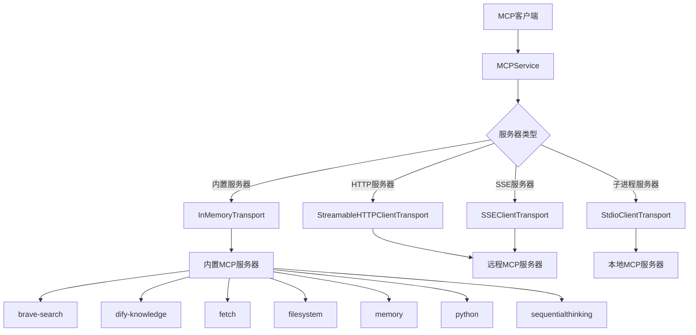

**图示来源**
- [MCPService.ts](file://src/main/services/MCPService.ts#L136-L587)
- [factory.ts](file://src/main/mcpServers/factory.ts#L17-L54)

**本节来源**
- [MCPService.ts](file://src/main/services/MCPService.ts#L1-L923)

## 核心功能

### 服务注册与管理
MCP服务通过`MCPService`类提供服务注册和管理功能。系统支持多种类型的MCP服务器，包括内置服务器和外部服务器。内置服务器通过内存内传输（InMemoryTransport）直接集成，而外部服务器则通过stdio、SSE或HTTP流式传输进行通信。

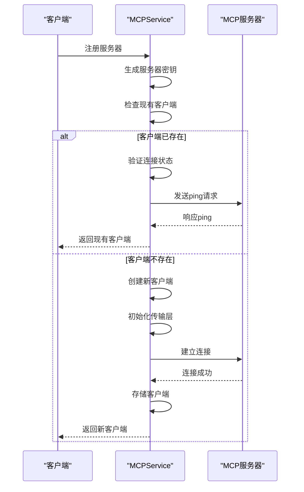

**图示来源**
- [MCPService.ts](file://src/main/services/MCPService.ts#L171-L459)

### 工具调用机制
MCP服务提供统一的工具调用接口，支持缓存机制以提高性能。工具调用时会自动处理身份验证、超时和进度报告等功能。

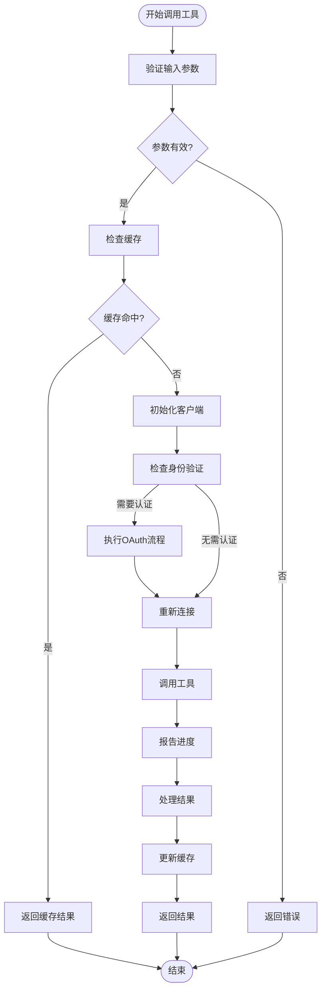

**图示来源**
- [MCPService.ts](file://src/main/services/MCPService.ts#L660-L716)
- [mcp.ts](file://src/main/apiServer/services/mcp.ts#L122-L176)

**本节来源**
- [MCPService.ts](file://src/main/services/MCPService.ts#L111-L134)
- [MCPService.ts](file://src/main/services/MCPService.ts#L660-L716)

## 内置MCP服务器实现

### Brave Search服务器
Brave Search MCP服务器提供网络搜索和本地搜索功能，通过Brave Search API获取信息。

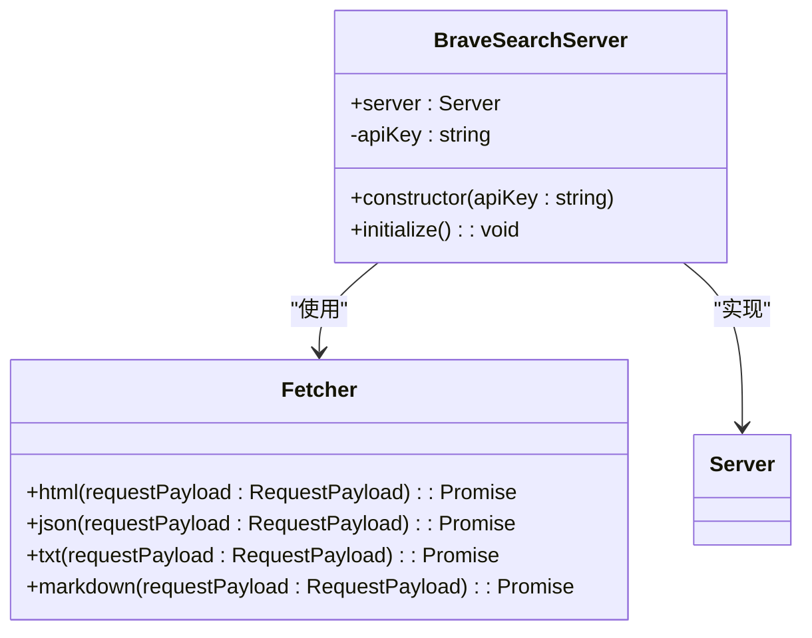

**图示来源**
- [brave-search.ts](file://src/main/mcpServers/brave-search.ts#L291-L374)

### Dify Knowledge服务器
Dify Knowledge MCP服务器用于访问Dify平台的知识库，支持列出知识库和搜索知识内容。

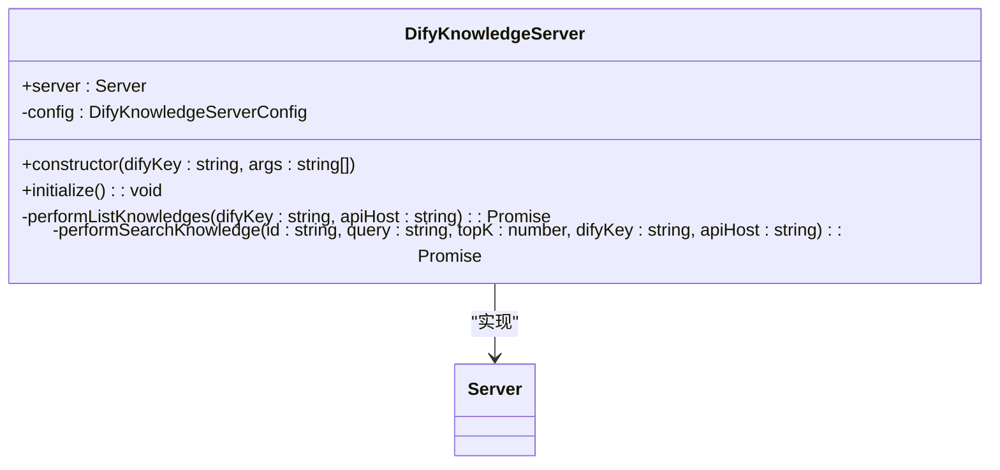

**图示来源**
- [dify-knowledge.ts](file://src/main/mcpServers/dify-knowledge.ts#L53-L258)

### Fetch服务器
Fetch MCP服务器提供网页内容抓取功能，支持HTML、JSON、纯文本和Markdown格式的提取。

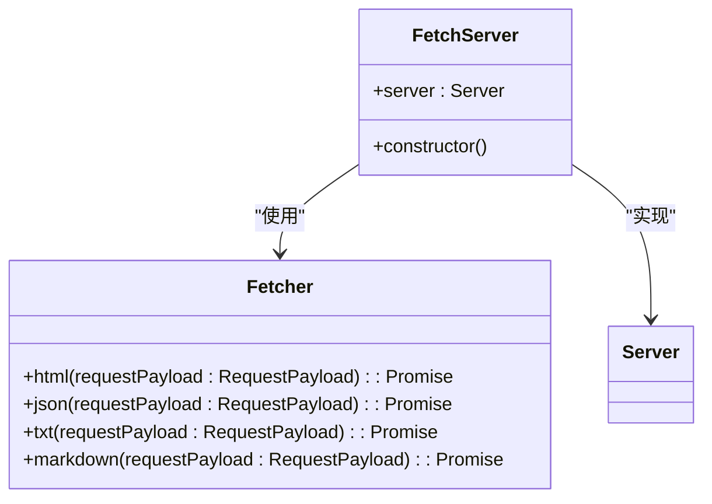

**图示来源**
- [fetch.ts](file://src/main/mcpServers/fetch.ts#L227-L233)

### Memory服务器
Memory MCP服务器提供知识图谱管理功能，支持实体、关系和观察的创建、查询和删除。

```mermaid
classDiagram
class MemoryServer {
+server : Server
-knowledgeGraphManager : KnowledgeGraphManager
-initializationPromise : Promise<void>
+constructor(envPath : string)
+setupRequestHandlers() : void
}
class KnowledgeGraphManager {
-memoryPath : string
-entities : Map<string, Entity>
-relations : Set<string>
-fileMutex : Mutex
+create(memoryPath : string) : Promise<KnowledgeGraphManager>
+createEntities(entities : Entity[]) : Promise<Entity[]>
+createRelations(relations : Relation[]) : Promise<Relation[]>
+addObservations(observations : { entityName : string; contents : string[] }[]) : Promise<{ entityName : string; addedObservations : string[] }[]>
+deleteEntities(entityNames : string[]) : Promise<void>
+deleteObservations(deletions : { entityName : string; observations : string[] }[]) : Promise<void>
+deleteRelations(relations : Relation[]) : Promise<void>
+readGraph() : Promise<KnowledgeGraph>
+searchNodes(query : string) : Promise<KnowledgeGraph>
+openNodes(names : string[]) : Promise<KnowledgeGraph>
}
MemoryServer --> KnowledgeGraphManager : "使用"
MemoryServer --> Server : "实现"
```

**图示来源**
- [memory.ts](file://src/main/mcpServers/memory.ts#L339-L714)

### Python服务器
Python MCP服务器提供在沙箱环境中执行Python代码的功能，使用Pyodide引擎。

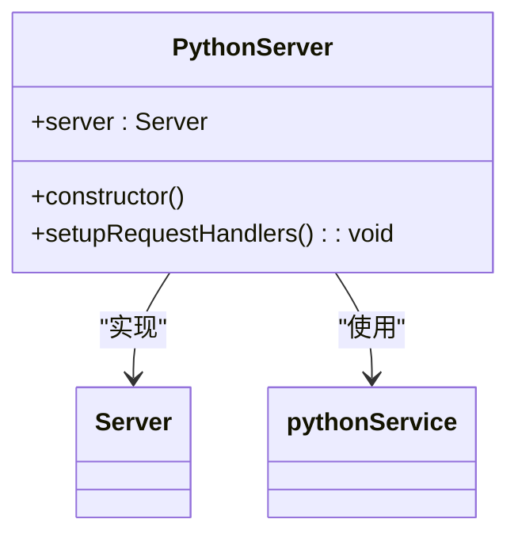

**图示来源**
- [python.ts](file://src/main/mcpServers/python.ts#L11-L115)

### Sequential Thinking服务器
Sequential Thinking MCP服务器提供逐步思考功能，支持动态问题解决和反思性分析。

```mermaid
classDiagram
class ThinkingServer {
+server : Server
-thinkingServer : SequentialThinkingServer
+constructor()
+initialize() : void
}
class SequentialThinkingServer {
-thoughtHistory : ThoughtData[]
-branches : Record<string, ThoughtData[]>
+processThought(input : unknown) : { content : Array<{ type : string; text : string }>; isError? : boolean }
}
ThinkingServer --> SequentialThinkingServer : "使用"
ThinkingServer --> Server : "实现"
```

**图示来源**
- [sequentialthinking.ts](file://src/main/mcpServers/sequentialthinking.ts#L251-L294)

**本节来源**
- [brave-search.ts](file://src/main/mcpServers/brave-search.ts#L1-L375)
- [dify-knowledge.ts](file://src/main/mcpServers/dify-knowledge.ts#L1-L260)
- [fetch.ts](file://src/main/mcpServers/fetch.ts#L1-L234)
- [memory.ts](file://src/main/mcpServers/memory.ts#L1-L715)
- [python.ts](file://src/main/mcpServers/python.ts#L1-L116)
- [sequentialthinking.ts](file://src/main/mcpServers/sequentialthinking.ts#L1-L295)

## 接口定义与数据流

### API接口
MCP服务通过REST API提供服务，主要接口包括：

| 接口 | 方法 | 描述 | 请求参数 | 响应格式 |
|------|------|------|----------|----------|
| /v1/mcps | GET | 列出所有MCP服务器 | 无 | {success: boolean, data: McpServersResp} |
| /v1/mcps/{server_id} | GET | 获取MCP服务器信息 | server_id: string | {success: boolean, data: MCPServer} |
| /v1/mcps/{server_id}/mcp | ALL | 处理MCP请求 | server_id: string, 请求体包含MCP消息 | MCP协议响应 |

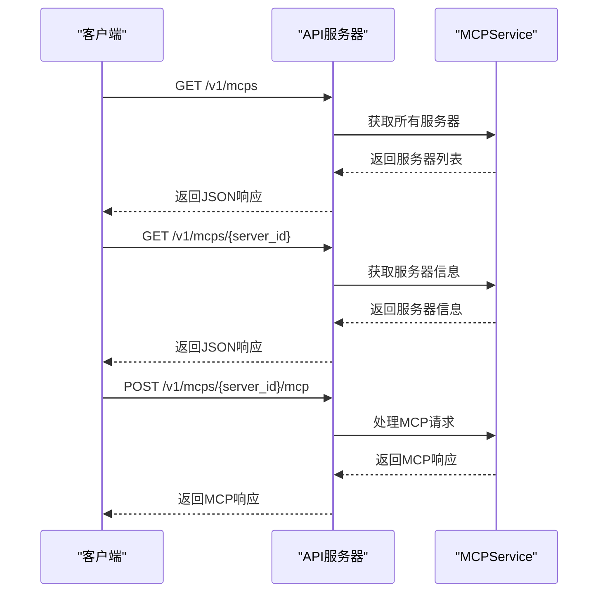

**图示来源**
- [mcp.ts](file://src/main/apiServer/routes/mcp.ts#L45-L156)
- [mcp.ts](file://src/main/apiServer/services/mcp.ts#L56-L176)

### 数据流
MCP服务的数据流遵循以下模式：

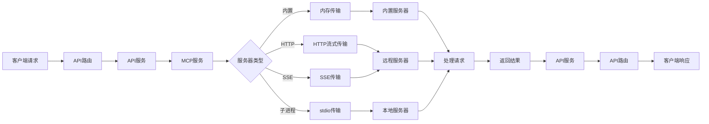

**图示来源**
- [mcp.ts](file://src/main/apiServer/routes/mcp.ts#L140-L153)
- [mcp.ts](file://src/main/apiServer/services/mcp.ts#L122-L176)
- [MCPService.ts](file://src/main/services/MCPService.ts#L171-L459)

**本节来源**
- [mcp.ts](file://src/main/apiServer/routes/mcp.ts#L1-L157)
- [mcp.ts](file://src/main/apiServer/services/mcp.ts#L1-L186)

## 错误处理策略

### 错误分类
MCP服务采用分层的错误处理策略，主要错误类型包括：

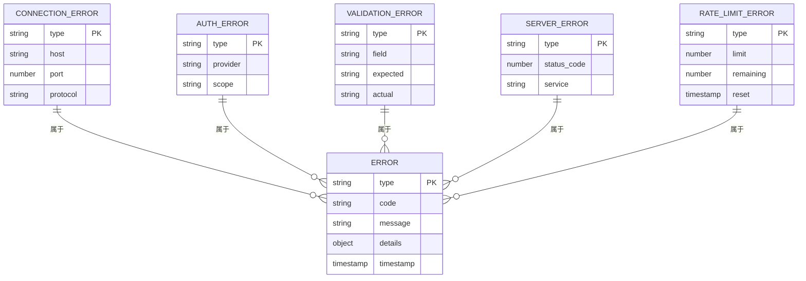

### 错误处理流程
MCP服务的错误处理流程如下：

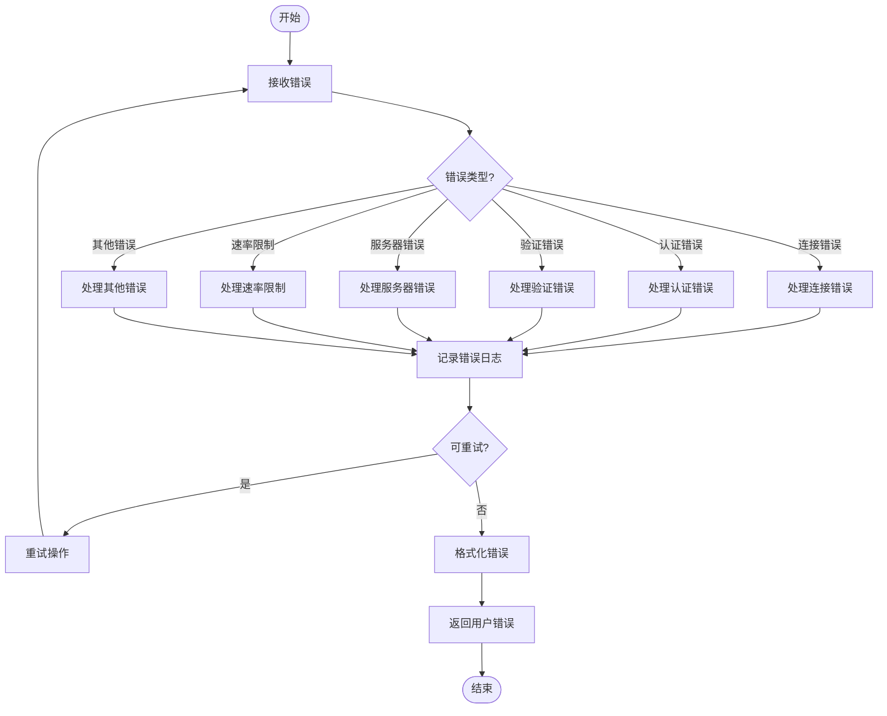

**本节来源**
- [MCPService.ts](file://src/main/services/MCPService.ts#L660-L716)
- [brave-search.ts](file://src/main/mcpServers/brave-search.ts#L157-L240)
- [dify-knowledge.ts](file://src/main/mcpServers/dify-knowledge.ts#L135-L256)

## 性能优化建议

### 缓存策略
MCP服务采用多级缓存策略来提高性能：

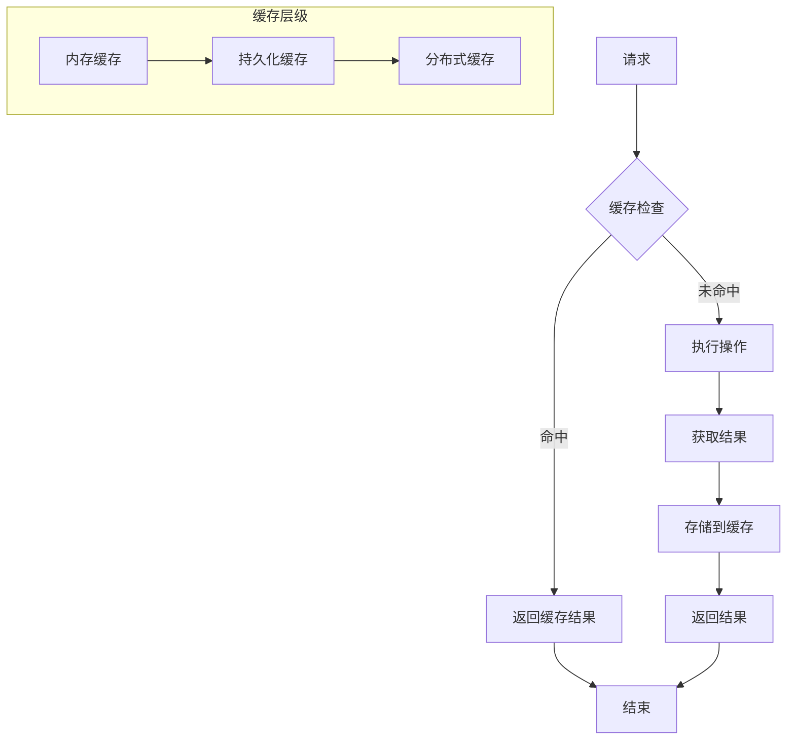

**图示来源**
- [MCPService.ts](file://src/main/services/MCPService.ts#L111-L134)
- [MCPService.ts](file://src/main/services/MCPService.ts#L640-L652)

### 连接管理
MCP服务通过连接池和连接复用优化性能：

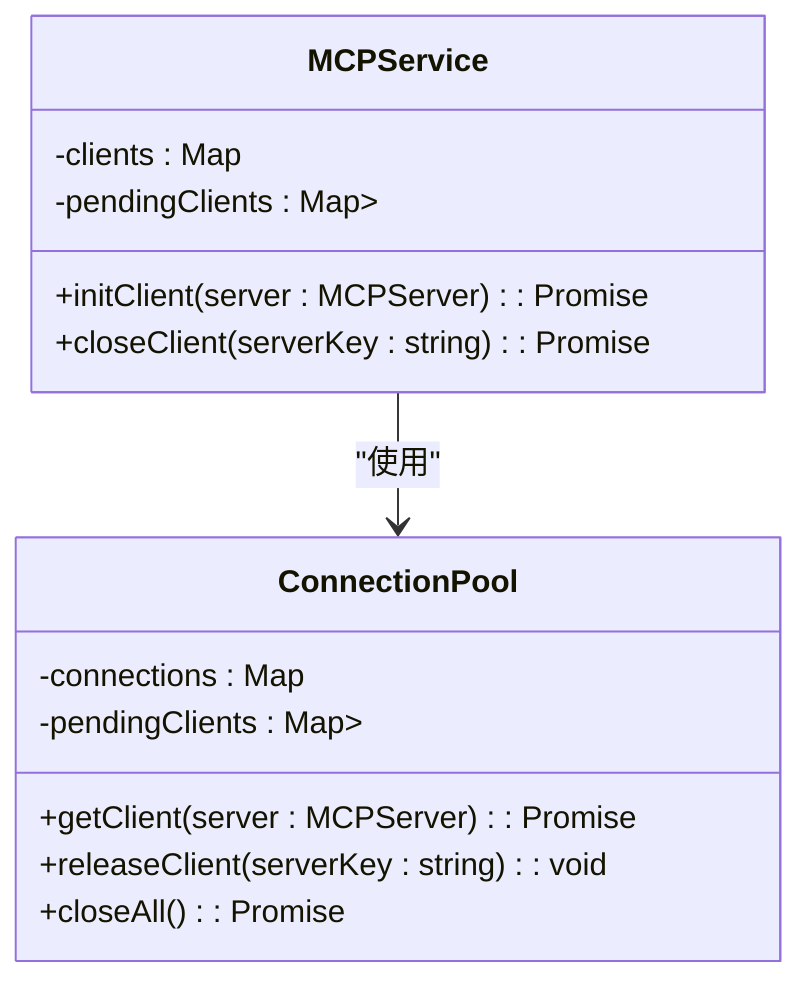

**图示来源**
- [MCPService.ts](file://src/main/services/MCPService.ts#L137-L138)
- [MCPService.ts](file://src/main/services/MCPService.ts#L171-L459)

**本节来源**
- [MCPService.ts](file://src/main/services/MCPService.ts#L111-L134)
- [MCPService.ts](file://src/main/services/MCPService.ts#L171-L459)

## 系统集成

### 与AI核心的集成
MCP服务与AI核心的集成方式如下：

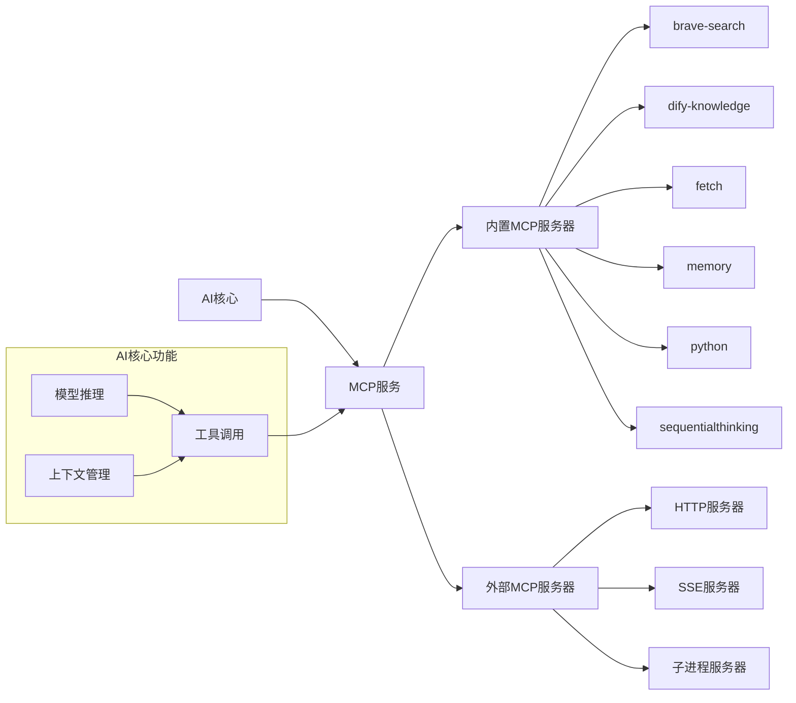

**本节来源**
- [MCPService.ts](file://src/main/services/MCPService.ts#L1-L923)
- [aiCore](file://packages/aiCore/src/core/)

### 与插件系统的集成
MCP服务与插件系统的集成方式如下：

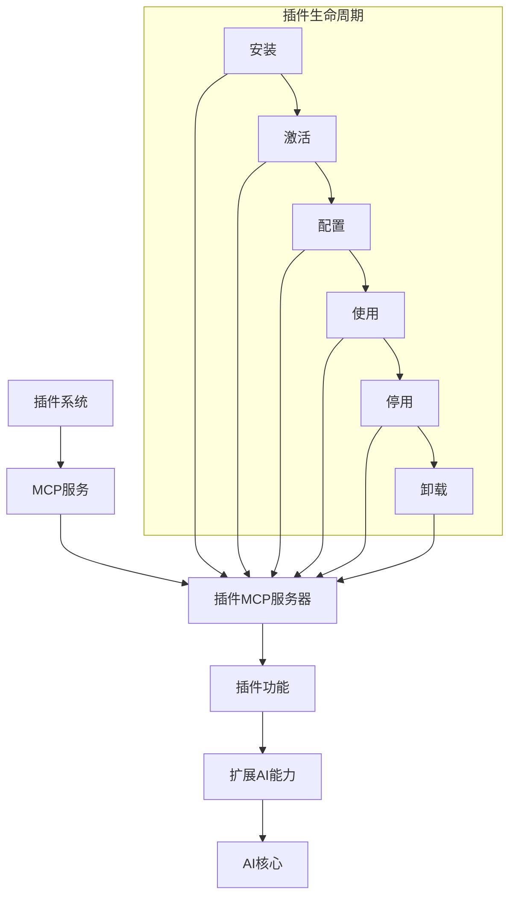

**本节来源**
- [MCPService.ts](file://src/main/services/MCPService.ts#L1-L923)
- [plugins](file://packages/aiCore/src/core/plugins/)

## 常见问题与调试

### 常见问题
以下是使用MCP服务时可能遇到的常见问题及解决方案：

| 问题 | 可能原因 | 解决方案 |
|------|---------|---------|
| 服务器连接失败 | 网络问题、服务器未启动、认证失败 | 检查网络连接，确认服务器状态，重新进行认证 |
| 工具调用超时 | 服务器响应慢、网络延迟、请求复杂度过高 | 增加超时时间，优化请求，检查服务器性能 |
| 缓存不一致 | 缓存过期、数据更新未同步 | 清除缓存，重启服务，检查数据同步机制 |
| 身份验证失败 | 凭据过期、权限不足、OAuth流程中断 | 重新获取凭据，检查权限设置，完成OAuth流程 |
| 内存泄漏 | 连接未正确关闭、对象未释放 | 确保连接正确关闭，检查资源释放逻辑 |

### 调试技巧
调试MCP服务时可以使用以下技巧：

1. **启用详细日志**：通过配置日志级别获取更详细的调试信息
2. **使用进度事件**：监听`Mcp_Progress`事件监控工具调用进度
3. **检查缓存状态**：使用`CacheService`检查和清除缓存
4. **验证服务器配置**：确保服务器配置正确无误
5. **测试连接**：使用`checkMcpConnectivity`方法测试服务器连接状态

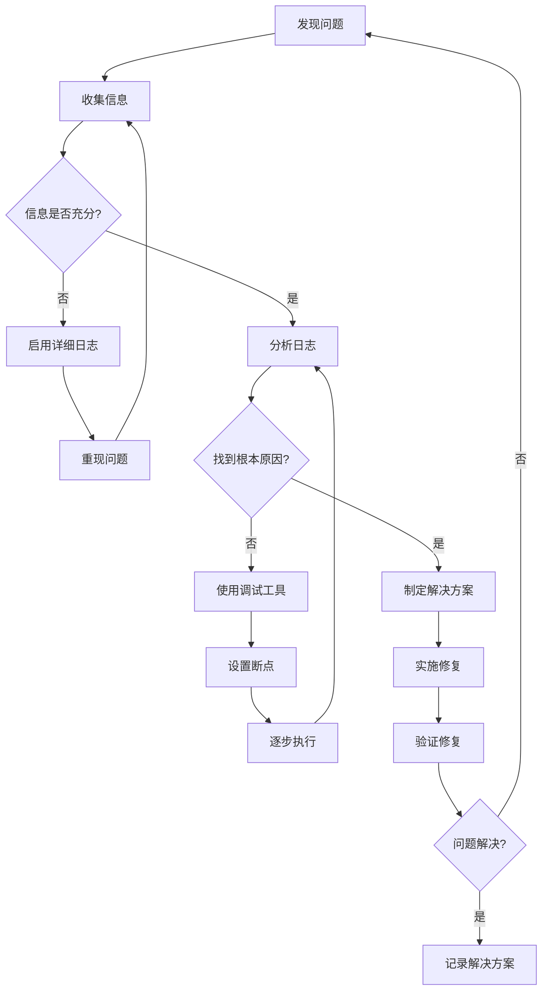

**本节来源**
- [MCPService.ts](file://src/main/services/MCPService.ts#L592-L612)
- [MCPService.ts](file://src/main/services/MCPService.ts#L660-L716)
- [loggerService](file://src/main/services/LoggerService.ts)