# MCP服务器实现技术文档

<cite>
**本文档引用的文件**
- [brave-search.ts](file://src/main/mcpServers/brave-search.ts)
- [didi-mcp.ts](file://src/main/mcpServers/didi-mcp.ts)
- [dify-knowledge.ts](file://src/main/mcpServers/dify-knowledge.ts)
- [filesystem.ts](file://src/main/mcpServers/filesystem.ts)
- [memory.ts](file://src/main/mcpServers/memory.ts)
- [python.ts](file://src/main/mcpServers/python.ts)
- [sequentialthinking.ts](file://src/main/mcpServers/sequentialthinking.ts)
- [factory.ts](file://src/main/mcpServers/factory.ts)
- [fetch.ts](file://src/main/mcpServers/fetch.ts)
- [MCPService.ts](file://src/main/services/MCPService.ts)
- [mcp.ts](file://src/main/apiServer/services/mcp.ts)
- [mcp.ts](file://src/main/apiServer/routes/mcp.ts)
- [mcp.ts](file://src/renderer/src/types/mcp.ts)
</cite>

## 目录
1. [概述](#概述)
2. [架构设计](#架构设计)
3. [核心组件分析](#核心组件分析)
4. [各MCP服务器详解](#各mcp服务器详解)
5. [通信机制](#通信机制)
6. [安全与错误处理](#安全与错误处理)
7. [性能优化](#性能优化)
8. [最佳实践](#最佳实践)
9. [故障排除指南](#故障排除指南)
10. [总结](#总结)

## 概述

MCP（Model Context Protocol）服务器实现是Cherry Studio中的核心功能模块，提供了与各种外部服务和本地资源的标准化接口。该系统支持多种类型的MCP服务器，包括网络搜索、API集成、知识检索、文件操作、内存管理和代码执行等。

### 主要特性

- **多类型服务器支持**：涵盖网络搜索、API集成、知识检索、文件操作、内存管理、代码执行等多种功能
- **统一通信协议**：基于Model Context Protocol标准，确保跨平台兼容性
- **安全沙箱环境**：Python服务器在Pyodide环境中执行代码，确保安全性
- **智能缓存机制**：内置缓存系统提升性能
- **错误恢复能力**：完善的错误处理和重试机制

## 架构设计

### 整体架构图

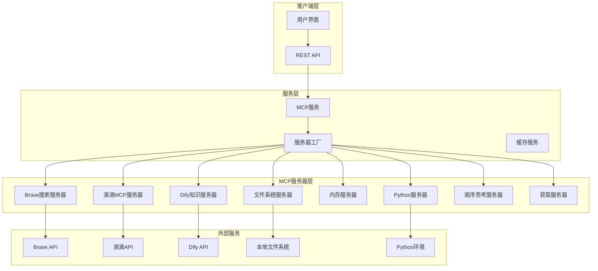

**图表来源**
- [factory.ts](file://src/main/mcpServers/factory.ts#L17-L54)
- [MCPService.ts](file://src/main/services/MCPService.ts#L136-L170)

### 通信架构

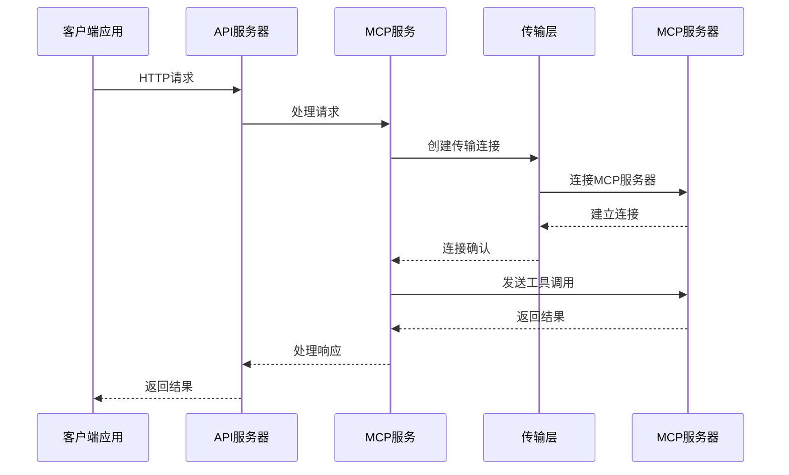

**图表来源**
- [MCPService.ts](file://src/main/services/MCPService.ts#L227-L260)
- [mcp.ts](file://src/main/apiServer/services/mcp.ts#L122-L176)

## 核心组件分析

### MCP服务管理器

MCP服务管理器是整个系统的协调中心，负责服务器的生命周期管理、连接池维护和错误处理。

#### 主要功能

- **服务器初始化**：根据配置创建和启动MCP服务器
- **连接管理**：维护与各个服务器的连接状态
- **缓存策略**：智能缓存工具列表和资源信息
- **错误恢复**：自动重连和故障转移机制

#### 关键算法

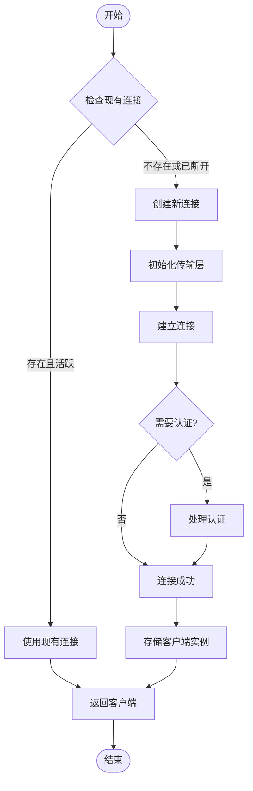

**图表来源**
- [MCPService.ts](file://src/main/services/MCPService.ts#L171-L242)

**章节来源**
- [MCPService.ts](file://src/main/services/MCPService.ts#L136-L242)

### 工厂模式实现

工厂模式用于统一创建不同类型的MCP服务器，确保一致的初始化流程和配置管理。

#### 服务器类型映射

| 服务器类型 | 功能描述 | 初始化参数 |
|-----------|----------|-----------|
| `memory` | 内存数据管理 | 环境变量路径 |
| `sequentialThinking` | 顺序思考处理 | 无参数 |
| `braveSearch` | Brave搜索引擎 | API密钥 |
| `fetch` | 网络内容获取 | 无参数 |
| `filesystem` | 文件系统操作 | 允许目录列表 |
| `difyKnowledge` | 知识库检索 | API密钥和主机地址 |
| `python` | Python代码执行 | 无参数 |
| `didiMCP` | 滴滴出行服务 | API密钥 |

**章节来源**
- [factory.ts](file://src/main/mcpServers/factory.ts#L17-L54)

## 各MCP服务器详解

### Brave搜索服务器

Brave搜索服务器提供了强大的网络搜索和本地搜索功能，支持实时查询和结果过滤。

#### 核心功能

- **Web搜索**：基于Brave API的通用网络搜索
- **本地搜索**：针对地理位置和业务信息的专门搜索
- **分页支持**：可控制结果数量和偏移量
- **速率限制**：防止API滥用的限流机制

#### 搜索流程

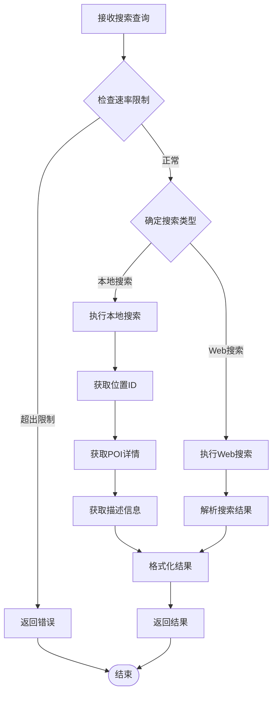

**图表来源**
- [brave-search.ts](file://src/main/mcpServers/brave-search.ts#L157-L224)

#### 安全措施

- **API密钥验证**：确保只有授权用户可以使用搜索功能
- **速率限制**：每秒最多1次请求，每月最多15000次
- **输入验证**：严格验证搜索参数格式

**章节来源**
- [brave-search.ts](file://src/main/mcpServers/brave-search.ts#L1-L375)

### 滴滴MCP服务器

滴滴MCP服务器集成了中国地区的网约车服务，提供完整的行程管理功能。

#### 核心API功能

- **地图搜索**：基于关键词和城市的POI搜索
- **价格估算**：实时计算行程费用
- **订单管理**：创建、取消和查询订单
- **司机跟踪**：实时获取司机位置信息
- **深度链接**：生成直达应用的链接

#### 订单流程

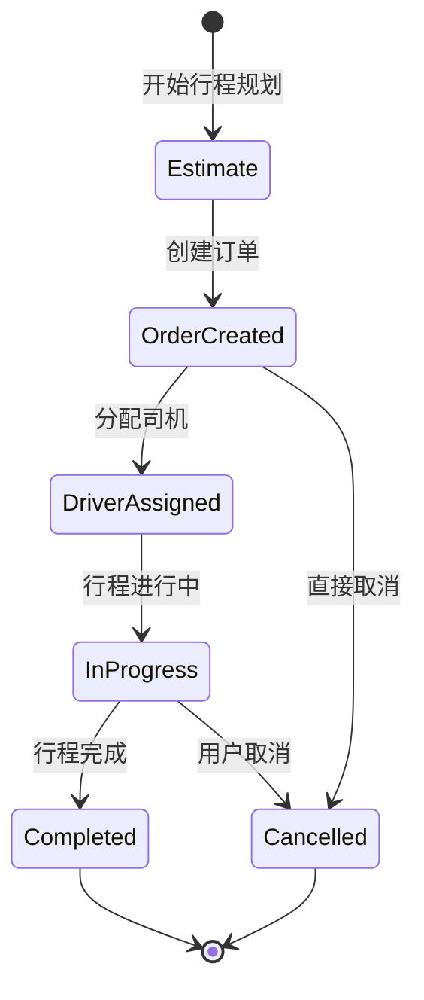

**图表来源**
- [didi-mcp.ts](file://src/main/mcpServers/didi-mcp.ts#L219-L473)

#### 本地化特性

- **仅限中国大陆**：API服务仅在中国大陆地区可用
- **中文界面**：所有提示和错误信息均为中文
- **城市支持**：支持主要城市的完整服务

**章节来源**
- [didi-mcp.ts](file://src/main/mcpServers/didi-mcp.ts#L1-L474)

### Dify知识服务器

Dify知识服务器实现了基于向量检索的知识库查询功能，支持语义搜索和上下文相关的结果。

#### 检索机制

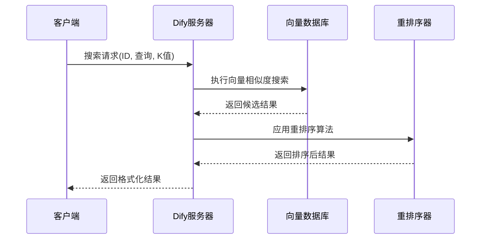

**图表来源**
- [dify-knowledge.ts](file://src/main/mcpServers/dify-knowledge.ts#L180-L256)

#### 知识库管理

- **多知识库支持**：同时管理多个独立的知识库
- **语义检索**：基于嵌入向量的语义相似度搜索
- **结果评分**：提供相关性分数帮助评估结果质量
- **关键词标注**：自动提取和标注重要关键词

**章节来源**
- [dify-knowledge.ts](file://src/main/mcpServers/dify-knowledge.ts#L1-L260)

### 文件系统服务器

文件系统服务器提供了安全的文件操作功能，支持复杂的文件管理和编辑操作。

#### 安全架构

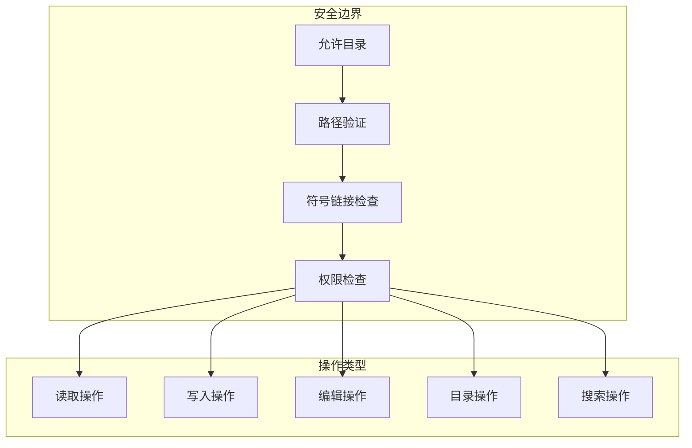

**图表来源**
- [filesystem.ts](file://src/main/mcpServers/filesystem.ts#L28-L67)

#### 文件操作功能

| 操作类型 | 功能描述 | 安全特性 |
|---------|----------|----------|
| `read_file` | 读取单个文件内容 | 路径验证、编码处理 |
| `write_file` | 写入或覆盖文件 | 权限检查、原子操作 |
| `edit_file` | 行级文本编辑 | 差异计算、预览模式 |
| `create_directory` | 创建目录结构 | 递归创建、权限设置 |
| `search_files` | 文件搜索 | 模式匹配、排除规则 |
| `move_file` | 文件移动/重命名 | 原子操作、冲突检测 |

**章节来源**
- [filesystem.ts](file://src/main/mcpServers/filesystem.ts#L1-L653)

### 内存服务器

内存服务器实现了基于知识图谱的记忆管理系统，支持实体关系建模和语义推理。

#### 知识图谱结构

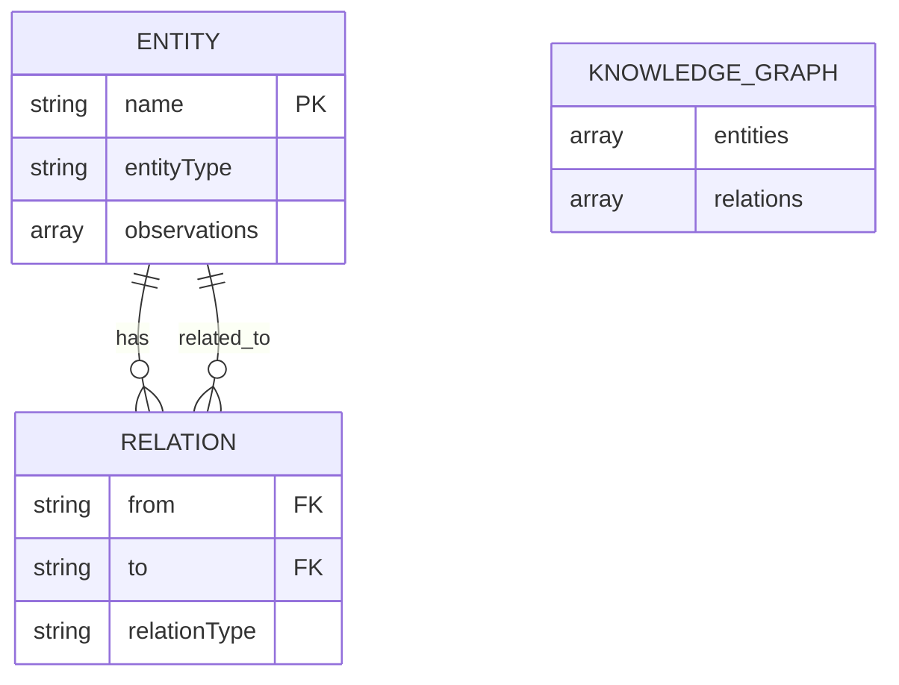

**图表来源**
- [memory.ts](file://src/main/mcpServers/memory.ts#L16-L32)

#### 持久化机制

- **JSON文件存储**：结构化数据持久化
- **互斥锁保护**：防止并发写入冲突
- **增量更新**：只保存变更部分
- **自动备份**：定期备份防止数据丢失

**章节来源**
- [memory.ts](file://src/main/mcpServers/memory.ts#L1-L715)

### Python服务器

Python服务器提供了安全的Python代码执行环境，基于Pyodide实现浏览器级别的安全性。

#### 执行流程

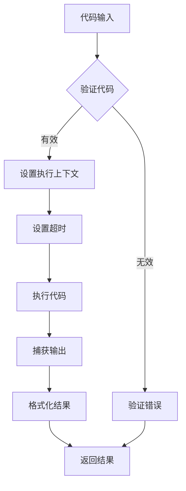

**图表来源**
- [python.ts](file://src/main/mcpServers/python.ts#L71-L111)

#### 安全特性

- **沙箱环境**：Pyodide提供的隔离执行环境
- **超时控制**：防止无限循环和长时间运行
- **依赖管理**：PEP 723元数据支持
- **输出限制**：控制输出大小和格式

**章节来源**
- [python.ts](file://src/main/mcpServers/python.ts#L1-L116)

### 顺序思考服务器

顺序思考服务器实现了动态的思维链处理，支持反思、修正和分支思考过程。

#### 思维处理流程

```mermaid
stateDiagram-v2
[*] --> NewThought : 新思考步骤
NewThought --> Analyze : 分析当前状态
Analyze --> Revision{需要修正?}
Analyze --> Branch{需要分支?}
Analyze --> Continue : 继续思考
Revision --> Revise : 修正旧思考
Revise --> Analyze
Branch --> CreateBranch : 创建新分支
CreateBranch --> Analyze
Continue --> Analyze
Analyze --> Finalize{完成思考?}
Finalize --> [*] : 输出最终结果
Finalize --> NewThought : 继续思考
```

**图表来源**
- [sequentialthinking.ts](file://src/main/mcpServers/sequentialthinking.ts#L25-L56)

#### 特色功能

- **动态调整**：可随时调整总思考步数
- **反思机制**：支持对之前思考的质疑和修正
- **分支管理**：支持并行思考路径
- **可视化输出**：彩色格式化的思考过程

**章节来源**
- [sequentialthinking.ts](file://src/main/mcpServers/sequentialthinking.ts#L1-L295)

### 获取服务器

获取服务器提供了多种内容格式的网络内容获取功能，支持HTML、Markdown、纯文本和JSON格式。

#### 格式转换流程

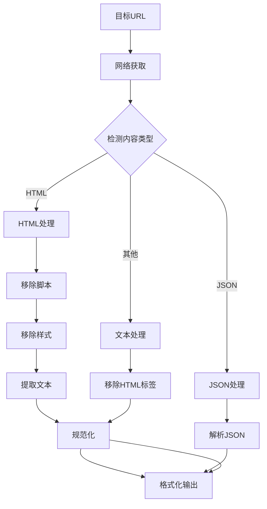

**图表来源**
- [fetch.ts](file://src/main/mcpServers/fetch.ts#L18-L112)

**章节来源**
- [fetch.ts](file://src/main/mcpServers/fetch.ts#L1-L234)

## 通信机制

### 传输层架构

MCP系统支持多种传输方式，适应不同的部署场景和需求。

#### 传输方式对比

| 传输方式 | 适用场景 | 优势 | 劣势 |
|---------|----------|------|------|
| `stdio` | 本地进程 | 低延迟、高吞吐量 | 仅限本地 |
| `sse` | HTTP服务器 | 实时推送、简单部署 | 受网络限制 |
| `streamableHttp` | 现代HTTP服务器 | 标准协议、广泛支持 | 配置复杂 |
| `inMemory` | 内存服务器 | 最高性能 | 有限制的服务器类型 |

### 连接管理

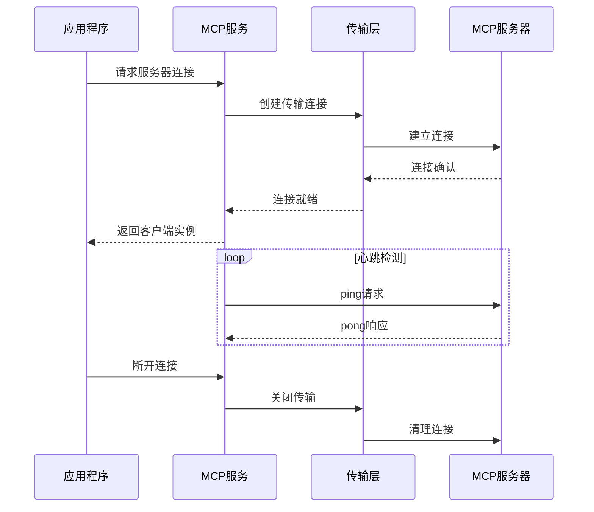

**图表来源**
- [MCPService.ts](file://src/main/services/MCPService.ts#L171-L242)

**章节来源**
- [MCPService.ts](file://src/main/services/MCPService.ts#L227-L372)

## 安全与错误处理

### 安全防护机制

#### 输入验证

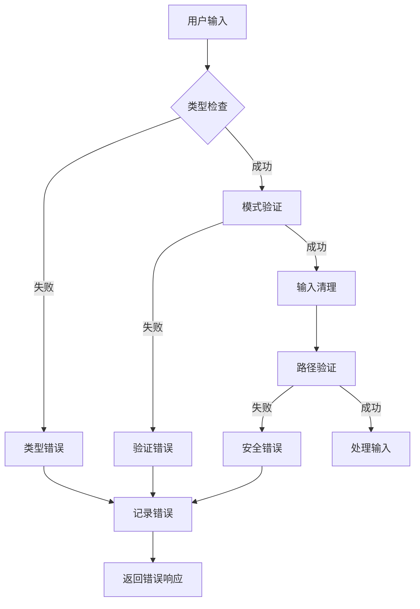

#### 权限控制

- **路径白名单**：文件系统操作只能在指定目录内进行
- **API密钥管理**：敏感信息加密存储和传输
- **速率限制**：防止滥用和DDoS攻击
- **超时控制**：防止长时间阻塞操作

### 错误处理策略

#### 错误分类

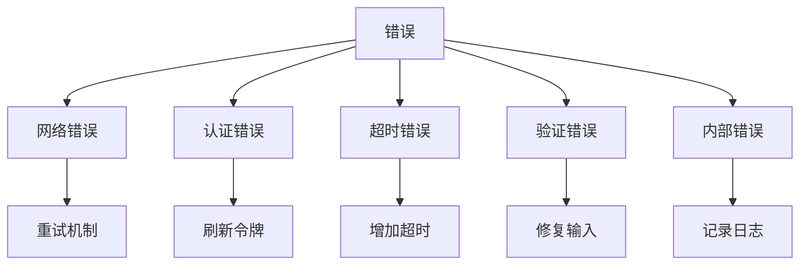

#### 重试机制

- **指数退避**：逐步增加重试间隔
- **最大重试次数**：防止无限重试
- **条件重试**：只对可恢复的错误重试
- **快速失败**：对不可恢复的错误立即失败

**章节来源**
- [MCPService.ts](file://src/main/services/MCPService.ts#L64-L90)

## 性能优化

### 缓存策略

#### 多层缓存架构

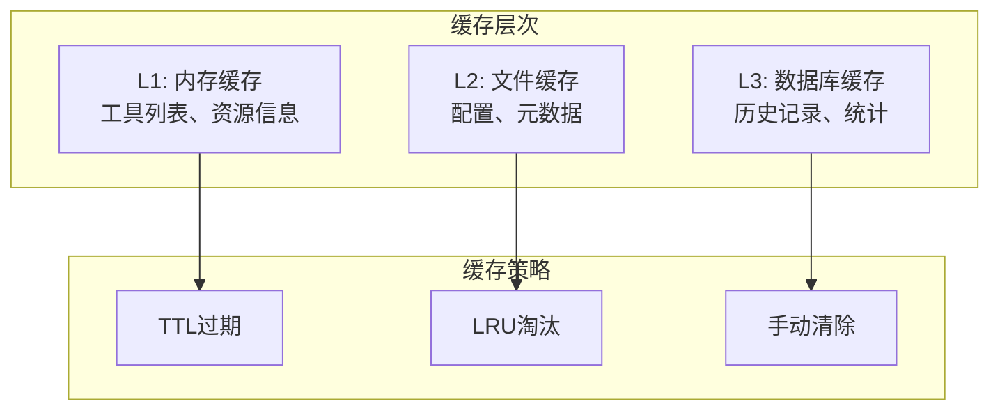

#### 缓存配置

| 缓存类型 | TTL | 更新触发 | 存储位置 |
|---------|-----|----------|----------|
| 工具列表 | 5分钟 | 工具变更通知 | 内存 |
| 提示列表 | 60分钟 | 提示变更通知 | 内存 |
| 资源信息 | 30分钟 | 资源变更通知 | 内存 |
| 配置信息 | 永久 | 手动清除 | 文件系统 |

### 并发处理

#### 连接池管理

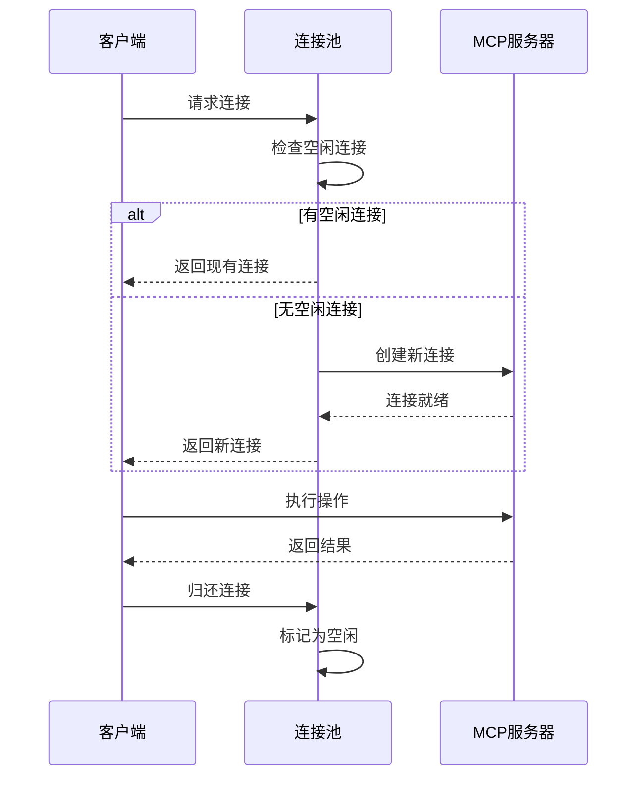

**图表来源**
- [MCPService.ts](file://src/main/services/MCPService.ts#L137-L140)

### 性能监控

#### 关键指标

- **响应时间**：平均和95%分位数
- **连接成功率**：连接建立的成功率
- **缓存命中率**：各层级缓存的命中率
- **错误率**：各类错误的发生频率

**章节来源**
- [MCPService.ts](file://src/main/services/MCPService.ts#L111-L134)

## 最佳实践

### 服务器配置

#### 推荐配置

```typescript
// 示例：文件系统服务器配置
const fileSystemServer = new FileSystemServer([
  '~/projects',
  '~/documents',
  '~/workspace'
]);

// 示例：Python服务器配置
const pythonServer = new PythonServer();

// 示例：内存服务器配置
const memoryServer = new MemoryServer('/path/to/memory.json');
```

#### 环境变量设置

```bash
# API密钥配置
export BRAVE_API_KEY="your_brave_api_key"
export DIFY_KEY="your_dify_api_key"
export DIDI_API_KEY="your_didi_api_key"

# 内存文件路径
export MEMORY_FILE_PATH="/path/to/custom/memory.json"

# 超时设置
export MCP_TIMEOUT=60
```

### 使用建议

#### 性能优化

1. **合理设置超时**：根据操作类型设置合适的超时时间
2. **启用缓存**：充分利用内置的缓存机制
3. **批量操作**：尽可能使用批量API减少网络开销
4. **及时释放资源**：操作完成后及时关闭连接

#### 安全考虑

1. **最小权限原则**：只授予必要的文件系统权限
2. **定期更新密钥**：定期更换API密钥
3. **监控异常行为**：关注异常的错误模式
4. **备份重要数据**：定期备份内存服务器数据

### 故障诊断

#### 常见问题

| 问题类型 | 症状 | 解决方案 |
|---------|------|----------|
| 连接超时 | 请求长时间无响应 | 检查网络连接，增加超时时间 |
| 认证失败 | 401错误 | 验证API密钥有效性 |
| 权限拒绝 | 文件操作失败 | 检查文件系统权限配置 |
| 内存不足 | Python执行失败 | 增加内存限制或优化代码 |

## 故障排除指南

### 诊断工具

#### 日志分析

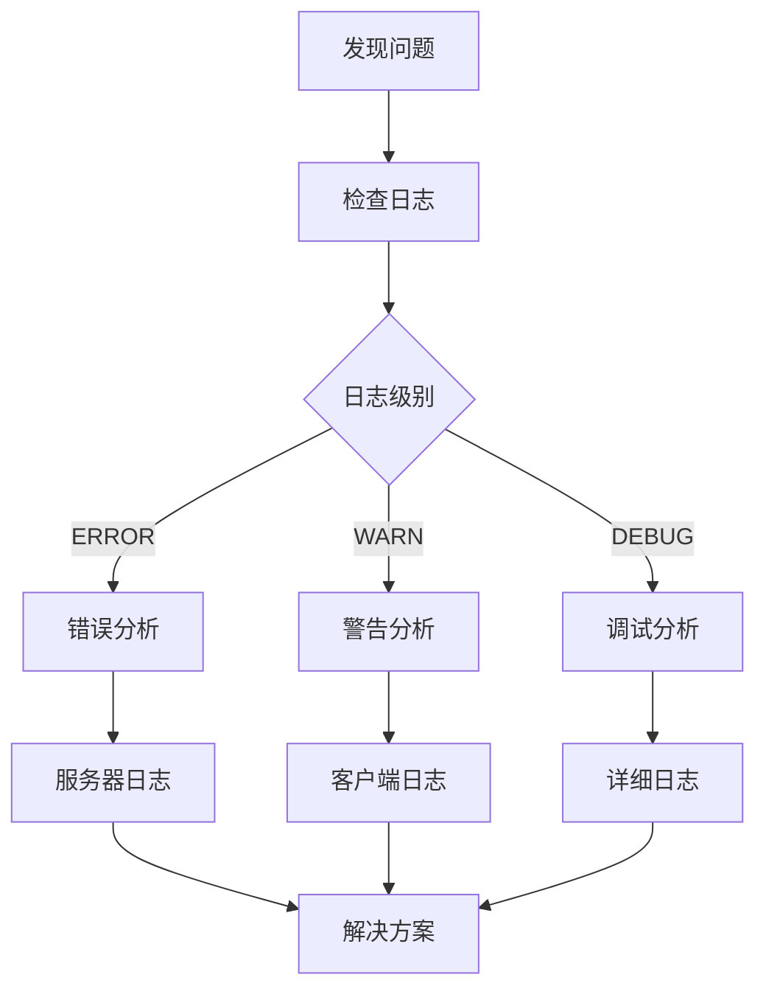

#### 网络诊断

- **连通性测试**：使用ping和telnet测试网络连接
- **代理配置**：检查代理设置是否正确
- **防火墙规则**：确保必要的端口开放
- **DNS解析**：验证域名解析是否正常

### 恢复策略

#### 自动恢复

- **连接重试**：自动重试失败的连接
- **缓存重建**：重新构建失效的缓存
- **配置重载**：重新加载配置文件

#### 手动恢复

- **重启服务**：重启受影响的MCP服务器
- **清理缓存**：清除损坏的缓存数据
- **重置配置**：恢复默认配置

**章节来源**
- [MCPService.ts](file://src/main/services/MCPService.ts#L589-L612)

## 总结

Cherry Studio的MCP服务器实现提供了一个强大而灵活的框架，支持多种类型的外部服务集成。通过统一的通信协议、完善的安全机制和智能的缓存策略，该系统能够高效地处理各种复杂的业务需求。

### 主要优势

1. **模块化设计**：每个MCP服务器都是独立的模块，便于维护和扩展
2. **安全可靠**：多层次的安全防护和错误处理机制
3. **高性能**：智能缓存和连接池优化性能
4. **易于使用**：统一的API接口和丰富的配置选项

### 未来发展

- **更多服务器类型**：计划支持更多的MCP服务器实现
- **增强安全性**：进一步加强安全防护机制
- **性能优化**：持续优化性能和资源利用率
- **用户体验**：改进错误提示和诊断工具

通过本文档的详细介绍，开发者可以深入理解MCP服务器的实现原理，并能够有效地使用和维护这个强大的系统。