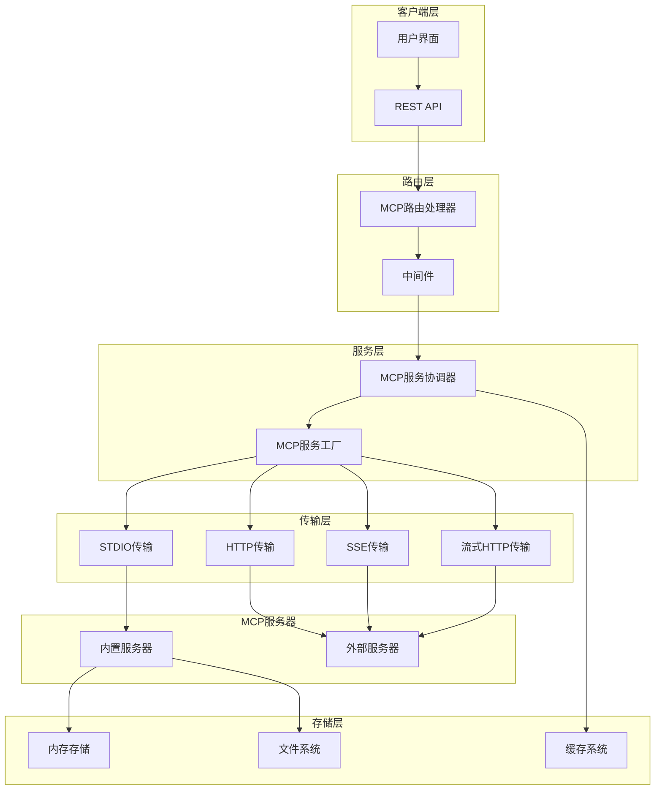
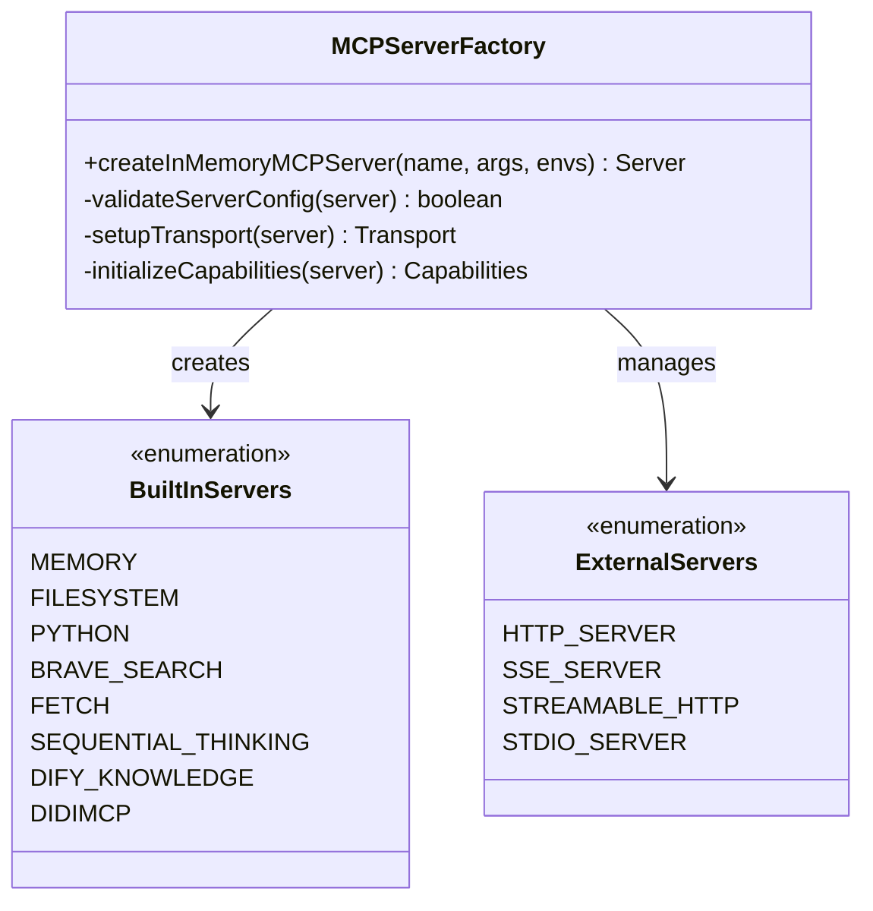
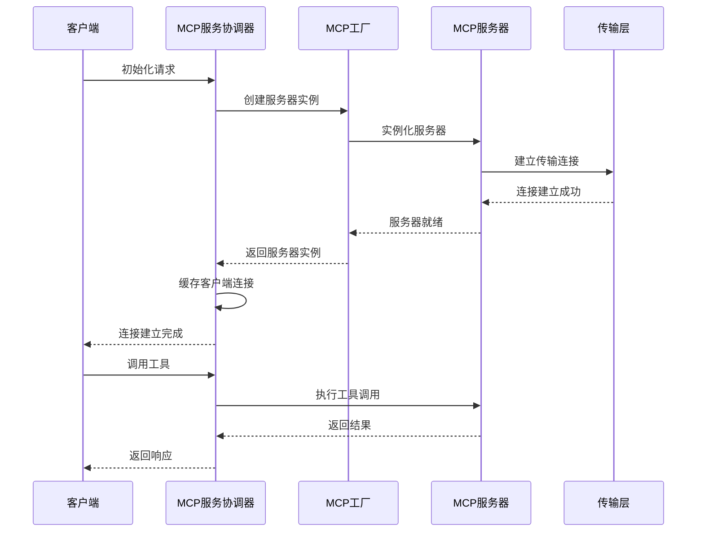
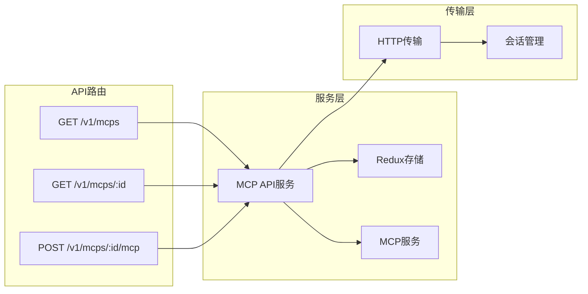
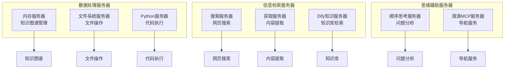
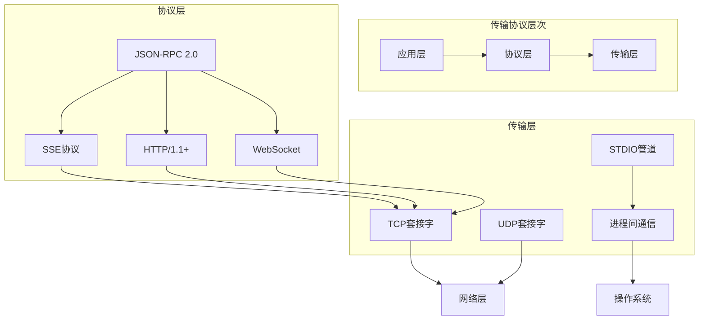
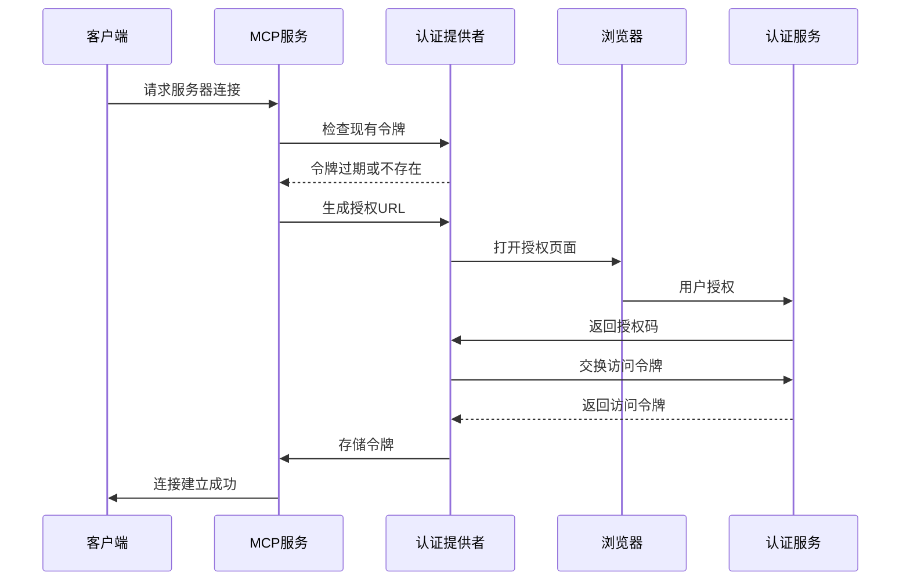
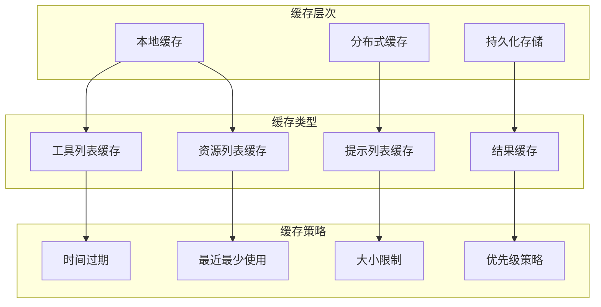
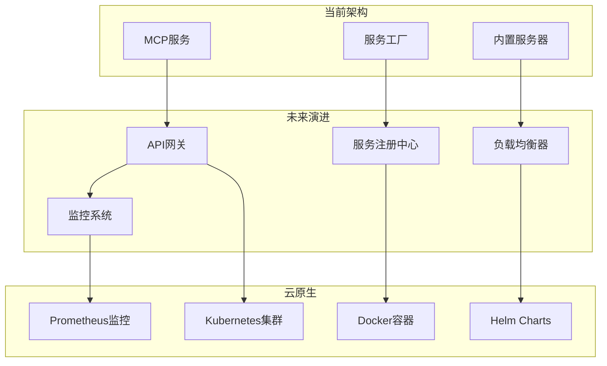

# Cherry Studio MCP架构设计

<cite>
**本文档引用的文件**
- [factory.ts](file://src/main/mcpServers/factory.ts)
- [MCPService.ts](file://src/main/services/MCPService.ts)
- [mcp.ts](file://src/main/apiServer/routes/mcp.ts)
- [mcp.ts](file://src/main/apiServer/services/mcp.ts)
- [mcp.ts](file://src/main/utils/mcp.ts)
- [memory.ts](file://src/main/mcpServers/memory.ts)
- [filesystem.ts](file://src/main/mcpServers/filesystem.ts)
- [python.ts](file://src/main/mcpServers/python.ts)
- [brave-search.ts](file://src/main/mcpServers/brave-search.ts)
- [fetch.ts](file://src/main/mcpServers/fetch.ts)
- [sequentialthinking.ts](file://src/main/mcpServers/sequentialthinking.ts)
- [dify-knowledge.ts](file://src/main/mcpServers/dify-knowledge.ts)
- [provider.ts](file://src/main/services/mcp/oauth/provider.ts)
</cite>

## 目录
1. [概述](#概述)
2. [系统架构总览](#系统架构总览)
3. [MCP服务工厂模式](#mcp服务工厂模式)
4. [MCP服务协调器](#mcp服务协调器)
5. [API路由层](#api路由层)
6. [内置MCP服务器](#内置mcp服务器)
7. [传输层架构](#传输层架构)
8. [认证与安全](#认证与安全)
9. [缓存与性能优化](#缓存与性能优化)
10. [架构决策与权衡](#架构决策与权衡)
11. [扩展性考虑](#扩展性考虑)
12. [总结](#总结)

## 概述

Cherry Studio的MCP（Model Control Protocol）架构是一个高度模块化和可扩展的服务系统，旨在为AI核心提供统一的外部服务接入能力。该架构通过服务工厂模式实现了动态MCP服务器的创建和管理，通过MCPService协调器提供了统一的服务调用接口，并通过多种传输协议支持不同的连接方式。

### 核心特性

- **服务工厂模式**：动态创建和管理不同类型MCP服务器
- **多传输协议支持**：STDIO、HTTP、SSE、流式HTTP等多种连接方式
- **内置服务器丰富**：内存管理、文件系统、Python执行、搜索等内置功能
- **OAuth认证支持**：安全的第三方服务集成
- **智能缓存机制**：提升性能和用户体验
- **工具链集成**：与AI核心、插件系统和跟踪系统的深度集成

## 系统架构总览

**图表来源**
- [MCPService.ts](file://src/main/services/MCPService.ts#L136-L170)
- [factory.ts](file://src/main/mcpServers/factory.ts#L17-L54)
- [mcp.ts](file://src/main/apiServer/routes/mcp.ts#L9-L157)

## MCP服务工厂模式

### 工厂模式设计

MCP服务工厂采用工厂模式来统一管理不同类型MCP服务器的创建和初始化过程。这种设计模式提供了以下优势：

- **统一入口**：所有MCP服务器都通过同一个工厂方法创建
- **配置标准化**：确保所有服务器遵循相同的配置规范
- **生命周期管理**：集中管理服务器的启动、停止和重启
- **类型安全**：编译时检查服务器类型和参数

### 服务器类型分类

**图表来源**
- [factory.ts](file://src/main/mcpServers/factory.ts#L17-L54)

### 工厂方法实现

工厂方法的核心逻辑包括：

1. **参数验证**：检查服务器名称和配置参数的有效性
2. **环境变量处理**：解析和设置服务器运行所需的环境变量
3. **实例化**：根据服务器类型创建对应的服务器实例
4. **初始化**：设置服务器的能力和请求处理器

**章节来源**
- [factory.ts](file://src/main/mcpServers/factory.ts#L17-L54)

## MCP服务协调器

### 核心职责

MCPService作为整个MCP架构的核心协调器，负责：

- **客户端管理**：维护与各个MCP服务器的连接状态
- **请求路由**：将客户端请求转发到正确的MCP服务器
- **工具调用**：执行MCP服务器提供的工具函数
- **资源管理**：管理服务器生命周期和资源分配
- **错误处理**：统一处理各种异常情况

### 连接管理架构

**图表来源**
- [MCPService.ts](file://src/main/services/MCPService.ts#L171-L450)

### 传输层抽象

MCPService支持多种传输协议，每种协议都有其特定的应用场景：

| 传输类型 | 适用场景 | 性能特点 | 安全性 |
|---------|---------|---------|--------|
| In-Memory | 内置服务器 | 最高性能，零网络开销 | 最高安全性 |
| STDIO | 命令行工具 | 中等性能，跨平台兼容 | 中等安全性 |
| HTTP | Web服务 | 中等性能，标准协议 | 需要HTTPS |
| SSE | 实时通信 | 较低性能，长连接 | 需要HTTPS |
| Streamable HTTP | 大数据传输 | 高性能，流式处理 | 需要HTTPS |

**章节来源**
- [MCPService.ts](file://src/main/services/MCPService.ts#L227-L420)

## API路由层

### REST API设计

MCP API路由层提供了RESTful接口来管理MCP服务器和服务。该层的主要功能包括：

- **服务器发现**：列出所有可用的MCP服务器
- **服务器信息查询**：获取单个服务器的详细信息
- **请求代理**：将客户端请求转发给相应的MCP服务器
- **会话管理**：维护客户端与服务器之间的会话状态

### 路由架构

**图表来源**
- [mcp.ts](file://src/main/apiServer/routes/mcp.ts#L45-L157)
- [mcp.ts](file://src/main/apiServer/services/mcp.ts#L40-L186)

### 请求处理流程

API路由层的请求处理遵循以下流程：

1. **身份验证**：验证请求的合法性
2. **参数验证**：检查请求参数的有效性
3. **服务器查找**：在Redux存储中查找目标服务器
4. **请求转发**：将请求转发给相应的MCP服务器
5. **响应处理**：处理服务器返回的结果

**章节来源**
- [mcp.ts](file://src/main/apiServer/routes/mcp.ts#L45-L157)
- [mcp.ts](file://src/main/apiServer/services/mcp.ts#L56-L186)

## 内置MCP服务器

### 服务器类型概览

Cherry Studio提供了丰富的内置MCP服务器，涵盖了各种常见的使用场景：

**图表来源**
- [memory.ts](file://src/main/mcpServers/memory.ts#L338-L715)
- [filesystem.ts](file://src/main/mcpServers/filesystem.ts#L283-L653)
- [python.ts](file://src/main/mcpServers/python.ts#L11-L116)
- [brave-search.ts](file://src/main/mcpServers/brave-search.ts#L291-L375)
- [fetch.ts](file://src/main/mcpServers/fetch.ts#L115-L234)
- [dify-knowledge.ts](file://src/main/mcpServers/dify-knowledge.ts#L53-L260)
- [sequentialthinking.ts](file://src/main/mcpServers/sequentialthinking.ts#L251-L295)

### 内存服务器

内存服务器是Cherry Studio的核心组件之一，提供了强大的知识图谱管理功能：

- **实体管理**：创建、删除和更新知识实体
- **关系管理**：建立和维护实体间的关系
- **观察记录**：记录实体的观察和事件
- **持久化存储**：支持知识图谱的持久化保存
- **搜索功能**：基于关键词的知识图谱搜索

### 文件系统服务器

文件系统服务器提供了安全的文件操作能力：

- **文件读写**：安全的文件读取和写入操作
- **目录管理**：创建、删除和遍历目录
- **文件移动**：文件和目录的重命名和移动
- **权限控制**：严格的访问权限管理
- **路径验证**：防止路径遍历攻击

### Python服务器

Python服务器允许在沙箱环境中执行Python代码：

- **代码执行**：安全的Python代码执行环境
- **依赖管理**：支持PEP 723脚本元数据
- **上下文传递**：支持向执行环境传递上下文变量
- **超时控制**：防止无限循环和长时间运行的代码
- **结果输出**：标准化的执行结果输出格式

**章节来源**
- [memory.ts](file://src/main/mcpServers/memory.ts#L338-L715)
- [filesystem.ts](file://src/main/mcpServers/filesystem.ts#L283-L653)
- [python.ts](file://src/main/mcpServers/python.ts#L11-L116)

## 传输层架构

### 传输协议选择

MCP架构支持多种传输协议，每种协议都有其特定的优势和适用场景：

### 连接管理策略

MCPService采用了智能的连接管理策略：

- **连接池**：复用已有的连接以减少开销
- **健康检查**：定期检查连接的可用性
- **自动重连**：连接断开时自动尝试重新连接
- **负载均衡**：在多个可用连接间分配请求
- **故障转移**：主连接失败时切换到备用连接

**章节来源**
- [MCPService.ts](file://src/main/services/MCPService.ts#L171-L450)

## 认证与安全

### OAuth认证流程

MCP架构提供了完整的OAuth认证支持，确保第三方服务的安全访问：

**图表来源**
- [provider.ts](file://src/main/services/mcp/oauth/provider.ts#L19-L86)

### 安全机制

MCP架构实施了多层次的安全保护：

- **令牌管理**：安全存储和轮换访问令牌
- **密钥验证**：验证API密钥和签名
- **请求限流**：防止滥用和DDoS攻击
- **输入验证**：严格验证所有输入参数
- **审计日志**：记录所有认证和授权活动

**章节来源**
- [provider.ts](file://src/main/services/mcp/oauth/provider.ts#L19-L86)

## 缓存与性能优化

### 缓存策略

MCPService实现了智能的缓存机制来提升性能：

### 性能优化技术

- **异步处理**：所有MCP操作都采用异步模式
- **并发控制**：限制同时进行的请求数量
- **连接复用**：复用TCP连接以减少握手开销
- **压缩传输**：启用HTTP压缩减少网络传输
- **批量操作**：支持批量处理以提高效率

**章节来源**
- [MCPService.ts](file://src/main/services/MCPService.ts#L111-L134)

## 架构决策与权衡

### 设计决策

在构建MCP架构时，我们做出了以下关键设计决策：

1. **模块化设计**：将不同功能分离到独立的模块中
2. **异步架构**：采用完全异步的设计避免阻塞
3. **类型安全**：使用TypeScript确保类型安全
4. **可扩展性**：设计易于添加新服务器类型的接口
5. **性能优先**：在设计中优先考虑性能因素

### 权衡分析

| 决策点 | 优势 | 劣势 | 解决方案 |
|-------|------|------|----------|
| 异步架构 | 高并发性能 | 复杂度增加 | 使用Promise和async/await |
| 类型安全 | 编译时错误检测 | 开发时间增加 | 使用严格的TypeScript配置 |
| 模块化设计 | 易于维护和测试 | 性能开销 | 使用代码分割和懒加载 |
| 可扩展性 | 易于添加新功能 | 初始复杂度高 | 提供清晰的扩展接口 |

### 技术债务

当前架构存在以下技术债务：

- **错误处理**：部分错误处理逻辑需要进一步完善
- **监控指标**：缺少详细的性能监控和指标收集
- **文档完善**：部分内部API缺乏详细文档
- **测试覆盖**：自动化测试覆盖率有待提高

## 扩展性考虑

### 潜在扩展方向

MCP架构为未来的扩展提供了良好的基础：

1. **新的传输协议**：支持MQTT、gRPC等新兴协议
2. **云原生支持**：容器化和微服务架构支持
3. **边缘计算**：支持边缘设备上的MCP服务器
4. **机器学习集成**：与ML模型的深度集成
5. **区块链集成**：支持去中心化的认证和数据存储

### 微服务架构演进

### 向量化处理

为了支持大规模数据处理，可以考虑引入向量化处理：

- **批处理优化**：支持大数据集的批量处理
- **并行计算**：利用多核CPU进行并行处理
- **内存映射**：大文件的内存映射访问
- **流式处理**：支持实时数据流处理

## 总结

Cherry Studio的MCP架构是一个设计精良、功能完备的服务系统。它通过服务工厂模式实现了灵活的服务器管理，通过MCPService协调器提供了统一的服务接口，通过多种传输协议支持不同的应用场景。

### 主要优势

- **高度模块化**：清晰的模块分离和职责划分
- **强大的扩展性**：易于添加新的MCP服务器类型
- **优秀的性能**：智能缓存和异步处理机制
- **完善的安全**：OAuth认证和多重安全保护
- **丰富的功能**：涵盖数据处理、信息检索、思维辅助等多个领域

### 发展建议

1. **增强监控**：添加更详细的性能监控和日志记录
2. **完善测试**：提高自动化测试覆盖率
3. **文档改进**：提供更详细的API文档和开发指南
4. **社区建设**：鼓励第三方开发者贡献MCP服务器
5. **标准化**：推动MCP协议的标准化进程

这个架构为Cherry Studio提供了强大的外部服务集成能力，为构建智能AI应用奠定了坚实的基础。随着技术的发展和需求的变化，这个架构将继续演进和完善，为用户提供更好的服务体验。