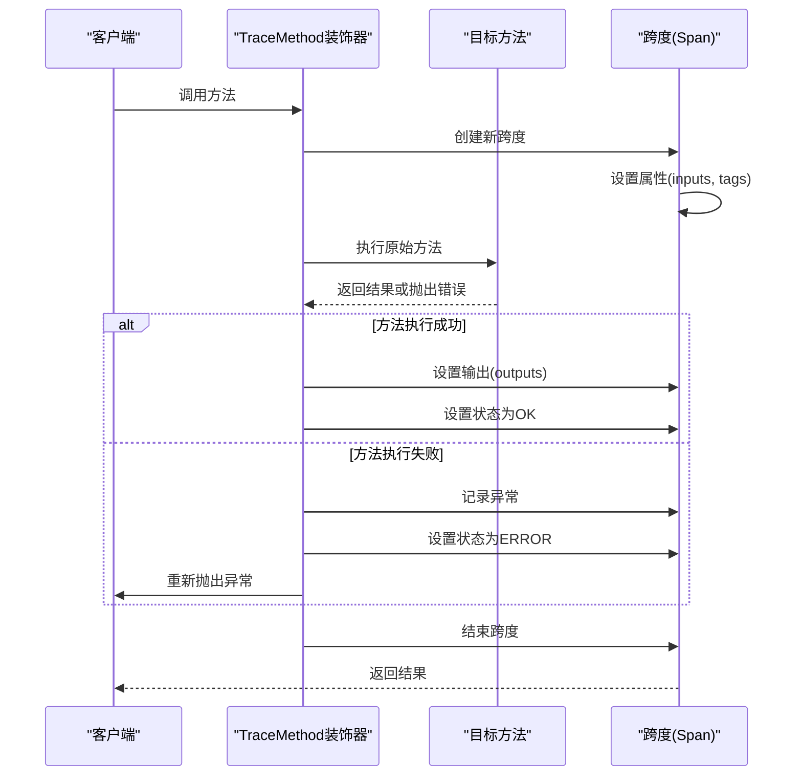
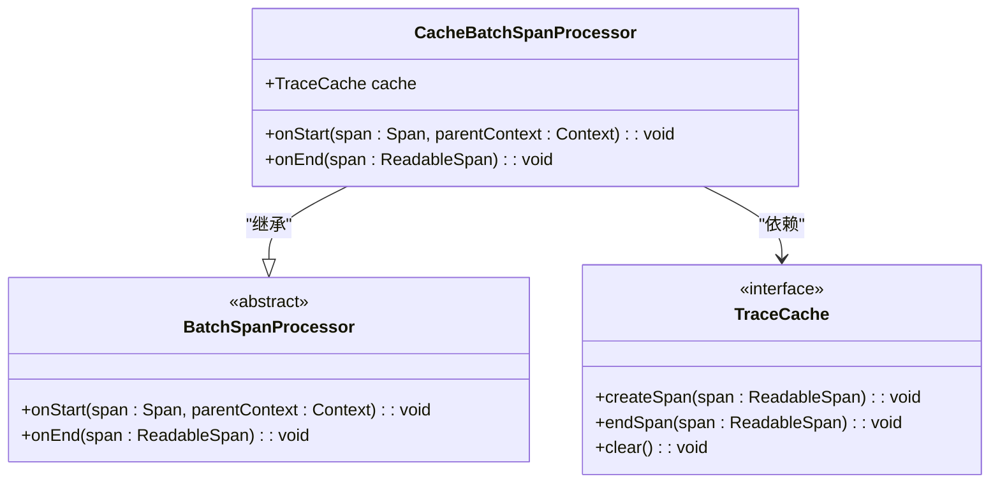
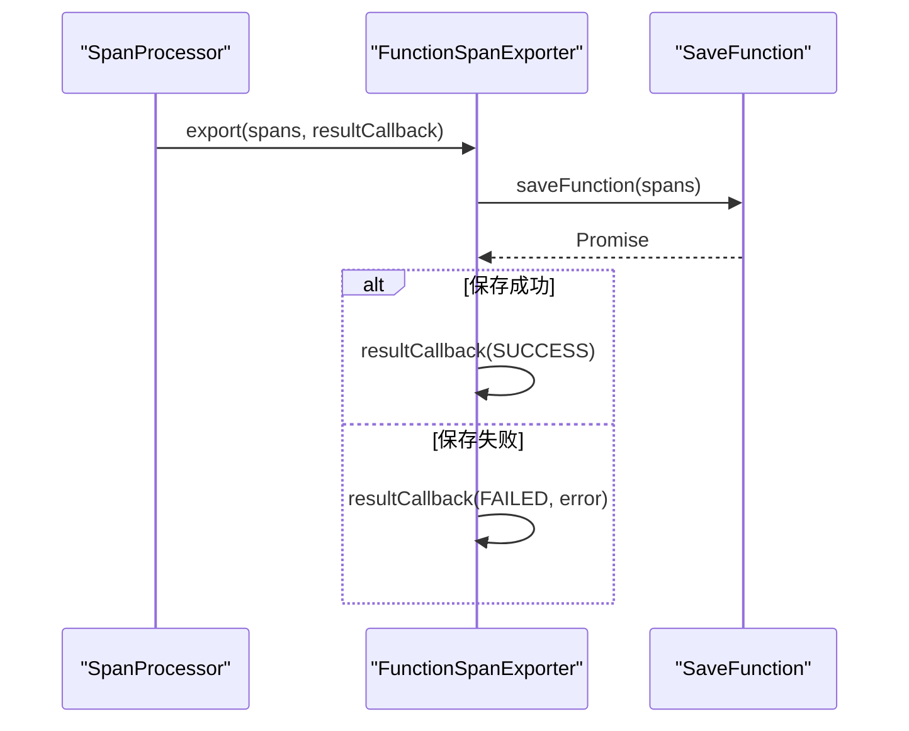
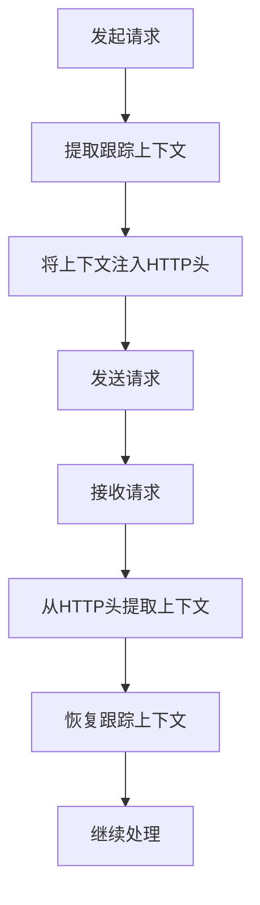
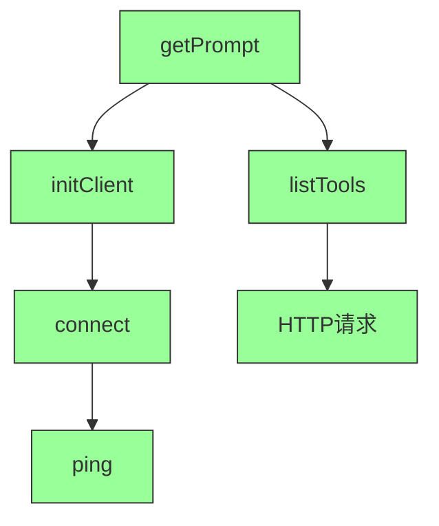

# MCP跟踪与监控

<cite>
**本文档引用的文件**
- [traceMethod.ts](file://packages/mcp-trace/trace-core/core/traceMethod.ts)
- [traceCache.ts](file://packages/mcp-trace/trace-core/core/traceCache.ts)
- [FuncSpanExporter.ts](file://packages/mcp-trace/trace-core/exporters/FuncSpanExporter.ts)
- [spanConvert.ts](file://packages/mcp-trace/trace-core/core/spanConvert.ts)
- [CacheSpanProcessor.ts](file://packages/mcp-trace/trace-core/processors/CacheSpanProcessor.ts)
- [EmitterSpanProcessor.ts](file://packages/mcp-trace/trace-core/processors/EmitterSpanProcessor.ts)
- [FuncSpanProcessor.ts](file://packages/mcp-trace/trace-core/processors/FuncSpanProcessor.ts)
- [config.ts](file://packages/mcp-trace/trace-core/types/config.ts)
- [nodeTracer.ts](file://packages/mcp-trace/trace-node/nodeTracer.ts)
- [webTracer.ts](file://packages/mcp-trace/trace-web/webTracer.ts)
- [TopicContextManager.ts](file://packages/mcp-trace/trace-web/TopicContextManager.ts)
- [traceContextPromise.ts](file://packages/mcp-trace/trace-web/traceContextPromise.ts)
- [MCPService.ts](file://src/main/services/MCPService.ts)
- [WebTraceService.ts](file://src/renderer/src/services/WebTraceService.ts)
</cite>

## 目录
1. [简介](#简介)
2. [核心组件](#核心组件)
3. [跟踪数据结构与跨度生成](#跟踪数据结构与跨度生成)
4. [拦截与记录MCP方法调用](#拦截与记录mcp方法调用)
5. [性能优化与缓存机制](#性能优化与缓存机制)
6. [跟踪数据导出](#跟踪数据导出)
7. [上下文传播机制](#上下文传播机制)
8. [启用与配置MCP跟踪](#启用与配置mcp跟踪)
9. [性能分析与故障排查](#性能分析与故障排查)
10. [用户体验优化](#用户体验优化)
11. [可视化示例](#可视化示例)

## 简介
MCP（Model Context Protocol）跟踪与监控系统为MCP服务调用提供了端到端的跟踪能力。该系统基于OpenTelemetry标准构建，通过`mcp-trace`包实现了对MCP方法调用的全面监控。系统能够捕获调用的输入、输出、执行时间、错误信息等关键指标，为性能分析、故障排查和用户体验优化提供数据支持。本文档详细阐述了该跟踪系统的架构、核心组件、工作原理以及使用方法。

## 核心组件
MCP跟踪系统由多个核心组件构成，包括`traceMethod.ts`用于拦截和记录方法调用，`traceCache.ts`用于优化性能，`FuncSpanExporter.ts`用于导出跟踪数据，以及各种处理器和上下文管理器。这些组件协同工作，形成了一个完整的跟踪解决方案。

**本节来源**
- [traceMethod.ts](file://packages/mcp-trace/trace-core/core/traceMethod.ts)
- [traceCache.ts](file://packages/mcp-trace/trace-core/core/traceCache.ts)
- [FuncSpanExporter.ts](file://packages/mcp-trace/trace-core/exporters/FuncSpanExporter.ts)

## 跟踪数据结构与跨度生成
跟踪数据的核心是“跨度”（Span），它代表了MCP调用中的一个操作单元。每个跨度包含丰富的元数据，如跨度ID、追踪ID、父跨度ID、开始和结束时间、状态、属性等。`SpanEntity`接口定义了跨度的结构，包括`id`、`name`、`traceId`、`startTime`、`endTime`、`attributes`、`status`等字段。`spanConvert.ts`文件中的`convertSpanToSpanEntity`函数负责将OpenTelemetry的`ReadableSpan`转换为系统内部的`SpanEntity`，确保数据格式的一致性。

```mermaid
classDiagram
class SpanEntity {
+string id
+string name
+string parentId
+string traceId
+string status
+string kind
+Attributes attributes
+boolean isEnd
+TimedEvent[] events
+number startTime
+number endTime
+Link[] links
+string topicId
+TokenUsage usage
+string modelName
}
class Attributes {
+{ [key : string] : AttributeValue }
}
class AttributeValue {
+string | number | boolean | Array<null | undefined | string> | Array<null | undefined | number> | Array<null | undefined | boolean> | { [key : string] : string | number | boolean } | Array<null | undefined | { [key : string] : string | number | boolean }>
}
class TokenUsage {
+number prompt_tokens
+number completion_tokens
+number total_tokens
+{ [key : string] : number } prompt_tokens_details
}
SpanEntity --> Attributes : "包含"
Attributes --> AttributeValue : "包含"
SpanEntity --> TokenUsage : "可选包含"
```

**图表来源**
- [config.ts](file://packages/mcp-trace/trace-core/types/config.ts#L29-L59)
- [spanConvert.ts](file://packages/mcp-trace/trace-core/core/spanConvert.ts#L11-L27)

**本节来源**
- [config.ts](file://packages/mcp-trace/trace-core/types/config.ts)
- [spanConvert.ts](file://packages/mcp-trace/trace-core/core/spanConvert.ts)

## 拦截与记录MCP方法调用
`traceMethod.ts`文件实现了对MCP方法调用的拦截和记录。它提供了`TraceMethod`装饰器，可以应用于任何类方法。当被装饰的方法被调用时，装饰器会自动创建一个跨度，记录方法的输入参数、执行过程和输出结果。如果方法执行成功，跨度状态被设置为OK；如果发生错误，错误信息会被记录，跨度状态被设置为ERROR，并重新抛出异常。`withSpanFunc`函数提供了对普通函数的跟踪能力，允许在函数执行时创建和管理跨度。



**图表来源**
- [traceMethod.ts](file://packages/mcp-trace/trace-core/core/traceMethod.ts#L14-L53)

**本节来源**
- [traceMethod.ts](file://packages/mcp-trace/trace-core/core/traceMethod.ts)

## 性能优化与缓存机制
`traceCache.ts`定义了`TraceCache`接口，为跟踪数据的缓存提供了契约。`CacheSpanProcessor.ts`实现了`CacheBatchSpanProcessor`类，它继承自OpenTelemetry的`BatchSpanProcessor`，并在`onStart`和`onEnd`方法中调用`TraceCache`的`createSpan`和`endSpan`方法，从而在跨度生命周期的关键节点上与缓存系统进行交互。这种设计允许将跨度数据暂存于内存中，避免了对后端存储的频繁写入，显著提升了性能。



**图表来源**
- [CacheSpanProcessor.ts](file://packages/mcp-trace/trace-core/processors/CacheSpanProcessor.ts#L8-L43)
- [traceCache.ts](file://packages/mcp-trace/trace-core/core/traceCache.ts#L3-L7)

**本节来源**
- [traceCache.ts](file://packages/mcp-trace/trace-core/core/traceCache.ts)
- [CacheSpanProcessor.ts](file://packages/mcp-trace/trace-core/processors/CacheSpanProcessor.ts)

## 跟踪数据导出
`FuncSpanExporter.ts`文件实现了`FunctionSpanExporter`类，这是一个自定义的`SpanExporter`。它接收一个`SaveFunction`作为构造函数参数，该函数定义了如何处理导出的跨度数据。当`export`方法被调用时，它会将一批`ReadableSpan`传递给`SaveFunction`，并根据函数执行的结果回调`resultCallback`，通知导出成功或失败。这种方式提供了极大的灵活性，允许将跟踪数据导出到任何目标，如数据库、文件系统或第三方监控服务。



**图表来源**
- [FuncSpanExporter.ts](file://packages/mcp-trace/trace-core/exporters/FuncSpanExporter.ts#L7-L27)

**本节来源**
- [FuncSpanExporter.ts](file://packages/mcp-trace/trace-core/exporters/FuncSpanExporter.ts)

## 上下文传播机制
为了在分布式环境中保持跟踪的连续性，系统实现了上下文传播机制。`nodeTracer.ts`和`webTracer.ts`分别用于Node.js和Web环境。它们通过`W3CTraceContextPropagator`来序列化和反序列化跟踪上下文（包含traceId和spanId），确保在服务间调用时，跟踪信息能够正确传递。`TopicContextManager.ts`是Web环境下的一个关键组件，它使用`Map`来管理不同`topicId`对应的上下文栈，解决了在浏览器环境中无法使用`AsyncLocalStorage`的问题，确保了每个话题（Topic）的跟踪上下文独立且正确。



**图表来源**
- [nodeTracer.ts](file://packages/mcp-trace/trace-node/nodeTracer.ts#L1-L50)
- [webTracer.ts](file://packages/mcp-trace/trace-web/webTracer.ts#L1-L49)
- [TopicContextManager.ts](file://packages/mcp-trace/trace-web/TopicContextManager.ts#L1-L77)

**本节来源**
- [nodeTracer.ts](file://packages/mcp-trace/trace-node/nodeTracer.ts)
- [webTracer.ts](file://packages/mcp-trace/trace-web/webTracer.ts)
- [TopicContextManager.ts](file://packages/mcp-trace/trace-web/TopicContextManager.ts)

## 启用与配置MCP跟踪
要启用MCP跟踪，首先需要在应用启动时初始化跟踪器。在Node.js环境中，调用`NodeTracer.init(config)`；在Web环境中，调用`WebTracer.init(config)`。`config`对象可以包含`serviceName`、`endpoint`（用于远程导出）、`headers`和`defaultTracerName`等配置项。然后，将`FunctionSpanExporter`或`EmitterSpanProcessor`等处理器添加到跟踪器中。最后，使用`@TraceMethod`装饰器标记需要跟踪的MCP服务方法，如`MCPService.ts`中的`getPrompt`方法。

**本节来源**
- [nodeTracer.ts](file://packages/mcp-trace/trace-node/nodeTracer.ts)
- [webTracer.ts](file://packages/mcp-trace/trace-web/webTracer.ts)
- [MCPService.ts](file://src/main/services/MCPService.ts#L778-L794)

## 性能分析与故障排查
利用MCP跟踪数据，可以进行深入的性能分析和故障排查。通过分析跨度的`startTime`和`endTime`，可以计算出每个MCP调用的耗时，识别性能瓶颈。`attributes`中的`inputs`和`outputs`提供了调用的详细参数和结果，有助于复现问题。当`status`为ERROR时，`recordException`记录的错误堆栈是诊断问题的关键。`EmitterSpanProcessor`可以将跟踪数据实时发送到前端，用于构建实时监控面板。

**本节来源**
- [MCPService.ts](file://src/main/services/MCPService.ts)
- [EmitterSpanProcessor.ts](file://packages/mcp-trace/trace-core/processors/EmitterSpanProcessor.ts)

## 用户体验优化
跟踪数据不仅用于后端监控，还能直接优化用户体验。例如，`WebTraceService.ts`可以接收来自`EmitterSpanProcessor`的跟踪事件，并在UI中显示MCP调用的进度条。通过监听`ON_START`和`ON_END`事件，可以实时更新界面上的加载状态，让用户清晰地了解后台操作的进展，提升应用的响应感和透明度。

**本节来源**
- [WebTraceService.ts](file://src/renderer/src/services/WebTraceService.ts)
- [EmitterSpanProcessor.ts](file://packages/mcp-trace/trace-core/processors/EmitterSpanProcessor.ts)

## 可视化示例
跟踪数据可以被可视化为调用树或火焰图。一个典型的MCP调用树可能包含一个根跨度（如"getPrompt"），其下有多个子跨度（如"initClient"、"listTools"等）。每个节点的宽度代表其持续时间，颜色代表其状态（绿色为成功，红色为失败）。这种可视化方式使得复杂的调用链路一目了然，便于快速定位问题。



**图表来源**
- [MCPService.ts](file://src/main/services/MCPService.ts)