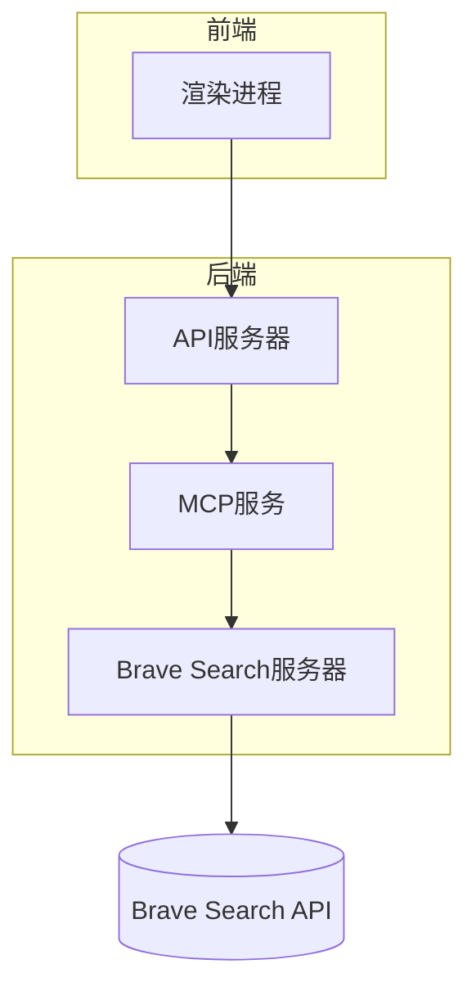
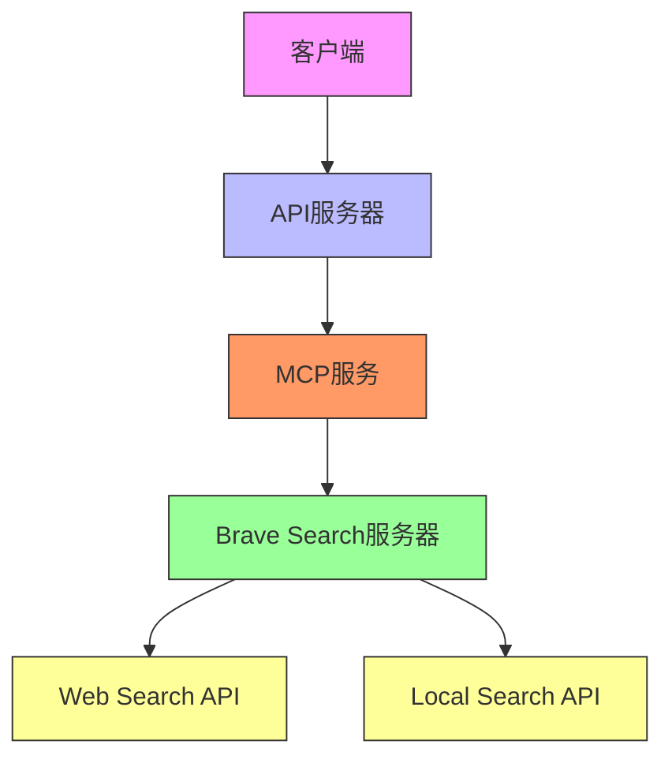
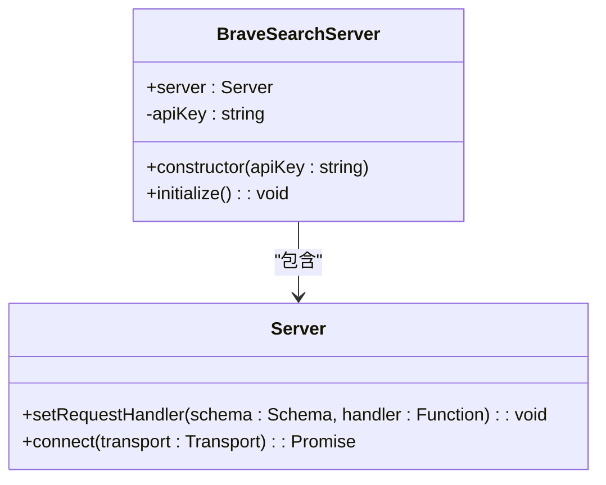
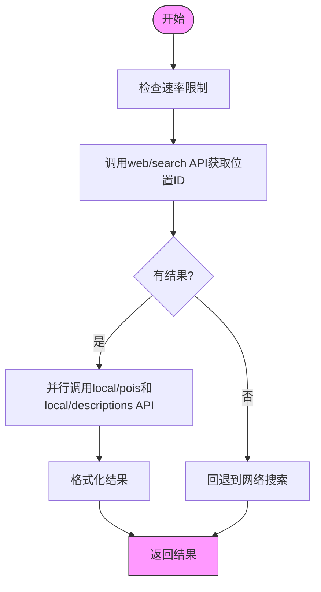
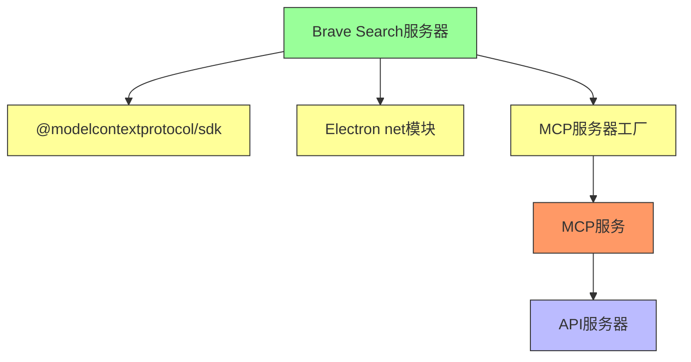

# Brave Search服务器

<cite>
**本文档中引用的文件**  
- [brave-search.ts](file://src/main/mcpServers/brave-search.ts)
- [factory.ts](file://src/main/mcpServers/factory.ts)
- [MCPService.ts](file://src/main/services/MCPService.ts)
- [mcp.ts](file://src/main/apiServer/routes/mcp.ts)
- [mcp.ts](file://src/main/apiServer/services/mcp.ts)
</cite>

## 目录
1. [简介](#简介)
2. [项目结构](#项目结构)
3. [核心组件](#核心组件)
4. [架构概述](#架构概述)
5. [详细组件分析](#详细组件分析)
6. [依赖分析](#依赖分析)
7. [性能考虑](#性能考虑)
8. [故障排除指南](#故障排除指南)
9. [结论](#结论)

## 简介
Brave Search MCP服务器是Cherry Studio中的一个内置服务，它通过Brave Search API提供网络搜索和本地搜索功能。该服务器实现了Model Context Protocol (MCP)标准，允许AI代理通过标准化接口访问搜索功能。服务器提供了两个主要工具：`brave_web_search`用于通用网络搜索，`brave_local_search`用于本地商业和地点搜索。服务器实施了严格的速率限制机制，确保每秒最多1次请求，每月最多15,000次请求。本地搜索功能采用多阶段流程，首先通过web/search API获取位置ID，然后并行调用local/pois和local/descriptions API获取详细信息。

## 项目结构
Brave Search MCP服务器的实现位于Cherry Studio项目的`src/main/mcpServers/`目录中。该服务器作为内置MCP服务器之一，通过工厂模式创建和管理。服务器通过API服务器暴露给外部客户端，API服务器处理HTTP请求并将其转换为MCP协议消息。MCP服务层负责管理服务器生命周期、连接和工具调用。



**图表来源**  
- [brave-search.ts](file://src/main/mcpServers/brave-search.ts)
- [mcp.ts](file://src/main/apiServer/routes/mcp.ts)
- [mcp.ts](file://src/main/apiServer/services/mcp.ts)

**章节来源**  
- [brave-search.ts](file://src/main/mcpServers/brave-search.ts)
- [factory.ts](file://src/main/mcpServers/factory.ts)

## 核心组件
Brave Search MCP服务器的核心组件包括两个搜索工具：`brave_web_search`和`brave_local_search`。`brave_web_search`工具用于执行通用网络搜索，适用于一般查询、新闻、文章和在线内容。`brave_local_search`工具用于搜索本地企业和地点，特别适合与物理位置、企业、餐厅和服务相关的查询。服务器实现了速率限制机制，每秒最多处理1次请求，每月最多15,000次请求。本地搜索功能采用智能回退机制，当没有找到本地结果时，会自动回退到网络搜索。

**章节来源**  
- [brave-search.ts](file://src/main/mcpServers/brave-search.ts#L9-L69)

## 架构概述
Brave Search MCP服务器的架构基于Model Context Protocol标准，采用分层设计。最底层是Brave Search API，提供网络搜索和本地搜索功能。中间层是Brave Search服务器实现，封装了API调用逻辑和速率限制。上层是MCP服务层，负责管理服务器实例和处理客户端请求。最上层是API服务器，将HTTP请求转换为MCP协议消息。这种分层架构确保了关注点分离，使每个组件都能专注于其特定职责。



**图表来源**  
- [brave-search.ts](file://src/main/mcpServers/brave-search.ts)
- [MCPService.ts](file://src/main/services/MCPService.ts)
- [mcp.ts](file://src/main/apiServer/services/mcp.ts)

## 详细组件分析

### Brave Search服务器分析
Brave Search服务器是一个TypeScript类，实现了MCP服务器接口。服务器在构造函数中接收API密钥，并在初始化时注册工具处理程序。服务器提供了两个主要工具：`brave_web_search`和`brave_local_search`，分别用于网络搜索和本地搜索。服务器实现了严格的速率限制机制，确保不会超出API的使用限制。

#### 服务器类结构


**图表来源**  
- [brave-search.ts](file://src/main/mcpServers/brave-search.ts#L291-L374)

**章节来源**  
- [brave-search.ts](file://src/main/mcpServers/brave-search.ts#L291-L374)

### 工具实现分析
Brave Search服务器提供了两个主要工具：`brave_web_search`和`brave_local_search`。这些工具的实现遵循MCP标准，具有清晰的输入模式和描述。每个工具都有特定的用途和参数要求，确保客户端能够正确使用它们。

#### 工具定义
```mermaid
classDiagram
class Tool {
+name : string
+description : string
+inputSchema : Object
}
class WebSearchTool {
+name : "brave_web_search"
+description : "执行Brave Search API的网络搜索..."
+inputSchema : {query : string, count : number, offset : number}
}
class LocalSearchTool {
+name : "brave_local_search"
+description : "使用Brave的本地搜索API搜索本地企业..."
+inputSchema : {query : string, count : number}
}
Tool <|-- WebSearchTool
Tool <|-- LocalSearchTool
```

**图表来源**  
- [brave-search.ts](file://src/main/mcpServers/brave-search.ts#L9-L64)

**章节来源**  
- [brave-search.ts](file://src/main/mcpServers/brave-search.ts#L9-L64)

### 本地搜索流程分析
本地搜索功能的实现采用了多阶段流程。首先，服务器通过web/search API获取位置ID，然后并行调用local/pois和local/descriptions API获取详细信息。这种设计优化了性能，减少了总的响应时间。如果本地搜索没有返回结果，服务器会自动回退到网络搜索。

#### 本地搜索流程


**图表来源**  
- [brave-search.ts](file://src/main/mcpServers/brave-search.ts#L188-L224)

**章节来源**  
- [brave-search.ts](file://src/main/mcpServers/brave-search.ts#L188-L289)

## 依赖分析
Brave Search MCP服务器依赖于多个外部组件和库。服务器依赖于`@modelcontextprotocol/sdk`库来实现MCP协议，依赖于Electron的`net`模块进行HTTP请求。服务器通过工厂模式与MCP服务层集成，MCP服务层负责管理服务器实例的生命周期。API服务器依赖于MCP服务层来处理客户端请求。



**图表来源**  
- [brave-search.ts](file://src/main/mcpServers/brave-search.ts#L4-L7)
- [factory.ts](file://src/main/mcpServers/factory.ts)
- [MCPService.ts](file://src/main/services/MCPService.ts)

**章节来源**  
- [brave-search.ts](file://src/main/mcpServers/brave-search.ts#L4-L7)
- [factory.ts](file://src/main/mcpServers/factory.ts)

## 性能考虑
Brave Search MCP服务器在设计时考虑了多个性能因素。服务器实现了速率限制机制，防止对Brave Search API的过度调用。本地搜索功能采用并行API调用，减少了总的响应时间。服务器使用连接池和会话管理，减少了建立新连接的开销。API服务器实现了消息批处理，允许客户端在单个HTTP请求中发送多个MCP消息。

## 故障排除指南
当Brave Search MCP服务器出现问题时，可以检查以下几个方面：首先确认API密钥是否正确配置，服务器在没有API密钥时会抛出错误。其次检查网络连接，确保能够访问Brave Search API。如果遇到速率限制错误，需要等待一段时间再重试。对于本地搜索问题，可以检查查询是否包含位置信息，因为本地搜索需要明确的位置上下文。

**章节来源**  
- [brave-search.ts](file://src/main/mcpServers/brave-search.ts#L296-L298)
- [brave-search.ts](file://src/main/mcpServers/brave-search.ts#L83-L85)

## 结论
Brave Search MCP服务器是一个功能完整的搜索服务实现，它通过标准化的MCP接口提供了强大的网络和本地搜索功能。服务器的设计考虑了性能、可靠性和易用性，实现了智能的本地搜索流程和严格的速率限制。通过与Cherry Studio的MCP框架集成，该服务器能够无缝地为AI代理提供搜索能力，增强了应用程序的功能和用户体验。