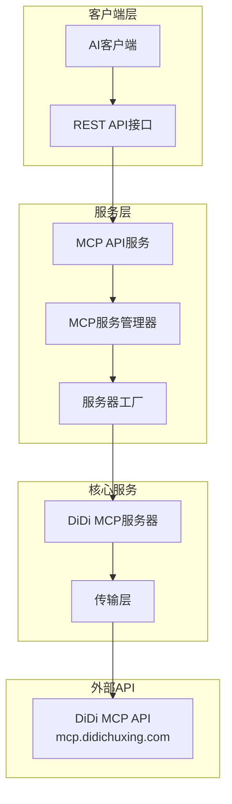
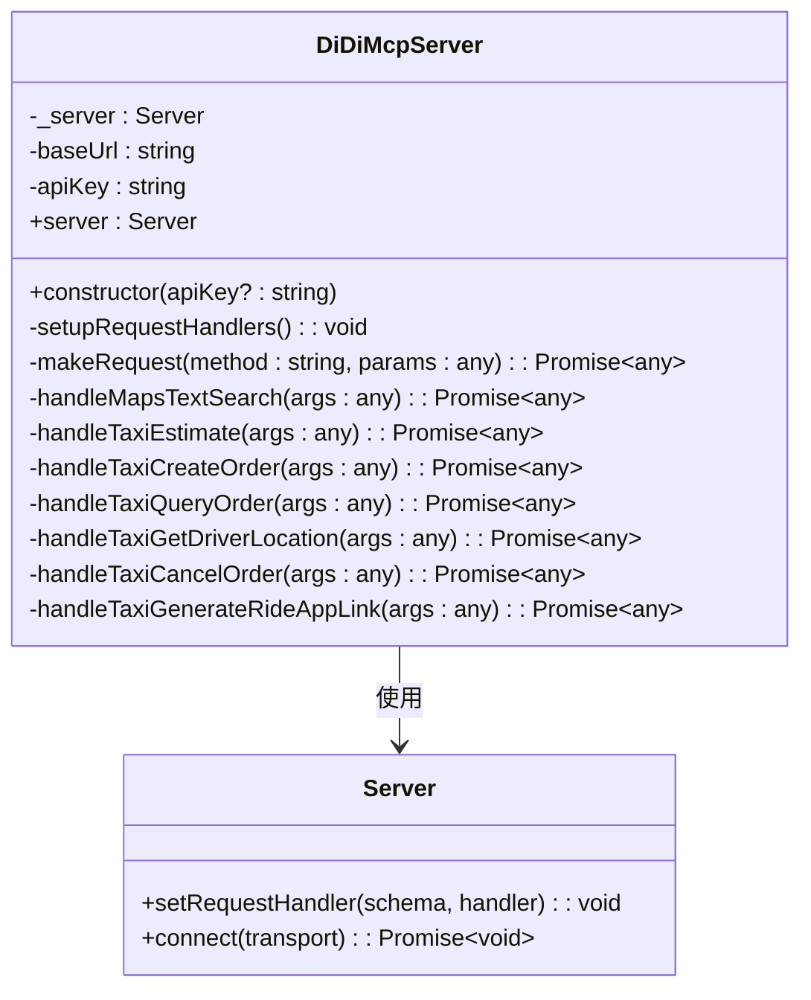
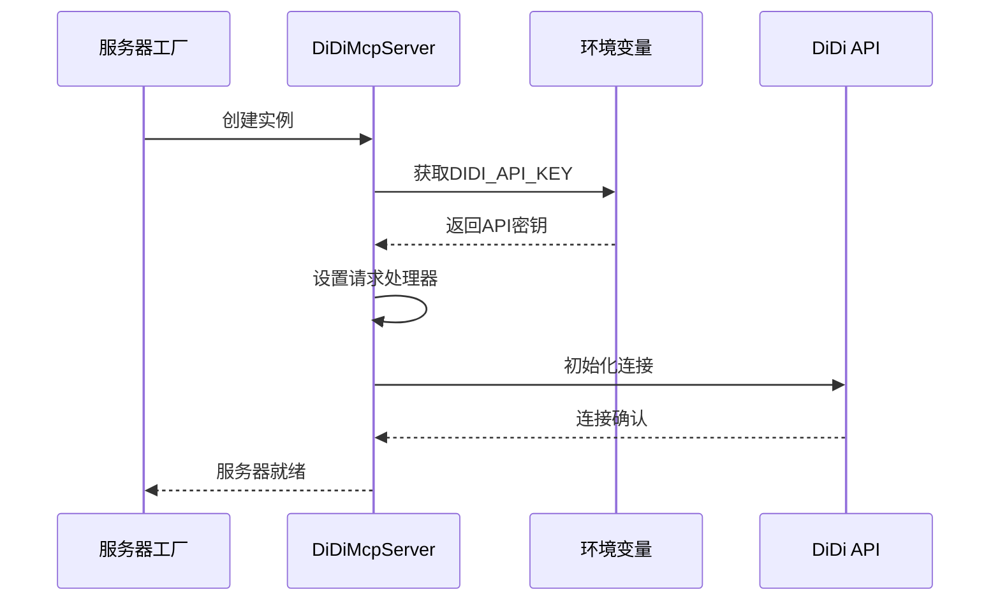
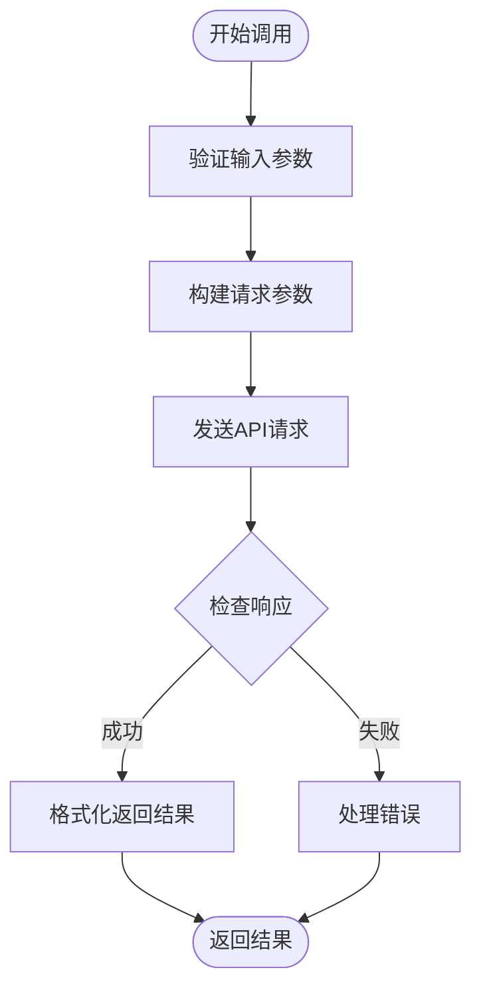
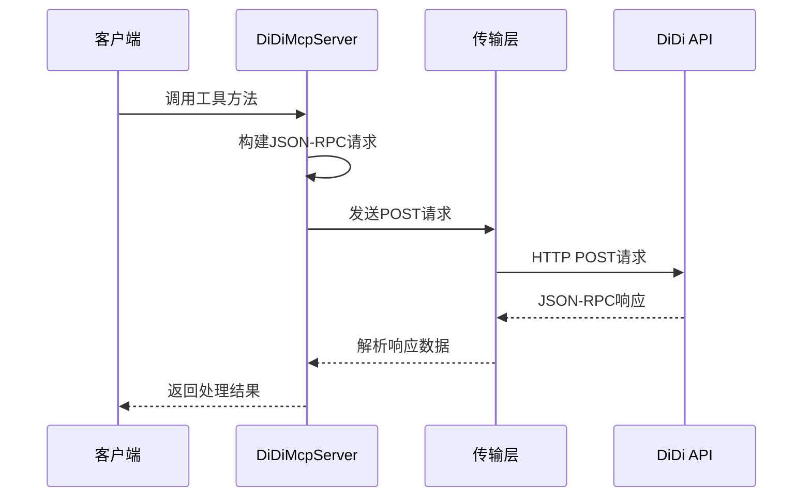
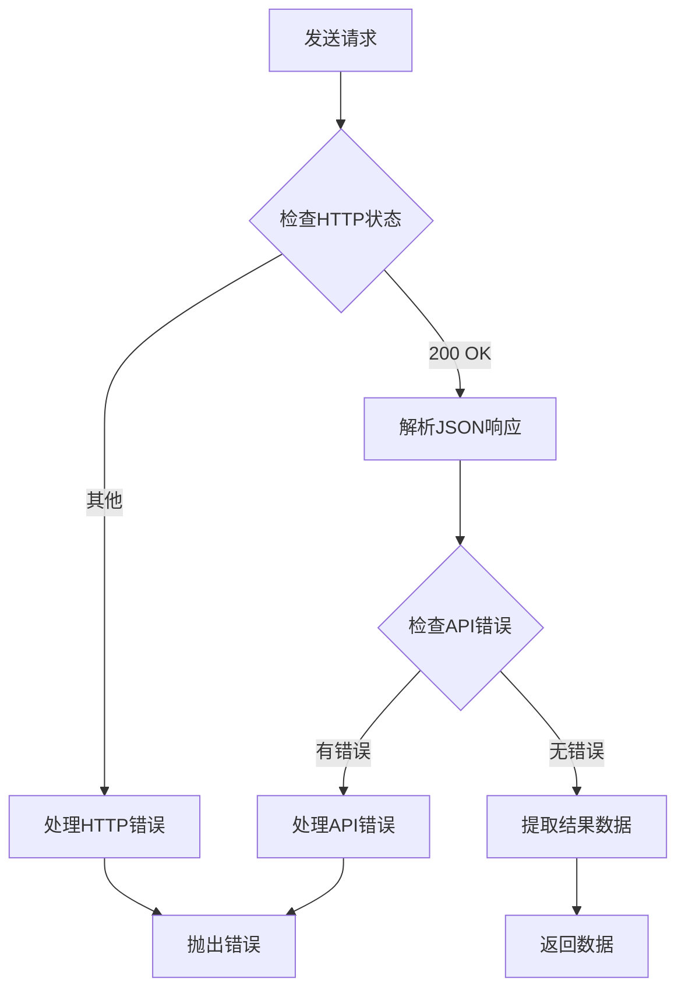
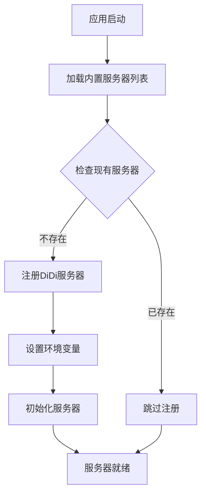
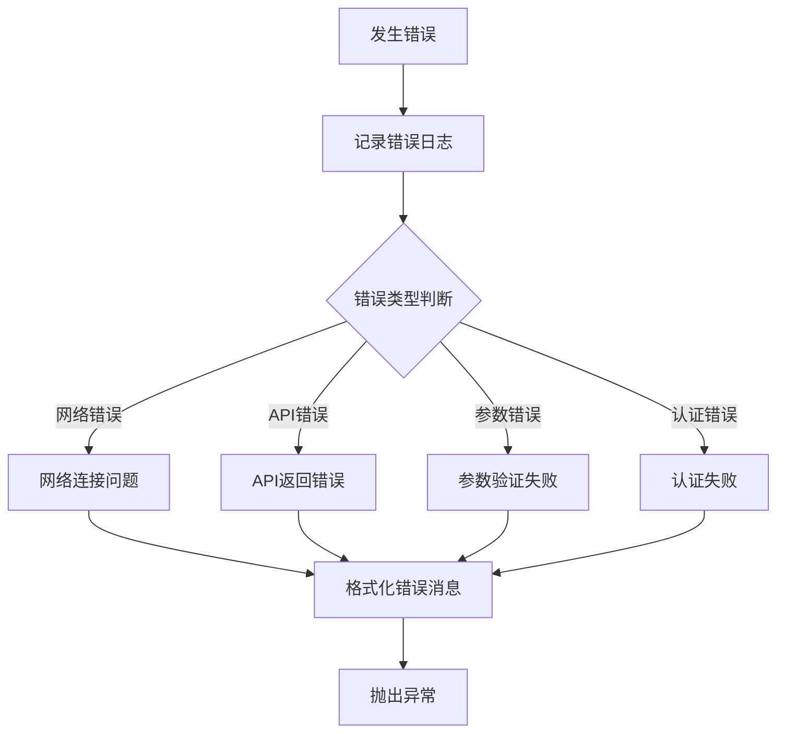

# DiDi MCP服务器详细功能文档

<cite>
**本文档中引用的文件**
- [didi-mcp.ts](file://src/main/mcpServers/didi-mcp.ts)
- [mcp.ts](file://src/main/apiServer/services/mcp.ts)
- [mcp.ts](file://src/main/apiServer/routes/mcp.ts)
- [factory.ts](file://src/main/mcpServers/factory.ts)
- [MCPService.ts](file://src/main/services/MCPService.ts)
- [fetch.ts](file://src/main/mcpServers/fetch.ts)
</cite>

## 目录
1. [简介](#简介)
2. [项目架构](#项目架构)
3. [核心组件](#核心组件)
4. [工具详解](#工具详解)
5. [API集成机制](#api集成机制)
6. [配置与部署](#配置与部署)
7. [错误处理](#错误处理)
8. [性能优化](#性能优化)
9. [故障排除指南](#故障排除指南)
10. [总结](#总结)

## 简介

DiDi MCP服务器是基于官方DiDi出行API的模型上下文协议（MCP）实现，为用户提供完整的打车服务功能。该服务器集成了地图搜索、价格估算、订单管理、司机追踪等核心功能，专门为中国大陆地区设计，提供本地化的出行解决方案。

### 主要特性

- **地图搜索服务**：基于关键词和城市的POI位置搜索
- **价格估算功能**：实时计算不同车型的预计费用
- **订单管理**：完整的订单生命周期管理
- **司机追踪**：实时获取司机位置信息
- **深度链接生成**：直接跳转到出行应用
- **错误处理机制**：完善的异常捕获和错误反馈

## 项目架构

DiDi MCP服务器采用模块化架构设计，通过MCP协议提供标准化的服务接口。



**图表来源**
- [didi-mcp.ts](file://src/main/mcpServers/didi-mcp.ts#L19-L473)
- [mcp.ts](file://src/main/apiServer/services/mcp.ts#L40-L185)
- [factory.ts](file://src/main/mcpServers/factory.ts#L17-L54)

**章节来源**
- [didi-mcp.ts](file://src/main/mcpServers/didi-mcp.ts#L1-L11)
- [factory.ts](file://src/main/mcpServers/factory.ts#L1-L55)

## 核心组件

### DiDiMcpServer类

DiDiMcpServer是整个系统的核心类，负责管理所有DiDi相关的MCP功能。



**图表来源**
- [didi-mcp.ts](file://src/main/mcpServers/didi-mcp.ts#L19-L473)

### 服务器初始化流程



**图表来源**
- [didi-mcp.ts](file://src/main/mcpServers/didi-mcp.ts#L24-L44)
- [factory.ts](file://src/main/mcpServers/factory.ts#L47-L49)

**章节来源**
- [didi-mcp.ts](file://src/main/mcpServers/didi-mcp.ts#L19-L473)
- [factory.ts](file://src/main/mcpServers/factory.ts#L17-L54)

## 工具详解

DiDi MCP服务器提供了七个核心工具，每个工具都有特定的功能和输入参数要求。

### 1. 地图文本搜索 (maps_textsearch)

**功能描述**：根据关键词和城市搜索POI位置信息。

**输入参数**：
| 参数名 | 类型 | 必需 | 描述 |
|--------|------|------|------|
| city | string | 是 | 查询城市名称 |
| keywords | string | 是 | 搜索关键词 |
| location | string | 否 | 位置坐标，格式：经度,纬度 |

**调用流程**：


**图表来源**
- [didi-mcp.ts](file://src/main/mcpServers/didi-mcp.ts#L243-L268)

### 2. 价格估算 (taxi_estimate)

**功能描述**：获取可用的车辆类型和预估费用。

**输入参数**：
| 参数名 | 类型 | 必需 | 描述 |
|--------|------|------|------|
| from_lng | string | 是 | 出发地经度 |
| from_lat | string | 是 | 出发地纬度 |
| from_name | string | 是 | 出发地名称 |
| to_lng | string | 是 | 目的地经度 |
| to_lat | string | 是 | 目的地纬度 |
| to_name | string | 是 | 目的地名称 |

### 3. 创建订单 (taxi_create_order)

**功能描述**：直接通过API创建出租车订单，无需打开应用界面。

**输入参数**：
| 参数名 | 类型 | 必需 | 描述 |
|--------|------|------|------|
| caller_car_phone | string | 否 | 叫车人电话号码 |
| estimate_trace_id | string | 是 | 来自价格估算的结果中的跟踪ID |
| product_category | string | 是 | 来自价格估算结果的车辆类别ID，多个类型用逗号分隔 |

### 4. 查询订单 (taxi_query_order)

**功能描述**：查询出租车订单状态和信息，如司机联系方式、车牌号、预计到达时间等。

**输入参数**：
| 参数名 | 类型 | 必需 | 描述 |
|--------|------|------|------|
| order_id | string | 否 | 订单ID，来自订单创建结果；如果不可用，则查询未完成的订单 |

### 5. 获取司机位置 (taxi_get_driver_location)

**功能描述**：获取出租车订单的实时司机位置。

**输入参数**：
| 参数名 | 类型 | 必需 | 描述 |
|--------|------|------|------|
| order_id | string | 是 | 出租车订单ID |

### 6. 取消订单 (taxi_cancel_order)

**功能描述**：取消出租车订单。

**输入参数**：
| 参数名 | 类型 | 必需 | 描述 |
|--------|------|------|------|
| order_id | string | 是 | 订单ID，来自订单创建或查询结果 |
| reason | string | 否 | 取消原因（可选）。示例：不再需要、等待太久、紧急事务 |

### 7. 生成出行应用链接 (taxi_generate_ride_app_link)

**功能描述**：根据出发地、目的地和车辆类型生成深度链接以打开出行应用。

**输入参数**：
| 参数名 | 类型 | 必需 | 描述 |
|--------|------|------|------|
| from_lat | string | 是 | 出发地纬度，必须来自地图工具 |
| from_lng | string | 是 | 出发地经度，必须来自地图工具 |
| to_lat | string | 是 | 目的地纬度，必须来自地图工具 |
| to_lng | string | 是 | 目的地经度，必须来自地图工具 |
| product_category | string | 否 | 来自价格估算结果的车辆类别ID，多个类型用逗号分隔 |

**章节来源**
- [didi-mcp.ts](file://src/main/mcpServers/didi-mcp.ts#L50-L210)

## API集成机制

### JSON-RPC请求处理

DiDi MCP服务器通过`fetch`向`mcp.didichuxing.com`发送JSON-RPC请求，实现了标准的远程过程调用机制。



**图表来源**
- [didi-mcp.ts](file://src/main/mcpServers/didi-mcp.ts#L439-L469)

### 请求构建机制

服务器使用统一的方法构建所有API请求：

```typescript
// 请求数据结构示例
const requestData = {
  jsonrpc: '2.0',
  method: 'tools/call',
  id: Date.now(),
  params: {
    name: 'tool_name',
    arguments: {
      // 工具体所需参数
    }
  }
}
```

### 响应处理流程



**图表来源**
- [didi-mcp.ts](file://src/main/mcpServers/didi-mcp.ts#L458-L469)

**章节来源**
- [didi-mcp.ts](file://src/main/mcpServers/didi-mcp.ts#L439-L469)

## 配置与部署

### API密钥配置

DiDi MCP服务器支持多种API密钥配置方式：

1. **构造函数参数**：直接在创建服务器时传入
2. **环境变量**：设置`DIDI_API_KEY`环境变量
3. **默认值**：为空字符串（会发出警告）

```typescript
// 方式1：构造函数传入
const server = new DiDiMcpServer('your-api-key')

// 方式2：环境变量
process.env.DIDI_API_KEY = 'your-api-key'

// 方式3：默认空值
const server = new DiDiMcpServer()
```

### 服务器注册机制

系统通过工厂模式自动注册内置的MCP服务器：



**图表来源**
- [factory.ts](file://src/main/mcpServers/factory.ts#L47-L49)

### 部署要求

- **地理位置**：仅在中国大陆可用
- **网络连接**：需要访问`mcp.didichuxing.com`域名
- **API密钥**：必须配置有效的DIDI_API_KEY
- **依赖项**：Node.js运行时环境

**章节来源**
- [didi-mcp.ts](file://src/main/mcpServers/didi-mcp.ts#L24-L41)
- [factory.ts](file://src/main/mcpServers/factory.ts#L47-L49)

## 错误处理

### 错误类型分类

DiDi MCP服务器实现了全面的错误处理机制：

1. **网络错误**：HTTP请求失败
2. **API错误**：DiDi API返回的错误信息
3. **参数错误**：输入参数验证失败
4. **认证错误**：API密钥无效或过期

### 错误处理流程



**图表来源**
- [didi-mcp.ts](file://src/main/mcpServers/didi-mcp.ts#L236-L238)

### 错误恢复策略

- **重试机制**：对于临时性错误提供重试机会
- **降级处理**：在部分功能不可用时提供替代方案
- **用户提示**：清晰的错误信息指导用户操作

**章节来源**
- [didi-mcp.ts](file://src/main/mcpServers/didi-mcp.ts#L236-L238)
- [didi-mcp.ts](file://src/main/mcpServers/didi-mcp.ts#L266-L267)

## 性能优化

### 缓存策略

虽然当前实现主要关注功能完整性，但系统架构支持多种缓存优化：

- **工具列表缓存**：5分钟TTL
- **资源列表缓存**：60分钟TTL
- **提示信息缓存**：30分钟TTL

### 并发处理

- **请求队列**：支持并发请求处理
- **超时控制**：可配置的请求超时机制
- **连接池**：复用HTTP连接减少开销

### 内存管理

- **对象池**：重用频繁创建的对象
- **垃圾回收**：及时释放不需要的资源
- **内存监控**：定期检查内存使用情况

## 故障排除指南

### 常见问题及解决方案

| 问题类型 | 症状 | 可能原因 | 解决方案 |
|----------|------|----------|----------|
| 认证失败 | API密钥无效错误 | 密钥配置错误或过期 | 检查DIDI_API_KEY配置 |
| 网络超时 | 请求超时错误 | 网络连接问题 | 检查网络连接和防火墙设置 |
| 参数错误 | 输入验证失败 | 参数格式不正确 | 检查参数格式和必需字段 |
| 功能不可用 | 服务不可达 | 地理位置限制 | 确认在中国大陆地区使用 |

### 调试技巧

1. **启用详细日志**：查看详细的请求和响应信息
2. **检查网络连接**：确保能够访问DiDi API域名
3. **验证API密钥**：确认密钥有效且具有相应权限
4. **测试基本功能**：先测试简单的地图搜索功能

### 监控指标

- **请求成功率**：监控各工具的成功率
- **响应时间**：跟踪API响应延迟
- **错误频率**：统计各类错误的发生频率
- **资源使用**：监控内存和CPU使用情况

## 总结

DiDi MCP服务器是一个功能完整、架构清晰的出行服务集成解决方案。它通过标准化的MCP协议，为AI客户端提供了丰富的打车功能，包括：

- **全面的地图服务**：支持关键词搜索和位置定位
- **智能的价格估算**：实时计算不同车型的费用
- **完整的订单管理**：从创建到取消的全流程支持
- **实时的司机追踪**：提供准确的司机位置信息
- **便捷的应用链接**：无缝跳转到出行应用

该系统的设计充分考虑了易用性、可靠性和扩展性，为开发者提供了一个稳定可靠的出行服务集成平台。通过合理的错误处理和性能优化，确保了在各种环境下的稳定运行。

对于希望集成DiDi出行服务的开发者来说，这个MCP服务器提供了一个标准化、易于使用的解决方案，大大简化了API集成的复杂度，同时保持了功能的完整性和灵活性。