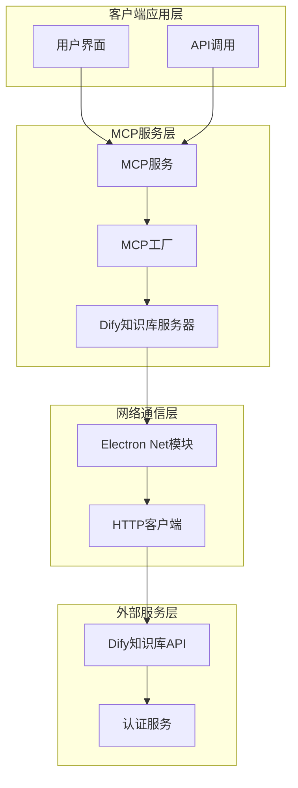
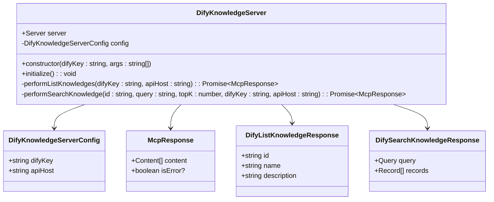
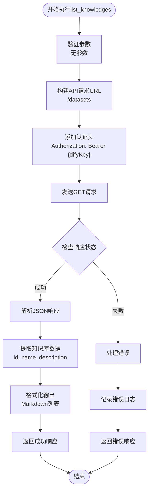
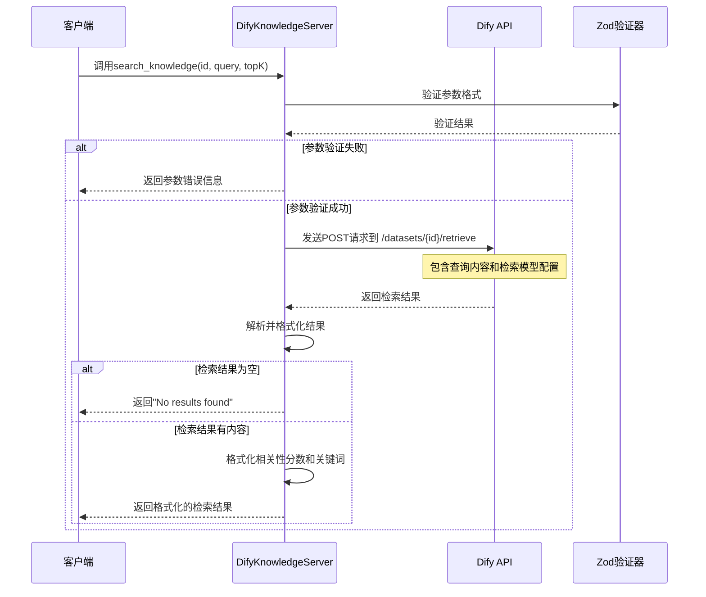
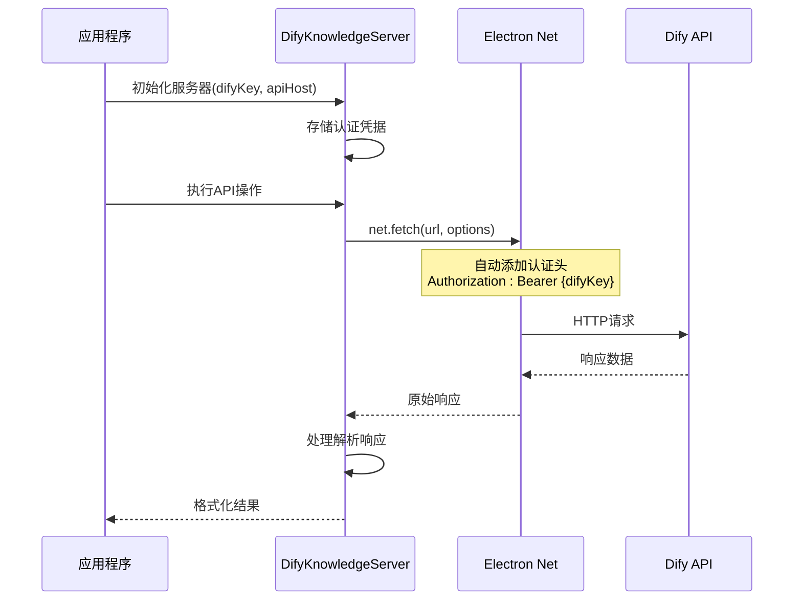
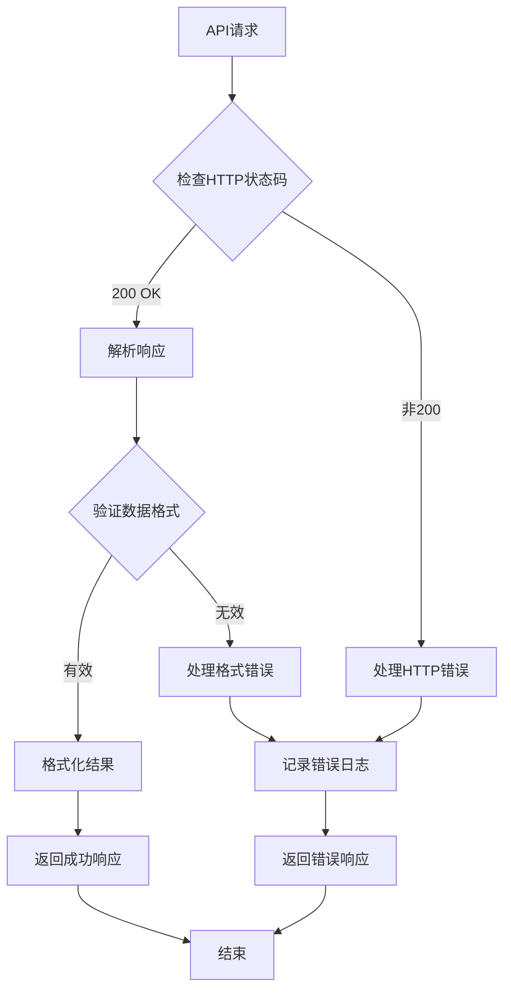
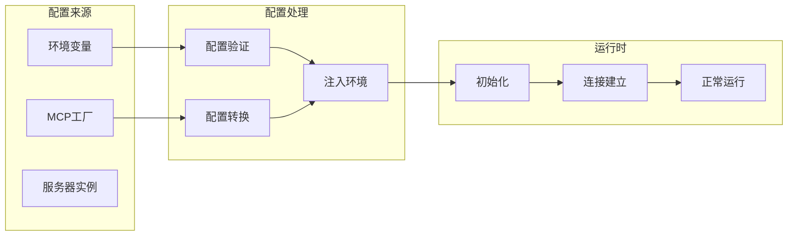
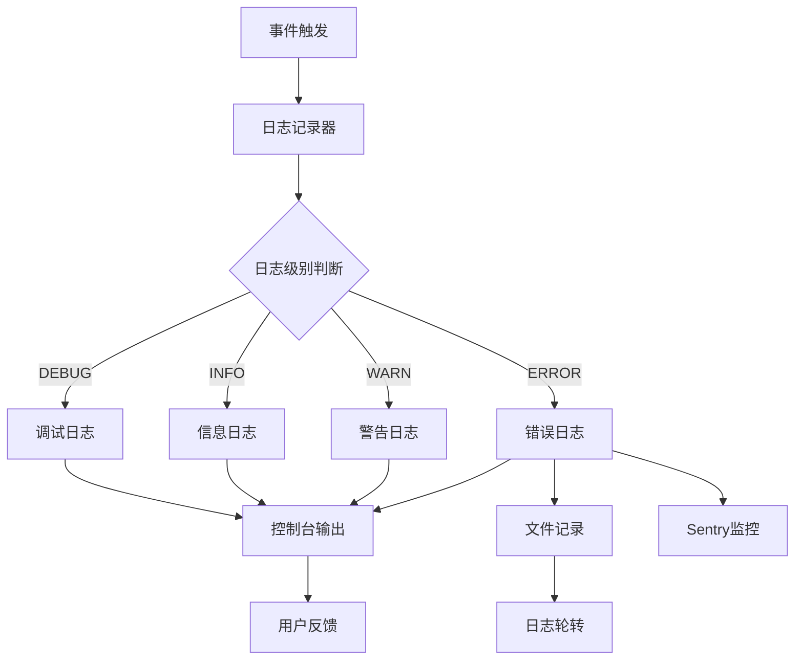
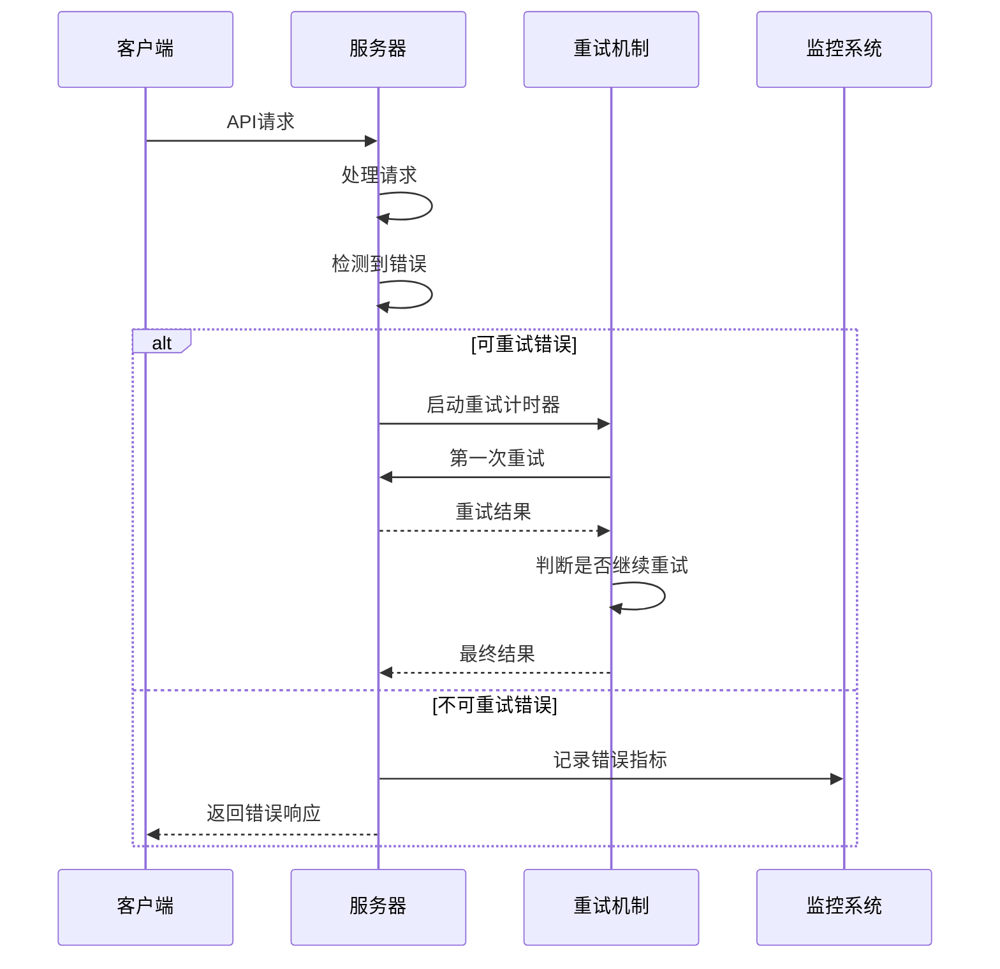
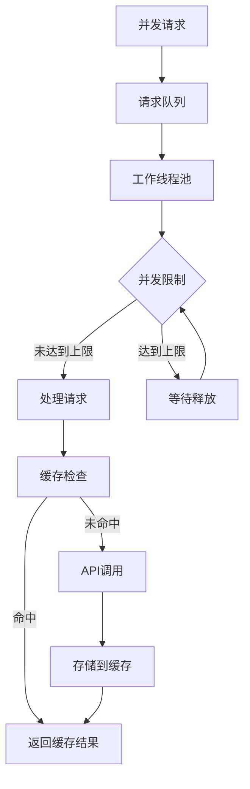

# Dify知识库MCP服务器详细功能文档

<cite>
**本文档引用的文件**
- [dify-knowledge.ts](file://src/main/mcpServers/dify-knowledge.ts)
- [factory.ts](file://src/main/mcpServers/factory.ts)
- [MCPService.ts](file://src/main/services/MCPService.ts)
- [mcp.ts](file://src/renderer/src/types/mcp.ts)
- [index.ts](file://src/renderer/src/types/index.ts)
- [memory.ts](file://src/main/mcpServers/memory.ts)
</cite>

## 目录
1. [简介](#简介)
2. [项目架构概览](#项目架构概览)
3. [核心组件分析](#核心组件分析)
4. [工具功能详解](#工具功能详解)
5. [API交互机制](#api交互机制)
6. [配置管理](#配置管理)
7. [错误处理与日志记录](#错误处理与日志记录)
8. [性能优化策略](#性能优化策略)
9. [故障排除指南](#故障排除指南)
10. [总结](#总结)

## 简介

Dify知识库MCP服务器是一个基于Model Context Protocol (MCP)协议的智能知识检索系统，专门设计用于连接外部的Dify知识库API，实现高效的知识检索和查询功能。该服务器提供了两个核心工具：`list_knowledges`和`search_knowledge`，通过Zod进行参数验证，并使用`net.fetch`与Dify API进行安全可靠的交互。

该系统采用模块化设计，支持多种部署方式，包括内置内存服务器模式和外部HTTP服务器模式。通过统一的接口设计，为上层应用提供了一致的知识服务体验。

## 项目架构概览

Dify知识库MCP服务器在整体架构中扮演着关键的数据集成角色，作为连接本地应用与外部Dify知识库的桥梁。



**图表来源**
- [dify-knowledge.ts](file://src/main/mcpServers/dify-knowledge.ts#L56-L77)
- [factory.ts](file://src/main/mcpServers/factory.ts#L17-L54)

**章节来源**
- [dify-knowledge.ts](file://src/main/mcpServers/dify-knowledge.ts#L1-L77)
- [factory.ts](file://src/main/mcpServers/factory.ts#L1-L55)

## 核心组件分析

### DifyKnowledgeServer类架构

DifyKnowledgeServer类是整个系统的核心，负责管理与Dify知识库的交互逻辑。



**图表来源**
- [dify-knowledge.ts](file://src/main/mcpServers/dify-knowledge.ts#L10-L51)
- [dify-knowledge.ts](file://src/main/mcpServers/dify-knowledge.ts#L135-L260)

### 配置接口设计

系统定义了清晰的配置接口，确保类型安全和配置一致性：

| 接口名称 | 属性 | 类型 | 描述 |
|---------|------|------|------|
| DifyKnowledgeServerConfig | difyKey | string | Dify API认证密钥 |
| DifyKnowledgeServerConfig | apiHost | string | Dify API主机地址 |
| DifyListKnowledgeResponse | id | string | 知识库唯一标识符 |
| DifyListKnowledgeResponse | name | string | 知识库显示名称 |
| DifyListKnowledgeResponse | description | string | 知识库描述信息 |
| DifySearchKnowledgeResponse | query.content | string | 检索查询内容 |
| DifySearchKnowledgeResponse | records | Array | 检索结果记录数组 |

**章节来源**
- [dify-knowledge.ts](file://src/main/mcpServers/dify-knowledge.ts#L10-L51)

## 工具功能详解

### list_knowledges工具

`list_knowledges`工具用于列出当前可用的所有知识库，提供简洁明了的知识库概览。

#### 功能特性
- **无参数要求**：该工具不需要任何输入参数
- **实时数据获取**：直接从Dify API获取最新的知识库列表
- **格式化输出**：以Markdown格式提供易读的列表展示
- **错误容错**：在网络异常或API错误时提供友好的错误提示

#### 执行流程



**图表来源**
- [dify-knowledge.ts](file://src/main/mcpServers/dify-knowledge.ts#L135-L177)

#### 输出格式示例

当存在可用知识库时，输出格式如下：
```
### 可用知识库:

- **产品手册** (ID: abc123-def456)
  这里是产品的详细使用说明文档
  
- **技术规范** (ID: def456-ghi789)
  包含系统的技术规格和架构文档
```

当没有可用知识库时，输出：
```
### 可用知识库:

- No knowledges found.
```

**章节来源**
- [dify-knowledge.ts](file://src/main/mcpServers/dify-knowledge.ts#L135-L177)

### search_knowledge工具

`search_knowledge`工具提供了强大的知识检索功能，支持精确的语义搜索和相关性排序。

#### 参数验证机制

该工具使用Zod进行严格的参数验证：

| 参数名称 | 类型 | 必需 | 描述 |
|---------|------|------|------|
| id | string | 是 | 目标知识库的唯一标识符 |
| query | string | 是 | 检索查询字符串 |
| topK | number | 否 | 返回的前N个结果，默认为6 |

#### 检索算法与结果处理



**图表来源**
- [dify-knowledge.ts](file://src/main/mcpServers/dify-knowledge.ts#L180-L260)

#### 检索结果格式化

搜索结果按照以下格式进行展示：

```
### Query: 如何配置数据库连接？

Found 3 results:

#### 1. 数据库配置指南 (Relevant Score: 92.3%)
数据库连接配置需要修改以下参数：
- 主机地址：localhost
- 端口：3306
- 用户名：admin
- 密码：*******

*Keywords: 数据库, 配置, 连接*

#### 2. 故障排除手册 (Relevant Score: 78.1%)
遇到数据库连接问题时，请检查：
1. 网络连接状态
2. 数据库服务是否启动
3. 认证凭据是否正确

#### 3. 性能优化指南 (Relevant Score: 65.4%)
数据库连接池配置建议：
- 最小连接数：5
- 最大连接数：50
- 连接超时：30秒
```

**章节来源**
- [dify-knowledge.ts](file://src/main/mcpServers/dify-knowledge.ts#L180-L260)

## API交互机制

### 认证与安全

系统采用Bearer Token认证机制，确保与Dify API的安全通信：



**图表来源**
- [dify-knowledge.ts](file://src/main/mcpServers/dify-knowledge.ts#L138-L142)
- [dify-knowledge.ts](file://src/main/mcpServers/dify-knowledge.ts#L189-L194)

### 请求与响应处理

#### list_knowledges API交互

| HTTP方法 | URL格式 | 认证方式 | 请求体 | 响应格式 |
|---------|---------|----------|--------|----------|
| GET | `{apiHost}/datasets` | Bearer Token | 无 | JSON数组 |

#### search_knowledge API交互

| HTTP方法 | URL格式 | 认证方式 | 请求体 | 响应格式 |
|---------|---------|----------|--------|----------|
| POST | `{apiHost}/datasets/{id}/retrieve` | Bearer Token | 包含查询和检索模型配置的JSON | 检索结果对象 |

### 错误处理机制

系统实现了多层次的错误处理策略：



**图表来源**
- [dify-knowledge.ts](file://src/main/mcpServers/dify-knowledge.ts#L145-L177)
- [dify-knowledge.ts](file://src/main/mcpServers/dify-knowledge.ts#L207-L260)

**章节来源**
- [dify-knowledge.ts](file://src/main/mcpServers/dify-knowledge.ts#L135-L260)

## 配置管理

### 环境变量配置

系统支持通过环境变量进行配置管理，主要涉及以下两个关键配置项：

| 配置项 | 环境变量名 | 类型 | 示例值 | 必需 |
|--------|------------|------|--------|------|
| Dify API密钥 | DIFY_KEY | string | `your_dify_api_key_here` | 是 |
| API主机地址 | API_HOST | string | `https://api.dify.ai` | 是 |

### 内置服务器配置

在内置内存服务器模式下，配置通过MCP工厂进行管理：



**图表来源**
- [factory.ts](file://src/main/mcpServers/factory.ts#L40-L42)

### 配置示例

#### 开发环境配置
```typescript
// .env 文件示例
DIFY_KEY=sk-xxxxxxxxxxxxxxxxxxxxxxxxxxxxxxxx
API_HOST=https://api.dify.ai/v1
```

#### 生产环境配置
```typescript
// 通过环境变量设置
process.env.DIFY_KEY = 'production_api_key';
process.env.API_HOST = 'https://api.dify.ai';
```

**章节来源**
- [factory.ts](file://src/main/mcpServers/factory.ts#L40-L42)
- [mcp.ts](file://src/renderer/src/types/mcp.ts#L1-L270)

## 错误处理与日志记录

### 错误分类与处理策略

系统实现了全面的错误处理机制，涵盖网络错误、API错误和数据格式错误：

| 错误类型 | 处理策略 | 日志级别 | 用户反馈 |
|---------|----------|----------|----------|
| 网络连接错误 | 重试机制 | ERROR | "无法连接到Dify API" |
| 认证失败 | 提示重新配置 | ERROR | "认证失败，请检查API密钥" |
| API限流 | 指数退避 | WARN | "请求过于频繁，请稍后重试" |
| 数据格式错误 | 数据验证 | ERROR | "收到无效的API响应" |
| 参数验证错误 | 立即返回 | INFO | "参数格式不正确" |

### 日志记录系统



**图表来源**
- [dify-knowledge.ts](file://src/main/mcpServers/dify-knowledge.ts#L169-L171)
- [dify-knowledge.ts](file://src/main/mcpServers/dify-knowledge.ts#L248-L250)

### 错误恢复机制

系统具备自动错误恢复能力：



**图表来源**
- [dify-knowledge.ts](file://src/main/mcpServers/dify-knowledge.ts#L169-L177)
- [dify-knowledge.ts](file://src/main/mcpServers/dify-knowledge.ts#L248-L260)

**章节来源**
- [dify-knowledge.ts](file://src/main/mcpServers/dify-knowledge.ts#L169-L177)
- [dify-knowledge.ts](file://src/main/mcpServers/dify-knowledge.ts#L248-L260)

## 性能优化策略

### 缓存机制

系统实现了多层级缓存策略以提升性能：

| 缓存层级 | 缓存内容 | 过期时间 | 缓存键生成 |
|---------|----------|----------|-----------|
| 内存缓存 | 知识库列表 | 5分钟 | `mcp:list_tool:{serverKey}` |
| 内存缓存 | 检索结果 | 1小时 | `mcp:search:{query}:{id}` |
| 文件缓存 | 配置数据 | 永久 | 文件路径哈希 |

### 并发控制



### 网络优化

- **连接复用**：使用持久连接减少握手开销
- **压缩传输**：启用gzip压缩减少带宽使用
- **超时控制**：合理设置请求超时避免长时间等待
- **重试策略**：指数退避算法处理临时性错误

**章节来源**
- [MCPService.ts](file://src/main/services/MCPService.ts#L111-L133)

## 故障排除指南

### 常见问题诊断

#### 1. 认证失败问题

**症状**：返回"认证失败"或401错误
**排查步骤**：
1. 检查DIFY_KEY是否正确设置
2. 验证API密钥格式是否符合要求
3. 确认API密钥权限是否足够

**解决方案**：
```bash
# 检查环境变量
echo $DIFY_KEY

# 重新设置配置
export DIFY_KEY="新的API密钥"
```

#### 2. 网络连接问题

**症状**：连接超时或网络不可达错误
**排查步骤**：
1. 测试API主机可达性
2. 检查防火墙设置
3. 验证代理配置

**解决方案**：
```bash
# 测试API连通性
curl -I "https://api.dify.ai/v1/datasets"

# 检查DNS解析
nslookup api.dify.ai
```

#### 3. 检索结果为空

**症状**：搜索返回"No results found"
**排查步骤**：
1. 确认知识库ID是否正确
2. 检查查询语句是否过于具体
3. 验证知识库内容是否完整

**解决方案**：
```javascript
// 使用更通用的查询词
const query = "基础配置";

// 检查可用知识库
await list_knowledges();
```

### 调试工具

系统提供了丰富的调试功能：

| 调试功能 | 使用方法 | 输出内容 |
|---------|----------|----------|
| 请求日志 | 启用DEBUG级别日志 | 完整的请求/响应信息 |
| 性能监控 | 启用性能追踪 | 请求耗时统计 |
| 错误追踪 | 启用错误报告 | 详细的错误堆栈 |

### 监控指标

关键性能指标监控：

- **响应时间**：API调用平均响应时间
- **成功率**：API调用成功百分比
- **错误率**：各类错误的发生频率
- **并发数**：同时处理的请求数量

**章节来源**
- [dify-knowledge.ts](file://src/main/mcpServers/dify-knowledge.ts#L169-L177)
- [dify-knowledge.ts](file://src/main/mcpServers/dify-knowledge.ts#L248-L260)

## 总结

Dify知识库MCP服务器是一个功能完善、设计精良的知识检索系统。它通过以下核心特性为用户提供卓越的服务：

### 主要优势

1. **类型安全**：使用TypeScript和Zod确保参数验证和类型安全
2. **高性能**：多层缓存机制和并发控制保证系统响应速度
3. **高可靠性**：完善的错误处理和恢复机制确保服务稳定性
4. **易于配置**：灵活的环境变量配置支持多种部署场景
5. **可观测性**：全面的日志记录和监控功能便于运维管理

### 技术特色

- **MCP协议支持**：遵循Model Context Protocol标准，与其他MCP服务器无缝集成
- **模块化设计**：清晰的职责分离和可扩展的架构设计
- **安全认证**：基于Bearer Token的安全认证机制
- **格式化输出**：提供美观易读的结果展示格式

### 应用价值

该系统为开发者提供了强大而便捷的知识检索能力，特别适用于：
- 智能客服系统
- 技术文档助手
- 企业知识管理
- 开发者工具集成

通过持续的优化和改进，Dify知识库MCP服务器将继续为用户提供更加优质的知识服务体验。