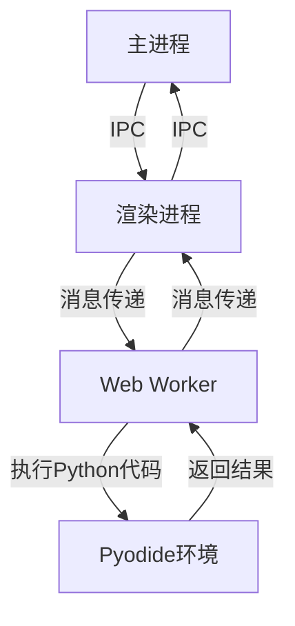

# Python执行服务器

<cite>
**本文档引用的文件**
- [python.ts](file://src/main/mcpServers/python.ts)
- [PythonService.ts](file://src/main/services/PythonService.ts)
- [PyodideService.ts](file://src/renderer/src/services/PyodideService.ts)
- [pyodide.worker.ts](file://src/renderer/src/workers/pyodide.worker.ts)
</cite>

## 目录
1. [简介](#简介)
2. [核心功能](#核心功能)
3. [工具参数详解](#工具参数详解)
4. [依赖管理](#依赖管理)
5. [通信机制](#通信机制)
6. [安全与隔离](#安全与隔离)
7. [代码示例](#代码示例)

## 简介
Python执行服务器是一个基于MCP（Model Context Protocol）协议的服务器，它允许在沙箱环境中安全地执行Python代码。该服务器利用Pyodide技术在浏览器环境中运行Python 3.12，支持标准库和科学计算包。通过`python_execute`工具，用户可以传递代码、上下文变量和超时设置来执行Python脚本。

**Section sources**
- [python.ts](file://src/main/mcpServers/python.ts#L8-L115)

## 核心功能
Python执行服务器的核心功能是提供一个安全的环境来执行Python代码。它通过以下方式实现：
- 使用Pyodide在Web Worker中执行Python代码
- 支持Python 3.12及大部分标准库和科学计算包
- 提供沙箱环境以确保代码执行的安全性
- 通过IPC（进程间通信）与主进程进行交互

服务器通过`python_execute`工具暴露其功能，该工具接受代码字符串、上下文变量和超时设置作为参数。

**Section sources**
- [python.ts](file://src/main/mcpServers/python.ts#L35-L67)
- [PythonService.ts](file://src/main/services/PythonService.ts#L57-L96)

## 工具参数详解
`python_execute`工具接受三个主要参数：

### code参数
- **类型**: 字符串
- **描述**: 要执行的Python代码
- **要求**: 必需参数，必须是有效的Python代码字符串

### context参数
- **类型**: 对象
- **描述**: 可选的上下文变量，将被传递到Python执行环境中
- **要求**: 可选参数，可以包含任意键值对

### timeout参数
- **类型**: 数字
- **描述**: 超时时间（毫秒），默认值为60000（60秒）
- **要求**: 可选参数，用于防止代码执行时间过长

这些参数的定义在MCP服务器的工具描述中明确指定，确保了客户端能够正确使用该工具。

**Section sources**
- [python.ts](file://src/main/mcpServers/python.ts#L48-L63)

## 依赖管理
Python执行服务器支持通过PEP 723元数据来安装依赖包。用户可以在Python脚本的开头添加特殊的注释块来声明所需的依赖。

例如，要安装`pydantic`包，可以在代码开头添加以下注释：
```python
# /// script
# dependencies = ['pydantic']
# ///
```

这种机制允许用户在执行代码时自动安装所需的第三方包，而无需手动配置环境。依赖管理功能由Pyodide底层支持，确保了依赖包能够正确下载和安装。

**Section sources**
- [python.ts](file://src/main/mcpServers/python.ts#L39-L43)

## 通信机制
Python执行服务器通过多层架构与主进程通信：

1. **主进程**：通过`PythonService`类发送执行请求
2. **渲染进程**：通过`PyodideService`类接收请求并执行代码
3. **Web Worker**：实际执行Python代码的隔离环境

通信流程如下：
- 主进程调用`pythonService.executeScript()`方法
- 通过Electron的IPC机制发送请求到渲染进程
- 渲染进程的`PyodideService`接收请求并转发给Web Worker
- Web Worker执行Python代码并将结果返回
- 结果通过IPC链路返回到主进程

这种分层架构确保了代码执行的安全性和稳定性。



**Diagram sources**
- [PythonService.ts](file://src/main/services/PythonService.ts#L57-L96)
- [PyodideService.ts](file://src/renderer/src/services/PyodideService.ts#L151-L203)
- [pyodide.worker.ts](file://src/renderer/src/workers/pyodide.worker.ts#L147-L218)

**Section sources**
- [PythonService.ts](file://src/main/services/PythonService.ts#L57-L96)
- [PyodideService.ts](file://src/renderer/src/services/PyodideService.ts#L151-L203)

## 安全与隔离
Python执行服务器通过多种机制确保代码执行的安全性和隔离性：

### 沙箱环境
- 所有Python代码在Web Worker中执行，与主应用完全隔离
- 使用Pyodide提供的沙箱环境，限制对系统资源的访问
- 每次执行都在独立的全局作用域中进行，防止状态污染

### 超时保护
- 默认60秒超时，可由用户自定义
- 超时后自动终止执行，防止无限循环
- 主进程和渲染进程都有超时机制，确保及时清理资源

### 错误处理
- 捕获所有执行错误并返回给调用方
- 记录详细的错误日志用于调试
- 确保错误不会影响主应用的稳定性

这些安全措施共同确保了Python代码能够在受控环境中安全执行。

**Section sources**
- [pyodide.worker.ts](file://src/renderer/src/workers/pyodide.worker.ts#L68-L114)
- [PythonService.ts](file://src/main/services/PythonService.ts#L73-L76)

## 代码示例
以下是使用Python执行服务器的代码示例：

### 基本代码执行
```python
print("Hello, World!")
x = 42
y = x * 2
print(f"Result: {y}")
```

### 使用上下文变量
```python
name = context["name"]
age = context["age"]
print(f"Hello, {name}! You are {age} years old.")
```

### 数学计算
```python
import math
radius = 5
area = math.pi * radius ** 2
print(f"Circle area: {area}")
```

### 设置超时
```python
# 设置30秒超时
timeout = 30000
# 执行可能耗时的操作
import time
time.sleep(10)
print("Operation completed")
```

### 安装依赖并使用
```python
# /// script
# dependencies = ['numpy']
# ///
import numpy as np
arr = np.array([1, 2, 3, 4, 5])
print(f"Array mean: {np.mean(arr)}")
```

这些示例展示了如何使用Python执行服务器的各种功能，包括基本代码执行、上下文变量传递、数学计算、超时设置和依赖管理。

**Section sources**
- [python.ts](file://src/main/mcpServers/python.ts#L37-L44)
- [pyodide.worker.ts](file://src/renderer/src/workers/pyodide.worker.ts#L173-L180)