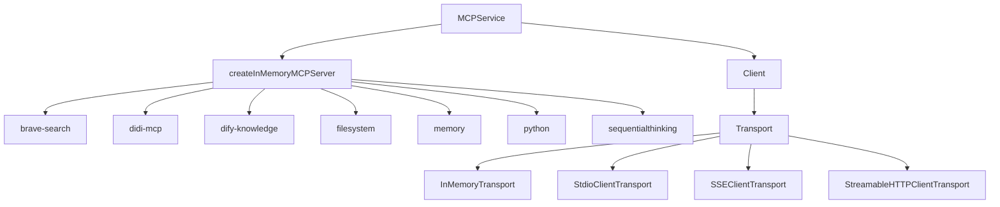
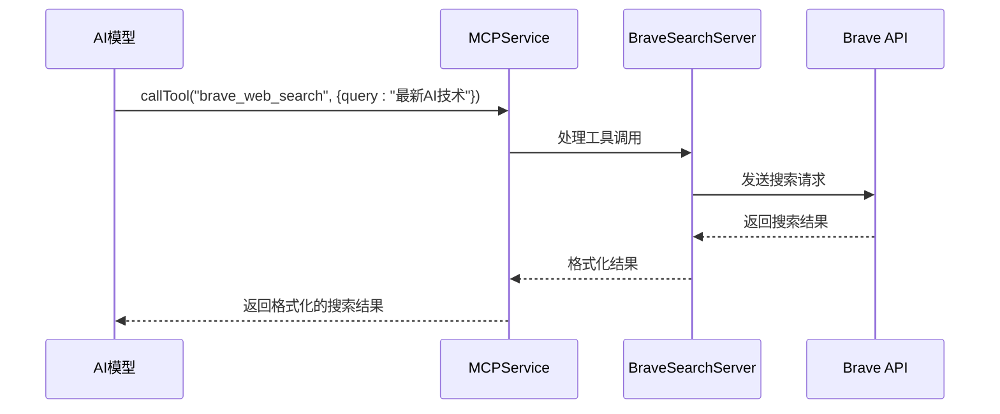

# 内置MCP服务器

<cite>
**本文档引用的文件**  
- [brave-search.ts](file://src/main/mcpServers/brave-search.ts)
- [didi-mcp.ts](file://src/main/mcpServers/didi-mcp.ts)
- [dify-knowledge.ts](file://src/main/mcpServers/dify-knowledge.ts)
- [filesystem.ts](file://src/main/mcpServers/filesystem.ts)
- [memory.ts](file://src/main/mcpServers/memory.ts)
- [python.ts](file://src/main/mcpServers/python.ts)
- [sequentialthinking.ts](file://src/main/mcpServers/sequentialthinking.ts)
- [factory.ts](file://src/main/mcpServers/factory.ts)
- [MCPService.ts](file://src/main/services/MCPService.ts)
- [mcp.ts](file://src/main/utils/mcp.ts)
</cite>

## 目录
1. [简介](#简介)
2. [系统架构](#系统架构)
3. [核心组件](#核心组件)
4. [详细组件分析](#详细组件分析)
    - [brave-search服务器](#brave-search服务器)
    - [didi-mcp服务器](#didi-mcp服务器)
    - [dify-knowledge服务器](#dify-knowledge服务器)
    - [filesystem服务器](#filesystem服务器)
    - [memory服务器](#memory服务器)
    - [python服务器](#python服务器)
    - [sequentialthinking服务器](#sequentialthinking服务器)
5. [依赖分析](#依赖分析)
6. [扩展与自定义指南](#扩展与自定义指南)
7. [结论](#结论)

## 简介
Cherry Studio内置的MCP（Model Context Protocol）服务器为AI模型提供了丰富的外部功能扩展能力。这些服务器通过统一的MCP协议暴露功能，使AI能够执行网络搜索、代码执行、文件系统操作、知识库查询等复杂任务。本文档详细介绍了brave-search、didi-mcp、dify-knowledge、filesystem、memory、python和sequentialthinking等内置MCP服务器的具体实现，包括其功能目的、接口定义、请求/响应数据结构、错误处理机制和使用场景。

**Section sources**
- [brave-search.ts](file://src/main/mcpServers/brave-search.ts)
- [didi-mcp.ts](file://src/main/mcpServers/didi-mcp.ts)
- [dify-knowledge.ts](file://src/main/mcpServers/dify-knowledge.ts)
- [filesystem.ts](file://src/main/mcpServers/filesystem.ts)
- [memory.ts](file://src/main/mcpServers/memory.ts)
- [python.ts](file://src/main/mcpServers/python.ts)
- [sequentialthinking.ts](file://src/main/mcpServers/sequentialthinking.ts)

## 系统架构
Cherry Studio的MCP服务器系统采用工厂模式和单例模式进行管理。`MCPService`作为核心服务，负责所有MCP服务器的生命周期管理，包括初始化、连接、调用和清理。`createInMemoryMCPServer`工厂函数根据服务器名称创建相应的服务器实例。所有服务器都遵循MCP SDK规范，通过`Server`类暴露工具列表和处理工具调用。



**Diagram sources**
- [factory.ts](file://src/main/mcpServers/factory.ts)
- [MCPService.ts](file://src/main/services/MCPService.ts)

**Section sources**
- [factory.ts](file://src/main/mcpServers/factory.ts)
- [MCPService.ts](file://src/main/services/MCPService.ts)

## 核心组件
核心组件包括MCP服务器工厂、MCP服务管理和工具调用处理。`createInMemoryMCPServer`函数是创建所有内置MCP服务器的入口点，它根据传入的服务器名称和配置参数实例化相应的服务器类。`MCPService`类提供了`initClient`、`listTools`、`callTool`等核心方法，用于与MCP服务器交互。

**Section sources**
- [factory.ts](file://src/main/mcpServers/factory.ts)
- [MCPService.ts](file://src/main/services/MCPService.ts)

## 详细组件分析
本节详细分析每个内置MCP服务器的具体实现。

### brave-search服务器
brave-search服务器提供基于Brave Search API的网络搜索功能，包括通用网页搜索和本地商家搜索。

#### 功能目的
- 执行通用网络搜索，获取网页、新闻、文章等内容
- 搜索本地商家和地点信息，如餐厅、服务等
- 支持分页、内容过滤和新鲜度控制

#### 接口定义
该服务器提供两个主要工具：
- `brave_web_search`: 执行通用网络搜索
- `brave_local_search`: 执行本地搜索

#### 请求/响应数据结构
```typescript
// 网络搜索请求
interface BraveWebSearchArgs {
  query: string; // 搜索查询
  count?: number; // 结果数量 (1-20, 默认10)
  offset?: number; // 分页偏移 (0-9, 默认0)
}

// 本地搜索请求
interface BraveLocalSearchArgs {
  query: string; // 本地搜索查询
  count?: number; // 结果数量 (1-20, 默认5)
}
```

#### 错误处理机制
- 实现了速率限制检查，每秒最多1次请求，每月最多15000次
- 对API响应进行验证，非200状态码时抛出错误
- 输入参数验证，确保查询字符串存在

#### 使用场景
- 当需要获取最新新闻或广泛信息时使用`brave_web_search`
- 当查询附近餐厅、商店等本地服务时使用`brave_local_search`
- 本地搜索无结果时自动回退到网络搜索



**Diagram sources**
- [brave-search.ts](file://src/main/mcpServers/brave-search.ts)

**Section sources**
- [brave-search.ts](file://src/main/mcpServers/brave-search.ts)

### didi-mcp服务器
didi-mcp服务器提供滴滴出行的打车服务功能。

#### 功能目的
- 搜索POI（兴趣点）位置
- 获取打车价格预估
- 创建和管理打车订单
- 查询司机实时位置

#### 接口定义
该服务器提供以下工具：
- `maps_textsearch`: 基于关键词和城市搜索POI位置
- `taxi_estimate`: 获取打车价格预估
- `taxi_create_order`: 创建打车订单
- `taxi_query_order`: 查询订单状态
- `taxi_cancel_order`: 取消订单
- `taxi_get_driver_location`: 获取司机位置
- `taxi_generate_ride_app_link`: 生成打车应用深度链接

#### 请求/响应数据结构
```typescript
// 地图文本搜索请求
interface MapsTextSearchArgs {
  city: string; // 查询城市
  keywords: string; // 搜索关键词
  location?: string; // 位置坐标 (经度,纬度)
}

// 打车预估请求
interface TaxiEstimateArgs {
  from_lat: string; // 出发地纬度
  from_lng: string; // 出发地经度
  from_name: string; // 出发地名称
  to_lat: string; // 目的地纬度
  to_lng: string; // 目的地经度
  to_name: string; // 目的地名称
}
```

#### 错误处理机制
- 检查API密钥是否存在
- 验证请求参数的完整性
- 处理HTTP响应错误和API错误
- 记录详细的错误日志

#### 使用场景
- 用户需要打车时，先使用`maps_textsearch`搜索目的地
- 使用`taxi_estimate`获取价格预估
- 使用`taxi_create_order`创建订单
- 使用`taxi_query_order`和`taxi_get_driver_location`跟踪订单状态

**Section sources**
- [didi-mcp.ts](file://src/main/mcpServers/didi-mcp.ts)

### dify-knowledge服务器
dify-knowledge服务器用于与Dify知识库集成，实现外部知识检索。

#### 功能目的
- 列出可用的知识库
- 在指定知识库中搜索相关内容
- 将外部知识作为上下文提供给AI模型

#### 接口定义
该服务器提供两个工具：
- `list_knowledges`: 列出所有知识库
- `search_knowledge`: 在指定知识库中搜索

#### 请求/响应数据结构
```typescript
// 搜索知识请求
interface SearchKnowledgeArgs {
  id: string; // 知识库ID
  query: string; // 查询字符串
  topK?: number; // 返回结果数量 (默认6)
}
```

#### 错误处理机制
- 使用Zod进行参数验证
- 处理API请求失败（网络错误、认证失败等）
- 验证API响应格式
- 返回格式化的错误信息

#### 使用场景
- 当AI需要访问特定领域的专业知识时
- 需要检索文档、FAQ或知识库中的信息时
- 作为RAG（检索增强生成）系统的一部分

**Section sources**
- [dify-knowledge.ts](file://src/main/mcpServers/dify-knowledge.ts)

### filesystem服务器
filesystem服务器提供安全的文件系统操作功能。

#### 功能目的
- 读取和写入文件
- 创建和管理目录
- 搜索文件
- 获取文件信息
- 编辑文件内容

#### 接口定义
该服务器提供以下工具：
- `read_file`: 读取单个文件
- `read_multiple_files`: 读取多个文件
- `write_file`: 写入文件
- `edit_file`: 编辑文件（返回diff）
- `create_directory`: 创建目录
- `list_directory`: 列出目录内容
- `directory_tree`: 获取目录树结构
- `move_file`: 移动或重命名文件
- `search_files`: 搜索文件
- `get_file_info`: 获取文件信息
- `list_allowed_directories`: 列出允许访问的目录

#### 请求/响应数据结构
```typescript
// 编辑文件请求
interface EditFileArgs {
  path: string; // 文件路径
  edits: Array<{
    oldText: string; // 要替换的文本
    newText: string; // 替换后的文本
  }>;
  dryRun?: boolean; // 是否为预览模式
}
```

#### 错误处理机制
- 实现了严格的路径验证，确保操作在允许的目录内
- 处理符号链接，防止路径遍历攻击
- 验证输入参数
- 返回详细的错误信息

#### 使用场景
- AI需要读取项目文件进行分析时
- 需要修改代码文件时
- 需要创建新文件或目录时
- 需要搜索特定文件时

**Section sources**
- [filesystem.ts](file://src/main/mcpServers/filesystem.ts)

### memory服务器
memory服务器提供基于知识图谱的记忆存储功能。

#### 功能目的
- 创建和管理实体（Entity）
- 创建和管理实体间的关系（Relation）
- 添加和删除观察（Observation）
- 搜索和查询知识图谱

#### 接口定义
该服务器提供以下工具：
- `create_entities`: 创建实体
- `create_relations`: 创建关系
- `add_observations`: 添加观察
- `delete_entities`: 删除实体
- `delete_observations`: 删除观察
- `delete_relations`: 删除关系
- `read_graph`: 读取整个知识图谱
- `search_nodes`: 搜索节点
- `open_nodes`: 打开指定节点

#### 请求/响应数据结构
```typescript
// 实体定义
interface Entity {
  name: string; // 实体名称
  entityType: string; // 实体类型
  observations: string[]; // 观察内容
}

// 关系定义
interface Relation {
  from: string; // 起始实体
  to: string; // 目标实体
  relationType: string; // 关系类型
}
```

#### 错误处理机制
- 使用MCP错误码（如InvalidParams, InternalError）
- 实现文件操作互斥锁（Mutex）防止并发写入冲突
- 验证实体存在性
- 处理JSON解析和文件读写错误

#### 使用场景
- AI需要记住用户偏好或历史信息时
- 需要建立概念间的关系网络时
- 进行长期对话记忆管理时
- 构建领域知识图谱时

**Section sources**
- [memory.ts](file://src/main/mcpServers/memory.ts)

### python服务器
python服务器提供在沙箱环境中执行Python代码的功能。

#### 功能目的
- 执行Python代码
- 支持科学计算包
- 通过PEP 723元数据安装依赖

#### 接口定义
该服务器提供`python_execute`工具。

#### 请求/响应数据结构
```typescript
// Python执行请求
interface PythonExecuteArgs {
  code: string; // 要执行的Python代码
  context?: Record<string, any>; // 上下文变量
  timeout?: number; // 超时时间 (毫秒, 默认60000)
}
```

#### 错误处理机制
- 验证代码参数
- 捕获执行异常
- 使用MCP错误码包装错误
- 记录详细的错误日志

#### 使用场景
- 需要执行数学计算或数据处理时
- 需要调用Python库进行特定任务时
- 需要验证代码逻辑时

**Section sources**
- [python.ts](file://src/main/mcpServers/python.ts)

### sequentialthinking服务器
sequentialthinking服务器提供结构化的思维过程管理。

#### 功能目的
- 管理复杂的思考过程
- 支持思维修订和分支
- 提供思考历史记录

#### 接口定义
该服务器提供`sequentialthinking`工具。

#### 请求/响应数据结构
```typescript
// 思维数据
interface ThoughtData {
  thought: string; // 当前思考内容
  thoughtNumber: number; // 当前思考编号
  totalThoughts: number; // 总思考数
  nextThoughtNeeded: boolean; // 是否需要下一步思考
  isRevision?: boolean; // 是否为修订
  revisesThought?: number; // 修订的思考编号
  branchFromThought?: number; // 分支来源思考编号
  branchId?: string; // 分支ID
}
```

#### 错误处理机制
- 验证思维数据的完整性
- 处理输入类型错误
- 记录格式化的思维过程

#### 使用场景
- 解决复杂问题需要多步推理时
- 需要回顾和修订先前思考时
- 需要探索不同解决方案分支时
- 进行假设生成和验证时

**Section sources**
- [sequentialthinking.ts](file://src/main/mcpServers/sequentialthinking.ts)

## 依赖分析
MCP服务器系统依赖于多个核心组件和第三方库。

```mermaid
graph TD
A[MCP服务器] --> B[@modelcontextprotocol/sdk]
A --> C[electron]
A --> D[zod]
A --> E[minimatch]
A --> F[async-mutex]
A --> G[diff]
A --> H[chalk]
B --> I[MCP协议实现]
C --> J[net.fetch]
D --> K[参数验证]
E --> L[文件模式匹配]
F --> M[文件操作互斥]
G --> N[生成diff]
H --> O[控制台输出格式化]
```

**Diagram sources**
- [brave-search.ts](file://src/main/mcpServers/brave-search.ts)
- [didi-mcp.ts](file://src/main/mcpServers/didi-mcp.ts)
- [dify-knowledge.ts](file://src/main/mcpServers/dify-knowledge.ts)
- [filesystem.ts](file://src/main/mcpServers/filesystem.ts)
- [memory.ts](file://src/main/mcpServers/memory.ts)
- [python.ts](file://src/main/mcpServers/python.ts)
- [sequentialthinking.ts](file://src/main/mcpServers/sequentialthinking.ts)

**Section sources**
- [brave-search.ts](file://src/main/mcpServers/brave-search.ts)
- [didi-mcp.ts](file://src/main/mcpServers/didi-mcp.ts)
- [dify-knowledge.ts](file://src/main/mcpServers/dify-knowledge.ts)
- [filesystem.ts](file://src/main/mcpServers/filesystem.ts)
- [memory.ts](file://src/main/mcpServers/memory.ts)
- [python.ts](file://src/main/mcpServers/python.ts)
- [sequentialthinking.ts](file://src/main/mcpServers/sequentialthinking.ts)

## 扩展与自定义指南
开发者可以通过以下方式扩展和自定义MCP服务器：

1. **创建新的MCP服务器**：
   - 继承`Server`类
   - 实现`ListToolsRequestSchema`和`CallToolRequestSchema`处理器
   - 在`factory.ts`中注册新服务器

2. **修改现有服务器**：
   - 扩展工具功能
   - 调整错误处理逻辑
   - 优化性能

3. **安全考虑**：
   - 文件系统服务器应严格限制访问目录
   - 代码执行服务器应在沙箱环境中运行
   - 网络请求服务器应实现适当的速率限制

4. **最佳实践**：
   - 使用清晰的工具名称和描述
   - 提供详细的输入参数验证
   - 实现健壮的错误处理
   - 记录详细的日志信息

**Section sources**
- [factory.ts](file://src/main/mcpServers/factory.ts)
- [mcp.ts](file://src/main/utils/mcp.ts)

## 结论
Cherry Studio的内置MCP服务器为AI模型提供了强大的功能扩展能力。通过统一的MCP协议，这些服务器能够安全、可靠地执行各种外部任务。每个服务器都有明确的功能定位和使用场景，从网络搜索到代码执行，从文件操作到知识检索，构成了一个完整的AI能力生态系统。开发者可以基于现有实现进行扩展和自定义，以满足特定需求。