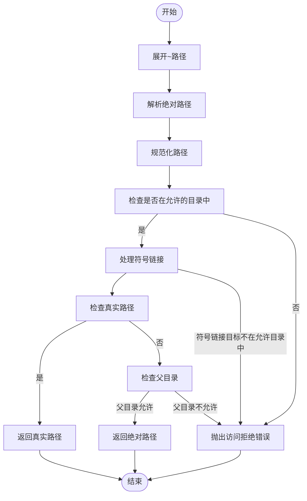
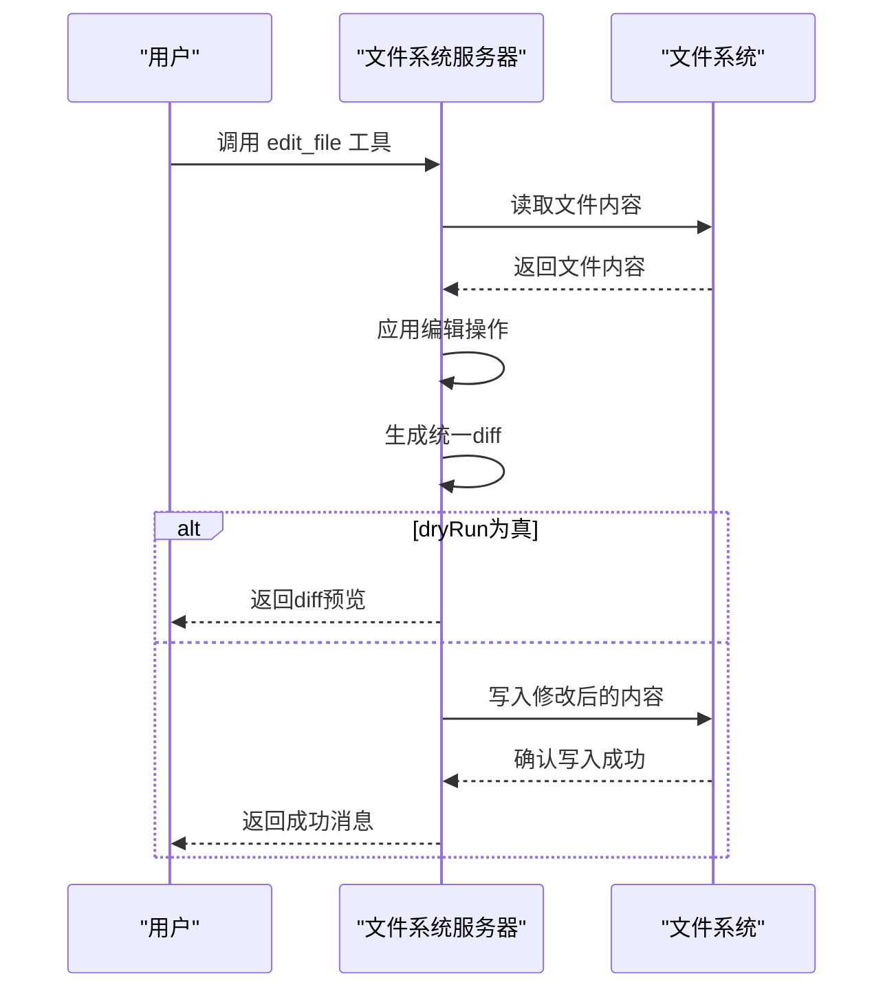

# 文件系统服务器

<cite>
**本文档引用的文件**  
- [filesystem.ts](file://src/main/mcpServers/filesystem.ts)
- [factory.ts](file://src/main/mcpServers/factory.ts)
- [mcp.ts](file://src/renderer/src/store/mcp.ts)
</cite>

## 目录
1. [简介](#简介)
2. [核心功能工具](#核心功能工具)
3. [安全机制](#安全机制)
4. [初始化与配置](#初始化与配置)
5. [详细工具说明](#详细工具说明)
6. [结论](#结论)

## 简介
文件系统MCP服务器提供了一套全面的文件操作能力，允许在受控环境中执行各种文件系统操作。该服务器实现了多种工具，包括读写文件、编辑文件、目录管理、搜索和元数据查询等功能。通过严格的访问控制机制，确保所有操作都在授权的目录范围内进行，从而保障系统的安全性。

**Section sources**
- [filesystem.ts](file://src/main/mcpServers/filesystem.ts#L1-L50)

## 核心功能工具
文件系统服务器提供了多个核心工具，用于执行不同的文件操作任务。这些工具包括`read_file`、`write_file`、`edit_file`、`create_directory`、`list_directory`、`directory_tree`、`move_file`、`search_files`和`get_file_info`等。每个工具都有特定的用途和参数，可以满足各种文件操作需求。

**Section sources**
- [filesystem.ts](file://src/main/mcpServers/filesystem.ts#L333-L436)

## 安全机制
文件系统服务器通过`validatePath`函数和`allowedDirectories`白名单来确保所有操作都在授权路径内进行。`validatePath`函数会验证请求的路径是否在允许的目录列表中，并处理符号链接，防止路径遍历攻击。此外，服务器还会检查父目录的存在性和权限，确保新文件的创建也是安全的。

**Diagram sources**
- [filesystem.ts](file://src/main/mcpServers/filesystem.ts#L28-L68)

**Section sources**
- [filesystem.ts](file://src/main/mcpServers/filesystem.ts#L28-L68)

## 初始化与配置
文件系统服务器在初始化时需要配置允许访问的目录。这些目录通过构造函数的参数传入，并在服务器启动时进行验证。如果提供的目录不存在或无法访问，服务器将抛出错误并停止启动。此外，服务器还支持通过环境变量和命令行参数进行配置，以适应不同的部署场景。

**Section sources**
- [filesystem.ts](file://src/main/mcpServers/filesystem.ts#L286-L298)
- [factory.ts](file://src/main/mcpServers/factory.ts#L37-L39)

## 详细工具说明
### 读取文件 (`read_file`)
`read_file`工具用于读取指定路径的文件内容。它接受一个包含`path`参数的对象作为输入，返回文件的完整内容。该工具仅限于在允许的目录内操作。

**Section sources**
- [filesystem.ts](file://src/main/mcpServers/filesystem.ts#L446-L456)

### 写入文件 (`write_file`)
`write_file`工具用于创建新文件或覆盖现有文件的内容。它接受一个包含`path`和`content`参数的对象作为输入，将指定内容写入文件。使用时需谨慎，因为它会无警告地覆盖现有文件。

**Section sources**
- [filesystem.ts](file://src/main/mcpServers/filesystem.ts#L480-L490)

### 编辑文件 (`edit_file`)
`edit_file`工具用于对文本文件进行基于行的编辑。它接受一个包含`path`、`edits`数组和可选`dryRun`标志的对象作为输入。`edits`数组中的每个元素包含要搜索的旧文本和替换的新文本。当`dryRun`为真时，工具会生成一个git风格的diff补丁，预览更改而不实际修改文件。

**Diagram sources**
- [filesystem.ts](file://src/main/mcpServers/filesystem.ts#L205-L281)

**Section sources**
- [filesystem.ts](file://src/main/mcpServers/filesystem.ts#L492-L502)

### 创建目录 (`create_directory`)
`create_directory`工具用于创建新的目录或确保目录存在。它可以递归地创建多层嵌套目录。如果目录已存在，操作将静默成功。

**Section sources**
- [filesystem.ts](file://src/main/mcpServers/filesystem.ts#L504-L514)

### 列出目录内容 (`list_directory`)
`list_directory`工具用于获取指定路径下的所有文件和目录的详细列表。结果中使用`[FILE]`和`[DIR]`前缀区分文件和目录类型。

**Section sources**
- [filesystem.ts](file://src/main/mcpServers/filesystem.ts#L516-L529)

### 目录树 (`directory_tree`)
`directory_tree`工具以JSON结构递归地显示文件和目录的树形视图。每个条目包含名称、类型（文件/目录）以及目录的子项数组。输出格式化为2个空格缩进，便于阅读。

**Section sources**
- [filesystem.ts](file://src/main/mcpServers/filesystem.ts#L531-L574)

### 移动文件 (`move_file`)
`move_file`工具用于移动或重命名文件和目录。它接受源路径和目标路径作为输入，可以在不同目录之间移动文件，也可以在同一目录内重命名。如果目标路径已存在，操作将失败。

**Section sources**
- [filesystem.ts](file://src/main/mcpServers/filesystem.ts#L576-L589)

### 搜索文件 (`search_files`)
`search_files`工具用于递归搜索匹配模式的文件和目录。它从指定的起始路径开始，在所有子目录中搜索。搜索不区分大小写，匹配部分名称，并返回所有匹配项的完整路径。该工具使用`minimatch`库进行模式匹配，支持通配符和排除模式。

**Section sources**
- [filesystem.ts](file://src/main/mcpServers/filesystem.ts#L146-L190)
- [filesystem.ts](file://src/main/mcpServers/filesystem.ts#L591-L606)

### 获取文件信息 (`get_file_info`)
`get_file_info`工具用于检索文件或目录的详细元数据。返回的信息包括大小、创建时间、最后修改时间、访问时间、权限和类型。此工具适用于了解文件特性而无需读取实际内容。

**Section sources**
- [filesystem.ts](file://src/main/mcpServers/filesystem.ts#L133-L144)
- [filesystem.ts](file://src/main/mcpServers/filesystem.ts#L608-L625)

## 结论
文件系统MCP服务器提供了一套强大且安全的文件操作功能。通过精心设计的安全机制和丰富的工具集，它能够在受控环境中执行各种文件系统任务。开发者可以根据需要配置允许访问的目录，并利用这些工具实现复杂的文件操作逻辑。该服务器的设计充分考虑了安全性和易用性，是构建自动化工作流和文件管理应用的理想选择。