# 记忆MCP服务器详细功能文档

<cite>
**本文档引用的文件**
- [memory.ts](file://src/main/mcpServers/memory.ts)
- [memory.ts](file://src/renderer/src/store/memory.ts)
- [memory-prompts.ts](file://src/renderer/src/utils/memory-prompts.ts)
- [traceMethod.ts](file://packages/mcp-trace/trace-core/core/traceMethod.ts)
- [MemoryService.ts](file://src/main/services/memory/MemoryService.ts)
</cite>

## 目录
1. [简介](#简介)
2. [系统架构概览](#系统架构概览)
3. [核心组件分析](#核心组件分析)
4. [知识图谱管理器详解](#知识图谱管理器详解)
5. [工具功能详解](#工具功能详解)
6. [数据持久化机制](#数据持久化机制)
7. [性能监控与追踪](#性能监控与追踪)
8. [错误处理策略](#错误处理策略)
9. [使用示例](#使用示例)
10. [总结](#总结)

## 简介

记忆MCP（Model Context Protocol）服务器是一个基于内存的知识图谱管理系统，专门设计用于长期记忆存储和管理。该系统通过实体-关系模型构建了一个灵活的记忆网络，支持动态添加、查询和管理用户相关的知识信息。

### 主要特性

- **基于内存的实体-关系知识图谱**：采用Map和Set数据结构优化内存访问效率
- **持久化存储**：自动将内存中的知识图谱保存到`memory.json`文件
- **并发安全**：使用`async-mutex`确保文件写入操作的线程安全
- **性能追踪**：集成`@TraceMethod`装饰器进行方法级性能监控
- **MCP协议支持**：完全兼容Model Context Protocol标准

## 系统架构概览

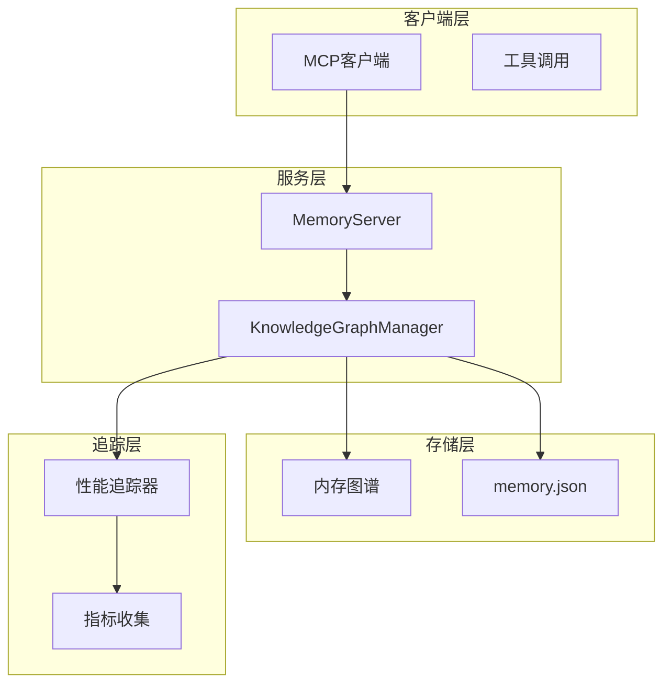

**图表来源**
- [memory.ts](file://src/main/mcpServers/memory.ts#L339-L715)

## 核心组件分析

### 知识图谱结构

系统的核心是基于以下三个主要接口构建的知识图谱：

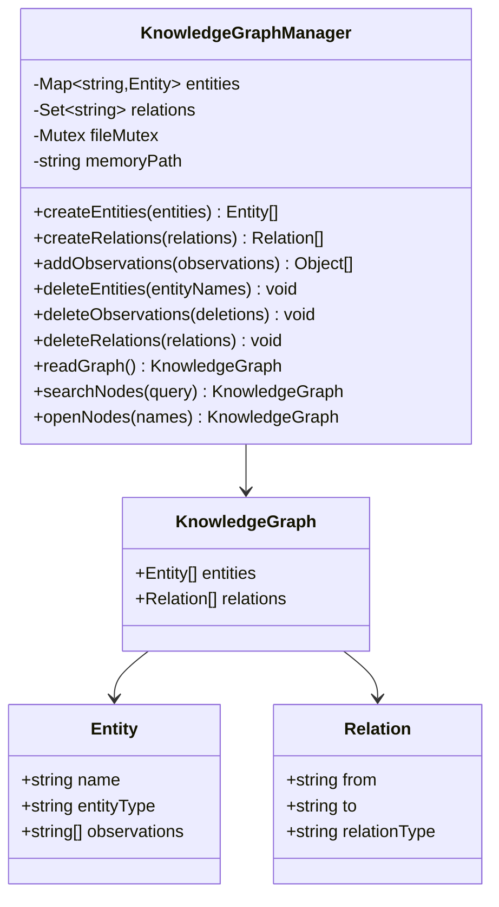

**图表来源**
- [memory.ts](file://src/main/mcpServers/memory.ts#L16-L32)
- [memory.ts](file://src/main/mcpServers/memory.ts#L35-L46)

**章节来源**
- [memory.ts](file://src/main/mcpServers/memory.ts#L16-L32)
- [memory.ts](file://src/main/mcpServers/memory.ts#L35-L46)

## 知识图谱管理器详解

### 初始化流程

`KnowledgeGraphManager`采用工厂模式进行初始化，确保系统的正确启动：

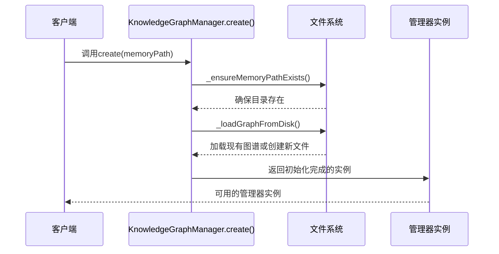

**图表来源**
- [memory.ts](file://src/main/mcpServers/memory.ts#L49-L55)
- [memory.ts](file://src/main/mcpServers/memory.ts#L57-L75)

### 内存数据结构

系统使用高效的数据结构来管理知识图谱：

| 组件 | 数据结构 | 用途 | 时间复杂度 |
|------|----------|------|------------|
| 实体管理 | `Map<string, Entity>` | 快速实体查找和更新 | O(1) |
| 关系管理 | `Set<string>` | 去重的关系存储 | O(1) |
| 序列化 | JSON字符串 | 持久化存储格式 | O(n) |

**章节来源**
- [memory.ts](file://src/main/mcpServers/memory.ts#L36-L46)
- [memory.ts](file://src/main/mcpServers/memory.ts#L137-L146)

## 工具功能详解

### create_entities - 创建实体

该工具负责向知识图谱中添加新的实体，支持批量操作：

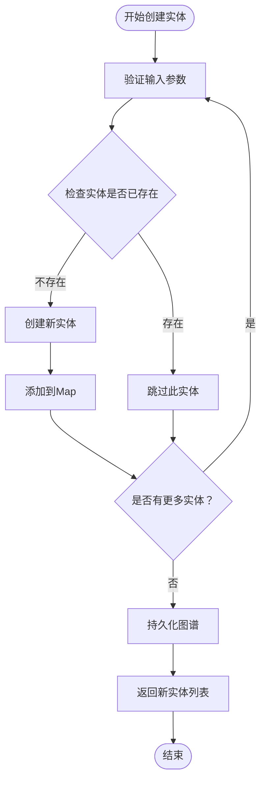

**图表来源**
- [memory.ts](file://src/main/mcpServers/memory.ts#L148-L163)

### create_relations - 创建关系

关系创建需要确保相关实体存在，并避免重复关系：

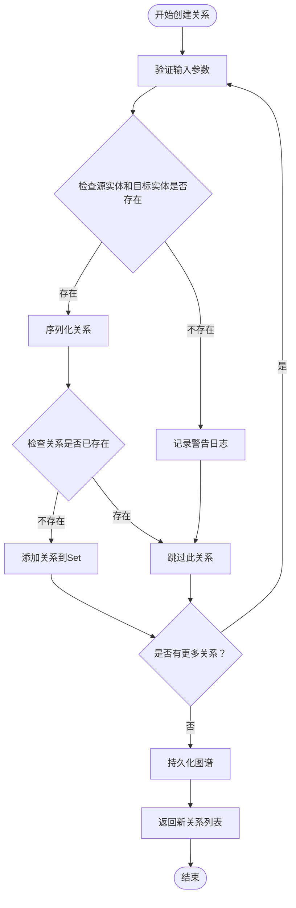

**图表来源**
- [memory.ts](file://src/main/mcpServers/memory.ts#L165-L184)

### add_observations - 添加观察

该工具允许向现有实体添加新的观察内容，支持去重处理：

| 参数 | 类型 | 描述 | 验证规则 |
|------|------|------|----------|
| entityName | string | 实体名称 | 必需，实体必须存在 |
| contents | string[] | 观察内容数组 | 必需，不能为空 |

**章节来源**
- [memory.ts](file://src/main/mcpServers/memory.ts#L186-L219)

### delete_entities - 删除实体

删除实体时会自动清理相关的所有关系：

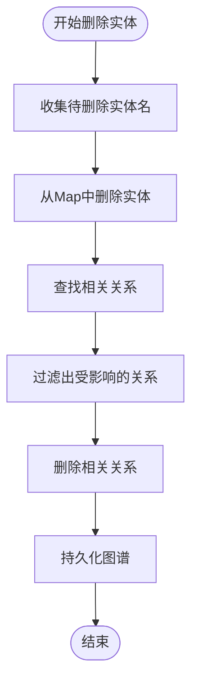

**图表来源**
- [memory.ts](file://src/main/mcpServers/memory.ts#L221-L251)

### search_nodes - 搜索节点

支持全文本搜索，可在实体名称、类型和观察内容中匹配：

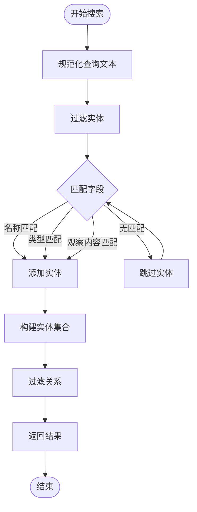

**图表来源**
- [memory.ts](file://src/main/mcpServers/memory.ts#L299-L319)

**章节来源**
- [memory.ts](file://src/main/mcpServers/memory.ts#L148-L336)

## 数据持久化机制

### 文件写入安全

系统使用`async-mutex`确保文件写入操作的线程安全：

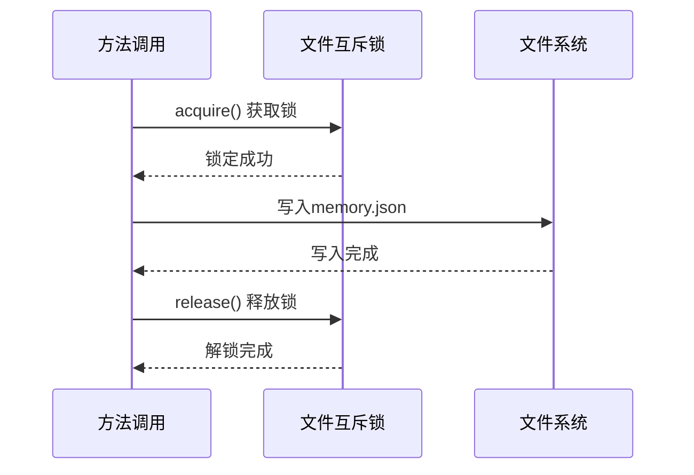

**图表来源**
- [memory.ts](file://src/main/mcpServers/memory.ts#L117-L135)

### 初始化流程

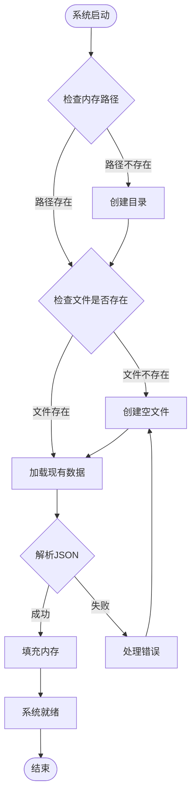

**图表来源**
- [memory.ts](file://src/main/mcpServers/memory.ts#L57-L114)

### 错误恢复机制

系统具备完善的错误恢复能力：

| 场景 | 处理方式 | 结果 |
|------|----------|------|
| 文件不存在 | 自动创建空文件 | 使用默认结构 |
| JSON解析失败 | 清空数据重新初始化 | 从空状态开始 |
| 权限不足 | 抛出MCP错误 | 通知客户端 |
| 磁盘空间不足 | 抛出MCP错误 | 无法继续操作 |

**章节来源**
- [memory.ts](file://src/main/mcpServers/memory.ts#L57-L114)
- [memory.ts](file://src/main/mcpServers/memory.ts#L116-L135)

## 性能监控与追踪

### @TraceMethod装饰器

系统使用`@TraceMethod`装饰器进行性能追踪，提供详细的方法执行监控：

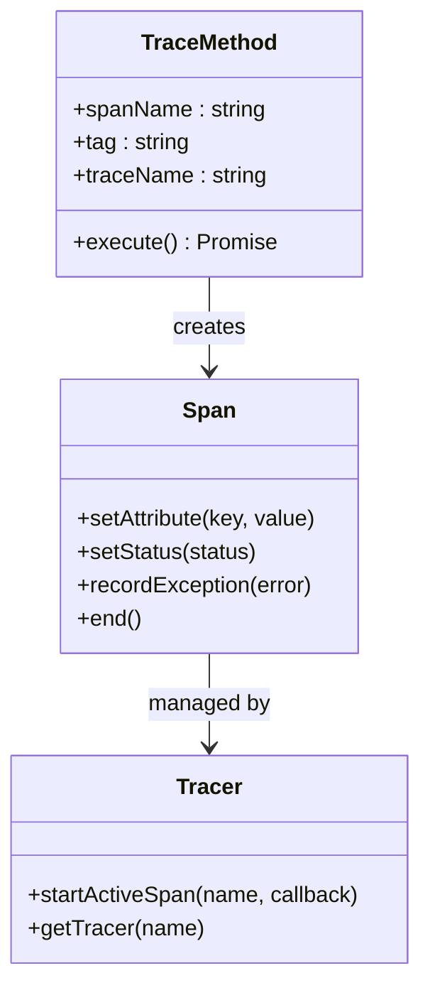

**图表来源**
- [traceMethod.ts](file://packages/mcp-trace/trace-core/core/traceMethod.ts#L14-L49)

### 追踪功能特性

| 功能 | 实现方式 | 数据输出 |
|------|----------|----------|
| 输入参数记录 | `convertToString(args)` | 方法调用参数 |
| 输出结果记录 | `convertToString(result)` | 返回值内容 |
| 执行时间统计 | OpenTelemetry span计时 | 时间戳和持续时间 |
| 错误异常捕获 | try-catch包装 | 异常堆栈和消息 |
| 标签分类 | 自定义tag属性 | 方法类别标识 |

**章节来源**
- [traceMethod.ts](file://packages/mcp-trace/trace-core/core/traceMethod.ts#L14-L49)
- [memory.ts](file://src/main/mcpServers/memory.ts#L49-L336)

## 错误处理策略

### 分层错误处理

系统采用分层的错误处理策略：

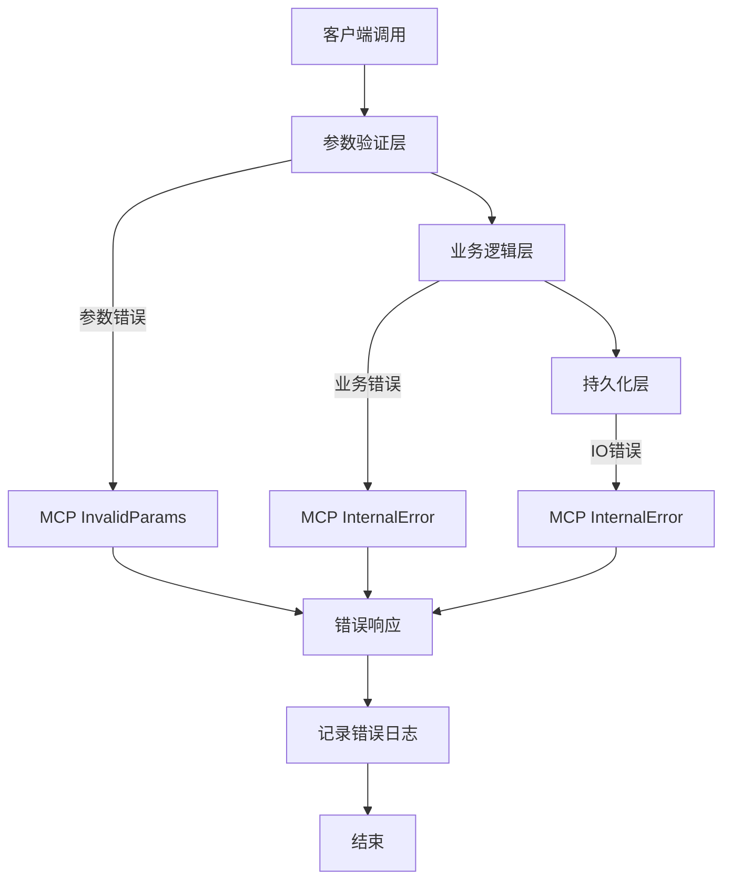

**图表来源**
- [memory.ts](file://src/main/mcpServers/memory.ts#L596-L710)

### 错误类型定义

| 错误类型 | 状态码 | 触发条件 | 处理方式 |
|----------|--------|----------|----------|
| InvalidParams | 400 | 参数格式错误 | 返回具体错误信息 |
| InternalError | 500 | 系统内部错误 | 记录日志并返回通用错误 |
| MethodNotFound | 404 | 工具名称不存在 | 返回未知工具错误 |

**章节来源**
- [memory.ts](file://src/main/mcpServers/memory.ts#L596-L710)

## 使用示例

### 基本操作流程

以下是典型的使用场景：

1. **初始化系统**
   ```typescript
   // 服务器自动初始化，无需手动调用
   ```

2. **创建实体**
   ```typescript
   // 示例：创建用户实体
   const entities = [
     {
       name: "张三",
       entityType: "person",
       observations: ["喜欢Python编程", "工作于某科技公司"]
     }
   ];
   ```

3. **创建关系**
   ```typescript
   // 示例：创建用户与技能的关系
   const relations = [
     {
       from: "张三",
       to: "Python编程",
       relationType: "has_skill"
     }
   ];
   ```

4. **添加观察**
   ```typescript
   // 示例：添加新的观察
   const observations = [
     {
       entityName: "张三",
       contents: ["最近完成了机器学习项目"]
     }
   ];
   ```

5. **查询知识**
   ```typescript
   // 示例：搜索包含"Python"的信息
   const results = await manager.searchNodes("Python");
   ```

### 高级功能

系统还支持复杂的查询和批量操作：

- **批量实体创建**：一次创建多个实体
- **批量关系创建**：建立多个实体间的关系
- **精确查询**：基于实体名称的精确检索
- **模糊搜索**：跨字段的全文本搜索

**章节来源**
- [memory.ts](file://src/main/mcpServers/memory.ts#L405-L698)

## 总结

记忆MCP服务器是一个功能完整、设计精良的知识图谱管理系统。它通过以下关键特性实现了高效的长期记忆存储：

### 核心优势

1. **高性能设计**：使用Map和Set数据结构优化内存访问
2. **数据一致性**：通过文件互斥锁确保并发安全
3. **可扩展性**：模块化设计支持功能扩展
4. **可观测性**：完整的性能追踪和错误监控
5. **标准化**：完全符合MCP协议规范

### 技术亮点

- **智能持久化**：自动检测和恢复损坏的存储文件
- **批量操作**：支持大规模数据的高效处理
- **错误恢复**：完善的异常处理和数据恢复机制
- **性能监控**：细粒度的方法级性能追踪

### 应用价值

该系统为AI助手提供了强大的记忆能力，能够：
- 存储用户的个人信息和偏好
- 建立实体间的关联关系
- 支持复杂的查询和推理
- 提供个性化的交互体验

通过这些特性，记忆MCP服务器为构建智能、有记忆的AI系统奠定了坚实的基础。