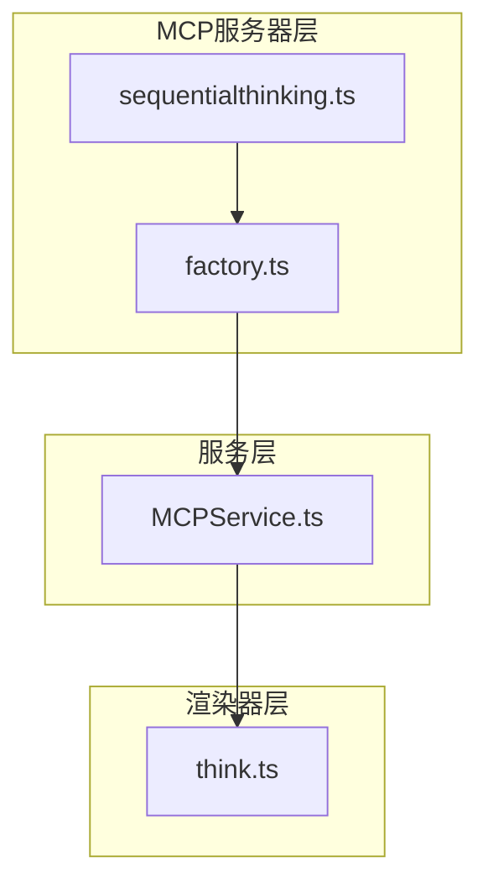
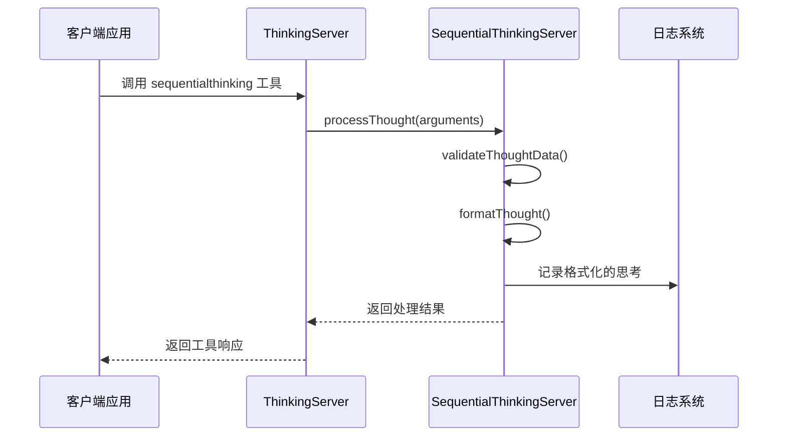
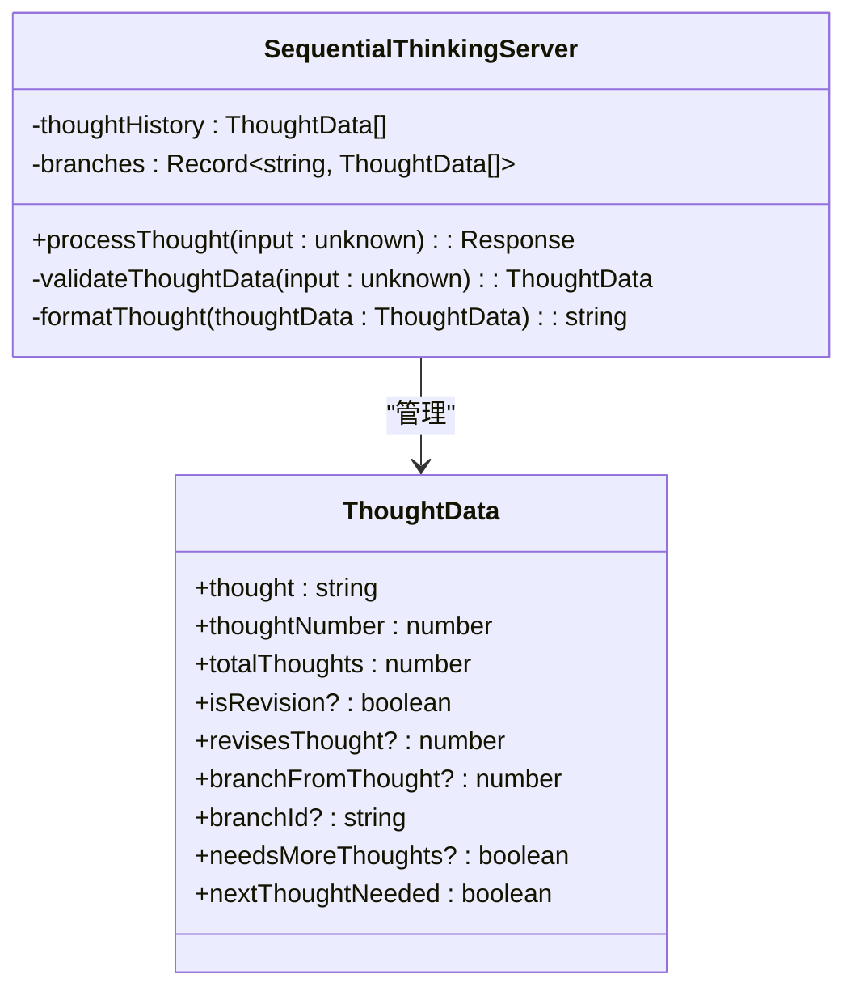
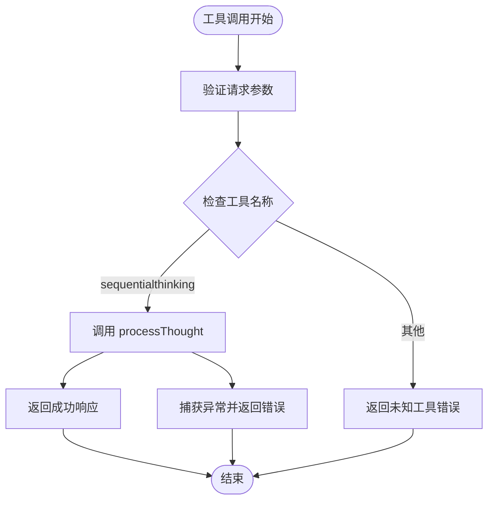
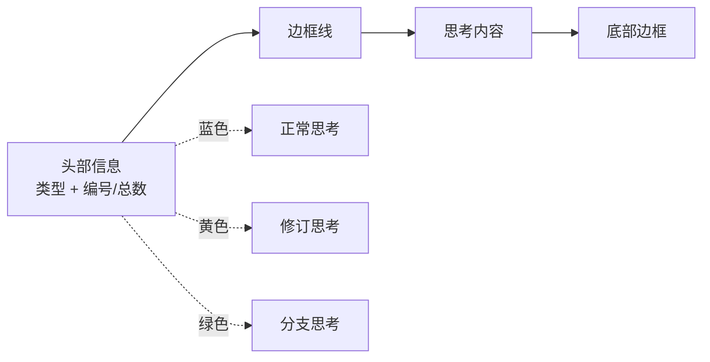
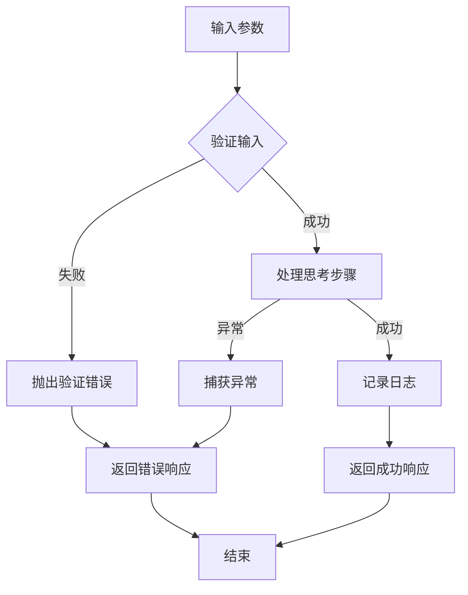

# 顺序思考MCP服务器详细功能文档

<cite>
**本文档中引用的文件**
- [sequentialthinking.ts](file://src/main/mcpServers/sequentialthinking.ts)
- [factory.ts](file://src/main/mcpServers/factory.ts)
- [MCPService.ts](file://src/main/services/MCPService.ts)
- [think.ts](file://src/renderer/src/tools/think.ts)
</cite>

## 目录
1. [简介](#简介)
2. [项目结构](#项目结构)
3. [核心组件](#核心组件)
4. [架构概览](#架构概览)
5. [详细组件分析](#详细组件分析)
6. [参数详解](#参数详解)
7. [使用场景](#使用场景)
8. [视觉化输出](#视觉化输出)
9. [错误处理与调试](#错误处理与调试)
10. [总结](#总结)

## 简介

顺序思考MCP服务器是一个强大的工具，专门设计用于支持复杂的、反思性的链式思维（Chain of Thought）过程。该服务器通过`sequentialthinking`工具提供了一个灵活的问题解决框架，允许用户在分析过程中进行动态调整、修订先前想法和创建分支思考路径。

该工具的核心理念是模拟人类的思考过程，其中包含：
- 动态调整思考步骤的能力
- 对先前想法的修订和质疑
- 创建分支思考路径以探索不同解决方案
- 维护完整的思考历史记录
- 支持不确定性和探索性思考

## 项目结构

顺序思考MCP服务器在Cherry Studio项目中的组织结构如下：



**图表来源**
- [sequentialthinking.ts](file://src/main/mcpServers/sequentialthinking.ts#L1-L295)
- [factory.ts](file://src/main/mcpServers/factory.ts#L1-L55)

**章节来源**
- [sequentialthinking.ts](file://src/main/mcpServers/sequentialthinking.ts#L1-L295)
- [factory.ts](file://src/main/mcpServers/factory.ts#L1-L55)

## 核心组件

顺序思考MCP服务器由以下核心组件构成：

### SequentialThinkingServer 类
这是服务器的主要实现类，负责处理所有的思考逻辑和状态管理。

### ThinkingServer 类  
封装了SequentialThinkingServer，作为MCP协议的入口点。

### ThoughtData 接口
定义了单个思考步骤的数据结构和验证规则。

**章节来源**
- [sequentialthinking.ts](file://src/main/mcpServers/sequentialthinking.ts#L13-L23)
- [sequentialthinking.ts](file://src/main/mcpServers/sequentialthinking.ts#L25-L145)

## 架构概览

顺序思考MCP服务器采用分层架构设计，确保了良好的模块化和可扩展性：



**图表来源**
- [sequentialthinking.ts](file://src/main/mcpServers/sequentialthinking.ts#L276-L291)
- [sequentialthinking.ts](file://src/main/mcpServers/sequentialthinking.ts#L87-L144)

## 详细组件分析

### SequentialThinkingServer 类分析

SequentialThinkingServer 是整个系统的核心，负责维护思考历史和分支状态：



**图表来源**
- [sequentialthinking.ts](file://src/main/mcpServers/sequentialthinking.ts#L13-L23)
- [sequentialthinking.ts](file://src/main/mcpServers/sequentialthinking.ts#L25-L145)

#### 思考历史管理

服务器通过 `thoughtHistory` 数组维护完整的思考历程，每个思考步骤都被完整地保存和跟踪。

#### 分支管理系统

通过 `branches` 字典，服务器能够支持复杂的分支思考模式：
- 每个分支都有唯一的标识符
- 分支可以追溯到特定的思考步骤
- 支持多分支并行思考

**章节来源**
- [sequentialthinking.ts](file://src/main/mcpServers/sequentialthinking.ts#L26-L27)
- [sequentialthinking.ts](file://src/main/mcpServers/sequentialthinking.ts#L97-L101)

### ThinkingServer 类分析

ThinkingServer 作为MCP协议的实现层，提供了标准的工具调用接口：



**图表来源**
- [sequentialthinking.ts](file://src/main/mcpServers/sequentialthinking.ts#L276-L291)

**章节来源**
- [sequentialthinking.ts](file://src/main/mcpServers/sequentialthinking.ts#L251-L294)

## 参数详解

`sequentialthinking` 工具支持丰富的参数配置，这些参数共同构成了一个灵活的思考框架：

### 基础参数

| 参数名 | 类型 | 必需 | 描述 |
|--------|------|------|------|
| `thought` | string | 是 | 当前的思考步骤内容 |
| `thoughtNumber` | integer | 是 | 当前思考步骤编号（从1开始） |
| `totalThoughts` | integer | 是 | 当前估计的总思考步骤数 |
| `nextThoughtNeeded` | boolean | 是 | 是否还需要进一步思考 |

### 修订参数

| 参数名 | 类型 | 必需 | 描述 |
|--------|------|------|------|
| `isRevision` | boolean | 否 | 是否为对先前思考的修订 |
| `revisesThought` | integer | 条件 | 如果是修订，则指定被修订的思考编号 |

### 分支参数

| 参数名 | 类型 | 必需 | 描述 |
|--------|------|------|------|
| `branchFromThought` | integer | 否 | 分支起点的思考编号 |
| `branchId` | string | 否 | 当前分支的唯一标识符 |

### 辅助参数

| 参数名 | 类型 | 必需 | 描述 |
|--------|------|------|------|
| `needsMoreThoughts` | boolean | 否 | 到达终点但意识到需要更多思考 |

### 参数使用示例

#### 基础思考步骤
```typescript
{
  thought: "我们需要分析这个问题的各个方面",
  thoughtNumber: 1,
  totalThoughts: 5,
  nextThoughtNeeded: true
}
```

#### 思考修订
```typescript
{
  thought: "重新考虑之前的假设，可能需要不同的方法",
  thoughtNumber: 3,
  totalThoughts: 5,
  nextThoughtNeeded: true,
  isRevision: true,
  revisesThought: 2
}
```

#### 分支思考
```typescript
{
  thought: "让我们尝试另一种完全不同的解决方案",
  thoughtNumber: 4,
  totalThoughts: 6,
  nextThoughtNeeded: true,
  branchFromThought: 2,
  branchId: "alternative-solution-1"
}
```

**章节来源**
- [sequentialthinking.ts](file://src/main/mcpServers/sequentialthinking.ts#L173-L248)

## 使用场景

顺序思考MCP服务器适用于多种复杂问题解决场景：

### 复杂问题分解

当面对复杂问题时，该工具可以帮助将大问题分解为可管理的步骤：
- 识别问题的关键组成部分
- 建立思考的层次结构
- 动态调整思考策略

### 规划与设计

在需要灵活性的规划过程中：
- 允许在设计过程中进行迭代
- 支持方案的对比和选择
- 维护完整的决策历史

### 需要修正的分析

当发现初始分析存在偏差时：
- 自动修正错误的假设
- 重新评估关键决策点
- 保持思考的连贯性

### 初始范围不明确的问题

对于边界模糊的问题：
- 渐进式细化问题定义
- 动态调整思考范围
- 发现隐藏的相关因素

### 多步推理需求

需要多个推理步骤的问题：
- 维护推理链条的完整性
- 检查推理过程的合理性
- 确保最终结论的准确性

### 多步骤任务

需要长期上下文的任务：
- 保持任务进度的可见性
- 支持任务的重新组织
- 管理任务间的依赖关系

### 过滤无关信息

在分析过程中过滤不相关信息：
- 识别和排除干扰因素
- 专注于核心问题
- 提高分析效率

**章节来源**
- [sequentialthinking.ts](file://src/main/mcpServers/sequentialthinking.ts#L153-L160)

## 视觉化输出

顺序思考MCP服务器使用 `chalk` 库生成带有颜色和边框的视觉化输出，帮助用户更直观地理解思考过程：

### 格式化输出类型

#### 正常思考步骤
- **颜色**: 蓝色 (`chalk.blue`)
- **标记**: "💭 Thought"
- **样式**: 标准边框格式

#### 修订思考步骤  
- **颜色**: 黄色 (`chalk.yellow`)
- **标记**: "🔄 Revision"
- **上下文**: 显示修订的思考编号

#### 分支思考步骤
- **颜色**: 绿色 (`chalk.green`)
- **标记**: "🌿 Branch"
- **上下文**: 显示分支来源和标识符

### 输出格式结构



**图表来源**
- [sequentialthinking.ts](file://src/main/mcpServers/sequentialthinking.ts#L58-L85)

### 示例输出格式

#### 正常思考
```
┌─────────────────────────────┐
│ 💭 Thought 1/5               │
├─────────────────────────────┤
│ 我们需要分析这个问题的各个方面 │
└─────────────────────────────┘
```

#### 修订思考
```
┌─────────────────────────────────────────────┐
│ 🔄 Revision 3/5 (revising thought 2)         │
├─────────────────────────────────────────────┤
│ 重新考虑之前的假设，可能需要不同的方法     │
└─────────────────────────────────────────────┘
```

#### 分支思考
```
┌─────────────────────────────────────────────┐
│ 🌿 Branch 4/6 (from thought 2, ID: alt-1)    │
├─────────────────────────────────────────────┤
│ 让我们尝试另一种完全不同的解决方案         │
└─────────────────────────────────────────────┘
```

**章节来源**
- [sequentialthinking.ts](file://src/main/mcpServers/sequentialthinking.ts#L58-L85)

## 错误处理与调试

顺序思考MCP服务器实现了完善的错误处理机制：

### 输入验证

服务器对所有输入参数进行严格验证：
- 检查必需字段的存在性
- 验证数据类型的正确性
- 确保数值参数的有效范围

### 异常处理流程



**图表来源**
- [sequentialthinking.ts](file://src/main/mcpServers/sequentialthinking.ts#L29-L56)
- [sequentialthinking.ts](file://src/main/mcpServers/sequentialthinking.ts#L126-L143)

### 调试支持

- 使用 `loggerService` 记录详细的执行日志
- 在控制台输出格式化的思考内容
- 提供结构化的错误信息
- 支持思考历史的查询和分析

**章节来源**
- [sequentialthinking.ts](file://src/main/mcpServers/sequentialthinking.ts#L29-L56)
- [sequentialthinking.ts](file://src/main/mcpServers/sequentialthinking.ts#L126-L143)

## 总结

顺序思考MCP服务器是一个功能强大且设计精良的工具，它成功地模拟了人类的反思性思考过程。通过其独特的参数设计和状态管理机制，该工具能够：

### 主要优势

1. **灵活性**: 支持动态调整思考步骤和修订先前想法
2. **可视化**: 使用颜色和格式化的输出提高可读性
3. **完整性**: 维护完整的思考历史和分支记录
4. **实用性**: 适用于各种复杂问题解决场景

### 技术特点

1. **模块化设计**: 清晰的分层架构便于维护和扩展
2. **强类型支持**: TypeScript类型定义确保代码质量
3. **完善的错误处理**: 全面的输入验证和异常处理
4. **日志集成**: 与系统日志服务无缝集成

### 应用价值

顺序思考MCP服务器为开发者提供了一个强大的工具，用于：
- 复杂问题的系统性分析
- 多步骤推理任务的管理
- 需要迭代优化的解决方案设计
- 团队协作中的思考过程记录

该工具不仅提高了问题解决的效率，还为思考过程的透明化和可追溯性提供了有力支持，是现代软件开发中不可或缺的智能辅助工具。