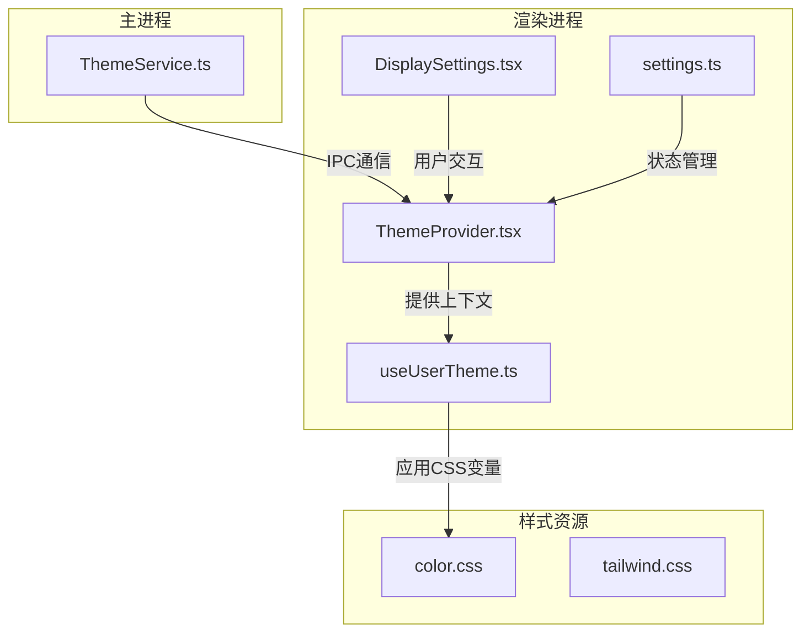
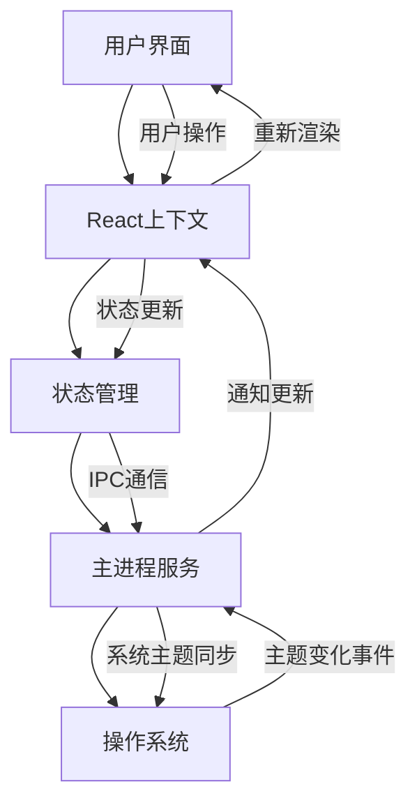
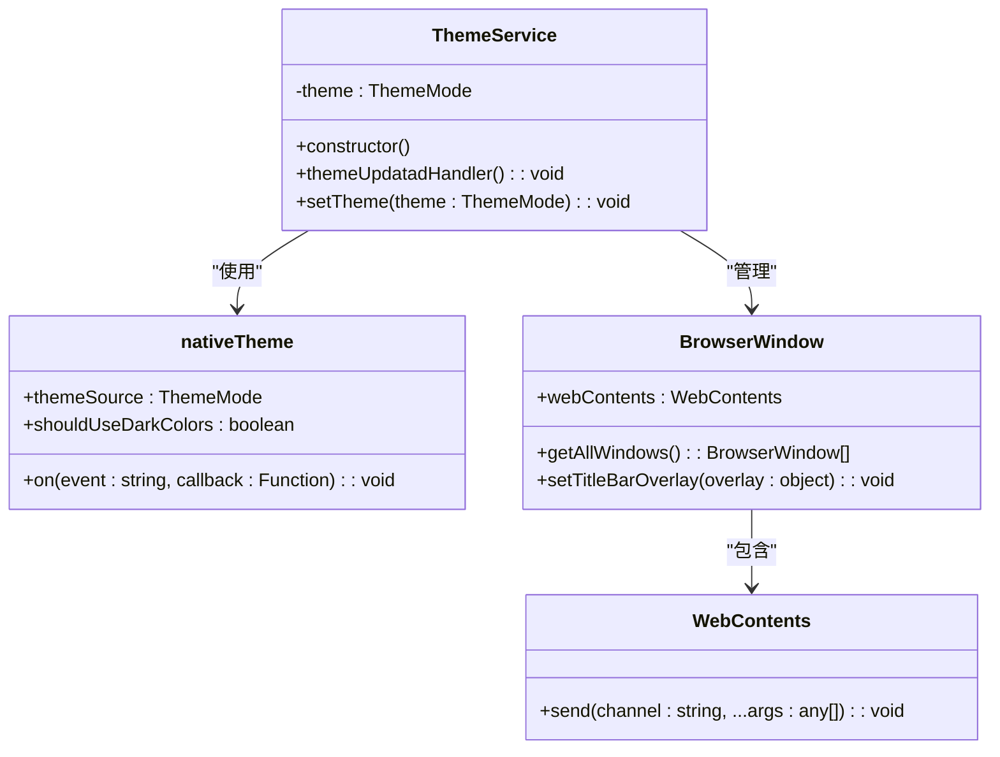
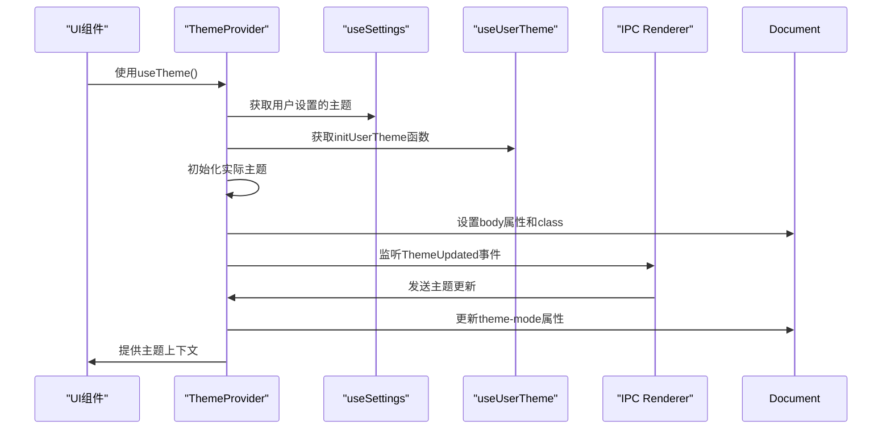
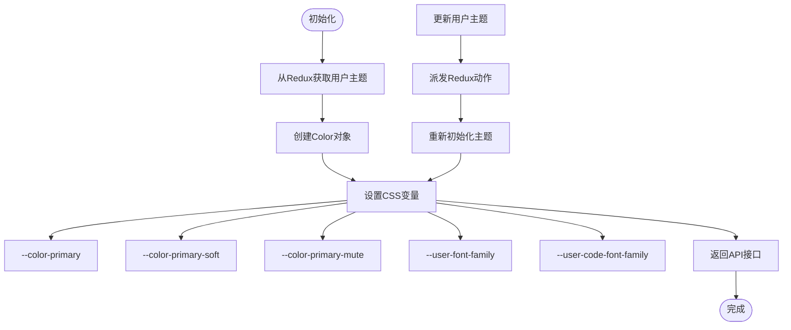
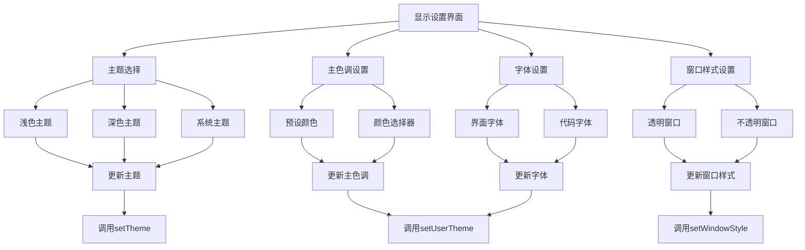
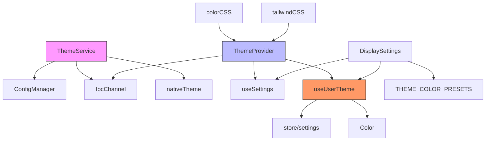

# 主题系统

<cite>
**本文档中引用的文件**  
- [ThemeService.ts](file://src/main/services/ThemeService.ts)
- [ThemeProvider.tsx](file://src/renderer/src/context/ThemeProvider.tsx)
- [useUserTheme.ts](file://src/renderer/src/hooks/useUserTheme.ts)
- [DisplaySettings.tsx](file://src/renderer/src/pages/settings/DisplaySettings/DisplaySettings.tsx)
- [color.css](file://src/renderer/src/assets/styles/color.css)
- [tailwind.css](file://src/renderer/src/assets/styles/tailwind.css)
- [settings.ts](file://src/renderer/src/store/settings.ts)
</cite>

## 目录
1. [简介](#简介)
2. [项目结构](#项目结构)
3. [核心组件](#核心组件)
4. [架构概述](#架构概述)
5. [详细组件分析](#详细组件分析)
6. [依赖分析](#依赖分析)
7. [性能考虑](#性能考虑)
8. [故障排除指南](#故障排除指南)
9. [结论](#结论)

## 简介
Cherry Studio的主题系统是一个完整的UI外观管理解决方案，支持深色、浅色和系统主题模式，以及自定义主色调和字体设置。该系统采用现代化的CSS变量和React上下文机制，实现了主题的动态切换和持久化存储。主题系统不仅管理整体界面外观，还集成了代码编辑器的语法高亮主题，为用户提供一致的视觉体验。

## 项目结构
Cherry Studio的主题系统分布在多个模块中，主要包含主进程服务、渲染进程上下文提供者、自定义Hook和用户界面组件。系统通过Electron的IPC机制在主进程和渲染进程之间同步主题状态，并使用Redux进行状态管理。

**图示来源**
- [ThemeService.ts](file://src/main/services/ThemeService.ts)
- [ThemeProvider.tsx](file://src/renderer/src/context/ThemeProvider.tsx)
- [useUserTheme.ts](file://src/renderer/src/hooks/useUserTheme.ts)
- [DisplaySettings.tsx](file://src/renderer/src/pages/settings/DisplaySettings/DisplaySettings.tsx)
- [color.css](file://src/renderer/src/assets/styles/color.css)

**本节来源**
- [ThemeService.ts](file://src/main/services/ThemeService.ts)
- [ThemeProvider.tsx](file://src/renderer/src/context/ThemeProvider.tsx)

## 核心组件
主题系统的核心组件包括ThemeService（主进程服务）、ThemeProvider（React上下文提供者）、useUserTheme（自定义Hook）和DisplaySettings（用户界面）。这些组件协同工作，实现主题的配置、管理和应用。系统使用CSS变量进行样式管理，通过Redux存储用户偏好，并利用Electron的原生主题功能与操作系统保持一致。

**本节来源**
- [ThemeService.ts](file://src/main/services/ThemeService.ts)
- [ThemeProvider.tsx](file://src/renderer/src/context/ThemeProvider.tsx)
- [useUserTheme.ts](file://src/renderer/src/hooks/useUserTheme.ts)

## 架构概述
Cherry Studio的主题系统采用分层架构设计，分为主进程服务层、渲染进程逻辑层和UI表现层。主进程的ThemeService负责与操作系统交互并管理全局主题状态，渲染进程的ThemeProvider提供React上下文，useUserTheme处理用户自定义主题的CSS变量应用，而DisplaySettings组件则为用户提供直观的主题配置界面。

**图示来源**
- [ThemeService.ts](file://src/main/services/ThemeService.ts)
- [ThemeProvider.tsx](file://src/renderer/src/context/ThemeProvider.tsx)

## 详细组件分析

### 主题服务分析
主题服务是Cherry Studio主题系统的核心，运行在Electron的主进程中，负责管理应用程序的整体主题状态并与操作系统进行交互。

**图示来源**
- [ThemeService.ts](file://src/main/services/ThemeService.ts)

**本节来源**
- [ThemeService.ts](file://src/main/services/ThemeService.ts)

### 主题提供者分析
ThemeProvider是React上下文提供者，为整个应用程序提供主题相关的状态和方法。它负责初始化主题、监听主题变化并更新DOM属性。

**图示来源**
- [ThemeProvider.tsx](file://src/renderer/src/context/ThemeProvider.tsx)

**本节来源**
- [ThemeProvider.tsx](file://src/renderer/src/context/ThemeProvider.tsx)

### 用户主题Hook分析
useUserTheme是一个自定义React Hook，负责处理用户自定义主题（如主色调和字体）的管理和应用。它通过CSS变量将用户偏好应用到整个应用程序。

**图示来源**
- [useUserTheme.ts](file://src/renderer/src/hooks/useUserTheme.ts)

**本节来源**
- [useUserTheme.ts](file://src/renderer/src/hooks/useUserTheme.ts)

### 显示设置分析
DisplaySettings组件为用户提供了一个直观的界面来配置和管理应用程序的主题和显示选项。

**图示来源**
- [DisplaySettings.tsx](file://src/renderer/src/pages/settings/DisplaySettings/DisplaySettings.tsx)

**本节来源**
- [DisplaySettings.tsx](file://src/renderer/src/pages/settings/DisplaySettings/DisplaySettings.tsx)

## 依赖分析
主题系统依赖于多个核心组件和外部库，形成了一个复杂的依赖网络。系统通过Redux进行状态管理，使用Electron的IPC机制在主进程和渲染进程之间通信，并依赖CSS变量实现样式的动态更新。

**图示来源**
- [ThemeService.ts](file://src/main/services/ThemeService.ts)
- [ThemeProvider.tsx](file://src/renderer/src/context/ThemeProvider.tsx)
- [useUserTheme.ts](file://src/renderer/src/hooks/useUserTheme.ts)
- [DisplaySettings.tsx](file://src/renderer/src/pages/settings/DisplaySettings/DisplaySettings.tsx)

**本节来源**
- [ThemeService.ts](file://src/main/services/ThemeService.ts)
- [ThemeProvider.tsx](file://src/renderer/src/context/ThemeProvider.tsx)
- [useUserTheme.ts](file://src/renderer/src/hooks/useUserTheme.ts)
- [settings.ts](file://src/renderer/src/store/settings.ts)

## 性能考虑
主题系统的性能设计考虑了多个方面。首先，通过使用CSS变量而不是动态样式表，避免了频繁的DOM操作和样式重计算。其次，主题切换采用防抖机制，避免在短时间内频繁触发主题更新。此外，系统在初始化时批量设置所有CSS变量，减少了浏览器的重排和重绘次数。对于代码编辑器主题，系统采用懒加载策略，只在需要时加载相应的主题文件，减少了初始加载时间。

## 故障排除指南
当主题系统出现问题时，可以按照以下步骤进行排查：

1. **主题不切换**：检查主进程的ThemeService是否正确初始化，确认IPC通信是否正常。
2. **自定义颜色不生效**：验证CSS变量是否正确设置，检查useUserTheme中的initUserTheme函数是否被正确调用。
3. **字体设置无效**：确认字体文件是否正确加载，检查CSS中的font-family设置。
4. **窗口样式问题**：在Windows和Linux系统上，透明窗口样式可能不被完全支持，需要检查操作系统的兼容性。
5. **状态持久化失败**：确认ConfigManager是否正确保存和读取主题设置，检查配置文件的读写权限。

**本节来源**
- [ThemeService.ts](file://src/main/services/ThemeService.ts)
- [ThemeProvider.tsx](file://src/renderer/src/context/ThemeProvider.tsx)
- [useUserTheme.ts](file://src/renderer/src/hooks/useUserTheme.ts)

## 结论
Cherry Studio的主题系统是一个功能完整、架构清晰的UI外观管理解决方案。系统通过分层设计实现了关注点分离，主进程负责系统级主题管理，渲染进程负责UI级主题应用。使用CSS变量和React上下文机制，系统实现了高效的动态主题切换。通过与操作系统的深度集成，应用程序能够提供一致的用户体验。未来可以考虑增加更多自定义选项，如主题分享和导入导出功能，进一步提升用户的个性化体验。