# Cherry Studio 扩展功能文档

<cite>
**本文档引用的文件**
- [PluginService.ts](file://src/main/services/agents/plugins/PluginService.ts)
- [MCPService.ts](file://src/main/services/MCPService.ts)
- [factory.ts](file://src/main/mcpServers/factory.ts)
- [memory.ts](file://src/main/mcpServers/memory.ts)
- [filesystem.ts](file://src/main/mcpServers/filesystem.ts)
- [python.ts](file://src/main/mcpServers/python.ts)
- [usePlugins.ts](file://src/renderer/src/hooks/usePlugins.ts)
- [ThemeProvider.tsx](file://src/renderer/src/context/ThemeProvider.tsx)
- [useUserTheme.ts](file://src/renderer/src/hooks/useUserTheme.ts)
- [settings.ts](file://src/renderer/src/store/settings.ts)
- [plugin.ts](file://src/renderer/src/types/plugin.ts)
- [markdownParser.ts](file://src/main/utils/markdownParser.ts)
- [mcp.ts](file://src/renderer/src/types/mcp.ts)
- [mcp.ts](file://src/main/apiServer/routes/mcp.ts)
- [mcp.ts](file://src/main/apiServer/services/mcp.ts)
</cite>

## 目录
1. [简介](#简介)
2. [插件系统架构](#插件系统架构)
3. [MCP（Model Control Protocol）服务](#mcpmodel-control-protocol服务)
4. [主题系统](#主题系统)
5. [扩展功能关系图](#扩展功能关系图)
6. [开发指南](#开发指南)
7. [故障排除](#故障排除)
8. [最佳实践](#最佳实践)

## 简介

Cherry Studio 提供了强大的扩展功能系统，支持三种主要的扩展方式：
- **插件系统**：支持代理（Agent）、命令（Command）和技能（Skill）类型的插件
- **MCP服务**：通过Model Control Protocol扩展AI功能
- **主题系统**：支持自定义主题和视觉样式

这些扩展功能相互协作，为用户提供高度可定制的AI工作流体验。

## 插件系统架构

### 系统概述

Cherry Studio的插件系统采用分层架构设计，支持多种插件类型和灵活的安装机制。

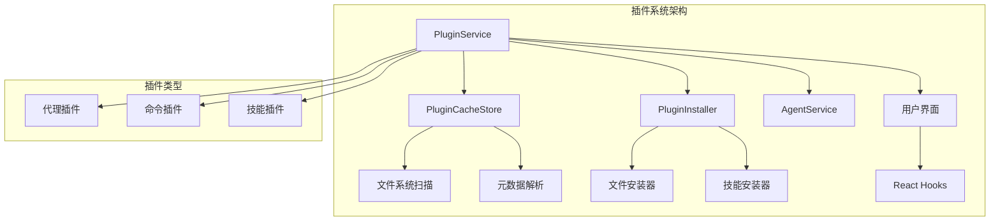

**图表来源**
- [PluginService.ts](file://src/main/services/agents/plugins/PluginService.ts#L38-L615)
- [PluginCacheStore.ts](file://src/main/services/agents/plugins/PluginCacheStore.ts#L34-L223)

### 插件类型与结构

#### 1. 代理插件（Agent Plugins）

代理插件是最复杂的插件类型，包含完整的AI对话逻辑：

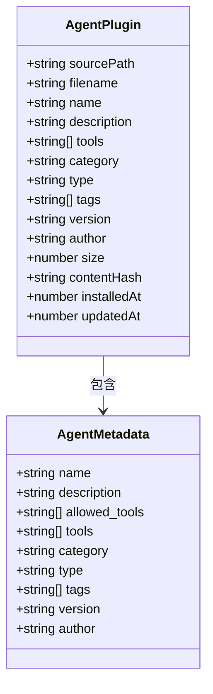

**图表来源**
- [plugin.ts](file://src/renderer/src/types/plugin.ts#L7-L36)

#### 2. 命令插件（Command Plugins）

命令插件专注于特定工具或功能：

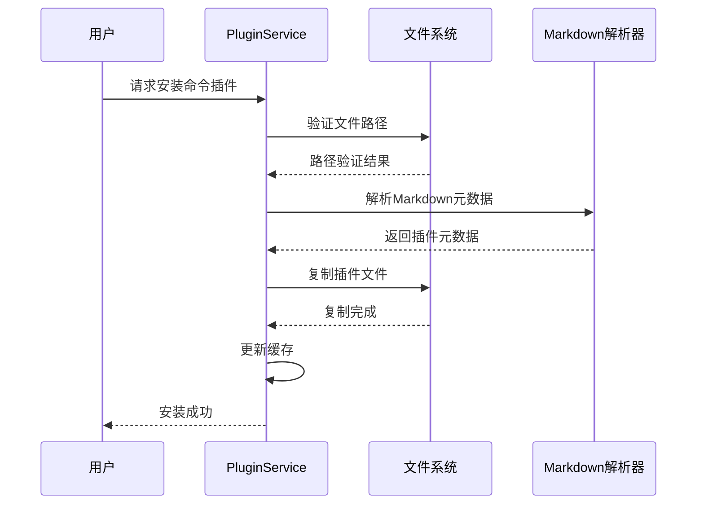

**图表来源**
- [PluginService.ts](file://src/main/services/agents/plugins/PluginService.ts#L128-L135)

#### 3. 技能插件（Skill Plugins）

技能插件提供可重用的功能模块：

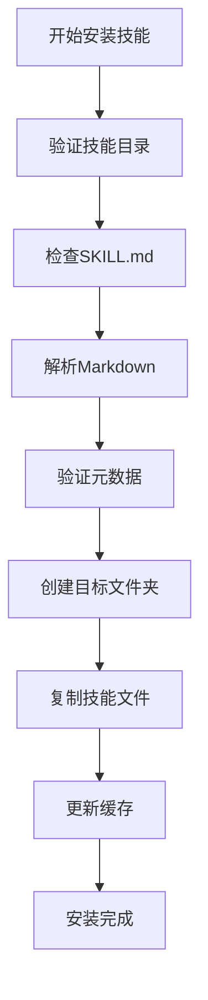

**图表来源**
- [markdownParser.ts](file://src/main/utils/markdownParser.ts#L169-L310)

### 插件安装流程

插件安装过程包含严格的安全验证和事务处理：

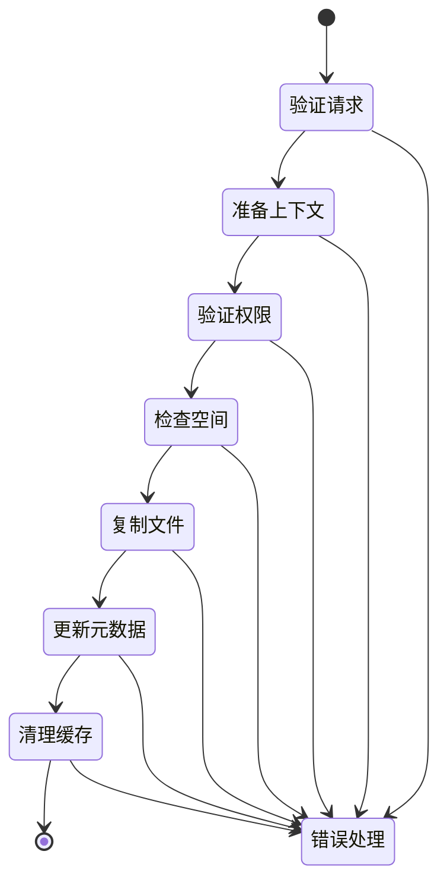

**节来源**
- [PluginService.ts](file://src/main/services/agents/plugins/PluginService.ts#L128-L299)

## MCP（Model Control Protocol）服务

### MCP架构概览

MCP服务提供了标准化的AI功能扩展机制，支持多种传输协议和服务器类型。

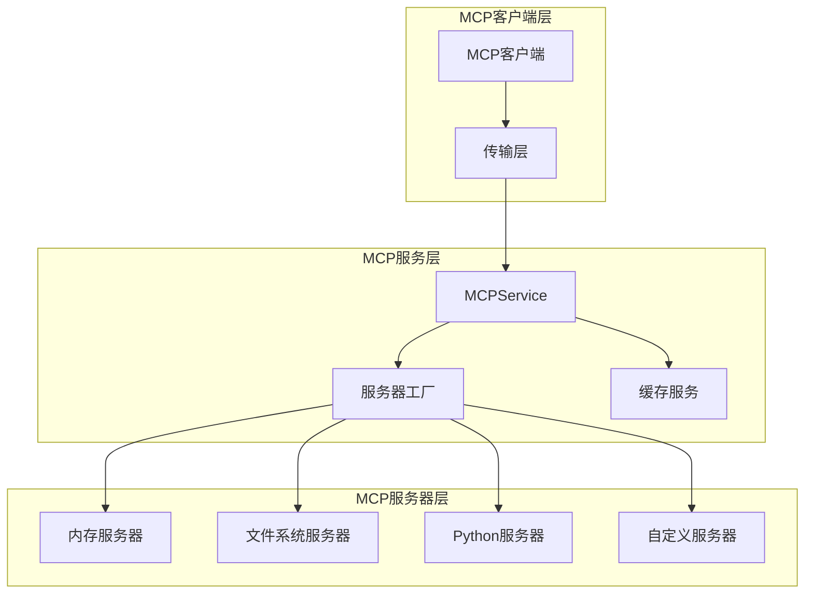

**图表来源**
- [MCPService.ts](file://src/main/services/MCPService.ts#L136-L923)
- [factory.ts](file://src/main/mcpServers/factory.ts#L17-L55)

### 内置MCP服务器

#### 1. 内存服务器（Memory Server）

提供知识图谱管理功能：

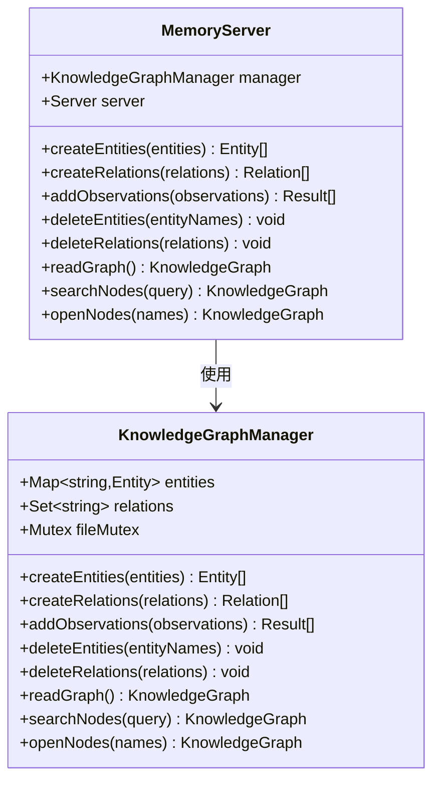

**图表来源**
- [memory.ts](file://src/main/mcpServers/memory.ts#L339-L715)

#### 2. 文件系统服务器（File System Server）

提供安全的文件操作功能：

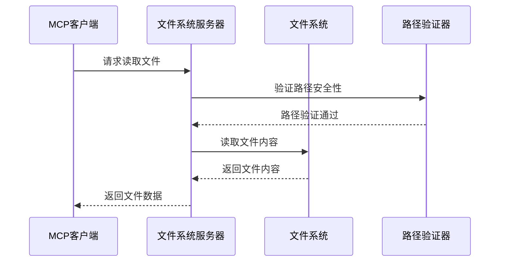

**图表来源**
- [filesystem.ts](file://src/main/mcpServers/filesystem.ts#L283-L653)

#### 3. Python服务器（Python Server）

提供沙盒化的Python代码执行环境：

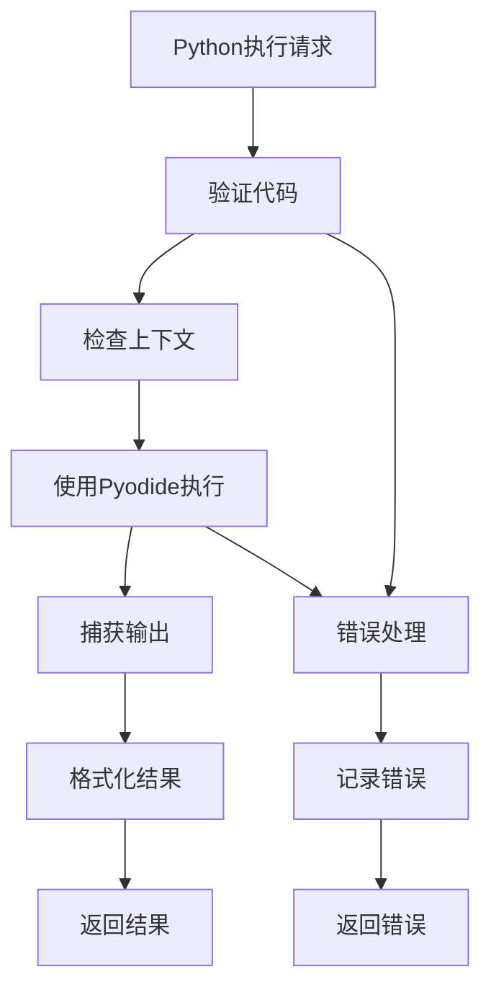

**图表来源**
- [python.ts](file://src/main/mcpServers/python.ts#L1-L116)

### MCP服务器配置

MCP服务器支持多种配置选项：

| 配置项 | 类型 | 描述 | 默认值 |
|--------|------|------|--------|
| `id` | string | 服务器内部ID | 自动生成 |
| `name` | string | 服务器名称 | 必需 |
| `type` | string | 通信类型 | "stdio" |
| `baseUrl` | string | 服务器URL地址 | 可选 |
| `command` | string | 启动命令 | 可选 |
| `args` | string[] | 命令参数 | [] |
| `env` | object | 环境变量 | {} |
| `timeout` | number | 超时时间（秒） | 60 |
| `longRunning` | boolean | 长时间运行任务 | false |

**节来源**
- [mcp.ts](file://src/renderer/src/types/mcp.ts#L33-L73)

### MCP API集成

MCP服务通过REST API提供统一的访问接口：

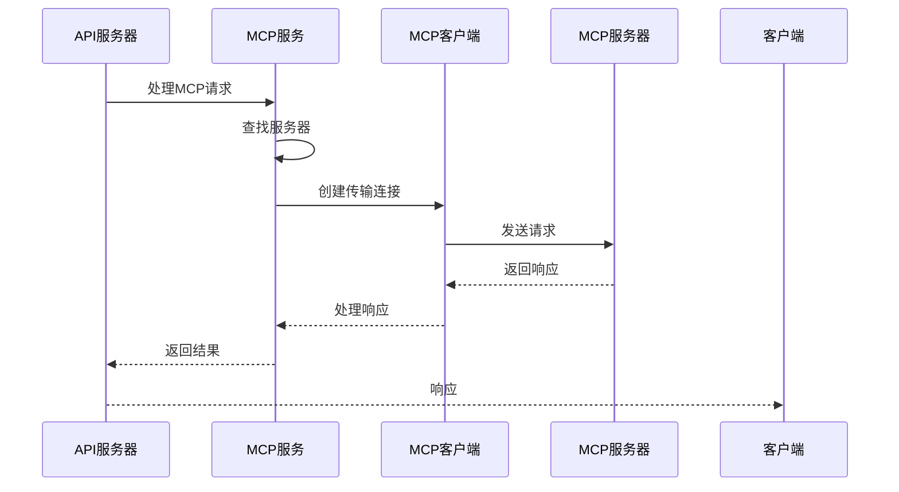

**图表来源**
- [mcp.ts](file://src/main/apiServer/services/mcp.ts#L40-L185)

**节来源**
- [mcp.ts](file://src/main/apiServer/routes/mcp.ts#L1-L156)

## 主题系统

### 主题架构

Cherry Studio的主题系统提供了灵活的视觉定制能力：

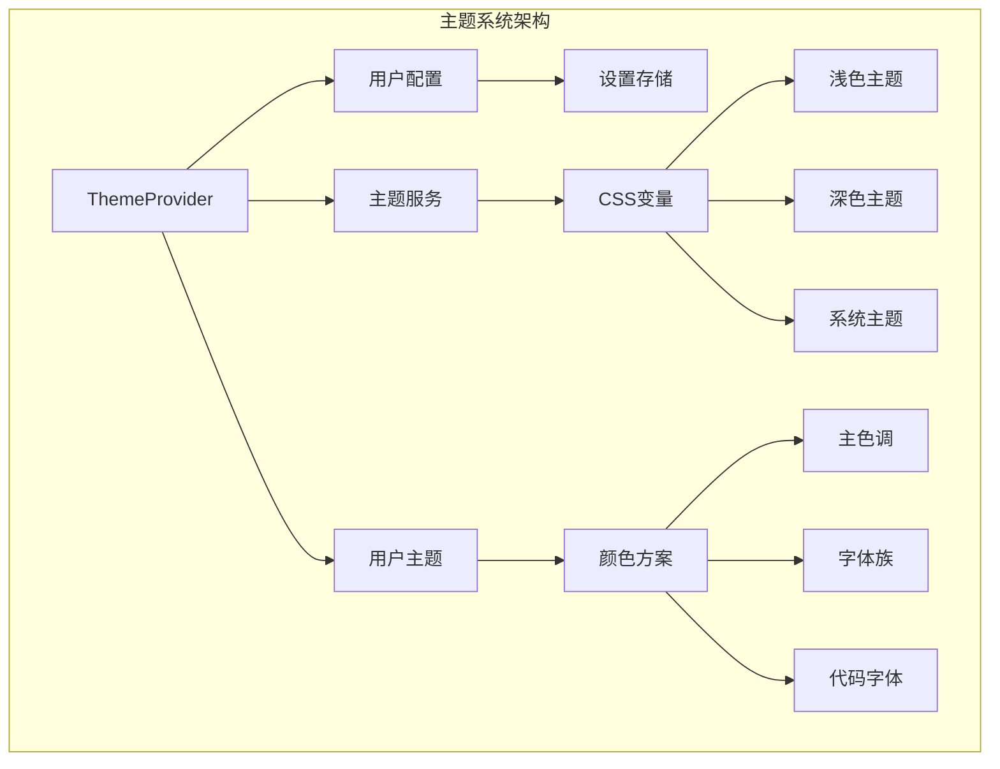

**图表来源**
- [ThemeProvider.tsx](file://src/renderer/src/context/ThemeProvider.tsx#L33-L95)
- [useUserTheme.ts](file://src/renderer/src/hooks/useUserTheme.ts#L6-L35)

### 主题配置

#### 1. 主题模式

支持三种主题模式：

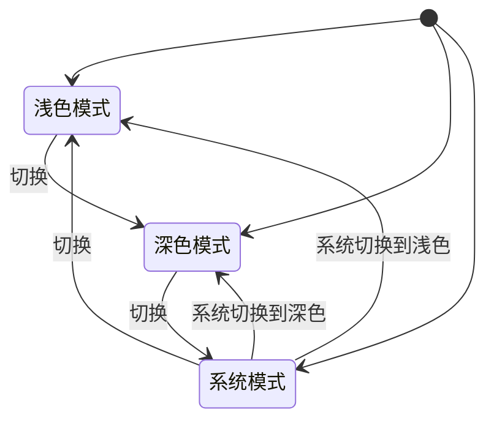

#### 2. 自定义颜色

用户可以自定义主色调和字体：

| 配置项 | 类型 | 描述 | 示例值 |
|--------|------|------|--------|
| `colorPrimary` | string | 主色调（十六进制） | "#00b96b" |
| `userFontFamily` | string | 用户字体族 | "Inter, sans-serif" |
| `userCodeFontFamily` | string | 代码字体族 | "Fira Code, monospace" |

**节来源**
- [settings.ts](file://src/renderer/src/store/settings.ts#L34-L46)

### 主题应用流程

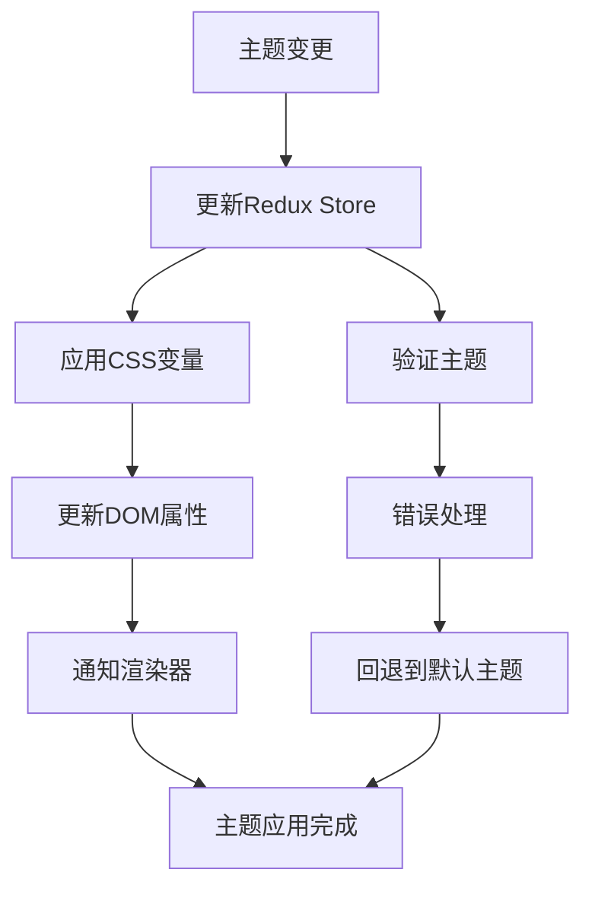

**图表来源**
- [useUserTheme.ts](file://src/renderer/src/hooks/useUserTheme.ts#L11-L35)

**节来源**
- [ThemeProvider.tsx](file://src/renderer/src/context/ThemeProvider.tsx#L33-L95)

## 扩展功能关系图

### 系统集成架构

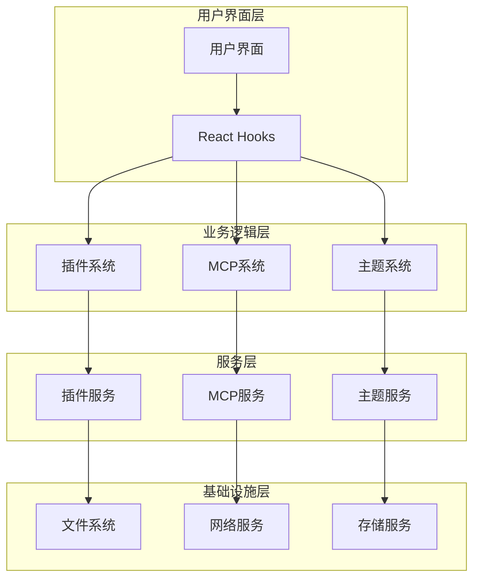

### 扩展功能交互

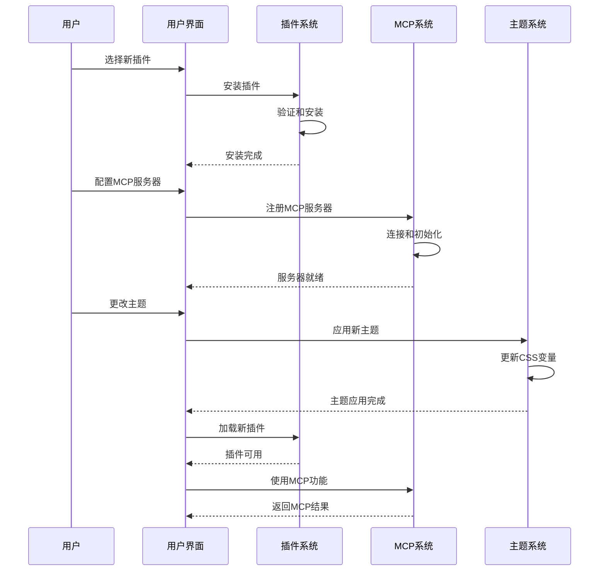

## 开发指南

### 创建自定义插件

#### 1. 代理插件开发

创建一个新的代理插件需要以下步骤：

**步骤1：创建Markdown文件**
```markdown
---
name: 我的AI助手
description: 一个智能的AI助手
author: 开发者姓名
version: 1.0.0
tags: 工具, 助手
tools:
  - 文本分析
  - 代码解释
  - 翻译
---

# 我的AI助手

这里是代理的详细说明...
```

**步骤2：实现AI逻辑**
在插件中实现具体的AI交互逻辑。

#### 2. 命令插件开发

命令插件相对简单，主要用于特定功能调用：

```markdown
---
name: 系统信息
description: 获取系统信息
author: 开发者
version: 1.0.0
allowed-tools:
  - system_info
---

# 系统信息命令

这个插件提供系统信息查询功能。
```

#### 3. 技能插件开发

技能插件需要包含`SKILL.md`文件：

```
skills/
├── my-skill/
│   ├── SKILL.md
│   ├── main.py
│   ├── requirements.txt
│   └── README.md
```

**SKILL.md内容：**
```markdown
---
name: 我的技能
description: 这是一个示例技能
author: 开发者
version: 1.0.0
tools:
  - skill_execution
---

# 我的技能

技能的详细说明...
```

### 创建自定义MCP服务器

#### 1. 实现基本MCP服务器

```typescript
import { Server } from '@modelcontextprotocol/sdk/server/index.js';
import { CallToolRequestSchema, ListToolsRequestSchema } from '@modelcontextprotocol/sdk/types.js';

class CustomMCPServer {
  public server: Server;

  constructor() {
    this.server = new Server(
      {
        name: 'custom-server',
        version: '1.0.0'
      },
      {
        capabilities: {
          tools: {}
        }
      }
    );
    this.setupRequestHandlers();
  }

  private setupRequestHandlers() {
    // 实现工具列表处理器
    this.server.setRequestHandler(ListToolsRequestSchema, async () => {
      return {
        tools: [
          {
            name: 'custom_tool',
            description: '自定义工具描述',
            inputSchema: {
              type: 'object',
              properties: {
                param1: { type: 'string' }
              },
              required: ['param1']
            }
          }
        ]
      };
    });

    // 实现工具调用处理器
    this.server.setRequestHandler(CallToolRequestSchema, async (request) => {
      const { name, arguments: args } = request.params;
      
      if (name === 'custom_tool') {
        // 实现工具逻辑
        return {
          content: [{ type: 'text', text: '工具执行结果' }]
        };
      }
      
      throw new Error(`未知工具: ${name}`);
    });
  }
}
```

#### 2. 注册MCP服务器

在`src/main/mcpServers/factory.ts`中添加新服务器：

```typescript
import CustomServer from './custom-server';

export function createInMemoryMCPServer(
  name: BuiltinMCPServerName,
  args: string[] = [],
  envs: Record<string, string> = {}
): Server {
  switch (name) {
    // ... 其他服务器
    case 'custom-server':
      return new CustomServer().server;
    default:
      throw new Error(`未知MCP服务器: ${name}`);
  }
}
```

### 自定义主题开发

#### 1. 创建自定义主题

```typescript
// 在useUserTheme.ts中添加主题支持
const THEMES = {
  custom: {
    primary: '#ff6b35',
    light: {
      background: '#ffffff',
      text: '#1a1a1a'
    },
    dark: {
      background: '#1a1a1a',
      text: '#ffffff'
    }
  }
};

export default function useUserTheme() {
  // ... 现有代码
  
  const applyCustomTheme = (themeName: string) => {
    const theme = THEMES[themeName];
    if (theme) {
      document.body.style.setProperty('--color-primary', theme.primary);
      // 应用其他CSS变量...
    }
  };
  
  return {
    applyCustomTheme,
    // ... 其他导出
  };
}
```

#### 2. 主题配置持久化

```typescript
// 在settings.ts中添加主题配置
export interface UserTheme {
  colorPrimary: string;
  userFontFamily: string;
  userCodeFontFamily: string;
  customTheme?: string;
}

// 在setUserTheme中处理自定义主题
const setUserTheme = (theme: UserTheme) => {
  // 应用标准主题
  dispatch(setUserTheme(theme));
  
  // 应用自定义主题
  if (theme.customTheme) {
    useUserTheme().applyCustomTheme(theme.customTheme);
  }
};
```

## 故障排除

### 常见问题及解决方案

#### 1. 插件安装失败

**问题症状：**
- 插件无法安装
- 出现权限错误
- 文件大小超限

**解决方案：**
```typescript
// 检查插件安装状态
const checkPluginInstallation = async (options: InstallPluginOptions) => {
  try {
    // 验证工作目录
    const agent = await pluginService.getAgentOrThrow(options.agentId);
    await pluginService.validateWorkdir(agent, agent.accessible_paths?.[0]);
    
    // 检查文件大小
    const stats = await fs.promises.stat(options.sourcePath);
    if (stats.size > pluginService.config.maxFileSize) {
      throw new Error('文件过大');
    }
    
    // 验证文件类型
    const ext = path.extname(options.sourcePath).toLowerCase();
    if (!pluginService.ALLOWED_EXTENSIONS.includes(ext)) {
      throw new Error('不支持的文件类型');
    }
  } catch (error) {
    console.error('插件安装验证失败:', error);
    throw error;
  }
};
```

#### 2. MCP服务器连接问题

**问题症状：**
- 服务器无法启动
- 连接超时
- 传输错误

**解决方案：**
```typescript
// 检查MCP服务器状态
const checkMCPConnectivity = async (server: MCPServer) => {
  try {
    const isConnected = await mcpService.checkMcpConnectivity(server);
    if (!isConnected) {
      // 尝试重启服务器
      await mcpService.restartServer(server);
      return true;
    }
    return true;
  } catch (error) {
    console.error('MCP连接检查失败:', error);
    return false;
  }
};
```

#### 3. 主题应用问题

**问题症状：**
- 主题不生效
- CSS变量未更新
- 字体加载失败

**解决方案：**
```typescript
// 验证主题应用
const validateThemeApplication = (theme: UserTheme) => {
  // 检查CSS变量是否正确设置
  const primaryColor = getComputedStyle(document.body).getPropertyValue('--color-primary');
  if (!primaryColor || primaryColor === 'initial') {
    console.warn('主色调未正确设置');
    return false;
  }
  
  // 检查字体加载
  const fontFace = Array.from(document.styleSheets)
    .flatMap(sheet => {
      try {
        return Array.from(sheet.cssRules);
      } catch {
        return [];
      }
    })
    .filter(rule => rule.type === CSSRule.FONT_FACE_RULE)
    .find(rule => rule.cssText.includes(theme.userFontFamily));
    
  if (!fontFace) {
    console.warn('字体未正确加载');
    return false;
  }
  
  return true;
};
```

### 调试技巧

#### 1. 插件调试

```typescript
// 启用插件调试日志
const enablePluginDebugging = () => {
  logger.setLevel('debug');
  logger.withContext('PluginService').debug('插件系统已启用调试模式');
};

// 监控插件安装过程
const monitorPluginInstallation = (options: InstallPluginOptions) => {
  const startTime = Date.now();
  
  pluginService.install(options)
    .then(result => {
      const duration = Date.now() - startTime;
      logger.info('插件安装完成', { duration, result });
    })
    .catch(error => {
      logger.error('插件安装失败', { error, options });
    });
};
```

#### 2. MCP调试

```typescript
// 监控MCP消息
const setupMCPMessageLogging = () => {
  mcpService.on('message', (message) => {
    logger.debug('MCP消息', {
      direction: message.direction,
      method: message.method,
      params: message.params
    });
  });
};

// 检查MCP服务器状态
const debugMCPStatus = async (serverId: string) => {
  const server = await mcpApiService.getServerById(serverId);
  if (server) {
    logger.info('MCP服务器状态', {
      id: server.id,
      name: server.name,
      type: server.type,
      connected: server.connected
    });
  }
};
```

## 最佳实践

### 插件开发最佳实践

#### 1. 安全考虑

```typescript
// 输入验证
const validatePluginInput = (input: any) => {
  // 防止路径遍历攻击
  if (input.path && input.path.includes('..')) {
    throw new Error('非法路径');
  }
  
  // 限制文件大小
  if (input.content && input.content.length > MAX_CONTENT_SIZE) {
    throw new Error('内容过大');
  }
  
  // 验证文件扩展名
  const allowedExtensions = ['.md', '.json', '.yaml'];
  const ext = path.extname(input.filename).toLowerCase();
  if (!allowedExtensions.includes(ext)) {
    throw new Error('不允许的文件类型');
  }
};
```

#### 2. 错误处理

```typescript
// 统一错误处理
const handlePluginError = (error: any, context: string) => {
  const errorDetails = {
    context,
    timestamp: new Date().toISOString(),
    error: error.message,
    stack: error.stack
  };
  
  logger.error('插件错误', errorDetails);
  
  return {
    success: false,
    error: {
      type: 'PLUGIN_ERROR',
      message: error.message,
      context
    }
  };
};
```

### MCP开发最佳实践

#### 1. 性能优化

```typescript
// 缓存策略
const withCache = <T extends unknown[], R>(
  fn: (...args: T) => Promise<R>,
  getKey: (...args: T) => string,
  ttl: number
) => {
  return async (...args: T): Promise<R> => {
    const key = getKey(...args);
    
    if (cache.has(key)) {
      return cache.get(key);
    }
    
    const result = await fn(...args);
    cache.set(key, result, ttl);
    
    return result;
  };
};

// 工具函数缓存
const listToolsCached = withCache(
  mcpService.listTools.bind(mcpService),
  (server) => `tools-${server.id}`,
  5 * 60 * 1000 // 5分钟
);
```

#### 2. 错误恢复

```typescript
// 重试机制
const withRetry = async <T>(
  fn: () => Promise<T>,
  maxRetries: number = 3,
  delay: number = 1000
): Promise<T> => {
  let lastError: Error;
  
  for (let i = 0; i < maxRetries; i++) {
    try {
      return await fn();
    } catch (error) {
      lastError = error as Error;
      
      if (i < maxRetries - 1) {
        await new Promise(resolve => setTimeout(resolve, delay * Math.pow(2, i)));
      }
    }
  }
  
  throw lastError!;
};
```

### 主题开发最佳实践

#### 1. 响应式设计

```typescript
// 响应式主题适配
const applyResponsiveTheme = (theme: UserTheme) => {
  // 移动设备优化
  if (window.innerWidth < 768) {
    document.body.classList.add('mobile-theme');
    document.body.style.setProperty('--font-size-base', '14px');
  }
  
  // 暗色模式优化
  if (theme.mode === 'dark') {
    document.body.style.setProperty('--bg-color', '#1a1a1a');
    document.body.style.setProperty('--text-color', '#ffffff');
  }
  
  // 高对比度模式
  if (theme.highContrast) {
    document.body.style.setProperty('--contrast-ratio', '1.5');
  }
};
```

#### 2. 动画效果

```typescript
// 平滑主题过渡
const animateThemeTransition = (newTheme: UserTheme) => {
  document.body.style.transition = 'all 0.3s ease';
  
  // 触发重绘
  requestAnimationFrame(() => {
    document.body.style.setProperty('--transition-duration', '0.3s');
  });
  
  // 清理过渡
  setTimeout(() => {
    document.body.style.transition = '';
    document.body.style.removeProperty('--transition-duration');
  }, 300);
};
```

### 性能监控

#### 1. 插件性能指标

```typescript
// 插件性能监控
const monitorPluginPerformance = () => {
  const metrics = {
    installationTime: new Map<string, number>(),
    executionTime: new Map<string, number>(),
    failureRate: new Map<string, number>()
  };
  
  // 监控插件安装时间
  const trackInstallation = (pluginId: string, startTime: number) => {
    const duration = Date.now() - startTime;
    metrics.installationTime.set(pluginId, duration);
  };
  
  // 监控插件执行时间
  const trackExecution = (pluginId: string, startTime: number) => {
    const duration = Date.now() - startTime;
    metrics.executionTime.set(pluginId, duration);
  };
  
  return { metrics, trackInstallation, trackExecution };
};
```

#### 2. MCP性能监控

```typescript
// MCP性能监控
const monitorMCPPerformance = () => {
  const metrics = {
    responseTime: new Map<string, number>(),
    throughput: new Map<string, number>(),
    errorRate: new Map<string, number>()
  };
  
  // 监控响应时间
  const trackResponseTime = (serverId: string, startTime: number) => {
    const duration = Date.now() - startTime;
    metrics.responseTime.set(serverId, duration);
  };
  
  // 监控吞吐量
  const trackThroughput = (serverId: string) => {
    const current = metrics.throughput.get(serverId) || 0;
    metrics.throughput.set(serverId, current + 1);
  };
  
  return { metrics, trackResponseTime, trackThroughput };
};
```

通过遵循这些最佳实践，开发者可以创建高质量、高性能且安全可靠的Cherry Studio扩展功能。