# 插件系统

<cite>
**本文档引用的文件**
- [pluginEngine.ts](file://packages/aiCore/src/core/runtime/pluginEngine.ts)
- [types.ts](file://packages/aiCore/src/core/plugins/types.ts)
- [manager.ts](file://packages/aiCore/src/core/plugins/manager.ts)
- [PluginService.ts](file://src/main/services/agents/plugins/PluginService.ts)
- [PluginCacheStore.ts](file://src/main/services/agents/plugins/PluginCacheStore.ts)
- [PluginInstaller.ts](file://src/main/services/agents/plugins/PluginInstaller.ts)
- [plugin.ts](file://src/renderer/src/types/plugin.ts)
- [markdownParser.ts](file://src/main/utils/markdownParser.ts)
- [usePlugins.ts](file://src/renderer/src/hooks/usePlugins.ts)
</cite>

## 目录
1. [简介](#简介)
2. [插件系统架构](#插件系统架构)
3. [插件生命周期管理](#插件生命周期管理)
4. [插件API接口](#插件api接口)
5. [插件创建与安装](#插件创建与安装)
6. [插件与核心系统交互](#插件与核心系统交互)
7. [安全性与权限控制](#安全性与权限控制)
8. [性能影响与调试方法](#性能影响与调试方法)
9. [开发指南与故障排除](#开发指南与故障排除)

## 简介
Cherry Studio的插件系统是一个灵活且强大的扩展框架，允许开发者通过插件扩展核心功能。该系统支持多种插件类型，包括智能体（agent）、命令（command）和技能（skill），并提供了完整的生命周期管理、依赖管理和权限控制机制。插件系统采用模块化设计，通过钩子机制与核心系统进行交互，实现了松耦合的架构。

**插件系统的主要特点包括：**
- 支持三种插件类型：智能体、命令和技能
- 基于钩子的事件驱动架构
- 完整的安装、卸载和更新生命周期管理
- 严格的权限控制和安全验证
- 高性能的缓存机制
- 与核心系统的无缝集成

## 插件系统架构

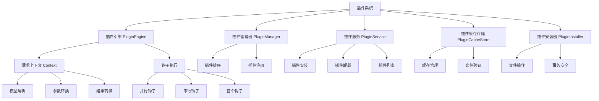

**架构说明：**
- **插件引擎（PluginEngine）**：负责执行带插件的AI操作，处理请求上下文和钩子执行
- **插件管理器（PluginManager）**：管理插件的注册、排序和执行，支持pre、normal和post三种优先级
- **插件服务（PluginService）**：提供插件的安装、卸载和管理功能，集成缓存机制
- **插件缓存存储（PluginCacheStore）**：管理插件的缓存数据，提供文件验证和路径解析功能
- **插件安装器（PluginInstaller）**：负责具体的文件操作，确保安装过程的事务安全性

**架构来源**
- [pluginEngine.ts](file://packages/aiCore/src/core/runtime/pluginEngine.ts#L1-L304)
- [manager.ts](file://packages/aiCore/src/core/plugins/manager.ts#L1-L48)
- [PluginService.ts](file://src/main/services/agents/plugins/PluginService.ts#L1-L547)

## 插件生命周期管理

### 插件生命周期流程

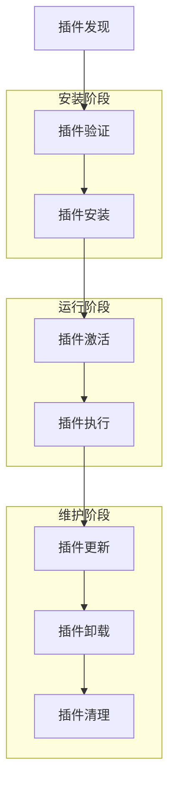

### 插件状态转换

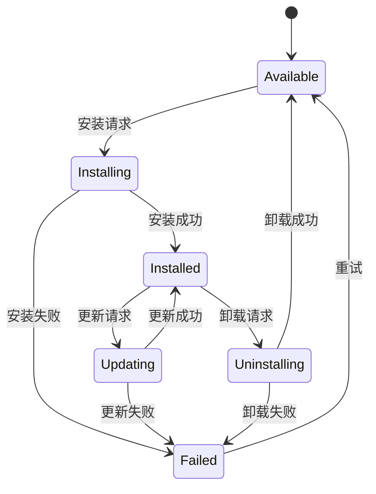

**生命周期管理说明：**
- **发现阶段**：系统扫描插件目录，识别可用的插件
- **验证阶段**：对插件文件进行安全验证，包括路径遍历检查、文件大小限制和元数据验证
- **安装阶段**：将插件文件复制到工作目录，更新缓存和数据库
- **激活阶段**：插件被注册到插件管理器，准备接收事件
- **执行阶段**：插件通过钩子机制与核心系统交互
- **更新阶段**：替换插件文件，重新验证和激活
- **卸载阶段**：从工作目录删除插件文件，清理缓存和数据库记录

**生命周期来源**
- [PluginService.ts](file://src/main/services/agents/plugins/PluginService.ts#L128-L334)
- [PluginInstaller.ts](file://src/main/services/agents/plugins/PluginInstaller.ts#L1-L150)
- [PluginCacheStore.ts](file://src/main/services/agents/plugins/PluginCacheStore.ts#L225-L338)

## 插件API接口

### 插件接口定义

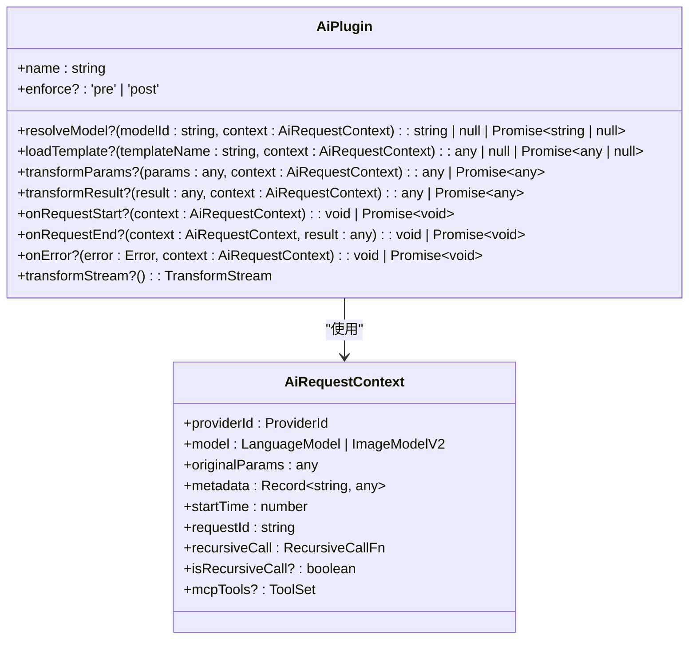

### 钩子类型与执行顺序

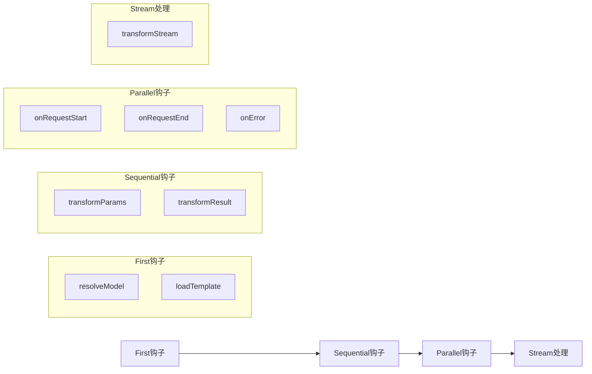

**API接口说明：**
- **First钩子**：只执行第一个返回值的插件，用于模型解析和模板加载
- **Sequential钩子**：链式执行，支持数据转换，用于请求参数和结果的转换
- **Parallel钩子**：不依赖顺序，并行执行，用于副作用操作如日志记录和监控
- **Stream处理**：流式处理，用于实时数据转换

**API接口来源**
- [types.ts](file://packages/aiCore/src/core/plugins/types.ts#L31-L63)
- [pluginEngine.ts](file://packages/aiCore/src/core/runtime/pluginEngine.ts#L72-L302)
- [plugin.ts](file://src/renderer/src/types/plugin.ts#L7-L34)

## 插件创建与安装

### 插件文件结构

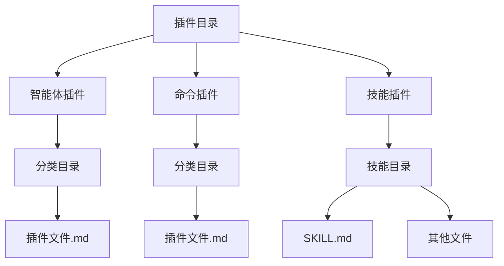

### 插件安装流程

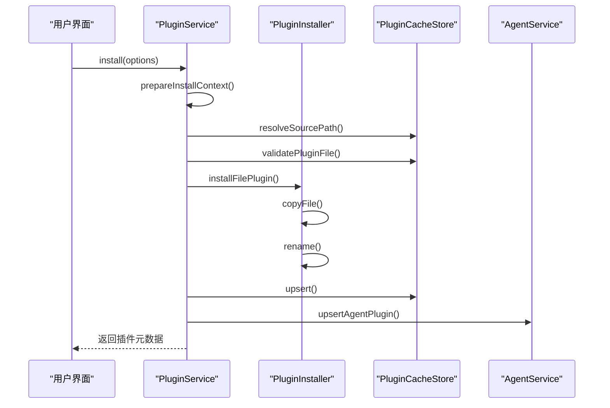

**创建与安装说明：**
- **插件元数据**：通过YAML frontmatter在Markdown文件中定义，包括名称、描述、分类、标签等
- **文件验证**：检查文件大小、扩展名和路径遍历安全
- **事务安全**：使用临时文件和原子重命名确保安装过程的完整性
- **缓存更新**：安装成功后更新缓存和数据库记录

**创建与安装来源**
- [PluginService.ts](file://src/main/services/agents/plugins/PluginService.ts#L128-L259)
- [PluginInstaller.ts](file://src/main/services/agents/plugins/PluginInstaller.ts#L10-L27)
- [PluginCacheStore.ts](file://src/main/services/agents/plugins/PluginCacheStore.ts#L179-L223)
- [markdownParser.ts](file://src/main/utils/markdownParser.ts#L21-L98)

## 插件与核心系统交互

### 交互架构

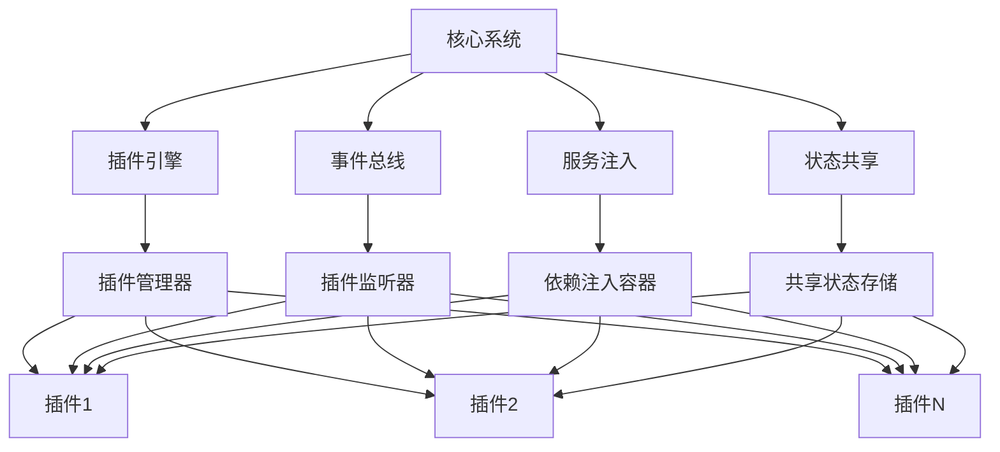

### 请求处理流程

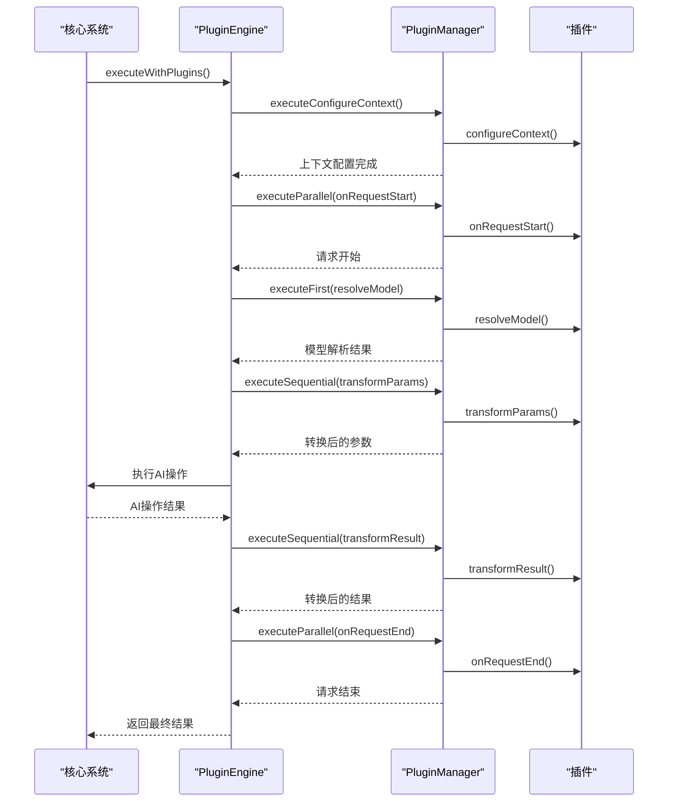

**交互说明：**
- **事件监听**：插件通过钩子函数监听核心系统的事件
- **服务注入**：核心系统通过依赖注入机制向插件提供服务
- **状态共享**：插件与核心系统通过共享状态存储进行数据交换
- **请求上下文**：每个请求都有独立的上下文，包含请求信息和元数据

**交互来源**
- [pluginEngine.ts](file://packages/aiCore/src/core/runtime/pluginEngine.ts#L72-L302)
- [types.ts](file://packages/aiCore/src/core/plugins/types.ts#L15-L26)
- [PluginService.ts](file://src/main/services/agents/plugins/PluginService.ts#L1-L547)

## 安全性与权限控制

### 安全验证流程

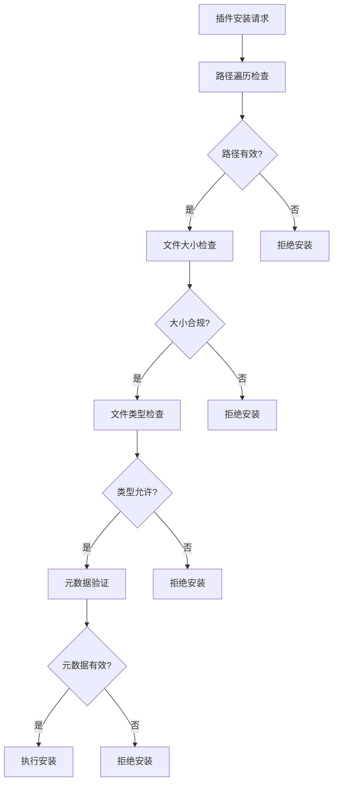

### 权限控制模型

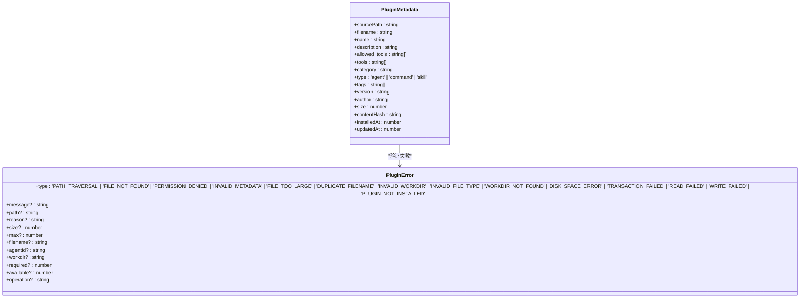

**安全性说明：**
- **路径遍历防护**：严格验证插件路径，防止访问系统敏感文件
- **文件大小限制**：设置最大文件大小，防止资源耗尽攻击
- **文件类型检查**：只允许特定扩展名的文件作为插件
- **元数据验证**：验证YAML frontmatter的完整性和正确性
- **权限分离**：不同类型的插件有不同的权限范围

**安全性来源**
- [PluginCacheStore.ts](file://src/main/services/agents/plugins/PluginCacheStore.ts#L133-L157)
- [PluginInstaller.ts](file://src/main/services/agents/plugins/PluginInstaller.ts#L118-L124)
- [plugin.ts](file://src/renderer/src/types/plugin.ts#L56-L71)
- [markdownParser.ts](file://src/main/utils/markdownParser.ts#L30-L35)

## 性能影响与调试方法

### 性能监控指标

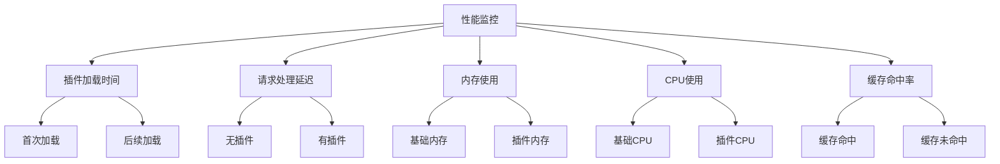

### 调试工具与方法

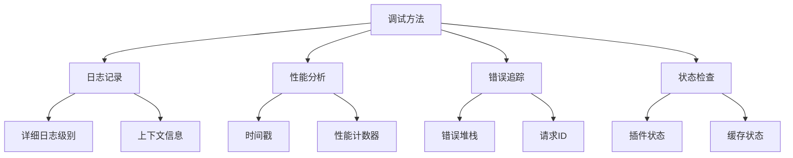

**性能与调试说明：**
- **缓存机制**：使用内存缓存减少文件系统访问，提高性能
- **性能计数器**：跟踪插件执行时间和资源使用情况
- **日志记录**：详细的调试日志帮助定位问题
- **错误追踪**：唯一的请求ID便于追踪问题根源
- **状态检查**：提供API检查插件和缓存的状态

**性能与调试来源**
- [PluginService.ts](file://src/main/services/agents/plugins/PluginService.ts#L87-L123)
- [pluginEngine.ts](file://packages/aiCore/src/core/runtime/pluginEngine.ts#L57-L59)
- [PluginCacheStore.ts](file://src/main/services/agents/plugins/PluginCacheStore.ts#L404-L426)
- [usePlugins.ts](file://src/renderer/src/hooks/usePlugins.ts#L1-L164)

## 开发指南与故障排除

### 开发最佳实践

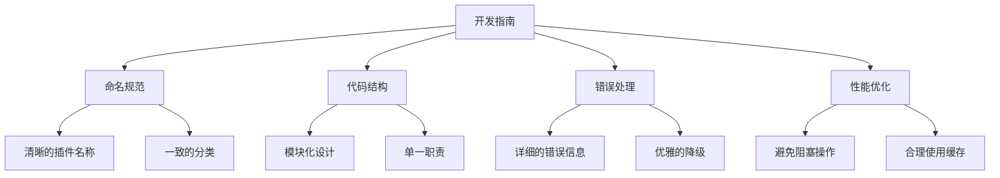

### 常见问题与解决方案

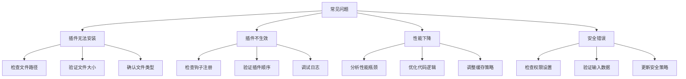

**开发与故障排除说明：**
- **开发建议**：遵循命名规范，保持代码简洁，提供详细的错误信息
- **测试策略**：编写单元测试和集成测试，确保插件的稳定性和可靠性
- **部署流程**：使用版本控制管理插件，支持回滚和更新
- **文档编写**：为插件提供完整的文档，包括使用说明和API参考

**开发与故障排除来源**
- [PluginService.ts](file://src/main/services/agents/plugins/PluginService.ts#L1-L547)
- [pluginEngine.ts](file://packages/aiCore/src/core/runtime/pluginEngine.ts#L1-L304)
- [usePlugins.ts](file://src/renderer/src/hooks/usePlugins.ts#L1-L164)
- [PluginCacheStore.ts](file://src/main/services/agents/plugins/PluginCacheStore.ts#L1-L427)