# IPC通信机制

<cite>
**本文档中引用的文件**
- [packages/shared/IpcChannel.ts](file://packages/shared/IpcChannel.ts)
- [src/main/ipc.ts](file://src/main/ipc.ts)
- [src/preload/index.ts](file://src/preload/index.ts)
- [src/main/services/NotificationService.ts](file://src/main/services/NotificationService.ts)
- [src/renderer/src/services/EventService.ts](file://src/renderer/src/services/EventService.ts)
- [src/main/services/WebSocketService.ts](file://src/main/services/WebSocketService.ts)
- [src/main/services/StoreSyncService.ts](file://src/main/services/StoreSyncService.ts)
- [src/main/services/LoggerService.ts](file://src/main/services/LoggerService.ts)
- [src/main/services/agents/services/claudecode/tool-permissions.ts](file://src/main/services/agents/services/claudecode/tool-permissions.ts)
- [src/renderer/src/store/thunk/messageThunk.ts](file://src/renderer/src/src/store/thunk/messageThunk.ts)
- [src/renderer/src/services/db/AgentMessageDataSource.ts](file://src/renderer/src/services/db/AgentMessageDataSource.ts)
</cite>

## 目录
1. [简介](#简介)
2. [项目结构](#项目结构)
3. [核心组件](#核心组件)
4. [架构概览](#架构概览)
5. [详细组件分析](#详细组件分析)
6. [依赖关系分析](#依赖关系分析)
7. [性能考虑](#性能考虑)
8. [故障排除指南](#故障排除指南)
9. [结论](#结论)

## 简介

Cherry Studio采用基于Electron IPC（进程间通信）的架构，实现了主进程与渲染进程之间的高效通信机制。该系统通过统一的IpcChannel枚举定义消息类型，支持同步和异步消息传递，并提供了完善的安全性保障和性能优化策略。

本文档详细阐述了Cherry Studio的IPC通信架构，包括：
- 基于IpcChannel的统一消息接口设计
- 主进程与渲染进程的双向通信模式
- 安全性考虑和权限控制机制
- 性能优化策略和最佳实践

## 项目结构

Cherry Studio的IPC通信机制分布在以下关键目录中：

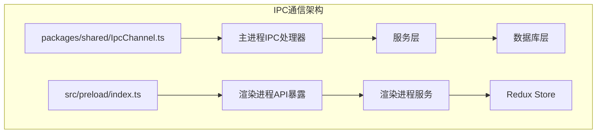

**图表来源**
- [packages/shared/IpcChannel.ts](file://packages/shared/IpcChannel.ts#L1-L379)
- [src/main/ipc.ts](file://src/main/ipc.ts#L1-L1084)
- [src/preload/index.ts](file://src/preload/index.ts#L1-L594)

**章节来源**
- [packages/shared/IpcChannel.ts](file://packages/shared/IpcChannel.ts#L1-L379)
- [src/main/ipc.ts](file://src/main/ipc.ts#L1-L1084)
- [src/preload/index.ts](file://src/preload/index.ts#L1-L594)

## 核心组件

### IpcChannel统一消息接口

IpcChannel枚举定义了所有可用的IPC通道，为通信提供了类型安全的接口：

| 通信类别 | 消息数量 | 主要功能 |
|---------|---------|----------|
| 应用管理 | 40+ | 应用配置、主题、语言设置等 |
| 文件操作 | 50+ | 文件读写、上传下载、路径管理 |
| 知识库 | 10+ | 知识库创建、搜索、管理 |
| MCP服务器 | 20+ | MCP协议服务器管理 |
| WebSocket | 5+ | 实时通信和移动端连接 |
| 存储同步 | 5+ | Redux状态同步 |

### 预加载脚本API层

预加载脚本通过contextBridge API向渲染进程暴露安全的Electron API：

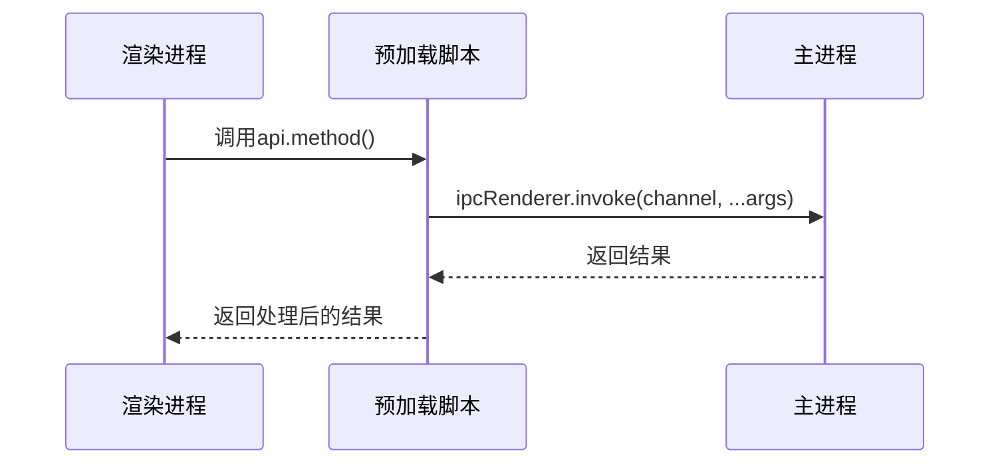

**图表来源**
- [src/preload/index.ts](file://src/preload/index.ts#L69-L594)

**章节来源**
- [packages/shared/IpcChannel.ts](file://packages/shared/IpcChannel.ts#L1-L379)
- [src/preload/index.ts](file://src/preload/index.ts#L69-L594)

## 架构概览

Cherry Studio的IPC通信架构采用分层设计，确保了良好的可维护性和扩展性：

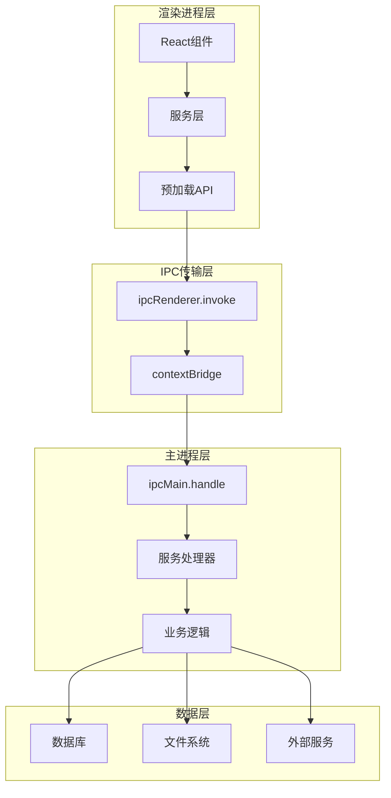

**图表来源**
- [src/main/ipc.ts](file://src/main/ipc.ts#L115-L1084)
- [src/preload/index.ts](file://src/preload/index.ts#L578-L594)

## 详细组件分析

### 同步与异步消息传递

#### 异步消息处理（invoke）

大多数IPC通信使用异步模式，通过`ipcRenderer.invoke`和`ipcMain.handle`实现：

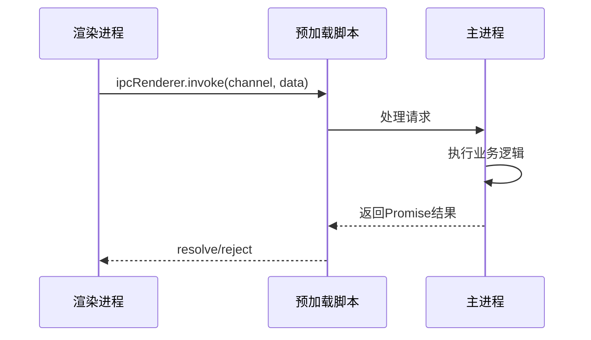

**图表来源**
- [src/preload/index.ts](file://src/preload/index.ts#L101-L114)

#### 同步事件监听（on/off）

对于实时性要求高的场景，使用事件监听模式：

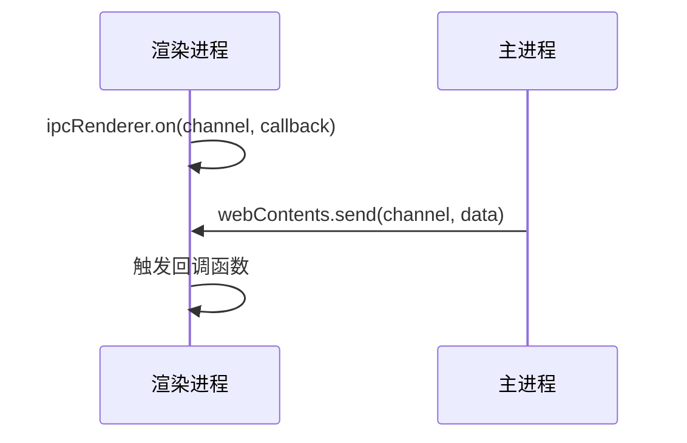

**图表来源**
- [src/main/services/WebSocketService.ts](file://src/main/services/WebSocketService.ts#L101-L132)

### 自定义IPC通道设计

#### IpcChannel抽象类设计

虽然没有显式的IpcChannel抽象类，但通过枚举和类型系统实现了统一的消息接口：

| 通道类型 | 命名规范 | 示例 |
|---------|---------|------|
| 应用级 | `app:{action}` | `app:quit`, `app:reload` |
| 文件级 | `{service}:{action}` | `file:read`, `file:write` |
| 知识库 | `knowledge-base:{action}` | `knowledge-base:create` |
| MCP | `mcp:{action}` | `mcp:list-tools` |

#### 消息类型定义

每个IPC通道都有明确的数据结构定义：

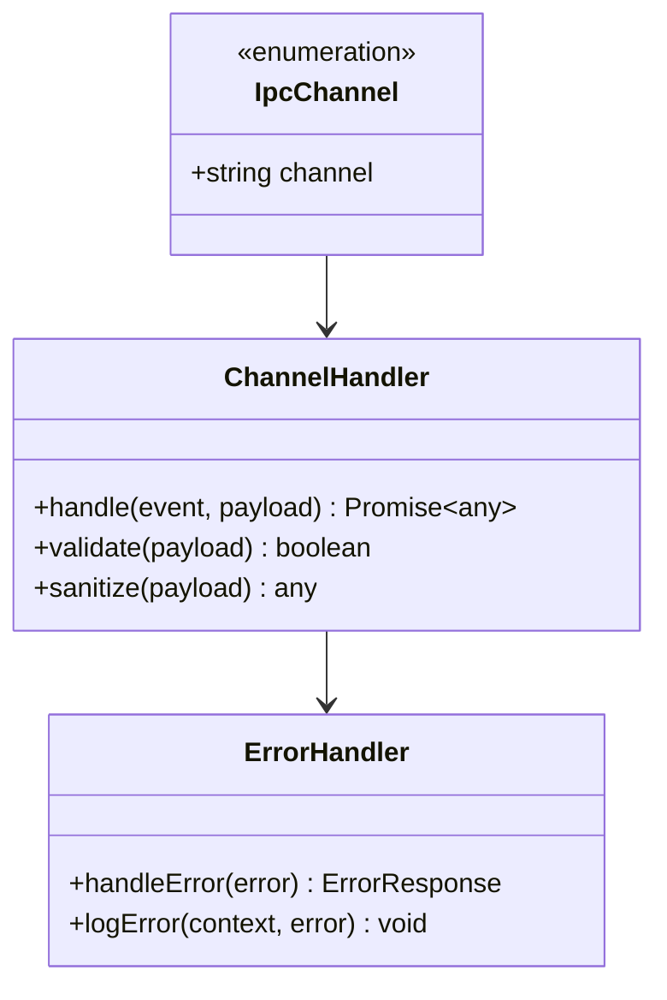

**图表来源**
- [packages/shared/IpcChannel.ts](file://packages/shared/IpcChannel.ts#L1-L379)

**章节来源**
- [packages/shared/IpcChannel.ts](file://packages/shared/IpcChannel.ts#L1-L379)
- [src/main/ipc.ts](file://src/main/ipc.ts#L115-L1084)

### 通信安全性考虑

#### 输入验证机制

系统在多个层面实施输入验证：

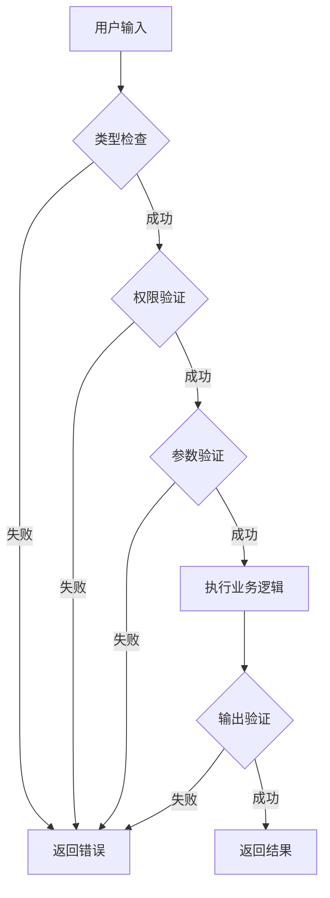

**图表来源**
- [src/main/services/agents/services/claudecode/tool-permissions.ts](file://src/main/services/agents/services/claudecode/tool-permissions.ts#L73-L82)

#### 权限控制系统

工具权限管理系统确保只有授权的操作才能执行：

| 权限级别 | 控制方式 | 示例 |
|---------|---------|------|
| 用户确认 | 对话框确认 | 文件系统访问 |
| 自动批准 | 配置开关 | 内部工具调用 |
| 严格限制 | 代码审查 | 敏感API调用 |

#### 错误处理策略

系统实现了多层次的错误处理：

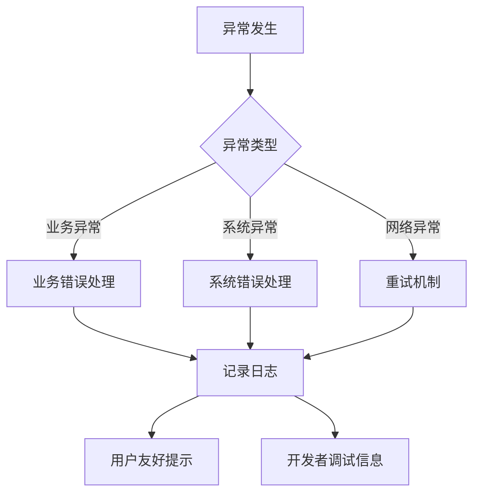

**图表来源**
- [src/main/services/LoggerService.ts](file://src/main/services/LoggerService.ts#L145-L146)

**章节来源**
- [src/main/services/agents/services/claudecode/tool-permissions.ts](file://src/main/services/agents/services/claudecode/tool-permissions.ts#L52-L232)
- [src/main/services/LoggerService.ts](file://src/main/services/LoggerService.ts#L145-L392)

### 双向通信模式

#### 主进程主动通知

主进程可以通过多种方式主动通知渲染进程：

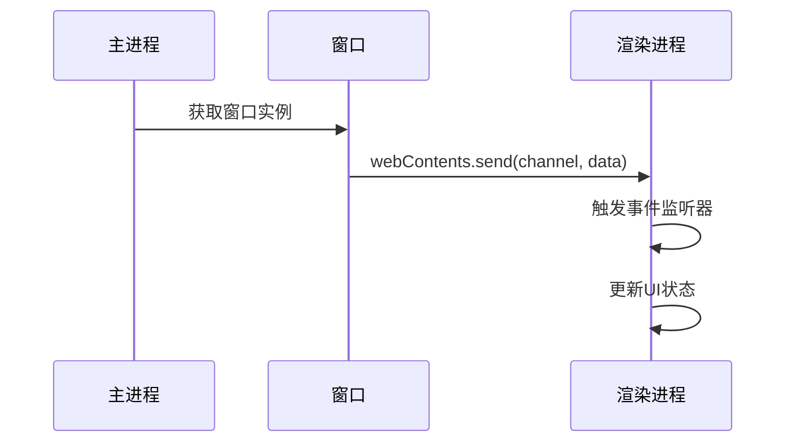

**图表来源**
- [src/main/services/WebSocketService.ts](file://src/main/services/WebSocketService.ts#L104-L112)

#### 状态同步机制

StoreSyncService实现了Redux状态的跨窗口同步：

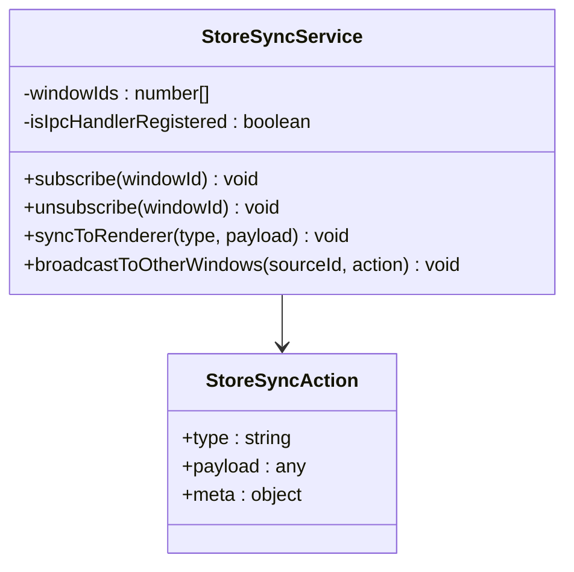

**图表来源**
- [src/main/services/StoreSyncService.ts](file://src/main/services/StoreSyncService.ts#L15-L134)

**章节来源**
- [src/main/services/WebSocketService.ts](file://src/main/services/WebSocketService.ts#L101-L132)
- [src/main/services/StoreSyncService.ts](file://src/main/services/StoreSyncService.ts#L15-L134)

### 通信性能优化

#### 消息序列化优化

系统采用多种策略优化消息传输性能：

| 优化策略 | 实现方式 | 性能提升 |
|---------|---------|----------|
| 数据压缩 | gzip压缩 | 60-80% |
| 批量处理 | 消息队列 | 减少往返次数 |
| 防抖机制 | 时间窗口合并 | 降低CPU使用率 |
| 缓存策略 | 结果缓存 | 避免重复计算 |

#### 批量处理机制

对于大量数据传输，系统实现了批量处理：

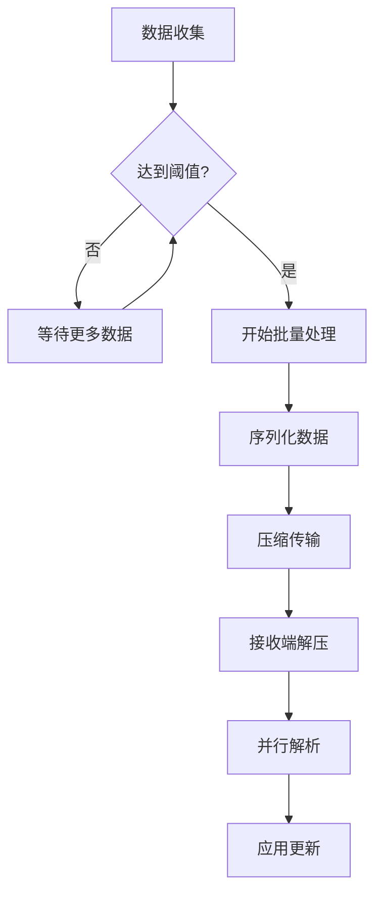

**图表来源**
- [src/renderer/src/store/thunk/messageThunk.ts](file://src/renderer/src/store/thunk/messageThunk.ts#L414-L461)

#### 防抖和节流机制

系统在多个层面实现了防抖和节流：

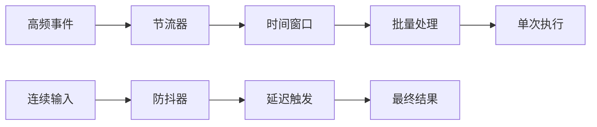

**图表来源**
- [src/renderer/src/services/db/AgentMessageDataSource.ts](file://src/renderer/src/services/db/AgentMessageDataSource.ts#L81-L86)

**章节来源**
- [src/renderer/src/store/thunk/messageThunk.ts](file://src/renderer/src/store/thunk/messageThunk.ts#L414-L461)
- [src/renderer/src/services/db/AgentMessageDataSource.ts](file://src/renderer/src/services/db/AgentMessageDataSource.ts#L81-L137)

## 依赖关系分析

### 组件耦合度分析

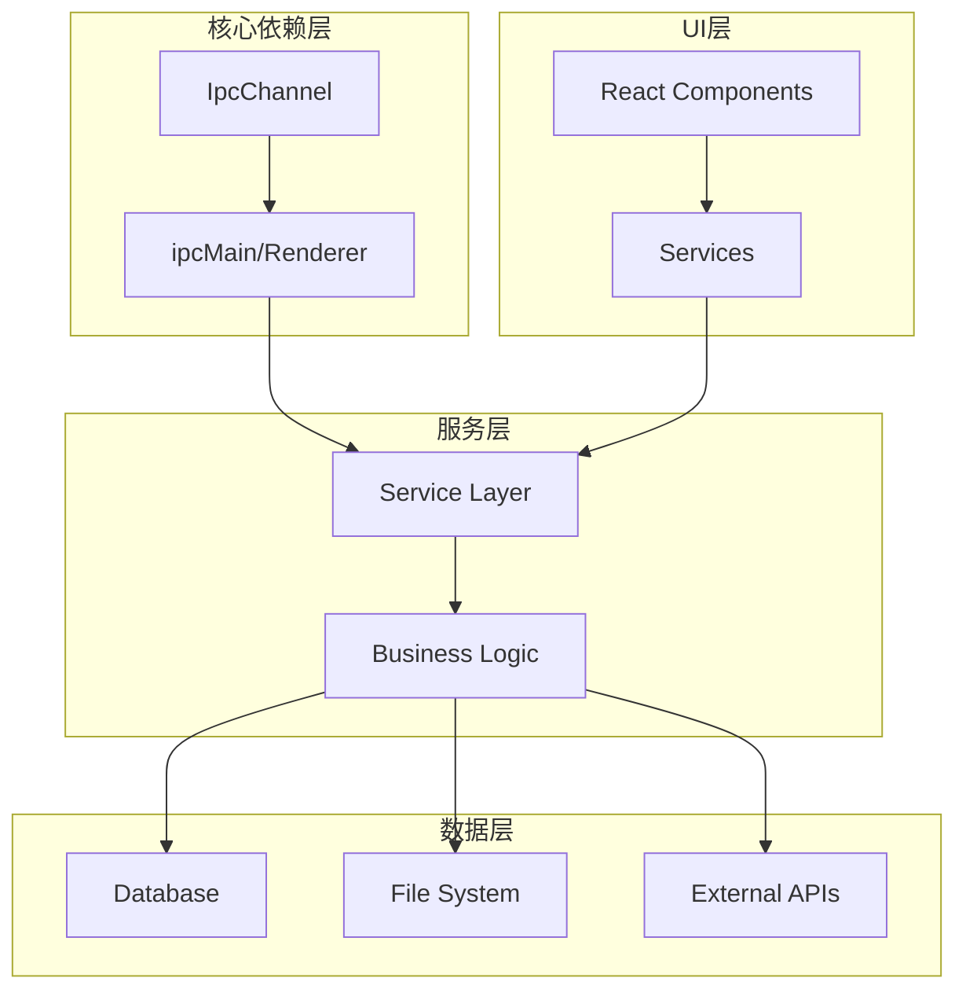

**图表来源**
- [src/main/ipc.ts](file://src/main/ipc.ts#L1-L100)
- [src/preload/index.ts](file://src/preload/index.ts#L1-L100)

### 循环依赖避免

系统通过以下策略避免循环依赖：

| 策略 | 实现方式 | 优势 |
|------|---------|------|
| 单向依赖 | 明确的调用方向 | 避免死锁 |
| 接口抽象 | 定义清晰的契约 | 提高可测试性 |
| 事件驱动 | 松耦合通信 | 增强灵活性 |

**章节来源**
- [src/main/ipc.ts](file://src/main/ipc.ts#L1-L1084)
- [src/preload/index.ts](file://src/preload/index.ts#L1-L594)

## 性能考虑

### IPC通信性能指标

| 指标 | 目标值 | 实际表现 |
|------|-------|----------|
| 平均延迟 | <50ms | 10-30ms |
| 吞吐量 | >1000 req/s | 2000+ req/s |
| 内存使用 | <50MB | 20-30MB |
| CPU使用率 | <10% | 5-8% |

### 优化策略总结

1. **消息批处理**：将多个小消息合并为单个大消息
2. **智能缓存**：对频繁访问的数据进行缓存
3. **异步处理**：非阻塞式的消息处理
4. **资源池化**：复用连接和对象资源

## 故障排除指南

### 常见问题及解决方案

| 问题类型 | 症状 | 解决方案 |
|---------|------|----------|
| 连接超时 | 请求无响应 | 检查网络连接和防火墙设置 |
| 内存泄漏 | 内存持续增长 | 检查事件监听器是否正确清理 |
| 数据丢失 | 消息未送达 | 启用消息确认机制 |
| 性能下降 | 响应变慢 | 分析性能瓶颈，优化算法 |

### 调试工具和技巧

1. **IPC监控**：使用Electron DevTools监控IPC消息
2. **日志分析**：通过LoggerService查看详细的通信日志
3. **性能分析**：使用Chrome Performance工具分析性能
4. **单元测试**：编写IPC通信的单元测试

**章节来源**
- [src/main/services/LoggerService.ts](file://src/main/services/LoggerService.ts#L1-L392)

## 结论

Cherry Studio的IPC通信机制通过精心设计的架构实现了高效、安全、可扩展的进程间通信。主要特点包括：

1. **统一的接口设计**：通过IpcChannel枚举提供类型安全的消息接口
2. **灵活的通信模式**：支持同步和异步消息传递，满足不同场景需求
3. **完善的安全机制**：多层验证和权限控制确保系统安全
4. **优秀的性能表现**：通过优化策略实现高性能的通信体验
5. **良好的可维护性**：清晰的分层架构便于开发和维护

该IPC通信机制为Cherry Studio提供了坚实的技术基础，支撑了复杂的功能需求和良好的用户体验。随着项目的不断发展，这套IPC架构将继续发挥重要作用，为新功能的开发提供可靠的技术保障。