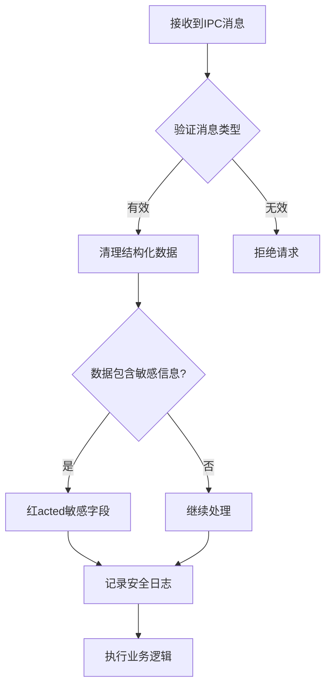
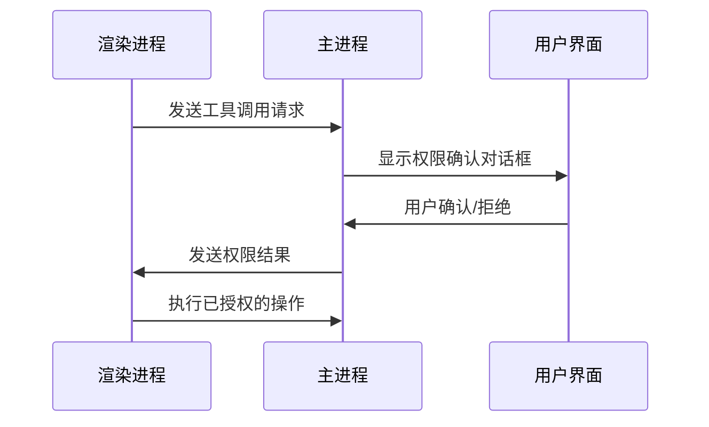
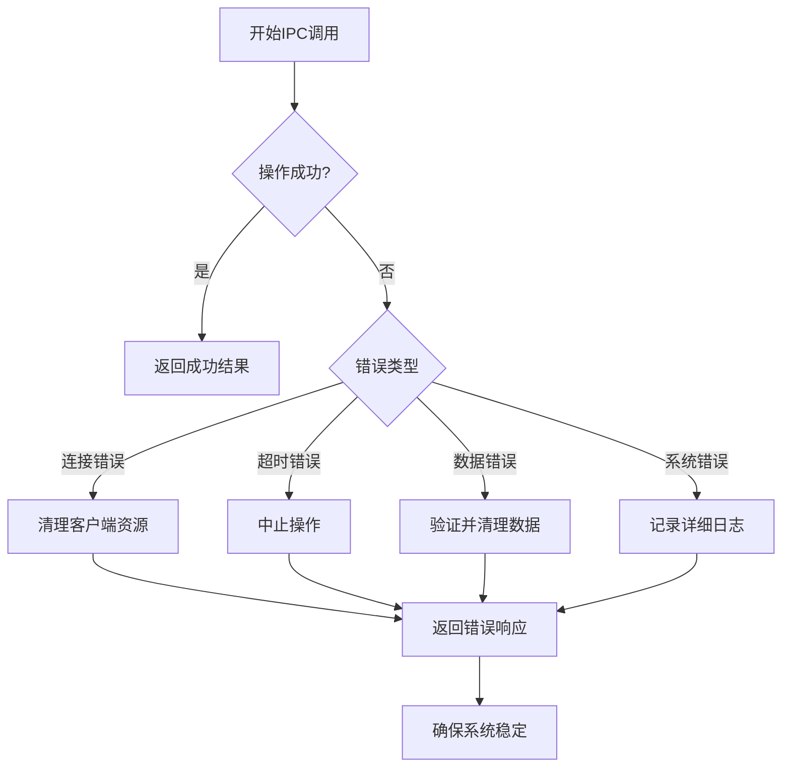
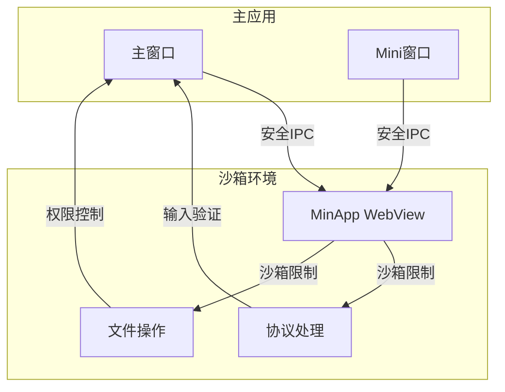

# 安全性

<cite>
**本文档中引用的文件**  
- [IpcChannel.ts](file://packages/shared/IpcChannel.ts)
- [ipc.ts](file://src/main/ipc.ts)
- [MCPService.ts](file://src/main/services/MCPService.ts)
- [tool-permissions.ts](file://src/main/services/agents/services/claudecode/tool-permissions.ts)
- [WindowService.ts](file://src/main/services/WindowService.ts)
- [index.ts](file://src/preload/index.ts)
</cite>

## 目录
1. [输入验证机制](#输入验证机制)
2. [权限控制策略](#权限控制策略)
3. [错误处理与异常捕获](#错误处理与异常捕获)
4. [沙箱环境与XSS防护](#沙箱环境与xss防护)
5. [安全编码最佳实践](#安全编码最佳实践)

## 输入验证机制

Cherry Studio的IPC通信安全性设计中，输入验证是防止恶意数据注入和类型攻击的第一道防线。系统通过多层次的验证机制确保数据的完整性和安全性。

在工具权限请求处理中，系统实现了结构化数据的清理和验证。通过`sanitizeStructuredData`函数，使用自定义的`jsonReplacer`函数对数据进行序列化和反序列化，有效处理了BigInt、Map、Set、Date等特殊类型的数据，同时过滤掉函数和undefined值，防止原型污染和代码执行攻击。

**图示来源**
- [tool-permissions.ts](file://src/main/services/agents/services/claudecode/tool-permissions.ts#L63-L82)
- [MCPService.ts](file://src/main/services/MCPService.ts#L64-L90)

**本节来源**
- [tool-permissions.ts](file://src/main/services/agents/services/claudecode/tool-permissions.ts#L73-L82)
- [MCPService.ts](file://src/main/services/MCPService.ts#L64-L90)

## 权限控制策略

Cherry Studio实现了严格的权限控制策略，确保只有授权进程可以发送特定类型的IPC消息。系统采用基于请求-响应的权限验证模型，对每个工具调用进行显式授权。

权限控制系统的核心是`AgentToolPermission_Request`和`AgentToolPermission_Response`通道。当需要执行敏感操作时，主进程会向渲染进程发送权限请求，等待用户确认后才继续执行。系统还实现了自动审批机制，可通过环境变量`CHERRY_AUTO_ALLOW_TOOLS`进行配置。

对于MCP服务器管理，系统实现了服务器信任验证机制。当通过协议安装MCP服务器时，系统会显示命令预览并要求用户确认，防止恶意命令执行。

**图示来源**
- [IpcChannel.ts](file://packages/shared/IpcChannel.ts#L100-L102)
- [tool-permissions.ts](file://src/main/services/agents/services/claudecode/tool-permissions.ts#L19-L58)
- [useMCPServerTrust.tsx](file://src/renderer/src/hooks/useMCPServerTrust.tsx#L1-L57)

**本节来源**
- [tool-permissions.ts](file://src/main/services/agents/services/claudecode/tool-permissions.ts#L13-L15)
- [useMCPServerTrust.tsx](file://src/renderer/src/hooks/useMCPServerTrust.tsx#L1-L57)
- [utils.ts](file://src/renderer/src/pages/settings/MCPSettings/utils.ts#L24-L40)

## 错误处理与异常捕获

Cherry Studio的IPC通信系统实现了全面的错误处理和异常捕获机制，确保通信失败时系统的稳定性。系统采用分层异常处理策略，在各个关键节点都设置了错误捕获和恢复机制。

在MCP服务中，每个客户端连接都有独立的错误处理流程。系统会监控连接状态，当检测到连接失败时，会自动清理相关资源并记录详细的错误日志。对于工具调用，系统实现了超时控制和中止机制，防止长时间运行的操作影响系统性能。

主进程中的IPC处理器都包裹在异常捕获块中，确保任何未处理的异常都不会导致主进程崩溃。系统还实现了渲染进程崩溃恢复机制，当检测到渲染进程崩溃时，会根据崩溃间隔时间决定是重启进程还是退出应用。

**图示来源**
- [MCPService.ts](file://src/main/services/MCPService.ts#L592-L613)
- [WindowService.ts](file://src/main/services/WindowService.ts#L134-L146)
- [tool-permissions.ts](file://src/main/services/agents/services/claudecode/tool-permissions.ts#L124-L144)

**本节来源**
- [MCPService.ts](file://src/main/services/MCPService.ts#L592-L613)
- [WindowService.ts](file://src/main/services/WindowService.ts#L134-L146)

## 沙箱环境与XSS防护

Cherry Studio在沙箱环境下的通信限制和安全考虑方面采取了多项措施，有效防止跨站脚本攻击（XSS）通过IPC通道传播。

在窗口服务中，系统通过移除响应头中的`X-Frame-Options`和`Content-Security-Policy`来确保内容可以正确显示，同时通过其他安全机制来补偿这种宽松策略带来的风险。系统还实现了WebView的严格配置，确保嵌入的内容在受控环境中运行。

对于MinApp等嵌入式应用，系统采用了分区存储（partition="persist:webview"）来隔离不同应用的数据，防止数据泄露。同时，通过设置自定义的User-Agent字符串，确保某些特定网站能够正确渲染。

**图示来源**
- [WindowService.ts](file://src/main/services/WindowService.ts#L308-L323)
- [WebviewContainer.tsx](file://src/renderer/src/components/MinApp/WebviewContainer.tsx#L138-L145)
- [index.ts](file://src/preload/index.ts#L84-L88)

**本节来源**
- [WindowService.ts](file://src/main/services/WindowService.ts#L308-L323)
- [WebviewContainer.tsx](file://src/renderer/src/components/MinApp/WebviewContainer.tsx#L138-L145)

## 安全编码最佳实践

基于Cherry Studio的IPC通信安全设计，以下是推荐的安全编码最佳实践指南：

1. **输入验证**：始终验证和清理所有输入数据，特别是来自不受信任来源的数据。使用结构化数据清理函数处理复杂对象。

2. **权限最小化**：遵循最小权限原则，只授予执行特定任务所需的最低权限。对于敏感操作，实施显式用户确认机制。

3. **错误处理**：在所有关键路径上实现全面的错误处理，确保异常不会导致系统不稳定。记录详细的错误日志用于诊断，但避免泄露敏感信息。

4. **数据红acted**：在日志记录和错误报告中，对敏感信息（如认证令牌、API密钥）进行红acted处理。

5. **超时控制**：为所有异步操作设置合理的超时，防止资源耗尽和拒绝服务攻击。

6. **安全通信**：使用安全的通信通道，避免在IPC消息中传输敏感信息。对于必须传输的敏感数据，考虑使用加密。

7. **沙箱隔离**：将不受信任的代码和内容运行在沙箱环境中，限制其对系统资源的访问。

8. **定期审计**：定期审查IPC通道和权限模型，确保没有不必要的权限暴露。

**本节来源**
- [tool-permissions.ts](file://src/main/services/agents/services/claudecode/tool-permissions.ts)
- [MCPService.ts](file://src/main/services/MCPService.ts)
- [WindowService.ts](file://src/main/services/WindowService.ts)
- [index.ts](file://src/preload/index.ts)