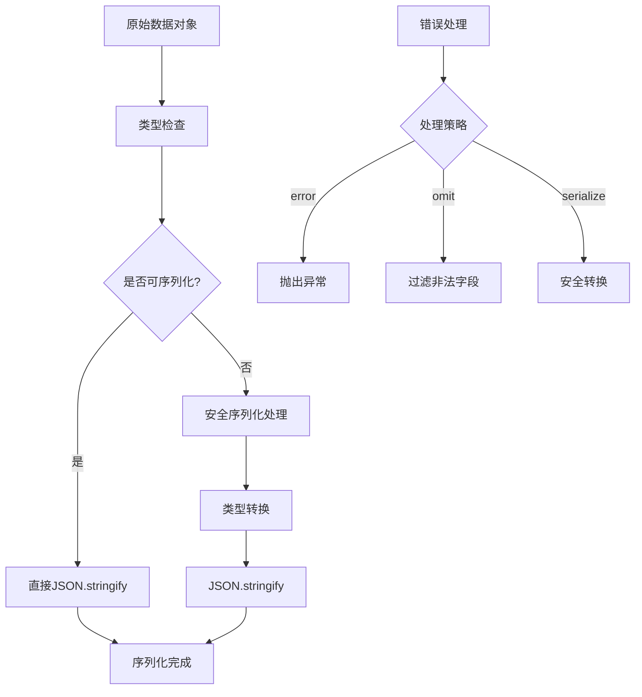
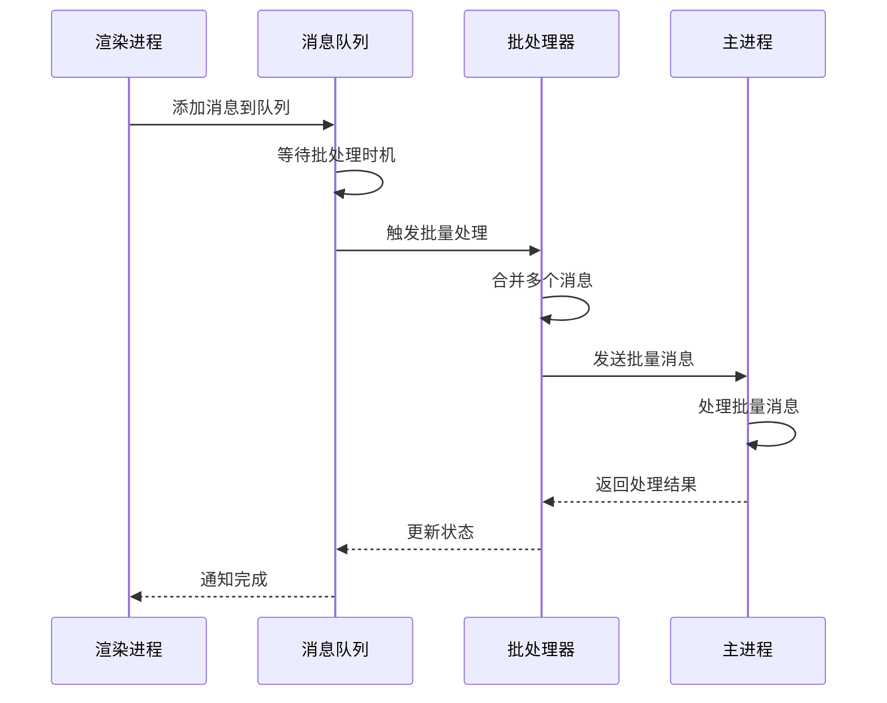
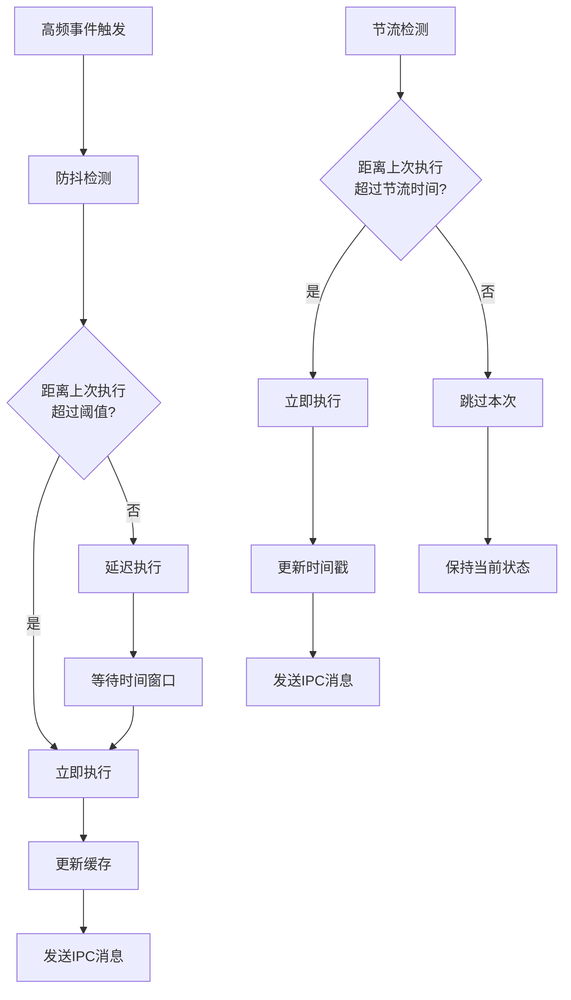
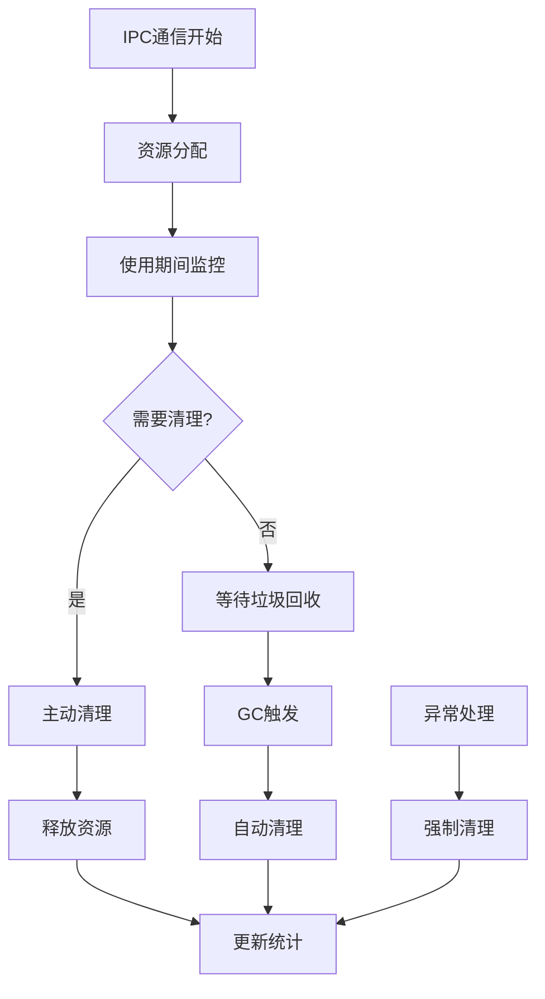
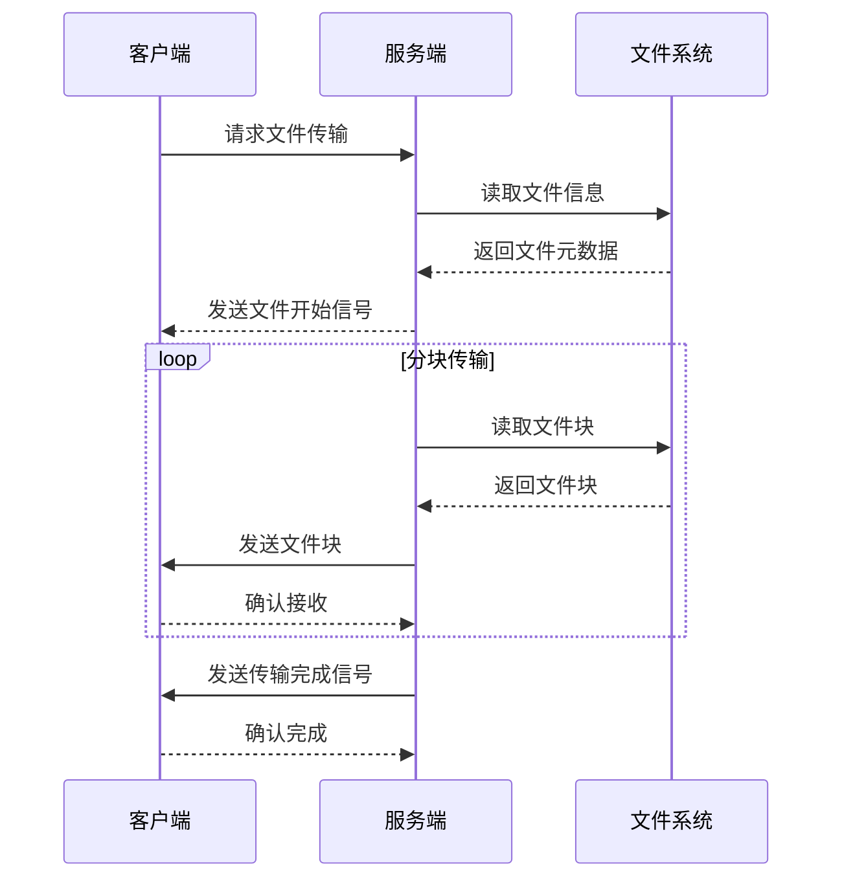
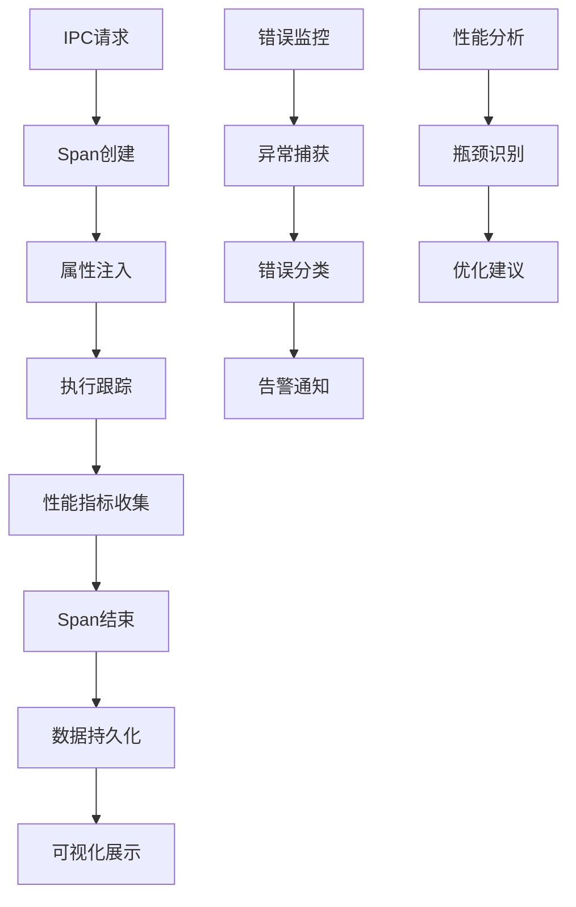

# 性能优化

<cite>
**本文档引用的文件**
- [IpcChannel.ts](file://packages/shared/IpcChannel.ts)
- [ipc.ts](file://src/main/ipc.ts)
- [AgentMessageDataSource.ts](file://src/renderer/src/services/db/AgentMessageDataSource.ts)
- [messageThunk.ts](file://src/renderer/src/store/thunk/messageThunk.ts)
- [SpanCacheService.ts](file://src/main/services/SpanCacheService.ts)
- [queue.ts](file://src/renderer/src/utils/queue.ts)
- [serialize.ts](file://src/renderer/src/utils/serialize.ts)
- [WebSocketService.ts](file://src/main/services/WebSocketService.ts)
- [FileStorage.ts](file://src/main/services/FileStorage.ts)
- [MCPService.ts](file://src/main/services/MCPService.ts)
- [FileServiceManager.ts](file://src/main/services/remotefile/FileServiceManager.ts)
</cite>

## 目录
1. [概述](#概述)
2. [消息序列化优化](#消息序列化优化)
3. [批量处理机制](#批量处理机制)
4. [防抖与节流技术](#防抖与节流技术)
5. [内存管理策略](#内存管理策略)
6. [大数据量传输优化](#大数据量传输优化)
7. [性能监控与诊断](#性能监控与诊断)
8. [最佳实践建议](#最佳实践建议)

## 概述

Cherry Studio采用Electron架构，通过IPC（进程间通信）实现主进程与渲染进程之间的数据交换。为了确保高性能的通信体验，系统实现了多种性能优化策略，包括消息序列化优化、批量处理、防抖节流技术、内存管理和大数据量传输优化等。

## 消息序列化优化

### 序列化性能分析

Cherry Studio在IPC通信中采用了多层次的序列化优化策略：

**图表来源**
- [serialize.ts](file://src/renderer/src/utils/serialize.ts#L11-L43)

### 序列化优化策略

系统实现了智能的序列化机制，根据数据类型和复杂度选择最优的序列化路径：

1. **类型安全检查**：通过运行时类型检查确保数据完整性
2. **增量序列化**：只序列化发生变化的部分数据
3. **缓存机制**：对重复序列化的数据进行缓存
4. **错误恢复**：提供多种错误处理策略

**章节来源**
- [serialize.ts](file://src/renderer/src/utils/serialize.ts#L11-L43)

## 批量处理机制

### 消息批处理架构

Cherry Studio实现了高效的批量处理机制来减少IPC通信开销：

**图表来源**
- [queue.ts](file://src/renderer/src/utils/queue.ts#L13-L50)
- [AgentMessageDataSource.ts](file://src/renderer/src/services/db/AgentMessageDataSource.ts#L50-L85)

### 批处理优化策略

1. **队列管理**：使用优先级队列管理不同类型的IPC请求
2. **时间窗口聚合**：在指定时间窗口内收集消息进行批量处理
3. **大小限制控制**：设置批量处理的大小上限避免内存溢出
4. **异步处理**：非阻塞式批量处理确保UI响应性

**章节来源**
- [queue.ts](file://src/renderer/src/utils/queue.ts#L13-L50)
- [AgentMessageDataSource.ts](file://src/renderer/src/services/db/AgentMessageDataSource.ts#L50-L85)

## 防抖与节流技术

### 高频通信优化

Cherry Studio在处理高频IPC通信时采用了先进的防抖和节流技术：

**图表来源**
- [messageThunk.ts](file://src/renderer/src/store/thunk/messageThunk.ts#L387-L427)

### 具体实现策略

1. **消息块节流**：每个消息块使用独立的节流器，避免并发更新相互影响
2. **RAF集成**：结合requestAnimationFrame确保UI更新的流畅性
3. **LRU缓存**：使用LRU缓存管理节流器实例，自动清理过期的节流器
4. **动态调整**：根据系统负载动态调整节流参数

**章节来源**
- [messageThunk.ts](file://src/renderer/src/store/thunk/messageThunk.ts#L387-L427)

## 内存管理策略

### 内存泄漏预防

Cherry Studio实现了全面的内存管理策略来防止IPC通信过程中的内存泄漏：

**图表来源**
- [SpanCacheService.ts](file://src/main/services/SpanCacheService.ts#L54-L76)
- [MCPService.ts](file://src/main/services/MCPService.ts#L579-L587)

### 内存优化技术

1. **自动清理机制**：定期清理过期的IPC缓存和临时数据
2. **弱引用使用**：在适当场景使用WeakMap和WeakSet避免循环引用
3. **资源池管理**：复用IPC连接和缓冲区减少内存分配
4. **监控告警**：实时监控内存使用情况，及时发现潜在问题

**章节来源**
- [SpanCacheService.ts](file://src/main/services/SpanCacheService.ts#L54-L76)
- [MCPService.ts](file://src/main/services/MCPService.ts#L579-L587)

## 大数据量传输优化

### 文件传输优化

Cherry Studio针对大数据量传输实现了多种优化策略：

**图表来源**
- [WebSocketService.ts](file://src/main/services/WebSocketService.ts#L287-L359)
- [FileStorage.ts](file://src/main/services/FileStorage.ts#L176-L201)

### 传输优化策略

1. **分块传输**：将大文件分割成小块进行传输，避免内存溢出
2. **进度监控**：实时监控传输进度，提供用户体验反馈
3. **断点续传**：支持传输中断后的续传功能
4. **压缩优化**：对传输内容进行压缩减少带宽占用

**章节来源**
- [WebSocketService.ts](file://src/main/services/WebSocketService.ts#L287-L359)
- [FileStorage.ts](file://src/main/services/FileStorage.ts#L176-L201)

## 性能监控与诊断

### 分布式追踪系统

Cherry Studio集成了完整的性能监控和诊断系统：

**图表来源**
- [SpanCacheService.ts](file://src/main/services/SpanCacheService.ts#L15-L52)

### 监控功能特性

1. **实时追踪**：对所有IPC通信进行实时追踪
2. **性能指标**：收集响应时间、吞吐量等关键指标
3. **错误诊断**：提供详细的错误堆栈和上下文信息
4. **历史数据分析**：支持历史性能趋势分析

**章节来源**
- [SpanCacheService.ts](file://src/main/services/SpanCacheService.ts#L15-L52)

## 最佳实践建议

### 开发指导原则

1. **合理使用批量处理**：对于频繁的小消息，优先考虑批量处理
2. **避免过度序列化**：只序列化必要的数据字段
3. **及时清理资源**：确保IPC通信完成后及时释放相关资源
4. **监控性能指标**：定期检查IPC通信的性能表现

### 性能调优建议

1. **调整节流参数**：根据具体应用场景调整防抖和节流的时间间隔
2. **优化序列化策略**：对于复杂对象，考虑自定义序列化逻辑
3. **实施缓存策略**：对重复的数据传输实施缓存机制
4. **监控内存使用**：建立内存使用监控，及时发现内存泄漏

### 故障排除指南

1. **识别通信瓶颈**：通过性能监控工具定位慢速的IPC调用
2. **分析内存泄漏**：使用内存分析工具检查IPC相关的内存使用
3. **优化大数据传输**：对于大文件传输，考虑使用专门的传输协议
4. **调试序列化问题**：检查序列化过程中的错误和异常

通过以上全面的性能优化策略，Cherry Studio能够实现高效、稳定的IPC通信，为用户提供流畅的应用体验。这些优化措施不仅提升了系统的整体性能，也为开发者提供了强大的监控和诊断工具，便于持续改进和维护。