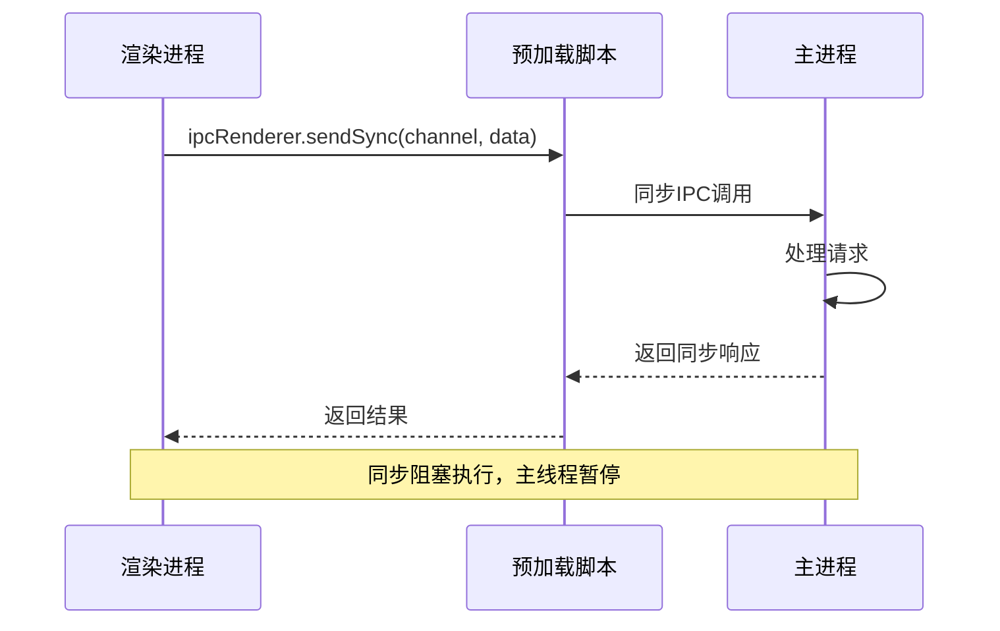
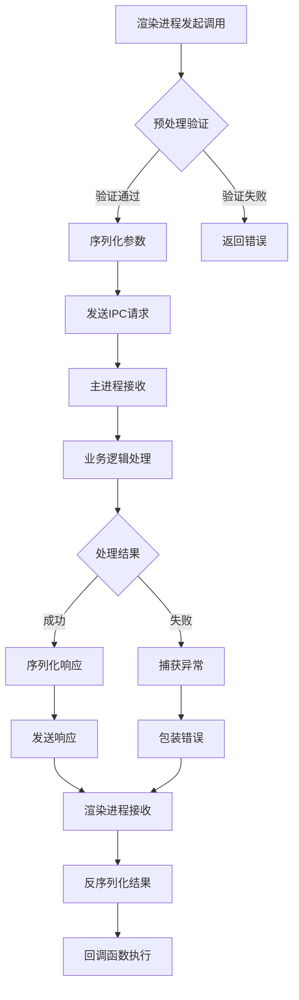
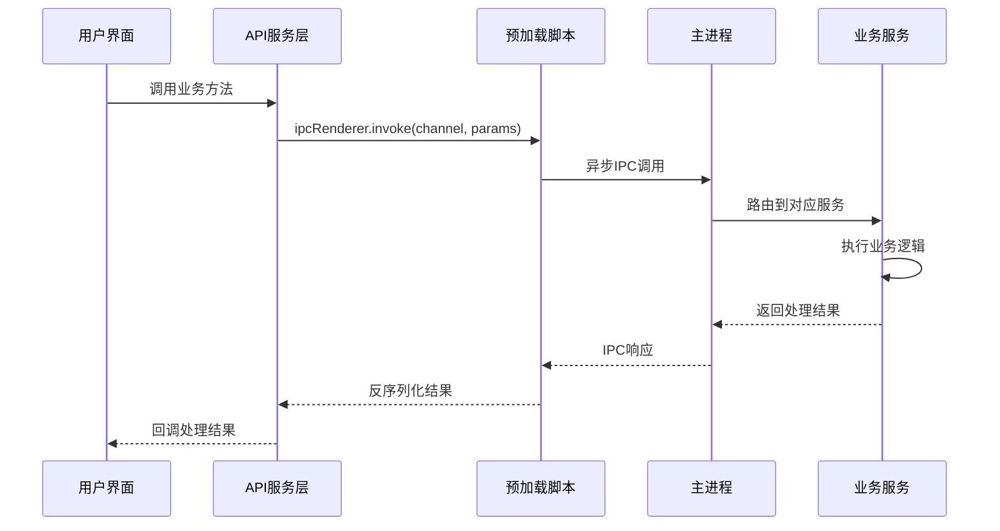
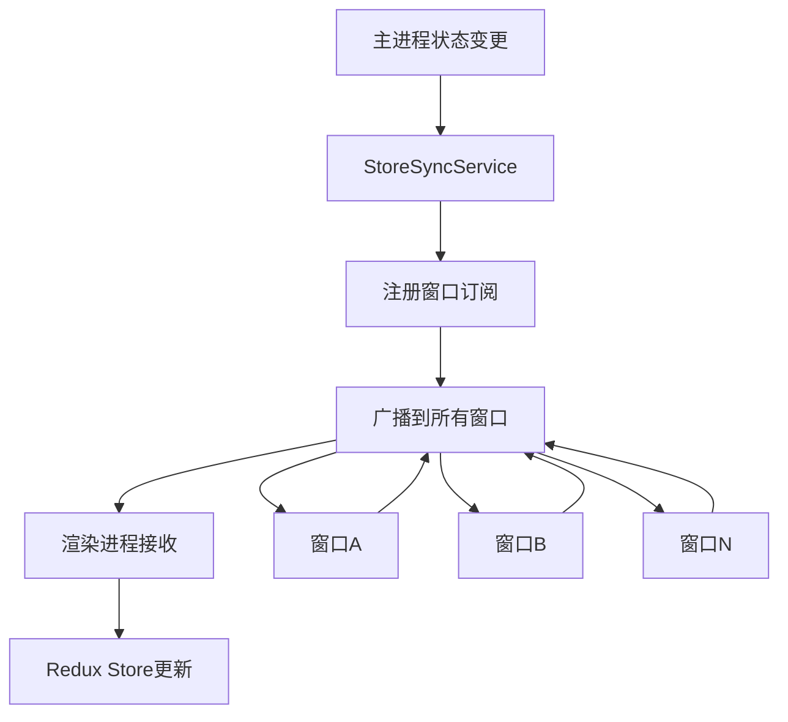
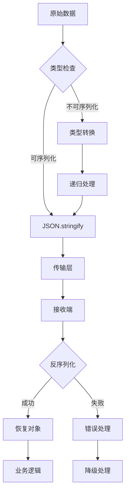
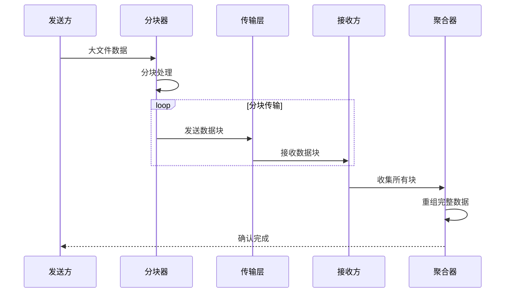
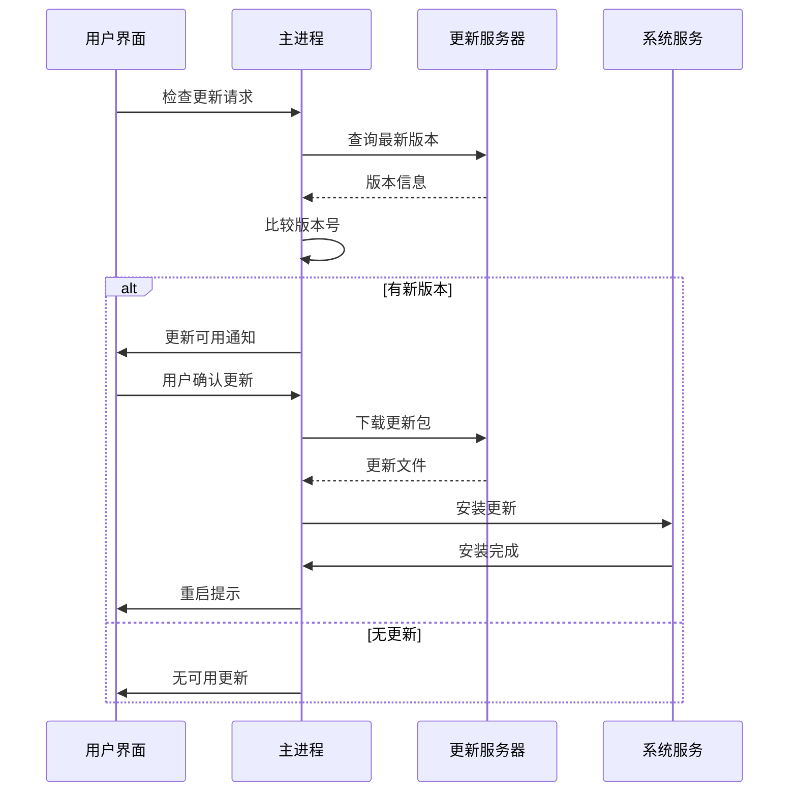

# Cherry Studio IPC通信模式详解

<cite>
**本文档引用的文件**
- [IpcChannel.ts](file://packages/shared/IpcChannel.ts)
- [ipc.ts](file://src/main/ipc.ts)
- [index.ts](file://src/preload/index.ts)
- [StoreSyncService.ts](file://src/main/services/StoreSyncService.ts)
- [EventService.ts](file://src/renderer/src/services/EventService.ts)
- [ApiService.ts](file://src/renderer/src/services/ApiService.ts)
- [NotificationService.ts](file://src/main/services/NotificationService.ts)
- [serialize.ts](file://src/renderer/src/utils/serialize.ts)
</cite>

## 目录
1. [概述](#概述)
2. [IPC通道定义系统](#ipc通道定义系统)
3. [同步消息传递模式](#同步消息传递模式)
4. [异步消息传递模式](#异步消息传递模式)
5. [双向通信架构](#双向通信架构)
6. [消息序列化与反序列化](#消息序列化与反序列化)
7. [大型数据传输优化](#大型数据传输优化)
8. [实际应用案例](#实际应用案例)
9. [最佳实践与性能考虑](#最佳实践与性能考虑)

## 概述

Cherry Studio采用基于Electron的IPC（进程间通信）机制，在主进程（Main Process）和渲染进程（Renderer Process）之间建立高效、可靠的数据交换通道。该通信系统通过标准化的通道定义、多种消息传递模式和完善的错误处理机制，确保应用程序各组件间的协调工作。

### 核心特性

- **标准化通道定义**：统一的IpcChannel枚举系统
- **双模式通信**：支持同步和异步消息传递
- **双向通信**：渲染进程主动请求和主进程主动通知
- **类型安全**：强类型的消息传递和验证
- **性能优化**：针对大数据传输的专门优化策略

## IPC通道定义系统

### IpcChannel枚举结构

Cherry Studio通过IpcChannel枚举定义所有可用的IPC通信通道，提供了清晰的命名空间和功能分类：

```mermaid
graph TD
A[IpcChannel 枚举] --> B[应用管理]
A --> C[配置管理]
A --> D[文件操作]
A --> E[知识库]
A --> F[备份恢复]
A --> G[窗口控制]
A --> H[通知系统]
A --> I[MCP服务]
A --> J[存储同步]
B --> B1[App_GetCacheSize]
B --> B2[App_ClearCache]
B --> B3[App_SetLanguage]
C --> C1[Config_Set]
C --> C2[Config_Get]
D --> D1[File_Open]
D --> D2[File_Save]
D --> D3[File_Read]
E --> E1[KnowledgeBase_Create]
E --> E2[KnowledgeBase_Search]
F --> F1[Backup_Backup]
F --> F2[Backup_Restore]
G --> G1[Windows_SetMinimumSize]
G --> G2[Windows_Close]
H --> H1[Notification_Send]
H --> H2[Notification_OnClick]
I --> I1[Mcp_AddServer]
I --> I2[Mcp_CallTool]
J --> J1[StoreSync_Subscribe]
J --> J2[StoreSync_BroadcastSync]
```



**图表来源**
- [IpcChannel.ts](file://packages/shared/IpcChannel.ts#L1-L379)

### 通道分类体系

系统按功能模块对IPC通道进行分类，每个分类都有明确的职责边界：

| 分类 | 通道数量 | 主要功能 | 使用场景 |
|------|----------|----------|----------|
| 应用管理 | 40+ | 应用生命周期、系统配置 | 用户界面交互、系统设置 |
| 文件操作 | 30+ | 文件读写、目录管理 | 文档编辑、资源管理 |
| 知识库 | 10+ | 智能搜索、内容管理 | AI辅助功能 |
| 备份恢复 | 15+ | 数据备份、迁移 | 数据保护 |
| 窗口控制 | 10+ | 界面布局、状态管理 | 用户体验优化 |
| 通知系统 | 5+ | 消息推送、状态通知 | 异步事件处理 |
| MCP服务 | 20+ | 外部服务集成 | 插件扩展功能 |
| 存储同步 | 5+ | 状态同步、事件广播 | 多窗口协作 |

**章节来源**
- [IpcChannel.ts](file://packages/shared/IpcChannel.ts#L1-L379)

## 同步消息传递模式

### sendSync方法的使用场景

虽然Electron官方不推荐使用`ipcRenderer.sendSync`，但在Cherry Studio中，某些特定场景下仍会使用同步消息传递：

#### 使用场景分析

1. **初始化阶段配置读取**
   - 应用启动时读取用户配置
   - 系统环境检测和验证
   - 快速响应的系统查询

2. **关键路径状态检查**
   - 权限验证
   - 文件存在性检查
   - 网络连接状态确认

3. **调试和开发工具**
   - 开发者工具中的即时查询
   - 性能监控数据获取

#### 实现机制



**图表来源**
- [index.ts](file://src/preload/index.ts#L1-L200)

### 同步通信的风险与限制

- **性能影响**：可能导致UI线程阻塞
- **死锁风险**：不当使用可能造成进程僵死
- **调试困难**：错误传播路径复杂
- **平台差异**：不同操作系统行为可能不一致

**章节来源**
- [index.ts](file://src/preload/index.ts#L1-L200)

## 异步消息传递模式

### invoke方法的标准化使用

Cherry Studio主要采用`ipcRenderer.invoke`进行异步通信，提供更好的错误处理和超时控制：

#### 核心实现模式



**图表来源**
- [index.ts](file://src/preload/index.ts#L61-L67)
- [ipc.ts](file://src/main/ipc.ts#L115-L130)

#### 异步通信的优势

1. **非阻塞执行**：不会阻塞主线程
2. **错误隔离**：异常在各自进程中处理
3. **超时控制**：可设置合理的超时时间
4. **并发支持**：支持多个异步调用并行执行

### tracedInvoke增强功能

系统提供了`tracedInvoke`函数，用于支持分布式追踪：

```typescript
// 追踪上下文传递示例
export function tracedInvoke(channel: string, spanContext: SpanContext | undefined, ...args: any[]) {
  if (spanContext) {
    const data = { type: 'trace', context: spanContext }
    return ipcRenderer.invoke(channel, ...args, data)
  }
  return ipcRenderer.invoke(channel, ...args)
}
```

**章节来源**
- [index.ts](file://src/preload/index.ts#L61-L67)

## 双向通信架构

### 渲染进程主动请求模式

渲染进程作为通信的主动方，通过预加载脚本提供的API接口发起各种请求：

#### 请求流程设计



**图表来源**
- [ApiService.ts](file://src/renderer/src/services/ApiService.ts#L48-L78)
- [index.ts](file://src/preload/index.ts#L69-L118)

#### 典型应用场景

1. **文件操作**：打开、保存、删除文件
2. **配置管理**：读取和修改应用设置
3. **系统集成**：访问系统资源和服务
4. **外部服务**：调用MCP服务器和第三方API

### 主进程主动通知模式

主进程可以通过多种方式向渲染进程发送通知：

#### StoreSyncService广播机制



**图表来源**
- [StoreSyncService.ts](file://src/main/services/StoreSyncService.ts#L44-L88)
- [StoreSyncService.ts](file://src/renderer/src/services/StoreSyncService.ts#L90-L138)

#### 事件驱动通知系统

系统使用EventEmitter模式实现灵活的事件通知：

```typescript
// 事件名称定义
export const EVENT_NAMES = {
  SEND_MESSAGE: 'SEND_MESSAGE',
  MESSAGE_COMPLETE: 'MESSAGE_COMPLETE',
  AI_AUTO_RENAME: 'AI_AUTO_RENAME',
  CLEAR_MESSAGES: 'CLEAR_MESSAGES',
  // ... 更多事件类型
}
```

**章节来源**
- [EventService.ts](file://src/renderer/src/services/EventService.ts#L1-L33)

## 消息序列化与反序列化

### 序列化策略

Cherry Studio实现了完善的消息序列化机制，确保复杂对象在进程间安全传输：

#### 序列化流程



**图表来源**
- [serialize.ts](file://src/renderer/src/utils/serialize.ts#L1-L43)

#### 序列化配置选项

| 配置项 | 默认值 | 说明 | 使用场景 |
|--------|--------|------|----------|
| onError | 'serialize' | 错误处理策略 | 数据完整性保护 |
| pretty | true | 输出格式化 | 调试和日志记录 |
| maxDepth | 无限 | 嵌套深度限制 | 防止栈溢出 |
| maxKeys | 无限 | 对象键数限制 | 内存保护 |

### 类型安全保证

系统通过运行时类型检查确保序列化安全性：

```typescript
// 类型安全检查示例
export function safeSerialize(
  value: unknown,
  options: {
    onError?: 'error' | 'omit' | 'serialize'
    pretty?: boolean
  } = {}
): string | null {
  const { onError = 'serialize', pretty = true } = options
  
  // 运行时类型检查
  if (isSerializable(value)) {
    try {
      return JSON.stringify(value, null, pretty ? 2 : undefined)
    } catch (err) {
      if (onError === 'error') {
        throw new Error(`Failed to stringify serializable value: ${err}`)
      }
      return null
    }
  }
  // ... 其他处理逻辑
}
```

**章节来源**
- [serialize.ts](file://src/renderer/src/utils/serialize.ts#L1-L43)

## 大型数据传输优化

### 分块传输策略

对于大型数据传输，系统采用分块传输和流式处理技术：

#### 大数据处理流程



#### 性能优化技术

1. **内存映射**：大文件直接内存映射，避免全量加载
2. **流式处理**：边接收边处理，减少内存占用
3. **压缩传输**：启用gzip压缩减少网络开销
4. **断点续传**：支持传输中断后的恢复

### 文件传输优化

针对文件传输场景，系统实现了专门的优化策略：

```typescript
// 文件传输优化示例
async function transferLargeFile(filePath: string) {
  const fileSize = fs.statSync(filePath).size
  const chunkSize = 1024 * 1024 // 1MB 块大小
  
  // 分块读取和传输
  for (let offset = 0; offset < fileSize; offset += chunkSize) {
    const chunk = fs.readFileSync(filePath, { 
      offset, 
      length: Math.min(chunkSize, fileSize - offset) 
    })
    
    // 异步传输块数据
    await window.api.file.transferChunk({
      offset,
      data: chunk,
      totalSize: fileSize
    })
  }
}
```

**章节来源**
- [DxtService.ts](file://src/main/services/DxtService.ts#L160-L207)

## 实际应用案例

### 应用更新机制

Cherry Studio的自动更新功能展示了完整的IPC通信流程：



**图表来源**
- [ipc.ts](file://src/main/ipc.ts#L475-L478)

### 多窗口状态同步

StoreSyncService实现了跨窗口的状态同步：

```typescript
// 状态同步示例
class StoreSyncService {
  // 订阅其他窗口的状态变化
  public subscribe(): void {
    this.broadcastSyncRemover = window.electron.ipcRenderer.on(
      IpcChannel.StoreSync_BroadcastSync,
      (_, action: StoreSyncAction) => {
        try {
          if (window.store) {
            window.store.dispatch(action)
          }
        } catch (error) {
          logger.error('Error dispatching synced action:', error)
        }
      }
    )
    
    // 注册到主进程
    window.api.storeSync.subscribe()
  }
}
```

**章节来源**
- [StoreSyncService.ts](file://src/renderer/src/services/StoreSyncService.ts#L90-L138)

### 通知系统实现

系统提供了完整的桌面通知机制：

```typescript
// 通知系统架构
class NotificationService {
  public async sendNotification(notification: Notification) {
    const electronNotification = new ElectronNotification({
      title: notification.title,
      body: notification.message
    })
    
    electronNotification.on('click', () => {
      windowService.getMainWindow()?.show()
      windowService.getMainWindow()?.webContents.send('notification-click', notification)
    })
    
    electronNotification.show()
  }
}
```

**章节来源**
- [NotificationService.ts](file://src/main/services/NotificationService.ts#L1-L23)

## 最佳实践与性能考虑

### 通信模式选择指南

| 场景 | 推荐模式 | 原因 | 注意事项 |
|------|----------|------|----------|
| 用户界面交互 | invoke | 非阻塞，用户体验好 | 添加加载状态指示 |
| 系统配置读取 | invoke | 异步处理，避免卡顿 | 缓存常用配置 |
| 文件操作 | invoke | 大数据传输优化 | 分块处理，显示进度 |
| 状态同步 | StoreSync | 自动广播，简化开发 | 控制同步范围 |
| 紧急通知 | 直接通知 | 即时响应 | 不依赖IPC通道 |

### 性能优化建议

1. **批量操作**：合并多个小请求为批量操作
2. **缓存策略**：对频繁访问的数据实施缓存
3. **懒加载**：按需加载IPC通道和相关服务
4. **错误重试**：实现智能的错误重试机制
5. **资源清理**：及时清理不再使用的IPC监听器

### 安全考虑

1. **输入验证**：严格验证所有IPC参数
2. **权限控制**：基于用户权限限制操作
3. **数据加密**：敏感数据传输时加密
4. **审计日志**：记录重要的IPC操作
5. **异常隔离**：防止异常在进程间传播

### 调试和监控

```typescript
// IPC通信监控示例
const logger = loggerService.withContext('IPC')

// 监控IPC调用
ipcMain.handle(channel, async (event, ...args) => {
  const startTime = Date.now()
  
  try {
    const result = await handler(event, ...args)
    const duration = Date.now() - startTime
    
    logger.info(`IPC call ${channel} completed in ${duration}ms`)
    return result
  } catch (error) {
    logger.error(`IPC call ${channel} failed:`, error)
    throw error
  }
})
```

通过遵循这些最佳实践，Cherry Studio能够实现高效、可靠的进程间通信，为用户提供流畅的应用体验。