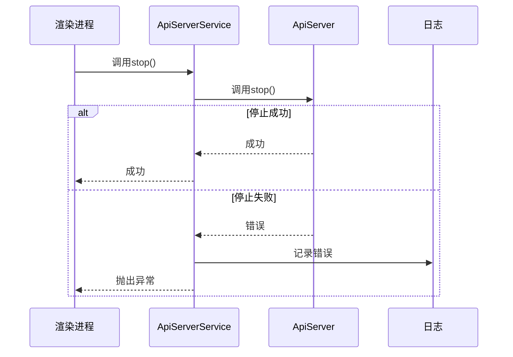
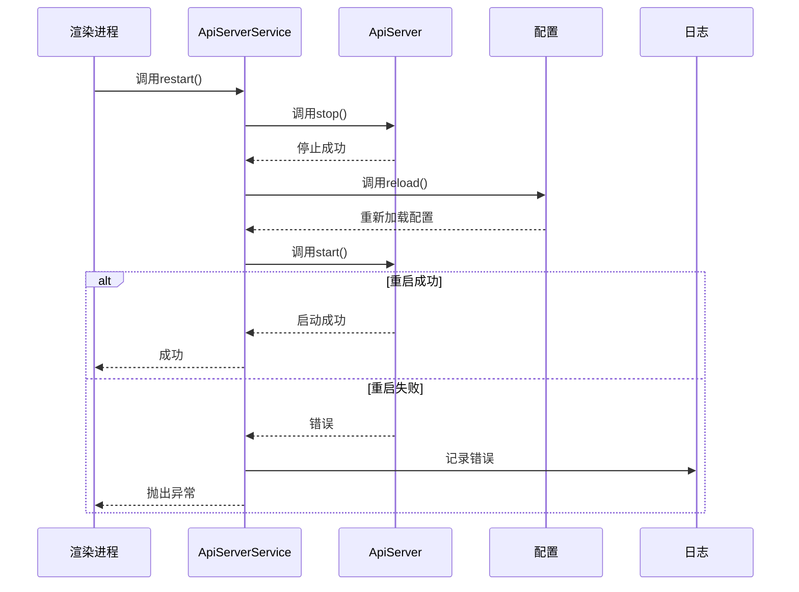
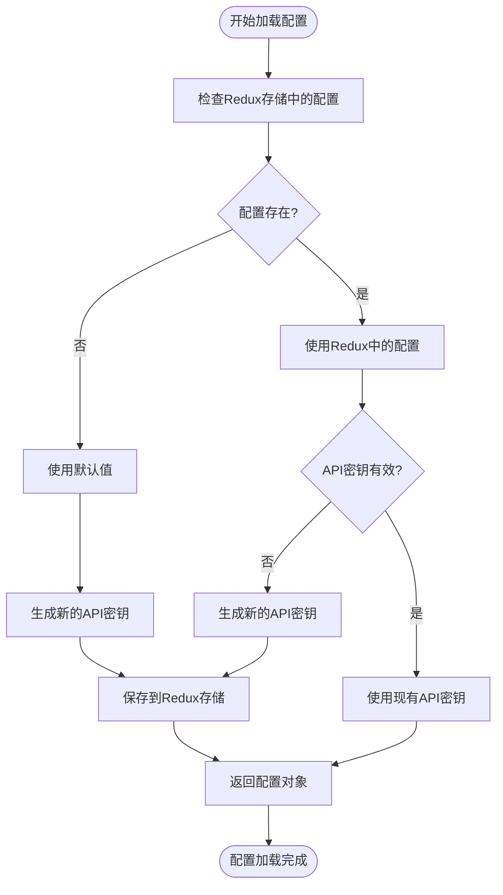
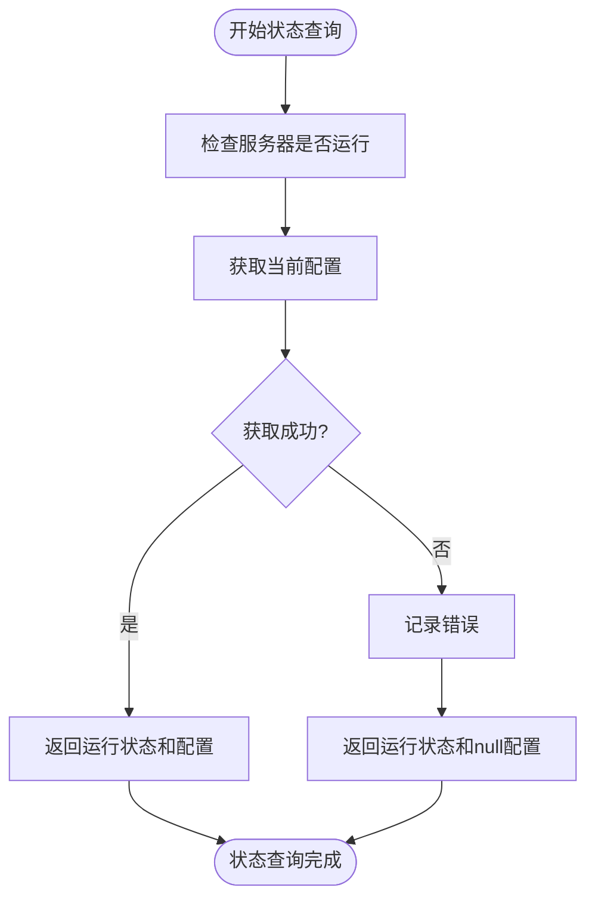
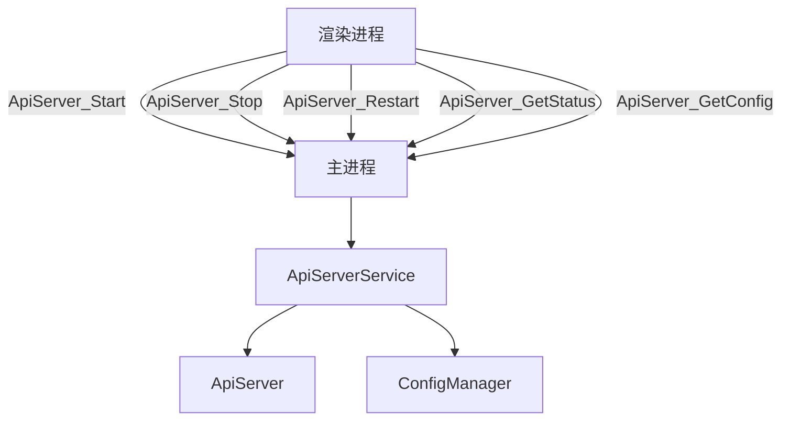
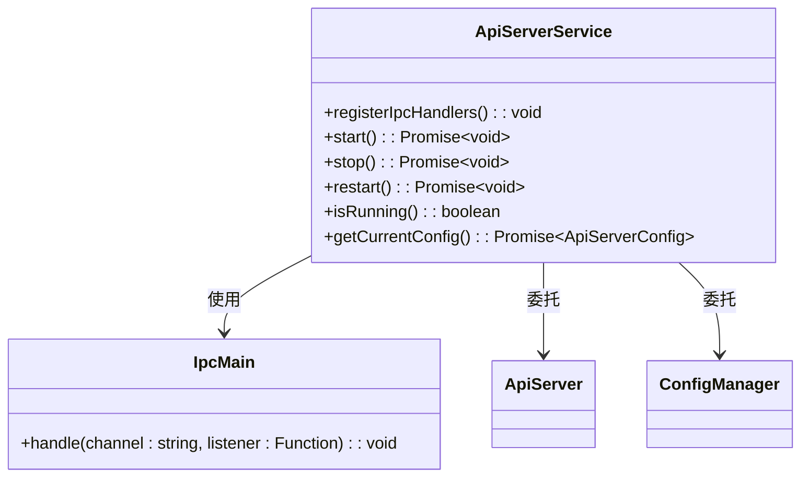
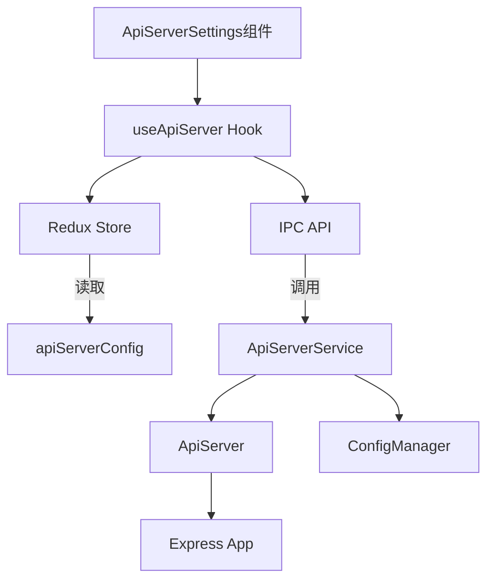

# API服务器服务

<cite>
**本文档引用的文件**
- [ApiServerService.ts](file://src/main/services/ApiServerService.ts)
- [IpcChannel.ts](file://packages/shared/IpcChannel.ts)
- [apiServer.ts](file://src/main/apiServer/server.ts)
- [config.ts](file://src/main/apiServer/config.ts)
- [useApiServer.ts](file://src/renderer/src/hooks/useApiServer.ts)
- [ApiServerSettings.tsx](file://src/renderer/src/pages/settings/ToolSettings/ApiServerSettings/ApiServerSettings.tsx)
- [app.ts](file://src/main/apiServer/app.ts)
- [auth.ts](file://src/main/apiServer/middleware/auth.ts)
</cite>

## 目录
1. [简介](#简介)
2. [核心架构设计](#核心架构设计)
3. [生命周期管理](#生命周期管理)
4. [配置管理](#配置管理)
5. [状态查询功能](#状态查询功能)
6. [IPC通信机制](#ipc通信机制)
7. [IPC处理器注册与错误处理](#ipc处理器注册与错误处理)
8. [前端集成与使用示例](#前端集成与使用示例)
9. [总结](#总结)

## 简介

API服务器服务是Cherry Studio的核心组件之一，为应用程序提供本地API服务器功能。该服务允许用户通过本地网络接口与Cherry Studio的核心功能进行交互，支持各种AI代理、消息处理、模型管理等操作。服务通过Electron的IPC（进程间通信）机制与渲染进程通信，实现了安全的双向数据交换。

API服务器服务的主要功能包括：
- 管理本地API服务器的生命周期（启动、停止、重启）
- 处理服务器配置（端口、主机、API密钥）
- 提供服务器状态查询接口
- 通过IPC通道与前端界面通信
- 集成到应用程序的设置界面中

本文档详细描述了ApiServerService的架构设计、实现细节和使用方法，为开发者和用户提供全面的技术参考。

## 核心架构设计

API服务器服务采用分层架构设计，将不同的功能模块分离，提高了代码的可维护性和可扩展性。服务的核心由以下几个主要组件构成：

1. **ApiServerService类**：作为服务的主控制器，负责协调各个子组件的工作，提供统一的API接口。
2. **ApiServer类**：实际的HTTP服务器实现，基于Express框架构建，负责处理HTTP请求和响应。
3. **ConfigManager类**：配置管理器，负责加载、保存和管理API服务器的配置信息。
4. **IPC处理器**：处理来自渲染进程的IPC请求，实现主进程与渲染进程之间的通信。

服务的架构遵循单一职责原则，每个组件都有明确的职责范围。ApiServerService作为高层协调者，不直接处理HTTP请求或配置存储，而是委托给专门的组件处理。这种设计使得系统更加模块化，便于测试和维护。

服务的依赖关系清晰：ApiServerService依赖于ApiServer和ConfigManager，而ApiServer和ConfigManager之间没有直接依赖。这种松耦合的设计使得各个组件可以独立开发和测试，降低了系统的复杂性。

**Section sources**
- [ApiServerService.ts](file://src/main/services/ApiServerService.ts#L16-L114)
- [apiServer.ts](file://src/main/apiServer/server.ts#L1-L96)
- [config.ts](file://src/main/apiServer/config.ts#L1-L66)

## 生命周期管理

API服务器服务提供了完整的生命周期管理功能，包括启动、停止和重启操作。这些操作通过ApiServerService类的相应方法实现，确保了服务器状态的正确管理和资源的合理释放。

### 启动操作

启动操作通过`start()`方法实现。该方法调用底层ApiServer实例的`start()`方法来启动HTTP服务器。在启动过程中，服务会记录详细的日志信息，包括成功启动的消息和任何可能发生的错误。


**Diagram sources**
- [ApiServerService.ts](file://src/main/services/ApiServerService.ts#L21-L28)
- [apiServer.ts](file://src/main/apiServer/server.ts#L1-L58)

### 停止操作

停止操作通过`stop()`方法实现。该方法调用底层ApiServer实例的`stop()`方法来优雅地关闭HTTP服务器。在停止过程中，服务会等待所有活动连接完成，然后关闭服务器并清理相关资源。



**Diagram sources**
- [ApiServerService.ts](file://src/main/services/ApiServerService.ts#L31-L38)
- [apiServer.ts](file://src/main/apiServer/server.ts#L67-L77)

### 重启操作

重启操作通过`restart()`方法实现。该方法首先调用`stop()`方法停止服务器，然后重新加载配置，最后调用`start()`方法启动服务器。这种设计确保了配置更改在重启后生效。



**Diagram sources**
- [ApiServerService.ts](file://src/main/services/ApiServerService.ts#L41-L48)
- [apiServer.ts](file://src/main/apiServer/server.ts#L79-L83)

**Section sources**
- [ApiServerService.ts](file://src/main/services/ApiServerService.ts#L21-L48)
- [apiServer.ts](file://src/main/apiServer/server.ts#L67-L83)

## 配置管理

API服务器服务的配置管理功能由ConfigManager类实现，负责处理服务器的所有配置项，包括启用状态、主机地址、端口号和API密钥。

### 配置项定义

配置项通过`ApiServerConfig`接口定义，包含以下属性：

- `enabled`: 布尔值，表示API服务器是否启用
- `host`: 字符串，表示服务器监听的主机地址
- `port`: 数字，表示服务器监听的端口号
- `apiKey`: 字符串，表示用于身份验证的API密钥

### 配置加载

配置加载通过`load()`方法实现。该方法从Redux存储中读取配置数据，如果配置不存在或不完整，则使用默认值。API密钥的处理特别重要：如果配置中没有API密钥或为空，则会生成一个新的密钥并保存到Redux存储中。



**Diagram sources**
- [config.ts](file://src/main/apiServer/config.ts#L19-L47)

### 配置获取

配置获取通过`get()`方法实现。该方法确保配置已加载，如果尚未加载则先调用`load()`方法。这保证了每次获取配置时都能得到最新的数据。

### API密钥管理

API密钥使用UUID生成，格式为`cs-sk-{uuid}`。这种格式既保证了密钥的唯一性，又便于识别是Cherry Studio生成的密钥。密钥的生成和存储都通过安全的方式处理，防止泄露。

**Section sources**
- [config.ts](file://src/main/apiServer/config.ts#L1-L66)
- [ApiServerSettings.tsx](file://src/renderer/src/pages/settings/ToolSettings/ApiServerSettings/ApiServerSettings.tsx#L52-L56)

## 状态查询功能

API服务器服务提供了状态查询功能，允许客户端获取服务器的当前运行状态和配置信息。这一功能通过`GetApiServerStatusResult`接口和`getStatus()`方法实现。

### 状态数据结构

状态查询返回的数据结构定义如下：

```typescript
type GetApiServerStatusResult = {
  running: boolean
  config: ApiServerConfig | null
}
```

其中：
- `running`: 布尔值，表示服务器是否正在运行
- `config`: 配置对象或null，包含服务器的配置信息

### 状态查询实现

状态查询通过`getStatus()`方法实现。该方法首先检查服务器的运行状态，然后获取当前配置。在获取配置时，方法会捕获任何可能发生的错误，但仍然返回服务器的运行状态，确保即使配置获取失败也能提供部分信息。



**Diagram sources**
- [ApiServerService.ts](file://src/main/services/ApiServerService.ts#L88-L99)

### 运行状态检查

运行状态检查通过`isRunning()`方法实现。该方法检查服务器实例是否存在且正在监听连接。这种双重检查确保了状态判断的准确性。

**Section sources**
- [ApiServerService.ts](file://src/main/services/ApiServerService.ts#L51-L57)
- [apiServer.ts](file://src/main/apiServer/server.ts#L85-L93)

## IPC通信机制

API服务器服务通过Electron的IPC（进程间通信）机制与渲染进程通信，实现了主进程与渲染进程之间的安全数据交换。通信基于预定义的通道名称，每个操作对应一个特定的IPC通道。

### IPC通道定义

IPC通道在`IpcChannel`枚举中定义，为API服务器服务提供了以下通道：

- `ApiServer_Start`: 启动API服务器
- `ApiServer_Stop`: 停止API服务器
- `ApiServer_Restart`: 重启API服务器
- `ApiServer_GetStatus`: 获取服务器状态
- `ApiServer_GetConfig`: 获取服务器配置



**Diagram sources**
- [IpcChannel.ts](file://packages/shared/IpcChannel.ts#L324-L331)
- [ApiServerService.ts](file://src/main/services/ApiServerService.ts#L61-L109)

### 请求响应数据结构

每个IPC操作都有对应的请求和响应数据结构，确保了通信的类型安全。

#### 启动操作

启动操作的响应结构为`StartApiServerStatusResult`：

```typescript
type StartApiServerStatusResult =
  | { success: true }
  | { success: false; error: string }
```

#### 停止操作

停止操作的响应结构为`StopApiServerStatusResult`：

```typescript
type StopApiServerStatusResult =
  | { success: true }
  | { success: false; error: string }
```

#### 重启操作

重启操作的响应结构为`RestartApiServerStatusResult`：

```typescript
type RestartApiServerStatusResult =
  | { success: true }
  | { success: false; error: string }
```

#### 状态查询

状态查询的响应结构为`GetApiServerStatusResult`：

```typescript
type GetApiServerStatusResult = {
  running: boolean
  config: ApiServerConfig | null
}
```

### 通信流程

IPC通信流程遵循请求-响应模式。渲染进程发送请求到指定的IPC通道，主进程处理请求并返回响应。整个过程是异步的，使用Promise来处理异步操作。

**Section sources**
- [IpcChannel.ts](file://packages/shared/IpcChannel.ts#L324-L331)
- [ApiServerService.ts](file://src/main/services/ApiServerService.ts#L61-L109)
- [apiServer.ts](file://src/main/apiServer/server.ts#L1-L96)

## IPC处理器注册与错误处理

API服务器服务通过`registerIpcHandlers()`方法注册IPC处理器，为每个IPC通道设置相应的处理函数。这一过程实现了请求的路由和处理，同时包含了完善的错误处理机制。

### 处理器注册

`registerIpcHandlers()`方法为每个API服务器相关的IPC通道注册处理函数。每个处理函数都是一个异步函数，接收IPC事件和参数，返回Promise。



**Diagram sources**
- [ApiServerService.ts](file://src/main/services/ApiServerService.ts#L59-L110)

### 错误处理机制

每个IPC处理器都包含了完善的错误处理机制，确保任何错误都不会导致主进程崩溃，同时向客户端提供有意义的错误信息。

#### 异常捕获

每个处理函数都使用try-catch块捕获可能发生的异常。如果发生异常，处理函数不会抛出异常，而是返回一个包含错误信息的失败结果。

```typescript
ipcMain.handle(IpcChannel.ApiServer_Start, async (): Promise<StartApiServerStatusResult> => {
  try {
    await this.start()
    return { success: true }
  } catch (error: any) {
    return { success: false, error: error instanceof Error ? error.message : 'Unknown error' }
  }
})
```

这种设计确保了：
1. 主进程的稳定性：异常被本地捕获，不会传播到Electron的IPC系统
2. 客户端的可预测性：客户端总是收到预期格式的响应，无论是成功还是失败
3. 信息的完整性：错误信息被转换为字符串，便于客户端显示

#### 错误信息处理

错误信息被适当地处理和转换。如果错误对象是Error实例，则使用其message属性；否则，使用"Unknown error"作为默认错误信息。这种处理方式防止了复杂对象的序列化问题，同时确保了错误信息的可读性。

#### 日志记录

虽然IPC处理器不直接记录日志，但它们调用的底层方法（如`start()`、`stop()`等）会记录详细的日志信息。这使得问题排查更加容易，同时保持了IPC处理器的简洁性。

**Section sources**
- [ApiServerService.ts](file://src/main/services/ApiServerService.ts#L61-L109)

## 前端集成与使用示例

API服务器服务与前端界面紧密集成，通过设置界面提供用户友好的操作接口。这种集成通过`useApiServer`自定义Hook和`ApiServerSettings`组件实现。

### 前端Hook实现

`useApiServer` Hook封装了与API服务器服务交互的所有逻辑，为组件提供简洁的API。



**Diagram sources**
- [useApiServer.ts](file://src/renderer/src/hooks/useApiServer.ts#L29-L158)
- [ApiServerSettings.tsx](file://src/renderer/src/pages/settings/ToolSettings/ApiServerSettings/ApiServerSettings.tsx#L19-L200)

### 使用示例

以下是通过UI触发API服务器操作的典型流程：

#### 启动服务器

1. 用户点击"启动"按钮
2. `handleApiServerToggle`函数被调用，参数为`true`
3. `startApiServer`函数通过IPC调用主进程的启动方法
4. 如果启动成功，更新UI状态并显示成功通知
5. 如果启动失败，显示错误通知

```typescript
const handleApiServerToggle = async (enabled: boolean) => {
  try {
    if (enabled) {
      await startApiServer()
    } else {
      await stopApiServer()
    }
  } catch (error) {
    window.toast.error(t('apiServer.messages.operationFailed') + formatErrorMessage(error))
  } finally {
    setApiServerEnabled(enabled)
  }
}
```

#### 重启服务器

1. 用户点击"重启"按钮
2. `handleApiServerRestart`函数被调用
3. `restartApiServer`函数通过IPC调用主进程的重启方法
4. 无论成功或失败，都会显示相应的通知

#### 配置管理

用户可以在服务器停止时修改端口号，或在任何时候重新生成API密钥：

```typescript
const regenerateApiKey = () => {
  const newApiKey = `cs-sk-${uuidv4()}`
  dispatch(setApiServerApiKey(newApiKey))
  window.toast.success(t('apiServer.messages.apiKeyRegenerated'))
}
```

### 设置界面集成

API服务器设置界面集成在应用程序的工具设置中，提供以下功能：

- 服务器状态显示（运行/停止）
- 启动/停止/重启控制按钮
- 端口号配置（仅在服务器停止时可编辑）
- API密钥显示和管理（复制、重新生成）
- API文档链接（服务器运行时显示）

界面根据服务器状态动态调整可用的操作和显示的信息，提供直观的用户体验。

**Section sources**
- [useApiServer.ts](file://src/renderer/src/hooks/useApiServer.ts#L29-L158)
- [ApiServerSettings.tsx](file://src/renderer/src/pages/settings/ToolSettings/ApiServerSettings/ApiServerSettings.tsx#L19-L200)

## 总结

API服务器服务是Cherry Studio中一个设计精良、功能完整的组件，为应用程序提供了强大的本地API服务能力。通过对生命周期管理、配置管理、状态查询和IPC通信的深入分析，我们可以看到该服务具有以下特点：

1. **清晰的架构设计**：采用分层架构，各组件职责明确，松耦合，易于维护和扩展。
2. **完整的生命周期管理**：提供了启动、停止、重启等完整的服务器生命周期操作，确保了服务的可用性和稳定性。
3. **安全的配置管理**：通过Redux存储管理配置，使用UUID生成安全的API密钥，确保了配置的安全性。
4. **可靠的IPC通信**：基于Electron的IPC机制，定义了清晰的通道和数据结构，实现了主进程与渲染进程之间的安全通信。
5. **完善的错误处理**：在各个层次都实现了错误处理，确保了系统的稳定性和用户体验。
6. **良好的前端集成**：通过自定义Hook和组件，与前端界面紧密集成，提供了用户友好的操作界面。

该服务的设计体现了现代Electron应用开发的最佳实践，为类似功能的实现提供了有价值的参考。通过进一步的优化和扩展，如支持更多的认证方式、提供更详细的监控信息等，可以进一步提升服务的功能和性能。