# Cherry Studio服务架构

<cite>
**本文档引用的文件**
- [ConfigManager.ts](file://src/main/services/ConfigManager.ts)
- [ApiServerService.ts](file://src/main/services/ApiServerService.ts)
- [WindowService.ts](file://src/main/services/WindowService.ts)
- [KnowledgeService.ts](file://src/main/services/KnowledgeService.ts)
- [AppService.ts](file://src/main/services/AppService.ts)
- [LoggerService.ts](file://src/main/services/LoggerService.ts)
- [MCPService.ts](file://src/main/services/MCPService.ts)
- [ThemeService.ts](file://src/main/services/ThemeService.ts)
- [NotificationService.ts](file://src/main/services/NotificationService.ts)
- [bootstrap.ts](file://src/main/bootstrap.ts)
- [index.ts](file://src/main/index.ts)
</cite>

## 目录
1. [概述](#概述)
2. [服务架构设计](#服务架构设计)
3. [核心服务组件](#核心服务组件)
4. [服务注册与依赖注入](#服务注册与依赖注入)
5. [单例模式管理](#单例模式管理)
6. [服务间协作机制](#服务间协作机制)
7. [生命周期管理](#生命周期管理)
8. [错误处理与资源清理](#错误处理与资源清理)
9. [扩展性设计](#扩展性设计)
10. [最佳实践](#最佳实践)

## 概述

Cherry Studio采用模块化的服务架构，通过精心设计的服务管理系统实现主进程的功能解耦和职责分离。该架构以单例模式为基础，结合依赖注入机制，确保服务的高效管理和资源共享。

### 架构特点

- **模块化设计**：每个服务负责特定功能领域
- **单例模式**：全局唯一实例确保状态一致性
- **依赖注入**：通过构造函数注入实现松耦合
- **事件驱动**：基于订阅-发布模式的服务通信
- **生命周期管理**：完整的启动、运行和关闭流程

## 服务架构设计

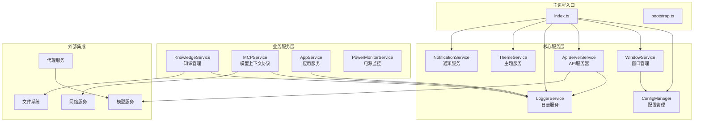

**图表来源**
- [index.ts](file://src/main/index.ts#L17-L37)
- [ConfigManager.ts](file://src/main/services/ConfigManager.ts#L37-L43)
- [WindowService.ts](file://src/main/services/WindowService.ts#L26-L41)

## 核心服务组件

### ConfigManager - 配置管理服务

ConfigManager是整个应用的核心配置管理中心，负责持久化存储和实时同步各种应用配置。

#### 主要特性

- **类型安全的配置访问**：通过枚举定义配置键值
- **变更通知机制**：支持订阅配置变更事件
- **持久化存储**：基于electron-store的本地存储
- **默认值管理**：智能的默认值回退机制

#### 核心方法

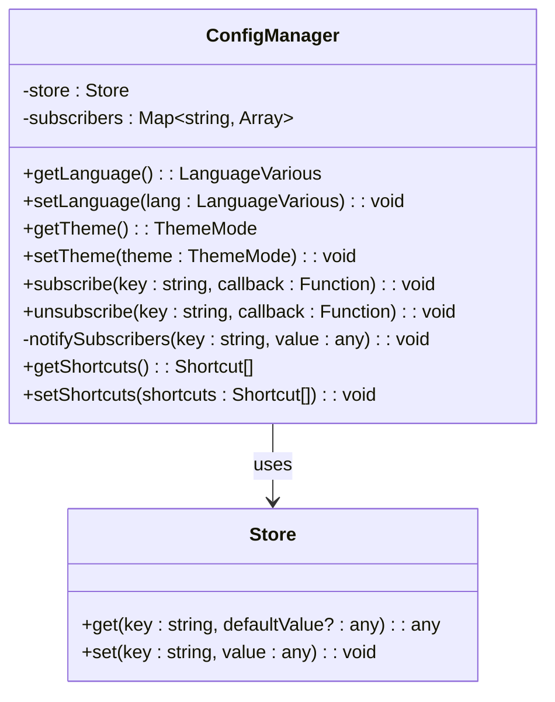

**图表来源**
- [ConfigManager.ts](file://src/main/services/ConfigManager.ts#L37-L269)

**章节来源**
- [ConfigManager.ts](file://src/main/services/ConfigManager.ts#L1-L270)

### ApiServerService - API服务器服务

ApiServerService提供RESTful API服务器功能，支持动态启停和配置管理。

#### 服务能力

- **服务器生命周期管理**：启动、停止、重启操作
- **状态监控**：实时服务器状态检查
- **配置管理**：动态配置更新支持
- **IPC通信**：与渲染进程的双向通信

#### 服务接口

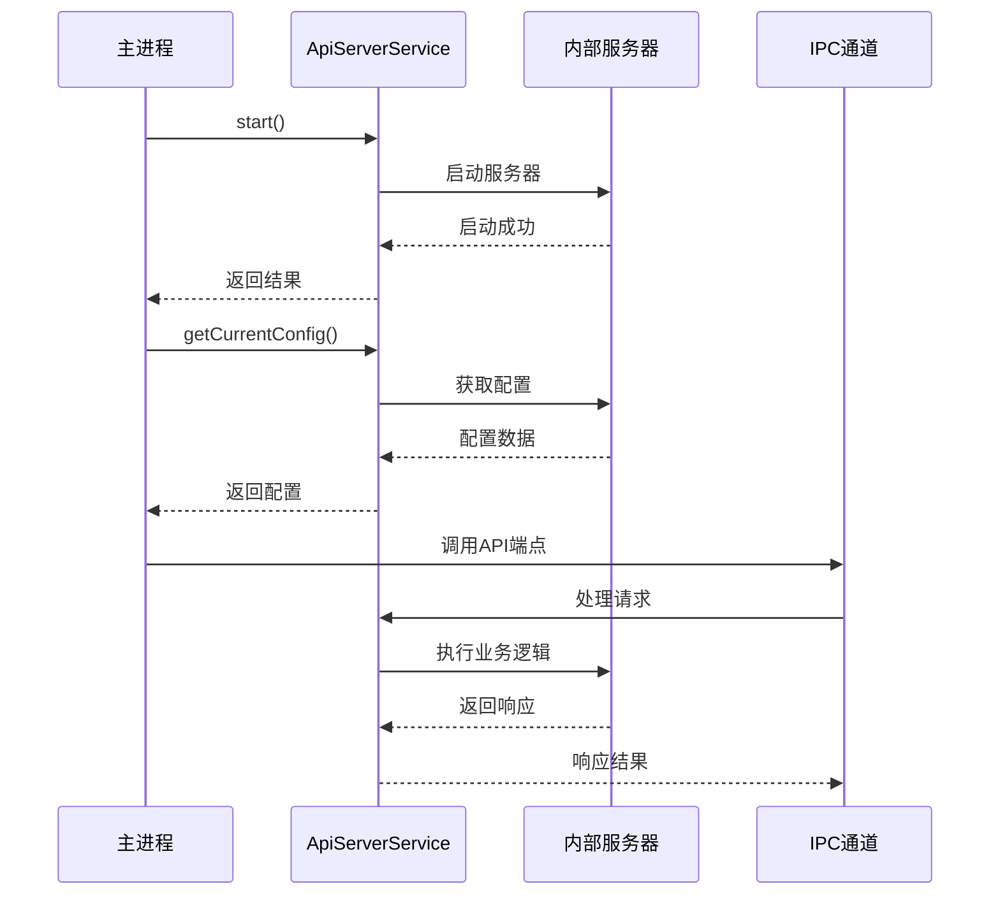

**图表来源**
- [ApiServerService.ts](file://src/main/services/ApiServerService.ts#L21-L114)

**章节来源**
- [ApiServerService.ts](file://src/main/services/ApiServerService.ts#L1-L115)

### WindowService - 窗口管理服务

WindowService是应用窗口的核心管理者，负责主窗口和迷你窗口的生命周期管理。

#### 核心功能

- **单例模式实现**：确保全局唯一的窗口管理器
- **多窗口支持**：同时管理主窗口和迷你窗口
- **跨平台兼容**：针对不同操作系统优化窗口行为
- **状态持久化**：窗口位置、大小等状态保存

#### 窗口生命周期

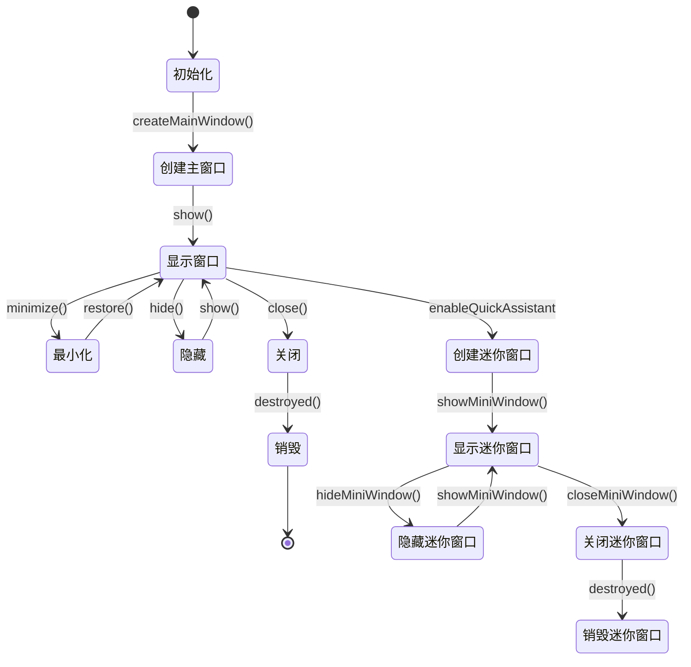

**图表来源**
- [WindowService.ts](file://src/main/services/WindowService.ts#L43-L684)

**章节来源**
- [WindowService.ts](file://src/main/services/WindowService.ts#L1-L685)

### KnowledgeService - 知识管理服务

KnowledgeService是RAG（检索增强生成）系统的管理核心，负责知识库的创建、管理和查询。

#### 技术特性

- **并发任务处理**：支持多个知识库的并行处理
- **多种数据源**：文件、目录、URL、笔记等多种来源
- **向量数据库集成**：基于LibSQL的向量存储
- **预处理支持**：PDF等文件的预处理能力

#### 数据流处理

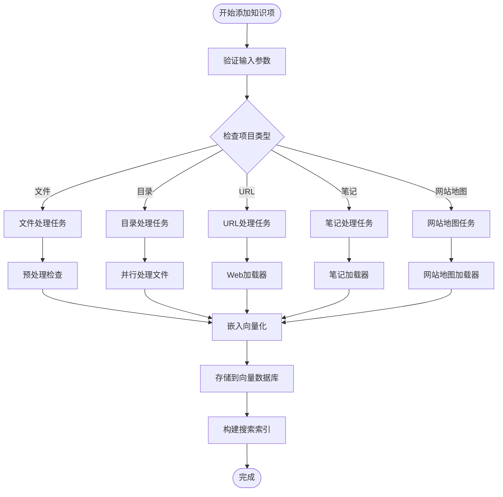

**图表来源**
- [KnowledgeService.ts](file://src/main/services/KnowledgeService.ts#L606-L650)

**章节来源**
- [KnowledgeService.ts](file://src/main/services/KnowledgeService.ts#L1-L746)

### MCPService - 模型上下文协议服务

MCPService实现了Model Context Protocol标准，提供与外部AI服务的标准化通信。

#### 协议支持

- **多种传输方式**：STDIO、HTTP、SSE、内存传输
- **认证机制**：OAuth2.0认证支持
- **缓存策略**：智能缓存减少重复请求
- **超时控制**：灵活的超时和重试机制

**章节来源**
- [MCPService.ts](file://src/main/services/MCPService.ts#L1-L923)

## 服务注册与依赖注入

Cherry Studio采用显式的依赖注入模式，通过构造函数传递所需的服务依赖。

### 注入模式

```mermaid
graph LR
subgraph "服务依赖图"
A[WindowService] --> B[ConfigManager]
C[ApiServerService] --> D[LoggerService]
E[KnowledgeService] --> F[LoggerService]
G[MCPService] --> H[CacheService]
G --> I[DxtService]
J[AppService] --> K[LoggerService]
end
subgraph "导入模式"
L[import { configManager } from './ConfigManager']
M[import { loggerService } from './LoggerService']
N[import { windowService } from './WindowService']
end
L --> B
M --> D
M --> F
M --> H
N --> B
```

**图表来源**
- [index.ts](file://src/main/index.ts#L17-L37)
- [WindowService.ts](file://src/main/services/WindowService.ts#L16)

### 服务初始化顺序

服务的初始化遵循严格的依赖顺序，确保每个服务都能正确获取其依赖：

1. **基础服务**：LoggerService → ConfigManager
2. **UI服务**：WindowService → ThemeService
3. **业务服务**：KnowledgeService → LoggerService
4. **系统服务**：AppService → LoggerService
5. **协议服务**：MCPService → CacheService

**章节来源**
- [index.ts](file://src/main/index.ts#L123-L200)

## 单例模式管理

所有核心服务都采用单例模式实现，确保全局状态的一致性和资源的有效利用。

### 单例实现模式

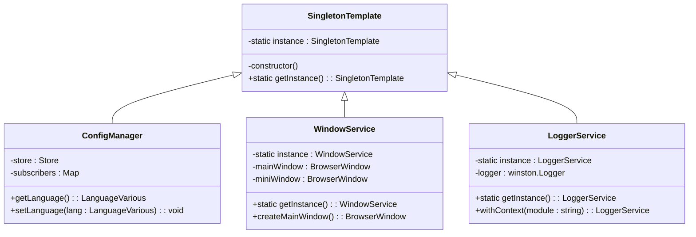

**图表来源**
- [ConfigManager.ts](file://src/main/services/ConfigManager.ts#L37-L43)
- [WindowService.ts](file://src/main/services/WindowService.ts#L36-L41)
- [LoggerService.ts](file://src/main/services/LoggerService.ts#L149-L156)

### 单例优势

- **内存效率**：避免重复实例化开销
- **状态一致性**：全局共享的状态管理
- **简化依赖**：无需复杂的依赖查找
- **性能优化**：快速的服务访问

**章节来源**
- [ConfigManager.ts](file://src/main/services/ConfigManager.ts#L37-L270)
- [WindowService.ts](file://src/main/services/WindowService.ts#L26-L685)
- [LoggerService.ts](file://src/main/services/LoggerService.ts#L51-L156)

## 服务间协作机制

### 订阅-发布模式

ConfigManager提供了强大的订阅-发布机制，实现服务间的松耦合通信。

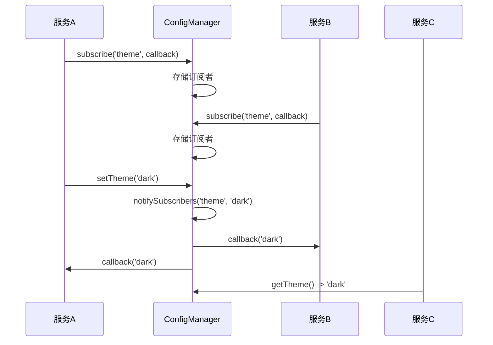

**图表来源**
- [ConfigManager.ts](file://src/main/services/ConfigManager.ts#L94-L116)

### IPC通信机制

服务间通过IPC通道进行异步通信，支持复杂的数据交换和事件传递。

**章节来源**
- [ConfigManager.ts](file://src/main/services/ConfigManager.ts#L94-L126)

## 生命周期管理

### 启动阶段

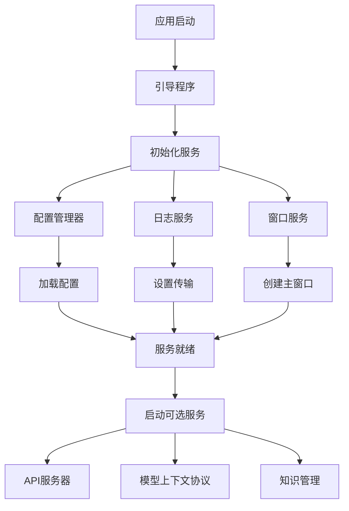

**图表来源**
- [index.ts](file://src/main/index.ts#L123-L200)
- [bootstrap.ts](file://src/main/bootstrap.ts#L1-L34)

### 关闭阶段

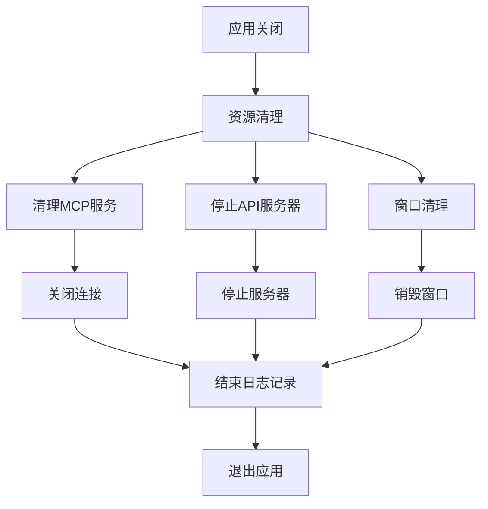

**图表来源**
- [index.ts](file://src/main/index.ts#L232-L251)

**章节来源**
- [index.ts](file://src/main/index.ts#L123-L257)

## 错误处理与资源清理

### 错误处理策略

Cherry Studio采用多层次的错误处理机制：

1. **服务级错误处理**：每个服务独立处理自身错误
2. **全局异常捕获**：进程级别的异常监控
3. **优雅降级**：服务故障时的备用方案
4. **错误恢复**：自动重试和状态恢复

### 资源清理机制


**章节来源**
- [index.ts](file://src/main/index.ts#L101-L112)
- [PowerMonitorService.ts](file://src/main/services/PowerMonitorService.ts#L57-L67)

## 扩展性设计

### 动态服务加载

Cherry Studio支持服务的动态加载和卸载，为插件系统奠定基础：

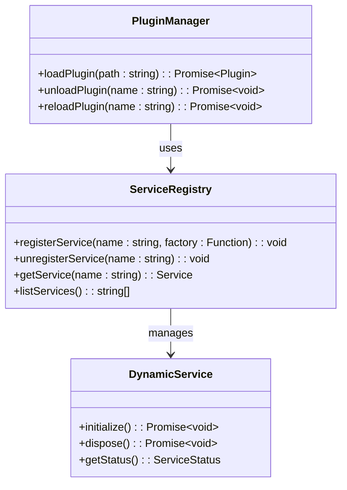

### 插件接口设计

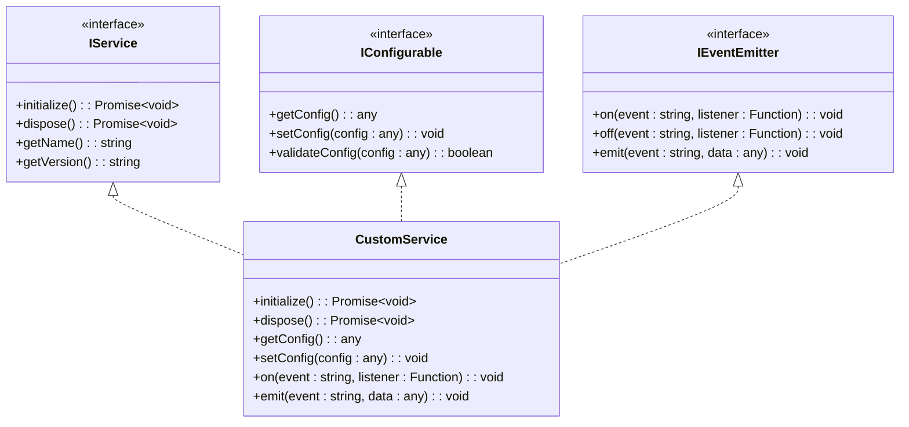

**章节来源**
- [MCPService.ts](file://src/main/services/MCPService.ts#L136-L158)

## 最佳实践

### 服务设计原则

1. **单一职责**：每个服务只负责一个明确的功能领域
2. **依赖倒置**：依赖抽象而非具体实现
3. **开放封闭**：对扩展开放，对修改封闭
4. **接口隔离**：提供细粒度的接口定义

### 性能优化建议

1. **懒加载**：按需初始化大型服务
2. **缓存策略**：合理使用内存缓存
3. **并发控制**：限制同时执行的任务数量
4. **资源池化**：复用昂贵的资源对象

### 调试和监控

1. **结构化日志**：使用统一的日志格式
2. **指标收集**：关键服务的性能指标
3. **健康检查**：定期检查服务状态
4. **链路追踪**：分布式调用的跟踪

### 安全考虑

1. **权限控制**：服务间的访问权限管理
2. **输入验证**：严格验证外部输入
3. **资源限制**：防止资源耗尽攻击
4. **加密存储**：敏感配置的安全存储

通过这种精心设计的服务架构，Cherry Studio实现了高度模块化、可扩展和可维护的主进程架构，为复杂的AI应用提供了坚实的技术基础。